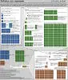
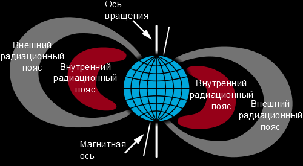
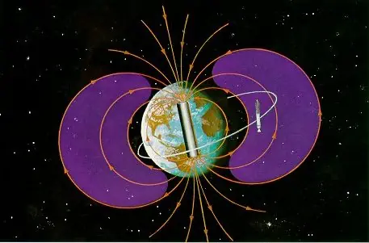

# Радиация
> 2019.05.12 [🚀](../../index/index.md) [despace](index.md) → [EF](ef.md), [Space](index.md), [Надёжность](qm.md)
> *Navigation:*
> **[FAQ](faq.md)**【**[SCS](scs.md)**·КК, **[SC (OE+SGM)](sc.md)**·КА】**[CON](contact.md)·[Pers](person.md)**·Контакт, **[Ctrl](control.md)**·Упр., **[Doc](doc.md)**·Док., **[Drawing](drawing.md)**·Чертёж, **[EF](ef.md)**·ВВФ, **[Error](error.md)**·Ошибки, **[Event](event.md)**·Событ., **[FS](fs.md)**·ТЭО, **[HF&E](hfe.md)**·Эрго., **[KT](kt.md)**·КТ, **[N&B](nnb.md)**·БНО, **[Project](project.md)**·Проект, **[QM](qm.md)**·БКНР, **[R&D](rnd.md)**·НИОКР, **[SI](si.md)**·СИ, **[Test](test.md)**·ЭО, **[TRL](trl.md)**·УГТ

**Table of contents:**

[TOC]

---

 

## 1. Ионизирующее излучение (ИИ)

> <small> ・**Ионизирующее излучение** — русскоязычный термин. **Ionizing radiation** — англоязычный эквивалент.  ・**Ионизирующее излучение космического пространства** — русскоязычный термин. **Outer space ionizing radiation** — англоязычный эквивалент.  ・**Радиация** — русскоязычный термин. **Radiation** — англоязычный эквивалент.</small>

**Ионизи́рующее излуче́ние (ИИ)** — потоки фотонов, элементарных частиц или осколков деления атомов, способные ионизировать вещество.

**Наведённая радиоактивность** — многие стабильные атомы в результате облучения и соответствующей индуцированной ядерной реакции превращаются в нестабильные изотопы. В результате такого облучения стабильное вещество становится радиоактивным, причем тип вторичного ИИ будет отличаться от первоначального облучения. Наиболее ярко такой эффект проявляется после нейтронного облучения.

**Цепочка ядерных превращений** — в процессе ядерного распада или синтеза возникают новые нуклиды, которые также могут быть нестабильны. В результате возникает цепочка ядерных превращений. Каждое превращение имеет свою вероятность и свой набор ИИ. В результате интенсивность и характер излучений радиоактивного источника может значительно меняться со временем.

К ИИ не относят видимый свет и ультрафиолетовое излучение, которые в отдельных случаях могут ионизировать вещество. Инфракрасное излучение и излучение радиодиапазонов не являются ИИ, т.к. их энергии недостаточно для ионизации атомов и молекул в основном состоянии.

| | |
|:-|:-|
|**Природные  источники  ИИ**|・Спонтанный радиоактивный распад радионуклидов.  ・Термоядерные реакции, например на [Солнце](sun.md).  ・Индуцированные ядерные реакции в результате попадания в ядро [высокоэнергетичных элементарных частиц](ion_rad.md) или слияния ядер.  ・[Космические лучи](ion_rad.md).|
|**Искусственные  источники  ИИ**|・Искусственные радионуклиды.  ・[Ядерные реакторы](nr.md).  ・Ускорители частиц (генерируют потоки заряженных частиц и тормозное фотонное излучение).  ・Рентгеновский (разновидность ускорителей), генерирует тормозное рентгеновское излучение.|

【**Table.** Manufacturers】

| | |
|:-|:-|
|**AE**|…|
|**AU**|…|
|**CA**|…|
|**CN**|…|
|**EU**|…|
|**IL**|…|
|**IN**|…|
|**JP**|…|
|**KR**|…|
|**RU**|…|
|**SA**|…|
|**SG**|…|
|**US**|・[DDC](contact/ddc.md)|
|**VN**|…|

### Измерение ИИ

**Методы измерения.**

   - Наиболее распространены дозиметры на базе счётчиков Гейгера (газоразрядный прибор, в котором ионизация газа излучением превращается в электрический ток между электродами). Как правило, такие приборы корректно регистрируют только гамма‑излучение. Некоторые приборы снабжаются фильтром, преобразующим β‑излучение в гамма‑кванты за счёт тормозного излучения. Счётчики Гейгера плохо селектируют излучения по энергии, для этого используют другую разновидность газоразрядного счётчика, т.н. пропорциональный счётчик.
   - Существуют полупроводниковые датчики ИИ. Принцип их действия [аналогичен](analogue.md) газоразрядным приборам с тем отличием, что ионизируется объём полупроводника между двумя электродами. В простейшем случае это обратносмещённый полупроводниковый диод. Для максимальной чувствительности такие детекторы имеют значительные размеры.
   - Широкое применение в науке получили сцинтилляторы. Эти приборы преобразуют энергию излучения в видимый свет за счет поглощения излучения в специальном веществе. Вспышка света регистрируется фотоэлектронным умножителем. Сцинтилляторы хорошо разделяют излучение по энергиям.
   - Для исследования потоков элементарных частиц применяют множество других методов, позволяющих полнее исследовать их свойства, например пузырьковая камера, камера Вильсона.

**Единицы измерения.** Эффективность взаимодействия ИИ с веществом зависит от типа излучения, энергии частиц и сечения взаимодействия облучаемого вещества. Важные показатели взаимодействия ИИ с веществом: ➀ линейная передача энергии (ЛПЭ), показывающая, какую энергию ИИ передаёт среде на единице длины пробега при единичной плотности вещества; ➁ поглощённая доза излучения, показывающая, какая энергия ИИ поглощается в единице массы вещества.

   - В Международной системе единиц СИ единицей поглощённой дозы является **грэй** (рус. **Гр**, междунар. **㏉**), численно равный поглощённой энергии в 1 Дж на 1 ㎏ массы вещества.
   - Иногда встречается устаревшая внесистемная единица **рад** (рус. **рад**; междунар. **rad**): доза, соответствующая поглощённой энергии 100 эрг на 1 грамм вещества. **1 рад = 0.01 ㏉** и **1 ㏉ = 100 рад**. Не путайте поглощённую дозу с эквивалентной поглощённой дозой.
   - **Зиверт** (рус. **Зв**, междунар. **Sv**) — единица измерения СИ эффективной и эквивалентной доз ИИ. 1 ㏜ — количество энергии, поглощённое килограммом биологической ткани, равное по воздействию поглощённой дозе 1 ㏉. 1 Sv = 1 Дж/кг = 1 м²/с² (для излучений с коэффициентом качества, равным 1.0).
   - Широко применяется устаревающее понятие экспозиционная доза излучения — величина, показывающая, какой заряд создаёт фотонное (гамма‑ или рентгеновское) излучение в единице объёма воздуха. Для этого обычно используют внесистемную единицу экспозиционной дозы **рентген** (рус. **Р**; междунар. **R**): доза фотонного излучения, образующего ионы с зарядом в 1 ед. заряда СГСЭ (⅓ × 10⁻⁹ кулон) в 1 ㎝³ воздуха. В системе СИ используется единица **кулон на килограмм** (рус. **Кл/кг**; междунар. **C/㎏**): 1 C/㎏ = 3 876 R; 1 R = 0.000.257.976 C/㎏.
   - Активность радиоактивного источника ИИ определяется как среднее количество распадов ядер в единицу времени. Соответствующая единица в  СИ **беккерель** (рус. **Бк**; междунар. **Bq**) обозначает количество распадов в секунду. Применяется также внесистемная единица **кюри** (рус. **Ки**; междунар. **Ci**). 1 Ки = 3.7×10¹⁰ Бк. Первоначальное определение этой единицы соответствовало активности 1 г ²²⁶Ra.
   - Корпускулярное ИИ также характеризуется кинетической энергией частиц. Наиболее распространена внесистемная единица **электронвольт** (рус. **эВ**, междунар. **eV**). Как правило радиоактивный источник генерирует частицы с определённым спектром энергий. Датчики излучений также имеют неравномерную чувствительность по энергии частиц.

### Свойства и воздействие
По механизму взаимодействия с веществом выделяют непосредственно потоки заряженных частиц и косвенно ИИ (потоки нейтральных элементарных частиц — фотонов и нейтронов). По механизму образования — первичное (рождённое в источнике) и вторичное (образованное в результате взаимодействия излучения другого типа с веществом) ИИ.

Энергия частиц ИИ лежит в диапазоне от нескольких сотен электронвольт (рентгеновское излучение, β‑излучение некоторых радионуклидов) до 10¹⁵ ‑ 10²⁰ и выше электронвольт (протоны космического излучения, для которых не обнаружено верхнего предела по энергии).

Длина пробега и проникающая способность сильно различаются — от микрометров в конденсированной среде (альфа‑излучение радионуклидов, осколки деления) до многих километров (высокоэнергетические мюоны космических лучей).

#### Воздействие на конструкцию
Длительное воздействие корпускулярных излучений или фотонных излучений сверхвысоких энергий может существенно изменять свойства конструкционных материалов. Изучением этих изменений занимается инженерная дисциплина радиационное материаловедение. Раздел физики, занимающийся исследованием поведения твердых тел под облучением, получил название радиационная физика твёрдого тела. Наиболее значимыми типами радиационных повреждений является:

   - разрушение кристаллической решетки вследствие выбивания атомов из узлов;
   - ионизация диэлектриков;
   - изменение химического состава веществ вследствие ядерных реакций.

Учёт радиационных повреждений инженерных конструкций наиболее актуален для ядерных реакторов и полупроводниковой электроники, рассчитанной на работу в условиях радиации.

#### Воздействие на полупроводники
Современные полупроводниковые технологии чувствительны к ИИ. Тем не менее, они широко применяются в военной и космической технике, в ядерной индустрии. При этом используется ряд технологических, схемотехнических и программных решений, уменьшающих последствия радиационного воздействия.

Основные типы радиационных повреждений, приводящих к разовым или необратимым отказам полупроводников:

   - Накопление электрического заряда в подзатворных диэлектриках вследствие ионизации. Приводит к смещению порога открывания полевых транзисторов и долговременному отказу. Уменьшение топологических норм увеличивает стойкость к такого типа повреждениям.
   - Стекание заряда в EEPROM и Flash памяти вследствие ионизации диэлектрика «кармана». Приводит к потере данных. Борются резервированием, избыточным кодированием и использованием других видов памяти.
   - Фотоэффект на p‑n переходах (аналогично солнечным батареям). Увеличивает паразитные утечки и ложные сигналы. Для борьбы с этим используются спец. технологии, например изоляция компонентов диэлектриком.
   - Космические тяжелые заряженные частицы (ТЗЧ) высоких энергий, ионизируя атомы, рождают в полупроводнике лавину электронов. Это может приводить к изменению состояния цифровых схем и мощным помехам в аналоговых схемах. В худшем случае к пробою изоляторов или тиристорному защелкиванию приборов с изоляцией p‑n переходом. С последним борются изоляцией диэлектриком; изоляцией двумя p‑n переходами (triple‑well процесс); контролем тока потребления узлов с перезапуском по аварийному росту потребления.
    Разрушение кристаллической структуры и изменение химического состава полупроводниковых приборов.

#### Химическое действие
Ионизирующее излучение может вызывать химические превращения вещества. Такие превращения изучает радиационная химия. Под действием ИИ происходят следующие превращения:

   - Превращение молекул кислорода в молекулы озона, из‑за чего металлы быстро окисляются.
   - Разложение воды на кислород и водород с образованием некоторого количества перекиси водорода.
   - Превращение аллотропических модификаций в более устойчивые: белого фосфора в красный, белого [олова](tin.md) в серое, алмаза в графит.
   - Разложение на простые вещества газов — углекислого, сернистого, сероводорода, хлороводорода, аммиака.
   - Полимеризация соединений, содержащих двойные и тройные связи.

#### Биовоздействие ИИ
Разные типы ИИ обладают разным разрушительным эффектом и разным способом воздействия на биологические ткани. Соответственно, одной и той же поглощённой дозе соответствует разная биологическая эффективность излучения. Поэтому для описания воздействия излучения на живые организмы вводят понятие относительной биологической эффективности излучения, которая измеряется с помощью коэффициента качества. Для рентгеновского, гамма‑ и β‑излучений коэффициент качества принят за 1. Для альфа‑излучения и осколков ядер коэффициент качества 10 ‑ 20. Нейтроны — 3 ‑ 20 в зависимости от энергии. Для заряженных частиц биологическая эффективность прямо связана с линейной передачей энергии данного типа частиц (средняя потеря энергии частицей на единицу длины пробега частицы в ткани).

Для учёта биологического эффекта поглощённой дозы была введена эквивалентная поглощённая доза ИИ, численно равная произведению поглощённой дозы на коэффициент биологической эффективности. В системе СИ эффективная и эквивалентная поглощенная доза измеряется в **зивертах** (русское обозначение: **Зв**; международное: **㏜**).

Ранее широко применялась единица измерения эквивалентной дозы бэр (от биологический эквивалент рентгена для гамма‑излучения; русское обозначение: **бэр**; международное: **rem**). Первоначально единица определялась как доза ИИ, производящего такое же биологическое действие, как и доза рентгеновского или гамма‑излучения, равная 1 Р. После принятия системы СИ под бэром стали понимать единицу, равную 0.01 Дж/кг. 1 бэр = 0.01 ㏜ = 100 эрг/г.

Помимо биологической эффективности, необходимо учитывать проникающую способность излучений. Например, тяжёлые ядра атомов и альфа‑частицы имеют крайне малую длину пробега в сколько‑нибудь плотном веществе, поэтому радиоактивные альфа‑источники опасны при попадании внутрь организма. Наоборот, гамма‑излучение обладает значительной проникающей способностью.

Некоторые радиоактивные изотопы способны встраиваться в процесс обмена веществ живого организма, замещая неактивные элементы. Это приводит к удержанию и накоплению радиоактивного вещества непосредственно в живых тканях, что существенно увеличивает опасность контакта. Например, широко известны йод‑131, изотопы стронция, плутония и т.п. Для характеристики этого явления используется понятие период полувыведения изотопа из организма.

**Механизмы биовоздействия**

Прямое действие ИИ — это прямое попадание в биологические молекулярные структуры клеток и в жидкие (водные) среды организма.

Непрямое или косвенное действие — действие свободных радикалов, возникающих в результате ионизации, создаваемой излучением в жидких средах организма и клеток. Свободные радикалы вызывают разрушения целостности цепочек макромолекул (белков и нуклеиновых кислот), что может привести как к массовой гибели клеток, так и канцерогенезу и мутагенезу. Наиболее подвержены воздействию ИИ активно делящиеся (эпителиальные, стволовые, также эмбриональные) клетки.

После действия излучения на организм в зависимости от дозы могут возникнуть детерминированные и стохастические радиобиологические эффекты. Например, порог появления симптомов острой лучевой болезни у человека составляет 1 ‑ 2 ㏜ на всё тело.

В отличие от детерминированных, стохастические эффекты не имеют чёткого дозового порога проявления. С увеличением дозы облучения возрастает лишь частота проявления этих эффектов. Проявиться они могут как спустя много лет после облучения (злокачественные новообразования), так и в последующих поколениях (мутации).

Основным источником информации о стохастических эффектах воздействия ИИ являются данные наблюдений за здоровьем людей, переживших атомные бомбардировки или радиационные аварии. Специалисты наблюдали 87 500 человек, переживших атомные бомбардировки. Средняя доза их облучения составила 0.24 ㏜. При этом прирост онкологических заболеваний за последующие годы составил 9 %. При дозах менее 0.1 ㏜ отличий между ожидаемой и наблюдаемой в реальности заболеваемостью никто в мире не установил.

**Гигиеническое нормирование ИИ**

Нормирование осуществляется по СанПин 2.6.1.2523‑09 «Нормы радиационной безопасности (НРБ‑99/2009)». Устанавливаются дозовые пределы эффективной дозы для следующих категорий лиц:

   - персонал — лица, работающие с техногенными источниками излучения (группа А) или находящиеся по условиям работы в сфере их воздействия (группа Б);
   - всё население, включая лиц из персонала, вне сферы и условий в их производственной деятельности.

Основные пределы доз и допустимые уровни облучения персонала группы Б равны четверти значений для персонала группы А. Эффективная доза для персонала не должна превышать за период трудовой деятельности (50 лет) 1 ㏜, а для обычного населения за всю жизнь — 0.07 ㏜. Планируемое повышенное облучение допускается только для мужчин старше 30 лет при их добровольном письменном согласии после информирования о возможных дозах облучения и риске для здоровья.

 

## 2. Космические лучи
> <small>**Космические лучи (КЛ)** — русскоязычный термин. **Cosmic rays (CR)** — англоязычный эквивалент.</small>

**Космические лучи (КЛ)** — элементарные частицы и ядра атомов, движущиеся с высокими энергиями в космическом пространстве. КЛ являются составляющей естественной (фоновой) радиации на поверхности Земли и в атмосфере. Изучение потоков высокоэнергетичных заряженных и нейтральных космических частиц, попадающих на границу атмосферы Земли, является важнейшими экспериментальными задачами.

Физику КЛ принято считать частью физики высоких энергий и физики элементарных частиц. Физика КЛ изучает:

   - процессы, приводящие к возникновению и ускорению КЛ;
   - частицы космических лучей, их природу и свойства;
   - явления, вызванные частицами КЛ в космическом пространстве, атмосфере Земли и планет.

Классификация по происхождению КЛ:

   - вне нашей Галактики
   - в Галактике
   - на [Солнце](sun.md)
   - в межпланетном пространстве

Первичными принято называть внегалактические и галактические лучи. Вторичными принято называть потоки частиц, проходящие и трансформирующиеся в атмосфере [Земли](earth.md).

Энергетический спектр КЛ на 43 % состоит из энергии протонов, ещё на 23 % — из энергии гелия (α‑частиц) и 34 % энергии, переносимой остальными частицами. По количеству частиц КЛ на 92 % состоят из протонов, на 6 % — из ядер гелия, около 1 % составляют более тяжёлые элементы, и около 1 % — электроны. При изучении источников КЛ вне Солнечной системы протонно‑ядерная компонента в основном обнаруживается по создаваемому ею потоку гамма‑лучей орбитальными гамма‑телескопами, а электронная компонента — по порождаемому ею синхротронному излучению, которое приходится на [радиодиапазон](comms.md) (в частности, на метровые волны — при излучении в магнитном поле межзвёздной среды), а при сильных магнитных полях в районе источника КЛ — и на более высокочастотные диапазоны. Поэтому электронная компонента может обнаруживаться и наземными астрономическими инструментами.

Традиционно частицы, наблюдаемые в КЛ, делят на следующие группы: **p (Z = 1), α (Z = 2), L (Z = 3 − 5), M (Z = 6 − 9), H (Z ≥ 10), VH (Z ≥ 20)** (соответственно, протоны, альфа‑частицы, лёгкие, средние, тяжёлые и сверхтяжёлые). Особенностью химического состава первичного космического излучения является аномально высокое (в несколько тысяч раз) содержание ядер группы L (литий, бериллий, бор) по сравнению с составом звёзд и межзвёздного газа. Данное явление объясняется тем, что механизм генерации космических частиц в первую очередь ускоряет тяжёлые ядра, которые при взаимодействии с протонами межзвёздной среды распадаются на более лёгкие ядра. Данное предположение подтверждается тем, что КЛ обладают очень высокой степенью изотропии.

### Альфа‑частица
**А́льфа‑части́ца** *(α‑частица)*, она же **тяжёлая заряженная частица (ТЗЧ)**  — положительно заряженная частица, образованная двумя протонами и двумя нейтронами, ядро атома гелия‑4. α‑частицы могут вызывать ядерные реакции; в первой искусственно вызванной ядерной реакции (Резерфорд, 1919, превращение ядер азота в ядра кислорода) участвовали именно α‑частицы. Поток α‑частиц называют α‑лучами или α‑излучением.

**Образование.** α‑частицы возникают при α‑распаде ядер, при ядерных реакциях и в результате полной ионизации атомов ⁴He. Например, в результате взаимодействия ядра ⁶Li с дейтроном могут образоваться две α‑частицы: ⁶Li+²H=⁴He+⁴He. α‑частицы составляют существенную часть первичных космических лучей; большинство из них являются ускоренными ядрами гелия из звёздных атмосфер и межзвёздного газа, некоторые возникли в результате ядерных реакций скалывания из более тяжёлых ядер космических лучей. α‑частицы высоких энергий могут быть получены с помощью ускорителей заряженных частиц.

**Воздействие:**

   - **На электронику.** Вышеописанный механизм рождения электронно‑дырочных пар α‑частицей в полупроводниках может вызвать несанкционированное переключение полупроводникового триггера при попадании α‑частицы с достаточной энергией на кремниевый чип. При этом единичный бит в памяти заменяется нулевым (или наоборот). Для уменьшения количества таких ошибок материалы, используемые в производстве микросхем, должны обладать низкой собственной α‑активностью.
   - **На человека.** α‑частицы, образованные при распаде ядра, имеют начальную кинетическую энергию 1.8 ‑ 15 МэВ. При движении α‑частицы в веществе она создаёт сильную ионизацию окружающих атомов и в результате очень быстро теряет энергию. Энергии α‑частиц, возникающих в результате радиоактивного распада, не хватает даже для преодоления мёртвого слоя кожи, поэтому радиационный риск при внешнем облучении такими α‑частицами отсутствует. Внешнее α‑облучение опасно для здоровья только в случае высокоэнергичных α‑частиц (с энергией выше десятков МэВ), источником которых является ускоритель. Однако проникновение α‑активных радионуклидов внутрь тела, когда облучению подвергаются непосредственно живые ткани организма, весьма опасно для здоровья, поскольку большая плотность ионизации вдоль трека частицы сильно повреждает биомолекулы. Считается, что при равном энерговыделении (поглощённой дозе) эквивалентная доза, набранная при внутреннем облучении α‑частицами с энергиями, характерными для радиоактивного распада, в 20 раз выше, чем при облучении гамма‑ и рентгеновскими квантами. Однако следует отметить, что линейная передача энергии высокоэнергичных α‑частиц (с энергиями > 200 МэВ) значительно меньше, в связи с чем их относительная биологическая эффективность сравнима с таковой для гамма‑квантов и β‑частиц. Т.о., опасность для человека при внешнем облучении могут представлять α‑частицы с энергиями > 10 МэВ, достаточными для преодоления омертвевшего рогового слоя кожного покрова. В то же время большинство исследовательских ускорителей α‑частиц работает на энергиях < 3 МэВ. Гораздо бо́льшую опасность для человека представляют α‑частицы, возникающие при α‑распаде радионуклидов, попавших внутрь организма (в частности, через дыхательные пути или пищеварительный тракт). Достаточно микроскопического количества α‑радиоактивного вещества (например, Po²¹⁰), чтобы вызвать у пострадавшего острую лучевую болезнь, зачастую с летальным исходом.

### Регистрация космических лучей
Долгое время после открытия космических лучей, методы их регистрации не отличались от методов регистрации частиц в ускорителях, чаще всего — газоразрядные счётчики или ядерные фотографические эмульсии, поднимаемые в стратосферу, или в космическое пространство. Но данный метод не позволяет вести систематические наблюдения частиц с высокой энергией, так как они появляются достаточно редко, а пространство, в котором такой счётчик может вести наблюдения, ограничено его размерами.

Современные обсерватории работают на других принципах. Когда высокоэнергетичная частица входит в атмосферу, она, взаимодействуя с атомами воздуха на первых 100 g/㎝², рождает целый шквал частиц, в основном пионов и мюонов, которые, в свою очередь, рождают другие частицы, и так далее. Образуется конус из частиц, который называют ливнем. Такие частицы двигаются со скоростью, превышающей скорость света в воздухе, благодаря чему возникает черенковское свечение, регистрируемое телескопами. Такая методика позволяет следить за областями неба площадью в сотни квадратных километров.

### Значение для космических полётов
Космонавты МКС, когда закрывают глаза, не чаще, чем раз в 3 минуты, видят вспышки света, возможно, это явление связано с воздействием частиц высоких энергий, попадающих в сетчатку глаза. Однако экспериментально это не подтверждено, возможно, что этот эффект имеет под собой исключительно психологические основы.

Длительное воздействие космической радиации способно очень негативно отразиться на здоровье человека. Для дальнейшей экспансии человечества к иным планетам Солнечной системы следует разработать надёжную защиту от подобных опасностей.

<mark>TBD</mark> А что для АМС? Им‑то почему плохо от космических лучей? <mark>TBD</mark>

### Потоки ВЗЧ в ОКП
В [околоземном космическом пространстве](near_space.md) (ОКП) различают несколько типов космических лучей. К стационарным принято относить галактические космические лучи (ГКЛ), частицы альбедо и радиационный пояс. К нестационарным — солнечные космические лучи (СКЛ).

#### Галактические космические лучи
**Галактические космические лучи (ГКЛ)** состоят из ядер различных химических элементов с кинетической энергией Е более нескольких десятков МэВ/нуклон, а также электронов и позитронов с Е>10 МэВ. Эти частицы приходят в межпланетное пространство из межзвёздной среды. Наиболее вероятными источниками космических лучей считаются вспышки сверхновых звёзд и образующиеся при этом пульсары. Электромагнитные поля пульсаров ускоряют заряженные частицы, которые затем рассеиваются на межзвёздных магнитных полях. Возможно, однако, что в области Е<100 МэВ/нуклон частицы образуются за счёт ускорения в межпланетной среде частиц солнечного ветра и межзвездного газа. Дифференциальный энергетический спектр ГКЛ носит степенной характер.

#### Вторичные частицы в магнитосфере Земли
Внутри магнитосферы, как и в любом дипольном поле, есть области, недоступные для частиц с кинетической энергией E, меньше критической. Те же частицы с энергией E<Eкр, которые всё‑таки уже там находятся, не могут эти области покинуть. Эти запрещённые области магнитосферы называются зонами захвата. В зонах захвата дипольного (квазидипольного) поля Земли действительно удерживаются значительные потоки захваченных частиц (прежде всего, протонов и электронов).

В [околоземном пространстве](near_space.md) можно выделить две торообразные области, расположенные в экваториальной плоскости примерно на расстоянии от 300 ㎞ (в зоне БМА) до 6 000 ㎞ (внутренний РПЗ) и от 12 000 ㎞ до 40 000 ㎞ (внешний РПЗ). Основным наполнением внутреннего пояса являются протоны с высокими энергиями 1 ‑ 1 000 МэВ, а внешнего — электроны.

Максимум интенсивности протонов низких энергий расположен на расстояниях L~3 радиусов Земли от её центра. Малоэнергичные электроны заполняют всю область захвата. Для них нет разделения на внутренний и внешний пояса. Поток протонов во внутреннем поясе довольно устойчив во времени.

Процесс взаимодействия ядер первичного космического излучения с атмосферой сопровождается возникновением нейтронов. Поток нейтронов, идущий от Земли (нейтроны альбедо), беспрепятственно проходит сквозь магнитное поле Земли. Поскольку нейтроны нестабильны (среднее время распада ~ 900 с), часть из них распадается в зонах, недоступных для заряженных частиц малых энергий. Таким образом, продукты распада нейтронов (протоны и электроны) рождаются прямо в зонах захвата. В зависимости от энергии и питч‑углов эти протоны и электроны могут либо оказаться захваченными, либо покинуть эту область.

**Частицы альбедо** — это вторичные частицы, отраженные от атмосферы Земли. Нейтроны альбедо обеспечивают радиационный пояс протонами с энергией до 1 000 МэВ и электронами с энергией до нескольких МэВ.

#### Солнечные космические лучи
**Солнечными космическими лучами (СКЛ)** называются энергичные заряженные частицы — электроны, протоны и ядра, — инжектированные Солнцем в межпланетное пространство. Энергия СКЛ простирается от нескольких кэВ до нескольких ГэВ. В нижней части этого диапазона СКЛ граничат с протонами высокоскоростных потоков солнечного ветра. Частицы СКЛ появляются вследствие солнечных вспышек.

#### Космические лучи ультравысоких энергий
Энергия некоторых частиц превышает предел ГЗК (Грайзена‑Зацепина‑Кузьмина) — теоретический предел энергии для космических лучей 5·10¹⁹ эВ, вызванный их взаимодействием с фотонами реликтового излучения. Несколько десятков таких частиц за год было зарегистрировано обсерваторией AGASA. Эти наблюдения ещё не имеют достаточно обоснованного научного объяснения.

 

## 3. Радиационные пояса
**Радиацио́нный по́яс** — область магнитосфер планет, в которой накапливаются и удерживаются проникшие в магнитосферу высокоэнергичные заряженные частицы (в основном протоны и электроны).

### Радиационный пояс Земли
> <small> ・**Радиационные пояса Земли (РПЗ)** — русскоязычный термин. **Van Allen radiation belt’s / Earth radiation belt** — англоязычный эквивалент.</small>

Другое название (обычно в западной литературе) — «радиационный пояс Ван Аллена» *(англ. Van Allen radiation belt)*.

| |
|:-|
||
||

Внутри магнитосферы, как и в любом дипольном поле, есть области, недоступные для частиц с кинетической энергией E, меньше критической. Те же частицы с энергией E < Екр, которые всё‑таки уже там находятся, не могут эти области покинуть. Эти запрещённые области магнитосферы называются зонами захвата. В зонах захвата дипольного (квазидипольного) поля Земли действительно удерживаются значительные потоки захваченных частиц (прежде всего, протонов и электронов).

Радиационный пояс в первом приближении представляет собой тороид, в котором выделяются две области:

   - внутренний радиационный пояс на высоте ≈ 4 000 ㎞ (300 ‑ 6 000), состоящий преимущественно из протонов с энергией в десятки МэВ;
   - внешний радиационный пояс на высоте ≈ 17 000 ㎞ (12 000 ‑ 40 000), состоящий преимущественно из электронов с энергией в десятки кэВ.

Высота нижней границы радиационного пояса меняется на одной и той же географической широте по долготам из‑за наклона оси магнитного поля Земли к оси вращения Земли, а на одной и той же географической долготе она меняется по широтам из‑за собственной формы радиационного пояса, обусловленной разной высотой силовых линий магнитного поля Земли. Например, над Атлантикой возрастание интенсивности излучения начинается на высоте 500 ㎞, а над Индонезией на высоте 1 300 ㎞. Если те же графики построить в зависимости от магнитной индукции, то все измерения уложатся на одну кривую, что ещё раз подтверждает магнитную природу захвата частиц.

Между внутренним и внешним радиационными поясами имеется щель, расположенная в интервале от 2 до 3  радиусов Земли. Потоки частиц во внешнем поясе больше, чем во внутреннем. Различен и состав частиц: во внутреннем поясе протоны и электроны, во внешнем — электроны. Применение неэкранированных детекторов существенно расширило сведения о радиационных поясах. Были обнаружены электроны и протоны с энергией несколько десятков и сотен килоэлектронвольт соответственно. Эти частицы имеют существенно иное пространственное распределение (по сравнению с проникающими).

Максимум интенсивности протонов низких энергий расположен на расстоянии около 3 радиусов Земли от её центра (приблизительно на высоте 12 500 ㎞ от поверхности). Малоэнергичные электроны заполняют всю область захвата. Для них нет разделения на внутренний и внешний пояса. Частицы с энергией десятки кэВ непривычно относить к космическим лучам, однако радиационные пояса представляют собой единое явление и должны изучаться в комплексе с частицами всех энергий.

Поток протонов во внутреннем поясе довольно устойчив во времени. Первые эксперименты показали, что электроны высокой энергии (E > 1 ‑ 5 МэВ) сосредоточены во внешнем поясе. Электроны с энергией меньше 1 МэВ заполняют почти всю магнитосферу. Внутренний пояс очень стабилен, тогда как внешний испытывает резкие колебания.

### Радиационные пояса планет
Благодаря наличию сильного магнитного поля планеты‑гиганты ([Юпитер](jupiter.md), [Сатурн](saturn.md), [Уран](uranus.md) и [Нептун](neptune.md)) также обладают сильными радиационными поясами, напоминающими внешний радиационный пояс Земли.

Советские и американские космические зонды показали, что [Venus](venus.md), [Марс](mars.md), [Меркурий](mercury.md) и [Луна](moon.md) радиационных поясов не имеют.

## 4. Typical requirements

**1.** During the flight, the OE & structure are exposed to ionizing radiation from outer space, namely:

   - protons & ions of **solar cosmic rays (SCR)**;
   - protons & heavy nuclei of **galactic cosmic rays (GCR)**;
   - electrons & protons of the **Earth’s radiation belts (ERB)** at the stage of a SC insertion into the interplanetary trajectory. A ERB is a zone of energetic charged particles, most of which originate from the solar wind, that are captured by & held around a planet by that planet's magnetosphere. Earth has two such belts, & sometimes others may be temporarily created; two main belts are located at ~ 640 ‑ 58 000 ㎞ above the surface. The belts trap energetic electrons & protons.

**2.** Radiation conditions are calculated using COSRAD & are unique in most cases. The value of the local absorbed dose depends on the location of the OE on the SC & its shielding by other elements. Some examples of the absorbed doses for a SC are provided below (protection by aluminum, absorbing by silicon, form of protection — sphere).

【**Table.** Absorbed doses for 1 year of flight on the 1 000 ㎞ above the Earth’s surface, ㏉】

|*Protection thickness  (Al), g/㎝² (height, ㎜)*|*Electrons + Protons  ERB, SCR, GCR*|*Notes*|
|:-|:-|:-|
|0.01 (0.03703)|15 600 000|equal to open surface|
|0.1 (0.3703)|3 450 000|equal to MLI|
|0.5 (1.851)|50 000| |
|0.7 (2.59)|9 500| |
|1 (3.703)|1 220| |
|2 (7.4)|23| |
|3 (11.1)|12| |
|10 (37)|1.8| |

【**Table.** Absorbed doses for 1 year of flight on the Earth’s geostationary orbit, ㏉】

|*Protection thickness  (Al), g/㎝² (height, ㎜)*|*Electrons  ERB*|*Protons  ERB, SCR, GCR*|*Notes*|
|:-|:-|:-|:-|
|0.01 (0.03703)|18 000 000|3 800|equal to open surface|
|0.1 (0.3703)|4 000 000|1 100|equal to MLI|
|0.5 (1.851)|58 000|800| |
|0.7 (2.59)|11 000|680| |
|1 (3.703)|1 000|500| |
|2 (7.4)|1|280| |
|3 (11.1)|0|150| |
|10 (37)|0|22| |

【**Table.** Absorbed doses for 14 days of launching on an interplanetary trajectory & flight to the Moon, ㏉】

|*Protection thickness  (Al), g/㎝² (height, ㎜)*|*Electrons  ERB*|*Protons  ERB*|*SCR*|*GCR*|*Total  dose*|*Notes*|
|:-|:-|:-|:-|:-|:-|:-|
|0.01 (0.03703)|61|440|115|0.00159|616|equal to open surface|
|0.1 (0.3703)|4.84|0.498|75|0.000534|80.30|equal to MLI|
|0.5 (1.851)|0.59|0.00424|30|0.000533|30.60| |
|0.7 (2.59)|0.312|0.00164|20|0.000538|20.30| |
|1 (3.703)|0.118|0.000629|9.5|0.000538|9.62| |
|2 (7.4)|0.000720|0.000166|2.5|0.000532|2.50| |
|3 (11.1)|0.000555|0.0000362|0.5|0.000524|0.501| |
|10 (37)|0.000220|0|0.025|0.000484|0.0257| |

【**Table.** Absorbed doses for 1 year of flight on a circular Lunar orbit, ㏉】

|*Protection thickness  (Al), g/㎝² (height, ㎜)*|*Electrons  ERB*|*Protons  ERB*|*SCR*|*GCR*|*Total  dose*|*Notes*|
|:-|:-|:-|:-|:-|:-|:-|
|0.01 (0.03703)|0|0|468|0.21|468|equal to open surface|
|0.1 (0.3703)|0|0|88|0.134|88.9|equal to MLI|
|0.5 (1.851)|0|0|46|0.132|46.13| |
|0.7 (2.59)|0|0|30.6|0.131|30.75| |
|1 (3.703)|0|0|6.2|0.129|6.39| |
|2 (7.4)|…|…|…|…|…| |
|3 (11.1)|0|0|1.81|0.125|1.936| |
|10 (37)|0|0|0.315|0.116|0.431| |
|31.6 (117)|0|0|0.045|0.091|0.136| |
|100 (370)|0|0|0.00395|0.079|0.0829| |

**3.** One of the most important physical characteristics necessary to estimate the amount of random single effects during the flight (reversible malfunctions & failures) are differential spectra of linear energy transfer (LET spectra) heavy charged particles: nuclei GCR (with charges 2 ≤ z ≤ 92) & SCR ions (with charges 2 ≤ z ≤ 28). These characteristics must be calculated separately for each mission.

**4.** To ensure the failure‑free operation of the OE, the electronic components must have the following sensitivity parameters to single failures: the threshold value of the linear energy transfer heavy particles Lₒ ≥ 40 MeV/(㎎/㎝²), the saturation cross section σₒ ≤ 0.01 ㎝² per chip. If it is impossible to meet the specified requirements for the sensitivity parameters of electronic components, the OE fault tolerance must be ensured by circuitry & structural‑functional methods.

**5.** When choosing EEE products, the recommended dose resistance shall be at least 300 ㏉ (30 000 rad). If it’s impossible to meet these requirements, the dose resistance of the OE is justified by calculating the dose safety factor.

 

## Docs & links (TRANSLATEME ALREADY)
|*Sections & pages*|
|:-|
|**【[External factors (EF)](ef.md)】**  [Astro.object](aob.md)・ [Atmosphere](atmosphere.md)・ [Atmosphere of Earth](earth.md)・ [Cosmic rays](ion_rad.md)・ [EMI](emi.md)・ [Grav.waves](gravwave.md)・ [Ion.radiation](ion_rad.md)・ [Radio frequency](comms.md)・ [Solar phenomena](solar_ph.md)・ [Space debris](sdeb.md)・ [Standart conditions](sctp.md)・ [Time](time.md)・ [VA radiation belts](ion_rad.md)|

   1. Docs: …
   1. <https://en.wikipedia.org/wiki/Dosimetry>
   1. <https://en.wikipedia.org/wiki/Ionizing_radiation>
   1. <https://habr.com/ru/post/440916/>
   1. <https://en.wikipedia.org/wiki/Cosmic_ray>
   1. <https://en.wikipedia.org/wiki/Alpha_particle>
   1. <https://en.wikipedia.org/wiki/Van_Allen_radiation_belt>
   1. <https://geektimes.ru/post/253616/>
