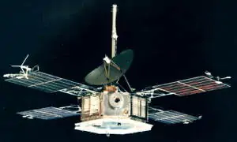

# Mariner 5
> 2019.12.10 [🚀](../../index/index.md) [despace](index.md) → [Venus](venus.md), **[Project](project.md)**  
> *Navigation:*  
> **[FAQ](faq.md)**【**[SCS](scs.md)**·КК, **[SC (OE+SGM)](sc.md)**·КА】**[CON](contact.md)·[Pers](person.md)**·Контакт, **[Ctrl](control.md)**·Упр., **[Doc](doc.md)**·Док., **[Drawing](drawing.md)**·Чертёж, **[EF](ef.md)**·ВВФ, **[Error](error.md)**·Ошибки, **[Event](event.md)**·Событ., **[FS](fs.md)**·ТЭО, **[HF&E](hfe.md)**·Эрго., **[KT](kt.md)**·КТ, **[N&B](nnb.md)**·БНО, **[Project](project.md)**·Проект, **[QM](qm.md)**·БКНР, **[R&D](rnd.md)**·НИОКР, **[SI](si.md)**·СИ, **[Test](test.md)**·ЭО, **[TRL](trl.md)**·УГТ

**Table of contents:**

[TOC]

---

> <small>**Mariner 5** — EN term. **Маринер‑5** — rough RU analogue.</small>

**Mariner 5 (Mariner Venus 1967)** was a spacecraft of the Mariner program that carried a complement of experiments to probe Venus’s atmosphere by radio occultation, measure the hydrogen Lyman‑alpha (hard ultraviolet) spectrum, and sample the solar particles and magnetic field fluctuations above the planet.

 

|*Type*|*[Param.](si.md)*|
|:-|:-|
|**【Mission】**|• • •|
|Cost|… or … of [gold](sc_price.md)|
|Development|…|
|Duration|1 year 4 months (launch to last contact)|
|Launch|June 14, 1967, 06:01:00 UTC, Rocket: Atlas‑SLV3 Agena-D|
|Operator|NASA / JPL|
|Programme|Mariner|
|Similar to|・Proposed: …  ・Current: [Venera 4](venera_4.md)  ・Past: [Mariner 2](mariner_2.md)|
|Target|Determine the parameters of the signal in the radio illumination of the atmosphere; measurement interplanetary and Venusian magnetic fields, charged particles, plasma, radio refractivity and UV emissions of the Venusian atmosphere|
|[Type](sc.md)|Fly‑by spacecraft|
|**【Spacecraft】**|• • •|
|Comms|S‑band|
|Composition|Orbiter|
|Contractor|…|
|[ID](spaceid.md)|NSSDC ID (COSPAR ID): [1967-060A ⎆](https://nssdc.gsfc.nasa.gov/nmc/spacecraft/display.action?:id=1967-060A), SCN: 02845|
|Manufacturer|JPL|
|Mass|Dry 244.9 ㎏ ([minisatellite](sc.md), [EVN‑070](venus.md))|
|Orbit / Site|Heliocentric|
|Payload|Instruments for measuring magnetic fields, charged particles, plasma, radio refractivity and UV emissions of the atmosphere|
|Power|170 W|

Achieved targets & investigations:

   - **T** — technical; **C** — contact research; **D** — distant research; **F** — fly‑by; **H** — manned; **S** — soil sample return; **X** — technology demonstration
   - **Sections of measurement and observation:**
      - Atmospheric/climate — **Ac** composition, **Ai** imaging, **Am** mapping, **Ap** pressure, **As** samples, **At** temperature, **Aw** wind speed/direction.
      - General — **Gi** planet’s interactions with outer space.
      - Soil/surface — **Sc** composition, **Si** imaging, **Sm** mapping, **Ss** samples.

<small>

|*EVN‑XXX*|*T*|*EN*|*Section of m&o*|*D*|*C*|*F*|*H*|*S*|
|:-|:-|:-|:-|:-|:-|:-|:-|:-|
|EVN‑001| |Atmosphere: preliminary model.| |D|C|F| | |
|EVN‑005|T|Exploration: from Venusian orbit.| |D| |F| | |
|EVN‑028| |Magnetosphere structure.| |D| |F| | |
|EVN‑070|T|Exploration with [satellites](sc.md): minisatellites.| |D| |F| | |

</small>

 

##  Mission
The launch took place on June 14, 1967 from Cape Canaveral Air Force Station Launch Complex 12 on Atlas vehicle 5401.

Mariner 5 flew by Venus on October 19 that year at an altitude of 3 990 km ([EVN‑005](venus.md)). With more sensitive instruments than its predecessor [Mariner 2](mariner_2.md), Mariner 5 was able to shed new light on the hot, cloud-covered planet and on conditions in interplanetary space.

Radio occultation data from Mariner 5 helped to understand the temperature and pressure data returned by the [Venera 4](venera_4.md) lander, which arrived at Venus shortly before it. After these missions, it was clear that Venus had a very hot surface and an atmosphere even denser than expected ([EVN‑001](venus.md)).

The operations of Mariner 5 ended in November 1967 and it is now defunct in a heliocentric orbit.

 

## Science goals & payload
The main goal of the Mariner 5 was to determine the parameters of the signal in the radio illumination of the atmosphere of Venus.

Also, Mariner 5’s goals included to measure interplanetary and Venusian magnetic fields ([EVN‑028](venus.md)), charged particles, plasma, radio refractivity and UV emissions of the Venusian atmosphere.

   - Helium Magnetometer, mounted on the waveguideleading to the omnidirectional antenna, to measure the magnitude and other characteristics of the interplanetary and planetary magnetic fields;
   - Interplanetary Ion Plasma Probe for E/Q of 40 to 9 400 Volts;
   - Trapped Radiation Detector, used to detect, track, and/or identify ionizing particles, such as those produced by nuclear decay, cosmic radiation, or reactiond in a particle accelerator;
   - Two-Frequency Beacon Receiver;
   - Ultraviolet Photometer.

 

## Spacecraft
Mariner 5 was actually built as a backup to Mariner 4, but after the success of the Mariner 4 mission, it was modified for the Venus mission by removing the TV camera, reversing and reducing the four solar panels, and adding extra thermal insulation.

The Mariner 5 consisted of an octagonal magnesium frame, 127 ㎝ across a diagonal and 45.7 ㎝ high. A 116.8 ㎝ diameter was mounted at the top of the frame as well. An omnidirectional low‑gain antenna was mounted on a 223.5 ㎝ tall mast next to the high‑gain antenna. The overall height of the spacecraft was 2.89 m. The octagonal frame housed the electronic equipment, cabling, midcourse propulsion system, and attitude control gas supplies and regulators.

 

## Community, library, links

**PEOPLE:**

<mark>TBD</mark>

**COMMUNITY:**

<mark>TBD</mark>

 

## Docs & links
|*Sections & pages*|
|:-|
|**ã€】**  <mark>NOCAT</mark>|

   1. Docs:
      - П. С. Шубин — Венера. Неукротимая планета. Издание второе, расширенное и дополненное. М.: Издательство «Голос‑Пресс»; Кемерово: издатель П. С. Шубин, 2018. – 352 стр.
   1. <https://en.wikipedia.org/wiki/mariner_5>
   1. <https://en.wikipedia.org/wiki/mariner_4>
