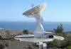
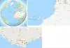

# Maspalomas Station
> 2019.05.12 [🚀](../../index/index.md) [despace](index.md) → [НК](scs.md), **[НС](scs.md)**  
> *Navigation:*  
> **[FAQ](faq.md)**【**[SCS](scs.md)**·КК, **[SC (OE+SGM)](sc.md)**·КА】**[CON](contact.md)·[Pers](person.md)**·Контакт, **[Ctrl](control.md)**·Упр., **[Doc](doc.md)**·Док., **[Drawing](drawing.md)**·Чертёж, **[EF](ef.md)**·ВВФ, **[Error](error.md)**·Ошибки, **[Event](event.md)**·Событ., **[FS](fs.md)**·ТЭО, **[HF&E](hfe.md)**·Эрго., **[KT](kt.md)**·КТ, **[N&B](nnb.md)**·БНО, **[Project](project.md)**·Проект, **[QM](qm.md)**·БКНР, **[R&D](rnd.md)**·НИОКР, **[SI](si.md)**·СИ, **[Test](test.md)**·ЭО, **[TRL](trl.md)**·УГТ

**Table of contents:**

[TOC]

---

> <small>**Maspalomas Station** — англоязычный термин, не имеющий аналога в русском языке. **Станция Маспаломас** — дословный перевод с английского на русский.</small>

**Maspalomas Station** is an INTA‑operated, [ESTRACK](estrack.md) radio antenna station for communication with spacecraft located at the southern area of Gran Canaria island, on the INTA campus. The site hosts a 15‑metre antenna with reception in S‑ and X‑[band](comms.md) and transmission in S‑band.

|*Фото*|*Карта*|
|:-|:-|
|||

## Характеристики
|*Характеристика*|*Описание*|
|:-|:-|
|Антенны|15 м — 1 шт.|
|Дальность связи, ㎞| |
|[Диапазоны частот](comms.md)|S, X — 🚀↘; S — ♁↗|
|Расстояние до…|3 000 — до экватора;  5 500 — до NASA;  5 800 — до НПОЛ|

 

## Docs & links (TRANSLATEME ALREADY)
|*Sections & pages*|
|:-|
|**`Наземная станция (НС):`**  …    [CDSN](cdsn.md)・ [DSN](dsn.md)・ [ESTRACK](estrack.md)・ [IDSN](idsn.md)・ [SSC_GGSN](ssc_ggsn.md)・ [UDSC](udsc.md)|

   1. Docs: …
   1. <http://en.wikipedia.org/wiki/Maspalomas_Station>
   1. <https://www.esa.int/Our_Activities/Operations/Estrack/Maspalomas_station>

