# Messenger
> Ver. . [🚀](../../index/index.md) [despace](index.md) → **** <mark>NOCAT</mark>
> *Navigation:*
> **[FAQ](faq.md)**【**[SCS](scs.md)**·КК, **[SC (OE+SGM)](sc.md)**·КА】**[CON](contact.md)·[Pers](person.md)**·Контакт, **[Ctrl](control.md)**·Упр., **[Doc](doc.md)**·Док., **[Drawing](drawing.md)**·Чертёж, **[EF](ef.md)**·ВВФ, **[Error](error.md)**·Ошибки, **[Event](event.md)**·Событ., **[FS](fs.md)**·ТЭО, **[HF&E](hfe.md)**·Эрго., **[KT](kt.md)**·КТ, **[N&B](nnb.md)**·БНО, **[Project](project.md)**·Проект, **[QM](qm.md)**·БКНР, **[R&D](rnd.md)**·НИОКР, **[SI](si.md)**·СИ, **[Test](test.md)**·ЭО, **[TRL](trl.md)**·УГТ

**Table of contents:**

[TOC]

---

> <small>**MESSENGER (MErcury Surface, Space ENvironment, GEochemistry and Ranging)** — EN term. **Мессенджер** — RU analogue.</small>

**MESSENGER** was a NASA robotic spacecraft that orbited the planet Mercury between 2011 and 2015, studying Mercury’s chemical composition, geology, and magnetic field.

[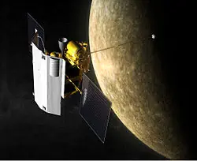](f/project/m/messenger/messeger.webp)

 

|*Type*|*[Param.](si.md)*|
|:-|:-|
|**【Mission】**|• • •|
|Cost|US$450 million or 34 161 ㎏ of [gold](sc_price.md)|
|Development|…|
|Duration|10 years, 8 months and 27 days|
|Launch|August 3, 2004, 06:15:56 UTC, Rocket: Delta II 7925H-9.5|
|Operator|NASA|
|Programme|Discovery Program|
|Similar to|・Proposed: Меркурий‑П (2031), [BepiColombo](bepicolombo.md)   ・Current: …   ・Past: [mariner_10](mariner_10.md)|
|Target|Study of the planet Mercury: geological history, global magnetic field, size and state of the core, exosphere.|
|[Type](sc.md)|Orbiter spacecraft|
|**【Spacecraft】**|• • •|
|Composition|Orbiter|
|Contractor|…|
|Manufacturer|Applied Physics Laboratory|
| |**`…`**|
|Comms|Circularly polarized X‑band phased-array antennas|
|[ID](spaceid.md)|NSSDC ID (COSPAR ID): 2004-030A, SCN: 28391|
|Mass|**Launch:** 1 107.9 ㎏ ([Large satellite](спутник.md), [EVN‑073](evn_073.md))|
|Orbit / Site|Hermiocentric; 200 × 10 300 ㎞; I = 80 degrees; T = 12 h|
|Payload|Radio Science, 5 Spectometers, Mercury Dual Imaging System, Magnetometer, Mercury Laser Altimeter|
|Power|450 W|

Targets & investigations:

   - **T** — technical; **C** — contact research; **D** — distant research; **F** — fly‑by; **H** — manned; **S** — soil sample return; **X** — technology demonstration
   - **Sections of measurement and observation:**
      - Atmospheric/climate — **Ac** composition, **Ai** imaging, **Am** mapping, **Ap** pressure, **As** samples, **At** temperature, **Aw** wind speed/direction.
      - General — **Gi** planet’s interactions with outer space.
      - Soil/surface — **Sc** composition, **Si** imaging, **Sm** mapping, **Ss** samples.

<small>

|*EVN‑XXX*|*T*|*EN*|*Section of m&o*|*D*|*C*|*F*|*H*|*S*|
|:-|:-|:-|:-|:-|:-|:-|:-|:-|
|EVN‑005|T|Exploration: from Venusian orbit.| |D| |F| | |
|EVN‑014| |Atmosphere: composition.| |D| | |F| |
|EVN‑073|T|Exploration with [satellites](sc.md): large satellites.| |D| |F| | |

</small>

 

## Mission
MESSENGER was launched aboard a Delta II rocket in August 2004. Traveling to Mercury requires an extremely large velocity change because Mercury’s orbit is deep in the Sun’s gravity well.

MESSENGER extensively used gravity assist maneuvers at Earth, Venus, and Mercury to reduce the speed relative to Mercury, then used its large rocket engine to enter into an elliptical orbit around the planet. To further minimize the amount of necessary propellant, the spacecraft orbital insertion targeted a highly elliptical orbit around Mercury.

**Timeline of key events**

|*Date*|*Event*|
|:-|:-|
|August 3, 2004|Spacecraft launched at 06:15:56 UTC|
|August 2, 2005|Fly‑by encounter with Earth|
|October 24, 2006|First fly‑by encounter with Venus|
|June 5, 2007|Second fly‑by encounter with Venus|
|January 14, 2008|First fly‑by encounter with Mercury|
|October 2, 2008|Second fly‑by encounter with Mercury|
|September 28, 2009|Third fly‑by encounter with Mercury|
|March 18, 2011|Mercury orbital insertion|
|March 17, 2012|Commencement of first extended mission|
|March 17, 2013|Completion of first extended mission / Commencement of second extended mission|
|April 30, 2015|End of mission|

**Interplanetary trajectory of the MESSENGER orbiter.**
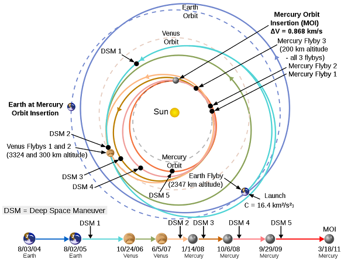

**Earth fly‑by**

MESSENGER performed an Earth fly‑by on August 2, 2005, with the closest approach at 19:13 UTC at an altitude of 2 347 ㎞ over central Mongolia.

During the Earth fly‑by, the MESSENGER team imaged the Earth and Moon using MDIS and checked the status of several other instruments observing the atmospheric and surface compositions and testing the magnetosphere and determining that all instruments tested were working as expected.

|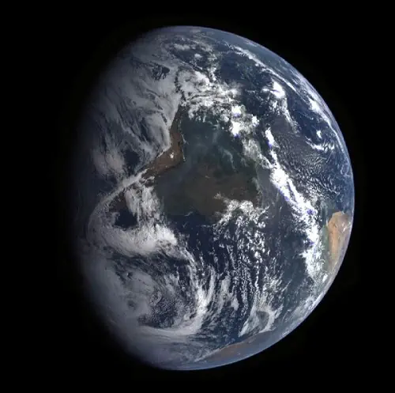|
|:-|
|***A view of Earth from MESSENGER during its Earth fly‑by.***|

**Two Venus fly‑bys**

On October 24, 2006 at 08:34 UTC, MESSENGER encountered Venus at an altitude of 2 992 ㎞. During the encounter, MESSENGER passed behind Venus and entered superior conjunction, a period when Earth was on the exact opposite side of the Solar System, with the Sun inhibiting radio contact. For this reason, no scientific observations were conducted during the fly‑by. Communication with the spacecraft was reestablished in late November and performed a deep space maneuver on December 12, to correct the trajectory to encounter Venus in a second fly‑by.

On June 5, 2007, at 23:08 UTC, MESSENGER performed a second fly‑by of Venus at an altitude of 338 ㎞, for the greatest velocity reduction of the mission. During the encounter, all instruments were used to observe Venus ([EVN‑005](evn_005.md)) and prepare for the following Mercury encounters. The encounter provided visible and near‑infrared imaging data of the upper atmosphere of Venus. Ultraviolet and X‑ray spectrometry of the upper atmosphere were also recorded, to characterize the composition ([EVN‑014](EVN_014)). The ESA’s [Venus Express](venus_express.md) was also orbiting during the encounter, providing the first opportunity for simultaneous measurement of particle-and-field characteristics of the planet.

||
|:-|
|***A detailed image of Venus MESSENGER on the second fly‑by of the planet.***|

**Three Mercury fly‑bys**

MESSENGER made a fly‑by of Mercury on January 14, 2008 (making its closest approach of 200 ㎞ above the surface of Mercury at 19:04:39 UTC, followed by a second fly‑by on October 6, 2008. MESSENGER executed a final fly‑by on September 29, 2009, further slowing down the spacecraft. One last deep space maneuver, DSM-5, was executed on November 24, 2009, at 22:45 UTC to provide the required velocity change for the scheduled Mercury orbit insertion on March 18, 2011, marking the beginning of the orbital mission.

On July 3, 2008, the MESSENGER team announced that the Orbiter had discovered large amounts of water present in Mercury’s exosphere, which was an unexpected finding. In the later years of its mission, MESSENGER also provided visual evidence of past volcanic activity on the surface of Mercury, as well as evidence for a liquid iron planetary core. The Orbiter also constructed the most detailed and accurate maps of Mercury to date, and furthermore discovered carbon-containing organic compounds and water ice inside permanently shadowed craters near the north pole.

**Images of Mercury taken by MESSENGER**

|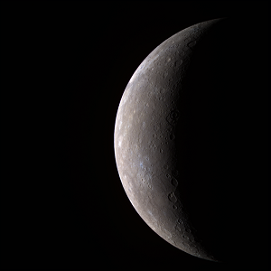||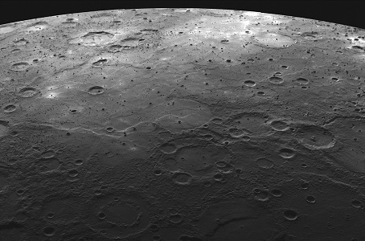|
|:-|:-|:-|
|***The first high‑resolution color Wide Angle Camera image of Mercury acquired by MESSENGER.***|***Smooth plains on Mercury imaged by MESSENGER during the third fly‑by of the planet.***|***Lava-flooded craters and large expanses of smooth volcanic plains on Mercury.***|

 

|***Animation of ’s trajectory from October 19, 1989, to September 30, 2003***| |
|:-|:-|
||**Pink — MESSENGER    Blue — Earth    Turquoise — Venus    Green — Mercury    Yellow — Sun**|

MESSENGER entered elongated orbit around Mercury on March 18, 2011, becoming the first spacecraft to do so. **The primary mission** began on April 4, 2011. The elongated orbit had two benefits: It allowed the spacecraft time to cool after the times it was between the hot surface of Mercury and the Sun, and also it allowed the spacecraft to measure the effects of solar wind and the magnetic fields of the planet at various distances while still allowing close-up measurements and photographs of the surface and exosphere.

On October 5, 2011, the scientific results obtained by MESSENGER during its first six terrestrial months in Mercury’s orbit were presented in a series of papers at the European Planetary Science Congress. Among the discoveries presented were the unexpectedly high concentrations of magnesium and calcium found on Mercury’s nightside, and the fact that Mercury’s magnetic field is offset far to the north of the planet’s center.

*A MESSENGER image of Mercury shows that Mercury is still contracting, and that Earth is not the only tectonicly active Solar System planet.*

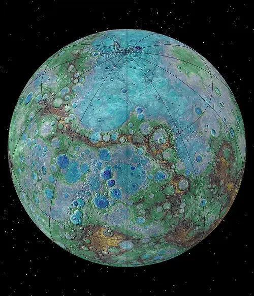

In November 2011, NASA announced that the MESSENGER mission would be extended by one year, allowing the spacecraft to observe the 2012 solar maximum. The primary mission was completed on March 17, 2012, having collected close to 100 000 images.

**Extended mission** began on March 17, 2012, and continued until March 17, 2013. MESSENGER achieved 100 % mapping of Mercury on March 6, 2013. Between April 16 and April 20, 2012, MESSENGER carried out a series of thruster manoeuvres, placing it in an eight-hour orbit to conduct further scans of Mercury. In November 2012, NASA reported that MESSENGER had discovered both water ice and organic compounds in permanently shadowed craters in Mercury’s north pole. In February 2013, NASA published the most detailed and accurate 3D map of Mercury to date, assembled from thousands of images taken by MESSENGER. MESSENGER completed its first extended mission on March 17, 2013.

MESSENGER’s **second extended mission** lasted for over two years, but as its low orbit degraded, it required reboosts to avoid impact. In November 2013, MESSENGER was among the numerous space assets that imaged Comet Encke (2P/Encke) and Comet ISON (C/2012 S1). As its orbit began to decay in early 2015, MESSENGER was able to take highly detailed close-up photographs of ice-filled craters and other landforms at Mercury’s north pole. After the mission was completed, review of the radio ranging data provided the first measurement of the rate of mass loss from the Sun. MESSENGER conducted its final reboost burns on October 24, 2014, and January 21, 2015, before crashing into Mercury on April 30, 2015.

 

## Science goals & payload
Mercury is one of the most poorly studied objects in the Solar system. Before MESSENGER it was investigated only by one spacecraft − Mariner-10, 3 times flew near the planet in 1974-1975. Less than half of the surface of Mercury was captured, and there was no data on the chemical composition, structure of the planet, and much more. To fill these gaps, NASA organized the Messenger mission. Specifically, the scientific objectives of the mission were:

   - to characterize the chemical composition of Mercury’s surface.
   - to study the planet’s geologic history.
   - to elucidate the nature of the global magnetic field (magnetosphere).
   - to determine the size and state of the core.
   - to determine the volatile inventory at the poles.
   - to study the nature of Mercury’s exosphere.

|Location of scientific equipment on the MESSENGER spacecraft:|
|:-|
|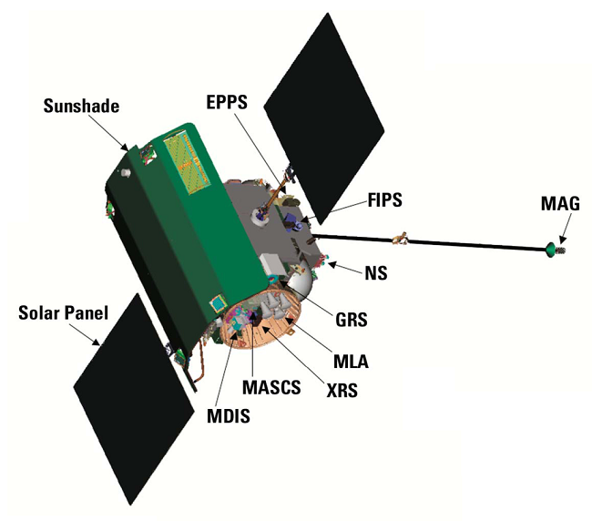|

### Mercury Dual Imaging System (MDIS)
Included two CCD cameras, a narrow-angle camera (NAC) and a wide-angle camera (WAC) mounted to a pivoting platform. The camera system provided a complete map of the surface of Mercury at a resolution of 250 m/px, and images of regions of geologic interest at 20 – 50 m/px. Color imaging was possible only with the narrow‑band filter wheel attached to the wide-angle camera.

| | |
|:-|:-|
|**Objectives:**  *Fly‑by Phase*  ・Acquisition of near‑global coverage at ≈500 m/px.  ・Multispectral mapping at ≈2 ㎞/px. *Orbital Phase*  ・A nadir-looking monochrome global photomosaic at moderate solar incidence angles (55° – 75°) and 250 m/px or better sampling resolution.  ・A 25°-off-nadir mosaic to complement the nadir-looking mosaic for global stereo mapping.  ・Completion of the multispectral mapping begun during the fly‑bys.  ・High‑resolution (20 – 50 m/px) image strips across features representative of major geologic units and structures.|[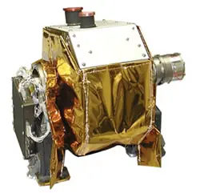](f/project/m/messenger/mdis.webp)|

### Gamma‑ray Spectrometer (GRS)
Measured gamma‑ray emissions from the surface of Mercury to determine the planet’s composition by detecting certain elements (oxygen, silicon, sulfur, iron, hydrogen, potassium, thorium, uranium) to a depth of 10 ㎝.

| | |
|:-|:-|
|**Objectives:**   ・Provide surface abundances of major elements.  ・Provide surface abundances of Fe, Si, and K, infer alkali depletion from K abundances, and provide abundance limits on H (water ice) and S (if present) at the poles.  ・Map surface element abundances where possible, and otherwise provide surface-averaged abundances or establish upper limits.||

### Neutron Spectrometer (NS)
Determined the hydrogen mineral composition to a depth of 40 ㎝ by detecting low‑energy neutrons resulting from the collision of cosmic rays with the minerals.

| | |
|:-|:-|
|**Objectives:**   ・Establish and map the abundance of hydrogen over most of the northern hemisphere of Mercury.  ・Investigate the possible presence of water ice within and near permanently shaded craters near the north pole.  ・Provide secondary evidence to aid in interpreting GRS measured gamma‑ray line strengths in terms of elemental abundances.  ・Outline surface domains at the base of both northern and southern cusps of the magnetosphere where the solar wind can implant hydrogen in surface material.||

### X‑ray Spectrometer (XRS)
Mapped mineral composition within the top millimeter of the surface on Mercury by detecting X‑ray spectral lines from magnesium, aluminum, sulphur, calcium, titanium, and iron, in the 1 – 10 keV range.

| | |
|:-|:-|
|**Objectives:**   ・Determine the history of the formation of Mercury.   ・Characterize the composition of surface elements by measuring the X‑ray emissions induced by the incident solar flux.|[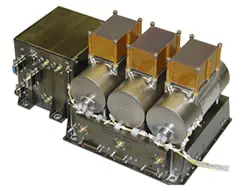](f/project/m/messenger/xrs.webp)|

### Magnetometer (MAG)
Measured the magnetic field around Mercury in detail to determine the strength and average position of the field.

| | |
|:-|:-|
|**Objectives:**   ・Investigate the structure of Mercury’s magnetic field and its interaction with the solar wind.  ・Characterize the geometry and time variability of the magnetospheric field.  ・Detect wave-particle interactions with the magnetosphere.  ・Observe magnetotail dynamics, including phenomena possibly analogous to substorms in the Earth’s magnetosphere.  ・Characterize the magnetopause structure and dynamics.  ・Characterize field-aligned currents that link the planet with the magnetosphere.|[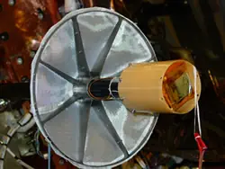](f/project/m/messenger/mag.webp)|

### Mercury Laser Altimeter (MLA)
Provided detailed information regarding the height of landforms on the surface of Mercury by detecting the light of an infrared laser as the light bounced off the surface.

| | |
|:-|:-|
|**Objectives:**   ・Provide a high‑precision topographic map of the high northern latitude regions.  ・Measure the long-wavelength topographic features at mid-to-low northern latitudes.  ・Determine topographic profiles across major geologic features in the northern hemisphere.  ・Detect and quantify the planet’s forced physical librations by tracking the motion of large-scale topographic features as a function of time.  ・Measure the surface reflectivity of Mercury at the MLA operating wavelength of 1 064 nm.|[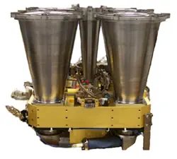](f/project/m/messenger/mla.webp)|

### Mercury Atmospheric and Surface Composition Spectrometer (MASCS)
Determined the characteristics of the tenuous atmosphere surrounding Mercury by measuring ultraviolet light emissions, and ascertained the prevalence of iron and titanium minerals on the surface by measuring the reflectance of infrared light.

| | |
|:-|:-|
|**Objectives:**   ・Characterize the composition, structure, and temporal behavior of the exosphere.  ・Investigate the processes that generate and maintain the exosphere.  ・Determine the relationship between exospheric and surface composition.  ・Search for polar deposits of volatile material, and determine how are the accumulation of these deposits are related to exospheric processes.|[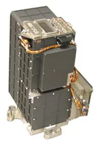](f/project/m/messenger/mascs.webp)|

### Energetic Particle and Plasma Spectrometer (EPPS)
Measured the charged particles in the magnetosphere around Mercury using an energetic particle spectrometer (EPS) and the charged particles that come from the surface using a fast imaging plasma spectrometer (FIPS).

| | |
|:-|:-|
|**Objectives:**   ・Determine the structure of the planet’s magnetic field.  ・Characterize exosphere neutrals and accelerated magnetospheric ions.  ・Determine the composition of the radar-reflective materialmaterials gyms at Mercury’s poles.  ・Determine the electrical properties of the crust/atmosphere/environment interface.  ・Determine characteristics of the dynamics of Mercury’s magnetosphere and their relationships to external drivers and their internal conditions.  ・Measure interplanetary plasma properties in cruise and in Mercury vicinity.||

### Radio Science (RS)
Measured the gravity of Mercury and the state of the planetary core by utilizing the spacecraft’s positioning data.

Objectives:

   - Determine the position of the spacecraft during both the cruise and orbital phases of the mission.
   - Observe gravitational perturbations from Mercury to investigate the spatial variations of density within the planet’s interior, and a time-varying component in Mercury’s gravity to quantify the amplitude of Mercury’s libration.
   - Provide precise measurements of the range of the MESSENGER spacecraft to the surface of Mercury for determining proper altitude mapping with the MLA.

 

## Spacecraft

|Scheme of the structure of the MESSENGER spacecraft:|
|:-|
|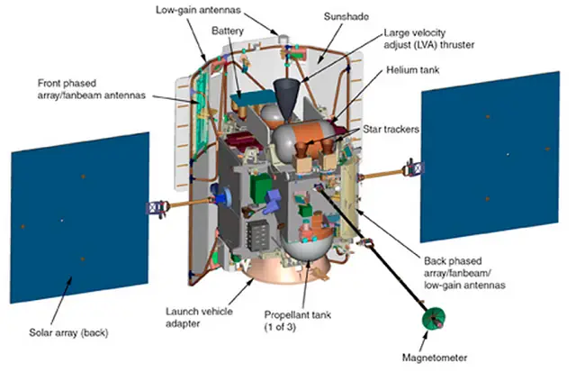|

The MESSENGER bus measured 1.85 m tall, 1.42 m wide, and 1.27 m deep. The bus was primarily constructed with four graphite fiber / cyanate ester composite panels that supported the propellant tanks, the large velocity adjust thruster, attitude monitors and correction thrusters, the antennas, the instrument pallet, and a large ceramic-cloth sunshade, measuring 2.5 m tall and 2 m wide, for passive thermal control. At launch, the spacecraft weighed approximately 1 100 ㎞ with its full load of propellant. The body of the spacecraft is closed in a multi-layer thermal insulation, and for heat removal radiators and heat pipes are provided.

**Attitude control and propulsion**

The main dual-mode chemical propulsion system could provide 645 N of thrust and a specific impulse equal to 317 s. The fuel components were hydrazine and nitrogen tetroxide.

Four 22 N monopropellant thrusters provided spacecraft steering during main thruster burns, and twelve 4.4 N monopropellant thrusters were used for attitude control. For precision attitude control, a reaction wheel attitude control system was also included. Attitude determination knowing where the spacecraft is and in which direction it’s facing - is performed using star-tracking cameras and an Inertial Measurement Unit containing four gyroscopes and four accelerometers, with six Digital Solar Sensors as a backup.

**Communications**

The Orbiter included two small deep space transponders for communications with the Deep Space Network and three kinds of antennas: a high gain phased array whose main beam could be electronically steered in one plane, a medium‑gain «fan-beam» antenna and a low gain horn with a broad pattern. The high gain antenna was used as transmit-only at 8.4 ㎓, the medium‑gain and low gain antennas transmit at 8.4 ㎓ and receive at 7.2 ㎓, and all three antennas operate with right-hand circularly polarized radiation. One of each of these antennas was mounted on the front of the Orbiter facing the Sun, and one of each was mounted to the back of the Orbiter facing away from the Sun.

**Power**

The spacecraft was powered by a two-panel 1.5 × 1.65 m gallium arsenide/germanium solar array providing an average of 450 W while in Mercury orbit. Each panel was rotatable and included optical solar reflectors to balance the temperature of the array. Power was stored in a common-pressure-vessel, 23 Ah nickel–hydrogen battery, with 11 vessels and two cells per vessel.

**Computer**

The spacecraft’s onboard computer system was contained in an Integrated Electronics Module. The computer featured two radiation-hardened IBM RAD6000s, a 25 ㎒ main processor, and a 10 ㎒ fault protection processor. For redundancy, the spacecraft carried a pair of identical IEMs. For data storage, the spacecraft carried two solid‑state recorders able to store up to one gigabyte each. The IBM RAD6000 main processor collected, compressed, and stored data from MESSENGER’s instruments for later playback to Earth.

 

## Community, library, links

**PEOPLE:**

   1. Sean C. Solomon — Principal Investigator;
   2. H. L. Winters — Project Manager;
   3. Larry R. Nittler — Deputy Principal Investigator;
   1. Eric Finnegan — Mission lead engineer.

**Principal investigators**

   1. Scott Murchie / Johns Hopkins University (MDIS);
   1. William Boynton / University of Arizona (GRS, NS);
   1. George Ho / APL (XRS);
   1. Mario Acuna / NASA Goddard Space Flight Center (MAG);
   1. David Smith / NASA Goddard Space Flight Center (MLA, RS);
   1. William McClintock / University of Colorado (MASCS);
   1. Barry Mauk / APL (EPPS).

**COMMUNITY:**

<mark>TBD</mark>

 

## Docs & links
|*Sections & pages*|
|:-|
|**„Äê„Äë**  <mark>NOCAT</mark>|

**Documents:**

   1. …

**Links:**

   1. <https://en.wikipedia.org/wiki/MESSENGER>
   1. <https://www.nasa.gov/mission_pages/messenger/spacecraft/index.html> — MESSENGER / NASA
   
