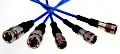

# MIL-STD-1553
> 2019.05.12 [🚀](../../index/index.md) [despace](index.md) → [Cable](cable.md), [Doc](doc.md), [GNC](gnc.md)
> *Navigation:*
> **[FAQ](faq.md)**【**[SCS](scs.md)**·КК, **[SC (OE+SGM)](sc.md)**·КА】**[CON](contact.md)·[Pers](person.md)**·Контакт, **[Ctrl](control.md)**·Упр., **[Doc](doc.md)**·Док., **[Drawing](drawing.md)**·Чертёж, **[EF](ef.md)**·ВВФ, **[Error](error.md)**·Ошибки, **[Event](event.md)**·Событ., **[FS](fs.md)**·ТЭО, **[HF&E](hfe.md)**·Эрго., **[KT](kt.md)**·КТ, **[N&B](nnb.md)**·БНО, **[Project](project.md)**·Проект, **[QM](qm.md)**·БКНР, **[R&D](rnd.md)**·НИОКР, **[SI](si.md)**·СИ, **[Test](test.md)**·ЭО, **[TRL](trl.md)**·УГТ

**Table of contents:**

[TOC]

---

> <small>**MIL-STD-1553B** — EN term. **МКО** — RU analogue.</small>

**MIL-STD-1553** is a military standard that defines the mechanical, electrical, functional characteristics of a serial data bus. Commonly used in avionic data bus for military avionics & in military/civil spacecraft on‑board data handling (OBDH) subsystems. It features multiple (commonly dual) redundant balanced line physical layers, a (differential) network interface, time division multiplexing, half‑duplex command/response protocol, & can handle up to 30 Remote Terminals (devices). A version of 1553 using optical cabling in place of electrical is known as MIL-STD-1773.

|*Standard*|*MIL-STD-1553B*|
|:-|:-|
|Connector types|MIL-DTL-5015 & MIL-DTL-38999 circular connectors are generally used|
|Creation date|2018 (rev.C), 1978 (rev.B), 1975 (rev.A)|
|Max. Binary Rate|1 Mbit/s (incl. 20 % of bitrate for service information)|
|Max. Devices|31|
|Max. Distance|6.1 m (20 ft)|
|Network Topology|multipoint, master‑slave bus|
|Physical Media|wire pair|
|Voltage Levels|18 ‑ 27 V across the transmitter stub (~6.36 ‑ 9.54 V peak‑to‑peak driven on to the bus)|

**Revisions.** The standard is maintained by the US Dept. of Defense & the Society of Automotive Engineers.

   - **[MIL-STD-1553B ❐](f/doc/mil_std_1553b.pdf)**, which superseded the earlier 1975 MIL-STD-1553A, was published in 1978. The basic difference is that in the “B” the options are defined rather than being left for the user to define as required. It was found that when the standard did not define an item, there was no coordination in its use. Hardware & software had to be redesigned for each new application. The primary goal of the “B” was to provide flexibility without creating new designs for each new user. This was accomplished by specifying the electrical interfaces explicitly so that electrical compatibility between designs by different manufacturers could be assured.
   - **[MIL-STD-1553C ❐](f/doc/mil_std_1553b.pdf)** is the last revision made in February 2018.

**Physical layer**  
A single bus consists of a wire pair with 70 ‑ 85 Ω impedance at 1 ㎒. Where a circular connector is used, its center pin is used for the high (positive) Manchester bi‑phase signal. Transmitters & receivers couple to the bus via isolation transformers, & stub connections branch off using a pair of isolation resistors and, optionally, a coupling transformer. This reduces the impact of a short circuit & ensures that the bus does not conduct current through the aircraft. A Manchester code is used to present both clock & data on the same wire pair & to eliminate any DC component in the signal (which cannot pass the transformers). The bit rate is 1 Mbit/s (1 bit/μs). The combined accuracy & long‑term stability of the bit rate is only specified to be within ±0.1 %; the short‑term clock stability must be within ±0.01 %. The peak‑to‑peak output voltage of a transmitter is 18 ‑ 27 V.  
The bus can be made dual or triply redundant by using several independent wire pairs, & then all devices are connected to all buses. There is provision to designate a new bus control computer in the event of a failure by the current master controller. Usually, the auxiliary flight control computer(s) monitor the master computer & aircraft sensors via the main data bus. A different version of the bus uses optical fiber, which weighs less & has better resistance to electromagnetic interference, including EMP. This is known as MIL-STD-1773. The “AS 1773” implementation has a dual rate of 1 Mbit/s or 20 Mbit/s.

**Bus protocol**  
A MIL-STD-1553 multiplex data bus system consists of a Bus Controller (BC) controlling multiple Remote Terminals (RT) all connected together by a data bus providing a single data path between the Bus Controller & all the associated Remote Terminals. There may also be one or more Bus Monitors (BM); however, Bus Monitors are specifically not allowed to take part in data transfers, & are only used to capture or record data for analysis, etc. In redundant bus implementations, several data buses are used to provide more than one data path, i.e. dual redundant data bus, tri‑redundant data bus, etc. All transmissions onto the data bus are accessible to the BC & all connected RTs. Messages consist of one or more 16‑bit words (command, data, or status). The 16 bits comprising each word are transmitted using Manchester code, where each bit is transmitted as a 0.5 μs high & 0.5 μs low for a logical 1 or a low‑high sequence for a logical 0. Each word is preceded by a 3 μs sync pulse (1.5 μs low plus 1.5 μs high for data words & the opposite for command & status words, which cannot occur in the Manchester code) & followed by an odd parity bit. Practically each word could be considered as a 20‑bit word: 3 bit for sync, 16 bit for payload & 1 bit for odd parity control. The words within a message are transmitted contiguously & there has to be a minimum of a 4 μs gap between messages. However, this inter‑message gap can be, & often is, much larger than 4 μs, even up to 1 ms with some older Bus Controllers. Devices have to start transmitting their response to a valid command within 4 ‑ 12 μs & are considered to not have received a command or message if no response has started within 14 μs.

**Connectors**  
The standard does not specify the connector types or how they should be wired, other than shielding requirements, etc. In lab environments concentric twinax bayonet style connectors are commonly used. These connectors are available in standard (BNC size), miniature & sub‑miniature sizes. In military aircraft implementations, MIL-DTL-5015 & MIL-DTL-38999 circular connectors are generally used.  

## (RU) МКО

**Мультиплексный канал обмена (МКО)**, также **мультиплексный канал информационного обмена (МКИО)**, он же **MIL-STD-1553B** — стандарт Министерства обороны США, распространяется на магистральный последовательный интерфейс (МПИ) с централизованным управлением, применяемый в системе электронных модулей. Особенности:

   1. пропускная способность канала передачи данных — 1 Мбит/с; (включая 20% служебной информации)
   1. допуск на погрешность и долговременный дрейф пропускной способности канала — 0.1 %;
   1. краткосрочная стабильность тактовых импульсов должна находиться в пределе 0.01 %.
   1. амплитуда входного напряжения передатчика должна составлять 18 ‑ 27 В.

Аналогичные стандарты разных стран мира: СССР и РФ — ГОСТ 26765.52-87 (ГОСТ Р 52070-2003); Британии — Def Stan 00-18, part 2; НАТО — STANAG 3838; ASCC — Air Standart 50/2.

Широкое распространение и долгую жизнь мультиплексный канал информационного обмена (МКИО) MIL-STD-1553B получил благодаря следующим достоинствам:

   1. Линейная топология — уменьшается масса и габариты, гибкость использования, при необходимости можно подключать или отключать устройства.
   1. Надёжность. МКИО имеет резервный канал, автоматически подключаемую при отказе первой.
   1. Детерминизм. Работа в реальном времени за счёт протокола «команда‑ответ» (важно для критических ситуаций).
   1. Поддержка неинтеллектуальных терминалов. Предусмотрена возможность подключения простых оконечных устройств — датчиков, исполнительных устройств.
   1. Высокая устойчивость к отказам. Электрическая изоляция оконечных устройств, обеспеченная подключением его через развязывающий трансформатор гарантирует стабильную работу шины при отказе какого‑либо устройства.
   1. Широкая доступность компонентов. Микросхемы для МКО повсеместно производятся.

**Физический уровень.**  
Одна шина состоит из пары проводов с волновым сопротивлением 70 ‑ 85 Ом при частоте 1 ㎒. В одном из вариантов соединения используется коаксиальный разъём, по центральному контакту которого передаётся сигнал, закодированный Манчестерским кодом, по экранному проводу проходит возвращение тока сигнала (коаксиал 70 ‑ 85 Ом), ещё есть третий проводник — наружная оплётка, которая является экраном линии. Принимающее и передающее оконечные устройства подключаются к шине с использованием трансформаторной развязки, а не задействованные подключения отделяются с использованием пары изолирующих резисторов, развязанных через трансформатор. Это уменьшает влияние короткого замыкания и добавляет уверенности, что ток шины не течёт по корпусу аппарата. Манчестерский код используется, чтобы передавать сигнал данных и сигнал синхронизации по одной паре проводников (или коаксиальному проводу), и для исключения любых постоянных составляющих, задерживаемых трансформаторной развязкой. Тактируемая (электрическая) скорость в канале — 1 Мбит/с. Допуск на погрешность и долговременный дрейф скорости тактовых импульсов — 0.1 %; краткосрочная стабильность скорости — в пределе 0.01 %. Амплитуда входного напряжения передатчика — 18 ‑ 27 В.  
Надежность может быть достигнута за счёт использования 2 или 3 независимых физических каналов (резервирования каналов), к которым подключены все устройства на шине. В случае отказа канала в текущий момент, резервирование канала предусматривает резервирование контроллера шины, проводника и оконечных устройств.  
Существует вторая версия стандарта, известная как MIL-STD-1773, в которой в качестве канала передачи информации используется оптоволокно, имеющее меньший вес и лучшие показатели по электромагнитной совместимости.

**Используемый протокол.**  
Каналы обмена информацией, выполненные по MIL-STD-1553B, имеют шинную организацию. Есть одна общая магистраль, а к ней, через гальваническую развязку, подключаются абоненты. Количество абонентов — до 31. Протокол предусматривает резервирование. То есть каждый из абонентов может быть подключен к двум каналам — основному и резервному, которые в иностранной литературе обозначаются как channel A и channel B соответственно. Типичная шина MIL-STD-1553B состоит из:

   - двух каналов (основного и резервного)
   - контроллера шины
   - оконечных устройств
   - монитора канала

 

## Docs & links
|*Sections & pages*|
|:-|
|**【[Cable](cable.md)】**  [CAN](can.md)・ [LVDS](lvds.md)・ [MIL‑STD‑1553](mil_std_1553.md)・ [RS‑232, 422, 485](rs_xxx.md)・ [SpaceWire](spacewire.md)・ [ОТБКС](cable.md)|
|**【[Guidance, Navigation & Control (GNC)](gnc.md)】**  [CAN](can.md)・ [LVDS](lvds.md)・ [MIL‑STD‑1553](mil_std_1553.md) (МКО)・ [OS](os.md)・ [RS‑232, 422, 485](rs_xxx.md)・ [SpaceWire](spacewire.md)・ [АСН, САН](ans.md)・ [БНО](nnb.md)[MIL‑STD‑1553](mil_std_1553.md) (МКО)[БАППТ](eas.md)・ [БКС](cable.md)・ [БУ](eas.md)・ [БШВ](time.md)・ [Гироскоп](iu.md)・ [Дальномер](doppler.md) (ИСР)・ [ДМ](iu.md)・ [ЗД](sensor.md)・ [Компьютер](obc.md) (ЦВМ, БЦВМ)・ [Магнитометр](sensor.md)・ [МИХ](mic.md)・ [МКО](mil_std_1553.md)・ [ПО](soft.md)・ [ПНА, ПОНА, ПСНА](devd.md)・ [СД](sensor.md)・ [Система координат](coord_sys.md)・ [СОСБ](devd.md)|

   1. Docs: [MIL-STD-1553B ❐](f/doc/mil_std_1553b.pdf), [MIL-STD-1553C ❐](f/doc/mil_std_1553c.pdf)
   1. <https://en.wikipedia.org/wiki/MIL-STD-1553>
   1. <http://ptkgroup.ru/mil-std-1553b.html>
   1. <http://www.phxlogistics.com/data-bus/connectors-and-terminators>
