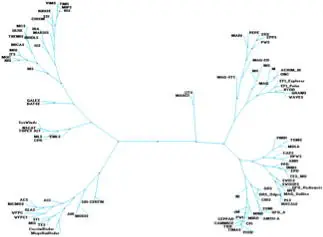

# NICM
> 2019.11.26 [🚀](../../index/index.md) [despace](index.md) → **[ТЭО](fs.md)**
> *Navigation:*
> **[FAQ](faq.md)**【**[SCS](scs.md)**·КК, **[SC (OE+SGM)](sc.md)**·КА】**[CON](contact.md)·[Pers](person.md)**·Контакт, **[Ctrl](control.md)**·Упр., **[Doc](doc.md)**·Док., **[Drawing](drawing.md)**·Чертёж, **[EF](ef.md)**·ВВФ, **[Error](error.md)**·Ошибки, **[Event](event.md)**·Событ., **[FS](fs.md)**·ТЭО, **[HF&E](hfe.md)**·Эрго., **[KT](kt.md)**·КТ, **[N&B](nnb.md)**·БНО, **[Project](project.md)**·Проект, **[QM](qm.md)**·БКНР, **[R&D](rnd.md)**·НИОКР, **[SI](si.md)**·СИ, **[Test](test.md)**·ЭО, **[TRL](trl.md)**·УГТ

**Table of contents:**

[TOC]

---

> <small>**NASA Instrument Cost Model (NICM)** — англоязычный термин, не имеющий аналога в русском языке. **Модель стоимость инструментов НАСА** — дословный перевод с английского на русский.</small>

The **NASA Instrument Cost Model (NICM)** is a probabilistic cost estimation tool that contains a system model, a subsystem model, & a database search engine. NICM is an MS Excel based tool & utilizes VBA macros.

## Описание
NICM is a proven [NASA](contact/nasa.md) cost estimation tool that enhances current instrument cost modeling capabilities by providing cost estimates at both the system & subsystem level. NICM is sponsored by CAD & co‑sponsored by [JPL](contact/jpl.md). The JPL Development Team provides the core analysis support for NICM including data collection, methodology development, maintenance, & training. Since 2004, NICM has grown to include data on more than 260 instruments. Version 2 released in 2007, Version 7 Rev 2 Released 2016. NICM also:

   - Contains an normalized instrument database (for civil servants)
   - Estimates cost and schedule phase breakdowns
   - Estimates schedule
   - Supports JCL

NICM is in wide use across many NASA centers (and any organization proposing instruments for NASA Instruments, and proposal evaluators) & is available under access release restrictions to external organizations. NICM is available for download from ONCE for NASA Civil Servants & NASA Contractors on a current NASA contract.  New users can request NICM or learn more by emailing: <NICM@jpl.nasa.gov>

|*Figure 1 The NICM Database of Normalized Instruments by Instrument Lead Org*|*Figure 2 Cluster Analysis Example of NICM Instrument Dataset*|
|:-|:-|
|||

 

## Docs & links (TRANSLATEME ALREADY)
|*Sections & pages*|
|:-|
|**`Технико‑экономическое обоснование (ТЭО):`**  [NICM](nicm.md)・ [Невозвратные затраты](sunk_cost.md)・ [Номинал](nominal.md)・ [Оценка стоимости работ на НПОЛ](contact/lav.md)・ [Секвестр](budget_seq.md)・ [Стоимость аппарата в граммах](sc_price.md)|

   1. Docs:
      - [Cost systems comparison ❐](f/fs/cost_systems_comparison_2004.pdf) (2004, ESA)
      - [NICM, impact of mission class on cost ❐](f/fs/nicm_2016symposium.pdf) (2016, NASA JPL)
   1. <https://www.nasa.gov/offices/ocfo/functions/models_tools/nicm>
