# Persons
> 2021.05.13 [🚀](../../index/index.md) [despace](index.md) → [Contact](contact.md), [Persons](person.md)

|Navigation|
|:-|
|**[FAQ](faq.md)**【**[SCS](scs.md)**·КК, **[SC (OE+SGM)](sc.md)**·КА】**[CON](contact.md)·[Pers](person.md)**·Контакт, **[Ctrl](control.md)**·Упр., **[Doc](doc.md)**·Док., **[Drawing](drawing.md)**·Чертёж, **[EF](ef.md)**·ВВФ, **[Error](error.md)**·Ошибки, **[Event](event.md)**·Событ., **[FS](fs.md)**·ТЭО, **[HF&E](hfe.md)**·Эрго., **[KT](kt.md)**·КТ, **[N&B](nnb.md)**·БНО, **[Project](project.md)**·Проект, **[QM](qm.md)**·БКНР, **[R&D](rnd.md)**·НИОКР, **[SI](si.md)**·СИ, **[Test](test.md)**·ЭО, **[TRL](trl.md)**·УГТ|
> *Navigation:*
> **[FAQ](faq.md)**【**[SCS](scs.md)**·КК, **[SC (OE+SGM)](sc.md)**·КА】**[CON](contact.md)·[Pers](person.md)**·Контакт, **[Ctrl](control.md)**·Упр., **[Doc](doc.md)**·Док., **[Drawing](drawing.md)**·Чертёж, **[EF](ef.md)**·ВВФ, **[Error](error.md)**·Ошибки, **[Event](event.md)**·Событ., **[FS](fs.md)**·ТЭО, **[HF&E](hfe.md)**·Эрго., **[KT](kt.md)**·КТ, **[N&B](nnb.md)**·БНО, **[Project](project.md)**·Проект, **[QM](qm.md)**·БКНР, **[R&D](rnd.md)**·НИОКР, **[SI](si.md)**·СИ, **[Test](test.md)**·ЭО, **[TRL](trl.md)**·УГТ

**Table of contents:**

[TOC]

---

 

## A

 

### Adler, Mark

|*[Org.](contact.md)*|*[JPL](contact/jpl.md), US. Physicist, Mathematician, Electrical Engineer, Rocket Scientist, Computer Programmer*|
|:-|:-|
|B‑day, addr.|1959.04.03 Miami, US / …|
|Contact|<madler@alumni.caltech.edu>, *work:* <mark>noworkphone</mark>; *mobile:* <mark>nomobile</mark>|
|i18n|<mark>TBD</mark>|
| |[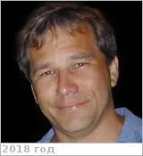](f/contact/a/adler1_photo.webp) <mark>nosign</mark> |

   - **[Education](edu.md):** PhD, Physics.
   - **Exp.:** …
   - Инженер программного обеспечения и активный участник исследования космоса. Он наиболее известен работой в сфере сжатия данных в качестве автора функции контрольной суммы Adler-32 и соавтора библиотеки zlib и утилиты gzip. Он вносил вклад в Info-ZIP и участвовал в разработке формата изображений PNG. Был архитектором исследовательских программ Марса в JPL с 1996 по 1998 годы, в результате чего стал нести ответственность за планирование исследовательских миссий с 2001 года и решение внутренних инженерных проблем, возникающих во время полётов и разработки проектов. Адлер также был менеджером миссии марсохода «Спирит» в программе Mars Exploration Rover. Разработал [УЗК](cml.md) ([CML](cml.md)).
   - **SC/Equip.:** 1997 [Cassini Huygens](cassini_huygens.md)
   - **Conferences:** …
   - Git: …・ [Facebook ⎆](https://www.facebook.com/mark.adler)・ Instagram: <mark>noin</mark> ・ [LinkedIn ⎆](https://www.linkedin.com/in/mark-adler-6770412)・ [Twitter ⎆](https://twitter.com/madler)
   - <https://en.wikipedia.org/wiki/Mark_Adler>
   - <https://www.quora.com/profile/Mark-Adler-5>
   - <https://madler.net/madler/>
   - **As a person:**
      1. …

 

### Ansari, Arif Husain

|*[Org.](contact.md)*|*[BSIP](contact/bsip.md), IN. Precambrian Palaeobiology*|
|:-|:-|
|B‑day, addr.|<mark>nodate</mark> 1983 / …|
|Contact|<a.h.ansari@bsip.res.in>, <arifenv@gmail.com>, *раб.:* <mark>noworkphone</mark>; *mobile:* +91(841)805-28-12|
|i18n|<mark>TBD</mark>|
| |[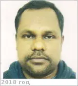](f/contact/a/ansari2_photo.webp) <mark>nosign</mark>|

   - **[Education](edu.md):** PhD, Sheffield Univ., Department of Geography, 2013. MS, Environmental Sciences, Jawaharlal Nehru Univ., 2006. BS, Botany, Chemistry, Zoology, Gorakhpur University, 2004.
   - **Exp.:** Research interest: Biogeochemical Cycling, Stable Isotope Geochemistry, Astrobiology. My current work explores sedimentary rocks geochemistry using stable isotopes & trace elements to understand the Precambrian oceanic & atmospheric environement & their relationship with the evolutiion of life. Skills & Expertise: Geochemistry, Biogeochemistry, Environment, Oceanography, Isotope Geochemistry, Stable Isotope Analysis, Aquatic Ecosystems, Marine Ecology, Ecosystems, Paleogeography.
   - …
   - **SC/Equip.:** …
   - **Conferences:** 2019 [VD Workshop 2019](vdws2019.md)
   - Git: …・ Facebook: <mark>nofb</mark> ・ Instagram: <mark>noin</mark> ・ LinkedIn: <mark>noli</mark> ・ Twitter: <mark>notw</mark>
   - <https://www.researchgate.net/profile/Arif_Ansari>
   - <https://scholar.google.co.in/citations?:user=_U4h0VkAAAAJ&hl=en>
   - **As a person:**
      1. …

 

### (✗) Allen, Mark Andrew

|*[Org.](contact.md)*|*[JPL](contact/jpl.md), US.*|
|:-|:-|
|B‑day, addr.|1949.09.29 ‑ 2016.10.22 (67 лет, Died of complications from ALS (Lou Gehrig’s Disease)) / …|
|Contact|<mark.a.allen@nasa.gov>, *work:* +1(818)354-36-65|
|i18n|<mark>TBD</mark>|
| |[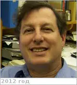](f/contact/a/allen1_photo.webp)|

   - **Exp.:** His career interest in chemistry was already well established by the time he enrolled as an undergraduate at Columbia University. In a 2012 alumni profile, he commented, “In my senior year, I learned about the discovery of molecules in interstellar space…, an environment where conventional wisdom at the time would suggest that molecules shouldn’t exist. I chose this burgeoning field of astrochemistry as my future research interest.” (Columbia College Today, Winter 2011-2012, p. 75.) Allen graduated Summa Cum Laude & Phi Beta Kappa from Columbia in 1971, & subsequently received his PhD from Caltech in 1976, both degrees in chemistry. Allen returned to New York City for a two-year fellowship at NASA’s Goddard Institute for Space Studies, & in 1978 accepted a postdoctoral position in planetary sciences at Caltech with Prof. Yuk Yung. He joined the staff of the Jet Propulsion Laboratory (JPL) in 1981, where he spent the majority of his professional career, developing chemical models of planetary & exoplanetary atmospheres, comets, & cold interstellar molecular clouds. He was the principal designer of the comprehensive chemical code KINETICS, an integrated dynamical/chemical computational model for simulating chemical processes in planetary atmospheres. Allen was a team member of NASA’s Astrobiology Institute (NAI) & Virtual Planet Lab, & was [Principal Investigator](principal_investigator.md) of NAI’s “Titan as a Prebiotic Chemical System” project. He was also involved in a number of NASA & ESA missions & mission concepts, including proposals for orbiting spacecraft to examine the atmospheres of Venus, Mars, & Titan.
   - Reflecting on his own training, Allen acknowledged the value of a broad undergraduate education in his work as a scientist: “I was told by a very senior JPL program manager that I prepared the clearest mission proposals he had ever read.” A long-time friend writes that Mark Allen “was a regular guy who had a sense of humor. He was very sweet, very thoughtful.”
   - <https://aas.org/obituaries/mark-allen-1949-2016>
   - <https://nai.nasa.gov/directory/allen-mark/>

 

### Ansan, Veronique

|*[Org.](contact.md)*|*LPG, EU (FR). Laboratoire de Planétologie. MCF*|
|:-|:-|
|B‑day, addr.|<mark>nodate</mark> 1968  / …|
|Contact|<veronique.ansan@univ-nantes.fr>, *work:* +33(0)251-125-497; *mobile:* <mark>nomobile</mark>|
|i18n|<mark>TBD</mark>|
| |[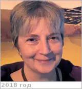](f/contact/a/ansan1_photo.webp) <mark>nosign</mark> |

   - **[Education](edu.md):** Géologie / sciences de la Terre, général/ Planétologie, Université paris XI orsay, 1986 ‑ 1993.
   - **Exp.:** Université de Nantes, MCF, 2008 ‑ Present. Université Paris XI orsay, MCF, 1997 ‑ 2008.
   - Research interests: planetology (Mars, Vanus, etc).
   - **SC/Equip.:** … [EnVision](envision.md), Mars Express
   - **Conferences:** …
   - Git: …・ Facebook: <mark>nofb</mark> ・ Instagram: <mark>noin</mark> ・ [LinkedIn ⎆](https://www.linkedin.com/in/veronique-ansan-394544a3/)・ Twitter: <mark>notw</mark>
   - <https://lpg-umr6112.fr/ansan-v>
   - **As a person:**
      1. …

 

### Arney, Giada Nicole

|*[Org.](contact.md)*|*[GFSC](contact/gfsc.md), US. Research AST, Planetary Studies*|
|:-|:-|
|B‑day, addr.|<mark>nodate</mark> 1988 / …|
|Contact|<giada.n.arney@nasa.gov>, *раб.:* +1(301)614-66-27 ; *mobile:* <mark>nomobile</mark>|
|i18n|<mark>TBD</mark>|
| |[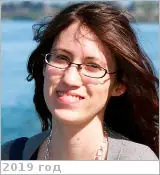](f/contact/a/arney1_photo.webp) <mark>nosign</mark>|

   - **[Education](edu.md):** PhD, Astronomy & Astrobiology, 2016 & MS, Astronomy, Washington Univ., 2012.
   - **Exp.:** Research has involved modeling & measuring properties of planets with an emphasis on worlds enshrouded by global cloud & haze layers because aerosols appear to be a common planetary phenomeon. I have a dual focus on both solar system bodies & on exoplanets. My current & near‑future research focuses on modeling the atmospheric & climatic states of exoplanets, understanding the observational requirements to discriminate between different planetary states with current & future observatories, & re-visiting Venus with new observations.
   - …
   - **SC/Equip.:** …
   - **Conferences:** 2019 [VEXAG 17](vexag_2019.md)
   - Git: …・ [Facebook ⎆](https://www.facebook.com/giada.arney)・ [Instagram ⎆](https://instagram.com/giada.arney)・ [LinkedIn ⎆](https://www.linkedin.com/in/giada-arney-6386a79/)・ [Twitter ⎆](https://twitter.com/giadaplanet)
   - <https://science.gsfc.nasa.gov/sed/bio/giada.n.arney>
   - <https://solarsystem.nasa.gov/people/4174/giada-arney/>
   - <https://scholar.google.com/citations?:user=Lw2r2-YAAAAJ&hl=en>
   - **As a person:**
      1. …

 

### Ansari, R. Rafat

|*[Org.](contact.md)*|*[GRC](contact/grc.md), US. Senior researcher*|
|:-|:-|
|B‑day, addr.|<mark>nodate</mark> / …|
|Contact|<rafat.r.ansari@nasa.gov>, *раб.:* <mark>noworkphone</mark>; *mobile:* <mark>nomobile</mark>|
|i18n|<mark>TBD</mark>|
| | <mark>nosign</mark>|

   - **[Education](edu.md):** …
   - **Exp.:** Dr. Ansari is a researcher at the Glenn Research Center in Cleveland, Ohio where he has advanced the light scattering technology for space experiments on-board the space shuttle orbiter, space station, & biomedical applications here on earth. His research thrust is to diagnose diseases noninvasively & quantitatively before the clinical symptoms appear. Dr. Ansari is recognized nationally & internationally for his contributions to science & technology. He is frequently invited to deliver lectures all over the world, has served on several national & international scientific advisory panels, & as a guest faculty at several prestigious universities in the U.S. & overseas. He has over 85 published papers (basic, applied, & clinical research) in peer-reviewed journals & proceedings, three issued patents, & 6 invited book chapters.
   - …
   - **SC/Equip.:** …
   - **Conferences:** …
   - Git: …・ Facebook: <mark>nofb</mark> ・ Instagram: <mark>noin</mark> ・ LinkedIn: <mark>noli</mark> ・ Twitter: <mark>notw</mark>
   - <https://www.researchgate.net/scientific-contributions/2073430637_Rafat_R_Ansari>
   - <https://www.worldbrainmapping.org/About/Rafat-Ansari>
   - **As a person:**
      1. …

 

### Ануфрейчик, Константин Владимирович

|*[Org.](contact.md)*|*[ИКИ РАН](contact/iki_ras.md), RU. Лаб. 711 «Проектирования аппаратуры и комплексов космических аппаратов». Начальник лаборатории*|
|:-|:-|
|B‑day, addr.|<mark>nodate</mark> / …|
|Contact|<kos@iki.rssi.ru>, *раб.:* +7(495)333-45-78; *mobile:* +7(903)125-76-11|
|i18n|<mark>TBD</mark>|
| | |

   - **[Education](edu.md):** …
   - **Exp.:** …
   - …
   - **SC/Equip.:** …
   - **Conferences:** …
   - Git: …・ Facebook: <mark>nofb</mark> ・ Instagram: <mark>noin</mark> ・ LinkedIn: <mark>noli</mark> ・ Twitter: <mark>notw</mark>
   - <http://dep71.ikiweb.ru/structure/lab711/employees/>
   - **As a person:**
      1. …

 

### Алексашкин, Сергей Николаевич

|*[Org.](contact.md)*|*НПОЛ, RU. 101 / 302, 512 «Проектно‑конструкторский отдел». Зам. начальника отдела 512*|
|:-|:-|
|B‑day, addr.|1955.07.04, на НПОЛ с 1978 / …|
|Contact|<alexashkin@laspace.ru>, *work:* 40-01, 52-12, +7(495)575-52-12; *mobile:* +7(495)763-90-56|
|i18n|<mark>TBD</mark>|
| |[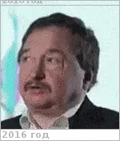](f/contact/a/alexashkin1_photo.webp) |

   - **[Education](edu.md):** …
   - **Exp.:** …
   - …
   - **SC/Equip.:** …
   - **Conferences:** …
   - Git: …・ Facebook: <mark>nofb</mark> ・ Instagram: <mark>noin</mark> ・ LinkedIn: <mark>noli</mark> ・ Twitter: <mark>notw</mark>
   - <…>
   - **As a person:**
      1. Суетлив, разговорчив.

 

## B

 

### Baines, Kevin

|*[Org.](contact.md)*|*[JPL](contact/jpl.md), US. Planetary Science. Planetary & Exoplanetary Atmospheres. Principal Scientist (2003)*|
|:-|:-|
|B‑day, addr.|1954.02.11 / …|
|Contact|<kbaines@jpl.nasa.gov>, *раб.:* +1(818)879-35-02, Fax: +1(818)393-46-05; *mobile:* <mark>nomobile</mark>|
|i18n|<mark>TBD</mark>|
| |[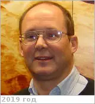](f/contact/b/baines1_photo.webp) <mark>nosign</mark>|

   - **[Education](edu.md):** PhD, Physics, Washington Univ., 1982. MA, Physics, Washington Univ., 1978. BA, Physics, Astronomy (with honors, summa cum laude), Amherst College, 1976.
   - **Exp.:** …
   - …
   - **SC/Equip.:** 1997 [Cassini Huygens](cassini_huygens.md), New Horizons, 2005 [Venus Express](venus_express.md)
   - **Conferences:** 2019 [VD Workshop 2019](vdws2019.md)
   - Git: …・ [Facebook ⎆](https://www.facebook.com/kevin.baines.56)・ Instagram: <mark>noin</mark> ・ [LinkedIn ⎆](https://www.linkedin.com/in/kevin-baines-b568b313)・ Twitter: <mark>notw</mark>
   - <https://science.jpl.nasa.gov/people/Baines/>
   - <https://scholar.google.com/citations?:user=l4HEIR8AAAAJ&hl=en>
   - **As a person:**
      1. …

 

### Baker, Charles L.

|*[Org.](contact.md)*|*[GFSC](contact/gfsc.md), US. Mission/Project Systems Engineer*|
|:-|:-|
|B‑day, addr.|<mark>nodate</mark> 1971 / …|
|Contact|<mark>noemail</mark>, *work:* <mark>noworkphone</mark>; *mobile:* <mark>nomobile</mark>|
|i18n|<mark>TBD</mark>|
| |[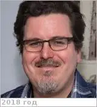](f/contact//1_photo.webp) |

   - **[Education](edu.md):** Mech. engineering, Thermal engineering, Carnegie Mellon Univ., 1993.
   - **Exp.:** GFSC: 2009 ‑ … Mission/Project systems enginer, Lead mission studies in the planetary and astrophysics line of business. 2004 ‑ 2009, Lead thermal engineer, Led [LRO](lunar_reconnaissance_orbiter.md) thermal team.
   - I am the Project Systems Engineer on an astrophysics International Space Station Payload called Neutron star Interior Composition Explorer, directly managing a team of 4 other systems engineer and the technical lead of a team of 30 engineers.
   - **SC/Equip.:** 2009 [LRO](lunar_reconnaissance_orbiter.md), 2009 [Venus Mobile Explorer](venus_mobile_explorer.md)
   - **Conferences:** …
   - Git: …・ Facebook: <mark>nofb</mark> ・ Instagram: <mark>noin</mark> ・ [LinkedIn ⎆](https://www.linkedin.com/in/charles-baker-a735604)・ Twitter: <mark>notw</mark>
   - **As a person:**
      1. …

 

### Balint, Tibor

|*[Org.](contact.md)*|*[JPL](contact/jpl.md), US. Principal Human Centered Designer*|
|:-|:-|
|B‑day, addr.|<mark>nodate</mark> 1963 / …|
|Contact|<tibor.balint@jpl.nasa.gov>, <tibor.balint@network.rca.ac.uk>, *раб.:* <mark>noworkphone</mark>; *mobile:* <mark>nomobile</mark>|
|i18n|<mark>TBD</mark>|
| |[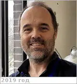](f/contact/b/balint1_photo.webp) <mark>nosign</mark>|

   - **[Education](edu.md):** PhD at the Royal College of Art, School of Design, in Innovation Design Engineering.
   - **Exp.:** …
   - …
   - **SC/Equip.:** 2007 [Venus Flagship Mission](venus_flagship_mission.md)
   - **Conferences:** …
   - Git: …・ Facebook: <mark>nofb</mark> ・ Instagram: <mark>noin</mark> ・ [LinkedIn ⎆](https://www.linkedin.com/in/tibor-balint-b4b97b10a)・ Twitter: <mark>notw</mark>
   - <http://vfm.jpl.nasa.gov/peoplevfm/>
   - <http://www.tiborbalint.com/>
   - <https://scholar.google.co.uk/citations?:user=3BMH7jUAAAAJ&hl=en>
   - <https://www.researchgate.net/profile/Tibor_Balint>
   - **As a person:**
      1. …

 

### Beauchamp, Patricia

|*[Org.](contact.md)*|*[JPL](contact/jpl.md), US. Program manager*|
|:-|:-|
|B‑day, addr.|<mark>nodate</mark> 1958 / …|
|Contact|<patricia.m.beauchamp@nasa.gov>, <pbeaucha@jpl.nasa.gov>, *раб.:* <mark>noworkphone</mark>; *mobile:* +1(818)645-24-79|
|i18n|<mark>TBD</mark>|
| |[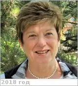](f/contact/b/beauchamp1_photo.webp) <mark>nosign</mark> |

   - **[Education](edu.md):** PhD, Caltech, 1981.
   - **Exp.:** …
   - Патриция Бишоп.
   - **SC/Equip.:** …
   - **Conferences:** 2019 [VD Workshop 2019](vdws2019.md)
   - Git: …・ [Facebook ⎆](https://www.facebook.com/patricia.m.beauchamp)・ Instagram: <mark>noin</mark> ・ [LinkedIn ⎆](https://www.linkedin.com/in/patricia-beauchamp-83524a29)・ Twitter: <mark>notw</mark>
   - <https://www.researchgate.net/profile/Patricia_Beauchamp>
   - <https://nai.nasa.gov/directory/beauchamp-patricia/>
   - <https://scholar.google.com/citations?:user=pRzZFfIAAAAJ&hl=en>
   - **As a person:**
      1. …

 

### Benz, Alexis C.

|*[Org.](contact.md)*|*[Lockheed Martin](lockheed_martin.md), US. Systems Engineer, Instrument Accomodator (since 2015)*|
|:-|:-|
|B‑day, addr.|<mark>nodate</mark> 1984  / …|
|Contact|<alexis.c.benz@jpl.nasa.gov>, *work:* <mark>noworkphone</mark>; *mobile:* <mark>nomobile</mark>|
|i18n|<mark>TBD</mark>|
| |[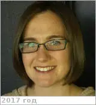](f/contact/b/benz1_photo.webp) <mark>nosign</mark> |

   - **[Education](edu.md):** MS, Space systems, Michigan Univ., 2007. BS, Aerospace, Michigan Univ., 2006
   - **Exp.:** Lockheed Martin, Instrument Accommodator, 2015 ‑ Present. JPL, Deputy Mission Operations Systems Engineer, 2007 ‑ 2010: Successfully negotiated MSL Operational Interface agreements, & thread tests between the 5 project elements; Developed plans & procedures to enable 8 hour turn around time between downlink & uplink; Owner & co-author of the MSL Flight Design Document; Maintained Master Equipment Lists (MEL),  Power Equipment Lists (PEL), & budget for competed & directed mission studies; monitored resource margins; Systems engineer for [Team-X](jpl_if.md); responsible for managing all subsystem leads in dynamic, time critical, iterative design environment; Guided 2 day workshop (27 scientists & engineers from around US) down selecting  instruments  for Venus Flagship road mapping effort.  Presented results on behalf of team; Developed & maintained project requirements for Orbiter Exomars Design Team; Routinely calculated mass & cost for propulsion & structural subsystems; Deputy Proposal Manager for Snowpacks Ventures proposal, Deputy Systems Engineer on Venus Flagship Study; Assisted with 3 Venus balloon helicopter drop tests.
   - Sterling academic background combined with a solid track record of success in the design, integration & operation of aerospace systems for critical, large-scale projects. Superlative team player & team leader who consistently provided technical leadership in solving the most demanding of 21st century engineering challenges. Superior communicator with exceptional poise; readily distills the most complex of materials into easily understood, compelling presentations.
   - **SC/Equip.:** 2007 [Venus Flagship Mission](venus_flagship_mission.md)
   - **Conferences:** …
   - Git: …・ [Facebook ⎆](https://www.facebook.com/alexis.benz)・ Instagram: <mark>noin</mark> ・ [LinkedIn ⎆](https://www.linkedin.com/in/alexisbenz)・ Twitter: <mark>notw</mark>
   - **As a person:**
      1. …

 

### Berger, Gilles

|*[Org.](contact.md)*|*[IRAP](contact/irap.md), EU.*|
|:-|:-|
|B‑day, addr.|<mark>nodate</mark> / …|
|Contact|<gilles.berger@irap.omp.eu>, *раб.:* <mark>noworkphone</mark>; *mobile:* +33(0)5-6133-2582|
|i18n|<mark>TBD</mark>|
| |[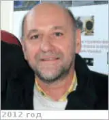](f/contact/b/berger1_photo.webp) <mark>nosign</mark>|

   - **[Education](edu.md):** …
   - **Exp.:** …
   - …
   - **SC/Equip.:** …
   - **Conferences:** 2019 [VD Workshop 2019](vdws2019.md)
   - Git: …・ Facebook: <mark>nofb</mark> ・ Instagram: <mark>noin</mark> ・ LinkedIn: <mark>noli</mark> ・ Twitter: <mark>notw</mark>
   - <https://www.researchgate.net/scientific-contributions/2113239913_Gilles_Berger>
   - **As a person:**
      1. …

 

### Blamont, Jacques

|*[Org.](contact.md)*|*[CNES](contact/cnes.md), FR.*|
|:-|:-|
|B‑day, addr.|1926.10.13 Paris, FR / …|
|Contact|<mark>noemail</mark>, *work:* <mark>noworkphone</mark>; *mobile:* <mark>nomobile</mark>|
|i18n|Бламон, Жак|
| |[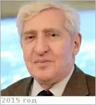](f/contact/b/blamont1_photo.webp) <mark>nosign</mark> |

   - **[Education](edu.md):** [CV](f/contact/b/blamont1_cv.pdf)
   - **Exp.:** …
   - Jacques Emile Blamont is a French astrophysicist author and the founder scientific and technical director of National Centre for Space Studies (CNES-Centre national d'études spatiales), known to have contributed to the development of Veronique, the first rocket launched by France in 1957. He is an elected fellow of the French Academy of Technologies and a professor emeritus of the Pierre and Marie Curie University (University of Paris VI). Blamont is a recipient of several national honours such as Commander of the Legion of Honour, the third highest French civilian honour, Grand Officer of the National Order of Merit, the second highest French civilian honour, Commander of the Academic Palms, Grand Cross of the National Order of Merit, the highest French civilian honour, President’s Silver Medal, Soviet Order of Friendship of Peoples and Padma Shri, the fourth highest Indian civilian award.
   - **SC/Equip.:** 1986 [Venus Sample Return Mission](venus_sample_return_mission.md)
   - **Conferences:** …
   - Git: …・ Facebook: <mark>nofb</mark> ・ Instagram: <mark>noin</mark> ・ LinkedIn: <mark>noli</mark> ・ Twitter: <mark>notw</mark>
   - <https://en.wikipedia.org/wiki/Jacques_Blamont>
   - **As a person:**
      1. …

 

### Bovolo, Francesca

|*[Org.](contact.md)*|*Fondazione Bruno Kessler (FBK-irst), IT. Unit head (since 2013)*|
|:-|:-|
|B‑day, addr.|<mark>nodate</mark> 1980  / …|
|Contact|<bovolo@fbk.eu>, *work:* <mark>noworkphone</mark>; *mobile:* <mark>nomobile</mark>|
|i18n|<mark>TBD</mark>|
| |[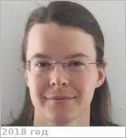](f/contact/b/bovolo1_photo.webp) <mark>nosign</mark> |

   - **[Education](edu.md):** PhD, Trento Univ., Italy, Information & Communication Techologies, 2006. MS, Trento Univ., Italy, Communication Engineering, 2003. BS (summa cum laude), Trento Univ., Italy, Communication Engineering, 2001.
   - **Exp.:** She is the founder & the head of the Remote Sensing for Digital Earth unit at Fondazione Bruno Kessler (FBK), Trento, Italy since July 2013. Her main research interests are in remote-sensing image processing, signal processing, & pattern recognition. Her interests are related to multitemporal image analysis, change detection in multispectral, hyperspectral, [SAR](cam.md) images, time series analysis, domain adaptation, LiDAR & radar sounder systems. She conducts research & on these topics within the context of several national & international projects. She is the author (or coauthor) of 47 scientific publications in referred international journals (more than 40 in IEEE journals), more than 90 papers in conference proceedings, & 8 book chapters. She is editor/co-editor of 2 conference proceedings & 2 journal special issue. She is a member of the program & scientific committee of several international conferences & workshops & a referee for several international journals.
   - …
   - **SC/Equip.:** … [EnVision](envision.md)
   - **Conferences:** …
   - Git: …・ Facebook: <mark>nofb</mark> ・ Instagram: <mark>noin</mark> ・ [LinkedIn ⎆](https://www.linkedin.com/in/francesca-bovolo-857928a/)・ Twitter: <mark>notw</mark>
   - <https://rslab.disi.unitn.it/people/#FrancescaBovolo>
   - <https://www.researchgate.net/profile/Francesca_Bovolo>
   - **As a person:**
      1. …

 

### Bradburne, Chris

|*[Org.](contact.md)*|*[JHUAPL](contact/jhuapl.md), US. Chief Scientist, Associate Professor*|
|:-|:-|
|B‑day, addr.|<mark>nodate</mark> / …|
|Contact|<chris.bradburne@jhuapl.edu>, *раб.:* +1(443)414-71-40; *mobile:* <mark>nomobile</mark>|
|i18n|<mark>TBD</mark>|
| |[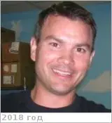](f/contact/b/bradburne1_photo.webp) <mark>nosign</mark>|

   - **[Education](edu.md):** PhD, Biosciences, George Mason Univ.
   - **Exp.:** Skills & Expertise: PCR, Cell Culture, Material Characterization, Materials, Gel Electrophoresis, DNA, Nanomaterials, Cloning, Thin Films & Nanotechnology, Thin Film Deposition, Phylogenetic Analysis, Semiconductor, Cells, Luminescence, Peptides, Quantum Dots, Wetlands, Cyanobacteria, rRNA Genes, Targeting.
   - …
   - **SC/Equip.:** …
   - **Conferences:** 2019 [VD Workshop 2019](vdws2019.md)
   - Git: …・ Facebook: <mark>nofb</mark> ・ Instagram: <mark>noin</mark> ・ [LinkedIn ⎆](https://www.linkedin.com/in/bradburne)・ Twitter: <mark>notw</mark>
   - <https://ep.jhu.edu/about-us/faculty-directory/1605-christopher-bradburne>
   - <https://scholar.google.com/citations?:user=R_k_kNIAAAAJ&hl=en>
   - <https://www.researchgate.net/profile/Christopher_Bradburne>
   - **As a person:**
      1. …

 

### Breuer, Doris

|*[Org.](contact.md)*|*[DLR](contact/dlr.md), EU(GR). Department of Planetary Physics. Head of the Department*|
|:-|:-|
|B‑day, addr.|<mark>nodate</mark> 1965, Mönchengladbach, GR / …|
|Contact|<mark>noemail</mark>, *work:* +49(30)670-55-301, Fax: +49(30)670-55-303; *mobile:* <mark>nomobile</mark>|
|i18n|<mark>TBD</mark>|
| |[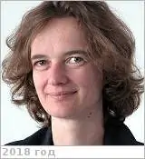](f/contact/b/breuer1_photo.webp) <mark>nosign</mark> |

   - **[Education](edu.md):** PhD, Geophysics, Westfälische-Wilhelms-Universität (WWU) in Münster, Germany, 1995. PostDoc, Department of Geology & Geophysics, Univ. of Minnesota & at the Minnesota Supercomputer Institute, US, 1997.
   - **Exp.:** After 1997, she was Assistant Professor at the Institute of Planetology (WWU) in Münster, for 6 years. She currently works at the DLR, Institute of Planetary Research in Berlin, where she is Head of the Department of Planetary Physics since 2004. She is also Associate Professor at the Institute de Physique du Globe de Paris (since 2005). She has been involved in scientific teams for various space experiments, such as HP3 (Heat Flow & Physical Properties Package) for ExoMars, MORE (Mercury Orbiter Radioscience Experiment) & BELA (BepiColombo Laser altimeter) on the BepiColombo mission to Mercury.
   - Her main fields of research are the thermo-chemical evolution, the mantle dynamics & the interior structure of planetary bodies. Doris likes music, movies & reading.
   - **SC/Equip.:** … [EnVision](envision.md)
   - **Conferences:** …
   - Git: …・ Facebook: <mark>nofb</mark> ・ Instagram: <mark>noin</mark> ・ LinkedIn: <mark>noli</mark> ・ Twitter: <mark>notw</mark>
   - <https://sci.esa.int/web/mars-express/-/49525-doris-breuer>
   - <https://scholar.google.de/citations?:user=koJ_AWYAAAAJ&hl=de>
   - <https://sci.esa.int/web/mars-express/-/49525-doris-breuer>
   - <https://www.researchgate.net/profile/Doris_Breuer>
   - <https://www.dlr.de/pf/en/desktopdefault.aspx/tabid-156/220_read-1025/start-b/>
   - **As a person:**
      1. …

 

### Bristow, Thomas F.

|*[Org.](contact.md)*|*[NASA](contact/nasa.md) Ames Research Center, US. Research Scientist*|
|:-|:-|
|B‑day, addr.|<mark>nodate</mark> / …|
|Contact|<Thomas.F.Bristow@nasa.gov>, *раб.:* +1(626)318-34-80; *mobile:* <mark>nomobile</mark>|
|i18n|<mark>TBD</mark>|
| | <mark>nosign</mark>|

   - **[Education](edu.md):** …
   - **Exp.:** Mineralogical Traces of Early Habitable Environments.
   - …
   - **SC/Equip.:** …
   - **Conferences:** 2019 [IVC](ivc_2019.md)
   - Git: …・ Facebook: <mark>nofb</mark> ・ Instagram: <mark>noin</mark> ・ LinkedIn: <mark>noli</mark> ・ Twitter: <mark>notw</mark>
   - <https://scholar.google.com/citations?:user=AvUx6NsAAAAJ&hl=en>
   - <https://www.nasa.gov/content/members-space‑science-astrobiology-division-code-ss>
   - **As a person:**
      1. …

 

### Bruzzone, Lorenzo

|*[Org.](contact.md)*|*Trento Univ., IT. Professor & Head of the Remote Sensing Laboratory (since 1999)*|
|:-|:-|
|B‑day, addr.|<mark>nodate</mark> 1970  / …|
|Contact|<lorenzo.bruzzone@ing.unitn.it>, *work:* <mark>noworkphone</mark>; *mobile:* <mark>nomobile</mark>|
|i18n|<mark>TBD</mark>|
| |[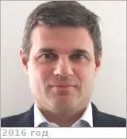](f/contact/b/bruzzone1_photo.webp) <mark>nosign</mark> |

   - **[Education](edu.md):** PostDoc, Remote Sensing & Signal Processing, University of Genoa, Italy, 1999. PhD, Telecommunication Engineering, University of Genoa, Italy, 1998. BS, Electronic Engineering, 1993.
   - **Exp.:** Dr. Bruzzone is the founder & the director of the Remote Sensing Laboratory in the Department of Information Engineering & Computer Science, Univ. of Trento. His research interests are in the areas of remote sensing, radar & [SAR](cam.md), signal processing, machine learning & pattern recognition. Among the others, he’s currently the [Principal Investigator](principal_investigator.md) of the Radar for icy Moon exploration (RIME) instrument in the framework of the JUpiter ICy moons Explorer (JUICE) mission of the European Space Agency (ESA) & the Science Lead for the High Resolution Land Cover project in the framework of the Climate Change Initiative of ESA. He is the author (or coauthor) of 247 scientific publications in international journals (183 in IEEE journals), 310 papers in conference proceedings, 21 book chapters.
   - …
   - **SC/Equip.:** … [EnVision](envision.md)
   - **Conferences:** …
   - Git: …・ Facebook: <mark>nofb</mark> ・ Instagram: <mark>noin</mark> ・ [LinkedIn ⎆](https://www.linkedin.com/in/lorenzo-bruzzone-043636/)・ Twitter: <mark>notw</mark>
   - <https://www.researchgate.net/profile/Lorenzo_Bruzzone2>
   - <https://scholar.google.com/citations?:user=ff9-TK4AAAAJ&hl=en>
   - <https://rslab.disi.unitn.it/people/#LorenzoBruzzone>
   - <https://dblp.uni-trier.de/pers/hd/b/Bruzzone:Lorenzo>
   - **As a person:**
      1. …

 

### Bullock, Mark

|*[Org.](contact.md)*|*[SWRI](contact/swri.md), US. Space Science Department. Principal scientist*|
|:-|:-|
|B‑day, addr.|<mark>nodate</mark> / …|
|Contact|<bullock@boulder.swri.edu>, *раб.:* +1(303)944-94-76; *mobile:* <mark>nomobile</mark>|
|i18n|<mark>TBD</mark>|
| | [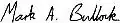](f/contact/b/bullock1_sign.webp)|

   - **[Education](edu.md):** …
   - **Exp.:** Skills & Expertise: Astronomy & Astrophysics, Atmosphere, Space, Planetary Science, Optical Astronomy, Space Exploration, Space Technology, Planets, Planetary Sciences & Astrogeology, Solar System, Space Technology for Development, Planet Formation, Planetary Evolution, Planetary Geology, Exoplanets, Space Science, Extrasolar Planets, Mars, Chemical Evolution, Mars Exploration, Exobiology, Theoretical Planetology, Noble Gases, Cultural Astronomy, Planetary Exploration, Moon, Planetary Atmospheres, Origin of Life, Lunar Science, Remote Spectroscopy. В 2000-х писал proposal'ы для NASA для больших венерианских миссий.
   - …
   - **SC/Equip.:** 2007 [Venus Flagship Mission](venus_flagship_mission.md), 2019 [Venus Observing System](venus_observing_system.md)
   - **Conferences:** 2019 [VD Workshop 2019](vdws2019.md)
   - Git: …・ [Facebook ⎆](https://www.facebook.com/mark.bullock.56863)・ Instagram: <mark>noin</mark> ・ [LinkedIn ⎆](https://www.linkedin.com/in/mark-bullock-4256139)・ Twitter: <mark>notw</mark>
   - <https://www.researchgate.net/profile/Mark_Bullock>
   - <https://www.boulder.swri.edu/about/staff/doss/embed/Bullock.Mark.html>
   - <https://scholar.google.com/citations?:user=SuxFoxAAAAAJ&hl=en>
   - **As a person:**
      1. …

 

### Byrne, Paul K.

|*[Org.](contact.md)*|*[NCSU](contact/ncsu.md), EU. Assistant Professor*|
|:-|:-|
|B‑day, addr.|<mark>nodate</mark> 1984 / …|
|Contact|<paul.byrne@ncsu.edu>, *раб.:* +1(919)513-25-78; *mobile:* <mark>nomobile</mark>|
|i18n|<mark>TBD</mark>|
| |[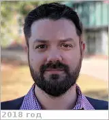](f/contact/b/byrne1_photo.webp) <mark>nosign</mark>|

   - **[Education](edu.md):** PhD, Planetary Geology, Trinity College Dublin, 2010. BA (Mod.) Hons., Geology, Trinity College Dublin, 2005.
   - **Exp.:** Planetary geologist, interested in how & why planets look the way they do. He uses remote sensing, laboratory & numerical modeling & fieldwork in analog sites around the world to examine how volcanic, tectonic & impact processes have shaped planetary surfaces. His interests include exploring what Earth can reveal about other bodies in the solar system — like Mars, Mercury & Earth’s moon — & what these worlds can, in turn, reveal about the history & evolution of Earth.
   - …
   - **SC/Equip.:** …
   - **Conferences:** 2019 [VD Workshop 2019](vdws2019.md)
   - Git: …・ [Facebook ⎆](https://www.facebook.com/byrnepk)・ Instagram: <mark>noin</mark> ・ LinkedIn: <mark>noli</mark> ・ [Twitter ⎆](https://twitter.com/theplanetaryguy)
   - <https://cnr.ncsu.edu/geospatial/directory/paul-byrne/>
   - <https://meas.sciences.ncsu.edu/people/pkbyrne/>
   - <https://scholar.google.com/citations?:user=Lb6BrKEAAAAJ&hl>
   - <https://www.researchgate.net/scientific-contributions/58872363_Paul_K_Byrne>
   - <http://www.planetary.org/connect/our-experts/profiles/paul-byrne.html>
   - **As a person:**
      1. …

 

### Бабакин, Николай Георгиевич

|*[Org.](contact.md)*|*[АКЦ ФИАН](contact/asc_fian.md), RU. Главный конструктор*|
|:-|:-|
|B‑day, addr.|1944.10.31 / …|
|Contact|<nbabakin@asc.rssi.ru>, *work:* +7(495)333-21-33, факс +7(495)333-23-01; *mobile:* +7(917)544-54-71|
|i18n|<mark>TBD</mark>|
| |[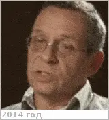](f/contact/b/babakin2_photo.webp) |

   - **[Education](edu.md):** Кандидат технических наук.
   - **Exp.:** …
   -  Отец — [Георгий Николаевич Бабакин](person.md).
   - **SC/Equip.:** …
   - **Conferences:** …
   - Git: …・ Facebook: <mark>nofb</mark> ・ Instagram: <mark>noin</mark> ・ LinkedIn: <mark>noli</mark> ・ Twitter: <mark>notw</mark>
   - <…>
   - **As a person:**
      1. …

 

### (✗) Бармин, Владимир Павлович

|*[Org.](contact.md)*|*МГТУ Баумана, SU.*|
|:-|:-|
|B‑day, addr.|1909.03.17 ‑ 1993.07.17 / Москва, СССР|
|Contact| |
|i18n|Barmin, Vladimir Pavlovich|
| ||

   - **[Education](edu.md):** Доктор технических наук (1959). Академик АН СССР (с 1966 года, с 1991 года — академик РАН), Герой Социалистического Труда (1956). Лауреат Ленинской премии и трёх Государственных премий СССР.
   - **Exp.:** С 1947 года под руководством Бармина были разработаны стартовые комплексы для многих ракет конструкции Королёва: Р-1, Р-2, Р-11, Р-5, Р-5М — первой стратегической ракеты с ядерным боезарядом Р-5М. В 1957 году завершены работы над стартовым комплексом первой в мире межконтинентальной баллистической ракеты Р-7, которая вывела на орбиту Земли первый искусственный спутник Земли и первого космонавта Юрия Гагарина. В ГСКБ «Спецмаш» при участии Бармина созданы шахтные комплексы для боевых ракет Р-12, Р-14, Р-9А, УР-100. Под его руководством были разработаны и созданы стартовые комплексы для ракет‑носителей «Протон» и многоразовой ракетно‑космической системы «Энергия‑Буран». Основатель и первый заведующий кафедрой «Стартовые ракетные комплексы» МГТУ имени Н. Э. Баумана. Руководил конструкторским бюро по разработке стартовых комплексов (Главный конструктор). Бармин руководил созданием автоматических грунтозаборных устройств для исследования Луны и Венеры. С помощью одного из них была взята проба лунного грунта с глубины около 2,5 метра и обеспечена доставка его на Землю. С помощью другого был осуществлен забор образцов грунта в трёх точках поверхности Венеры, получена и передана по радиоканалу на Землю научная информация о его химическом составе.
   - Учёный, конструктор реактивных пусковых установок, ракетно‑космических и боевых стартовых комплексов. Один из основоположников советской космонавтики.
   - **SC/Equip.:** …
   - <https://ru.wikipedia.org/wiki/Бармин,_Владимир_Павлович>

 

### (✗) Бабакин, Георгий Николаевич

|*[Org.](contact.md)*|*НПОЛ, SU.*|
|:-|:-|
|B‑day, addr.|1914.11.13 ‑ 1971.08.03 / Москва, СССР|
|Contact| |
|i18n|Babakin, Georgy Nikolayevich|
| |[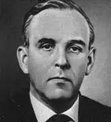](f/contact/b/babakin1_photo.webp)|

   - **[Education](edu.md):** Член‑корреспондент Академии наук СССР (c 24.11.1970). Доктор технических наук (1968). Герой Социалистического Труда (1970). Лауреат Ленинской премии (1966).
   - **Exp.:** НПО имени С. А. Лавочкина (Химки, Московская область) под руководством Бабакина работало над совершенствованием техники, систем тестирования и управления, добившись целого ряда успехов там, где у КБ Королёва не получилось — первая мягкая посадка на Луну аппарата Луна‑9, первый в мире планетоход Луноход‑1, первый зонд Венера‑4 в атмосфере Венеры.
   - Советский инженер, конструктор, работавший в космической программе СССР. Главный конструктор Конструкторского Бюро им. Лавочкина (1965 ‑ 1971). ┊ Сын — [Николай Георгиевич Бабакин](person.md).
   - **SC/Equip.:** …
   - <https://ru.wikipedia.org/wiki/Бабакин,_Георгий_Николаевич>
   - <https://persona.rin.ru/view/f/0/31767/babakin-georgij-nikolaevich>

 

### Бурданов, Антон Владимирович

|*[Org.](contact.md)*|*[ЦНИИмаш](contact/tsniimash.md), RU. Центр системного проектирования, Отдел 1322. Главный специалист отдела проектно‑поисковых исследований в обеспечение разработки программ, космических комплексов и приборного ряда для фундаментальных космических исследований*|
|:-|:-|
|B‑day, addr.|1980.11.03 / …|
|Contact|<burdanovav@tsniimash.ru>, *раб.:* +7(495)513-40-81; *mobile:* +7(926)273-80-51|
|i18n|<mark>TBD</mark>|
| |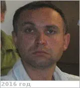 |

   - **[Education](edu.md):** …
   - **Exp.:** …
   - Паспорт: 4608 181572, выдан 06.09.2008 ТП №2 УФМС по МО г. Королёв
   - **SC/Equip.:** …
   - **Conferences:** …
   - Git: …・ Facebook: <mark>nofb</mark> ・ Instagram: <mark>noin</mark> ・ LinkedIn: <mark>noli</mark> ・ Twitter: <mark>notw</mark>
   - <https://vk.com/id214734180>
   - **As a person:**
      1. …

 

### Буров, Алексей Анатольевич

|*[Org.](contact.md)*|*[НПО Лавочкина](contact/lav.md), RU. 9/301. 512 «Проектно-конструкторский отдел». Ведущий инженер-конструктор*|
|:-|:-|
|B‑day, addr.|1992.04.22, на НПОЛ с 2015 / Химки|
|Contact|<burov@laspace.ru>, *work:* 64-08; *mobile:* +7(926)833-55-86, +7(495)793-91-68 — домашний стационарный|
|i18n|<mark>TBD</mark>|
| | [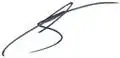](f/contact/b/burov1_sign.webp)|

   - **[Education](edu.md):** …
   - **Exp.:** …
   - С.блок 108060. ┊ Учился в институте в одной группе с [Дробинко](contact/дробинко1.md) Е.О., Заикиным А.В.
   - **SC/Equip.:** …
   - **Conferences:** …
   - Git: …・ Facebook: <mark>nofb</mark> ・ [Instagram ⎆](https://instagram.com/mavelianko)・ LinkedIn: <mark>noli</mark> ・ Twitter: <mark>notw</mark>
   - <https://vk.com/mavelian>
   - **As a person:**
      1. …

 

## C

 

### Campbell, Bruce A.

|*[Org.](contact.md)*|*Smithsonian Inst., National Air & Space Museum’s Center for Earth & Planetary Studies, US. Geophysicist, Senior Scientist*|
|:-|:-|
|B‑day, addr.|<mark>nodate</mark> 1964  / …|
|Contact|<campbellb@si.edu>, *work:* +1(202)633-24-72; *mobile:* <mark>nomobile</mark>|
|i18n|<mark>TBD</mark>|
| |[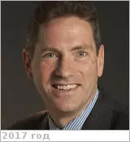](f/contact/c/campbell1_photo.webp) <mark>nosign</mark> |

   - **[Education](edu.md):** **[CV](f/contact/c/campbell1_cv.pdf)**. PhD, Geology & Geophysics, University of Hawaii, 1991. BS, Geophysics, Texas A&M University, 1986.
   - **Exp.:** Since 1992 he has been with the Smithsonian’s Center for Earth & Planetary Studies at the National Air & Space Museum, & is currently department chair. His research focuses on the surface & subsurface geology of the Moon, Mars, Venus, & the icy moons of the outer planets, resulting in more than 100 scientific publications. Much of this work uses radar observations with orbiting probes & the giant Arecibo & Green Bank radio telescopes. Radar signals can probe from a few meters to several kilometers below the surface, revealing the events that formed the features we now see. For Venus, radar can penetrate the thick clouds to map the volcanic landscape & watch for changes from possible eruptions. To support future human exploration, radar illuminates areas near the lunar poles to search for ice, reveals layering in the polar caps of Mars, & can identify ground ice on Mars that could supply water. Dr. Campbell has led several proposal teams for an orbiting radar mission to locate that ice on Mars, co-chaired a 2015 study group for the next Mars orbiter mission, & has been on teams to develop new mission concepts for Venus. He is a science team member for radar sounder instruments on the Mars Reconnaissance Orbiter, the Jupiter Icy Moons Explorer, & the Europa Clipper missions. As part of the National Air & Space Museum, he works to bring the excitement & discoveries of planetary exploration to museum visitors. This includes new gallery sections on Venus, Mars exploration & the three generations of rovers, the exploration of Pluto & the distant Kuiper Belt, & the radar image of the Moon that serves as a backdrop for the museum’s Lunar Module.
   - …
   - **SC/Equip.:** … [EnVision](envision.md), 2007 [Venus Flagship Mission](venus_flagship_mission.md)
   - **Conferences:** …
   - Git: …・ Facebook: <mark>nofb</mark> ・ Instagram: <mark>noin</mark> ・ [LinkedIn ⎆](https://www.linkedin.com/in/bruce-campbell-963167b3/)・ Twitter: <mark>notw</mark>
   - <https://airandspace.si.edu/people/staff/bruce-campbell>
   - **As a person:**
      1. …

 

### Caro, Tristan

|*[Org.](contact.md)*|*[Berkeley Univ.](contact/berkeley_univ.md), Koskella Lab, US. Departments of Ecology & Evolutionary Biology & Geological Sciences. Lab Technician*|
|:-|:-|
|B‑day, addr.|<mark>nodate</mark> / …|
|Contact|<tcaro@berkeley.edu>, *раб.:* <mark>noworkphone</mark>; *mobile:* <mark>nomobile</mark>|
|i18n|<mark>TBD</mark>|
| | <mark>nosign</mark>|

   - **[Education](edu.md):** BA, Molecular & Cell Biology, Berkeley Univ.
   - **Exp.:** …
   - …
   - **SC/Equip.:** …
   - **Conferences:** 2019 [VD Workshop 2019](vdws2019.md)
   - Git: …・ Facebook: <mark>nofb</mark> ・ Instagram: <mark>noin</mark> ・ [LinkedIn ⎆](https://www.linkedin.com/in/tristan-caro-428542124)・ Twitter: <mark>notw</mark>
   - **As a person:**
      1. …

 

### Carter, Lynn M

|*[Org.](contact.md)*|*[Arizona Univ.](arizona_univ.md), US. Lunar & Planetary Laboratory. Planetary Sciences. Associate Professor*|
|:-|:-|
|B‑day, addr.|<mark>nodate</mark> / …|
|Contact|<lmcarter@lpl.arizona.edu>, *раб.:* +1(520)621-69-63; *mobile:* <mark>nomobile</mark>|
|i18n|<mark>TBD</mark>|
| |[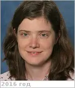](f/contact/c/carter1_photo.webp) <mark>nosign</mark>|

   - **[Education](edu.md):** PhD & MS, Astronomy, Cornell Univ.
   - **Exp.:** Research interests: volcanism & impact cratering on the terrestrial planets, surface properties of asteroids, climate change, & the development of radar remote sensing techniques including polarimetric imaging & ground penetrating radar. She has used the Arecibo radar system to study Venus, the Moon & asteroids, is Deputy PI of the Mini‑RF radar on Lunar Reconnaissance Orbiter, & is a Co‑I on the SHARAD on Mars Reconnaissance Orbiter, REASON on the NASA Europa Mission & RIMFAX on the Mars2020 rover.
   - …
   - **SC/Equip.:** 2009 [LRO](lunar_reconnaissance_orbiter.md), MRO, Europa Orbiter, Mars2020
   - **Conferences:** 2019 [VEXAG 17](vexag_2019.md)
   - Git: …・ [Facebook ⎆](https://www.facebook.com/lynn.carter)・ Instagram: <mark>noin</mark> ・ LinkedIn: <mark>noli</mark> ・ [Twitter ⎆](https://twitter.com/lynn_carter8)
   - <https://www.researchgate.net/scientific-contributions/9779129_L_M_Carter>
   - <https://profiles.arizona.edu/person/lmcarter>
   - <https://www.lpl.arizona.edu/faculty/lynn-carter>
   - **As a person:**
      1. …

 

### Case, Kelley

|*[Org.](contact.md)*|*[JPL](contact/jpl.md), US. Technical Supervisor, Concept Design Methods Chief*|
|:-|:-|
|B‑day, addr.|<mark>nodate</mark> / …|
|Contact|<Kelley.Case@jpl.nasa.gov>, *work:* +1(818)354‑58-70; *mobile:* <mark>nomobile</mark>|
|i18n|<mark>TBD</mark>|
| |[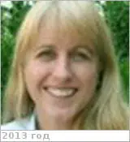](f/contact/c/case1_photo.webp) <mark>nosign</mark> |

   - **[Education](edu.md):** …
   - **Exp.:** She is responsible for managing JPL’s advanced design team, internationally recognized as [Team X](jpl_if.md). While Team X consists of over 200 lab wide members, individual study teams are comprised of approximately twenty subsystem engineers that architect a new conceptual space mission over the course of one to three weeks. In addition, Kelley has managed various Earth Science formulation activities and proposals. Previous job assignments include serving as the Science Data Engineering technical group supervisor in the Instruments and Science Data Systems Division, as well as the Collaborative Engineering technical group supervisor in the Systems and Software Division.
   - …
   - **SC/Equip.:** …
   - **Conferences:** …
   - Git: …・ Facebook: <mark>nofb</mark> ・ Instagram: <mark>noin</mark> ・ [LinkedIn ⎆](https://www.linkedin.com/in/kelley‑case-a8165431)・ Twitter: <mark>notw</mark>
   - **As a person:**
      1. …

 

### Chalex, Remy

|*[Org.](contact.md)*|*[ESA](contact/esa.md), CDF, EU. System Engineer в ESA, Team Leader Concurrent Design Facility в ESA, System Engineer for the ESA в Terma.*|
|:-|:-|
|B‑day, addr.|<mark>nodate</mark> 1979 / …|
|Contact|<remy.chalex@esa.int>, *раб.:* <mark>noworkphone</mark>; *mobile:* <mark>nomobile</mark>|
|i18n|<mark>TBD</mark>|
| |[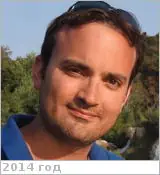](f/contact/c/chalex1_photo.webp) <mark>nosign</mark>|

   - **[Education](edu.md):** …
   - **Exp.:** System Engineer active in the fields of space missions design, project management, team work & feasibility evaluation (eg. mission concept).
   - …
   - **SC/Equip.:** …
   - **Conferences:** …
   - Git: …・ [Facebook ⎆](https://www.facebook.com/remy.chalex)・ Instagram: <mark>noin</mark> ・ [LinkedIn ⎆](http://nl.linkedin.com/in/chalex)・ [Twitter ⎆](http://twitter.com/eurospacedude)
   - **As a person:**
      1. …

 

### Chassefière, Eric

|*[Org.](contact.md)*|*University of Paris-Sud at Orsay, FR. IDES laboratory (Interaction & Dynamics of Surface Environments). Director*|
|:-|:-|
|B‑day, addr.|<mark>nodate</mark> 1956 Montpellier, FR / …|
|Contact|<eric.chassefiere@u-psud.fr>, *work:* +33(169)156-748; *mobile:* +33(169)154-911|
|i18n|<mark>TBD</mark>|
| |[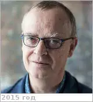](f/contact/c/chassefiere1_photo.webp) <mark>nosign</mark> |

   - **[CV](f/contact/c/chassefiere1_cv.webp)**. Doctorant, puis post‑doctorant au Service d’Aéronomie (SA), 1988.
   - **Exp.:** He is specialized in the study of Earth & planetary surfaces & subsurfaces. He has been the [principal investigator](principal_investigator.md) of the UV spectrometer to be flown on the BepiColombo mission, & co‑investigator of numerous experiments flown on Phobos, Huygens, Mars Express & Venus Express. His research activities encompass studies of the interplanetary medium & planetary atmospheres.
   - …
   - **SC/Equip.:** 2018 [BepiColombo](bepicolombo.md), 2007 [Venus Flagship Mission](venus_flagship_mission.md), 2005 [Venus Express](venus_express.md), 1997 [Cassini Huygens](cassini_huygens.md)
   - **Conferences:** …
   - Git: …・ [Facebook ⎆](https://www.facebook.com/eric.chassefiere.9)・ Instagram: <mark>noin</mark> ・ [LinkedIn ⎆](https://www.linkedin.com/in/eric-chassefi%C3 %A8re-5b8a5548/)・ Twitter: <mark>notw</mark>
   - <http://www.editionsalcyone.fr/425299709>
   - <http://geops.geol.u-psud.fr/spip.php?:article698&lang=fr>
   - <https://sci.esa.int/web/mars-express/-/49531-eric-chassefi-egrave-re>
   - **As a person:**
      1. …

 

### Cockell, Charles Seaton

|*[Org.](contact.md)*|*[Edinburgh Univ.](contact/edinburgh_univ.md), EU. Chair of Astrobiology. Professor of Astrobiology*|
|:-|:-|
|B‑day, addr.|1967.05.21 / …|
|Contact|<c.s.cockell@ed.ac.uk>, *раб.:* +44(131)650-29-61; *mobile:* <mark>nomobile</mark>|
|i18n|<mark>TBD</mark>|
| |[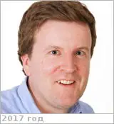](f/contact/c/cockell1_photo.webp) <mark>nosign</mark>|

   - **[Education](edu.md):** PhD, Molecular Biophysics, Oxford Univ., 1994.
   - **Exp.:** His scientific interests have focused on astrobiology, geomicrobiology & life in extreme environments. He has published over 300 scientific papers & books in these areas. He has contributed to plans for the human exploration of Mars.
   - …
   - **SC/Equip.:** …
   - **Conferences:** 2019 [VD Workshop 2019](vdws2019.md)
   - Git: …・ [Facebook ⎆](https://www.facebook.com/charles.cockell)・ Instagram: <mark>noin</mark> ・ LinkedIn: <mark>noli</mark> ・ Twitter: <mark>notw</mark>
   - <https://en.wikipedia.org/wiki/Charles_S._Cockell>
   - <https://www.ph.ed.ac.uk/people/charles-cockell>
   - <https://www.research.ed.ac.uk/portal/en/persons/charles-cockell(20e254f7-d6ab-483f-a8fc-00d27b1c0ff3).html>
   - <https://www.nasa.gov/content/charles-cockell>
   - <https://www.researchgate.net/profile/Charles_Cockell>
   - <https://nai.nasa.gov/directory/cockell-charles/>
   - **As a person:**
      1. …

 

### Colaprete, Anthony

|*[Org.](contact.md)*|*[ARC](contact/arc.md), US. Planetary Scientist*|
|:-|:-|
|B‑day, addr.|<mark>nodate</mark> 1971  / …|
|Contact|<Anthony.Colaprete-1@nasa.gov>, *work:* <mark>noworkphone</mark>; *mobile:* <mark>nomobile</mark>|
|i18n|<mark>TBD</mark>|
| |[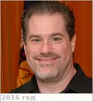](f/contact/c/colaprete1_photo.webp) <mark>nosign</mark> |

   - **[Education](edu.md):** PhD, Astrophysical, Planetary & Atmospheric Science, University of Colorado, 2000. MS, Astrophysical, Planetary & Atmospheric Science, University of Colorado, 1998. BA, Physics, University of Colorado, 1992.
   - **Exp.:** Mars General Circulation Modeling, Atmosphere radiative transfer, cloud physics, volatile transport & processes, instrument design, operation, flight mission design & operations. Hired as a civil servant in 2003, Colaprete split his time between fundamental scientific research & developing flight instrumentation. Colaprete has been the [Principal Investigator (PI)](principal_investigator.md) for several flight projects & instruments, including the LCROSS mission & the Lunar Atmosphere & Dust Environment Explorer (LADEE) Ultraviolet & Visible Spectrometer (UVS). Currently, he is the Project Scientist for the RP mission, PI for the Near InfraRed Volatiles Spectrometer System (NIRVSS) & leads the Ames Flight Instrument Group.
   - …
   - **SC/Equip.:** 2012 [LADEE](ladee.md), 2009 [LCROSS](lcross.md), 2007 [Venus Flagship Mission](venus_flagship_mission.md)
   - **Conferences:** …
   - Git: …・ [Facebook ⎆](https://www.facebook.com/tony.colaprete)・ Instagram: <mark>noin</mark> ・ [LinkedIn ⎆](https://www.linkedin.com/in/anthony-colaprete-6737a28b/)・ Twitter: <mark>notw</mark>
   - <https://www.nasa.gov/centers/ames/research/2007/colaprete.html>
   - <https://scholar.google.com/citations?:user=Ajm2yy4AAAAJ&hl=en>
   - **As a person:**
      1. …

 

### Cordova, Jaime Adrian Jr.

|*[Org.](contact.md)*|*[Wisconsin Univ.](contact/wisconsin_univ.md), US.*|
|:-|:-|
|B‑day, addr.|<mark>nodate</mark> 1994 / …|
|Contact|<jaime.cordova@wisc.edu>, *раб.:* <mark>noworkphone</mark>; *mobile:* <mark>nomobile</mark>|
|i18n|Кордова, Хайми Адриан Мл.|
| | <mark>nosign</mark>|

   - **[Education](edu.md):** PhD, Genetics, Wisconsin Univ.
   - **Exp.:** …
   - …
   - **SC/Equip.:** …
   - **Conferences:** 2019 [VD Workshop 2019](vdws2019.md)
   - Git: …・ [Facebook ⎆](https://www.facebook.com/jaime.cordova.9)・ Instagram: <mark>noin</mark> ・ [LinkedIn ⎆](https://www.linkedin.com/in/jaimecordova)・ [Twitter ⎆](https://twitter.com/jaimecor_94)
   - **As a person:**
      1. …

 

### Cottini, Valeria

|*[Org.](contact.md)*|*Maryland Univ., US. Associate Research Scientist*|
|:-|:-|
|B‑day, addr.|<mark>nodate</mark> 1982 / …|
|Contact|<valeria.cottini@nasa.gov>, *work:* +1(301)286-79-32 ; *mobile:* <mark>nomobile</mark>|
|i18n|<mark>TBD</mark>|
| |[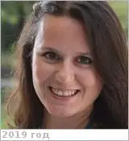](f/contact/c/cottini1_photo.webp) <mark>nosign</mark> |

   - **[Education](edu.md):** 2009, PhD, Astronomy, University of Rome Tor Vergata. 2005, MS, Physics, Sapienza Università di Roma.
   - **Exp.:** University of Maryland, US, Associate Research Scientist, 2013 ‑ Present. NASA Goddard Space Flight Center, US, NASA Postdoctoral Fellowship, 2011 ‑ 2013.
   - Atmospheres, radiative transfer computations, Mars’, Venus’, Titan’s, Saturn’s atmospheres, remote sensing and modeling of planetary atmospheres, multi‑wavelenghts — IR, UV, Visible — spectroscopy, atmospheric composition, planetary science., comparative studies of planetary atmospheres. Data processing and archiving. CubeSat missions design. Space missions’ concepts. Instrument concepts.
   - **SC/Equip.:** 2017 [Cubesat UV Experiment](cubesat_uv_experiment.md)
   - **Conferences:** …
   - Git: …・ [Facebook ⎆](https://www.facebook.com/valeria.cottini)・ Instagram: <mark>noin</mark> ・ [LinkedIn ⎆](https://www.linkedin.com/in/valeria-cottini-96187291/)・ Twitter: <mark>notw</mark>
   - <https://science.gsfc.nasa.gov/sed/bio/valeria.cottini>
   - <https://www.astro.umd.edu/people/vcottini.html>
   - <https://www.iau.org/administration/membership/individual/13115/>
   - <https://www.researchgate.net/profile/V_Cottini>
   - **As a person:**
      1. …

 

### Cutts, James Alfred

|*[Org.](contact.md)*|*[JPL](contact/jpl.md), US. Solar System Exploration Directorate, Program Manager*|
|:-|:-|
|B‑day, addr.|<mark>nodate</mark> 1945  / Pasadena, California, USA|
|Contact|<James.A.Cutts@jpl.nasa.gov>, *раб.:* +1(818)354-41-20; *mobile:* <mark>nomobile</mark>|
|i18n|<mark>TBD</mark>|
| |[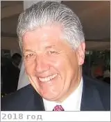](f/contact/c/cutts1_photo.webp) |

   - **[Education](edu.md):** MS (Geophysics) & PhD, Caltech, 1972, Planetary Science. BA in Physics from Cambridge University.
   - **Exp.:** Responsible for the development & demonstration of advanced concepts for solar system exploration. A major focus — planetary aerobots or robotic balloons. He was Manager of the Planetary Science Institute of Science Applications International Corporation & a scientific investigator with the Mariner 9 & Viking Orbiter Imaging teams. He was Program Manager for Advanced Concepts & Deputy Director of the Center for Space Microelectronics Technology (1988 ‑ 1991). He has served as Chair of NASA’s Sensor Working Group (1988 ‑ 1990) & has served on other NASA & U.S. Air Force advisory committees. He has authored ~50 papers in planetary science, sensor technology & innovative space missions concepts.
   - …
   - **SC/Equip.:** 2007 [Venus Flagship Mission](venus_flagship_mission.md)
   - **Conferences:** 2019 [VEXAG 17](vexag_2019.md), 2019 [IVC](ivc_2019.md)
   - Git: …・ [Facebook ⎆](http://www.facebook.com/jajcutts)・ Instagram: <mark>noin</mark> ・ [LinkedIn ⎆](https://www.linkedin.com/in/jim-cutts-33974011/)・ Twitter: <mark>notw</mark>
   - <https://vfm.jpl.nasa.gov/peoplevfm/>
   - <https://www.researchgate.net/profile/James_Cutts>
   - <https://jpl-nasa.academia.edu/JamesCutts>
   - **As a person:**
      1. …

 

### (✗) Челомей, Владимир Николаевич

|*[Org.](contact.md)*|*ЦИАМ, ОКБ-51, SU.*|
|:-|:-|
|B‑day, addr.|1914.06.30 ‑ 1984.12.08 / …|
|Contact|, |
|i18n|<mark>TBD</mark>|
| |[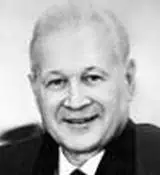](f/contact/c/chelomey1_photo.webp)|

   - **[Education](edu.md):** …
   - **Exp.:** Участвовал в создании ряда двигателей и прочих важнейших объектов ракетной, космической и авиационной техники. Под его руководством были разработаны ракеты‑носители («Протон» активно используется до сих пор), искусственные спутники Земли «Протон» и «Полёт», орбитальные станции серии «Алмаз», пилотируемый корабль ТКС и т. п. Являлся одним из ключевых создателей советского «ядерного щита». Однако же, один из крупнейших проектов учёного — интегрированный оборонно‑наступательный океаническо‑сухопутно‑космический комплекс — не был реализован и остался невостребованным советской и российской оборонной промышленностью. Основные научные труды по конструкции и динамике машин, теории колебаний, динамической устойчивости упругих систем, теории сервомеханизмов. Посмертно академик В. Н. Челомей в 1986 г. признан соавтором открытия (вместе с д.т. н. О. Н. Кудриным и А. В. Квасниковым) «Явления аномально высокого прироста тяги в газовом эжекционном процессе с пульсирующей активной струей». Открытие зарегистрировано в Государственном реестре открытий СССР под номером 314.
   - Конструктор ракетно‑космической техники и учёный в области механики и процессов управления, академик АН СССР (1962). Дважды Герой Социалистического Труда (1959, 1963). Лауреат Ленинской премии и трёх Государственных премий СССР. ┊ Фактически возглавлял Совет главных конструкторов в 1961 ‑ 1964 гг.
   - **SC/Equip.:** …
   - <https://ru.wikipedia.org/wiki/Челомей,_Владимир_Николаевич>

 

### Чулков, Илья Владиленович

|*[Org.](contact.md)*|*[ИКИ РАН](contact/iki_ras.md), RU. Отдел 71 «Проектирования и экспериментальной отработки бортовой и специализированной аппаратуры и комплексов». Заместитель директора - начальник отдела*|
|:-|:-|
|B‑day, addr.|<mark>nodate</mark> / …|
|Contact|<chulkov@cosmos.ru>, *раб.:* +7(495)333-44-12, Fax: +7(495)913-30-40; *mobile:* +7(916)127-77-19|
|i18n|<mark>TBD</mark>|
| ||

   - **[Education](edu.md):** …
   - **Exp.:** …
   - …
   - **SC/Equip.:** …
   - **Conferences:** …
   - Git: …・ [Facebook ⎆](https://www.facebook.com/ilya.chulkov.31)・ Instagram: <mark>noin</mark> ・ LinkedIn: <mark>noli</mark> ・ Twitter: <mark>notw</mark>
   - <http://hea.iki.rssi.ru/HEAD_RUS/people_k.htm>
   - <https://ok.ru/profile/463141922>
   - **As a person:**
      1. …

 

## D

 

### D'Incecco, Piero

|*[Org.](contact.md)*|*[IRSPS](contact/irsps.md), EU. Planetary geologist*|
|:-|:-|
|B‑day, addr.|1983.05.03 / … Italy|
|Contact|<piero.dincecco@unich.it>, <piero.dincecco@planetaryscience.de>, *раб.:* +49(176)329-814-72; *mobile:* +39(389)462-98-83|
|i18n|Пьеро Д'Инчекко|
| |[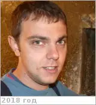](f/contact/d/dincecco1_photo.webp) <mark>nosign</mark>|

   - **[Education](edu.md):** PhD, Department of Astronomy, University of Oulu.
   - **Exp.:** Planetary geologist, particularly focused on surface morphology of terrestrial bodies.
   - …
   - **SC/Equip.:** …
   - **Conferences:** 2019 [10MS3](msss_10.md)
   - Git: …・ [Facebook ⎆](https://www.facebook.com/piero.dincecco.39)・ [Instagram ⎆](https://instagram.com/piero_dincecco)・ [LinkedIn ⎆](https://de.linkedin.com/in/piero-d-incecco-1a3118137)・ [Twitter ⎆](https://twitter.com/piero_dincecco)
   - <http://planetaryscience.fi/members/piero-dincecco/>
   - <https://www.researchgate.net/profile/Piero_Dincecco>
   - **As a person:**
      1. …

 

### Domagal-Goldman, Shawn

|*[Org.](contact.md)*|*[NASA](contact/nasa.md) [GSFC](contact/gsfc.md), US. Planetary Systems Laboratory, Planetary Science Division, Science & Exploration Directorate. Lab head, Research Space Scientist*|
|:-|:-|
|B‑day, addr.|<mark>nodate</mark> / …|
|Contact|<shawn.goldman@nasa.gov>, *раб.:* +1(301)614-62-45; *mobile:* <mark>nomobile</mark>|
|i18n|<mark>TBD</mark>|
| |[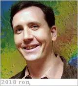](f/contact/d/domagalgoldman1_photo.webp) <mark>nosign</mark>|

   - **[Education](edu.md):** PhD in Geosciences & Astrobiology.
   - **Exp.:** Research interests: Exoplanets, Archean geochemistry, planetary atmospheres, astrobiology. My research focuses on ascertaining as much as possible about «alien planets» using sparse data sets. For early Earth & other terrestrial planets, I work on utilizing isotopic trends as proxies for atmospheric processes & elemental cycling. This includes work on the fundamental controls on Fe isotope fractionation & on global controls on mass‑independent Sulfur isotope fractionation (S‑MIF). For extrasolar planets, I help develop spectroscopy‑based characterization techniques that can inform us about a planet’s surface climate, habitability, & ecosystems. I'm also extremely passionate about science communication, & believe it is our responsibility as publicly‑funded scientists to bring the results of our research back to the public. To this end, I’ve helped organize FameLab events in the US… & am always looking for new opportunities to talk about NASA science in public forums.
   - …
   - **SC/Equip.:** …
   - **Conferences:** 2019 [VD Workshop 2019](vdws2019.md)
   - Git: …・ [Facebook ⎆](https://www.facebook.com/shawndgoldman)・ Instagram: <mark>noin</mark> ・ [LinkedIn ⎆](https://www.linkedin.com/in/shawn-domagal-goldman-42a6a39)・ Twitter: <mark>notw</mark>
   - <https://en.wikipedia.org/wiki/Shawn_Domagal-Goldman>
   - <https://science.gsfc.nasa.gov/sed/bio/shawn.goldman>
   - <https://carnegiescience.edu/otherearths>
   - <https://www.researchgate.net/profile/Shawn_Domagal-Goldman>
   - <https://scholar.google.com/citations?:user=Yh6HcGwAAAAJ&hl=en>
   - **As a person:**
      1. …

 

### Dong, Chuanfei

|*[Org.](contact.md)*|*[Princeton Univ.](princeton_univ.md), US. Astrophysical Sciences, Associate Research Scholar (2018)*|
|:-|:-|
|B‑day, addr.|1984.04.30 (Китай) / Princeton, USA|
|Contact|<dcfy@princeton.edu>, *раб.:* <mark>noworkphone</mark>; *mobile:* +1(404)824-39-66; *skype* — scfyln|
|i18n|<mark>TBD</mark>|
| |[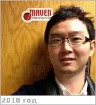](f/contact/d/dong1_photo.webp) <mark>nosign</mark>|

   - **[Education](edu.md):** PhD, Space & planetary sciences & scientific computing, University of Michigan USA, 2015 / MS, Nuclear Engineering & Radiological Sciences, University of Michigan, 2014 / MS, Space & Planetary Sciences, University of Michigan USA, 2012 / MS, Earth & Atmospheric Sciences, Georgia Institute of Technology USA, 2010 / BS, Geophysics (Space Physics), Physics (Theoretical Physics), & Math (Mathematical Physics), University of Science & Technology of China, 2009.
   - **Exp.:** My research interests include: star-planet interactions, (exo-) planetary habitability & astrobiology, solar wind interaction with planets/moons (e.g., Mars, Venus, Mercury, Titan & Ganymede), ion/electron heating by Alfvén/whistler waves via non/sub‑resonant interaction, high intensity laser-plasma interaction, electrons & coherent radiation (in traveling wave tube, klystron, gyrotron, magnetron), magnetic reconnection & turbulence, information feedback in intelligent transportation systems (ITSs), application of the evolutionary game theory to traffic networks.
   - If you have difficulty to pronounce my name, please feel free to call me /Tran'fei/.
   - **SC/Equip.:** …
   - **Conferences:** 2019 [IVC](ivc_2019.md)
   - Git: …・ [Facebook ⎆](https://www.facebook.com/chuanfei.dong)・ [Instagram ⎆](https://instagram.com/scfyl)・ [LinkedIn ⎆](https://www.linkedin.com/in/chuanfei-dong-01535018/)・ Twitter: <mark>notw</mark>
   - <https://web.astro.princeton.edu/people/chuanfei-dong>
   - <https://sites.google.com/site/chuanfeidong/>
   - **As a person:**
      1. …

 

### Dumoulin, Caroline

|*[Org.](contact.md)*|*LPG, Université de Nantes, EU (FR). Enseignant-chercheur*|
|:-|:-|
|B‑day, addr.|<mark>nodate</mark> 1972, FR / …|
|Contact|<caroline.dumoulin@univ-nantes.fr>, *work:* +33(0)251-125-480; *mobile:* <mark>nomobile</mark>|
|i18n|<mark>TBD</mark>|
| |[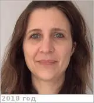](f/contact/d/dumoulin1_photo.webp) <mark>nosign</mark> |

   - **[Education](edu.md):** PhD, Convection mantellique et structure de la lithosphère, Sciences de la Terre, 2000.
   - **Exp.:** …
   - …
   - **SC/Equip.:** … [EnVision](envision.md)
   - **Conferences:** …
   - Git: …・ Facebook: <mark>nofb</mark> ・ Instagram: <mark>noin</mark> ・ [LinkedIn ⎆](https://www.linkedin.com/in/caroline-dumoulin-12b95537/)・ Twitter: <mark>notw</mark>
   - <https://lpg-umr6112.fr/index.php?:option=com_content&view=article&id=599&lang=en>
   - **As a person:**
      1. …

 

### Dyar, Darby Melinda

|*[Org.](contact.md)*|*[Mount Holyoke College](mtholyoke_college.md), US. Department of Astronomy. Professor of Astronomy*|
|:-|:-|
|B‑day, addr.|<mark>nodate</mark> 1958.. / …|
|Contact|<mdyar@mtholyoke.edu>, *раб.:* +1(413)538-30-73; *mobile:* <mark>nomobile</mark>|
|i18n|<mark>TBD</mark>|
| |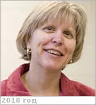 |

   - **[Education](edu.md):** PhD, Geochemistry, Massachusetts Institute of Technology. BA, Geology & Art History, Wellesley College.
   - **Exp.:** Targets: Earth, Mars, Mercury, Moon, Venus. Mineralogist & spectroscopist interested in a wide range of problems relating to the evolution of the solar system. Study the redox state of iron & the abundance of hydrogen in solar system materials using Mossbauer, x‑ray absorption, & FTIR spectroscopy. Has pioneered use of machine learning tools to interpret spectroscopic data. Participating Scientist on the Mars Science Laboratory science team. In addition to being a Senior Scientist at [PSI](contact/psi.md), Darby Dyar is also Kennedy‑Schelkunoff Professor of Astronomy at Mt. Holyoke College.
   - …
   - **SC/Equip.:** …
   - **Conferences:** 2019 [VEXAG 17](vexag_2019.md)
   - Git: …・ Facebook: <mark>nofb</mark> ・ Instagram: <mark>noin</mark> ・ [LinkedIn ⎆](https://www.linkedin.com/in/melinda-darby-dyar-81646b5)・ Twitter: <mark>notw</mark>
   - <https://www.mtholyoke.edu/people/m-darby-dyar>
   - <https://solarsystem.nasa.gov/people/2180/darby-dyar/>
   - <https://www.psi.edu/about/staffpage/mdyar>
   - <https://mars.nasa.gov/people/profile/?:id=22857>
   - **As a person:**
      1. …

 

### Долгополов, Владимир Павлович

|*[Org.](contact.md)*|*НПОЛ, RU. 9/301. Отдел 512 «Проектно‑конструкторский». Ведущий специалист*|
|:-|:-|
|B‑day, addr.|1939.03.16, на НПОЛ с 1968 / …|
|Contact|<mark>noemail</mark>, *work:* 31-35; *mobile:* +7(903)775-55-56|
|i18n|Dolgopolov, Vladimir Pavlovich|
| | |

   - **[Education](edu.md):** …
   - **Exp.:** С 2017.05.05 ведущий специалист отдела 512 в составе группы «Лунатиков» *(позывной — «Профессор Звёздочкин»)*. До 2017.05.05 ведущий специалист Дирекции 202.
   - Имеет интересную особенность организма — может плавно уснуть на пару минут, если не занят активным делом, и так же плавно проснуться. ┊ Знаком с [Kerry Nock](person.md).
   - **SC/Equip.:** … [Luna‑27](луна_27.md), … [Luna‑25](луна_25.md), 1984 [Вега‑1/2](vega_1_2.md), (1983) [Венера‑15/16](venera_15_16.md), (1981) [Венера‑13/14](venera_13_14.md), (1978) [Венера‑11/12](venera_11_12.md), 1976 [Луна‑24](луна_24.md), (1975) [Венера‑9/10](venera_9_10.md), (1972) [Венера‑8](venera_8.md), (1970) [Венера‑7](venera_7.md), (1969) [Венера‑5/6](venera_5_6.md), 1966 [Луна‑9](луна_9.md), (1965) [Венера‑3](venera_2_3.md)
   - **Conferences:** …
   - Git: …・ Facebook: <mark>nofb</mark> ・ Instagram: <mark>noin</mark> ・ LinkedIn: <mark>noli</mark> ・ Twitter: <mark>notw</mark>
   - **As a person:**
      1. …

 

## E

 

### Economou, Thanasis

|*[Org.](contact.md)*|*[Chicago Univ.](chicago_univ.md), US. Senior Scientist*|
|:-|:-|
|B‑day, addr.|1937.05.06 (Greece) / …|
|Contact|<tecon@tecon.uchicago.edu>, *раб.:* <mark>noworkphone</mark>; *mobile:* <mark>nomobile</mark>|
|i18n|<mark>TBD</mark>|
| |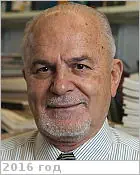 <mark>nosign</mark>|

   - **[Education](edu.md):** …
   - **Exp.:** **Таназис (Том) Экономоу.** Понимает и говорит по‑русски.
   - …
   - **SC/Equip.:** …
   - **Conferences:** 2019 [VD Workshop 2019](vdws2019.md)
   - Git: …・ [Facebook ⎆](https://www.facebook.com/tecon37)・ Instagram: <mark>noin</mark> ・ [LinkedIn ⎆](https://www.linkedin.com/in/thanasis-economou-09096818/)・ Twitter: <mark>notw</mark>
   - <https://news.uchicago.edu/profile/thanasis-economou>
   - <http://www.planetary.org/connect/our-experts/profiles/thanasis-economou.html>
   - **As a person:**
      1. …

 

### Ernst, Richard E.

|*[Org.](contact.md)*|*Carleton Univ., US. Tomsk SU, RU. Scientist in Residence*|
|:-|:-|
|B‑day, addr.|<mark>nodate</mark> / …|
|Contact|<richard.ernst@ernstgeosciences.com>, *раб.:* +1(613)295-79-55; *mobile:* <mark>nomobile</mark>|
|i18n|<mark>TBD</mark>|
| |[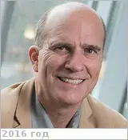](f/contact/e/ernst1_photo.webp) <mark>nosign</mark>|

   - **[Education](edu.md):** PhD, P.Geo., Carleton Univ., 1989.
   - **Exp.:** Skills & Expertise: Tectonics, Geological Mapping, Geology, Mining, Geochemistry, Plate Tectonics, Geochronology, Gas, Geodynamics, Petrology, Paleomagnetism, Meteorites, TIMS.
   - …
   - **SC/Equip.:** …
   - **Conferences:** 2019 [MSSS 10](msss_10.md), 2019 [VD Workshop 2019](vdws2019.md)
   - Git: …・ [Facebook ⎆](https://www.facebook.com/richard.ernst.792)・ Instagram: <mark>noin</mark> ・ [LinkedIn ⎆](https://ca.linkedin.com/in/richard-ernst-7b787729)・ Twitter: <mark>notw</mark>
   - <https://scholar.google.ca/citations?:user=MVgMw54AAAAJ&hl=en>
   - <http://research.earthsci.carleton.ca/ernst-lab>
   - <http://ernstgeosciences.com>
   - **As a person:**
      1. …

 

### Esposito, Larry W.

|*[Org.](contact.md)*|*[LASP](contact/lasp.md), US. Professor, Astrophysical & Planetary Sciences. [Principal Investigator](principal_investigator.md), UVIS Instrument on the Cassini Mission to Saturn*|
|:-|:-|
|B‑day, addr.|1951.04.15 / …|
|Contact|<larry.esposito@lasp.colorado.edu>, *раб.:* +1(303)492-73-25; *mobile:* <mark>nomobile</mark>|
|i18n|<mark>TBD</mark>|
| |[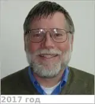](f/contact/e/esposito1_photo.webp) <mark>nosign</mark>|

   - **[Education](edu.md):** A 1973 graduate at the Massachusetts Institute of Technology. PhD in astronomy.
   - **Exp.:** Observational & theoretical studies of planetary atmospheres & rings; chemistry & dynamics of Venus clouds; waves in Saturn’s rings; numerical methods for radiation transfer.
   - …
   - **SC/Equip.:** …
   - **Conferences:** 2019 [VD Workshop 2019](vdws2019.md), 2019 [IVC](ivc_2019.md)
   - Git: …・ [Facebook ⎆](https://www.facebook.com/larry.esposito.503)・ Instagram: <mark>noin</mark> ・ LinkedIn: <mark>noli</mark> ・ Twitter: <mark>notw</mark>
   - <https://en.wikipedia.org/wiki/Larry_W._Esposito>
   - <http://lasp.colorado.edu/~esposito/>
   - <https://www.colorado.edu/aps/larry-esposito>
   - **As a person:**
      1. …

 

### Ewan, Shannon

|*[Org.](contact.md)*|*[NASA](contact/nasa.md), US. International Program Specialist*|
|:-|:-|
|B‑day, addr.|<mark>nodate</mark> 1982 / Washington|
|Contact|<mark>noemail</mark>, *раб.:* <mark>noworkphone</mark>; *mobile:* <mark>nomobile</mark>|
|i18n|<mark>TBD</mark>|
| |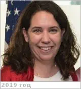 <mark>nosign</mark>|

   - **[Education](edu.md):** MA, International Relations & International Economics, Concentration: International Energy Policy, J.Hopkins Univ., 2009. BA, Political Science/French, Notre Dame Univ., 2003. Proficient in Russia, fluent in French. Russian language immersion at Moscow State University in January 2009.
   - **Exp.:** Specialties: Plutonium disposition, MOX fuel, HEU downblending, fissile material disposition, nuclear & radiological security, physical security, nuclear nonproliferation, federal budgeting, project management, energy security, U.S. energy policy, international science cooperation, EU-Russian energy relations, legislative process.
   - …
   - **SC/Equip.:** …
   - **Conferences:** 2019 [IVC](ivc_2019.md)
   - Git: …・ [Facebook ⎆](https://www.facebook.com/shannon.ewan.5)・ Instagram: <mark>noin</mark> ・ [LinkedIn ⎆](https://www.linkedin.com/in/shannon-ewan-aa44261/)・ Twitter: <mark>notw</mark>
   - **As a person:**
      1. …

 

### Ёлкин, Константин Сергеевич

|*[Org.](contact.md)*|*[ЦНИИмаш](contact/tsniimash.md), RU. Центр системного проектирования. Заместитель начальника отделения*|
|:-|:-|
|B‑day, addr.|1960.06.02 / …|
|Contact|<elkin@tsniimash.ru>, <elkin_konst@mail.ru>, *раб.:* +7(495)513-56-90, секретарь: +7(495)513-42-92; *mobile:* +7(926)601-82-41|
|i18n|<mark>TBD</mark>|
| |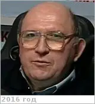 |

   - **[Education](edu.md):** МГУ
   - **Exp.:** …
   - …
   - **SC/Equip.:** …
   - **Conferences:** …
   - Git: …・ [Facebook ⎆](https://www.facebook.com/elkin.konst)・ Instagram: <mark>noin</mark> ・ LinkedIn: <mark>noli</mark> ・ Twitter: <mark>notw</mark>
   - **As a person:**
      1. …

 

### Елшанский, Леонид Борисович

|*[Org.](contact.md)*|*[Роскосмос](contact/roskosmos.md), RU. Консультант*|
|:-|:-|
|B‑day, addr.|<mark>nodate</mark> / …|
|Contact|<elshanskiy.lb@roscosmos.ru>, *раб.:* +7(495)631-91-22; *mobile:* <mark>nomobile</mark>|
|i18n|<mark>TBD</mark>|
| |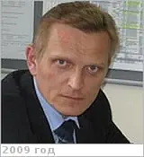 <mark>nosign</mark>|

   - **[Education](edu.md):** …
   - **Exp.:** …
   - …
   - **SC/Equip.:** …
   - **Conferences:** …
   - Git: …・ [Facebook ⎆](https://www.facebook.com/profile.php?:id=100004568714766)・ Instagram: <mark>noin</mark> ・ LinkedIn: <mark>noli</mark> ・ Twitter: <mark>notw</mark>
   - <https://ok.ru/profile/344026053>
   - **As a person:**
      1. Бывший военный — хочет всегда знать что, почему, где и как. Со своей стороны же старается не давать информации.

 

### Евдокимова, Дарья Геннадьевна

|*[Org.](contact.md)*|*[ИКИ РАН](contact/iki_ras.md) ([LATMOS](contact/latmos.md), [UVSQ](uvsq.md)), RU. 536 Лаборатория экспериментальной спектроскопии. Старший лаборант.*|
|:-|:-|
|B‑day, addr.|1993.09.23 (Москва, РФ) / Москва, РФ|
|Contact|<mark>noemail</mark>, *раб.:* <mark>noworkphone</mark>; *mobile:* <mark>nomobile</mark>|
|i18n|<mark>TBD</mark>|
| | <mark>nosign</mark>|

   - **[Education](edu.md):** …
   - **Exp.:** …
   - …
   - **SC/Equip.:** …
   - **Conferences:** 2019 [IVC](ivc_2019.md)
   - Git: …・ [Facebook ⎆](https://www.facebook.com/daria.evdokimova.9)・ [Instagram ⎆](https://instagram.com/phd_evdokimova), <https://instagram.com/d_tasmit> ・ LinkedIn: <mark>noli</mark> ・ Twitter: <mark>notw</mark>
   - <http://vk.com/tasmit>
   - **As a person:**
      1. Жмот.

 

### Эйсмонт, Натан Андреевич

|*[Org.](contact.md)*|*[ИКИ РАН](contact/iki_ras.md), RU. Ведущий научный сотрудник*|
|:-|:-|
|B‑day, addr.|<mark>nodate</mark> / …|
|Contact|<neismont@iki.rssi.ru>, *раб.:* <mark>noworkphone</mark>; *mobile:* +7(916)628-61-39|
|i18n|<mark>TBD</mark>|
| |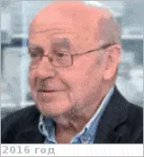 <mark>nosign</mark>|

   - Natan Eismont. 
   - **[Education](edu.md):** Кандидат технических наук, 2012. Доктор физ‑мат наук, математика, МГУ, 1968.
   - Очень общительный и весёлый человек. И постоянно требует каких‑то чётких ответов. ┊ Область научных исследований: динамика полётов и управление КА. Участвовал в исследованиях траектории полётов практически всех научных КА. Автор ~70 научных статей по данной тематике.
   - **SC/Equip.:** …
   - **Conferences:** [2019 VD Workshop](vdws2019.md)
   - Git: …・ Facebook: <mark>nofb</mark> ・ Instagram: <mark>noin</mark> ・ [LinkedIn ⎆](https://www.linkedin.com/in/натан‑эйсмонт‑029a57113/)・ Twitter: <mark>notw</mark>
   - <https://www.hse.ru/org/persons/56549114>
   - <http://viperson.ru/people/eysmont-natan-andreevich>
   - **As a person:**
      1. Обстоятелен, вдумчив.
      1. Говорит всегда много слов, витиевато и не всегда ясно.
      1. Нечётко расставляет акценты — часто выясняется, что мимолётно брошенная фраза на самом деле была очень важным поручением.

 

## G

 

### Ghail, Richard

|*[Org.](contact.md)*|*Imperial College London / Royal Holloway, University of London, UK. Department of Earth Sciences. Reader*|
|:-|:-|
|B‑day, addr.|<mark>nodate</mark> 1970  / …|
|Contact|<Richard.Ghail@rhul.ac.uk>, *work:* +44(1784)27-67-66; *mobile:* <mark>nomobile</mark>|
|i18n|<mark>TBD</mark>|
| |[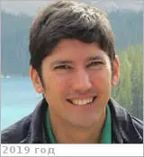](f/contact/g/ghail1_photo.webp) <mark>nosign</mark> |

   - **[Education](edu.md):** …
   - **Exp.:** As a Reader in Planetary & Engineering Geology I am interested in most areas of geology, but principally my research has been on tectonic processes away from plate boundaries, on continental areas of Earth, particularly the London Basin, & on Venus, where the lack of erosion means that these processes are more clearly discernible. I have worked with synthetic aperture radar ([SAR](cam.md)) data for more than 25 years & understand its strangeness as an imaging system, & the use of phase information for change detection. For the first time we now have a tool that can measure the mm/yr rate of horizontal & vertical movement characteristic of low seismicity continental interiors. I am applying these techniques to help predict ground engineering problems & groundwater flow, & am developing new tools using the full amplitude, phase & polarimetric components of SAR data. The London Basin appears to be modestly active at present but poorly understood, posing significant hazards to both the deeper (e.g., Crossrail) & older (e.g., the Northern Line) parts of London’s infrastructure. Of particular concern is the presence of local anoxic air pockets underground caused by cavitation & reduction by green rust during dewatering, & then trapped by rising groundwater in fault-bounded blocks. Understanding their origin & location is the subject of ongoing research with the Tideway Thames Tunnel project. I am lead proposer of EnVision, an ambitious European Medium Class mission to detect & measure the rates of internal, surface & atmospheric changes on Venus, using the most advanced Earth Observation SAR technology & experience. These new data are essential to understanding volcanic, tectonic & atmospheric processes on Venus & ultimately to explaining why a planet so similar to Earth has evolved so differently.
   - …
   - **SC/Equip.:** … [EnVision](envision.md)
   - **Conferences:** …
   - Git: …・ [Facebook ⎆](https://www.facebook.com/rich.ghail)・ Instagram: <mark>noin</mark> ・ [LinkedIn ⎆](https://www.linkedin.com/in/richard-ghail/)・ Twitter: <mark>notw</mark>
   - <https://www.researchgate.net/profile/Richard_Ghail>
   - <https://pure.royalholloway.ac.uk/portal/en/persons/richard-ghail(a2ddf183-a73b-473b-af37-9532b6063b6f).html>
   - **As a person:**
      1. …

 

### Glaze, Lori S.

|*[Org.](contact.md)*|*[NASA](contact/nasa.md), [GSFC](contact/gsfc.md), US. Planetary Geology, Geophys & Geochem Lab.*|
|:-|:-|
|B‑day, addr.|1964.07.19 (Техас) / …|
|Contact|<lori.s.glaze@nasa.gov>, *раб.:* +1(301)614-64-66, Fax: +1(301)614-60-15; *mobile:* <mark>nomobile</mark>|
|i18n|<mark>TBD</mark>|
| |[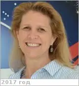](f/contact/g/glaze1_photo.webp) <mark>nosign</mark>|

   - **[Education](edu.md):** PhD, Volcanic eruption plume dynamics, Lancaster Univ., 1994. MS, Physics, Texas Univ., 1989. BS, Physics, Texas Univ., 1985.
   - **Exp.:** Venus exploration.
   - [Визитка (2018)](f/contact/g/glaze1_card01.webp). Паспорт: 821529569, истекает 2020.09.03.
   - **SC/Equip.:** 2017 [Cubesat UV Experiment](cubesat_uv_experiment.md), 2009 [Venus Mobile Explorer](venus_mobile_explorer.md), 2007 [Venus Flagship Mission](venus_flagship_mission.md)
   - **Conferences:** 2019 [IVC](ivc_2019.md)
   - Git: …・ [Facebook ⎆](https://www.facebook.com/lori.o.glaze)・ [Instagram ⎆](https://instagram.com/lori.glaze)・ [LinkedIn ⎆](https://www.linkedin.com/in/lori-s-glaze-b65b8119)・ [Twitter ⎆](https://twitter.com/loriglaze)
   - <https://en.wikipedia.org/wiki/Lori_Glaze>
   - <https://science.nasa.gov/about-us/leadership/lori-glaze>
   - <https://www.linkedin.com/in/lori-s-glaze-b65b8119/>
   - **As a person:**
      1. …

 

### Gentry, Diana M.

|*[Org.](contact.md)*|*[NASA Ames Research Center](contact/arc.md), US. Biospheric Science Branch. Staff, Student Career Experience Program Student*|
|:-|:-|
|B‑day, addr.|<mark>nodate</mark> / …|
|Contact|<diana.gentry@nasa.gov>, *раб.:* +1(650)604-54-41; *mobile:* <mark>nomobile</mark>|
|i18n|<mark>TBD</mark>|
| |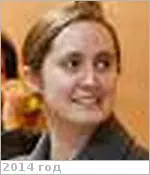 <mark>nosign</mark>|

   - **[Education](edu.md):** …
   - **Exp.:** …
   - …
   - **SC/Equip.:** 2019 [Venus Observing System](venus_observing_system.md)
   - **Conferences:** 2019 [VD Workshop 2019](vdws2019.md)
   - Git: …・ Facebook: <mark>nofb</mark> ・ Instagram: <mark>noin</mark> ・ LinkedIn: <mark>noli</mark> ・ Twitter: <mark>notw</mark>
   - <https://www.nasa.gov/centers/ames/earthscience/members/biosphericsciencebranch/Diana_Gentry>
   - <https://www.researchgate.net/scientific-contributions/2135434927_Diana_M_Gentry>
   - **As a person:**
      1. …

 

### Gonçalves, Ruben Henrique Machado

|*[Org.](contact.md)*|*[IA](ia.md), EU. Solar System, Planetary Atmospheres*|
|:-|:-|
|B‑day, addr.|1983.11.28 (Лиссабон, Португалия) / Лиссабон, Португалия|
|Contact|<geral@iastro.pt>, *раб.:* +(351)213-616-731; *mobile:* <mark>nomobile</mark>|
|i18n|<mark>TBD</mark>|
| | <mark>nosign</mark>|

   - **[Education](edu.md):** …
   - **Exp.:** …
   - …
   - **SC/Equip.:** …
   - **Conferences:** 2019 [IVC](ivc_2019.md)
   - Git: …・ [Facebook ⎆](https://www.facebook.com/ruben.yshua)・ Instagram: <mark>noin</mark> ・ LinkedIn: <mark>noli</mark> ・ [Twitter ⎆](https://twitter.com/iastroPT)
   - <https://www.researchgate.net/profile/Ruben_Goncalves3>
   - **As a person:**
      1. …

 

### Gorevan, Stephen Paul

|*[Org.](contact.md)*|*Honeybee, US. Founder, chairman*|
|:-|:-|
|B‑day, addr.|1955.06.07 Rockville Centre, New York, US / …|
|Contact|<gorevan@honeybeerobotics.com>, *work:* <mark>noworkphone</mark>; *mobile:* <mark>nomobile</mark>|
|i18n|<mark>TBD</mark>|
| |[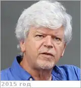](f/contact/g/gorevan1_photo.webp) <mark>nosign</mark> |

   - **[Education](edu.md):** BS, Music, New York Univ., 1978. BS, Science in Mechanical Engineering, City College of New York, 1983.
   - **Exp.:** Stephen Gorevan co‑founded Honeybee Robotics in 1983 & currently serves as the company’s Chairman. He is principally responsible for guiding the company’s direction toward the application of advanced robotic & automation techniques to new applications in the aerospace sector. His responsibilities include new technology development, company & engineering management, design & systems engineering. Mr. Gorevan has over 25 years of experience in leading advanced robotics & automation design, development, & implementation efforts for NASA, defense & industry. He currently serves as a Co‑Investigator on the science teams for the Mars Exploration Rovers (MER) & the Mars Science Laboratory (MSL) SAM instrument & is a member of the Venus Science Definition Team.
   - …
   - **SC/Equip.:** 2007 [Venus Flagship Mission](venus_flagship_mission.md)
   - **Conferences:** …
   - Git: …・ [Facebook ⎆](https://www.facebook.com/stephen.gorevan)・ Instagram: <mark>noin</mark> ・ [LinkedIn ⎆](https://www.linkedin.com/in/stephen-gorevan-042a8620/)・ Twitter: <mark>notw</mark>
   - <https://honeybeerobotics.com/about-us/history/>
   - <https://prabook.com/web/stephen_paul.gorevan/826918>
   - **As a person:**
      1. …

 

### Gray, Candace L.

|*[Org.](contact.md)*|*[New Mexico Univ.](nmexico_univ.md) / [Apache Obs.](apache_obs.md), US. Department of Astronomy. Support Astronomer.*|
|:-|:-|
|B‑day, addr.|<mark>nodate</mark> 1980 / …|
|Contact|<candaceg@nmsu.edu>, *раб.:* <mark>noworkphone</mark>; *mobile:* <mark>nomobile</mark>|
|i18n|<mark>TBD</mark>|
| |[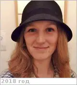](f/contact/g/gray1_photo.webp) <mark>nosign</mark>|

   - **[Education](edu.md):** PhD, Astronomy, New Mexico Univ., 2015.
   - **Exp.:** …
   - …
   - **SC/Equip.:** …
   - **Conferences:** 2019 [VEXAG 17](vexag_2019.md)
   - Git: …・ [Facebook ⎆](https://www.facebook.com/candace.gray.5667)・ Instagram: <mark>noin</mark> ・ [LinkedIn ⎆](https://www.linkedin.com/in/candace-gray-626577b5/)・ [Twitter ⎆](https://twitter.com/aredheadofvenus)
   - <https://www.researchgate.net/profile/Candace_Gray2>
   - <https://www.lpi.usra.edu/vexag/interview_series/index.shtml#gray>
   - **As a person:**
      1. …

 

### Green, James Lauer

|*[Org.](contact.md)*|*[NASA](contact/nasa.md), US. Science Mission Directorate — Planetary Science Division. Head Scientist*|
|:-|:-|
|B‑day, addr.|<mark>nodate</mark> / …|
|Contact|<mark>noemail</mark>, *раб.:* <mark>noworkphone</mark>; *mobile:* <mark>nomobile</mark>|
|i18n|<mark>TBD</mark>|
| | |

   - **[Education](edu.md):** PhD, Space Physics, Iowa Univ., 1979.
   - **Exp.:** Astronomy, Physics. He has written over 100 scientific articles in refereed journals involving various aspects of the Earth’s & Jupiter’s magnetospheres & over 50 technical articles on various aspects of data systems & networks.
   - …
   - **SC/Equip.:** …
   - **Conferences:** …
   - Git: …・ [Facebook ⎆](https://www.facebook.com/profile.php?:id=100007346137654)・ Instagram: <mark>noin</mark> ・ [LinkedIn ⎆](https://www.linkedin.com/in/james-green-a2a84a13/)・ Twitter: <mark>notw</mark>
   - <https://en.wikipedia.org/wiki/James_L._Green>
   - <https://science.nasa.gov/about-us/leadership/dr-jim-green>
   - **As a person:**
      1. …

 

### Gregg, Tracy

|*[Org.](contact.md)*|*[University at Buffalo College of Arts & Sciences](contact/buffalo_univ.md), US. Department of Geology. Associate Professor of Geology*|
|:-|:-|
|B‑day, addr.|1968.09.12 (Nebraska, USA) /|
|Contact|<tgregg@buffalo.edu>, *раб.:* +1(716)645-43-28; *mobile:* <mark>nomobile</mark>|
|i18n|<mark>TBD</mark>|
| | <mark>nosign</mark>|

   - **[CV](f/contact/g/gregg1_cv_17-18.pdf)**.
   - **Exp.:** Volcanic eruptions in extreme environments (mid‑ocean ridges & extraterrestrial surfaces); lava flow eruption & emplacement on Earth & other planets; constraining physics of eruptions from resulting volcanic morphologies.
   - …
   - **SC/Equip.:** …
   - **Conferences:** 2019 [VD Workshop 2019](vdws2019.md)
   - Git: …・ Facebook: <mark>nofb</mark> ・ Instagram: <mark>noin</mark> ・ [LinkedIn ⎆](https://www.linkedin.com/in/tracy-gregg-402a3795)・ Twitter: <mark>notw</mark>
   - <http://www.buffalo.edu/news/experts/tracy-gregg-faculty-expert-planetary-volcanology.html>
   - **As a person:**
      1. …

 

### Grimm, Robert E.

|*[Org.](contact.md)*|*[SWRI](contact/swri.md), US. Planetary Science Directorate. Program Director*|
|:-|:-|
|B‑day, addr.|<mark>nodate</mark> 1962 / …|
|Contact|<grimm@boulder.swri.edu>, *раб.:* +1(720)240-01-49, Fax: +1(303)546-96-87; *mobile:* <mark>nomobile</mark>|
|i18n|<mark>TBD</mark>|
| | <mark>nosign</mark>|

   - **[Education](edu.md):** PhD, Massachusetts Institute of Technology, 1988. BA, College Scholars, Tennessee Univ., 1983.
   - **Exp.:** Geophysics, planetary science. Geophysicist with interests in both planetary & terrestrial exploration. Much of my work was on the geodynamics of Venus, also investigated the thermal, collisional, & hydrogeological histories of meteorite parent bodies. Specializing in seismic exploration (detection of gas in naturally fractured reservoirs), electromagnetic discrimination of unexploded ordnance, & electrical detection of soil contaminants. My research focuses on geophysics & hydrogeology of Mars & asteroids, & electromagnetic sounding of planetary interiors.
   - …
   - **SC/Equip.:** …
   - **Conferences:** 2019 [VEXAG 17](vexag_2019.md)
   - Git: …・ Facebook: <mark>nofb</mark> ・ Instagram: <mark>noin</mark> ・ LinkedIn: <mark>noli</mark> ・ Twitter: <mark>notw</mark>
   - <https://scholar.google.com/citations?:user=7ssk2mEAAAAJ&hl=en>
   - <https://www.researchgate.net/profile/Robert_Grimm7>
   - <https://www.boulder.swri.edu/~grimm/>
   - **As a person:**
      1. …

 

### Grinspoon, David

|*[Org.](contact.md)*|*[PSI](contact/psi.md), US.*|
|:-|:-|
|B‑day, addr.|<mark>nodate</mark> 1959.. / …|
|Contact|<david@funkyscience.net>, *раб.:* <mark>noworkphone</mark>; *mobile:* <mark>nomobile</mark>|
|i18n|<mark>TBD</mark>|
| | <mark>nosign</mark>|

   - **[Education](edu.md):** PhD in Arizona Univ. B.A & BS in Brown University.
   - **Exp.:** Astrobiologist, award-winning science communicator, & prize-winning author. His research focuses on climate evolution on Earth‑like planets & potential conditions for life elsewhere in the universe. He is involved with several interplanetary spacecraft missions for NASA, the European Space Agency & the Japanese Space Agency.
   - …
   - **SC/Equip.:** 2007 [Venus Flagship Mission](venus_flagship_mission.md)
   - **Conferences:** 2019 [VD Workshop 2019](vdws2019.md), 2019 [IVC](ivc_2019.md)
   - Git: …・ [Facebook ⎆](https://www.facebook.com/david.grinspoon)・ Instagram: <mark>noin</mark> ・ [LinkedIn ⎆](https://www.linkedin.com/in/david-grinspoon-2880b57/)・ [Twitter ⎆](https://twitter.com/drfunkyspoon)
   - <https://en.wikipedia.org/wiki/David_Grinspoon>
   - <http://funkyscience.net/>
   - **As a person:**
      1. …

 

### Гаврик, Анатолий Леонидович

|*[Org.](contact.md)*|*[ИРЭ РАН](contact/ire_ras.md), RU.*|
|:-|:-|
|B‑day, addr.|<mark>nodate</mark> / …|
|Contact|<mark>noemail</mark>, *work:* <mark>noworkphone</mark>; *mobile:* <mark>nomobile</mark>|
|i18n|<mark>TBD</mark>|
| | <mark>nosign</mark> |

   - **[Education](edu.md):** …
   - **Exp.:** …
   - …
   - **SC/Equip.:** …
   - **Conferences:** …
   - Git: …・ Facebook: <mark>nofb</mark> ・ Instagram: <mark>noin</mark> ・ LinkedIn: <mark>noli</mark> ・ Twitter: <mark>notw</mark>
   - **As a person:**
      1. …

 

### Гаврилин, Сергей Иванович

|*[Org.](contact.md)*|*[НПО Лавочкина](contact/lav.md), RU. 127/216, 541 «Отдел аппаратуры аппаратных средств систем управления». Зам. начальника комплекса*|
|:-|:-|
|B‑day, addr.|1952.10.27, на НПОЛ с 1970 / …|
|Contact|<gavrilin@laspace.ru>, *work:* 45-96, 53-01, +7(495)575-53-01; *mobile:* +7(903)112-22-28|
|i18n|<mark>TBD</mark>|
| | |

   - **[Education](edu.md):** …
   - **Exp.:** …
   - …
   - **SC/Equip.:** …
   - **Conferences:** …
   - Git: …・ [Facebook ⎆](https://www.facebook.com/sergey.gavrilin.16)・ Instagram: <mark>noin</mark> ・ [LinkedIn ⎆](https://www.linkedin.com/in/sergey-gavrilin-82021aa2/)・ Twitter: <mark>notw</mark>
   - <…>
   - **As a person:**
      1. Увлекающийся человек, а увлекаясь, забывает обо всём другом.

 

### Герасимов, Михаил Владимирович

|*[Org.](contact.md)*|*[ИКИ РАН](contact/iki_ras.md), RU. Отдел № 53 «Физики планет и малых тел солнечной системы». Лаборатория № 532 «Прямых физико‑химических исследований планет». Заведующий лабораторией*|
|:-|:-|
|B‑day, addr.|<mark>nodate</mark> / …|
|Contact|<mgerasim@mx.iki.rssi.ru>, <mvg001@mail.ru>, *раб.:* +7(495)333-11-55; *mobile:* +7(903)533-76-34|
|i18n|<mark>TBD</mark>|
| | <mark>nosign</mark>|

   - **[Education](edu.md):** Кандидат физ‑мат наук.
   - **Exp.:** …
   - Mikhail Gerasimov. ┊ Автомобиль SAAB 9-5 к738тр199
   - **SC/Equip.:** …
   - **Conferences:** 2019 [VD Workshop 2019](vdws2019.md)
   - Git: …・ Facebook: <mark>nofb</mark> ・ Instagram: <mark>noin</mark> ・ [LinkedIn ⎆](https://www.linkedin.com/in/mikhail-gerasimov-a6233b25)・ Twitter: <mark>notw</mark>
   - <http://www.planetary-department-iki.ru/labs/labs532.html>
   - <http://www.planetary-department-iki.ru/people.html>
   - **As a person:**
      1. …

 

### Горинов, Дмитрий Алексеевич

|*[Org.](contact.md)*|*[ИКИ РАН](contact/iki_ras.md), RU. Отдел № 53 «Физики планет и малых тел солнечной системы». Лаборатория № 531 «Спектроскопии планетных атмосфер». Младший научный сотрудник*|
|:-|:-|
|B‑day, addr.|<mark>nodate</mark> /|
|Contact|<gorinov-dmitry@yandex.ru>, *раб.:* +7(495)333-41-02; *mobile:* +7(910)474-10-32|
|i18n|<mark>TBD</mark>|
| | <mark>nosign</mark>|

   - **[Education](edu.md):** …
   - **Exp.:** …
   - …
   - **SC/Equip.:** …
   - **Conferences:** 2019 [VD Workshop 2019](vdws2019.md), 2019 [IVC](ivc_2019.md)
   - Git: …・ Facebook: <mark>nofb</mark> ・ [Instagram ⎆](https://instagram.com/shattered_process)・ [LinkedIn ⎆](https://www.linkedin.com/in/dmitry-gorinov-bb4277113/)・ Twitter: <mark>notw</mark>
   - <https://vk.com/flowing_darkness>
   - <http://www.planetary-department-iki.ru/labs/labs531.html>
   - **As a person:**
      1. …

 

## H

 

### Hall, Jeffery L.

|*[Org.](contact.md)*|*[JPL](contact/jpl.md), US. Senior Engineer*|
|:-|:-|
|B‑day, addr.|1962.05.13 (Канада) / …|
|Contact|<jlhall@jpl.caltech.edu>, *раб.:* +1(818)354-15-31, Fax: +1(818)393-32-54; *mobile:* <mark>nomobile</mark>|
|i18n|<mark>TBD</mark>|
| | |

   - **[Education](edu.md):** PhD & MS, Aeronautics, Caltech. BS, Engineering Science, Toronto Univ.
   - **Exp.:** Senior Engineer at JPL who leads its technology development & mission application efforts in planetary balloons (aerobots). His work includes design of aerobot vehicles & missions, & Earth flight testing of balloons & airships.
   - **SC/Equip.:** 2007 [Venus Flagship Mission](venus_flagship_mission.md)
   - **Conferences:** …
   - Git: …・ [Facebook ⎆](https://www.facebook.com/jeffery.hall.794)・ Instagram: <mark>noin</mark> ・ [LinkedIn ⎆](https://www.linkedin.com/in/jeffery-hall-a1b991b7/)・ Twitter: <mark>notw</mark>
   - <https://www-robotics.jpl.nasa.gov/people/Jeffery_Hall/>
   - **As a person:**
      1. …

 

### Hashimoto, George L.

|*[Org.](contact.md)*|*Okayama Univ., JP. Associate Professor, Graduate School of Natural Science & Technology, Atmospheric Sciences, since 2009.01*|
|:-|:-|
|B‑day, addr.|1972.02.… Tokyo, JP / …|
|Contact|<george@okayama-u.ac.jp>, <george@gfd-dennou.org>, *work:* <mark>noworkphone</mark>; *mobile:* <mark>nomobile</mark>|
|i18n|<mark>TBD</mark>|
| |<mark>nophoto</mark>  <mark>nosign</mark> |

   - **[Education](edu.md):** PhD, Geophysics, Tokyo Univ., JP, 1999. MS, Geophysics, Tokyo Univ., JP, 1996. BS, Geophysics, Tokyo Univ., JP, 1994.
   - **Exp.:** Research Interest: Planetary climatology, Evolution of surface environments on terrestrial planets, Planetary meteorology (Venus Climate Orbiter), Development of meteorological sensors for martian lander.
   - …
   - **SC/Equip.:** 2007 [Venus Flagship Mission](venus_flagship_mission.md)
   - **Conferences:** 2019 [IVC](ivc_2019.md)
   - Git: …・ Facebook: <mark>nofb</mark> ・ Instagram: <mark>noin</mark> ・ LinkedIn: <mark>noli</mark> ・ Twitter: <mark>notw</mark>
   - <https://www.gfd-dennou.org/member/george/eindex.html>
   - <https://www.researchgate.net/scientific-contributions/72707487_George_L_Hashimoto>
   - **As a person:**
      1. …

 

### Hayashi, Yoshi-Yuki

|*[Org.](contact.md)*|*[Kobe Univ.](kobe_univ.md), JP. Graduate School of Science & Center for Planetary Science, Faculty of Science. Professor*|
|:-|:-|
|B‑day, addr.|<mark>nodate</mark> / …|
|Contact|<shosuke@gfd-dennou.org>, <shosuke@ruby.kobe-u.ac.jp>, <shosuke@cps-jp.org>, *раб.:* +81(78)803-64-83, Fax: +81(78)803-57-91; *mobile:* <mark>nomobile</mark>|
|i18n|<mark>TBD</mark>|
| | <mark>nosign</mark>|

   - **[Education](edu.md):** …
   - **Exp.:** Research Interests. Geophysical fluid dynamics; wave & shear instability, dry and/or moist convection, rotating turbulence. Structures of planetary atmospheres; thermal structures, convection & general circulations of the atmospheres. Computation & information meteorology; development of simulation models for geophysical fluids & planetary atmospheres, development of analysis & visualization tools for multidimensional numerical data.
   - …
   - **SC/Equip.:** …
   - **Conferences:** …
   - Git: …・ Facebook: <mark>nofb</mark> ・ Instagram: <mark>noin</mark> ・ LinkedIn: <mark>noli</mark> ・ Twitter: <mark>notw</mark>
   - <https://scholar.google.co.uk/citations?:user=nKbOLbQAAAAJ&hl=en>
   - <http://www.gfd-dennou.org/member/shosuke/index.html.en>
   - **As a person:**
      1. …

 

### Head, James W. Ⅲ

|*[Org.](contact.md)*|*[Brown Univ.](brown_univ.md), US. Distinguished Professor of Geological Sciences*|
|:-|:-|
|B‑day, addr.|<mark>nodate</mark> 1943 / …|
|Contact|<James_Head@brown.edu>, *раб.:* +1(401)863-25-26; *mobile:* <mark>nomobile</mark>|
|i18n|<mark>TBD</mark>|
| | <mark>nosign</mark>|

   - **[Education](edu.md):** **[CV](f/contact/h/head1_cv.pdf)**. PhD, Brown Univ., 1969. BS, Washington & Lee Univ., 1964.
   - **Exp.:** He studies the roles of volcanism in planetary crusts as well as the geological evolution of Mars, & has served as the investigator on many major international planetary investigation missions. He helped train Apollo astronauts under the NASA Apollo Lunar Exploration Program. He has published 25 chapters in books on planetary geology & over 300 refereed articles in scientific journals, & has supervised nearly 40 PhD students.
   - …
   - **SC/Equip.:** 2007 [Venus Flagship Mission](venus_flagship_mission.md)
   - **Conferences:** 2019 [MSSS 10](msss_10.md), 2019 [VD Workshop 2019](vdws2019.md), 2019 [IVC](ivc_2019.md)
   - Git: …・ Facebook: <mark>nofb</mark> ・ Instagram: <mark>noin</mark> ・ LinkedIn: <mark>noli</mark> ・ Twitter: <mark>notw</mark>
   - <https://en.wikipedia.org/wiki/James_W._Head>
   - <http://planetary.brown.edu/html_pages/head.htm>
   - <https://scholar.google.com/citations?:user=GgICCQIAAAAJ&hl=en>
   - **As a person:**
      1. …

 

### Helbert, Jörn

|*[Org.](contact.md)*|*[DLR](contact/dlr.md), Institute for Planetary Research, DE. Professor*|
|:-|:-|
|B‑day, addr.|<mark>nodate</mark> / …|
|Contact|<mark>noemail</mark>, *work:* +49(30)670-55-319; *mobile:* <mark>nomobile</mark>|
|i18n|<mark>TBD</mark>|
| | <mark>nosign</mark> |

   - **[Education](edu.md):** …
   - **Exp.:** …
   - …
   - **SC/Equip.:** 2010 [Akatsuki](akatsuki.md)
   - **Conferences:** 2019 [IVC](ivc_2019.md)
   - Git: …・ [Facebook ⎆](https://www.facebook.com/jorn.helbert)・ Instagram: <mark>noin</mark> ・ [LinkedIn ⎆](https://www.linkedin.com/in/jornhelbert/)・ [Twitter ⎆](https://twitter.com/planetguy_bln)
   - <https://scholar.google.com/citations?:user=X0lFw2IAAAAJ&hl=en>
   - **As a person:**
      1. Занятой. Может не отвечать еа письма (звонки, чаты и пр.).

 

### Hino, Takafumi

|*[Org.](contact.md)*|*Matsue College, JP.*|
|:-|:-|
|B‑day, addr.|<mark>nodate</mark> / …|
|Contact|<mark>noemail</mark>, *work:* <mark>noworkphone</mark>; *mobile:* <mark>nomobile</mark>|
|i18n|<mark>TBD</mark>|
| |<mark>nophoto</mark>  <mark>nosign</mark> |

   - **[Education](edu.md):** …
   - **Exp.:** …
   - …
   - **SC/Equip.:** 2010 [Akatsuki](akatsuki.md)
   - **Conferences:** …
   - Git: …・ Facebook: <mark>nofb</mark> ・ Instagram: <mark>noin</mark> ・ LinkedIn: <mark>noli</mark> ・ Twitter: <mark>notw</mark>
   - **As a person:**
      1. …

 

### Hunter, Gary W.

|*[Org.](contact.md)*|*[GRC](contact/grc.md), US. Senior Electronics Engineering*|
|:-|:-|
|B‑day, addr.|<mark>nodate</mark> / …|
|Contact|<gary.w.hunter@nasa.gov>, *раб.:* +1(216)433-64-59; *mobile:* <mark>nomobile</mark>|
|i18n|<mark>TBD</mark>|
| | <mark>nosign</mark>|

   - **[Education](edu.md):** …
   - **Exp.:** Technical Lead for the Chemical Species Gas Sensors Team & Lead for Intelligent System Hardware in the Smart Sensors & Electronics Systems Branch at NASA GRC. Has served as Element Lead across NASA for a range Propulsion & Vehicle Health Management activities in the Aviation Safety program. Since his arrival at NASA Glenn, he has been involved with the design, fabrication, & testing of sensors. He has worked closely with academia & industry in developing a range of sensor technologies & sensor systems using a number of different sensor materials & sensing approaches.
   - …
   - **SC/Equip.:** 2007 [Venus Flagship Mission](venus_flagship_mission.md)
   - **Conferences:** 2019 [VEXAG 17](vexag_2019.md)
   - Git: …・ [Facebook ⎆](https://www.facebook.com/gary.w.hunter.5)・ Instagram: <mark>noin</mark> ・ [LinkedIn ⎆](https://www.linkedin.com/in/gary-hunter-8a06244b/)・ Twitter: <mark>notw</mark>
   - <https://nari.arc.nasa.gov/hunter>
   - <https://www.researchgate.net/profile/Gary_Hunter3>
   - **As a person:**
      1. …

 

### Хайлов, Михаил Николаевич

|*[Org.](contact.md)*|*[Роскосмос](contact/roskosmos.md), RU. Заместитель ген. директора по автоматическим космическим комплексам и системам Госкорпорации «Роскосмос»*|
|:-|:-|
|B‑day, addr.|1973.07.07, в Роскосмосе с 2008 / …|
|Contact|<mark>noemail</mark>, *раб.:* …, секретарь: +7(495)631-93-95, Fax: +7(495)631-89-93; *mobile:* +7(916)158-02-32, +7(916)170-34-11|
|i18n|<mark>TBD</mark>|
| | |

   - **[Education](edu.md):** M.S., Космические летательные аппараты и разгонные блоки, МАИ, РФ, 1996.
   - **SC/Equip.:** …
   - …
   - **Conferences:** …
   - Git: …・ Facebook: <mark>nofb</mark> ・ Instagram: <mark>noin</mark> ・ LinkedIn: <mark>noli</mark> ・ Twitter: <mark>notw</mark>
   - <http://www.federalspace.ru/120/>
   - **As a person:**
      1. …

 

### Хатунцев, Игорь Валерьевич

|*[Org.](contact.md)*|*[ИКИ РАН](contact/iki_ras.md), RU. Отдел № 53 «Физики планет и малых тел солнечной системы». Лаб. № 531 «Спектроскопии планетных атмосфер». Старший научный сотрудник*|
|:-|:-|
|B‑day, addr.|<mark>nodate</mark> / …|
|Contact|<khatuntsev@gmail.com>, *work:* <mark>noworkphone</mark>; *mobile:* +7(495)333-41-02|
|i18n|<mark>TBD</mark>|
| | <mark>nosign</mark> |

   - **[Education](edu.md):** …
   - **Exp.:** …
   - …
   - **SC/Equip.:** …
   - **Conferences:** …
   - Git: …・ Facebook: <mark>nofb</mark> ・ Instagram: <mark>noin</mark> ・ LinkedIn: <mark>noli</mark> ・ Twitter: <mark>notw</mark>
   - <http://www.planetary-department-iki.ru/labs/labs531.html>
   - **As a person:**
      1. …

 

## I

 

### Imamura, Takeshi

|*[Org.](contact.md)*|*[Tokyo Univ.](contact/tokyo_univ.md), JP. Faculty of Science & Technology, Liberal Arts. Department of Complexity Science & Engineering / Planetary atmospheres, Planetary exploration. Professor*|
|:-|:-|
|B‑day, addr.|<mark>nodate</mark> 1969 / …|
|Contact|<ima@isas.jaxa.jp>, *work:* +81(4)7124-15-01; *mobile:* <mark>nomobile</mark>|
|i18n|<mark>TBD</mark>|
| | <mark>nosign</mark> |

   - **[Education](edu.md):** PhD, Tokyo Univ., 1998.
   - **Exp.:** Professor, Tokyo Univ., 2016. Associate Professor, [ISAS](contact/isas.md)/JAXA, 2002. Research associate, ISAS/JAXA, 1998.
   - Research Activities: 1) Exploration of planetary atmospheres — exploration of the atmosphere on Venus by the Japanese explorer AKATSUKI is ongoing. We use data collected by AKATSUKI to unveil the mysteries of Venusian meteorology, such as the high‑speed westward circulation "super‑rotation" & thick sulfuric acid clouds. The development of a Mars exploration program focused on water cycle & dust transport is also ongoing. 2) Radio occultation observations — in a radio occultation experiment, a spacecraft transmits radio waves toward a tracking station on the earth & sequentially goes behind the planet’s atmosphere. During such occultation events, the planetary atmosphere causes frequency & amplitude fluctuations from which information on the atmosphere can be obtained. We apply this technique to various planets & the solar corona. 3) Numerical modeling — common physical processes behind the apparent diversity of atmospheric phenomena on the planets are investigated with numerical modeling & theories. Other Activities: The Society of Geomagnetism & Earth, Planetary & Space Sciences (SGEPSS), Meteorological Society of Japan (MSJ), The Japanese Society for Planetary Sciences (JSPS).
   - **SC/Equip.:** 2010 [Akatsuki](akatsuki.md)
   - **Conferences:** 2019 DPS‑EPSC, 2019 [IVC](ivc_2019.md)
   - Git: …・ Facebook: <mark>nofb</mark> ・ Instagram: <mark>noin</mark> ・ [LinkedIn ⎆](https://www.linkedin.com/in/takeshi-imamura-82478b123/)・ Twitter: <mark>notw</mark>
   - <https://tus.elsevierpure.com/en/persons/takeshi-imamura>
   - <https://www.tus.ac.jp/en/fac/p/index.php?:43cc>
   - <https://www.k.u-tokyo.ac.jp/pros-e/person/takeshi_imamura/takeshi_imamura.htm>
   - <http://www.astrobio.k.u-tokyo.ac.jp/imamura/>
   - <https://global.jaxa.jp/article/2016/interview/vol95/>
   - **As a person:**
      1. …

 

### Ishii, Nobuaki

|*[Org.](contact.md)*|*[ISAS](contact/isas.md)/[JAXA](contact/jaxa.md), JP. Department of Space Flight Systems. Professor*|
|:-|:-|
|B‑day, addr.|<mark>nodate</mark> / …|
|Contact|<ishii@newslan.isas.jaxa.jp>, <ishii.nobuaki@jaxa.jp>, <ishii@isas.jaxa.jp>, *work:* <mark>noworkphone</mark>; *mobile:* <mark>nomobile</mark>|
|i18n|<mark>TBD</mark>|
| |<mark>nophoto</mark>  <mark>nosign</mark> |

   - **[Education](edu.md):** …
   - **Exp.:** …
   - Research interests: Mission Analysis of Lunar and Planetary Exploration, Study on mission analyses and system feasibilities of lunar and planetary exploration, based on orbital dyanamics.
   - **SC/Equip.:** 2010 [Akatsuki](akatsuki.md)
   - **Conferences:** 2013 [VEXAG 11](vexag_11.md)
   - Git: …・ Facebook: <mark>nofb</mark> ・ Instagram: <mark>noin</mark> ・ LinkedIn: <mark>noli</mark> ・ Twitter: <mark>notw</mark>
   - <http://www.isas.jaxa.jp/sokendai/e/about/staff/space_technologies.html#staff_4>
   - <http://www.isas.jaxa.jp/about/researchers/nobuaki_ishii.html>
   - <https://www.researchinsvalbard.no/profile/11309>
   - **As a person:**
      1. …

 

### Iwagami, Naomoto

|*[Org.](contact.md)*|*Tokyo Univ., JP. Graduate School of Science, Department of Earth and Planetary Science. Associate professor*|
|:-|:-|
|B‑day, addr.|<mark>nodate</mark> 1955  / …|
|Contact|<mark>noemail</mark>, *work:* <mark>noworkphone</mark>; *mobile:* <mark>nomobile</mark>|
|i18n|<mark>TBD</mark>|
| |<mark>nophoto</mark>  <mark>nosign</mark> |

   - **[Education](edu.md):** PhD
   - **Exp.:** Tokyo Univ., Research Associate, 1981 ‑ 1990. Japan Society of Promoting Science, Researcher, 1980 ‑ 1981.
   - Research Areas: Earth and planetary science, Space and upper atmospheric physics. National Institute of Polar Research, Researcher, 1976 ‑ 1978.
   - **SC/Equip.:** 2010 [Akatsuki](akatsuki.md)
   - **Conferences:** …
   - Git: …・ Facebook: <mark>nofb</mark> ・ Instagram: <mark>noin</mark> ・ LinkedIn: <mark>noli</mark> ・ Twitter: <mark>notw</mark>
   - <https://researchmap.jp/read0007762/?:Lang=english>
   - <https://www.researchgate.net/profile/Naomoto_Iwagami>
   - <https://nrid.nii.ac.jp/nrid/1000030143374/>
   - <https://ci.nii.ac.jp/nrid/1000030143374/en/>
   - **As a person:**
      1. …

 

### Izenberg, Noam

|*[Org.](contact.md)*|*[JHUAPL](contact/jhuapl.md), US. Planetary Geologist; Planetary Scientist*|
|:-|:-|
|B‑day, addr.|1967.08.08 / …|
|Contact|<noam.izenberg@jhuapl.edu>, *раб.:* +1(240)228-79-18 ; *mobile:* <mark>nomobile</mark>|
|i18n|<mark>TBD</mark>|
| | |

   - **[Education](edu.md):** PhD, Earth & Planetary Sciences, 1996, Washington Univ. ScB, Geology, 1989, Brown Univ.
   - **Exp.:** Interested in the remote sensing & in situ measurement of the surface composition, morphology, stratigraphy, & active geologic processes of rocky planetary & solar system small bodies. Research interests include the hydrologic cycle & surface/atmosphere interface processes of said celestial bodies in extreme environments.
   - …
   - **SC/Equip.:** …
   - **Conferences:** 2019 [VEXAG 17](vexag_2019.md), 2019 [VD Workshop 2019](vdws2019.md)
   - Git: …・ [Facebook ⎆](https://www.facebook.com/noam.izenberg.7)・ Instagram: <mark>noin</mark> ・ [LinkedIn ⎆](https://www.linkedin.com/in/noam-izenberg-b774b8)・ [Twitter ⎆](https://twitter.com/Izenplanet)
   - <http://nift.firedrake.org/>
   - <https://secwww.jhuapl.edu/SpaceScience/Staff/ProfileView/26>
   - <https://hemi.jhu.edu/news/dr-noam-r-izenberg-joins-hemi/>
   - **As a person:**
      1. …

 

### Игнатьев, Николай Игоревич

|*[Org.](contact.md)*|*[ИКИ РАН](contact/iki_ras.md), RU. Каб. 616. Отдел № 53 «Физики планет и малых тел солнечной системы». Лаборатория № 531 «Спектроскопии планетных атмосфер». Старший научный сотрудник*|
|:-|:-|
|B‑day, addr.|<mark>nodate</mark> / …|
|Contact|<niignatiev@gmail.com>, *work:* +7(495)333-15-02; *mobile:* +7(903)120-11-93|
|i18n|<mark>TBD</mark>|
| | <mark>nosign</mark> |

   - **[Education](edu.md):** …
   - **Exp.:** …
   - Автомобиль Skoda Octavia с762ах190
   - **SC/Equip.:** …
   - **Conferences:** …
   - Git: …・ [Facebook ⎆](https://www.facebook.com/nikolay.ignatiev.1)・ Instagram: <mark>noin</mark> ・ LinkedIn: <mark>noli</mark> ・ Twitter: <mark>notw</mark>
   - <http://www.planetary-department-iki.ru/labs/labs531.html>
   - **As a person:**
      1. …

 

## J

 

### Jessup, Kandis Lea

|*[Org.](contact.md)*|*[SWRI](contact/swri.md), US. Senior Research Scientist.*|
|:-|:-|
|B‑day, addr.|1970.11.23 (США, штат Мэриленд) / …|
|Contact|<kandislea.jessup@swri.org>, <knasaven@gmail.com>, *раб.:* +1(720)240-01-18, Fax: +1(303)546-96-70; *mobile:* <mark>nomobile</mark>|
|i18n|<mark>TBD</mark>|
| | <mark>nosign</mark>|

   - **[Education](edu.md):** …
   - **Exp.:** Astrophysics.
   - **SC/Equip.:** …
   - **Conferences:** 2019 [VD Workshop 2019](vdws2019.md)
   - Git: …・ Facebook: <mark>nofb</mark> ・ Instagram: <mark>noin</mark> ・ LinkedIn: <mark>noli</mark> ・ Twitter: <mark>notw</mark>
   - <http://www.swri.org/iProfiles/ViewiProfile.asp?:k=8k8fy01aj15137m>
   - <https://www.lpi.usra.edu/vexag/interview_series/>
   - **As a person:**
      1. …

 

### Jindal, Abhinav

|*[Org.](contact.md)*|*[Cornell Univ.](cornell_univ.md), US. Astronomy & Space Sciences. Graduate Teaching Assistant*|
|:-|:-|
|B‑day, addr.|1994.10.12 (Мумбаи, Индия) / Итака, Нью‑Йорк, США|
|Contact|<asj59@cornell.edu>, *раб.:* <mark>noworkphone</mark>; *mobile:* +1(607)261-21-67|
|i18n|<mark>TBD</mark>|
| | <mark>nosign</mark>|

   - **[Education](edu.md):** PhD, Astronomy & Astrophysics, Cornell Univ., USA. B.Tech., Engineering Physics, Indian Institute of Technology, 2012-2016.
   - **Exp.:** My research interests include understanding the evolution of terrestrial planets & what makes a planet habitable. I am also interested in the search for life beyond Earth.
   - …
   - **SC/Equip.:** 2019 [Venus Observing System](venus_observing_system.md)
   - **Conferences:** 2019 [IVC](ivc_2019.md)
   - Git: …・ [Facebook ⎆](https://www.facebook.com/abhinavjindal93)・ [Instagram ⎆](https://instagram.com/abhinavjindal93)・ [LinkedIn ⎆](https://www.linkedin.com/in/abhinav-jindal-33280668)・ Twitter: <mark>notw</mark>
   - <https://astro.cornell.edu/abhinav-jindal>
   - <https://hayesresearchgroup.com/abhinav-jindal/>
   - <https://www.researchgate.net/profile/Abhinav_Jindal6>
   - <https://www.quora.com/profile/Abhinav-Jindal-1>
   - **As a person:**
      1. …

 

### Johnson, Natasha M.

|*[Org.](contact.md)*|*[GFSC](contact/gfsc.md), US. Astrochemistry Laboratory. Research Space Scientist*|
|:-|:-|
|B‑day, addr.|<mark>nodate</mark> 1974  / …|
|Contact|<natasha.m.johnson@nasa.gov>, *work:* +1(301)286-39-19; *mobile:* <mark>nomobile</mark>|
|i18n|<mark>TBD</mark>|
| | <mark>nosign</mark> |

   - **[Education](edu.md):** PhD, Earth & Planetary Sciences, WUSTL, 2002. AM, Earth & Planetary Sciences, WUSTL, 1998. BA, cum laude, Math/Geology/Comp. Sci./Physics, University of Arizona, Tucson, 1996.
   - **Exp.:** Research Areas: Gas‑grain catalytic reactions, Geochemical interaction of planetary surfaces and/or atmospheres, Production of organics in the pre‑solar nebula, Instrument development/fabrication.
   - …
   - **SC/Equip.:** 2007 [Venus Flagship Mission](venus_flagship_mission.md), 2019 [Venus Observing System](venus_observing_system.md)
   - **Conferences:** …
   - Git: …・ Facebook: <mark>nofb</mark> ・ Instagram: <mark>noin</mark> ・ [LinkedIn ⎆](https://www.linkedin.com/in/natasha-johnson-3bb32b12/)・ Twitter: <mark>notw</mark>
   - <https://science.gsfc.nasa.gov/691/cv/johnson.html>
   - <https://nai.nasa.gov/directory/johnson-natasha/>
   - <https://www.researchgate.net/profile/Natasha_Johnson4>
   - **As a person:**
      1. …

 

## K

 

### Kerzhanovich, Viktor Valentinovich

|*[Org.](contact.md)*|*[JPL](contact/jpl.md), US. Mobility & Robotic Systems Section (347) of the Autonomous Systems Division (34). Principal Member of Technical Staff*|
|:-|:-|
|B‑day, addr.|<mark>nodate</mark> 1940  / …|
|Contact|<Viktor.V.Kerzhanovich@jpl.nasa.gov>, *work:* +1(818)354-90-75; факс: +1(818)393-50-07 *mobile:* <mark>nomobile</mark>|
|i18n|<mark>TBD</mark>|
| | <mark>nosign</mark> |

   - **[Education](edu.md):** Doctor of Sciences, Physics & Mathematics, Space Research Institute, Moscow, Russia. Candidate of Sciences & Doctor of Sciences, Physics, Space Research Institute of Russian Academy of Sciences. BS, Physics, Moscow State University, 1961.
   - **Exp.:** He pioneered & led experiments on atmospheric dynamics & was Co-Investigator for other experiments on 15 Soviet Venera & Mars missions that include probes, balloons & orbiters. Viktor participated at all phases from concept development to implementation & mission operations. He received the USSR State Prize & several NASA Group Achievement Awards. He joined JPL in 1997 & since he’s actively involved in development of planetary robotic balloons incl. conceptual design, modeling, simulation & flight tests. Some of these concepts were base of five Discovery mission proposals. Research Interests. Planetary Aerobots: concepts, design, development, modeling, implementation, testing. Concept development of planetary entry probes. Tracking & communication with planetary probes. Doppler wind experiments.
   - …
   - **SC/Equip.:** 2007 [Venus Flagship Mission](venus_flagship_mission.md)
   - **Conferences:** …
   - Git: …・ [Facebook ⎆](https://www.facebook.com/viktor.kerzhanovich)・ Instagram: <mark>noin</mark> ・ [LinkedIn ⎆](https://www.linkedin.com/in/viktor-kerzhanovich-2ba1ba155/)・ Twitter: <mark>notw</mark>
   - <https://www-robotics.jpl.nasa.gov/people/Viktor_Kerzhanovich/personFull.cfm>
   - <http://www.planetary.org/connect/our-experts/profiles/viktor-kerzhanovich.html>
   - <https://www.researchgate.net/scientific-contributions/50855008_Viktor_Kerzhanovich>
   - **As a person:**
      1. …

 

### Kiefer, Walter S.

|*[Org.](contact.md)*|*[LPI](contact/lpi.md), US. Senior Staff Scientist*|
|:-|:-|
|B‑day, addr.|<mark>nodate</mark> 1962  / …|
|Contact|<kiefer@lpi.usra.edu>, *work:* +1(281)486-21-10, Fax: +1(281) 486-21-62; *mobile:* <mark>nomobile</mark>|
|i18n|<mark>TBD</mark>|
| | <mark>nosign</mark> |

   - **[CV](f/contact/k/kiefer1_cv.pdf)**. PhD, Planetary Science & Geophysics, CalTech, 1990 (Models for the Formation of Highland Regions on Venus). MS, Planetary Science, CalTech, 1986. BS, Physics & Astronomy, Texas Christian University, 1984, summa cum laude (Fourier Transform Infrared Spectroscopy of Clay Minerals & Tar Sands).
   - **Exp.:** I study the geophysical evolution of the Moon, Mars, Venus, & differentiated meteorite parent bodies. My research activities are in the field of planetary geophysics. I develop computer simulations of mantle convection & heat transport in the interiors of planets, & I analyze observations of planets made by NASA spacecraft, particularly measurements of planetary gravity & topography & images of surface features. I also participate in lab studies of the physical properties of rocks, such as their densities & melting temperatures, which help to constrain the computer models. My goal is to combine models & observations in order to understand the current internal structure of Mars, Venus, the Moon, & Earth, as well as the processes that have controlled the evolution of these planets. I was a member of the science team for NASA’s GRAIL mission & am using gravity & topography observations of the Moon to better understand the structure & origin of its volcanos & impact basins. My lab studies of lunar rocks help to constrain the densities used in the gravity models. My models of mantle convection on Mars emphasize both the long term thermal evolution of Mars as well as magma genearation in present‑day mantle plumes. These studies involve both computer models as well as laboratory studies of the melting of the martian mantle. My models of the gravity anomalies at large highland volcanos such as Syrtis Major & Apollinaris Mons reveal details of the magma chambers that fed these volcanos & provide our first clear look at the magmatic plumbing of Mars. My studies of Venus focus on the relationship between mantle convection & surface features, such as large shield volcanos & rift zones. The results of these studies demonstrate the dynamic nature of the interior of Venus.
   - …
   - **SC/Equip.:** … [EnVision](envision.md), 2018 SAEVe, 2011 [GRAIL](grail.md), 2007 [Venus Flagship Mission](venus_flagship_mission.md)
   - **Conferences:** …
   - Git: …・ Facebook: <mark>nofb</mark> ・ Instagram: <mark>noin</mark> ・ LinkedIn: <mark>noli</mark> ・ Twitter: <mark>notw</mark>
   - <https://www.lpi.usra.edu/science/staff/kiefer/>
   - <https://www.lpi.usra.edu/science/kiefer/home.html>
   - <https://scholar.google.com/citations?:user=Ga6b0uUAAAAJ&hl=en>
   - **As a person:**
      1. …

 

### Kleinboehl, Armin

|*[Org.](contact.md)*|*[JPL](contact/jpl.md), US. Research Scientist*|
|:-|:-|
|B‑day, addr.|<mark>nodate</mark> 1978 / …|
|Contact|<kleinb@caesar.jpl.nasa.gov>, *раб.:* +1(818)393-64-21, Fax: +1(818)393-46-19; *mobile:* <mark>nomobile</mark>|
|i18n|<mark>TBD</mark>|
| | <mark>nosign</mark>|

   - **[Education](edu.md):** PhD, Atmospheric Physics, University of Bremen, Germany (2003). MS, Physics, University of Frankfurt (Main), Germany (1999).
   - Research Interests. Retrieval of atmospheric parameters from measurements of the Martian atmosphere to study its structure, dynamics, & composition. Measurement of structure & chemical composition of Earth’s middle atmosphere. Remote sensing of atmospheres in the infrared & microwave wavelength regions.
   - **Exp.:** …
   - …
   - **SC/Equip.:** ExoMars Trace Gas Orbiter, ExoMars Climate Sounder, Mars Climate Sounder, Mars Reconnaissance Orbiter.
   - **Conferences:** 2019 [IVC](ivc_2019.md)
   - Git: …・ Facebook: <mark>nofb</mark> ・ Instagram: <mark>noin</mark> ・ LinkedIn: <mark>noli</mark> ・ Twitter: <mark>notw</mark>
   - <https://science.jpl.nasa.gov/people/Kleinboehl/>
   - <http://www.planetary.org/connect/our-experts/profiles/armin-kleinboehl.html>
   - <https://www.researchgate.net/scientific-contributions/18001440_A_Kleinboehl>
   - **As a person:**
      1. …

 

### Kohler, Erika

|*[Org.](contact.md)*|*[NASA](contact/nasa.md)/[GSFC](contact/gsfc.md). Research AST, Planetary Studies*|
|:-|:-|
|B‑day, addr.|<mark>nodate</mark> (Hutto, Texas, USA) 1987.. / Washington, USA|
|Contact|<erika.kohler@nasa.gov>, *раб.:* +1(301)614-57-56 ; *mobile:* <mark>nomobile</mark>|
|i18n|<mark>TBD</mark>|
| | <mark>nosign</mark>|

   - **[Education](edu.md):** PhD in Space & Planetary Sciences, Arkansas Univ. BS in Meteorology, Oklahoma Univ.
   - **Exp.:** While working on her PhD research, as a Harriet G. Jenkins Research Fellow she researched the interactions between Venus’ surface & its lower atmosphere, by using a Venus simulation chamber. She is now a postdoc at GSFC studying metallic & silicate components in the atmospheres of extrasolar planets.
   - …
   - **SC/Equip.:** …
   - **Conferences:** 2019 [IVC](ivc_2019.md)
   - Git: …・ [Facebook ⎆](https://www.facebook.com/profile.php?:id=9620423)・ Instagram: <mark>noin</mark> ・ [LinkedIn ⎆](https://www.linkedin.com/in/erika-kohler-19967b77)・ [Twitter ⎆](https://twitter.com/xtrasolarkohler)
   - <https://science.gsfc.nasa.gov/sed/bio/erika.kohler>
   - <https://scholar.google.com/citations?:user=QsKQ_RsAAAAJ&hl=en>
   - **As a person:**
      1. …

 

### Kolawa, Elizabeth A.

|*[Org.](contact.md)*|*[JPL](contact/jpl.md), US.*|
|:-|:-|
|B‑day, addr.|<mark>nodate</mark> / …|
|Contact|<mark>noemail</mark>, *work:* <mark>noworkphone</mark>; *mobile:* <mark>nomobile</mark>|
|i18n|<mark>TBD</mark>|
| | <mark>nosign</mark> |

   - **[Education](edu.md):** …
   - **Exp.:** Elizabeth Kolawa has been with the Jet Propulsion Laboratory, Pasadena, CA, since 1993. Presently, she is responsible for developing thermal cycle resistant electronics for the Mars focused technology program & managing the advanced measurement & detection technology program for JPL. Her research interest includes electrical contacts to semiconductors, diffusion barriers, & integration of microsystems, electronics packaging & technologies for extreme environments. (Based on 24 April 2009).
   - …
   - **SC/Equip.:** 2007 [Venus Flagship Mission](venus_flagship_mission.md)
   - **Conferences:** …
   - Git: …・ Facebook: <mark>nofb</mark> ・ Instagram: <mark>noin</mark> ・ LinkedIn: <mark>noli</mark> ・ Twitter: <mark>notw</mark>
   - <https://ieeexplore.ieee.org/author/37272882600>
   - **As a person:**
      1. …

 

### Komatsu, Goro

|*[Org.](contact.md)*|*[IRSPS](contact/irsps.md), EU. Dipartimento di Ingegneria e Geologia (InGeo). Senior Scientist*|
|:-|:-|
|B‑day, addr.|<mark>nodate</mark> 1966  / …|
|Contact|<goro@irsps.unich.it>, <goro.komatsu@unich.it>, *work:* +39(085)453-78-84; *mobile:* <mark>nomobile</mark>|
|i18n|<mark>TBD</mark>|
| | <mark>nosign</mark> |

   - **[Education](edu.md):**  PhD, Planetary Sciences, University of Arizona, Tucson, Arizona, US, 1993. BS, Earth Sciences, Waseda University, Tokyo, Japan, 1988.
   - **Exp.:** Geological Institute, University of Tokyo, Japan. School of Sciences & Applications, International Space University, Strasbourg, France. Lunar & Planetary Laboratory, University of Arizona, U.S.A.
   - My major research focus is surface landforms of terrestrial planets. I am interested in their formation processes & implications for the evolution of the planets. I studied channels & valleys on Venus. These enigmatic features were perhaps produced by actions of low viscosity lavas. For Mars, I am interested in processes of water, including oceans, outflow channels, valley networks, layered deposits, glaciation, & sedimentation. For Earth, I have been involved in cataclysmic flood research projects in northern Alaska & Central Asia, drainage evolution studies in northern Eurasia, Central Australia, & Central Mexico, & investigation of a possible impact crater in Mongolia. I also conducted a study of a paleolake system in the Gobi desert in order to reconstruct paleoenvironments in which paleolithic humans migrated & settled.
   - **SC/Equip.:** … [EnVision](envision.md)
   - **Conferences:** …
   - Git: …・ Facebook: <mark>nofb</mark> ・ Instagram: <mark>noin</mark> ・ LinkedIn: <mark>noli</mark> ・ Twitter: <mark>notw</mark>
   - <https://www.irsps.it/goro-komatsu.html>
   - <https://scholar.google.com/citations?:user=GFMhh64AAAAJ&hl=en>
   - <https://www.researchgate.net/profile/Goro_Komatsu>
   - **As a person:**
      1. …

 

### Kremic, Tibor

|*[Org.](contact.md)*|*[GRC](contact/grc.md), US. Space Science Project Office. Chief*|
|:-|:-|
|B‑day, addr.|1963.10.13 (Сербия) / …|
|Contact|<tibor.kremic@nasa.gov>, *раб.:* +1(216)433-50-03, Fax: +1(216)433-21-41; *mobile:* +1(216)337-51-55|
|i18n|<mark>TBD</mark>|
| | |

   - **[Education](edu.md):** …
   - **Exp.:** …
   - **SC/Equip.:** 2007 [Venus Flagship Mission](venus_flagship_mission.md), 2019 [Venus Observing System](venus_observing_system.md)
   - **Conferences:** 2019 [VD Workshop 2019](vdws2019.md), 2019 [IVC](ivc_2019.md)
   - Git: …・ Facebook: <mark>nofb</mark> ・ Instagram: <mark>noin</mark> ・ LinkedIn: <mark>noli</mark> ・ Twitter: <mark>notw</mark>
   - <https://spaceflightsystems.grc.nasa.gov/PlanetaryScience/Bios/kremic.htm>
   - **As a person:**
      1. …

 

### Kwok, John

|*[Org.](contact.md)*|*[JPL](contact/jpl.md), US. Mission System Engineering. Section Manager*|
|:-|:-|
|B‑day, addr.|<mark>nodate</mark> 1981  / …|
|Contact|<Johnny.H.Kwok@jpl.nasa.gov>, *work:* <mark>noworkphone</mark>; *mobile:* <mark>nomobile</mark>|
|i18n|<mark>TBD</mark>|
| | <mark>nosign</mark> |

   - **[Education](edu.md):** BS Electrical Engineering, California Univ. San Diego, Photonics, 2003.
   - **Exp.:** …
   - …
   - **SC/Equip.:** 2007 [Venus Flagship Mission](venus_flagship_mission.md)
   - **Conferences:** …
   - Git: …・ Facebook: <mark>nofb</mark> ・ Instagram: <mark>noin</mark> ・ LinkedIn: <mark>noli</mark> ・ Twitter: <mark>notw</mark>
   - **As a person:**
      1. …

 

### (✗) Кардашёв, Николай Семёнович

|*[Org.](contact.md)*|*[АКЦ ФИАН](contact/asc_fian.md), RU. Директор института*|
|:-|:-|
|B‑day, addr.|1932.04.25 ‑ 2019.08.03 (87 лет) / …|
|Contact|<nkardash@asc.rssi.ru>, *раб.:* +7(495)333-21-89; *mobile:* +7(916)127-54-02|
|i18n|Kardashev, Nikolai Semenovich|
| | |

   - **[Education](edu.md):** Доктор физико‑математических наук.
   - Советский и российский астроном, академик РАН (1994); директор Астрокосмического центра ФИАН (с 1990 года); труды по экспериментальной и теоретической астрофизике, радиоастрономии; лауреат Государственной премии СССР (1980, 1988)
   - **SC/Equip.:** [Спектр‑М](спектр_м.md)
   - <https://ru.wikipedia.org/wiki/Кардашёв,_Николай_Семёнович>
   - <http://www.ras.ru/win/db/show_per.asp?:P=.id-287.ln-ru>

 

### Казмерчук, Павел Владимирович

|*[Org.](contact.md)*|*[НПО Лавочкина](contact/lav.md), RU. 140/522*|
|:-|:-|
|B‑day, addr.|1977.01.14, на НПОЛ с 2001 / …|
|Contact|<mockus@laspace.ru>, *work:* 47-09; *mobile:* +7(910)491-43-60|
|i18n|<mark>TBD</mark>|
| | |

   - **[Education](edu.md):** …
   - **Exp.:** …
   - …
   - **SC/Equip.:** …
   - **Conferences:** …
   - Git: …・ [Facebook ⎆](https://www.facebook.com/pavel.kazmerchuk)・ Instagram: <mark>noin</mark> ・ LinkedIn: <mark>noli</mark> ・ Twitter: <mark>notw</mark>
   - <https://vk.com/id77682860>
   - **As a person:**
      1. …

 

### (✗) Келдыш, Мстислав Всеволодович

|*[Org.](contact.md)*|*АН СССР, SU.*|
|:-|:-|
|B‑day, addr.|1911.02.10 ‑ 1978.06.24 / Москва, СССР|
|Contact| |
|i18n|Keldysh, Mstislav Vsevolodovich|
| | |

   - **[Education](edu.md):** Академик АН СССР (1946; член‑корреспондент 1943). Трижды Герой Социалистического Труда (1956, 1961, 1971). Лауреат Ленинской премии (1957) и двух Сталинских премий (1942, 1946). Член КПСС с 1949. Член ЦК КПСС (1961 ‑ 1978).
   - **Exp.:** …
   - Учёный в области прикладной математики и механики, крупный организатор советской науки, один из идеологов советской космической программы. Президент Академии наук СССР (1961 ‑ 1975).
   - **SC/Equip.:** …
   - <https://ru.wikipedia.org/wiki/Келдыш,_Мстислав_Всеволодович>

 

### Комаров, Александр Юрьевич

|*[Org.](contact.md)*|*НПОЛ, RU. 140 / 522, 202 «Дирекция по Лунной программе». Главный конструктор проекта [Луна‑Ресурс‑1](луна_27.md) (ПА)*|
|:-|:-|
|B‑day, addr.|1977.01.20, на НПОЛ с 2002 / …|
|Contact|<komarov@laspace.ru>, *work:* 41-34; *mobile:* +7(916)240-43-88|
|i18n|<mark>TBD</mark>|
| | |

   - **[Education](edu.md):** …
   - **Exp.:** …
   - …
   - **SC/Equip.:** …
   - **Conferences:** …
   - Git: …・ Facebook: <mark>nofb</mark> ・ Instagram: <mark>noin</mark> ・ LinkedIn: <mark>noli</mark> ・ Twitter: <mark>notw</mark>
   - <https://vk.com/orlaolr> — возможно.
   - **As a person:**
      1. Умеет говорить уверенно о вещах, о которых не имеет понятия.
      1. Выдумывает на ходу.
      1. Меняет решения на ходу, в т.ч. те, по которым уже была проведена работа.
      1. Считает, что ему все должны.
      1. Склонен менять информацию в уже подписанных документах без ведома подписавших.

 

### Комбаев, Тимур Шикурович

|*[Org.](contact.md)*|*НПОЛ, RU. КЛГ / 801, 509, «Филиал Калуга». Инженер‑конструктор 2‑й категории*|
|:-|:-|
|B‑day, addr.|<mark>nodate</mark> / …|
|Contact|<kombaev@laspace.ru>, *work:* Калуга: 154; 36-15, 56-15 — если он в Химках; *mobile:* +7(930)753-01-14, +7(910)512-69-32|
|i18n|<mark>TBD</mark>|
| | <mark>nosign</mark> |

   - **[Education](edu.md):** …
   - **Exp.:** …
   - Участвовал в финансировании книги Шубина «[Венера — неукротимая планета](book_shubin_vnp.md)».
   - **SC/Equip.:** …
   - **Conferences:** …
   - Git: …・ Facebook: <mark>nofb</mark> ・ [Instagram ⎆](https://instagram.com/kombaew)・ LinkedIn: <mark>noli</mark> ・ [Twitter ⎆](https://twitter.com/kombaew)
   - <https://vk.com/planktos>
   - <https://ok.ru/profile/12784645777>
   - <https://mai.ru/content/people/index.php?:ID=41769>
   - **As a person:**
      1. …

 

### Компаниченко, Владимир Николаевич

|*[Org.](contact.md)*|*ИКАРП, RU. Лаборатория эволюции, генетики и экологии. Ведущий научный сотрудник*|
|:-|:-|
|B‑day, addr.|<mark>nodate</mark> 1950 / …|
|Contact|<kompanv@yandex.ru>, *раб.:* +7(426)226-13-62; *mobile:* <mark>nomobile</mark>|
|i18n|<mark>TBD</mark>|
| | <mark>nosign</mark>|

   - **[Education](edu.md):** Кандидат геолого‑минералогических наук, Дальневосточный геологический институт, Владивосток, 1983. Междисциплинарные исследования живых систем в контексте астробиологии, включая формулирование их принципиальных характеристик и обоснование механизмов их первоначального возникновения в геологической среде.
   - **Exp.:** …
   - …
   - **SC/Equip.:** …
   - **Conferences:** [2019 VD Workshop](vdws2019.md)
   - Git: …・ Facebook: <mark>nofb</mark> ・ Instagram: <mark>noin</mark> ・ LinkedIn: <mark>noli</mark> ・ Twitter: <mark>notw</mark>
   - <http://икарп.рф/laboratorii/genetika/kompanichenko.php>
   - **As a person:**
      1. …

 

### Коптев, Юрий Николаевич

|*[Org.](contact.md)*|*Ростех, RU. Руководитель Группы советников, член Правления, председатель Научно‑технического совета*|
|:-|:-|
|B‑day, addr.|1940.03.13 Ставрополь / Москва|
|Contact|<https://ru.wikipedia.org/wiki/Коптев,_Юрий_Николаевич>, *work:* <mark>noworkphone</mark>; *mobile:* <mark>nomobile</mark>|
|i18n|Koptev, Yuri Nikolayevich|
| | <mark>nosign</mark> |

   - **[Education](edu.md):** …
   - **Exp.:** С 2008.03 года работает в Госкорпорации «Ростех» — руководитель Группы советников, член Правления (с 2008.06.30), в настоящее время — председатель Научно‑технического совета. Член Межведомственной экспертной комиссии по космосу. Сопредседатель Комитета российско‑американской комиссии по экономическому и технологическому сотрудничеству. Действительный государственный советник Российской Федерации 1 класса. 2004 ‑ 2008 — директор Департамента оборонно‑промышленного комплекса Министерства промышленности и энергетики Российской Федерации. В ноябре 2004 года избран председателем совета директоров ОАО «Корпорация „Аэрокосмическое оборудование“». 1992 ‑ 2004 — генеральный директор Российского космического агентства (в 1999 году переименовано в Российское авиационно‑космическое агентство). 1991 ‑ 1992 — вице‑президент корпорации «Рособщемаш». 1969 ‑ 1991 — в Министерстве общего машиностроения СССР (старший инженер, начальник отдела Главного управления, главный инженер — первый заместитель начальника Главного управления, начальник Главного управления — член коллегии, заместитель Министра). 1965 ‑ 1969 — инженер, инженер‑конструктор, начальник бригады Машиностроительного завода имени Лавочкина.
   - …
   - **SC/Equip.:** …
   - **Conferences:** …
   - Git: …・ Facebook: <mark>nofb</mark> ・ Instagram: <mark>noin</mark> ・ LinkedIn: <mark>noli</mark> ・ Twitter: <mark>notw</mark>
   - <…>
   - **As a person:**
      1. …

 

### Кораблёв, Олег Игоревич

|*[Org.](contact.md)*|*[ИКИ РАН](contact/iki_ras.md), RU. Отдел №53 «Физики планет и малых тел солнечной системы». Заведующий отделом, зам. директора ИКИ РАН*|
|:-|:-|
|B‑day, addr.|<mark>nodate</mark> / …|
|Contact|<korab@iki.rssi.ru>, *раб.:* +7(495)333-00-17; *mobile:* +7(903)961-76-27|
|i18n|Korablev, Oleg Igorevich|
| | |

   - **[Education](edu.md):** …
   - **Exp.:** Skills & Expertise: Spectra, Spectrometers, Experimental Physics, Remote Sensing, Optics, Astronomy & Astrophysics, Atmosphere, Atmospheric Physics, Climatology, Geophysics.
   - …
   - **SC/Equip.:** Луна‑26 (ЛУМИС, ЛЭВУС)
   - **Conferences:** 2019 [MSSS 10](msss_10.md)
   - Git: …・ Facebook: <mark>nofb</mark> ・ Instagram: <mark>noin</mark> ・ LinkedIn: <mark>noli</mark> ・ Twitter: <mark>notw</mark>
   - <http://www.planetary-department-iki.ru/people.html>
   - <https://www.researchgate.net/profile/O_Korablev>
   - **As a person:**
      1. …

 

### (✗) Королёв, Сергей Павлович

|*[Org.](contact.md)*|*ОКБ-1, SU.*|
|:-|:-|
|B‑day, addr.|1907.01.12 ‑ 1966.01.14 / Москва, СССР|
|Contact| |
|i18n|Korolev, Sergei Pavlovich|
| | |

   - **[Education](edu.md):** …
   - **Exp.:** …
   - Учёный, конструктор ракетно‑космических систем, председатель Совета главных конструкторов СССР (1950 ‑ 1966). Академик АН СССР (1958). Является одним из основных создателей советской ракетно‑космической техники, обеспечившей стратегический паритет и сделавшей СССР передовой ракетно‑космической державой, и ключевой фигурой в освоении человеком космоса, основателем практической космонавтики. Под его руководством был организован и осуществлён запуск первого искусственного спутника Земли и первого космонавта планеты Юрия Гагарина.
   - **SC/Equip.:** …
   - <https://ru.wikipedia.org/wiki/Королёв,_Сергей_Павлович>

 

### Косов, Александр Сергеевич (ИКИ)

|*[Org.](contact.md)*|*[ИКИ РАН](contact/iki_ras.md), RU. Отдел 61. Заведующий лабораторией*|
|:-|:-|
|B‑day, addr.|<mark>nodate</mark> / …|
|Contact|<akosov@iki.rssi.ru>, *раб.:* +7(495)333-22-67; *mobile:* <mark>nomobile</mark>|
|i18n|<mark>TBD</mark>|
| | |

   - **[Education](edu.md):** …
   - **Exp.:** …
   - …
   - **SC/Equip.:** Луна‑26 (ПКД)
   - **Conferences:** 2019 [MSSS 10](msss_10.md)
   - Git: …・ Facebook: <mark>nofb</mark> ・ Instagram: <mark>noin</mark> ・ [LinkedIn ⎆](https://www.linkedin.com/in/alexander-kosov-0b420791/)・ Twitter: <mark>notw</mark>
   - <>
   - **As a person:**
      1. …

 

### Костицын, Юрий Александрович

|*[Org.](contact.md)*|*ГЕОХИ РАН](contact/geokhi_ras.md). Заведующий лабораторией*|
|:-|:-|
|B‑day, addr.|1955.11.23 / …|
|Contact|<kostitsyn@geokhi.ru>, <yuri.kostitsyn@gmail.com>, *раб.:* +7(495)939-01-84; *mobile:* <mark>nomobile</mark>|
|i18n|<mark>TBD</mark>|
| | <mark>nosign</mark> |

   - **[Education](edu.md):** …
   - **Exp.:** …
   - …
   - **SC/Equip.:** …
   - **Conferences:** 2019 [MSSS 10](msss_10.md)
   - Git: …・ Facebook: <mark>nofb</mark> ・ Instagram: <mark>noin</mark> ・ LinkedIn: <mark>noli</mark> ・ Twitter: <mark>notw</mark>
   - <http://www.geokhi.ru/Lab15/Костицын%20Юрий%20Александрович.aspx>
   - <http://www.geokhi.ru/GEO_Pages/Ю.А.%20Костицын.aspx>
   - <https://vk.com/yurikostitsyn>
   - <https://ok.ru/profile/455029935949>
   - **As a person:**
      1. …

 

### Котляров, Евгений Юрьевич

|*[Org.](contact.md)*|*НПОЛ, RU. 515 «Отдел теплового проектирования СОТР». Ведущий математик*|
|:-|:-|
|B‑day, addr.|1960.12.07, на НПОЛ с 2009 / …|
|Contact|<key@laspace.ru>, *work:* 43-56; *mobile:* <mark>nomobile</mark>|
|i18n|<mark>TBD</mark>|
| | |

   - **[Education](edu.md):** …
   - **Exp.:** …
   - …
   - **SC/Equip.:** …
   - **Conferences:** …
   - Git: …・ Facebook: <mark>nofb</mark> ・ Instagram: <mark>noin</mark> ・ LinkedIn: <mark>noli</mark> ・ Twitter: <mark>notw</mark>
   - **As a person:**
      1. …

 

### Коцюрбенко, Олег Ролландович

|*[Org.](contact.md)*|*ЮГУ, RU. Кафедра биологии. Профессор*|
|:-|:-|
|B‑day, addr.|<mark>nodate</mark> / …|
|Contact|<kotsor@hotmail.com>, *раб.:* <mark>noworkphone</mark>; *mobile:* <mark>nomobile</mark>|
|i18n|<mark>TBD</mark>|
| | <mark>nosign</mark>|

   - **[Education](edu.md):** Доктор биологических наук.
   - **Exp.:** …
   - …
   - **SC/Equip.:** …
   - **Conferences:** [2019 VD Workshop](vdws2019.md)
   - Git: …・ Facebook: <mark>nofb</mark> ・ Instagram: <mark>noin</mark> ・ LinkedIn: <mark>noli</mark> ・ Twitter: <mark>notw</mark>
   - <https://www.ugrasu.ru/detail-people.php?:IBLOCK_ID=135&ELEMENT_ID=15644>
   - <https://istina.msu.ru/profile/kocziurbencko/>
   - **As a person:**
      1. …

 

### Коваленко, Ирина Дмитриевна

|*[Org.](contact.md)*|*[ИКИ РАН](contact/iki_ras.md), RU. Department of Space Flight Dynamics and Data Analysis. Научный сотрудник*|
|:-|:-|
|B‑day, addr.|<mark>nodate</mark> 1988  / …|
|Contact|<mark>noemail</mark>, *work:* <mark>noworkphone</mark>; *mobile:* <mark>nomobile</mark>|
|i18n|<mark>TBD</mark>|
| | <mark>nosign</mark> |

   - **[Education](edu.md):** PhD, Astronomy and Astrophysics, Paris Observatory, 2013 ‑ 2016. My PhD thesis implied two themes of research: Markov chain Monte Carlo algorithms in Celestial Mechanics and Physical parameters of Trans-Neptunian Binary Objects. Master 2 (M2), Gravitational Systems Dynamics, Observatoire de Paris, 2012 ‑ 2013. Engineering degree, Aerospace Engineering, Bauman Moscow State Technical University, 2006 ‑ 2012.
   - **Exp.:** ISAE-SUPAERO: Postdoctoral researcher, FR, 2019 ‑ Present. IKI RAS: Research Associate, Moscow, RU, 2017 ‑ Present; Department of Space Flight Dynamics and Data Analysis; My research focuses on trajectory and orbit design for scientific missions: Lagrangian Points Missions: Spektr‑RG, System of Observation of Daytime Asteroids, End-of-life disposal from HEO for the RadioAstron mission, Venera-D project (space probe to Venus): trajectory design for orbiter and entry capsule. ЦУП ЦНИИмаш: I worked as a part-time engineer on Satellite Data Relay Network "Луч".
   - My research interest focuses on trajectory design and analysis for scientific space exploration missions. 
   - **SC/Equip.:** 2019 [Venus Observing System](venus_observing_system.md)
   - **Conferences:** …
   - Git: …・ Facebook: <mark>nofb</mark> ・ Instagram: <mark>noin</mark> ・ [LinkedIn ⎆](https://www.linkedin.com/in/irina-kovalenko-240689147/)・ Twitter: <mark>notw</mark>
   - **As a person:**
      1. …

 

### (✗) Ксанфомалити, Леонид Васильевич

|*[Org.](contact.md)*|*[ИКИ РАН](contact/iki_ras.md), RU.*|
|:-|:-|
|B‑day, addr.|1932… ‑ 2019.10.07 (87 лет) / …|
|Contact| |
|i18n|Ksanfomaliti, Leonid Vasilievich|
| ||

   - **[Education](edu.md):** Советский, российский учёный, специалист по исследованию планет Солнечной системы, популяризатор науки; доктор физико‑математических наук, профессор, заслуженный деятель науки Российской Федерации, член Научного совета РАН по астробиологии, член комиссии РАН по космической топонимике, главный научный сотрудник и руководитель лаборатории фотометрии и ИК‑радиометрии Отдела физики планет и малых тел Солнечной системы Института космических исследований РАН. Автор более 300 научных публикаций, в т.ч. 4 книг (научные и научно‑популярные монографии).
   - <https://ru.wikipedia.org/wiki/Ксанфомалити,_Леонид_Васильевич>
   - <https://www.planetary.org/connect/our-experts/profiles/leonid-ksanfomailiti.html>
   - <http://mentallandscape.com/V_Biographies.htm>

 

## L

 

### Lebonnois, Sebastien

|*[Org.](contact.md)*|*[Sorbonne Univ.](sorbonne_univ.md)/[LMD](lmd.md), EU. Directeur de Recherche (CNRS senior scientist)*|
|:-|:-|
|B‑day, addr.|<mark>nodate</mark> 1973.. / …|
|Contact|<sebastien.lebonnois@lmd.jussieu.fr>, *раб.:* +33(0)144-272-314; *mobile:* <mark>nomobile</mark>|
|i18n|<mark>TBD</mark>|
| | <mark>nosign</mark>|

   - **[Education](edu.md):** PhD, planetary sciences, 'Centre d'Etude Spatiale des Rayonnements' (CNRS/Univ. Toulouse Ⅲ, France), 2000.
   - **Exp.:** CNRS researcher in the planetary science team at Laboratoire de Meteorologie Dynamique. My current research focuses on the atmospheres of Venus & Titan. I develop general circulation models, especially photochemical aspects, & couplings. Goal is to build Global Climate Models, useful tools for the interpretation of space missions' data. I was involved in the Venus-Express mission (VIRTIS et SPICAV instruments), & participate to various projects to go back to Venus. I have also done some work on Mars atmosphere, especially studying ozone distribution with data from the SPICAM instrument on-board Mars-Express.
   - …
   - **SC/Equip.:** …
   - **Conferences:** 2019 [IVC](ivc_2019.md)
   - Git: …・ Facebook: <mark>nofb</mark> ・ Instagram: <mark>noin</mark> ・ LinkedIn: <mark>noli</mark> ・ Twitter: <mark>notw</mark>
   - <http://www.lmd.jussieu.fr/~sllmd/index.html>
   - **As a person:**
      1. …

 

### Lee, Yeon Joo

|*[Org.](contact.md)*|*Berlin Technical University, DE. Researcher*|
|:-|:-|
|B‑day, addr.|<mark>nodate</mark> 1984  / …|
|Contact|<leeyj@edu.k.u-tokyo.ac.jp>, *work:* <mark>noworkphone</mark>; *mobile:* <mark>nomobile</mark>|
|i18n|<mark>TBD</mark>|
| | <mark>nosign</mark> |

   - **[Education](edu.md):** PhD, Planets & Comets, Max Planck Institute for Solar System Research: Göttingen, DE, 2009 ‑ 2012. 2006-09-01 to 2008-08-29|MS, Atmospheric Sciences, Yonsei University: Seodaemun-gu, Seoul, KR, 2006 ‑ 2008. BS, Physics, Atmospheric Sciences, Yonsei University: Seodaemun-gu, Seoul, KR / Chung-Ang University, Seoul, KR, 2002 ‑ 2006.
   - **Exp.:** Berlin Technical University: Researcher, 2019 ‑ Present. Tokyo Univ.: Graduate school of frontier sciences, 2017 ‑ 2018.
   - リー　ヨンジュ. To investigate planetary atmospheric radiative & dynamical processes, through observational data analysis & model calculation. Currently, working in the exoplanet group in Technical University of Berlin & DLR, Berlin. Skills & Expertise: Venus, Image Analysis, IDL, Programming in Fortran, Planetary Science, Atmospheric Radiation, Numerical Modeling.
   - **SC/Equip.:** 2010 [Akatsuki](akatsuki.md)
   - **Conferences:** 2019 [IVC](ivc_2019.md)
   - Git: …・ [Facebook ⎆](https://www.facebook.com/yeonjoo.in.japan)・ Instagram: <mark>noin</mark> ・ [LinkedIn ⎆](https://www.linkedin.com/in/yeon-joo-lee-520b0a9a)・ Twitter: <mark>notw</mark>
   - <https://www.researchgate.net/profile/Yeon_Joo_Lee2>
   - <http://www.astrobio.k.u-tokyo.ac.jp/imamura/メンバー/yeon_joo_lee/>
   - <https://orcid.org/0000-0002-4571-0669>
   - **As a person:**
      1. …

 

### Lefevre, Maxence

|*[Org.](contact.md)*|*[Oxford Univ.](oxford_univ.md), EU. Atmosphere Ocean & Planet Physics. Planetary scientist currently post-doctoral research assistent*|
|:-|:-|
|B‑day, addr.|1991.10.01 (Руан, Франция) / Париж, Франция|
|Contact|<maxence.lefevre@physics.ox.ac.uk>, <maxence.lefevre@lmd.jussieu.fr>, *раб.:* <mark>noworkphone</mark>; *mobile:* <mark>nomobile</mark>|
|i18n|<mark>TBD</mark>|
| | <mark>nosign</mark>|

   - **[Education](edu.md):** PhD at Laboratoire de Météorologie Dynamique in Paris under the supervision of [Sébastien Lebonnois](person.md) & [Aymeric Spiga](person.md) about mesoscale modeling of the turbulence in the Venus atmosphere.
   - **Exp.:** …
   - …
   - **SC/Equip.:** …
   - **Conferences:** 2019 [IVC](ivc_2019.md)
   - Git: …・ [Facebook ⎆](https://www.facebook.com/maxence.lefevre.75)・ Instagram: <mark>noin</mark> ・ LinkedIn: <mark>noli</mark> ・ Twitter: <mark>notw</mark>
   - <https://lefevrema.gitlab.io/website/>
   - <https://www.researchgate.net/profile/Maxence_Lefevre>
   - <https://www2.physics.ox.ac.uk/contacts/people/lefevre>
   - <https://scholar.google.com/citations?:user=6unmAG8AAAAJ&hl=fr>
   - **As a person:**
      1. …

 

### Lefort, Jayne

|*[Org.](contact.md)*|*[ESA](contact/esa.md), EU(FR).*|
|:-|:-|
|B‑day, addr.|<mark>nodate</mark> 1976  / …|
|Contact|<Jayne.Lefort@sciops.esa.int>, *work:* <mark>noworkphone</mark>; *mobile:* <mark>nomobile</mark>|
|i18n|<mark>TBD</mark>|
| | <mark>nosign</mark> |

   - **[Education](edu.md):** MS, Spacecraft Technology and Satellite Communications, UCL, 1999. BS, Physics, University of Liverpool, 1997.
   - **Exp.:** ESA: Operations Engineer, 2013 ‑ Present; Science Ground Segment System Engineer, 2009 ‑ 2013 (Lead System Engineer for the BepiColombo Science Ground Segment). CNES: Ground Operations Engineer, 2005 ‑ 2006 (Ground Operations Engineer for the Ground Operations Team of the ATV (Jules Verne), responsible for the Monitoring and Control Subsystem); Expriement Operations Engineer, 2001 ‑ 2004 (Rosetta/Philae Experiment Operations Engineer, Responsible for the planning of Lander Experiment Operations and requirement definition of the SONC systems for planning and data visualization). ESTEC, 1999 ‑ 2001 (Research of innovative technologies for TRP and General Studies Programme. Development of database of S/C systems and subsystems for use in CDF).
   - Solar Orbiter, Science Operations Engineer, ESAC, ESA. BepiColombo, System Engineer for Science Ground Segment , ESAC, ESA. ATV, Ground Operations Engineer, CNES. Rosetta (Philae), Experiment Operations Engineer, CNES.
   - **SC/Equip.:** … [EnVision](envision.md), 2018 [BepiColombo](bepicolombo.md)
   - **Conferences:** …
   - Git: …・ Facebook: <mark>nofb</mark> ・ Instagram: <mark>noin</mark> ・ [LinkedIn ⎆](https://www.linkedin.com/in/jayne-lefort-55018314)・ Twitter: <mark>notw</mark>
   - <https://www.researchgate.net/profile/Jayne_Lefort>
   - **As a person:**
      1. …

 

### Le Gall, Alice Anne

|*[Org.](contact.md)*|*[LATMOS](contact/latmos.md), EU(FR). Associate Professor*|
|:-|:-|
|B‑day, addr.|<mark>nodate</mark> 1982  / …|
|Contact|<alice.legall@latmos.ipsl.fr>, <alice.le-gall-gilabert@uvsq.fr>, *work:* +33(1)80-28-52-35, +33(1)44-27-21-63; *mobile:* <mark>nomobile</mark>|
|i18n|<mark>TBD</mark>|
| | <mark>nosign</mark> |

   - **[Education](edu.md):** Depuis, Maître de Conférences, LATMOS, UVSQ, Chaire CNES/UVSQ, 2011. PostDoc, NASA, JPL, Caltech, 2011. PhD, CETP, Paris VI, 2007. MS, d’Astrophysique, Observatoire de Paris-Meudon, Paris VII, 2004. Ecole Supérieure d’Electricité (SUPELEC), Gif-sur-Yvette, 2003.
   - **Exp.:** Alice Le Gall received the degree in radio-communication & electronic engineering from the Ecole Supérieure d'Electricité (SUPELEC), Gif-sur-Yvette, France, in 2003 & the Ph.D. degree in astrophysics from the University of Paris 6, Paris, France, in 2007.,For three years, she was a NASA Postdoctoral Fellow at the JPL, Pasadena, CA, USA. In 2011, she became an Associate Professor at Laboratoire ATmosphère, Milieux, Observations Spatiales-Université de Versailles Saint-Quentin-en-Yvelines (LATMOS-UVSQ), Guyancourt, France, with a chair UVSQ-CNES (French Space Agency).
   -  Her field of interest includes remote sensing observation of planetary surfaces & subsurfaces by electromagnetic techniques.,Dr. Gall is presently the CoI on the WISDOM GPR experiment on the 2018 ExoMars Mission & on Permittivity Probe (PP) instrument on board the Philae lander of the ROSETTA mission (PP-SESAME/Philae/ROSETTA) & an Associate Member of the Cassini radar Team.
   - **SC/Equip.:** … [EnVision](envision.md)
   - **Conferences:** …
   - Git: …・ [Facebook ⎆](https://www.facebook.com/alice.legall)・ Instagram: <mark>noin</mark> ・ LinkedIn: <mark>noli</mark> ・ Twitter: <mark>notw</mark>
   - <http://www.ovsq.uvsq.fr/equipe-pedagogique/le-gall-alice--326525.kjsp>
   - <https://www.iau.org/administration/membership/individual/18259/>
   - <http://www.cnrs.fr/fr/personne/alice-le-gall>
   - <http://www.latmos.ipsl.fr/index.php/fr/annuaire?:task=view&id=3723>
   - <https://ieeexplore.ieee.org/author/38071751800>
   - **As a person:**
      1. …

 

### Lewis, Neil Tamas

|*[Org.](contact.md)*|*[Oxford Univ.](oxford_univ.md), EU. DPhil Student*|
|:-|:-|
|B‑day, addr.|1996.04.22 (Pembury, Kent, UK) / Winchcombe, Gloucestershire, UK|
|Contact|<neil.lewis@physics.ox.ac.uk>, *раб.:* <mark>noworkphone</mark>; *mobile:* +44(7810)436-705|
|i18n|<mark>TBD</mark>|
| | <mark>nosign</mark>|

   - **[Education](edu.md):** …
   - **Exp.:** Geophysical fluid dynamics, planetary science, climate. Understanding the large-scale dynamics of terrestrial planetary atmospheres. The aim of my DPhil project is to develop a better understanding of superrotation in terrestrial atmospheres. Студент профессора [Питера Рида](person.md).
   - …
   - **SC/Equip.:** …
   - **Conferences:** 2019 [IVC](ivc_2019.md)
   - Git: …・ [Facebook ⎆](https://www.facebook.com/victoriousmarshmallows)・ Instagram: <mark>noin</mark> ・ [LinkedIn ⎆](https://www.linkedin.com/in.neil-lewis-181622178)・ Twitter: <mark>notw</mark>
   - <https://www2.physics.ox.ac.uk/contacts/people/lewis>
   - <https://scholar.google.co.uk/citations?:user=6TR2vckAAAAJ&hl=en>
   - **As a person:**
      1. …

 

### Limaye, Sanjay Shridhar

|*[Org.](contact.md)*|*[Wisconsin Univ.](contact/wisconsin_univ.md), US. Space Science & Engineering Center. Senior scientist*|
|:-|:-|
|B‑day, addr.|1951.01.24 (Индия) / …|
|Contact|<sanjay.limaye@ssec.wisc.edu>, *раб.:* +1(608)262-95-41, Fax: +1(608)262-59-74; *mobile:* +1(608)235-43-02|
|i18n|<mark>TBD</mark>|
| | <mark>nosign</mark>|

   - **[Education](edu.md):** …
   - **Exp.:** Topics. Solar system planets with atmospheres: Venus, Mars, Jupiter, Saturn, Uranus, Neptune. Global warming & climate change.
   - **SC/Equip.:** 2007 [Venus Flagship Mission](venus_flagship_mission.md), 2019 [Venus Observing System](venus_observing_system.md)
   - **Conferences:** 2019 [VD Workshop 2019](vdws2019.md), 2019 [IVC](ivc_2019.md)
   - Git: …・ Facebook: <mark>nofb</mark> ・ Instagram: <mark>noin</mark> ・ [LinkedIn ⎆](https://www.linkedin.com/in/sanjay-limaye-06797ba)・ Twitter: <mark>notw</mark>
   - <https://experts.news.wisc.edu/experts/sanjay-limaye>
   - <http://passporttoknowledge.com/hst/people/limaye.html>
   - <https://www.researchgate.net/scientific-contributions/3962720_S_S_Limaye>
   - **As a person:**
      1. …

 

### Lopes, Rosaly M.C.

|*[Org.](contact.md)*|*[JPL](contact/jpl.md), US. Earth & Space Sciences Division. Senior Research Scientist*|
|:-|:-|
|B‑day, addr.|1957.01.08 (Rio de Janeiro, Brazilia) / …|
|Contact|<rosaly.m.lopes-gautier@jpl.nasa.gov>, *раб.:* +1(818)393-45-84, Fax: +1(818)393-44-45; *mobile:* <mark>nomobile</mark>|
|i18n|<mark>TBD</mark>|
| | <mark>nosign</mark>|

   - **[Education](edu.md):** Розали Лопес. [CV](f/contact/l/lopes1_cv.pdf). PhD, Planetary Science, London Univ., 1986. B.Sc., Astronomy, London Univ., 1978.
   - **Exp.:** Planetary geologist, volcanologist, an author of numerous scientific papers & several books, as well as a proponent of education. Her major research interests are in planetary & terrestrial surface processes with an emphasis on volcanology. Use of remote sensing data collected from SC to further develop theoretical models of surface processes, in close collaboration with instrument investigations. Recent research efforts’ve been directed towards: Analysis of Io’s infrared spectra obtained by Galileo’s Near-Infrared Mapping Spectrometer & New Horizons Data & Analysis of geologic features on Titan (Cassini Radar Mapper), with particular emphasis on cryovolcanic features.
   - …
   - **SC/Equip.:** 1997 [Cassini Huygens](cassini_huygens.md)
   - **Conferences:** 2019 [VD Workshop 2019](vdws2019.md)
   - Git: …・ [Facebook ⎆](https://www.facebook.com/rosaly.lopes.7)・ Instagram: <mark>noin</mark> ・ [LinkedIn ⎆](https://www.linkedin.com/in/rosaly-lopes-9395174)・ [Twitter ⎆](https://twitter.com/rosaly_lopes)
   - <https://en.wikipedia.org/wiki/Rosaly_Lopes>
   - <https://scholar.google.com/citations?:user=2ST5QooAAAAJ&hl=en>
   - <https://science.jpl.nasa.gov/people/Lopes/>
   - **As a person:**
      1. …

 

### Lorenz, Ralph D.

|*[Org.](contact.md)*|*[JHUAPL](contact/jhuapl.md), US. Planetary Scientist; Project Scientist*|
|:-|:-|
|B‑day, addr.|1969.08.24 / Maryland, Columbia, USA|
|Contact|<ralph.lorenz@jhuapl.edu>, *раб.:* +1(240)228-29-03, +1(443)778-29-03, факс +1(443)778-89-39; *mobile:* <mark>nomobile</mark>|
|i18n|<mark>TBD</mark>|
| | <mark>nosign</mark>|

   - **[Education](edu.md):** PhD, Space Sciences, 1994, Kent Univ., UK. B.Eng., Aerospace Systems Engineering, 1990, Southampton Univ., UK.
   - **Exp.:** My background: broad scientific & engineering experience, especially relating to planetary science (with an emphasis on surface/atmosphere interactions on Titan, Venus & Mars), & doing science from small spacecraft & innovative sensor platforms such as probes, landers, balloons, penetrators, & boats. I have been involved in the life cycle of flight investigations incl. concept formulation, mission & system design, science planning, observation design, instrument development, data analysis, & publication of results. My experience incl. radar remote sensing, in-situ instrumentation, geomorphology, meteorology, oceanography, vehicle dynamics & trajectory measurements, & astrobiology. My field experiments focus on desert areas. My books: "Dune Worlds: How Wind-Blown Sand Shapes Planetary Landscapes" (Springer, 2014),  "Space Systems Failures" (Springer 2006), & "Titan Unveiled" (Princeton, 2008).
   - …
   - **SC/Equip.:** … Dragonfly
   - **Conferences:** 2019 [IVC](ivc_2019.md)
   - Git: …・ [Facebook ⎆](http://facebook.com/ralph.lorenz.3)・ Instagram: <mark>noin</mark> ・ [LinkedIn ⎆](https://www.linkedin.com/in/ralph-lorenz-87557b7/)・ Twitter: <mark>notw</mark>
   - <https://secwww.jhuapl.edu/SpaceScience/staff/ProfileView/51>
   - <http://www.lpl.arizona.edu/~rlorenz/>
   - <http://dragonfly.jhuapl.edu/Our-Team/>
   - **As a person:**
      1. …

 

### Luhmann, Janet G.

|*[Org.](contact.md)*|*[NASA](contact/nasa.md), US. Space Sciences Laboratory, California Univ., Berkeley. Senior Space Fellow*|
|:-|:-|
|B‑day, addr.|<mark>nodate</mark> 1946 / …|
|Contact|<jgluhman@ssl.berkeley.edu>, *раб.:* <mark>noworkphone</mark>; *mobile:* <mark>nomobile</mark>|
|i18n|<mark>TBD</mark>|
| | <mark>nosign</mark>|

   - **[Education](edu.md):** Heliospheric & Planetary Physics. Her work focuses on the use of spacecraft observations & models to investigate the connections between the Sun & heliospheric conditions, & on the solar wind interactions with the planets.
   - **Exp.:** …
   - Janet G. Luhmann (born 1946) is an American physicist and senior fellow of the Space Sciences Laboratory of the University of California, Berkeley. She has made major contributions to a wide range of topics in planetary, solar, magnetospheric, and heliospheric physics. She is the principal investigator of the IMPACT instrument suite on the twin-spacecraft STEREO mission. IMPACT stands for In-situ Measurements of Particles and Coronal mass ejection (CME) Transients. It consists of a, "suite of seven instruments that samples the 3-D distribution of solar wind plasma electrons, the characteristics of the solar energetic particle (SEP) ions and electrons, and the local vector magnetic field."
   - **SC/Equip.:** …
   - **Conferences:** …
   - Git: …・ Facebook: <mark>nofb</mark> ・ Instagram: <mark>noin</mark> ・ LinkedIn: <mark>noli</mark> ・ Twitter: <mark>notw</mark>
   - <https://en.wikipedia.org/wiki/Janet_Luhmann>
   - <https://science.nasa.gov/science-committee/members/dr-janet-g-luhmann>
   - <http://sprg.ssl.berkeley.edu/scientistslinks/luhmannj_home.html>
   - <http://venus.wisc.edu/mission_participants.html>
   - <https://www.researchgate.net/scientific-contributions/2013649891_JANET_G_LUHMANN>
   - **As a person:**
      1. …

 

### (✗) Лавочкин, Семён Алексеевич

|*[Org.](contact.md)*|*ОКБ-301, SU.*|
|:-|:-|
|B‑day, addr.|1900.09.11 ‑ 1960.06.06 СССР / Химки, СССР|
|Contact| |
|i18n|Lavochkin, Semyon Alekseyevich|
| ||

   - **[Education](edu.md):** …
   - **Exp.:** В 1939 ‑ 1940 гг под руководством В.П. Горбунова в ОКБ‑301 (г. Химки Московской области) был одним из инициаторов и участников создания советского самолёта‑истребителя ЛаГГ‑3 из дельта‑древесины. Вместе с Горбуновым и Гудковым в 1939 г получил звание — главный конструктор по самолётостроению. Ряд последующих моделей — Ла‑5, Ла‑7 и различные их модификации, созданные уже в ОКБ‑21 под руководством Лавочкина в городе Горьком (назначен начальником ОКБ 1940.11.23), обнаружили высокие боевые качества и сыграли важную роль в ходе Великой Отечественной войны. В октябре 1945 г после возвращения из города Горького назначен начальником ОКБ‑301 (ныне АО «Научно‑производственное объединение им. С. А. Лавочкина»). После войны Лавочкин работал над созданием реактивных самолётов. В ОКБ‑301 были разработаны серийный (Ла‑15) и многие опытные реактивные истребители. В 1954 г начинает работу над межконтинентальной сверхзвуковой крылатой ракетой «Буря» (руководитель работ — Н.С. Черняков). В 1956 году присвоено звание — Генеральный конструктор по самолётостроению. С 1944 г Лавочкин — генерал‑майор инженерно‑технической службы, с 1958 г — член‑корреспондент АН СССР. Депутат ВС СССР 3 ‑ 5 созывов (1950 ‑ 1958), член КПСС с 1953 г.
   - Советский авиационный конструктор, генерал‑майор, дважды Герой Социалистического Труда, лауреат четырёх Сталинских премий.
   - **SC/Equip.:** Самолёты Ла‑5, Ла‑7, Ла‑ВРД, Ла‑9, Ла‑11, Ла‑15, Ла‑150, Ла‑152, Ла‑156, Ла‑160, Ла‑168, Ла‑174ТК, ЛА-176, Ла‑190, Ла‑200, Ла‑250, ЛаГГ-1, ЛаГГ-3.
   - <https://ru.wikipedia.org/wiki/Лавочкин,_Семён_Алексеевич>

 

### Литвак, Максим Леонидович

|*[Org.](contact.md)*|*[ИКИ РАН](contact/iki_ras.md), RU. Отдел № 63 «Ядерной планетологии». Лаборатория № 631 «Нейтронной и гамма‑спектроскопии». Заведующий лабораторией*|
|:-|:-|
|B‑day, addr.|<mark>nodate</mark> / …|
|Contact|<mlitvak.iki@gmail.com>, *раб.:* +7(495)333-15-22; *mobile:* +7(968)666-24-36|
|i18n|<mark>TBD</mark>|
| | |

   - **[Education](edu.md):** Д.ф.м.н.
   - **Exp.:** …
   - …
   - **SC/Equip.:** …
   - **Conferences:** …
   - Git: …・ Facebook: <mark>nofb</mark> ・ Instagram: <mark>noin</mark> ・ LinkedIn: <mark>noli</mark> ・ Twitter: <mark>notw</mark>
   - <http://l503.iki.rssi.ru/people.html>
   - **As a person:**
      1. …

 

### Лукьянчиков, Александр Владимирович

|*[Org.](contact.md)*|*[НПО Лавочкина](contact/lav.md), RU. Дирекция по Лунной программе. Руководитель дирекции 202*|
|:-|:-|
|B‑day, addr.|1962.07.02, на НПОЛ с 1985 / …|
|Contact|<lukav@laspace.ru>, *work:* 44-59; *mobile:* +7(910)491-43-73|
|i18n|<mark>TBD</mark>|
| | |

   - **[Education](edu.md):** …
   - **Exp.:** …
   - …
   - **SC/Equip.:** …
   - **Conferences:** …
   - Git: …・ Facebook: <mark>nofb</mark> ・ Instagram: <mark>noin</mark> ・ LinkedIn: <mark>noli</mark> ・ Twitter: <mark>notw</mark>
   - <…>
   - **As a person:**
      1. Если дела плохи, может подставить в любой момент.

 

## M

 

### Mackwell, Stephen J.

|*[Org.](contact.md)*|*American Institute of Physics, US. Deputy Executive Officer*|
|:-|:-|
|B‑day, addr.|1956.06.05 Christchurch, New Zealand / College Park, Maryland|
|Contact|<smackwell@aip.org>, *work:* +1(301)209-31-72; *mobile:* <mark>nomobile</mark>|
|i18n|<mark>TBD</mark>|
| | |

   - **[Education](edu.md):** PhD, Geophysics/Earth Sciences, Australian National University, 1984. MS, Physics & Astronomy, University of Canterbury, 1979. BS, Physics & Mathematics, University of Canterbury, 1978.
   - **Exp.:** Stephen Mackwell is an internationally recognized researcher in geophysics, specializing in laboratory‑based studies of the physical, chemical & mechanical properties of geological materials. He is also interested in the transport of fluid components in mantle & crustal rocks on the microscopic & macroscopic scales, & on the effects of such components on mechanical properties. He has authored or co-authored over 80 articles in international scientific journals & is an editor of a book on comparative climatology of terrestrial planets published by the University of Arizona Press. Experienced Science Leader with a demonstrated history of working in the Academic & Space industries. Skilled in Academic Leadership, Research (Planetary Science, Materials Science, Geochemistry & Geophysics), & Educational & Program Management. Strong administrative professional with a Doctor of Philosophy (PhD) focused in Geophysics/Earth Sciences from The Australian National University.
   - …
   - **SC/Equip.:** 2007 [Venus Flagship Mission](venus_flagship_mission.md)
   - **Conferences:** [VEXAG](vexag.md)
   - Git: …・ Facebook: <mark>nofb</mark> ・ Instagram: <mark>noin</mark> ・ [LinkedIn ⎆](https://www.linkedin.com/in/stephen-mackwell-37266ab9/)・ [Twitter ⎆](https://twitter.com/olopx1)
   - <https://en.wikipedia.org/wiki/Stephen_J._Mackwell>
   - <https://www.researchgate.net/scientific-contributions/2053723931_S_Mackwell>
   - <https://www.lpi.usra.edu/science/staff/mackwell/>
   - <https://www.aip.org/staff/steve-mackwell>
   - **As a person:**
      1. …

 

### Mahapatra, Gourav

|*[Org.](contact.md)*|*[TU Delft](tu_delft.md), EU. Department of Space Exploration. PhD Candidate*|
|:-|:-|
|B‑day, addr.|<mark>nodate</mark> .08.22 / …|
|Contact|<G.Mahapatra@tudelft.nl>, *раб.:* <mark>noworkphone</mark>; *mobile:* <mark>nomobile</mark>|
|i18n|<mark>TBD</mark>|
| | <mark>nosign</mark>|

   - **[Education](edu.md):** …
   - **Exp.:** Atmosphere modelling, Clouds modelling, Radiative transfer, Venus, Atmosphere of Venus. Went to Delft University of Technology with a major in Aerospace Engineering. I love to work with complex algorithms & primarily work in Python.
   - …
   - **SC/Equip.:** …
   - **Conferences:** 2019 [IVC](ivc_2019.md)
   - Git: …・ [Facebook ⎆](https://www.facebook.com/mahapatra.gourav)・ [Instagram ⎆](https://instagram.com/singularity90)・ [LinkedIn ⎆](https://nl.linkedin.com/in/gouravmahapatra)・ [Twitter ⎆](https://twitter.com/gouravmahapatra)
   - <https://scholar.google.co.uk/citations?:user=by05KxwAAAAJ&hl=en>
   - <https://www.researchgate.net/profile/Gourav_Mahapatra>
   - <https://www.tudelft.nl/lr/organisatie/afdelingen/space-engineering/astrodynamics-and-space-missions/people/>
   - <https://angel.co/gourav-mahapatra>
   - **As a person:**
      1. …

 

### Mankins, John C.

|*[Org.](contact.md)*|*Mankins Space Technology, Inc., USA.*|
|:-|:-|
|B‑day, addr.|<mark>nodate</mark> / …|
|Contact|<mark>noemail</mark>, *work:* <mark>noworkphone</mark>; *mobile:* <mark>nomobile</mark>|
|i18n|<mark>TBD</mark>|
| |<mark>nophoto</mark>  <mark>nosign</mark> |

   - **[Education](образование.md):** …
   - **Exp.:** …
   - …
   - **SC/Equip.:** …
   - **Conferences:** …
   - Git: …・ Facebook: <mark>nofb</mark> ・ Instagram: <mark>noin</mark> ・ [LinkedIn ⎆](https://www.linkedin.com/in/john-mankins-a89a7130/)・ Twitter: <mark>notw</mark>
   - <https://en.wikipedia.org/wiki/John_C._Mankins>
   - <http://www.artemisinnovation.com/aboutus.html>
   - <https://www.researchgate.net/profile/John_Mankins>
   - **As a person:**
      1. …

John C. Mankins is a former NASA physicist known for his work on space‑based solar power.

Mankins holds a bachelor of science from Harvey Mudd College, a master of science in physics from UCLA, and an ㎆A in Public Policy Analysis from The Drucker School at Claremont Graduate University. His 25-year career at NASA and CalTech’s Jet Propulsion Laboratory (JPL) ranged from flight projects and space mission operations, to systems level innovation and advanced technology research & development management.

Mankins is currently (2018) President of Artemis Innovation Management Solutions.

**NASA Career.** For 10 years, he was a manager in the Office of Advanced Concepts and Technology (Code C) at NASA Headquarters, and the lead for critical studies of space solar power, highly reusable space transportation, affordable human exploration approaches, and other topics. He was the creator or co-creator of numerous novel concepts, including the ‘MagLifter’ electromagnetic launch assist system, the Internet-based NASA ‘Virtual Research Center’ the ‘Solar Clipper’ interplanetary transport vehicle, the ‘SunTower’ space solar power system, the ‘Hybrid Propellant Module’ for in-space refueling, the ‘HabBot’ mobile planetary outpost architecture, the Advanced Technology Life cycle Analysis System (ATLAS), and others. Following dissolution of the Advanced Concepts office by Administrator Goldin, Mr. Mankins was the manager of Exploration Systems Research and Technology within the Exploration Systems Mission Directorate with responsibility for an $800M annual budget, involving more than 100 individual projects and over 3,000 personnel. In recognition of his accomplishments, he has received numerous awards and honors, including the NASA Exceptional Technology Achievement Medal in 2003 (of which he was the first recipient). He left NASA in 2005.

**Power satellites.** During the late 1990s Mankins led the NASA team that wrote "A Fresh Look at Space Solar Power". The report of that work was published by the IAF. He testified about Space Solar Power to the U.S. House of Representatives Science Committee in 2000. He co-chaired the IAA’s Study on Space Solar Power, which was the first international study carried out on this concept. His work transmitting microwaves between two Hawaiian Islands in 2008 is mentioned in this 2014 IEEE Spectrum article. In addition to his many technical publication, Mankins authored The Case for Space Solar Power, a text on space‑based solar power systems.

**Technology readiness level.** Building on the original NASA ["technology readiness level" (TRL)](trl.md) scale for technology assessment (defined first with 6 or 7 levels in the 1970s), Mankins extended the scale to flight systems and operations in the late 1980s (TRLs 8 and 9), published the first detailed definitions of the TRLs in 1995 that discussed NASA’s use of TRLs and proposed expanded descriptions for each TRL, and promoted the use of the scale by the US Department of Defense in the late 1990s.

**Society Memberships.** He is a member of the:

   - Board of Directors of the National Space Society (NSS),
   - International Academy of Astronautics (IAA),
   - Chair of the Academy Commission Ⅲ (Space Systems and Technology Development),
   - [International Astronautical Federation (IAF)](contact/iaf.md),
   - American Institute of Aeronautics and Astronautics (AIAA),
   - Sigma Xi Research Honor Society.

 

### Marcq, Emmanuel

|*[Org.](contact.md)*|*[LATMOS](contact/latmos.md)/[UVSQ](uvsq.md), EU. Associate Professor in Planetary Science.*|
|:-|:-|
|B‑day, addr.|<mark>nodate</mark> 1980.. / …|
|Contact|<emmanuel.marcq@latmos.ipsl.fr>, *раб.:* +33(0)180-28-52-83; *mobile:* <mark>nomobile</mark>|
|i18n|<mark>TBD</mark>|
| | <mark>nosign</mark>|

   - **[Education](edu.md):** Diplome d'Études Approfondies, Astrophysique, Observatoire de Paris, 2002‑2003. Magistère, Physique, Ecole normale supérieure, 1999‑2003.
   - **Exp.:** My research domain deals with atmospheric science in telluric atmospheres. I have mostly worked on the Venus’ atmosphere in order to constrain its chemistry, dynamics & volcanic activity. I mostly used spectroscopic remote-sensing (UV, IR) from both ground-based facilities & Venus Express (2006‑2014) ESA orbiter, & have been involved in related instrumental development for future missions towards Venus. I also have experience in atmospheric modeling, having used the LMD‑IPSL general circulation model of both early Mars & present day Venus, as well as developed a 1D radiative‑convective model for hot & dense H₂O‑CO₂ atmospheres around young magma ocean planets. I teach general physics, thermodynamics, radiative transfer & planetary atmospheric science for undergraduate & graduate students.
   - …
   - **SC/Equip.:** … [EnVision](envision.md) (VeSUV, VenSpec-U)
   - **Conferences:** 2019 [IVC](ivc_2019.md)
   - Git: …・ Facebook: <mark>nofb</mark> ・ Instagram: <mark>noin</mark> ・ [LinkedIn ⎆](https://www.linkedin.com/in/emmanuel-marcq-7b400b5b/)・ [Twitter ⎆](https://twitter.com/marcqplanets)
   - <https://www.researchgate.net/profile/Emmanuel_Marcq>
   - <https://scholar.google.com/citations?:user=Cf1oPYsAAAAJ&hl=fr>
   - <http://marcq.page.latmos.ipsl.fr/>
   - <http://sesp.esep.pro/fr/pages_auteurs/marcq.html>
   - <https://www.latmos.ipsl.fr/index.php/fr/annuaire/43-pages-perso-officielles/3744-Emmanuel-Marcq-ici-latmos-ipsl-fr>
   - **As a person:**
      1. …

 

### Maroko, Elena Vladimirovna

|*[Org.](contact.md)*|*[NASA](contact/nasa.md), RU. Специалист по аэрокосмическим вопросам московского офиса НАСА*|
|:-|:-|
|B‑day, addr.|1960.05.15 (Москва, РФ) / …|
|Contact|<mark>noemail</mark>, *раб.:* <mark>noworkphone</mark>; *mobile:* <mark>nomobile</mark>|
|i18n|<mark>TBD</mark>|
| | <mark>nosign</mark>|

   - **[Education](edu.md):** …
   - **Exp.:** …
   - **SC/Equip.:** …
   - **Conferences:** 2019 [MSSS 10](msss_10.md), 2019 [VD Workshop 2019](vdws2019.md)
   - Git: …・ [Facebook ⎆](https://www.facebook.com/elena.maroko.5)・ [Instagram ⎆](https://instagram.com/elena.maroko)・ LinkedIn: <mark>noli</mark> ・ Twitter: <mark>notw</mark>
   - **As a person:**
      1. …

 

### Martino, Paolo

|*[Org.](contact.md)*|*[ESA](contact/esa.md) CDF, EU. System & cost engineering division. Cost & system engineering tasks*|
|:-|:-|
|B‑day, addr.|<mark>nodate</mark> 1986 / Leiden, NL, EU|
|Contact|<paolo.martino@esa.int>, *раб.:* <mark>noworkphone</mark>; *mobile:* <mark>nomobile</mark>|
|i18n|<mark>TBD</mark>|
| | <mark>nosign</mark>|

   - **[Education](edu.md):** MS, Space engineering, Milan PU, 2009. BS, Aerospace engineering, Milan PU, 2007.
   - **Exp.:** He supported the procurement of major innovative European satellites in all application domains, from Earth Observation to Telecommunication, Navigation & Science. He is currently managing a number of Small Satellite missions & In-Orbit-Demonstration projects developed within the ESA GSTP Technology programme.
   - …
   - **SC/Equip.:** …
   - **Conferences:** …
   - Git: …・ [Facebook ⎆](https://www.facebook.com/paolo.martino85)・ Instagram: <mark>noin</mark> ・ [LinkedIn ⎆](https://www.linkedin.com/in/paolo-martino-478b7522)・ Twitter: <mark>notw</mark>
   - <https://asteroidday.org/people/paolo-martino/>
   - <https://www.researchgate.net/profile/Paolo_Martino4>
   - **As a person:**
      1. …

 

### Mason, Philippa J.

|*[Org.](contact.md)*|*Imperial College, UK. Dept of Earth Science & Engineering. Senior Teaching Fellow*|
|:-|:-|
|B‑day, addr.|<mark>nodate</mark> 1966  / …|
|Contact|<p.j.mason@imperial.ac.uk>, *work:* +44(0)20-7594-6528; *mobile:* <mark>nomobile</mark>|
|i18n|<mark>TBD</mark>|
| | <mark>nosign</mark> |

   - **[Education](edu.md):** PhD, Imperial College London, Geology, GIS & Remote Sensing, 1994 ‑ 1997. MS, Remote Sensing, UCL, 1992 ‑ 1993. BS, Geology, University of Southampton, 1984 ‑ 1987.
   - **Exp.:** HME Partnership, Senior Partner, 1999 ‑ Present, Geologist / Geospatial Consultant to mineral & petroleum exploration, engineering & environmental industries. Imperial College London, Senior Teaching Fellow, 1999 ‑ Present, Location Dept of Earth Science & Engineering, Teaching — lecturing, practicals & field training — supervising MSc, MSci & PhD projects — supervising independent mapping projects — tutoring & mentoring. Remote Sensing & Photogrammetry Society (RSPSoc), Honorary General Secretary, 2005 ‑ 2014, Ensuring the general healthy running of all aspects of the Society, including constitutional compliance under English Law & Charities Commission regulations. The Hon Gen Sec’s role is effectively the memory, conscience & vision of the Society.
   - Dr Philippa Mason is a field geologist who specialises in using satellite imagery to study rocks, minerals, geological structures & tectonics, on Earth & other planets. Her teaching & research at Imperial College London involves the translation of terrestrial techniques in Interferometric [Synthetic Aperture Radar](cam.md) (InSAR) & imaging spectroscopy to assist in the understanding of geological features & processes on other Earth‑like planets, such as Venus & Mars. She is currently on the Science Team of EnVision, a truly international UK‑led mission heading to Venus in 2032, aimed at understanding why it is so different to Earth, establishing whether it is tectonicly active, & if it was ever hospitable to life.
   - **SC/Equip.:** … [EnVision](envision.md)
   - **Conferences:** …
   - Git: …・ [Facebook ⎆](https://www.facebook.com/philippa.mason.16)・ Instagram: <mark>noin</mark> ・ [LinkedIn ⎆](https://www.linkedin.com/in/philippajmason/)・ [Twitter ⎆](https://twitter.com/phliptish)
   - <https://www.imperial.ac.uk/people/p.j.mason>
   - <https://www.researchgate.net/profile/Philippa_Mason>
   - **As a person:**
      1. …

 

### McCabe, Ryan

|*[Org.](contact.md)*|*[Hampton Univ.](hampton_univ.md), US. Graduate Research Assistant (2015)*|
|:-|:-|
|B‑day, addr.|1993.04.21 / Hampton, VA, USA
|Contact|<rymccabe999@aol.com>, *раб.:* <mark>noworkphone</mark>; *mobile:* <mark>nomobile</mark>|
|i18n|<mark>TBD</mark>|
| | <mark>nosign</mark>|

   - **[Education](edu.md):** A fourth-year Planetary Science PhD candidate at Hampton University. BS, Physics, Gettysburg College, 2015.
   - **Exp.:** My current research interests focus on using cloud-tracking techniques & ground-based observations to gather information about the dynamics of Venus’s atmosphere.
   - …
   - **SC/Equip.:** …
   - **Conferences:** 2019 [IVC](ivc_2019.md)
   - Git: …・ [Facebook ⎆](https://www.facebook.com/rymccabe999)・ Instagram: <mark>noin</mark> ・ [LinkedIn ⎆](https://www.linkedin.com/in/ryan-mccabe-88850530/)・ [Twitter ⎆](https://twitter.com/rymccabe999)
   - <http://cas.hamptonu.edu/profile/ryan-m-mccabe/>
   - <https://www.youtube.com/user/MiscellaneousMcCabe>
   - <https://www.youtube.com/ryan1guitar>
   - **As a person:**
      1. …

 

### McGouldrick, Kevin

|*[Org.](contact.md)*|*[LASP](contact/lasp.md), US. Research Scientist*|
|:-|:-|
|B‑day, addr.|<mark>nodate</mark> / …|
|Contact|<Kevin.McGouldrick@lasp.colorado.edu>, *раб.:* +1(303)492-29-51, Fax: +1(303)735-37-37; *mobile:* <mark>nomobile</mark>|
|i18n|<mark>TBD</mark>|
| | <mark>nosign</mark>|

   - **[Education](edu.md):** PhD Astrophysical, Planetary, & Atmospheric Sciences & MS Astrophysical, Planetary, & Atmospheric Sciences, Univ. of Colorado Boulder. BS Astronomy, Astrophysics, Physics, Pennsylvania State Univ.
   - **Exp.:** The primary focus of my research is the nature & evolution of the clouds of Venus. The sulfuric acid clouds of Venus reside between about 50 & 70 ㎞ above the surface of the planet, where temperatures & pressures resemble those at the surface of the Earth. These clouds are part of a highly coupled system involving numerous chemical reactions, absorption of both incident solar & emitted infrared radiation, & the global atmospheric circulation.
   - …
   - **SC/Equip.:** …
   - **Conferences:** 2019 [VEXAG 17](vexag_2019.md), 2019 [IVC](ivc_2019.md)
   - Git: …・ [Facebook ⎆](https://www.facebook.com/kevin.mcgouldrick)・ Instagram: <mark>noin</mark> ・ [LinkedIn ⎆](https://www.linkedin.com/in/kevin-mcgouldrick-8a60648)・ [Twitter ⎆](https://twitter.com/wwwheniheard)
   - <http://lasp.colorado.edu/home/personnel/kevin.mcgouldrick/>
   - <https://www.researchgate.net/scientific-contributions/71894664_Kevin_McGouldrick>
   - <https://www.researchgate.net/scientific-contributions/2147041353_Kevin_McGouldrick>
   - <https://nai.nasa.gov/directory/mcgouldrick-kevin/>
   - **As a person:**
      1. …

 

### McGovern, Patrick J.

|*[Org.](contact.md)*|*[LPI](contact/lpi.md), US. Science Staff*|
|:-|:-|
|B‑day, addr.|<mark>nodate</mark> 1965 / …|
|Contact|<mcgovern@lpi.usra.edu>, *раб.:* +1(281)486-21-87; *mobile:* <mark>nomobile</mark>|
|i18n|<mark>TBD</mark>|
| | <mark>nosign</mark>|

   - **[Education](edu.md):** **[CV](f/contact/m/mcgovern1_cv.pdf)**. PhD, Geophysics, 1996 & S.B., Aeronautics & Astronautics, Massachusetts Institute of Technology, 1986.
   - **Exp.:** Research focuses on the evolution of terrestrial planet surfaces, lithospheres, & interiors, with emphasis on growth & development of large volcano-tectonic structures on Mars, Venus, & Earth. His analysis of topography, gravity, & image data from planetary missions, is used to examine global thermal history, volcano morphology, & lithospheric strain. His work involves modeling of stresses & deformation in growing volcanic edifices & the lithosphere.
   - …
   - **SC/Equip.:** …
   - **Conferences:** 2019 [VEXAG 17](vexag_2019.md)
   - Git: …・ Facebook: <mark>nofb</mark> ・ Instagram: <mark>noin</mark> ・ LinkedIn: <mark>noli</mark> ・ [Twitter ⎆](https://twitter.com/planetpatman)
   - <https://www.lpi.usra.edu/science/staff/mcgovern/>
   - <https://www.lpi.usra.edu/lpi/mcgovern/>
   - <https://www.researchgate.net/scientific-contributions/2036298384_Patrick_McGovern/amp>
   - **As a person:**
      1. …

 

### McKaig, Jordan

|*[Org.](contact.md)*|*[Michigan Univ.](contact/michigan_univ.md), NASA Ames Research Center, US. Research associate*|
|:-|:-|
|B‑day, addr.|1997.05.14 / …|
|Contact|<jmckaig@umich.edu>, *раб.:* +1(810)423-95-86; *mobile:* <mark>nomobile</mark>|
|i18n|<mark>TBD</mark>|
| | <mark>nosign</mark>|

   - **[Education](edu.md):** PhD, Biology & International Studies, Wisconsin Univ., 2019.
   - **Exp.:** …
   - …
   - **SC/Equip.:** …
   - **Conferences:** 2019 [VD Workshop 2019](vdws2019.md)
   - Git: …・ [Facebook ⎆](https://www.facebook.com/jordan.mckaig)・ [Instagram ⎆](https://instagram.com/jordanmckaig)・ [LinkedIn ⎆](https://www.linkedin.com/in/jmckaig)・ [Twitter ⎆](https://twitter.com/jordanmckaig)
   - <https://www.researchgate.net/profile/Jordan_Mckaig>
   - **As a person:**
      1. …

 

### Millour, Ehouarn

|*[Org.](contact.md)*|*[LMD](lmd.md), EU. CNRS Research Engineer*|
|:-|:-|
|B‑day, addr.|<mark>nodate</mark> / …
|Contact|<ehouarn.millour@lmd.jussieu.fr>, *раб.:* +(33)144-27-52-86; *mobile:* <mark>nomobile</mark>|
|i18n|<mark>TBD</mark>|
| | <mark>nosign</mark>|

   - **[Education](edu.md):** …
   - **Exp.:** Planetary climate modelling.
   - …
   - **SC/Equip.:** …
   - **Conferences:** 2019 [IVC](ivc_2019.md)
   - Git: …・ Facebook: <mark>nofb</mark> ・ Instagram: <mark>noin</mark> ・ [LinkedIn ⎆](https://www.linkedin.com/in/ehouarn-millour-4068b313a/)・ Twitter: <mark>notw</mark>
   - <http://www.lmd.jussieu.fr/~emillour/>
   - **As a person:**
      1. …

 

### Mills, Franklin

|*[Org.](contact.md)*|*[ANU](contact/anu.md), AU. Senior Fellow.*|
|:-|:-|
|B‑day, addr.|<mark>nodate</mark> / …|
|Contact|<frank.mills@anu.edu.au>, *раб.:* +612(61)250-116 & +612(61)255-015; *mobile:* <mark>nomobile</mark>|
|i18n|<mark>TBD</mark>|
| | <mark>nosign</mark>|

   - **[Education](edu.md):** PhD (Planetary science), MS (Physics) (Caltech), BSE (Mechanical & Aerospace Engineering) (Princeton Univ.).
   - **Exp.:** I have a joint appointment at the ANU in the Research School of Physics & Engineering & The Fenner School of Environment & Society. I am also affiliated with the Planetary Science Institute, the Climate Change Institute, & the Energy Change Institute. I have supervised student research projects in the Astrophysics, Earth Science, Engineering, Environment, & Physics programmes. I convene & lecture in Thermal & Statistical Physics & contribute to Fundamentals of Climate System Science & Weather, Climate, & Fire. I am also a Supporting Investigator for the European Space Agency’s Venus Express mission & a member of the International Commission of Planetary Environments & their Evolution (ICPAE) of the International Association of Meteorology & Atmospheric Sciences (IAMAS). My principal resarch interests are the transmission of radiation through planetary atmospheres & its impact on atmospheric chemistry. My current research is in three areas: middle atmospheric chemistry on Venus & the Earth, analysis of data & simulations for Australian climate, & solar energy forecasting.
   - …
   - **SC/Equip.:** …
   - **Conferences:** 2019 [IVC](ivc_2019.md)
   - Git: …・ Facebook: <mark>nofb</mark> ・ Instagram: <mark>noin</mark> ・ LinkedIn: <mark>noli</mark> ・ Twitter: <mark>notw</mark>
   - <https://climate.anu.edu.au/about-us/people/frank-mills>
   - <https://fennerschool.anu.edu.au/people/academics/dr-frank-mills>
   - **As a person:**
      1. …

 

### Mogul, Rakesh

|*[Org.](contact.md)*|*[CPP](contact/cpp.md), US. Professor, Biochemistry*|
|:-|:-|
|B‑day, addr.|<mark>nodate</mark> 1970 / Pomona, California, US|
|Contact|<rmogul@cpp.edu>, *раб.:* +1(909)869-43-09; *mobile:* <mark>nomobile</mark>|
|i18n|<mark>TBD</mark>|
| | <mark>nosign</mark>|

   - **[Education](edu.md):** PhD, Biological & Organic Chemistry, UC Davis, 1998. BS, Chemistry, Redlands Univ., 1992.
   - **Exp.:** Expertise: Molecular Microbiology, Planetary Protection Policy, Protein Chemistry, Enzyme Kinetics, Biophysical Chemistry, Bioanalytical Approaches using Lanthanide Luminescence, Interactions of Radiation & Plasmas with Biological Matter. Areas of Research: Spacecraft Microbiology & Biochemistry, Soil Microbiology & Biochemistry, Lipoxygenase Kinetics, Detection of Biometabolites using Lanthanide Complexes, Biophysical Characterization of Cold Plasma Exposures.
   - …
   - **SC/Equip.:** …
   - **Conferences:** 2019 [VD Workshop 2019](vdws2019.md)
   - Git: …・ [Facebook ⎆](https://www.facebook.com/rakesh.mogul)・ Instagram: <mark>noin</mark> ・ [LinkedIn ⎆](https://www.linkedin.com/in/rakesh-mogul-44493755)・ Twitter: <mark>notw</mark>
   - <http://www.cpp.edu/~rmogul>
   - <https://experts.cpp.edu/member/rakesh-mogul/>
   - <https://www.bmsis.org/affiliate/rakesh-mogul/>
   - <https://www.researchgate.net/scientific-contributions/84660982_Rakesh_Mogul>
   - **As a person:**
      1. …

 

### Murakami, Shin-ya

|*[Org.](contact.md)*|*[ISAS](contact/isas.md)/[JAXA](contact/jaxa.md), JP.*|
|:-|:-|
|B‑day, addr.|<mark>nodate</mark> / …|
|Contact|<murashin@gfd-dennou.org>, *work:* <mark>noworkphone</mark>; *mobile:* <mark>nomobile</mark>|
|i18n|<mark>TBD</mark>|
| |<mark>nophoto</mark>  <mark>nosign</mark> |

   - **[Education](edu.md):** …
   - **Exp.:** …
   - Skills and Expertise: Fluid Mechanics, Computational Fluid Dynamics, Numerical Simulation, Numerical Modeling, Turbulence, Numerical Analysis, Direct Numerical Simulation, Geophysical Fluid Dynamics, Scientific Archives.
   - **SC/Equip.:** 2010 [Akatsuki](akatsuki.md)
   - **Conferences:** 2019 [IVC](ivc_2019.md)
   - Git: …・ Facebook: <mark>nofb</mark> ・ Instagram: <mark>noin</mark> ・ LinkedIn: <mark>noli</mark> ・ Twitter: <mark>notw</mark>
   - <https://www.researchgate.net/profile/Shin_Ya_Murakami>
   - <https://scholar.google.co.jp/citations?:hl=en&user=j24AdawAAAAJ>
   - **As a person:**
      1. …

 

### Мальцев, Михаил Владимирович

|*[Org.](contact.md)*|*[КБХМ](contact/kbhm.md), RU. Ведущий конструктор по направлению «КБХМ-НПОЛ»*|
|:-|:-|
|B‑day, addr.|<mark>nodate</mark> / …|
|Contact|<mark>noemail</mark>, *раб.:* +7(499)427-07-25; *mobile:* <mark>nomobile</mark>|
|i18n|<mark>TBD</mark>|
| |<mark>nophoto</mark>  |

   - **[Education](edu.md):** …
   - **Exp.:** …
   - …
   - **SC/Equip.:** …
   - **Conferences:** …
   - Git: …・ Facebook: <mark>nofb</mark> ・ Instagram: <mark>noin</mark> ・ LinkedIn: <mark>noli</mark> ・ Twitter: <mark>notw</mark>
   - **As a person:**
      1. …

 

### Маров, Михаил Яковлевич

|*[Org.](contact.md)*|*[ИПМ Келдыша](contact/keldysh_ipm.md), RU. Профессор*|
|:-|:-|
|B‑day, addr.|1933.07.28 Москва, СССР / …|
|Contact|<mark>noemail</mark>, *work:* <mark>noworkphone</mark>; *mobile:* <mark>nomobile</mark>|
|i18n|<mark>TBD</mark>|
| | <mark>nosign</mark> |

   - **[Education](edu.md):** Академик РАН (2008). Член‑корреспондент АН СССР (1990). Доктор физико‑математических наук (1970). Основные труды в области экспериментальной планетной астрономии, структуры, динамики, оптических характеристик и теплового режима планетных атмосфер. Один из инициаторов и научных руководителей программы исследования Венеры с помощью АКА СССР серии «Венера». Принимал участие в осуществлении первых прямых измерений параметров атмосферы, температуры и давления у поверхности Венеры. Изучал термодинамическое состояние газа в атмосфере Венеры и выявил ряд важных динамических характеристик, связанных с проблемами теплообмена и планетарной циркуляции. Был участником эксперимента на АКА «Марс‑6», на котором проведены первые прямые измерения параметров атмосферы Марса. В области физики верхней атмосферы (аэрономии) выполнил обширный цикл исследований по изучению структуры и динамики земной термосферы, где выявлен ряд новых эффектов и получены их количественные оценки. Предложил оригинальные подходы к моделированию структуры и физико‑химических процессов в верхних атмосферах планет с использованием методов многокомпонентной радиационной гидродинамики и химической кинетики, а также к изучению неравновесных элементарных процессов с использованием статистических методов в решении кинетических уравнений. Активно участвовал в программе СССР «Интеркосмос».
   - **Exp.:** …
   - Советский и российский астроном.
   - **SC/Equip.:** 2007 [Venus Flagship Mission](venus_flagship_mission.md), 1970 [Венера‑7](venera_7.md)
   - **Conferences:** [2019 MSSS](msss_10.md)
   - Git: …・ [Facebook ⎆](https://www.facebook.com/profile.php?:id=100009896565104)・ Instagram: <mark>noin</mark> ・ LinkedIn: <mark>noli</mark> ・ Twitter: <mark>notw</mark>
   - **As a person:**
      1. …

 

### Меркулов, Пётр Владимирович

|*[Org.](contact.md)*|*[НПОЛ](contact/НПОЛ.md), RU. 203 Дирекция по исследованиям Марса и Солнца. Руководитель дирекции*|
|:-|:-|
|B‑day, addr.|1981.04.06, на НПОЛ с 2003 / г. Химки, Панфилова 2А|
|Contact|<merkulov@laspace.ru>, *work:* 47-07; *mobile:* +7(910)491-43-70|
|i18n|<mark>TBD</mark>|
| | |

   - **[Education](edu.md):** …
   - **Exp.:** …
   - …
   - **SC/Equip.:** …
   - **Conferences:** …
   - Git: …・ Facebook: <mark>nofb</mark> ・ Instagram: <mark>noin</mark> ・ LinkedIn: <mark>noli</mark> ・ Twitter: <mark>notw</mark>
   - <https://ok.ru/profile/524807477278>
   - **As a person:**
      1. …

 

### Митрофанов Игорь Георгиевич

|*[Org.](contact.md)*|*[ИКИ РАН](contact/iki_ras.md), RU. Отдел № 63 «Ядерной планетологии». Заведующий отделом, д.ф.м.н.*|
|:-|:-|
|B‑day, addr.|<mark>nodate</mark> / …|
|Contact|<mitrofanov@np.cosmos.ru>, *раб.:* +7(495)333-41-23, Fax: +7(495)333-12-48; *mobile:* +7(926)219-88-58|
|i18n|<mark>TBD</mark>|
| | |

   - **[Education](edu.md):** …
   - **Exp.:** …
   - …
   - **SC/Equip.:** …
   - **Conferences:** [2019 MSSS](msss_10.md)
   - Git: …・ Facebook: <mark>nofb</mark> ・ Instagram: <mark>noin</mark> ・ LinkedIn: <mark>noli</mark> ・ Twitter: <mark>notw</mark>
   - <https://np.cosmos.ru/lyudi>
   - **As a person:**
      1. Хитёр, рассудителен, алчен.
      1. Любит оставлять у себя козыри и под конец выкладывать их, запрашивая больше денег (ресурсов, времени и пр.).

 

### (✗) Мороз, Василий Иванович

|*[Org.](contact.md)*|*[ГАИШ МГУ](contact/sai_msu.md), SU. Профессор*|
|:-|:-|
|B‑day, addr.|1931.05.20 ‑ 2004.06.23 / Москва, Россия|
|Contact|, |
|i18n|<mark>TBD</mark>|
| ||

   - **[Education](edu.md):** Доктор физико‑математических наук, МГУ.
   - **Exp.:** В 1954 ‑ 1956 годах работал в Астрофизическом институте АН КазССР, в 1956 ‑ 1974 годах — в ГАИШ, с 1974 года работал в Институте космических исследований АН СССР, заведующий отделом «Физика планет и малых тел Солнечной системы». Более 25 лет преподавал в МГУ, профессор.
   - Астроном. Основные труды в области планетологии — физики планет Солнечной системы. Одним из первых в СССР начал наблюдения небесных объектов в инфракрасном диапазоне. Провёл цикл исследований планет и спутников методами инфракрасной спектроскопии, в результате которых были обнаружены окись углерода в атмосфере Венеры и полосы кристаллизационной воды в спектре отражения марсианского грунта, пересмотрены оценки давления в марсианской атмосфере, изучены спектральные особенности галилеевых спутников Юпитера и открыты ледяные оболочки Ганимеда, Европы и Каллисто. Руководил рядом научных экспериментов на советских КА к Марсу и Венере. В числе этих экспериментов наиболее важен цикл работ по измерению содержания водяного пара в атмосферах Марса и Венеры оптическими методами, в частности, спектрометрами спускаемых аппаратов «Венера‑11» и «Венера‑12» в 1978 году от облаков до поверхности Венеры измерен профиль содержания водяного пара. Принимал участие в проекте «Вега». Автор более 260 публикаций в научных журналах, а также монографий «Физика планет» (1967) и «Физика планеты Марс» (1978), соавтор учебника «Курс общей астрономии».
   - **SC/Equip.:** …
   - <https://ru.wikipedia.org/wiki/Мороз,_Василий_Иванович>

 

## N

 

### Nakamura, Masato

|*[Org.](contact.md)*|*[ISAS](contact/isas.md)/[JAXA](contact/jaxa.md), JP.*|
|:-|:-|
|B‑day, addr.|<mark>nodate</mark> 1959  / …|
|Contact|<mnakamur@isas.jaxa.jp>, *work:* +81(50)336-239-36; *mobile:* <mark>nomobile</mark>|
|i18n|<mark>TBD</mark>|
| | <mark>nosign</mark> |

   - **[Education](edu.md):** PhD, Tokyo Univ., 1977 ‑ 1987.
   - **Exp.:** ISAS/JAXA, Professor, 2002 ‑ Present. Tokyo Univ., Associate Professor, 1993 ‑ 2002.
   - …
   - **SC/Equip.:** 2010 [Akatsuki](akatsuki.md)
   - **Conferences:** [2019 IVC](ivc_2019.md)
   - Git: …・ Facebook: <mark>nofb</mark> ・ Instagram: <mark>noin</mark> ・ [LinkedIn ⎆](https://www.linkedin.com/in/masato-nakamura-5290a375)・ Twitter: <mark>notw</mark>
   - <https://www.researchgate.net/profile/Masato_Nakamura3>
   - **As a person:**
      1. …

 

### Nakamura, Yuya

|*[Org.](contact.md)*|*[Axelspace](contact/axelspace.md), JP.*|
|:-|:-|
|B‑day, addr.|<mark>nodate</mark> 1979.12.31 Osaka, JP / …|
|Contact|<yuya@axelspace.com>, *work:* <mark>TBD</mark>; *mobile:* <mark>nomobile</mark>|
|i18n|<mark>TBD</mark>|
| | <mark>nosign</mark> |

   - **[Education](edu.md):** PhD, Tokyo Univ., 1998 ‑ 2007, Dept. of Aeronautics & Astronautics.
   - **Exp.:**
   - …
   - **SC/Equip.:**
   - **Conferences:**
   - Git: …・ Facebook: <mark>nofb</mark> ・ Instagram: <mark>noin</mark> ・ LinkedIn: <mark>TBD</mark>・ Twitter: <mark>notw</mark>
   - **As a person:**
      1. …

 

### Neduncheran, Adhithiyan

|*[Org.](contact.md)*|*[UPES](contact/upes.md), IN, Department of Aerospace Engineering*|
|:-|:-|
|i18n|<mark>TBD</mark>|
|Contact|<adhithiyan.n@gmail.com>, *раб.:* <mark>noworkphone</mark>; *mobile:* <mark>nomobile</mark>|
|B‑day, addr.|1997.05.17 (Ченнаи, Индия) / Дехрадун, Индия|
| | <mark>nosign</mark>|

   - **[Education](edu.md):** B.Tech Aerospace Engineering with specialization in Avionics.
   - **Exp.:** …
   - …
   - **SC/Equip.:** …
   - **Conferences:** 2019 [IVC](ivc_2019.md)
   - Git: …・ [Facebook ⎆](https://www.facebook.com/adhithiyanarun)・ [Instagram ⎆](https://instagram.com/stonepaintingart)・ [LinkedIn ⎆](https://in.linkedin.com/in/adhithiyanneduncheran)・ Twitter: <mark>notw</mark>
   - <https://www.researchgate.net/profile/Adhithiyan_Neduncheran>
   - **As a person:**
      1. …

 

### Nock, Kerry T.

|*[Org.](contact.md)*|*[Global Aerospace Corporation](contact/gac.md), US. Founder, President, Chairman of the Board of Directors*|
|:-|:-|
|B‑day, addr.|<mark>nodate</mark> 1946  / …|
|Contact|<mark>noemail</mark>, *work:* <mark>noworkphone</mark>; *mobile:* <mark>nomobile</mark>|
|i18n|Нок, Керри|
| | <mark>nosign</mark> |

   - **[Education](edu.md):** MS, 1966 ‑ 1972, Space Science & Engineering, UCLA.
   - **Exp.:** Past Fellow of NASA Institute for Advanced Concepts (NIAC) & PI for 2 NIAC Phase II studies, one developing a concept for networks of guided balloons for Earth science & the other study to develop an Earth‑to‑Mars transportation architecture. Principal inventor of 2 new devices including a safe & low cost satellite de‑orbit system for low‑Earth orbit spacecraft & a revolutionary & scalable entry system that can offer more returned mass for same launch mass while enabling the use of small diameter launchers. PI of a unique subsea & aerospace system development for the Defense Dept. Has authored or co‑authored over 80 papers & articles & is a past associate editor of the American Institute of Aeronautics & Astronautics (AIAA) Journal of Spacecraft & Rockets. An expert in systems engineering, celestial mechanics, mission design & analysis, advanced studies & technology development & flight operations planning. He has carried out a variety of activities in aerospace systems development. Managed the first studies of planetary aerobraking that was eventually used at Mars & Venus. A friend of [V. Dolgopolov](person.md).
   - Specialties: Program Management, Advanced Concept Development, Technology Development, Astrodynamics, Space Mission Design.
   - **SC/Equip.:** 1986 [Venus Sample Return Mission](venus_sample_return_mission.md), 1989 [Magellan](magellan.md), … Cassini, 1973 [Mariner 10](mariner_10.md), … Mariner 9, … Voyager, … Galileo
   - **Conferences:** …
   - Git: …・ Facebook: <mark>nofb</mark> ・ Instagram: <mark>noin</mark> ・ [LinkedIn ⎆](https://www.linkedin.com/in/kerry-nock-3269a63)・ Twitter: <mark>notw</mark>
   - <http://www.gaerospace.com/about/>
   - <https://patents.justia.com/inventor/kerry-t-nock>
   - <https://www.researchgate.net/profile/Kerry_Nock>
   - **As a person:**
      1. …

 

### Намсараев, Зоригто Баирович

|*[Org.](contact.md)*|*Курчатовский институт, RU. НБИКС-центр НИЦ. Лаборатория электробиосинтеза НТК биоэнергетики. Заведующий лабораторией*|
|:-|:-|
|B‑day, addr.|<mark>nodate</mark> 1974 (Пущино, МО, РФ) / …|
|Contact|<zorigto@gmail.com>, *раб.:* <mark>noworkphone</mark>; *mobile:* <mark>nomobile</mark>|
|i18n|<mark>TBD</mark>|
| | <mark>nosign</mark>|

   - **[Education](edu.md):** Кандидат биологических наук, Микробиология. Область научных интересов — микроорганизмы, способные к использованию электроэнергии, фотосинтезирующие бактерии и микроорганизмы, способные существовать в экстремальных условиях.
   - **Exp.:** …
   - …
   - **SC/Equip.:** …
   - **Conferences:** [2019 VD Workshop](vdws2019.md)
   - Git: …・ Facebook: <mark>nofb</mark> ・ Instagram: <mark>noin</mark> ・ LinkedIn: <mark>noli</mark> ・ Twitter: <mark>notw</mark>
   - <https://sciam.ru/persons/details/zorigto-bairovich-namsaraev>
   - **As a person:**
      1. …

 

## O

 

### Ogawa, Masaki

|*[Org.](contact.md)*|*[Tokyo Univ.](contact/tokyo_univ.md), JP. Earth Sciences & Astronomy. Associate Professor*|
|:-|:-|
|B‑day, addr.|<mark>nodate</mark> / …|
|Contact|<cmaogawa@mail.ecc.u-tokyo.ac.jp>, *раб.:* <mark>noworkphone</mark>; *mobile:* <mark>nomobile</mark>|
|i18n|<mark>TBD</mark>|
| |<mark>nophoto</mark> <mark>nosign</mark>|

   - **[Education](edu.md):** PhD. Solid Earth & planetary physics. The evolution of the inteior of terrestrial planets. Numerical Modeling, Planets, Plate Tectonics, Modeling & Simulation, CFD Simulation.
   - **Exp.:** …
   - …
   - **SC/Equip.:** …
   - **Conferences:** 2019 [IVC](ivc_2019.md)
   - Git: …・ Facebook: <mark>nofb</mark> ・ Instagram: <mark>noin</mark> ・ LinkedIn: <mark>noli</mark> ・ Twitter: <mark>notw</mark>
   - <https://www.researchgate.net/profile/Masaki_Ogawa5>
   - <https://www.u-tokyo.ac.jp/focus/en/people/people001925.html>
   - <https://researchmap.jp/read0046302/?:Lang=english>
   - **As a person:**
      1. …

 

### O'Rourke, Joseph

|*[Org.](contact.md)*|*[Arizona Univ.](arizona_univ.md), US.*|
|:-|:-|
|B‑day, addr.|<mark>nodate</mark> 1991 / …|
|Contact|<gorourk@asu.edu>, *раб.:* +1(574)274-90-15; *mobile:* <mark>nomobile</mark>|
|i18n|<mark>TBD</mark>|
| | <mark>nosign</mark>|

   - **[Education](edu.md):** **[CV](f/contact/o/orourke1_cv.pdf)**. PhD in Planetary Science, Caltech.
   - **Exp.:** Interior dynamics inplanetary bodies made of metal, rock, & ice. Histories of planetary magnetic fields generated by dynamos. Applying Solar System discoveries to exoplanet characterization. Mission & instrument development for spacecraft exploration.
   - …
   - **SC/Equip.:** …
   - **Conferences:** 2019 [VEXAG 17](vexag_2019.md), 2019 [IVC](ivc_2019.md)
   - Git: …・ [Facebook ⎆](https://www.facebook.com/joe.orourke)・ Instagram: <mark>noin</mark> ・ LinkedIn: <mark>noli</mark> ・ [Twitter ⎆](https://twitter.com/geojgo)
   - <https://josephgorourke.com/>
   - **As a person:**
      1. …

 

### Ocampo, Adriana Christian

|*[Org.](contact.md)*|*[JPL](contact/jpl.md), US. Section of Planetary Sciences. Lead Program Executive*|
|:-|:-|
|B‑day, addr.|1955.01.05 (Колумбия) / …|
|Contact|<adriana.c.ocampo@nasa.gov>, <aco@nasa.gov>, *раб.:* +1(202)358-21-52, Fax: +1(202)358-30-97; *mobile:* +1(202)372-70-58|
|i18n|<mark>TBD</mark>|
| | <mark>nosign</mark>|

   - **[Education](edu.md):** Uria PhD
   - **Exp.:** New Frontiers Lead Program Executive, Lucy Program Executive, Venus Lead Scientist, Akatsuki Program Scientist, VEXAG Program Officer, EnVision Mission Study Lead, Venera-D Mission Study Lead
   - Немного понимает по‑русски.
   - **SC/Equip.:** 2007 [Venus Flagship Mission](venus_flagship_mission.md)
   - **Conferences:** 2019 [VD Workshop 2019](vdws2019.md)
   - Git: …・ Facebook: <mark>nofb</mark> ・ Instagram: <mark>noin</mark> ・ [LinkedIn ⎆](https://www.linkedin.com/in/adriana-ocampo-phd-a799829)・ Twitter: <mark>notw</mark>
   - <https://en.wikipedia.org/wiki/Adriana_Ocampo>
   - **As a person:**
      1. …

 

## P

 

### Parkinson, Christopher Dennis

|*[Org.](contact.md)*|*[Michigan Univ.](contact/michigan_univ.md), US. Department of Climate & Space Science & Engineering. Associate Research Scientist, Climate & Space Sciences & Engineering, College of Engineering*|
|:-|:-|
|B‑day, addr.|<mark>nodate</mark> / …|
|Contact|<theshire@umich.edu>, *раб.:* +1(734)647-35-40; *mobile:* +1(626)818-92-93|
|i18n|<mark>TBD</mark>|
| | <mark>nosign</mark>|

   - **[Education](edu.md):** PhD, Earth & Space Science, York University, Toronto. Thesis: Photochemistry & radiative transfer studies in the atmospheres of Jupiter & Saturn (<http://www.gps.caltech.edu/~cdp/> Thesis). M.Sc., Earth & Space Science, York University, Toronto. Thesis: On approximating positive solutions to some nonlinear integro-differential equations. HBSc, Science, York University, Toronto.
   - **Exp.:** …
   - …
   - **SC/Equip.:** …
   - **Conferences:** 2019 [IVC](ivc_2019.md)
   - Git: …・ [Facebook ⎆](https://www.facebook.com/christopher.parkinson.332)・ Instagram: <mark>noin</mark> ・ [LinkedIn ⎆](https://www.linkedin.com/in/christopher-parkinson-546b146)・ Twitter: <mark>notw</mark>
   - <https://mcommunity.umich.edu/#profile:THESHIRE>
   - <https://www.researchgate.net/profile/Christopher_Parkinson2>
   - <https://clasp.engin.umich.edu/people/christopher-parkinson/>
   - **As a person:**
      1. …

 

### Patel, Manish

|*[Org.](contact.md)*|*[Open Univ.](contact/open_univ.md), EU. Faculty of Science, Technology, Engineering & Mathematics School of Physical Sciences. Senior Lecturer*|
|:-|:-|
|B‑day, addr.|<mark>nodate</mark> / …|
|Contact|<manish.patel@open.ac.uk>, *раб.:* <mark>noworkphone</mark>; *mobile:* <mark>nomobile</mark>|
|i18n|<mark>TBD</mark>|
| | <mark>nosign</mark>|

   - **[Education](edu.md):** …
   - **Exp.:** President of the Astrobiology Society of Britain. Astrobiological investigation of planetary environments. Radiative transfer modelling of UV & visible light through planetary atmospheres. Opacity studies of dust storms & dust devils. Environmental simulation of planetary/icy body surface environments. Hypervelocity impact investigations within the solar system.
   - …
   - **SC/Equip.:** ExoMars TGO UVIS, ExoMars lander UVIS/AEP, Beagle 2 ESS & UV sensors.
   - **Conferences:** 2019 [VD Workshop 2019](vdws2019.md)
   - Git: …・ Facebook: <mark>nofb</mark> ・ Instagram: <mark>noin</mark> ・ LinkedIn: <mark>noli</mark> ・ Twitter: <mark>notw</mark>
   - <http://www.open.ac.uk/people/mrp76>
   - **As a person:**
      1. …

 

### Peralta, Javier Calvillo

|*[Org.](contact.md)*|*[ISAS](contact/isas.md)/[JAXA](contact/jaxa.md), JP.*|
|:-|:-|
|B‑day, addr.|1979.10.31 Algeciras, Spain / …|
|Contact|<javier.peralta@jaxa.jp>, *work:* +81(5)033-624-802; *mobile:* <mark>nomobile</mark>|
|i18n|<mark>TBD</mark>|
| | <mark>nosign</mark> |

   - **[Education](edu.md):** PhD, Physics, University of the Basque Country, Spain, 2009. BS/MS, Physics (Astrophysics & Applied Physics), University of La Laguna, Spain, 2003.
   - **Exp.:** …
   - Astrophysicist who studies waves & cloud dynamics in Venus’ atmosphere. He has experience in analysis of Venus Express data but currently holds an International Top Young Fellowship on the Akatsuki mission.
   - **SC/Equip.:** 2010 [Akatsuki](akatsuki.md)
   - **Conferences:** 2019 [IVC](ivc_2019.md)
   - Git: …・ Facebook: <mark>nofb</mark> ・ Instagram: <mark>noin</mark> ・ LinkedIn: <mark>noli</mark> ・ Twitter: <mark>notw</mark>
   - <https://www.researchgate.net/profile/Javier_Peralta>
   - <https://scholar.google.es/citations?:user=SGa7g-IAAAAJ&hl=es>
   - <https://www.planetary.org/connect/our-experts/profiles/javier-peralta.html>
   - **As a person:**
      1. …

 

### Peterson, Craig E.

|*[Org.](contact.md)*|*US. Senior Spacecraft Systems Engineer & Space Mission Architect. Senior Private Consultant*|
|:-|:-|
|B‑day, addr.|<mark>nodate</mark> 1955  / Los Angeles, California|
|Contact|<mark>noemail</mark>, *work:* <mark>noworkphone</mark>; *mobile:* <mark>nomobile</mark>|
|i18n|<mark>TBD</mark>|
| | <mark>nosign</mark> |

   - **[Education](edu.md):** Graduate Course, California Institute of Technology, Space Systems Engineering, 1996 ‑ 1997. BA, Mathematics, Gustavus, 1973 ‑ 1977.
   - **Exp.:** 1985 ‑ 2009 JPL.
   - …
   - **SC/Equip.:** 2007 [Venus Flagship Mission](venus_flagship_mission.md), 2003 [Venus Sample Return Mission](venus_sample_return_mission.md)
   - **Conferences:** …
   - Git: …・ [Facebook ⎆](https://www.facebook.com/craig.peterson.3323/)・ Instagram: <mark>noin</mark> ・ [LinkedIn ⎆](https://www.linkedin.com/in/craig-peterson-b09a171/)・ Twitter: <mark>notw</mark>
   - <https://www.researchgate.net/profile/Craig_Peterson4>
   - **As a person:**
      1. …

 

### Pickering, Andrew

|*[Org.](contact.md)*|*[ESA](contact/esa.md) CDF, EU. Technical Author participating in design studies & writing reports on future ESA missions*|
|:-|:-|
|B‑day, addr.|<mark>nodate</mark> / …|
|Contact|<Andrew.Pickering@esa.int>, *раб.:* <mark>noworkphone</mark>; *mobile:* <mark>nomobile</mark>|
|i18n|<mark>TBD</mark>|
| | <mark>nosign</mark>|

   - **[Education](edu.md):** …
   - **Exp.:** …
   - …
   - **SC/Equip.:** …
   - **Conferences:** …
   - Git: …・ [Facebook ⎆](https://www.facebook.com/andrew.pickering.5243)・ Instagram: <mark>noin</mark> ・ [LinkedIn ⎆](https://www.linkedin.com/in/andy-pickering-74052125)・ Twitter: <mark>notw</mark>
   - **As a person:**
      1. …

 

### Павлов, Анатолий Константинович

|*[Org.](contact.md)*|*Институт Иоффе, RU. Лаборатория масс‑спектрометрии. Старший научный сотрудник*|
|:-|:-|
|B‑day, addr.|<mark>nodate</mark> / …|
|Contact|<anatoli.pavlov@mail.ioffe.ru>, *раб.:* +7(911)985-88-38; *mobile:* <mark>nomobile</mark>|
|i18n|<mark>TBD</mark>|
| | <mark>nosign</mark>|

   - **[Education](edu.md):** …
   - **Exp.:** …
   - …
   - **SC/Equip.:** …
   - **Conferences:** [2019 VD Workshop](vdws2019.md)
   - Git: …・ Facebook: <mark>nofb</mark> ・ Instagram: <mark>noin</mark> ・ LinkedIn: <mark>noli</mark> ・ Twitter: <mark>notw</mark>
   - **As a person:**
      1. …

 

### Петров, Максим Евгеньевич

|*[Org.](contact.md)*|*НПО им. С.А. Лавочкина.*|
|:-|:-|
|Д.р., адрес|23.03.1995 / Москва, Конаковский проезд 12к1, 163|
|i18n|Petrov, Maksim Evgenievich|
|Contact|<imax.petrov@yandex.ru>, *раб.:* <mark>noworkphone</mark>; *mobile:* +7(999)989-84-62|
| | |

   - **[Education](образование.md):** Московский авиационный институт (МАИ)
   - **Exp.:** 01.11.2019 - по наст. время, НПО им. С.А. Лавочкина, инженер-конструктор
   - **SC/Equip.:** …
   - **Conferences:** …
   - Git: <https://github.com/rustyt0aster/> ・ Facebook: <mark>nofb</mark> ・ [Instagram ⎆](https://www.instagram.com/max__petrov/)・ [LinkedIn ⎆](https://www.linkedin.com/in/maxim-petrov-4300911a9/)・ Twitter: <mark>notw</mark>
   - <https://vk.com/rusty_toaster>
   - **As a person:**
      1. …

 

### Петрукович, Анатолий Алексеевич

|*[Org.](contact.md)*|*[ИКИ РАН](contact/iki_ras.md), RU. Директор*|
|:-|:-|
|B‑day, addr.|1967.08.29 / …|
|Contact|<a.petrukovich@cosmos.ru>, <apetruko@iki.rssi.ru>, *раб.:* +7(495)3333-267; *mobile:* +7(915)007-03-99|
|i18n|<mark>TBD</mark>|
| | |

   - **[Education](edu.md):** …
   - **Exp.:** …
   - …
   - **SC/Equip.:** …
   - **Conferences:** …
   - Git: …・ Facebook: <mark>nofb</mark> ・ Instagram: <mark>noin</mark> ・ LinkedIn: <mark>noli</mark> ・ Twitter: <mark>notw</mark>
   - **As a person:**
      1. …

 

### Писаренко, Павел Дмитриевич

|*[Org.](contact.md)*|*[НПО Лавочкина](contact/lav.md), RU. 9/301, 512 «Проектно-конструкторский отдел». Инженер-конструктор*|
|:-|:-|
|B‑day, addr.|29.05.1992, на НПОЛ с 2016 / г. Долгопрудный|
|Contact|<ppd@laspace.ru>, <pavel-pisarenko@inbox.ru>, *work:* 64-08; *mobile:* +7(903)243-46-40, +7(977)882-73-11|
|i18n|<mark>TBD</mark>|
| | |

   - **[Education](edu.md):** Космические аппараты и разгонные блоки.
   - **Exp.:** …
   - С.блок 141363, Пароль 108502. ┊ На НПОЛ — проектирование ОКР «Луна-Глоб», «Луна-Ресурс-1», «Луна-Ресурс-1» (ОА), «Луна-Грунт» в составе небольшой группы «Лунатиков» (позывной — «Винтик»).
   - **SC/Equip.:** …
   - **Conferences:** …
   - Git: …・ Facebook: <mark>nofb</mark> ・ [Instagram ⎆](https://instagram.com/motorcycle_rides)・ LinkedIn: <mark>noli</mark> ・ Twitter: <mark>notw</mark>
   - <https://vk.com/pavel_pisarenko>
   - **As a person:**
      1. …

 

## R

 

### Rabinovitch, Jason

|*[Org.](contact.md)*|*[JPL](contact/jpl.md), US. Mechanical Engineer*|
|:-|:-|
|B‑day, addr.|<mark>nodate</mark> 1987 (Toronto, CA) / Los Angeles, US|
|Contact|<jason.rabinovitch@jpl.nasa.gov>, *раб.:* +1(626)487-49-17; *mobile:* <mark>nomobile</mark>|
|i18n|<mark>TBD</mark>|
| | <mark>nosign</mark>|

   - **[Education](edu.md):** PhD, Aeronautics, Caltech, 2014. MS, Mécanique des Fluides Fondements & Applications, École Polytechnique Paris, 2011. MS, Aerospace Engineering, Caltech, 2009. BS, Mechanical Engineering, Yale Univ., 2008.
   - **Exp.:** Skills & Expertise: Fluid Mechanics, Computational Fluid Dynamics, Numerical Modeling, CFD Simulation, Computational, Fluid Mechanics, Vortex, Multiphase Flow, Hypervelocity Flows. ┊ In 2020 took part of the team developing fat-production IMUs for COVID-19.
   - …
   - **SC/Equip.:** …
   - **Conferences:** 2019 [VD Workshop 2019](vdws2019.md)
   - Git: …・ [Facebook ⎆](https://www.facebook.com/jason.rabinovitch)・ Instagram: <mark>noin</mark> ・ [LinkedIn ⎆](https://www.linkedin.com/in/jason-rabinovitch-729b3185)・ [Twitter ⎆](https://twitter.com/j_rabinovitch)
   - <http://www.jasonrabinovitch.com/>
   - <https://scholar.google.com/citations?:user=hQRtV44AAAAJ&hl=en>
   - <https://www.researchgate.net/profile/Jason_Rabinovitch>
   - **As a person:**
      1. …

 

### Radke, Michael J.

|*[Org.](contact.md)*|*[J.Hopkins Univ.](contact/jhu.md), US. Planetary Science. Graduate Student*|
|:-|:-|
|B‑day, addr.|1994.08.01 (Troy, Michigan, USA) / …|
|Contact|<radke@jhu.edu>, <michael.radke@case.edu>, *раб.:* <mark>noworkphone</mark>; *mobile:* <mark>nomobile</mark>, skype: michael.j.radke|
|i18n|<mark>TBD</mark>|
| | <mark>nosign</mark>|

   - **[Education](edu.md):** PhD student with a background in geology & chemistry.
   - **Exp.:** I amcurrently studying the formation of cloud & haze particles in Venus’ atmosphere using laboratory photochemistry experiments. I am also measuring the spectral properties of Venus’ clouds in the lab by studying analogue cloud materials. In addition, I am interested in the chemical interactions between the surface & atmosphere of Venus (and other places in the Solar System).
   - …
   - **SC/Equip.:** …
   - **Conferences:** 2019 [IVC](ivc_2019.md)
   - Git: …・ [Facebook ⎆](https://www.facebook.com/michael.j.radke)・ [Instagram ⎆](https://instagram.com/mj_radke)・ LinkedIn: <mark>noli</mark> ・ [Twitter ⎆](https://twitter.com/RadPlanets)
   - <http://michaelradke.com/>
   - <https://eps.jhu.edu/directory/michael-radke/>
   - <https://scholar.google.com/citations?:user=mWtoBcEAAAAJ>
   - **As a person:**
      1. …

 

### Read, Peter

|*[Org.](contact.md)*|*[Oxford Univ.](oxford_univ.md), EU. Professor*|
|:-|:-|
|B‑day, addr.|1953.10.18 (London, UK) / Tackley, UK|
|Contact|<Peter.Read@physics.ox.ac.uk>, *раб.:* +44(0)1865-272-082 ; *mobile:* <mark>nomobile</mark>|
|i18n|<mark>TBD</mark>|
| | <mark>nosign</mark>|

   - **[Education](edu.md):** PhD in observational galactic radioastronomy, Cambrige Univ.
   - **Exp.:** Researching fluid dynamical processes that determine the climate & predictability of the atmospheres of the Earth & other planets. I joined Oxford University in 1991 as Lecturer (then Professor in 2002), & as Fellow of Trinity College, where I am the senior Physics Tutor. My research is concerned with understanding the fundamental fluid dynamical processes that govern the climate & circulation of the atmospheres & oceans of planets, including (but not restricted to) the Earth. We tackle these problems in my research group using three different approaches – (a) by developing numerical simulation models of the atmospheric circulation of various observable planets, such as on Mars, Venus or Jupiter, (b) by analysing observations of those planets, many of which have been obtained from spacecraft launched by NASA & ESA, & (c) in laboratory fluid flow experiments that aim to reproduce particular dynamical phenomena under controlled conditions. Combinations of these approaches have led recently to a combined analysis of model simulations & spacecraft observations of Mars to enable detailed studies of Martian weather systems & dust storms. Some of our laboratory experiments also featured recently on the BBC’s Sky at Night.
   - …
   - **SC/Equip.:** …
   - **Conferences:** 2019 [IVC](ivc_2019.md)
   - Git: …・ [Facebook ⎆](https://www.facebook.com/peter.read.925)・ Instagram: <mark>noin</mark> ・ [LinkedIn ⎆](https://uk.linkedin.com/in/peter-read-7a8b3523)・ Twitter: <mark>notw</mark>
   - <https://www2.physics.ox.ac.uk/contacts/people/read>
   - <https://www.trinity.ox.ac.uk/people/profiles/peter-read/>
   - **As a person:**
      1. …

 

### Rebuffat, Denis

|*[Org.](contact.md)*|*[ESA](contact/esa.md), EU. Ariane 6 Launch System Engineer*|
|:-|:-|
|B‑day, addr.|<mark>nodate</mark> 1976 / …|
|Contact|<denis.rebuffat@esa.int>, *раб.:* <mark>noworkphone</mark>; *mobile:* <mark>nomobile</mark>|
|i18n|<mark>TBD</mark>|
| | <mark>nosign</mark>|

   - **[Education](edu.md):** …
   - **Exp.:** …
   - …
   - **SC/Equip.:** Ariane 6
   - **Conferences:** …
   - Git: …・ Facebook: <mark>nofb</mark> ・ Instagram: <mark>noin</mark> ・ [LinkedIn ⎆](https://www.linkedin.com/in/denis-rebuffat-891b583/)・ Twitter: <mark>notw</mark>
   - **As a person:**
      1. …

 

### Rodriguez, Aaron Garduño

|*[Org.](contact.md)*|*[МАИ](contact/mai.md), MX.*|
|:-|:-|
|B‑day, addr.|<mark>nodate</mark> / …|
|Contact|<mark>noemail</mark>, *раб.:* <mark>noworkphone</mark>; *mobile:* <mark>nomobile</mark>|
|i18n|<mark>TBD</mark>|
| | <mark>nosign</mark>|

   - **[Education](edu.md):** …
   - **Exp.:** …
   - …
   - **SC/Equip.:** …
   - **Conferences:** 2019 [VD Workshop 2019](vdws2019.md)
   - Git: …・ [Facebook ⎆](https://www.facebook.com/aaron.gardunorodriguez)・ Instagram: <mark>noin</mark> ・ LinkedIn: <mark>noli</mark> ・ Twitter: <mark>notw</mark>
   - **As a person:**
      1. …

 

### Romstedt, Jens

|*[Org.](contact.md)*|*[ESTEC](contact/estec.md), EU.*|
|:-|:-|
|B‑day, addr.|<mark>nodate</mark> 1965, GE / …|
|Contact|<jens.romstedt@esa.int>, *work:* <mark>noworkphone</mark>; *mobile:* <mark>nomobile</mark>|
|i18n|<mark>TBD</mark>|
| | <mark>nosign</mark> |

   - **[Education](edu.md):** PhD, Planetology, Wilhelms University of Münster, Germany, 1995. MS, Mineralogy, University of Hamburg, Germany, in 1990.
   - **Exp.:** After two years of research fellowship at ESA/ESTEC, Netherlands, as a team member of a group to develop an atomic force microscope for the Rosetta space mission, he became an appointed staff member to follow a variety of technology developments & give support to a variety of future space missions.
   - …
   - **SC/Equip.:** … [EnVision](envision.md), MarcoPolo-R
   - **Conferences:** …
   - Git: …・ Facebook: <mark>nofb</mark> ・ Instagram: <mark>noin</mark> ・ LinkedIn: <mark>noli</mark> ・ Twitter: <mark>notw</mark>
   - <https://ieeexplore.ieee.org/author/38096701900>
   - **As a person:**
      1. …

 

### Rosenblatt, Pascal

|*[Org.](contact.md)*|*GEOAZUR, FR. Senior Scientist in planetary geodesy*|
|:-|:-|
|B‑day, addr.|<mark>nodate</mark> 1966.… Paris, FR / …|
|Contact|<mark>noemail</mark>, *work:* <mark>noworkphone</mark>; *mobile:* <mark>nomobile</mark>|
|i18n|<mark>TBD</mark>|
| | <mark>nosign</mark> |

   - **[Education](edu.md):** PhD, comparative planetology, Paul Sabatier Univ. in Toulouse, France, 1995. MS, mathematics & physics, Paul Sabatier Univ. in Toulouse, France, 1989. He studied geology & geophysics of terrestrial planets during his post‑doc activities (1996 ‑ 98), including a three‑month visit at Prof. [J. Head’s](person.md) laboratory in Brown University, Providence, USA.
   - **Exp.:** Since 2001, he is responsible at ROB for radio‑tracking data processing of planetary probes (using the GINS software). He is an expert in Precise Orbit Determination (POD) of SC orbiting around planet & in retrieval of geophysical parameters of the planet from the POD. Since 2009, he is Co‑I on the Mars Express (MEX) Radioscience experiment (MaRs) & on the [Venus Express](venus_express.md) (VEX) radio‑science experiment (VeRa). He is in charge of improving the determinations of the time variable Martian gravity field & of determining the gravity field of the Martian moons Phobos & Deimos, using the radio‑tracking data of MEX as well as Mars Global Surveyor (MGS) & Mars Odyssey SC (ODY) & Mars Reconnaissance Orbiter (MRO). His work also aims at determining the density of the high atmosphere of Venus, using the tracking data of VEX. Since 2009, he’s senior scientist & supervises the works, performed at ROB, which deals w/ present or future tracking data of planetary orbiter or Lander on planetary surface. He’s also teaching geophysics of planetary interior at Catholic Univ. of Louvain (UCL) & since 2010 he’s member of the Belgian National Committee of Geodesy & Geophysics. He’s (at 2010.07) author(co) of 161 comms in international meetings & of 16 publications in peer reviewed journals.
   - Experienced Researcher with a demonstrated history of fundamental research in academic positions. Skilled in Physics, data handling & processing. Strong research professional focused in scientific exploration of solar system.
   - **SC/Equip.:** … [EnVision](envision.md)
   - **Conferences:** 2019 [IVC](ivc_2019.md)
   - Git: …・ Facebook: <mark>nofb</mark> ・ Instagram: <mark>noin</mark> ・ [LinkedIn ⎆](https://www.linkedin.com/in/pascal-rosenblatt-9645ab76/)・ Twitter: <mark>notw</mark>
   - <https://scholar.google.be/citations?:user=n4mJ_DYAAAAJ&hl=fr>
   - <https://www.researchgate.net/profile/Pascal_Rosenblatt>
   - <http://www.raa-journal.org/docs/authors/1008_invited_authors.html>
   - **As a person:**
      1. …

 

### Royer, Emilie

|*[Org.](contact.md)*|*[LASP](contact/lasp.md), US. Research Associate*|
|:-|:-|
|B‑day, addr.|<mark>nodate</mark> 1984 / …|
|Contact|<emilie.royer@colorado.edu>, <emilieroyer@psi.edu>, *раб.:* <mark>noworkphone</mark>; *mobile:* <mark>nomobile</mark>|
|i18n|<mark>TBD</mark>|
| | <mark>nosign</mark>|

   - **[Education](edu.md):** PhD, Astronomy & Astrophysics, 2011, Uiversité Paris VI, France. MS, Planetary Science, 2007, University Paris VI, France.
   - **Exp.:** Aeronomy, Atmospheres, Geology, Photometry, Remote sensing, Space‑based observing, Spectroscopy. Data validation, Mission science team. Research focuses on Ultraviolet spectroscopy, toward a better understanding of the interactions of diverse Solar System objects with their immediate environment. She uses UV wavelengths to study icy surfaces of airless bodies & upper atmospheres. Research projects on upper atmospheres: analysis of the Nitric Oxide (NO) nightglow at Venus & Mars, & of the Titan airglow. Research projects on icy surfaces: analysis of the UV photometric & compositional properties of the icy satellites of Saturn: Mimas, Tethys, Dione, Enceladus & Rhea. [Principal Investigator](principal_investigator.md) of a multi‑wavelength study (from the UV to the InfraRed) of the the satellite Dione & its co‑orbital moon Helene.
   - …
   - **SC/Equip.:** Cassini, MAVEN, 2005 [Venus Express](venus_express.md)
   - **Conferences:** 2019 [VEXAG 17](vexag_2019.md)
   - Git: …・ [Facebook ⎆](https://www.facebook.com/emilie.royer.75)・ Instagram: <mark>noin</mark> ・ [LinkedIn ⎆](https://www.linkedin.com/in/emilieroyer)・ Twitter: <mark>notw</mark>
   - <http://www.psi.edu/about/staffpage/emilieroyer>
   - <https://experts.colorado.edu/display/fisid_153913>
   - **As a person:**
      1. …

 

### Rugina, Ana

|*[Org.](contact.md)*|*[ESTEC](contact/estec.md), UE (NL). System Engineer*|
|:-|:-|
|B‑day, addr.|<mark>nodate</mark> 1981  / …|
|Contact|<mark>noemail</mark>, *work:* <mark>noworkphone</mark>; *mobile:* <mark>nomobile</mark>|
|i18n|<mark>TBD</mark>|
| | <mark>nosign</mark> |

   - **[Education](edu.md):** MS, Space Systems & Business Engineering, Technische Universität Graz, 2017. Degree Name Doctor of Philosophy — PhD, Dependable systems, INP Toulouse, 2007. MS, Electrical Engineering & Automatic Control, ENSEEIHT — Ecole Nationale Supérieure d'Electrotechnique, d'Electronique, d'Informatique, d'Hydraulique et des Télécommunications, 2004. MS, Electrical Engineering & Computer Science, Universitatea „Politehnica” din București, 2004.
   - **Exp.:** European Space Agency / ESTEC, System Engineer, 2018 ‑ Present; Software & Operations Engineer, 2012 ‑ Present. EADS Astrium, Advanced Studies On‑Board Software Engineer, 2007 ‑ 2011: project definition & proposals (internal & external clients), project technical execution, project management (budget & planning management, interface with clients), internal improvement activities, dissemination & training.
   - …
   - **SC/Equip.:** … [EnVision](envision.md)
   - **Conferences:** …
   - Git: …・ Facebook: <mark>nofb</mark> ・ Instagram: <mark>noin</mark> ・ [LinkedIn ⎆](https://www.linkedin.com/in/ana-rugina-9379a5a/)・ Twitter: <mark>notw</mark>
   - **As a person:**
      1. …

 

### Russell, Christopher Thomas

|*[Org.](contact.md)*|*UCLA, US. Head of the Space Physics Center at the Institute of Geophysics & Planetary Physics (IGPP) at UCLA, professor in UCLA’s Department of Earth, Planetary, & Space Sciences, & Director of the UCLA Branch of the California Space Grant Consortium*|
|:-|:-|
|B‑day, addr.|1943.09.05 (St. Albans, England) / …|
|Contact|<ctrussel@igpp.ucla.edu>, *раб.:* +1(310)825-31-88; *mobile:* <mark>nomobile</mark>|
|i18n|<mark>TBD</mark>|
| | <mark>nosign</mark>|

   - **[Education](edu.md):** PhD, California Univ. Univ., Los Angeles, 1968. BS, Toronto Univ., 1964.
   - **Exp.:** Research. He led the Magnetic Fields Experiments on NASA’s Polar satellite to map the earth’s magnetosphere. He leads NASA’s Dawn Mission team. Dawn orbited Vesta in 2011 & 2012 & has entered the orbit of Ceres in 2015. It is the first spacecraft to orbit two celestial bodies. In collaboration with John L. Philips he has studied the ashen light on Venus. He has studied the solar wind through his participation in NASA’s STEREO & the European Space Agency’s Venus Express missions.
   - …
   - **SC/Equip.:** 1978 [Pioneer Venus 1](pioneer_venus_1.md)
   - **Conferences:** …
   - Git: …・ Facebook: <mark>nofb</mark> ・ Instagram: <mark>noin</mark> ・ LinkedIn: <mark>noli</mark> ・ Twitter: <mark>notw</mark>
   - <https://en.wikipedia.org/wiki/Christopher_T._Russell>
   - <http://venus.wisc.edu/mission_participants.html>
   - <http://epss.ucla.edu/people/faculty/>
   - <http://www-ssc.igpp.ucla.edu/personnel/russell.html>
   - **As a person:**
      1. …

 

### (✗) Родионов, Даниил Станиславович

|*[Org.](contact.md)*|*[ИКИ РАН](contact/iki_ras.md), RU. Лаборатория 537 физических исследований поверхности планет отдела физики планет и малых тел Солнечной системы. Руководитель лаборатории*|
|:-|:-|
|B‑day, addr.|<mark>nodate</mark> / …|
|Contact|<rodionov@iki.rssi.ru>, *work:* +7(495)333-13-34; *mobile:* <mark>nomobile</mark>|
|i18n|<mark>TBD</mark>|
| | <mark>nosign</mark> |

   - **[Education](edu.md):** …
   - **Exp.:** …
   - …
   - **SC/Equip.:** …
   - **Conferences:** [2019 VD Workshop](vdws2019.md)
   - Git: …・ Facebook: <mark>nofb</mark> ・ Instagram: <mark>noin</mark> ・ LinkedIn: <mark>noli</mark> ・ Twitter: <mark>notw</mark>
   - <http://www.planetary-department-iki.ru/labs/labs537.html>
   - **As a person:**
      1. …

 

## S

 

### Sasaki, Satoshi

|*[Org.](contact.md)*|*[Tokyo Univ.](contact/tokyo_univ.md), JP. Bionics/Analytical Chemistry*|
|:-|:-|
|B‑day, addr.|<mark>nodate</mark> / …|
|Contact|<sasaki@stf.teu.ac.jp>, *раб.:* <mark>noworkphone</mark>; *mobile:* <mark>nomobile</mark>|
|i18n|<mark>TBD</mark>|
| | <mark>nosign</mark>|

   - **[Education](edu.md):** …
   - **Exp.:** …
   - …
   - **SC/Equip.:** 2019 [Venus Observing System](venus_observing_system.md)
   - **Conferences:** 2019 [VD Workshop 2019](vdws2019.md), 2019 [IVC](ivc_2019.md)
   - Git: …・ Facebook: <mark>nofb</mark> ・ Instagram: <mark>noin</mark> ・ LinkedIn: <mark>noli</mark> ・ Twitter: <mark>notw</mark>
   - <https://www.teu.ac.jp/grad/english/teacher/bs_spc/index.html?:id=14>
   - <http://www2.teu.ac.jp/sasaki/>
   - <https://www.researchgate.net/scientific-contributions/2049714356_Satoshi_Sasaki>
   - **As a person:**
      1. …

 

### Satoh, Takehiko

|*[Org.](contact.md)*|*[ISAS](contact/isas.md)/[JAXA](contact/jaxa.md), JP. Department of Solar System Sciences. Professor*|
|:-|:-|
|B‑day, addr.|1962.12.05 Tokyo, JP / …|
|Contact|<satoh@stp.isas.jaxa.jp>, *work:* +81(50)3362-3838; факс: +81(42)759-8178 *mobile:* <mark>nomobile</mark>|
|i18n|<mark>TBD</mark>|
| | <mark>nosign</mark> |

   - **[Education](edu.md):** **[CV](f/contact/s/satoh1_cv.pdf).** PhD, Physics, Science University of Tokyo, 1992. MS, Physics, Science University of Tokyo, 1989. BS, Physics, Science University of Tokyo, 1987.
   - **Exp.:** Department of Space & Astronautical Science, School of Physical Sciences, SOKENDAI, Sagamihara‑shi, Kanagawa, Japan, Professor, 2006 ‑ present. Department of Solar System Sciences, Institute of Space & Astronautical Science, JAXA, Sagamihara‑shi, Kanagawa, Japan, Professor, 2006 ‑ present. Faculty of Education, Kumamoto Univ., Kumamoto‑shi, Kumamoto, Japan, Associate Professor, 2001 ‑ 2006. Frontier Research Center for Computational Sciences, Science Univ. of Tokyo, Noda‑shi, Chiba, Japan, Lecturer, 1997 ‑ 2001. Hughes STX Corporation at NASA GSFC, Greenbelt, Maryland, USA, Astrophysicist, 1993 ‑ 1997. Institute for Astronomy, Univ. of Hawaii, Honolulu, Hawaii, USA, Visiting Scientist, 1992 ‑ 1993.
   - Research interests: Planetary atmosphere, Radiation, Dynamics, Space probes, Space observation science using satellites & space exploration vehicles: Solar system science. The themes include planetary atmosphere, plasma, & solid body with observations from space probes & ground‑based instruments. Studying Venus (atmo dynamics & radiative transfer with light scattering by aerosols) with Akatsuki data is of special importance, while interactions of planetary magnetospheres & the solar wind are studied also.
   - **SC/Equip.:** 2010 [Akatsuki](akatsuki.md)
   - **Conferences:** 2019 [IVC](ivc_2019.md)
   - Git: …・ Facebook: <mark>nofb</mark> ・ Instagram: <mark>noin</mark> ・ LinkedIn: <mark>noli</mark> ・ Twitter: <mark>notw</mark>
   - <https://www.researchgate.net/profile/Takehiko_Satoh>
   - <http://www.isas.jaxa.jp/sokendai/e/about/staff/solar_system.html#staff_12>
   - <http://www.isas.jaxa.jp/about/researchers/takehiko_sato.html>
   - **As a person:**
      1. …

 

### Sayanagi, Kunio M.

|*[Org.](contact.md)*|*[Hampton Univ.](hampton_univ.md), US. Atmospheric & Planetary Sciences. Associate Professor (2017)*|
|:-|:-|
|B‑day, addr.|1977.10.01 / …|
|Contact|<kunio.sayanagi@hamptonu.edu>, *раб.:* +1(757)728-67-45, Fax: +1(757)727-50-90; *mobile:* <mark>nomobile</mark>|
|i18n|<mark>TBD</mark>|
| | <mark>nosign</mark>|

   - **[Education](edu.md):** PhD, Physics with Minor in Atmospheric Sciences, Arizona University, 2007 / MS, Physics, Arizona University, 2004.
   - **Exp.:** Dr. Sayanagi has taught the following courses at Hampton University: Introductory Astronomy / Atmospheric & Planetary Sciences Seminar / Atmospheric Structure & Dynamics / Geophysical Fluid Dynamics / Special Topics: Atmospheric Turbulence / Physics & Chemistry of Planetary Atmospheres. His research interests encompass a wide range of topics in planetary atmospheres. Research activities: 3 rough areas. 1st, he studies atmospheric dynamic phenomena by numerically modeling atmospheric features such as jetstreams, vortices & waves. 2nd, he analyzes images from space probes to analyze clouds; in particular, images from NASA’s Cassini to study motions & properties of clouds on Saturn. 3rd, he develops measurement methods & image processing techniques to improve & enable new analysis of images from space missions.
   - …
   - **SC/Equip.:** …
   - **Conferences:** 2019 [IVC](ivc_2019.md)
   - Git: …・ [Facebook ⎆](https://www.facebook.com/kunio)・ Instagram: <mark>noin</mark> ・ [LinkedIn ⎆](https://www.linkedin.com/in/kunio-sayanagi-04180213)・ [Twitter ⎆](https://twitter.com/windyplanets)
   - <https://youtube.com/channel/UCWd7dOVQJTZb13K64LWoiSg>
   - <http://cas.hamptonu.edu/profile/kunio-sayanagi/>
   - <https://science.hamptonu.edu/aps/faculty/sayanagi.cfm>
   - **As a person:**
      1. …

 

### Schubert, Gerald

|*[Org.](contact.md)*|*UCLA, US. Institute of Geophysics & Planetary Physics. Department of Earth & Space Sciences. Professor*|
|:-|:-|
|B‑day, addr.|1939.03.02 New York, US / …|
|Contact|<schubert@ucla.edu>, *work:* +1(310)825-45-77; *mobile:* +1(310)825-27-79|
|i18n|<mark>TBD</mark>|
| | |

   - **[Education](edu.md):** PhD, Engineering Aeronautical Sciences, California Univ., Berkeley, 1964. MS, Aeronautical Engineering, Cornell Univ., 1961. BS, Engineering Physics & M.S. in Aeronautical Engineering, Cornell University, 1961.
   - **Exp.:** Research interests: Physics of Earth & Planets, Dynamics of Planetary Interiors & Atmosphere, Evolution of Earth & Planets, Mantle Convection, Magnetic Fields of Earth & Planets, Planetary Dynamos & Geodynamo.
   - Professional societes: [American Geophysical Union](agu.md), American Association for the Advancement of Science, [Division of Planetary Sciences](dps.md), American Astronomical Society. Positions held: Professor, Department of Earth & Space Sciences, Institute of Geophysics & Planetary Physics, California Univ., Los Angeles (1974 ‑ present). Associate Professor, Department of Geophysics & Space Physics, California Univ., Los Angeles (1970 ‑ 1974). Assistant Professor, Department of Geophysics & Space Physics, California Univ., Los Angeles (1966 ‑ 1970). National Academy of Sciences National Research Council Postdoctoral Fellow, Department of Applied Mathematics & Theoretical Physics, Cambridge University, Cambridge, England (1965 ‑ 1966). Member of Technical Staff, Bell Telephone Research Lab., Whippany, New Jersey (1965). Head, Advanced Heat Transfer & Fluid Flow Department, Instructor in Nuclear Reactor Physics, U.S. Naval Nuclear Power School, Mare Island, California (1961‑1965).
   - **SC/Equip.:** 2007 [Venus Flagship Mission](venus_flagship_mission.md)
   - **Conferences:** …
   - Git: …・ Facebook: <mark>nofb</mark> ・ Instagram: <mark>noin</mark> ・ LinkedIn: <mark>noli</mark> ・ Twitter: <mark>notw</mark>
   - <https://en.wikipedia.org/wiki/Gerald_Schubert>
   - <http://www2.ess.ucla.edu/~schubert/biography.html>
   - <https://epss.ucla.edu/people/faculty/580/>
   - **As a person:**
      1. …

 

### Senske, David

|*[Org.](contact.md)*|*[NASA](contact/nasa.md), [JPL](contact/jpl.md), US. Venus Science & Technology Definition Team (STDT). Vice-Chair*|
|:-|:-|
|B‑day, addr.|1961.06.18 (Oregon, USA) / …|
|Contact|<David.A.Senske@jpl.nasa.gov>, *раб.:* <mark>noworkphone</mark>; *mobile:* <mark>nomobile</mark>|
|i18n|<mark>TBD</mark>|
| | |

   - **[Education](edu.md):** …
   - **Exp.:** …
   - **SC/Equip.:** 2007 [Venus Flagship Mission](venus_flagship_mission.md)
   - **Conferences:** …
   - Git: …・ Facebook: <mark>nofb</mark> ・ Instagram: <mark>noin</mark> ・ LinkedIn: <mark>noli</mark> ・ Twitter: <mark>notw</mark>
   - <http://vfm.jpl.nasa.gov/peoplevfm/>
   - **As a person:**
      1. …

 

### Slowik, Grzegorz

|*[Org.](contact.md)*|*[Zielona Univ.](contact/zielona_univ.md), EU.*|
|:-|:-|
|B‑day, addr.|<mark>nodate</mark> / …|
|Contact|<grzegslowik@o2.pl>, *раб.:* +48(695)042-497, Fax: +48(683)264-886; *mobile:* <mark>nomobile</mark>|
|i18n|<mark>TBD</mark>|
| | <mark>nosign</mark>|

   - **[Education](edu.md):** …
   - **Exp.:** …
   - …
   - **SC/Equip.:** …
   - **Conferences:** 2019 [VD Workshop 2019](vdws2019.md), 2019 [IVC](ivc_2019.md)
   - Git: …・ [Facebook ⎆](https://www.facebook.com/profile.php?:id=100006050507003)・ Instagram: <mark>noin</mark> ・ LinkedIn: <mark>noli</mark> ・ Twitter: <mark>notw</mark>
   - <https://www.researchgate.net/profile/Grzegorz_Slowik>
   - **As a person:**
      1. …

 

### Smith, David Joseph

|*[Org.](contact.md)*|*[ARC](contact/arc.md), US. Space Biosciences Research Branch. Deputy Branch Chief*|
|:-|:-|
|B‑day, addr.|<mark>nodate</mark> 1986 / …|
|Contact|<david.j.smith-3@nasa.gov>, *раб.:* +1(650)604-48-19; *mobile:* <mark>nomobile</mark>|
|i18n|<mark>TBD</mark>|
| | <mark>nosign</mark>|

   - **[Education](edu.md):** PhD, Biology & Astrobiology, Washington Univ., 2012. BA, Ecological & Evolutionary Biology, Princeton Univ., 2007.
   - **Exp.:** Researcher & project scientist who studies microbial dispersal with traditional & molecular methods. At Kennedy Space Center, he gained ground- & spaceflight-based project experience with NASA instruments & payloads in the space shuttle, International Space Station, & Reduced Gravity Research Programs. More recently, he led the design, construction, & validation of a novel NASA Planetary Protection payload (E-MIST) that was flown twice by the NASA Balloon Program. Skills & Expertise: Microbiology, Microbial Molecular Biology, Environmental Microbiology, Microbial Ecology, Bacteria, Atmosphere, Fungi, Microbial Diversity, Aerosols, Atmospheric Modeling, Microorganisms, Bacillus, Bacterial Cells, Microbiological Methods, Aerobiology, Extreme Environments.
   - …
   - **SC/Equip.:** 2019 [Venus Observing System](venus_observing_system.md)
   - **Conferences:** 2019 [VD Workshop 2019](vdws2019.md)
   - Git: …・ [Facebook ⎆](https://www.facebook.com/david.j.smith.566148)・ Instagram: <mark>noin</mark> ・ [LinkedIn ⎆](https://www.linkedin.com/in/david-j-smith-b137b9177)・ Twitter: <mark>notw</mark>
   - <https://www.nasa.gov/ames/research/space-biosciences/david-j-smith>
   - <https://www.nasa.gov/ames/research/space-biosciences/david-j-smith-laboratory>
   - <https://scholar.google.com/citations?:user=mKcp6SoAAAAJ&hl=en>
   - <https://www.researchgate.net/profile/David_Smith61>
   - **As a person:**
      1. …

 

### Smrekar, Suzanne

|*[Org.](contact.md)*|*[JPL](contact/jpl.md), US. Deputy [Principal Investigator](principal_investigator.md). Principal Scientist.*|
|:-|:-|
|B‑day, addr.|<mark>nodate</mark> (Rangeley, Maine, USA) / Sierra Madre, California, USA|
|Contact|<mark>noemail</mark>, *раб.:* +1(818)354-41-92, Fax: +1(818)393-50-59; *mobile:* <mark>nomobile</mark>|
|i18n|<mark>TBD</mark>|
| | <mark>nosign</mark>|

   - **[Education](edu.md):** PhD in geophysics, Southern Methodist University, 1990. BS in geophysics & mathematics, Brown University, 1984.
   - **Exp.:** Research Interests. Modeling of mantle upwelling & tectonic processes to understand the different evolutionary paths of Venus, Mars, & Earth, using numerical & analytic models of deformation. Analysis of gravity, topography, & magnetic field data to constrain the thermal evolution & history of the lithosphere using spatial & spectral methods as well as joint inversions. Development of instruments to measure thermal properties & heat flow on other planets. Emplacement mechanisms for planetary lava flows.
   - …
   - **SC/Equip.:** …
   - **Conferences:** 2019 [IVC](ivc_2019.md)
   - Git: …・ [Facebook ⎆](https://www.facebook.com/sue.smrekar)・ Instagram: <mark>noin</mark> ・ LinkedIn: <mark>noli</mark> ・ [Twitter ⎆](https://twitter.com/suesmrekar)
   - <https://en.wikipedia.org/wiki/Suzanne_Smrekar>
   - <https://www.researchgate.net/profile/Suzanne_Smrekar>
   - **As a person:**
      1. …

 

### Spiga, Aymeric

|*[Org.](contact.md)*|*[Sorbonne Univ.](sorbonne_univ.md)/[LMD](lmd.md), EU.*|
|:-|:-|
|B‑day, addr.|<mark>nodate</mark> 1982.. / …|
|Contact|<aymeric.spiga@sorbonne-universite.fr>, *раб.:* +33(0)144-27-28-47; *mobile:* <mark>nomobile</mark>|
|i18n|Спига, Эмерик|
| | <mark>nosign</mark>|

   - **[Education](edu.md):** PhD, Université Pierre et Marie Curie in Planetary Science, 2008. MSc degree from UPMC in climate science, atmospheric physics & remote sensing, 2005.
   - **Exp.:** Research scientist in planetary science (LMD, Paris) Maître de conférences (Sorbonne Université, Paris). My research domain lies in between astrophysics & geophysical fluid dynamics. I am interested in how the most prominent atmospheric manifestations, witnessed at the planetary scale by telescopes & orbiting spacecraft, arise from smaller-scale atmospheric phenomena: turbulence, waves & instabilities. I work on various planetary atmospheres in the Solar System: from telluric planets (Mars, Venus) to giant planets (Saturn, Jupiter).
   - …
   - **SC/Equip.:** …
   - **Conferences:** 2019 [IVC](ivc_2019.md)
   - Git: …・ Facebook: <mark>nofb</mark> ・ Instagram: <mark>noin</mark> ・ LinkedIn: <mark>noli</mark> ・ [Twitter ⎆](https://twitter.com/aymeric_spiga)
   - <http://www.lmd.jussieu.fr/~aslmd/>
   - <https://github.com/aymeric-spiga>
   - <https://scholar.google.com/citations?:user=sbcePYgAAAAJ&hl=en>
   - **As a person:**
      1. …

 

### Spilker, Tom

|*[Org.](contact.md)*|*US. Independent Consultant*|
|:-|:-|
|B‑day, addr.|<mark>nodate</mark> 1953  / …|
|Contact|<mark>noemail</mark>, *work:* <mark>noworkphone</mark>; *mobile:* <mark>nomobile</mark>|
|i18n|<mark>TBD</mark>|
| | <mark>nosign</mark> |

   - **[Education](edu.md):** PhD, Electrical Engg, Planetary Sci, Radio Physics, Stanford Univ., 1990. BS, Geophysics, Computer Science, Summa Cum Laude, Kansas State Univ., 1975.
   - **Exp.:** Orbital Assembly Corporation, Senior Vice President, 2019 ‑ Present. Independent Consultant, 2013 ‑ Present: I do the same things I did with SSSE (see below) but without the umbrella organization: Consulting for space flight mission architectures & proposals; Consulting for planetary & solar system science investigations; High‑level feasibility assessments & spacecraft system engineering for scientific space flight missions; Chief Architect for the Gateway Foundation. JPL, Principal Space Flight Mission Architect, 1991 ‑ 2012: Planetary atmospheres science, radio astronomy, radiative transfer modeling; Space flight mission architecture & system engineering; Space flight mission formulation & planning; High‑level space flight mission systems design & analysis; Worked on multiple missions in flight: Voyager, Cassini, Genesis, Rosetta (ESA comet mission).
   - …
   - **SC/Equip.:** 2007 [Venus Flagship Mission](venus_flagship_mission.md)
   - **Conferences:** …
   - Git: …・ [Facebook ⎆](https://www.facebook.com/tom.spilker.33)・ Instagram: <mark>noin</mark> ・ [LinkedIn ⎆](https://www.linkedin.com/in/tom-spilker-677a3310)・ Twitter: <mark>notw</mark>
   - **As a person:**
      1. …

 

### Stofan, Ellen Renee

|*[Org.](contact.md)*|*Smithsonian Institution, National Air & Space Museum, US. Director*|
|:-|:-|
|B‑day, addr.|1961.02.24 Oberlin, Ohio, US / Washington D.C. Metro Area|
|Contact|<mark>noemail</mark>, *work:* <mark>noworkphone</mark>; *mobile:* <mark>nomobile</mark>|
|i18n|<mark>TBD</mark>|
| | <mark>nosign</mark> |

   - **[Education](edu.md):** PhD, Brown University, Geological Sciences, 1983 ‑ 1989. BS, College of William & Mary, Geology, 1979 ‑ 1983. Activities & Societies: Phi Beta Kappa, Pi Beta Phi, Sigma Gamma Epsilon.
   - **Exp.:** Ellen Renee Stofan is the former Chief Scientist of NASA & served as principal advisor to NASA Administrator Charles Bolden on the agency’s science programs, planning & investments. She resigned from NASA in 2016.12. Previously, she served as vice president of Proxemy Research in Laytonsville, Maryland, & as an honorary professor in the Earth sciences department at the University College London. Stofan’s research has focused on the geology of [Venus](venus.md), [Mars](mars.md), Saturn’s moon [Titan](titan.md), & [Earth](earth.md). She is an associate member of the Cassini Mission to Saturn Radar Team & a co‑investigator on the Mars Express Mission’s MARSIS sounder. She was also the [principal investigator](principal_investigator.md) on the Titan Mare Explorer, a proposed mission for a floating lander to be sent to Titan. From 1991 through 2000, she held a number of senior scientist positions at NASA’s JPL in Pasadena, California, including chief scientist for NASA’s New Millennium Program, deputy project scientist for the Magellan Mission to Venus, & experiment scientist for Spaceborne Imaging Radar‑C (SIR‑C), an instrument that provided radar images of Earth on two Space Shuttle flights in 1994. Stofan has written & published numerous professional papers, books & chapters, & has chaired committees incl. the National Research Council Inner Planets Panel for the recent Planetary Science Decadal Survey & the [VEXAG](vexag.md).
   - …
   - **SC/Equip.:** 2007 [Venus Flagship Mission](venus_flagship_mission.md)
   - **Conferences:** …
   - Git: …・ [Facebook ⎆](https://www.facebook.com/ellen.stofan)・ [Instagram ⎆](https://www.instagram.com/ellenstofan/)・ [LinkedIn ⎆](https://www.linkedin.com/in/ellen-stofan-39b65a15/)・ [Twitter ⎆](https://twitter.com/ellenstofan)
   - <https://en.wikipedia.org/wiki/Ellen_Stofan>
   - <https://www.si.edu/about/bios/ellen-stofan>
   - **As a person:**
      1. …

 

### Sugiyama, Koichiro

|*[Org.](contact.md)*|*Matsue College, JP. Department of Information Engineering*|
|:-|:-|
|B‑day, addr.|<mark>nodate</mark> / …|
|Contact|<mark>noemail</mark>, *work:* <mark>noworkphone</mark>; *mobile:* <mark>nomobile</mark>|
|i18n|<mark>TBD</mark>|
| |<mark>nophoto</mark>  <mark>nosign</mark> |

   - **[Education](edu.md):** …
   - **Exp.:** …
   - Research Areas: Earth and planetary science, Meteorology, Physical oceanography, Hydrology.
   - **SC/Equip.:** 2010 [Akatsuki](akatsuki.md)
   - **Conferences:** 2019 [IVC](ivc_2019.md)
   - Git: …・ Facebook: <mark>nofb</mark> ・ Instagram: <mark>noin</mark> ・ LinkedIn: <mark>noli</mark> ・ Twitter: <mark>notw</mark>
   - <https://researchmap.jp/sugiymki/?:Lang=english>
   - **As a person:**
      1. …

 

### Svedhem, Håkan

|*[Org.](contact.md)*|*[ESTEC](contact/estec.md), EU. Project scientist*|
|:-|:-|
|B‑day, addr.|1958.04.09 Göteborg, Sweden / …|
|Contact|<hakan.svedhem@esa.int>, *work:* +31(71)565-33-70; *mobile:* <mark>nomobile</mark>|
|i18n|<mark>TBD</mark>|
| | <mark>nosign</mark> |

   - **[Education](edu.md):** Joined ESA in 1984 to work in the Microwave Instrumentation section. In 1986 he transferred to the Space Science Department to work on instrumentation for planetary science.
   - **Exp.:** His research interests are interplanetary dust & planetary atmospheres & surfaces. He has been co‑investigator on nine experiments on Russian, Japanese & ESA planetary missions, is Team Leader for the Titan Radar Altimetry team on the Huygens probe & has been involved in several additional space projects. He has authored or co‑authored over 60 scientific papers on subjects ranging from the flux of interstellar & interplanetary dust, to acoustic sounding in planetary atmospheres & space instrumentation design.
   - **Хокан Сведхем**
   - **SC/Equip.:** 2018 [BepiColombo](bepicolombo.md), 2016 [ЭкзоМарс‑2016](экзомарс_2016.md), 2005 [Venus Express](venus_express.md), 1997 [Huygens](cassini_huygens.md), Rosetta
   - **Conferences:** 2019 [EGU](egu_2019.md), 2019 [MSSS 10](msss_10.md), 2018 EPSC
   - Git: …・ Facebook: <mark>nofb</mark> ・ Instagram: <mark>noin</mark> ・ LinkedIn: <mark>noli</mark> ・ Twitter: <mark>notw</mark>
   - <https://www.esa.int/Science_Exploration/Space_Science/Venus_Express/Project_Scientist_An_interview_with_Haakan_Svedhem>
   - <https://scholar.google.com/citations?:user=qE0NsUMAAAAJ&hl=en>
   - **As a person:**
      1. …

 

### Сагдеев, Роальд Зиннурович

|*[Org.](contact.md)*|*UMD, US. Профессор*|
|:-|:-|
|B‑day, addr.|1932.12.26 Москва, СССР / …|
|Contact|<mark>noemail</mark>, *work:* <mark>noworkphone</mark>; *mobile:* <mark>nomobile</mark>|
|i18n|Sagdeev, Roald Zinnurovich|
| | <mark>nosign</mark> |

   - **[Education](edu.md):** Академик РАН (1991, академик АН СССР с 1968 года, член‑корреспондент АН СССР с 1964 года). Доктор физико‑математических наук.
   - **Exp.:** С 1973 по 1988 годы был директором Института космических исследований АН СССР. Занял эту должность как ведущий специалист страны в области физики плазмы. Затем — руководителем научно‑методического центра аналитических исследований Института, главным научным сотрудником. Профессор, директор Центра «Восток‑Запад» Университета штата Мэриленд, США, эксперт НАСА, член Наблюдательного совета Международного Люксембургского форума по предотвращению ядерной катастрофы.
   - Советский и американский физик. Действительный член РАН (академик АН СССР с 1968). В 1973—1988 гг. директор Института космических исследований АН СССР. Народный депутат Верховного Совета СССР (1987—1991). Герой Социалистического Труда (1986). Труды по физике плазмы (ударные волны, процессы переноса, неустойчивости), проблеме управляемого термоядерного синтеза, космической физике.
   - **SC/Equip.:** 1984 [Вега‑1/2](vega_1_2.md)
   - **Conferences:** …
   - Git: …・ Facebook: <mark>nofb</mark> ・ Instagram: <mark>noin</mark> ・ LinkedIn: <mark>noli</mark> ・ Twitter: <mark>notw</mark>
   - <https://ru.wikipedia.org/wiki/Сагдеев,_Роальд_Зиннурович>
   - **As a person:**
      1. …

 

### Симонов, Александр Владимирович

|*[Org.](contact.md)*|*НПОЛ, RU. 517, Отдел баллистики и навигации. Зам. начальника отдела*|
|:-|:-|
|B‑day, addr.|1981.05.16, на НПОЛ с 2004 / …|
|Contact|<alex.simonov@laspace.ru>, *work:* 54-19, +7(495)575-54-19, 62-86; *mobile:* +7(910)441-01-52|
|i18n|<mark>TBD</mark>|
| | |

   - **[Education](edu.md):** …
   - **Exp.:** …
   - …
   - **SC/Equip.:** …
   - **Conferences:** …
   - Git: …・ Facebook: <mark>nofb</mark> ・ Instagram: <mark>noin</mark> ・ [LinkedIn ⎆](https://www.linkedin.com/in/александр‑симонов‑8a5b5b7b/)・ Twitter: <mark>notw</mark>
   - **As a person:**
      1. …

 

### Сысоев, Валентин Константинович

|*[Org.](contact.md)*|*НПОЛ, RU. 500, Отдел научно‑ислледовательских работ и работ и перспективных исследований. Начальник отдела*|
|:-|:-|
|B‑day, addr.|1950.06.03, на НПОЛ с 1986 / …|
|Contact|<sysoev@laspace.ru>, *work:* 41-29; *mobile:* +7(916)857-96-39|
|i18n|Sysoev, Valentin Konstantinovich|
| | |

   - **[Education](edu.md):** …
   - **Exp.:** …
   - …
   - **SC/Equip.:** …
   - **Conferences:** …
   - Git: …・ Facebook: <mark>nofb</mark> ・ Instagram: <mark>noin</mark> ・ LinkedIn: <mark>noli</mark> ・ Twitter: <mark>notw</mark>
   - **As a person:**
      1. Хитёр, хотя и прикидывается простачком.

 

## T

 

### Taguchi, Makoto

|*[Org.](contact.md)*|*Rikkyo Univ., JP. Department of Physics. Professor*|
|:-|:-|
|B‑day, addr.|<mark>nodate</mark> / …|
|Contact|<mark>noemail</mark>, *work:* <mark>noworkphone</mark>; *mobile:* <mark>nomobile</mark>|
|i18n|<mark>TBD</mark>|
| |<mark>nophoto</mark>  <mark>nosign</mark> |

   - **[Education](edu.md):** …
   - **Exp.:** Rikkyo University, Professor, 2008 ‑ Present
   - Research Fields: Planetary Atmosphere Physics.
   - **SC/Equip.:** 2010 [Akatsuki](akatsuki.md)
   - **Conferences:** …
   - Git: …・ Facebook: <mark>nofb</mark> ・ Instagram: <mark>noin</mark> ・ [LinkedIn ⎆](https://www.linkedin.com/in/makoto-taguchi-949852a0/)・ Twitter: <mark>notw</mark>
   - <http://univdb.rikkyo.ac.jp/view?:l=en&u=1221>
   - <https://www.researchgate.net/profile/Makoto_Taguchi>
   - **As a person:**
      1. …

 

### Takahashi, Yukihiro

|*[Org.](contact.md)*|*Hokkaido Univ., JP. Faculty of Science, Graduate School of Science, Department of Earth and Planetary Sciences, Cosmosciences. Professor*|
|:-|:-|
|B‑day, addr.|<mark>nodate</mark> / …|
|Contact|<yukihiro@mail.sci.hokudai.ac.jp>, *work:* <mark>noworkphone</mark>; *mobile:* <mark>nomobile</mark>|
|i18n|<mark>TBD</mark>|
| | <mark>nosign</mark> |

   - **[Education](edu.md):** PhD
   - **Exp.:** …
   - Research Areas: Earth and planetary science, Space and upper atmospheric physics; Environmental science, Environmental dynamic analysis; Social/Safety system science, Natural disaster/Disaster prevention science; Social/Safety system science, Natural disaster science; Earth and planetary science, Meteorology/Physical oceanography/Hydrology; Earth and planetary science, Solid earth and planetary physics; Geography.
   - **SC/Equip.:** 2010 [Akatsuki](akatsuki.md)
   - **Conferences:** …
   - Git: …・ Facebook: <mark>nofb</mark> ・ Instagram: <mark>noin</mark> ・ LinkedIn: <mark>noli</mark> ・ Twitter: <mark>notw</mark>
   - <https://www2.sci.hokudai.ac.jp/faculty/en/researcher/yukihiro-takahashi-s>
   - <https://researchers.general.hokudai.ac.jp/profile/en.57de23d74593301a520e17560c007669.html>
   - <https://kkyoka.oeic.hokudai.ac.jp/frontier/en/researcher/05/vol3/029.html>
   - <https://researchmap.jp/yukihirotakahashi/?:Lang=english>
   - **As a person:**
      1. …

 

### Tenishev, Valeriy

|*[Org.](contact.md)*|*[Michigan Univ.](contact/michigan_univ.md), US. Department of Atmospheric, Oceanic & Space Sciences, Associate Research Scientist*|
|:-|:-|
|B‑day, addr.|1974.12.05 (РФ, Астрахань) / Ann Arbor, United States|
|Contact|<vtenishe@umich.edu>, *раб.:* +1(734)763-62-46, +1(734)763-62-21; *mobile:* +1(734)272-27-01|
|i18n|Тенишев, Валерий|
| | <mark>nosign</mark>|

   - **[Education](edu.md):** PhD, Space Science & Scientific Computing, Michigan Univ., 2001‑2006. MS, Engineering Physics/Applied Physics, Moscow Institute of Physics & Technology (MIPT) 1999‑2001.
   - **Exp.:** Research interest: Computational Fluid Dynamics, Numerical Simulation, Turbulence, Computational Physics, Geophysics, Solar, Planetary Science, Space Physics, Space Environment, Planets. Characterization of the variability & dynamics of the energetic particles populating a region that extends from the altitude of tens Earth’s radii out into space down to Earth’s lower atmosphere. Energetic particles that are the subject of my study are of solar & galactic origin & impose major radiation exposure risks in space.
   - …
   - **SC/Equip.:** …
   - **Conferences:** 2019 [IVC](ivc_2019.md)
   - Git: …・ [Facebook ⎆](https://www.facebook.com/val.ten.524)・ Instagram: <mark>noin</mark> ・ [LinkedIn ⎆](https://www.linkedin.com/in/valeriy-tenishev-a5420076)・ Twitter: <mark>notw</mark>
   - <https://ok.ru/profile/65829265906>
   - <https://clasp.engin.umich.edu/people/valeriy-tenishev/>
   - **As a person:**
      1. …

 

### Thompson, Thomas W.

|*[Org.](contact.md)*|*[JPL](contact/jpl.md), US.*|
|:-|:-|
|B‑day, addr.|<mark>nodate</mark> / …|
|Contact|<thomas.w.thompson@jpl.nasa.gov>, *work:* +1(818)354-38-81; *mobile:* <mark>nomobile</mark>|
|i18n|<mark>TBD</mark>|
| | <mark>nosign</mark> |

   - **[Education](edu.md):** …
   - **Exp.:** …
   - …
   - **SC/Equip.:** …
   - **Conferences:** …
   - Git: …・ Facebook: <mark>nofb</mark> ・ Instagram: <mark>noin</mark> ・ LinkedIn: <mark>noli</mark> ・ Twitter: <mark>notw</mark>
   - <https://www.researchgate.net/profile/Thomas_Thompson4>
   - **As a person:**
      1. …

 

### Tilman, Justin Eugene

|*[Org.](contact.md)*|*[NASA](contact/nasa.md), US. Представитель НАСА в РФ*|
|:-|:-|
|B‑day, addr.|1973.09.29 (Kansas City, Missouri, USA) / …|
|Contact|<mark>noemail</mark>, *раб.:* <mark>noworkphone</mark>; *mobile:* <mark>nomobile</mark>|
|i18n|<mark>TBD</mark>|
| | <mark>nosign</mark>|

   - **[Education](edu.md):** …
   - **Exp.:** …
   - Паспорт 910287393. Гражданство: UNITED STATES OF AMERICA (США). Дата окончания: 31.05.2019.
   - **SC/Equip.:** …
   - **Conferences:** …
   - Git: …・ Facebook: <mark>nofb</mark> ・ Instagram: <mark>noin</mark> ・ LinkedIn: <mark>noli</mark> ・ Twitter: <mark>notw</mark>
   - **As a person:**
      1. …

 

### Titov, Dmitri

|*[Org.](contact.md)*|*[ESTEC](contact/estec.md), RU.*|
|:-|:-|
|B‑day, addr.|<mark>nodate</mark> / …|
|Contact|<dmitri.titov@esa.int>, *work:* +31(71)565-37-70; *mobile:* <mark>nomobile</mark>|
|i18n|Титов, Дмитрий|
| | <mark>nosign</mark> |

   - **[Education](edu.md):** …
   - **Exp.:** …
   - …
   - **SC/Equip.:** … [EnVision](envision.md), 2007 [Venus Flagship Mission](venus_flagship_mission.md), 2005 [Venus Express](venus_express.md)
   - **Conferences:** 2019 [MSSS 10](msss_10.md), 2019 [VD Workshop 2019](vdws2019.md)
   - Git: …・ Facebook: <mark>nofb</mark> ・ Instagram: <mark>noin</mark> ・ LinkedIn: <mark>noli</mark> ・ Twitter: <mark>notw</mark>
   - <https://www.researchgate.net/scientific-contributions/26232878_D_Titov>
   - **As a person:**
      1. …

 

### Treiman, Allan

|*[Org.](contact.md)*|*[LPI](contact/lpi.md), US. Associate Director & Senior Staff Scientist*|
|:-|:-|
|B‑day, addr.|<mark>nodate</mark> 1953 / …|
|Contact|<treiman@lpi.usra.edu>, *раб.:* +1(281)486-21-17, Fax: +1(281)486-21-62; *mobile:* <mark>nomobile</mark>|
|i18n|<mark>TBD</mark>|
| | <mark>nosign</mark>|

   - **[Education](edu.md):** **[CV](f/contact/t/treiman1_cv.pdf).** PhD, Igneous Petrology, Michigan Univ., 1982. MS, Metamorphic Geology, Stanford Univ., 1977. BA *magna cum laude*, Physical Chemistry, Pomona College, 1974.
   - **Exp.:** Geology, petrology, & geochemistry across the Solar System. Study planetary materials, particularly Moon rocks & martian meteorites, from which, he teases out the early histories of the terrestrial planets (incl. large asteroids), emphasizing their volatiles — water, halogens, carbon, etc. His background is in chemistry, & he approaches planetary sciences from both geological & thermochemical perspectives.
   - …
   - **SC/Equip.:** 2007 [Venus Flagship Mission](venus_flagship_mission.md)
   - **Conferences:** 2019 [VEXAG 17](vexag_2019.md), 2019 [VD Workshop 2019](vdws2019.md)
   - Git: …・ Facebook: <mark>nofb</mark> ・ Instagram: <mark>noin</mark> ・ [LinkedIn ⎆](https://www.linkedin.com/in/allan-treiman-83291a45)・ [Twitter ⎆](https://twitter.com/alha81005)
   - <https://www.lpi.usra.edu/science/treiman/>
   - <https://www.lpi.usra.edu/science/staff/treiman/>
   - **As a person:**
      1. …

 

### Твердислов, Всеволод Александрович

|*[Org.](contact.md)*|*[МГУ](мгу.md), RU. Зав. кафедрой биофизики физического факультета, с 1 марта 1964*|
|:-|:-|
|B‑day, addr.|1941.01.07 (Москва, СССР) / Москва, РФ|
|Contact|<tverdislov@mail.ru>, *раб.:* +7(495)939-11-95; *mobile:* <mark>nomobile</mark>|
|i18n|<mark>TBD</mark>|
| | <mark>nosign</mark> |

   - **[Education](edu.md):** Доктор физико‑математических наук с 1984 года.
   - **SC/Equip.:** …
   - Все́волод Алекса́ндрович Тверди́слов — советский и российский биофизик, заслуженный профессор МГУ, заведующий кафедрой биофизики физического факультета МГУ (с 1989 года). Дважды лауреат Ломоносовской премии в области науки (2001) и области образования (2009).
   - **Conferences:** [2019 VD Workshop](vdws2019.md)
   - Git: …・ Facebook: <mark>nofb</mark> ・ Instagram: <mark>noin</mark> ・ LinkedIn: <mark>noli</mark> ・ Twitter: <mark>notw</mark>
   - <https://ru.wikipedia.org/wiki/Твердислов,_Всеволод_Александрович>
   - <https://istina.msu.ru/profile/Tverdislov/>
   - **As a person:**
      1. …

 

### Третьяков, Владислав Иванович

|*[Org.](contact.md)*|*[ИКИ РАН](contact/iki_ras.md), RU. Отдел № 63 «Ядерной планетологии». Лаб. № 633 «Исследований элементного состава грунта Луны и планет». Научный сотрудник*|
|:-|:-|
|B‑day, addr.|<mark>nodate</mark> / …|
|Contact|<vladtr@mx.iki.rssi.ru>, *раб.:* +7(495)333-41-23, Fax: +7(495)333-12-48; *mobile:* +7(916)638-14-18|
|i18n|<mark>TBD</mark>|
| | |

   - **[Education](edu.md):** …
   - **Exp.:** …
   - …
   - **SC/Equip.:** …
   - **Conferences:** …
   - Git: …・ Facebook: <mark>nofb</mark> ・ Instagram: <mark>noin</mark> ・ LinkedIn: <mark>noli</mark> ・ Twitter: <mark>notw</mark>
   - <https://np.cosmos.ru/lyudi>
   - **As a person:**
      1. …

 

### Тучин, Андрей Георгиевич

|*[Org.](contact.md)*|*[ИПМ Келдыша](contact/keldysh_ipm.md), RU. Баллистический центр ИПМ РАН. Заведующий сектором, руководитель баллистического центра*|
|:-|:-|
|B‑day, addr.|<mark>nodate</mark> / …|
|Contact|<tag@kiam1.rssi.ru>, *work:* +7(495)333-80-67; *mobile:* +7(915)326-66-92|
|i18n|Tuchin, Andrey Georgievich|
| | |

   - **[Education](edu.md):** …
   - **Exp.:** …
   - Сын — [Тучин, Денис Андреевич](contact/tuchin2.md)
   - **SC/Equip.:** 1983 [Венера‑15-16](venera_15_16.md)
   - **Conferences:** …
   - Git: …・ Facebook: <mark>nofb</mark> ・ Instagram: <mark>noin</mark> ・ LinkedIn: <mark>noli</mark> ・ Twitter: <mark>notw</mark>
   - **As a person:**
      1. …

 

## V

 

### Vandaele, Ann Carine

|*[Org.](contact.md)*|*Royal Belgian Institute for Space Aeronomy (BIRA-ISAB), EU (BE). Head of Planetary Aeronomy Group*|
|:-|:-|
|B‑day, addr.|<mark>nodate</mark> 1960 - … / …|
|Contact|<mark>noemail</mark>, *work:* <mark>noworkphone</mark>; *mobile:* <mark>nomobile</mark>|
|i18n|<mark>TBD</mark>|
| | <mark>nosign</mark> |

   - **[Education](edu.md):** Dr. Ir., Engineering, Université libre de Bruxelles, 1990.
   - **Exp.:** Belgian Institute for Space Aeronomy, Head of Planetary Aeronomy Group, 2006 ‑ Present: Head of a group of 10 persons dealing with different aspects of planetary sciences: design of instruments for space applications, data analysis & interpretation, modeling , etc. Senior Researcher, 1991 ‑ Present; Radiative transfer in planetary atmospheres - laboratory measurement of spectroscopic parameters IR, UV) - designing instruments. Société Royale belge d'Astronomie, de Météorologie et de Physique du Globe, Chief redactor, 2004 ‑ Present; Making sure that the Bulletin of the Society gets out on time!
   - I am a civil engineer specialized in Physics. I made my thesis on the detection of urban pollution using spectroscopy. Since then I have been working in the laboratory to measure spectroscopic parameters - cross sections in the UV or line parameters in the IR, & have been involved in Earth observation projects.  I am now busy with the study of the atmospheres of bodies other than Earth, primarily Venus & Mars. I am PI of an instrument on the ESA Venus Express mission (the SOIR instrument) & my team is now building one of the instruments that will be on board the next ESA mission towards the red planet, ExoMars.
   - **SC/Equip.:** … [EnVision](envision.md), 2005 [Venus Express](venus_express.md)
   - **Conferences:** …
   - Git: …・ [Facebook ⎆](https://www.facebook.com/anncarine.vandaele)・ Instagram: <mark>noin</mark> ・ [LinkedIn ⎆](https://www.linkedin.com/in/ann-carine-vandaele-761581a6/)・ Twitter: <mark>notw</mark>
   - <https://www.researchgate.net/profile/AC_Vandaele>
   - **As a person:**
      1. …

 

### Voirin, Thomas

|*[Org.](contact.md)*|*[ESA](contact/esa.md), EU. Solar System & Robotic Exploration Missions. System Engineer*|
|:-|:-|
|B‑day, addr.|1978.01.23 / …|
|Contact|<Thomas.Voirin@esa.int>, *раб.:* <mark>noworkphone</mark>; *mobile:* <mark>nomobile</mark>|
|i18n|<mark>TBD</mark>|
| | <mark>nosign</mark>|

   - **[Education](edu.md):** …
   - **Exp.:** …
   - …
   - **SC/Equip.:** … [EnVision](envision.md)
   - **Conferences:** …
   - Git: …・ [Facebook ⎆](https://www.facebook.com/thomas.voirin)・ Instagram: <mark>noin</mark> ・ [LinkedIn ⎆](https://www.linkedin.com/in/thomas‑voirin-9b85612/)・ [Twitter ⎆](https://twitter.com/thomasvoirin)
   - **As a person:**
      1. …

 

### Vonstad, Frida Klæbo

|*[Org.](contact.md)*|*[UCL](contact/ucl.md), EU. Department of Civil, Environmental & Geomatic Engineering. Geotechnical engineer*|
|:-|:-|
|B‑day, addr.|1991.05.29 (Mo I Rana, Nordland, Norway) / London, UK|
|Contact|<frida.sjovoll.13@ucl.ac.uk>, *раб.:* <mark>noworkphone</mark>; *mobile:* <mark>nomobile</mark>|
|i18n|<mark>TBD</mark>|
| | <mark>nosign</mark>|

   - **[Education](edu.md):** PhD candidate, Civil Engineering, UCL, 2016-2020.
   - **Exp.:** …
   - …
   - **SC/Equip.:** …
   - **Conferences:** 2019 [VD Workshop 2019](vdws2019.md)
   - Git: …・ [Facebook ⎆](https://www.facebook.com/profile.php?:id=739785175)・ Instagram: <mark>noin</mark> ・ [LinkedIn ⎆](https://www.linkedin.com/in/frida-kl%C3 %A6bo-vonstad)・ Twitter: <mark>notw</mark>
   - **As a person:**
      1. …

 

### Voytek, Mary

|*[Org.](contact.md)*|*[NASA](contact/nasa.md), US. Headquarters. Director of the Astrobiology Program*|
|:-|:-|
|B‑day, addr.|<mark>nodate</mark> 1959 / …|
|Contact|<mary.voytek-1@nasa.gov>, *раб.:* +1(202)358-15-77, Fax: +1(202)358-30-97; *mobile:* <mark>nomobile</mark>|
|i18n|<mark>TBD</mark>|
| | <mark>nosign</mark>|

   - **[Education](edu.md):** PhD, Biology/Ocean Sciences, California Univ., 1995. MS, Biological Oceanography, Rhode Island Univ., 1984. BA, Biology, J. Hopkins Univ., 1980.
   - **Exp.:** Dr. Voytek’s primary scientific interests are biogeochemistry & aquatic microbial ecology; more particularly, environmental controls on microbial transformations of nutrients, xenobiotics, & metals in freshwater & marine systems. She has worked in several extreme environments, including Antarctica, hypersaline lakes, deep-sea hydrothermal vents, & terrestrial deep-subsurface sites. Dr. Voytek has conducted deep-biosphere studies at the Chesapeake Bay Impact Structure.
   - …
   - **SC/Equip.:** …
   - **Conferences:** 2019 [VD Workshop 2019](vdws2019.md)
   - Git: …・ [Facebook ⎆](https://www.facebook.com/mary.voytek.9)・ Instagram: <mark>noin</mark> ・ [LinkedIn ⎆](https://www.linkedin.com/in/mary-voytek-01118a31)・ Twitter: <mark>notw</mark>
   - <https://en.wikipedia.org/wiki/Mary_Voytek>
   - <https://scholar.google.co.jp/citations?:user=VrcyXmgAAAAJ&hl=en>
   - <https://nai.nasa.gov/directory/voytek-mary/>
   - **As a person:**
      1. …

 

### Вайсберг, Олег Леонидович

|*[Org.](contact.md)*|*[ИКИ РАН](contact/iki_ras.md), RU.*|
|:-|:-|
|B‑day, addr.|<mark>nodate</mark> / …|
|Contact|<olegv@iki.rssi.ru>, *раб.:* +7(495)333-34-56; *mobile:* <mark>nomobile</mark>|
|i18n|<mark>TBD</mark>|
| | |

   - **[Education](edu.md):** …
   - **Exp.:** …
   - Автомобиль Kia Soul о065ув777.
   - **SC/Equip.:** Луна‑26 (ЛИНА-Р, ЛИНА-С)
   - **Conferences:** 2019 [MSSS 10](msss_10.md)
   - Git: …・ [Facebook ⎆](https://www.facebook.com/oleg.vaisberg)・ Instagram: <mark>noin</mark> ・ [LinkedIn ⎆](https://www.linkedin.com/in/oleg-vaisberg-4114508a/)・ Twitter: <mark>notw</mark>
   - **As a person:**
      1. …

 

### Ворон, Виктор Владимирович

|*[Org.](contact.md)*|*[Роскосмос](contact/roskosmos.md), RU. Начальник отдела*|
|:-|:-|
|B‑day, addr.|<mark>nodate</mark> ….10.31 / …|
|Contact|<victorvoron@roscosmos.ru>, <voron.vv@roscosmos.ru>, *раб.:* +7(495)631-90-00 (доб 32-10); *mobile:* +7(916)590-54-84|
|i18n|<mark>TBD</mark>|
| | |

   - **[Education](edu.md):** …
   - **Exp.:** …
   - …
   - **SC/Equip.:** …
   - **Conferences:** …
   - Git: …・ Facebook: <mark>nofb</mark> ・ Instagram: <mark>noin</mark> ・ LinkedIn: <mark>noli</mark> ・ Twitter: <mark>notw</mark>
   - **As a person:**
      1. …

 

### Воронцов, Виктор Александрович

|*[Org.](contact.md)*|*МАИ, RU. Профессор*|
|:-|:-|
|B‑day, addr.|1952.05.07 / …|
|Contact|<vorontsovspace@gmail.com>, <victor-vorontsov@yandex.ru>, *work:* <mark>noworkphone</mark>; *mobile:* +7(916)907-33-68|
|i18n|<mark>TBD</mark>|
| | |

   - **[Education](edu.md):** …
   - **Exp.:** …
   - …
   - **SC/Equip.:** …
   - **Conferences:** …
   - Git: …・ Facebook: <mark>nofb</mark> ・ Instagram: <mark>noin</mark> ・ [LinkedIn ⎆](https://www.linkedin.com/in/виктор-воронцов-041683107)・ Twitter: <mark>notw</mark>
   - <…>
   - **As a person:**
      1. …

 

## W

 

### Wang, Alian

|*[Org.](contact.md)*|*[WUSTL](contact/wustl.md), US. Research Professor of Earth & Planetary Sciences (1993)*|
|:-|:-|
|B‑day, addr.|<mark>nodate</mark> 1954 / …|
|Contact|<alianw@levee.wustl.edu>, *раб.:* +1(314)935-58-51; *mobile:* <mark>nomobile</mark>|
|i18n|<mark>TBD</mark>|
| | <mark>nosign</mark>|

   - **[Education](edu.md):** **[CV](f/contact/w/wang1_cv.webp)**. PhD, Université des Sciences, Techniques de Lille Flandres Artois, France, 1987. MS, Spectroscopy & Quantum Electronics, Peking University, China, 1982. BS, Optics, Shandong Univ., China, 1975.
   - **Exp.:** Alian Wang studies fundamental planetary science with an emphasis on the phase transformations of hydrous salts (sulfates, chloride & oxychlorine salts) on Mars, the mechanisms & environmental conditions, the phase-transition rates & pathways. She also works with planetary mission preparation, operation, & data analysis.
   - …
   - **SC/Equip.:** Mars Exploration Rover, ExoMars missions
   - **Conferences:** …
   - Git: …・ Facebook: <mark>nofb</mark> ・ Instagram: <mark>noin</mark> ・ LinkedIn: <mark>noli</mark> ・ Twitter: <mark>notw</mark>
   - <https://eps.wustl.edu/people/alian-wang>
   - <https://scholar.google.com/citations?:user=dEH4ZtIAAAAJ&hl=en>
   - <https://www.researchgate.net/profile/Alian_Wang>
   - **As a person:**
      1. …

 

### Watanabe, Shigeto

|*[Org.](contact.md)*|*Hokkaido Information Univ., JP. Department of Earth and Planetary Sciences. Professor*|
|:-|:-|
|B‑day, addr.|1953.11.02 / …|
|Contact|<watanabe.shi@do-johodai.ac.jp>, <shw@ep.sci.hokudai.ac.jp>, *work:* +81(11)385-44-11 ext216; *mobile:* <mark>nomobile</mark>|
|i18n|<mark>TBD</mark>|
| | <mark>nosign</mark> |

   - **[Education](edu.md):** PhD
   - **Exp.:** …
   - Ватанабэ, Сигэто.
   - **SC/Equip.:** 2010 [Akatsuki](akatsuki.md), 1998 [Nozomi](nozomi.md)
   - **Conferences:** …
   - Git: …・ Facebook: <mark>nofb</mark> ・ Instagram: <mark>noin</mark> ・ LinkedIn: <mark>noli</mark> ・ Twitter: <mark>notw</mark>
   - <https://www.researchgate.net/profile/Shigeto_Watanabe>
   - <https://www.cosmo.sci.hokudai.ac.jp/~shw/>
   - <https://sites.google.com/site/spaceshw/>
   - <http://independent.academia.edu/ShigetoWatanabe>
   - **As a person:**
      1. …

 

### Way, Michael Joseph

|*[Org.](contact.md)*|*[NASA](contact/nasa.md)/[GISS](contact/giss.md), US. Information Technology Specialist & Research Scientist*|
|:-|:-|
|B‑day, addr.|<mark>nodate</mark> / …|
|Contact|<michael.way@nasa.gov>, *раб.:* +1(212)678-56-65; *mobile:* <mark>nomobile</mark>|
|i18n|<mark>TBD</mark>|
| | <mark>nosign</mark>|

   - **[Education](edu.md):** PhD, Physics 1999, University of Missouri.
   - **Exp.:** Research Interests. Multi-Scale Structure of the Universe. Worked for several years on novel algorithms for estimating the multi-scale stucture of the physical universe using the Sloan Digital Sky Survey. This was compared with results derived from N-Body simulations such as a the Millennium Simulation.These types of comparisons tell one how well our present knowledge of how structures grow via gravitation fit the natural world. General Circulation Modeling as applied to Planetary Atmospheres. Using the GISS General Circulation Model for modern day Earth simulations, in recent years we have expanded it’s capabilities to model paleo Earth, modern & paleo Mars, & paleo Venus. We currently have funding to expand the model to the atmosphere of Titan.
   - …
   - **SC/Equip.:** …
   - **Conferences:** 2019 [VD Workshop 2019](vdws2019.md), 2019 [IVC](ivc_2019.md)
   - Git: …・ Facebook: <mark>nofb</mark> ・ Instagram: <mark>noin</mark> ・ [LinkedIn ⎆](https://www.linkedin.com/in/mjway)・ Twitter: <mark>notw</mark>
   - <https://www.giss.nasa.gov/staff/mway/>
   - <https://www.iau.org/administration/membership/individual/18815/>
   - **As a person:**
      1. …

 

### Widemann, Thomas

|*[Org.](contact.md)*|*[Paris Obs.](paris_obs.md), EU. Associate professor University Versailles, France, since 1995. Astronomer Paris Observatory, since 1995. Chair Science Versailles Center Research Program, France, since 2007.*|
|:-|:-|
|B‑day, addr.|1961.04.24 (Boulogne-Billancourt, France) / …|
|Contact|<thomas.widemann@obspm.fr>, *раб.:* +3(313)925-56-44</mark>; *mobile:* <mark>nomobile</mark>|
|i18n|<mark>TBD</mark>|
| | <mark>nosign</mark>|

   - **[Education](edu.md):** PhD, University Paris, 1991.
   - **Exp.:** Astronomer, educator. Achievements include research in solar system science, atmospheric physics, history of science. Recipient Asteroid Widemann award, International Astronomical Union, 2008.
   - …
   - **SC/Equip.:** … [EnVision](envision.md)
   - **Conferences:** 2019 [IVC](ivc_2019.md)
   - Git: …・ [Facebook ⎆](https://www.facebook.com/thomas.widemann.9)・ Instagram: <mark>noin</mark> ・ [LinkedIn ⎆](https://in.linkedin.com/pub/thomas‑widemann/3b/290/818)・ [Twitter ⎆](https://twitter.com/widemannthomas)
   - <http://www.lesia.obspm.fr/perso/thomas‑widemann/>
   - <http://www.dypac.uvsq.fr/widemann-thomas‑331050.kjsp>
   - **As a person:**
      1. …

 

### Wielders, Arno

|*[Org.](contact.md)*|*[ESA](contact/esa.md), EU (NL). Payload engineer Future Missions*|
|:-|:-|
|B‑day, addr.|<mark>nodate</mark> 1972 - … / …|
|Contact|<arno.wielders@esa.int>, *work:* <mark>noworkphone</mark>; *mobile:* <mark>nomobile</mark>|
|i18n|<mark>TBD</mark>|
| | <mark>nosign</mark> |

   - **[Education](edu.md):** TWAIO, Astronomical instruments, Leiden Univ., 2000. MS. Physics (astronomy), Amsterdam Free Univ., 1997.
   - **Exp.:** Mars One: Co‑Founder, 2011 ‑ Present. ESA/ESTEC: Payload engineer Future Missions, 2005 ‑ Present. Carribean Spaceport: Founder, 2003 ‑ 2010. Space Horizon: Consultant for technical space projects, 2004 ‑ 2010. TNO: Research scientist, 2000 ‑ 2004. Dutch Space: Research metrologist, 1998 ‑ 2000.
   - Wielders participated in the Human Exploration Architecture review of ESA & in 1998 co‑founded the Mars Society Nederland (part of the international Mars Society) with the intent of promoting & supporting a human mission to the Red planet. Currently he is a volunteer for the Planetary Society & organises, together with the Netherlands Association for Spaceflight many space related events. He currently divides his time between Mars One & working at the European Space Technology & Research Centre (ESTEC) of the European Space Agency as a payload study manager for new planetary mission studies & as a payload systems engineer for the Jupiter Icy Moons Explorer mission.
   - **SC/Equip.:** … [EnVision](envision.md), ExoMars (XRD)
   - **Conferences:** …
   - Git: …・ [Facebook ⎆](https://www.facebook.com/awielders)・ Instagram: <mark>noin</mark> ・ [LinkedIn ⎆](https://www.linkedin.com/in/arnowielders)・ [Twitter ⎆](https://twitter.com/arnouxus)
   - <https://www.mars-one.com/about-mars-one/team/arno-wielders>
   - <https://www.crunchbase.com/person/arno-wielders>
   - **As a person:**
      1. …

 

### Wilson, Colin F.

|*[Org.](contact.md)*|*[Oxford Univ.](oxford_univ.md), EU. Department of Physics*|
|:-|:-|
|B‑day, addr.|<mark>nodate</mark> / …|
|Contact|<Colin.Wilson@physics.ox.ac.uk>, *раб.:* <mark>noworkphone</mark>; *mobile:* <mark>nomobile</mark>|
|i18n|<mark>TBD</mark>|
| | <mark>nosign</mark>|

   - **[Education](edu.md):** …
   - **Exp.:** Study planets, in particular Mars & Venus, with a focus on using spacecraft to observe their atmospheres. I have built meteorological sensors for Beagle 2 & ExoMars 2016 Mars landers; I co-ordinated science operations for Venus Express, & am now an Inter-Disciplinary Scientist for ESA’s ExoMars Trace Gas Orbiter.
   - …
   - **SC/Equip.:** … [EnVision](envision.md)
   - **Conferences:** 2019 [VEXAG 17](vexag_2019.md), 2019 [IVC](ivc_2019.md)
   - Git: …・ Facebook: <mark>nofb</mark> ・ Instagram: <mark>noin</mark> ・ [LinkedIn ⎆](https://www.linkedin.com/in/colin-wilson-51408520)・ [Twitter ⎆](https://twitter.com/planetarycolin)
   - <https://scholar.google.com/citations?:user=9GFpkdMAAAAJ&hl=en>
   - <https://www2.physics.ox.ac.uk/contacts/people/wilsonc>
   - <https://www.researchgate.net/profile/Colin_Wilson5>
   - **As a person:**
      1. …

 

## Y

 

### Yamagishi, Akihiko

|*[Org.](contact.md)*|*[TUPLS](contact/tupls.md), JP. Department of Molecular Biology. Professor*|
|:-|:-|
|B‑day, addr.|1953.01.22 (Fukui-ken, Japan) / 1432-1 Horinouchi, Hachioji, Tokyo, 192-0392, Japan|
|Contact|<yamagish@ls.toyaku.ac.jp>, *раб.:* +81-426-76-7139; факс: +81-426-76-7145; *mobile:* <mark>nomobile</mark>|
|i18n|<mark>TBD</mark>|
| | <mark>nosign</mark>|

   - **[Education](edu.md):** PhD, University of Tokyo. Associate professor Tokyo University of Pharmacy & Life Science, Tokyo, since 1995, professor, since 2005. Research associate Tokyo University, 1982-1984. Visiting scientist University California, Berkeley, 1984-1986. Assistant professor Tokyo Institute of Technology, 1987-1995.
   - **Exp.:** …
   - Member American Society Microbiology, Protein Society.
   - **SC/Equip.:** …
   - **Conferences:** …
   - Git: …・ Facebook: <mark>nofb</mark> ・ Instagram: <mark>noin</mark> ・ [LinkedIn ⎆](https://www.linkedin.com/in/akihiko-yamagishi-5b848074/)・ Twitter: <mark>notw</mark>
   - <https://www.ls.toyaku.ac.jp/~lcb-7/yamagishi/english/index.html>
   - <https://www.researchgate.net/profile/Akihiko_Yamagishi>
   - <https://scholar.google.com/citations?:user=nJDv_1UAAAAJ&hl=en>
   - <http://prabook.com/web/person-view.html?:profileId=602511>
   - **As a person:**
      1. …

 

## Z

 

### Захаров, Александр Валентинович

|*[Org.](contact.md)*|*[ИКИ РАН](contact/iki_ras.md), RU. Учёный секретарь*|
|:-|:-|
|B‑day, addr.|1941.06.01 Москва / Москва|
|Contact|<zakharov@iki.rssi.ru>, *раб.:* +7(495)333-20-45; *mobile:* +7(903)961-47-23|
|i18n|<mark>TBD</mark>|
| | <mark>nosign</mark>|

   - **[Education](edu.md):** Физика плазмы, Доктор физико‑математических наук. Докторская диссертация «Экспериментальные исследования ионного состава энергичной магнитосферной плазмы» (1995). МАИ.
   - **Exp.:** Член бюро секции «Солнечная система» Совета РАН по космосу, член секции «Астероидно‑кометная опасность» Экспертной рабочей группы по космическим угрозам. Учёный секретарь Научного совета по физике солнечной системы РАН. Член Международной академии астронавтики.
   - …
   - **SC/Equip.:** Марс‑96, Фобос‑Грунт
   - **Conferences:** 2019 [MSSS 10](msss_10.md)
   - Git: …・ [Facebook ⎆](https://www.facebook.com/alexander.zakharov1)・ Instagram: <mark>noin</mark> ・ LinkedIn: <mark>noli</mark> ・ Twitter: <mark>notw</mark>
   - <https://ru.wikipedia.org/wiki/Захаров,_Александр_Валентинович>
   - **As a person:**
      1. …

 

### Занин, Кирилл Анатольевич

|*[Org.](contact.md)*|*НПОЛ, RU. Отдел 500, 127 / 501а. Ведущий научный сотрудник*|
|:-|:-|
|B‑day, addr.|1973.09.07, на НПОЛ с 2001 / Химки|
|Contact|<pc4a@laspace.ru>, *work:* 36-03, 59-74, +7(495)575-59-74; *mobile:* +7(916)619-03-43|
|i18n|<mark>TBD</mark>|
| | |

   - **[Education](edu.md):**  к.т.н. (2001). Окончил кафедру 604 МАИ (1997), аспирант МАИ (1998 ‑ 2001), ведущий математик на НПО Лавочкина (2001 ‑ 2006). Специалист в области системного анализа и динамики полёта ЛА.
   - **Exp.:** Основное направление исследований: оценка целевой эффективности и анализ характеристик информационного тракта космических информационных систем. Сменный технический руководитель наземного комплекса при лётно‑конструкторских испытаниях КА «Аркон‑1» (2003). Автор ряда научных трудов, в т.ч.: Управление аэродинамическим торможением низкоорбитальных космических аппаратов, Известия РАН. Теория и системы управления, 2001, №6. Анализ эволюции орбитальных параметров навигационных систем ГЛОНАСС, GALILEO и GPS на длительном интервале эксплуатации, Космонавтика и ракетостроение, 2005, №4.
   - Член‑корреспондент Российской академии космонавтики (2009). Федерацией космонавтики России награждён медалью имени Г.Н.Бабакина за вклад в развитие отечественной космонавтики (2005).
   - **SC/Equip.:** …
   - **Conferences:** …
   - Git: …・ [Facebook ⎆](https://www.facebook.com/profile.php?:id=100006177181131)・ [Instagram ⎆](https://instagram.com/123_1973)・ LinkedIn: <mark>noli</mark> ・ Twitter: <mark>notw</mark>
   - <https://mai.ru/content/people/index.php?:ID=85932>
   - <https://sites.google.com/site/kaf604/prepodavateli-kafedry/zanin-k-a>
   - **As a person:**
      1. …

 

### Засова, Людмила Вениаминовна

|*[Org.](contact.md)*|*[ИКИ РАН](contact/iki_ras.md), RU. Отдел № 53 «Физики планет и малых тел солнечной системы». Лаборатория № 531 «Спектроскопии планетных атмосфер». Заведующий лабораторией*|
|:-|:-|
|B‑day, addr.|1945.05.22 /|
|Contact|<lzasova@gmail.com>, <zasova@iki.rssi.ru>, *раб.:* +7(495)3333-466; *mobile:* +7(903)628-23-22, +7(925)467-55-92|
|i18n|<mark>TBD</mark>|
| | |

   - **[Education](edu.md):** …
   - **Exp.:** …
   - Volvo т164мк777. ┊ Несколько суетлива: всё время хочет бежать, делать, встречаться, чтобы всё и сразу.
   - **SC/Equip.:** …
   - **Conferences:** 2019 [MSSS 10](msss_10.md), 2019 [VD Workshop 2019](vdws2019.md)
   - Git: …・ [Facebook ⎆](https://www.facebook.com/profile.php?:id=100008186858321)・ Instagram: <mark>noin</mark> ・ LinkedIn: <mark>noli</mark> ・ Twitter: <mark>notw</mark>
   - <http://www.planetary-department-iki.ru/labs/labs531.html>
   - <http://www.planetary-department-iki.ru/people.html>
   - <https://ok.ru/profile/148316222802>
   - **As a person:**
      1. Тороплива, суетлива. Выбирает «быстро и дёшего».
      1. Не умеет слушать и слышать — перебивает, не дослушивает, из сказанного может слышать отдельные части или вовсе слышать не то, что было сказано.
      1. Делает выводы и домыслы, не озвучивая их, а потом действует на их основе, а не на основе того, что было сказано.

 

### (✗) Застенкер, Георгий Наумович

|*[Org.](contact.md)*|*[ИКИ РАН](contact/iki_ras.md), RU.*|
|:-|:-|
|B‑day, addr.|<mark>nodate</mark> 1932 / …|
|Contact|<gzastenk@iki.rssi.ru>, *work:* +7(495)333-13-88; *mobile:* <mark>nomobile</mark>|
|i18n|<mark>TBD</mark>|
| | |

   - **[Education](edu.md):** …
   - **Exp.:** …
   - **SC/Equip.:** … [Луна‑Ресурс‑1 (ОА)](луна_26.md) (БМСВ-ЛГ)
   - **As a person:**
      1. …

 

### Зелёный, Лев Матвеевич

|*[Org.](contact.md)*|*[ИКИ РАН](contact/iki_ras.md), RU. Ведущий научный сотрудник*|
|:-|:-|
|B‑day, addr.|1948.08.23 / …|
|Contact|<lzelenyi@iki.rssi.ru>, *раб.:* +7(495)333-33-11 — факс; *mobile:* <mark>nomobile</mark>|
|i18n|Zeleny, Lev Matveevich|
| | |

   - **[Education](edu.md):** …
   - **Exp.:** …
   - Автомобиль Nissan а844ек197.
   - **SC/Equip.:** …
   - **Conferences:** 2019 [MSSS 10](msss_10.md)
   - Git: …・ Facebook: <mark>nofb</mark> ・ Instagram: <mark>noin</mark> ・ LinkedIn: <mark>noli</mark> ・ Twitter: <mark>notw</mark>
   - <https://ru.wikipedia.org/wiki/Зелёный,_Лев_Матвеевич>
   - <https://www.linkedin.com/in/lev-zelenyi-61608a35/>
   - **As a person:**
      1. …
