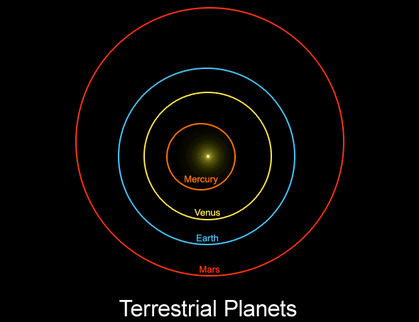

# Девятая планета
> 2019.11.27 [🚀](../../index/index.md) [despace](index.md) → [9‑я планета](planet_9.md), **[Space](index.md)**  
> *Navigation:*  
> **[FAQ](faq.md)**【**[SCS](scs.md)**·КК, **[SC (OE+SGM)](sc.md)**·КА】**[CON](contact.md)·[Pers](person.md)**·Контакт, **[Ctrl](control.md)**·Упр., **[Doc](doc.md)**·Док., **[Drawing](drawing.md)**·Чертёж, **[EF](ef.md)**·ВВФ, **[Error](error.md)**·Ошибки, **[Event](event.md)**·Событ., **[FS](fs.md)**·ТЭО, **[HF&E](hfe.md)**·Эрго., **[KT](kt.md)**·КТ, **[N&B](nnb.md)**·БНО, **[Project](project.md)**·Проект, **[QM](qm.md)**·БКНР, **[R&D](rnd.md)**·НИОКР, **[SI](si.md)**·СИ, **[Test](test.md)**·ЭО, **[TRL](trl.md)**·УГТ

**Table of contents:**

[TOC]

---

> <small>**Девятая планета** — русскоязычный термин. **Planet Nine** — англоязычный эквивалент.</small>

**Девятая планета** — гипотетическая планета во внешней области Солнечной системы. Открыта расчётным путём 2016.01.20.

Её гравитационное воздействие может объяснить статистическую аномалию в распределении орбит обособленных транснептуновых объектов, обнаруженных в основном за пределами пояса Койпера в рассеянном диске. Неоткрытая планета размером с мининептун должна иметь массу в десять земных, диаметр в 2 ‑ 4 земного и вытянутую орбиту с периодом ~ 15 000 земных лет. На сегодняшний день поиски Девятой планеты не увенчались успехом.

 

## Характеристики
|*Characteristic*|*[Value](si.md)*|
|:-|:-|
|Flight from Earth|55.34 лет на ЖРДУ (20 200 суток)|
|Signal from Earth|1 666 ‑ 10 000 минут (27.76 ‑ 166.66 часов)|
|Distance from Earth|30 ‑ 180 млрд ㎞|
|Breaking to the orbit|не более … ‑ … минут|
|**【Orbits】**|• • •|
|[Apocentre](apopericentre.md) (Афелий);  [Pericentre](apopericentre.md) (Перигелий)|180 000 000 000 ㎞ (1 200 а.е.);  30 000 000 000 ㎞ (200 [а.е.](si.md))|
|[Argument of periapsis](keplerian.md) (ω)|150°|
|[Semimajor axis](keplerian.md) (a)|98.1 млрд ㎞ (654 а.е.),  или 99.75 млрд ㎞ (665 а.е.), или 105 млрд ㎞ (700 а.е.)|
|Orbital velocity (Ⅴ)|… ㎞/s|
|Day/year|… / … земных|
|[Longit. of  asc.node](keplerian.md) (Ω)|–5° при i=48°, или 101° при i=18°, или 102° или 150°|
|[Inclination](keplerian.md) (Ⅰ)|48° при Ω=–5°, или 18° при Ω=101°, или 30°|
|[Sider. rotat.period](astroperiod.md) (T, day)|… дня|
|[Sidereal period](astroperiod.md) (year)|16 725 лет (6 104 625 д),  либо 17 117 лет (6 247 705 д),  либо 10 000 ‑ 20 000 лет (3 650 000 ‑ 7 300 000 д)|
|[Synodic period](astroperiod.md)|… дней (… d … h … min … s)|
|Satellites|…|
|[Hill sphere](hill_sphere.md)|… ㎞|
|Satellite of|[Солнце](sun.md)|
|[Eccentricity](keplerian.md) (e)|0.7|
|**【Physics】**|• • •|
|[1st escape velocity](esc_vel.md) (v₁)|… ㎞/s <small>(… земной)</small>|
|[2nd escape velocity](esc_vel.md) (v₂)|… ㎞/s <small>(… земной)</small>|
|[Albedo](albedo.md)|0.4|
|[Apparent magnitude](app_mag.md) (m)|22|
|[Magnetic field](mag_field.md)|… ‑ … А/м <small>(… ‑ … земного)</small>|
|Mass (m)|6·10²⁵ ㎏ <small>(10 земных)</small>|
|Axial tilt|…°|
|Volume (Ⅴ)|… ㎞³ <small>(… земного)</small>|
|Mean density (ρ)|… g/㎝³ (средняя, <small>… земной</small>)|
|Surface area (S)|… ㎞² <small>(… земной)</small>|
|Flattening|…|
|Radius|23 300 ㎞ при 10 M⊕ (средний, <small>3.66 земного</small>),  либо 18 600 ㎞ при 5 M⊕ (средний, <small>2.92 земного</small>),  либо 29 400 ㎞ при 20 M⊕ (средний, <small>4.62 земного</small>),  либо 17 866 ‑ 26 120 ㎞ (средний, <small>2.80 ‑ 4.10 земного</small>),  либо 13 000 ‑ 26 000 ㎞ (средний, <small>2.04 ‑ 4.08 земного</small>)|
|[Surface gravity](g.md)|… ㎧² <small>(… земного)</small>|
|Equatorial rotation velocity|… ㎞/h <small>(… земной)</small>|
|**【Temperature & atmo.】**|• • •|
|[Atmosphere](atmosphere.md)|**Pressure** … ㎫ (… ㍴).  **Плотность** … ㎏/m³.  **Ветер:**  … ‑ … ㎧ (поверхность).  **Состав:**  ….|
|[Освещённость](illum.md)| |
|Радиация| |
|Температура|–226 ℃|

---

 

## Общее описание
Предположение, что кластеризация орбит самых отдаленных объектов была обусловлена влиянием планеты за пределами орбиты Нептуна, возникло в 2014 году, когда астрономы Чедвик Трухильо и Скотт Шеппард отметили сходство в орбитах Седны, 2012 VP113 и нескольких других объектов. В начале 2016 года, Константин Батыгин и Майкл Браун описали, как похожие орбиты шести ТНО могут быть объяснены Девятой планетой, и предложили возможные параметры её орбиты. Эта гипотеза также может объяснить существование ТНО с орбитами, перпендикулярными плоскости вращения внутренних планет и других с экстремальным наклоном и с наклоном, а также наклон оси вращения Солнца.

Батыгин и Браун предполагают, что Девятая планета является ядром зарождающегося газового гиганта, который был выброшен со своей начальной орбиты Юпитером во время формирования Солнечной системы. Предполагается, что планета могла быть захвачена от другой звезды, являться захваченной планетой‑сиротой или что она сформировалась на отдалённой орбите, которую вытянула проходящая близко звезда, хотя в дальнейшем внесолнечная гипотеза происхождения планеты была отвергнута.

As of September 2019, no observation of Planet Nine had been announced. While sky surveys such as Wide‑field Infrared Survey Explorer (WISE) and Pan-STARRS did not detect Planet Nine, they have not ruled out the existence of a Neptune‑diameter object in the outer Solar System. The ability of these past sky surveys to detect Planet Nine were dependent on its location and characteristics. Further surveys of the remaining regions are ongoing using NEOWISE and the 8‑meter Subaru Telescope. Unless Planet Nine is observed, its existence is purely conjectural. Several alternative theories have been proposed to explain the observed clustering of TNOs.

---

 

## Особенности проектирования
   - Окна старта открываются примерно каждые … месяцев.

**Литература:**

   1. …

**Орбитальный КА:**

   1. …

**Посадочный КА:**

   1. …

---

 

## Освоение девятой планеты
В настоящее время существование планеты является лишь гипотезой. Подтвердить её может визуальное обнаружение. В отличие от открытия Нептуна, которое сделали на основе отклонения Урана от движения по законам Кеплера, существование Девятой планеты проявляется в статистических аномалиях орбит малых планет, сложившихся за миллиарды лет. Этот метод позволяет вычислить предположительные параметры орбиты планеты, но не позволяет определить даже приблизительно, в каком месте орбиты планета в данный момент находится. Наряду с тем фактом, что планета движется очень медленно и находится далеко от Земли, это приводит к тому, что её поиски могут быть сильно затруднены.

Для поиска планеты Браун и Батыгин зарезервировали время на японском телескопе Субару в обсерватории на Гавайях. К поискам присоединились Шеппард и Трухильо. По оценке Брауна, обследование большей части области неба, где может находиться планета, займёт около пяти лет.

В феврале 2017 года NASA запустила проект «Backyard Worlds: Planet 9», где участникам предлагается искать движущиеся объекты среди анимаций снимков, сделанных телескопом WISE в 2010 ‑ 2011 годах. Среди них может быть замечена Девятая планета, однако попутно возможно и обнаружение новых коричневых карликов.

Критика

   - Антраник Сефилян (Antranik Sefilian) из Кембриджского университета и Джихад Тоума (Jihad Touma) из Американского университета в Бейруте рассчитали, что необычные орбиты некоторых транснептуновых объектов объясняются влиянием гравитации не девятой планеты, а небольших объектов, составляющих диск за пределами орбиты Нептуна.
   - Канадские учёные из Университета Виктории показали, что предположение о существовании гигантской планеты на окраинах Солнечной системы было преждевременным. Факты, доказывавшие её существование, были основаны исключительно на статистических перекосах в астрономической базе данных.

**СООБЩЕСТВА:**

…

### Зачем исследовать
<mark>TBD</mark>

 

### Хронология и перспективы
<mark>TBD</mark>

<https://nssdc.gsfc.nasa.gov/planetary/chronology.html>

Данный раздел должен содержать анализ:

   - Что, как и почему делали КА прошлого и ныне летающие.
   - Что, как и почему планируют делать КА будущего.
   - Мировые тенденции изучения Венеры (технические и научные задачи).
   - Концепты КА для изучения Венеры.
   - Предложения группы НПОЛ по программе изучения Венеры.

### Проекты
См. также раздел «[Проекты](project.md)».

**Гипотетические и исторические:**

   - [Первый КА](hptc_sc9p.md)

**Table.** Missions/spacecraft of past and future. <small>(**Ⓛ** — LAV)  (**C** — contact rsrch; **D** — distant rsrch; **F** — fly‑by; **H** — manned; **S** — soil sampe return; **X** — technology demonstr.)</small>

<small>

|*✔*|*Космический аппарат (индекс)*|*Дата (UTC)*|*C*|*D*|*F*|*H*|*S*|*X*|*Примечания*|
|:-|:-|:-|:-|:-|:-|:-|:-|:-|:-|
|—|**Proposed:**|—|—|—|—|—|—|—|—|
|…|…|…| | | | | | |<mark>TBD</mark>|
|—|**Developing:**|—|—|—|—|—|—|—|—|
|…|…|…| | | | | | |<mark>TBD</mark>|
|—|**Active:**|—|—|—|—|—|—|—|—|
|…|…|…| | | | | | |<mark>TBD</mark>|
|—|**Past:**|—|—|—|—|—|—|—|—|
|…|…|…| | | | | | |<mark>TBD</mark>|

</small>

 

## Научные и технические задачи
Targets & explorations for Planet Nine. (Comments: **T** — technical; **Draft** — minimum for work with object)  
[Задачи и исследования](project.md) для девятой планеты. (Примечания: **Т** — техническая задача; **Черновая версия** — минимально доступная для работы с предметом)

<small>

|*Number*|*T*|*EN*|*Section of m&o*|*C*|*D*|*F*|*H*|*S*|
|:-|:-|:-|:-|:-|:-|:-|:-|:-|
|•|•|**【Never occurred】**|•|•|•|•|•|•|
|EMN‑…| | | | | | | | |
|•|•|**【Was tried】**|•|•|•|•|•|•|
|EMN‑…| | | | | | | | |
|•|•|**【Mostly done】**|•|•|•|•|•|•|
|EMN‑…| | | | | | | | |

</small>

<mark>TBD</mark>

|*…‑XXX*|*T*|*EN*|*RU*|*C*|*D*|*F*|*H*|*S*|
|:-|:-|:-|:-|:-|:-|:-|:-|:-|
| | |**`Never occurred`**|**`Не проводилось`**| | | | | |
|[…‑007](planet_9.md)| |Atmosphere: preliminary model.|Атмосфера: модель, черновая.| | | | | |
|[…‑006](planet_9.md)| |Spin axis.|Наклон оси.| | | | | |
|[…‑008](planet_9.md)| |Surface: preliminary map.|Поверхность: карта, черновая.| | | | | |
|[…‑001](planet_9.md)| |Confirm the existence.|Подтвердить наличие.| | | | | |
|[…‑004](planet_9.md)|T|Exploration: from inside of atmosphere.|Исследование: изнутри атмосферы.| | | | | |
|[…‑002](planet_9.md)|T|Exploration: from Earth.|Исследование: с Земли.| | | | | |
|[…‑003](planet_9.md)|T|Exploration: from venusian orbit.|Исследование: с ОИСВ.| | | | | |
|[…‑005](planet_9.md)|T|Exploration: from surface.|Исследование: с поверхности.| | | | | |
|• • •|•|• • •|• • •|•|•|•|•|•|
| | |**【Was tried】**|**`Завершено частично`**| | | | | |
|…| |…|…| | | | | |
|• • •|•|• • •|• • •|•|•|•|•|•|
| | |**【Mostly done】**|**`В целом завершено`**| | | | | |
|…| |…|…| | | | | |

1

|•|•|**【Never occurred】**|•|•|•|•|•|•|
|EMN‑080| |Albedo: changes in time|Gi| |D|F| | |
|EMN‑036| |Atmosphere: cause & influence of geological & chemical activity on the climate & clouds| | |D| | | |
|EMN‑037| |Atmosphere: cause of the retrograde moving| | |D| | | |
|EMN‑032| |Atmosphere: characteristics of the CO₂ & N₂ in state of the lower layers supercritical fluid|Ac, Ai, Am, At| |D| | | |
|EMN‑007| |Atmosphere: connection between the topography & the atmo circulation| | |D| | | |
|EMN‑033| |Atmosphere: nature/rate of its escape| | |D| | | |
|EMN‑038| |Atmosphere: processes of the atmospheric parts dissipation| | |D| | | |
|EMN‑082|T|Atmosphere: prolonged investigations on the H = 0 ‑ 10 ㎞|All A| | | | | |
|EMN‑083|T|Atmosphere: prolonged investigations on the H = 10 ‑ 30 ㎞|All A| | | | | |
|EMN‑054|T|Atmosphere: sample return|As|C| | | | |
|EMN‑015| |Atmosphere: structure of the mesosphere|All A| |D| | | |
|EMN‑030| |Atmosphere: was it lost during some cataclysm or event| | |D| | | |
|EMN‑095| |Climate: history & causes of changes| | |D| | | |
|EMN‑087| |Crustal support mechanisms| | |D| | | |
|EMN‑051| |Dimensions & characteristics of the mantle & the core| | |D| | | |
|EMN‑057|T|Exploration with [satellites](sc.md): microsatellites| | |D|F| | |
|EMN‑071|T|Exploration with [satellites](sc.md): nanosatellites| | |D|F| | |
|EMN‑058|T|Exploration: directed seismoexperiment| | |D|F| | |
|EMN‑056|T|Exploration: from L1/L2|Ai, Am, At, Gi| |D| | | |
|EMN‑059|T|Exploration: with [rover](robot.md)|All A/S|C| | | | |
|EMN‑081|T|Extreme environment electronics| |C|D|F| | |
|EMN‑094|T|High temperature electronics| |C|D|F| | |
|EMN‑066|T|Human: on the surface| |C| | |H| |
|EMN‑065|T|Human: on the orbit| | |D| |H| |
|EMN‑060|T|Human: manned fly‑by| | |D|F|H| |
|EMN‑043| |Mechanisms of the mantle’s convection| | |D|F| | |
|EMN‑048| |Nature & sources of the greenhouse effect| | |D|F| | |
|EMN‑049| |Nature & characteristics of the thermal tides| | |D| | | |
|EMN‑069|T|Prolonged surface‑spacecraft functioning| |C| | | | |
|EMN‑064|T|Planetary terraforming| |C| | |H| |
|EMN‑045| |Surface: nature of the tessera| | |D| | | |
|EMN‑061|T|Surface: sample return| |C| | | |S|
|EMN‑088|T|Surface: subsurface investigations| |C| | | | |
|EMN‑086|T|Surface: tessera investigations, in‑situ| |C| | | | |
|EMN‑047| |Surface: structure‑composition connection of different regions & planet’s evolution| |C| | | | |
|EMN‑039| |Was the planet inhabited & for how long| |C|D| | | |
|EMN‑040| |Were there oceans & why have they gone| |C|D|F| | |
|•|•|**【Was tried】**|•|•|•|•|•|•|
|EMN‑093|T|Atmosphere/surface imaging| | |D|F| | |
|EMN‑077| |Atmosphere: chemical elements distribution| | |D|F| | |
|EMN‑018| |Atmosphere: clouds, their chemistry| | |D|F| | |
|EMN‑075| |Atmosphere: clouds, their nature| | |D|F| | |
|EMN‑016| |Atmosphere: clouds, their structure| | |D|F| | |
|EMN‑011| |Atmosphere: common circulation model| | |D| | | |
|EMN‑014| |Atmosphere: composition| | |D| |F| |
|EMN‑019| |Atmosphere: energetic balance| | |D| | | |
|EMN‑008| |Atmosphere: flashing on the night side| | |D| | | |
|EMN‑013| |Atmosphere: illumination of the surface & the atmo layers| | |D| | | |
|EMN‑096| |Atmosphere: ionosphere| | |D|F| | |
|EMN‑012| |Atmosphere: lightnings| | |D| | | |
|EMN‑031| |Atmosphere: long‑term variations of the surface meteo characteristics| | |D| | | |
|EMN‑067| |Atmosphere: nature of the polar dipole & turbulence| | |D| | | |
|EMN‑034| |Atmosphere: nature of the superrotation| | |D| | | |
|EMN‑035| |Atmosphere: nature of the UV‑absorber| | |D| | | |
|EMN‑084|T|Atmosphere: prolonged investigations on the H = 30 ‑ 60 ㎞| | |D| | | |
|EMN‑078|T|Atmosphere: radiography| | |D| | | |
|EMN‑055|T|Atmosphere: sample obtaining & analysis| |C| | | | |
|EMN‑009| |Atmosphere: SO₂ concentration & nature of its variations| | |D| | | |
|EMN‑017| |Atmosphere: common structure| | |D| | | |
|EMN‑097| |Atmosphere: effect of solar Rad & interplanetary space on the atmo| | |D|F| | |
|EMN‑010| |Atmosphere: vertical model| | |D| | | |
|EMN‑050| |Causes of the water loss| | |D| | | |
|EMN‑041| |Common connection between the atmosphere & the surface| | |D| | | |
|EMN‑073|T|Exploration with [satellites](sc.md): large satellites| | |D|F| | |
|EMN‑072|T|Exploration with [satellites](sc.md): medium satellites| | |D|F| | |
|EMN‑070|T|Exploration with [satellites](sc.md): minisatellites| | |D|F| | |
|EMN‑042| |History & causes of the planet’s volcanic & tectonic evolution| | |D| | | |
|EMN‑020| |Inner structure of the planet| | |D| | | |
|EMN‑029| |Is Venus geologically active?:| |C|D|F| | |
|EMN‑028| |Magnetosphere structure| | |D|F| | |
|EMN‑089| |Measuring the planetary gravitational field| | |D|F| | |
|EMN‑074| |Meteorological model| | |D|F| | |
|EMN‑079| |Precise duration of the Venusian day| | |D| | | |
|EMN‑052| |Role of water (fluids) in planetary geology| |C|D|F| | |
|EMN‑092|T|Serve as a relay to Earth for stand‑alone SC/instruments| | |D| | | |
|EMN‑046| |Surface: causes of the changes during the last billion years| |C|D|F| | |
|EMN‑024| |Surface: common composition| |C| | | | |
|EMN‑026| |Surface: elemental composition| |C| | | | |
|EMN‑021| |Surface: map, 3D| |C|D| | | |
|EMN‑022| |Surface: map, precise| | |D| | | |
|EMN‑023| |Surface: mineralogical composition| |C| | | | |
|EMN‑044| |Surface: nature & causes of forming of the current rocks & soils| |C| | | | |
|EMN‑062|T|Surface: samples obtaining & analysis, incl. in different places| |C| | | |S|
|EMN‑063|T|Surface: panoramic imaging| |C| | | | |
|EMN‑025| |Surface: morphology| |C| | | | |
|EMN‑085|T|Surface: tessera investigations, remote| | |D|F| | |
|EMN‑076| |Surface: volcanoes, their presence| | |D|F| | |
|EMN‑027| |The causes why Venus evolved in a planet so different from Earth| |C|D|F| | |
|EMN‑091| |The loss rate of water from Venus| | |D|F| | |
|EMN‑053| |Traces of life in the atmosphere & on the surface| |C| | | | |
|•|•|**【Mostly done】**|•|•|•|•|•|•|
|EMN‑001| |Atmosphere: preliminary model| |C|D|F| | |
|EMN‑004|T|Exploration: from Earth| | |D| | | |
|EMN‑003|T|Exploration: from inside of atmosphere| |C|D| | | |
|EMN‑006|T|Exploration: from surface| |C| | | | |
|EMN‑005|T|Exploration: from Venusian orbit| | |D|F| | |
|EMN‑090| |Spin axis| | |D| | | |
|EMN‑002| |Surface: preliminary map| |C|D| | | |

 

## Docs & links (TRANSLATEME ALREADY)
|*Sections & pages*|
|:-|
|**【[Space](index.md)】**  [Apparent magnitude](app_mag.md)・ [Astro.object](aob.md)・ [Blue Marble](earth.md)・ [Cosmic rays](ion_rad.md)・ [Ecliptic](ecliptic.md)・ [Escape velocity](esc_vel.md)・ [Health](health.md)・ [Hill sphere](hill_sphere.md)・ [Information](info.md)・ [Lagrangian points](l_points.md)・ [Near space](near_space.md)・ [Pale Blue Dot](earth.md)・ [Parallax](parallax.md)・ [Point Nemo](earth.md)・ [Silver Snoopy award](silver_snoopy_award.md)・ [Solar constant](solar_const.md)・ [Terminator](terminator.md)・ [Time](time.md)・ [Wormhole](wormhole.md) ┊ ··•·· **Solar system:** [Ariel](ariel.md)・ [Callisto](callisto.md)・ [Ceres](ceres.md)・ [Deimos](deimos.md)・ [Earth](earth.md)・ [Enceladus](enceladus.md)・ [Eris](eris.md)・ [Europa](europa.md)・ [Ganymede](ganymede.md)・ [Haumea](haumea.md)・ [Iapetus](iapetus.md)・ [Io](io.md)・ [Jupiter](jupiter.md)・ [Makemake](makemake.md)・ [Mars](mars.md)・ [Mercury](mercury.md)・ [Moon](moon.md)・ [Neptune](neptune.md)・ [Nereid](nereid.md)・ [Nibiru](nibiru.md)・ [Oberon](oberon.md)・ [Phobos](phobos.md)・ [Pluto](pluto.md)・ [Proteus](proteus.md)・ [Rhea](rhea.md)・ [Saturn](saturn.md)・ [Sedna](sedna.md)・ [Solar day](solar_day.md)・ [Sun](sun.md)・ [Titan](titan.md)・ [Titania](titania.md)・ [Triton](triton.md)・ [Umbriel](umbriel.md)・ [Uranus](uranus.md)・ [Venus](venus.md)|

   1. Docs: …
   1. <https://en.wikipedia.org/wiki/Planet_Nine>

