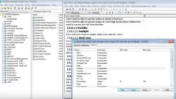

# Programming language
> 2019.09.14 [🚀](../../index/index.md) [despace](index.md) → **[Soft](soft.md)**
> *Navigation:*
> **[FAQ](faq.md)**【**[SCS](scs.md)**·КК, **[SC (OE+SGM)](sc.md)**·КА】**[CON](contact.md)·[Pers](person.md)**·Контакт, **[Ctrl](control.md)**·Упр., **[Doc](doc.md)**·Док., **[Drawing](drawing.md)**·Чертёж, **[EF](ef.md)**·ВВФ, **[Error](error.md)**·Ошибки, **[Event](event.md)**·Событ., **[FS](fs.md)**·ТЭО, **[HF&E](hfe.md)**·Эрго., **[KT](kt.md)**·КТ, **[N&B](nnb.md)**·БНО, **[Project](project.md)**·Проект, **[QM](qm.md)**·БКНР, **[R&D](rnd.md)**·НИОКР, **[SI](si.md)**·СИ, **[Test](test.md)**·ЭО, **[TRL](trl.md)**·УГТ

**Table of contents:**

[TOC]

---

A **programming language** is any set of rules that converts strings, or graphical program elements in the case of visual programming languages, to various kinds of machine code output. Programming languages are one kind of computer language, and are used in computer programming to implement algorithms.

## C
> <small>**Си** — русскоязычный термин. **C** — англоязычный эквивалент.</small>

**Си (англ. C)** — компилируемый статически типизированный язык программирования общего назначения, разработанный в 1969 ‑ 1973 годах сотрудником Bell Labs Деннисом Ритчи как развитие языка Би.

   1. <https://en.wikipedia.org/wiki/C_(programming_language)>
   1. <https://en.wikipedia.org/wiki/The_C_Programming_Language>

Один из основных [ЯП, используемых в NASA](soft.md).

Первоначально был разработан для реализации операционной системы UNIX, но впоследствии был перенесён на множество других платформ. Согласно дизайну языка, его конструкции близко сопоставляются типичным машинным инструкциям, благодаря чему он нашёл применение в проектах, для которых был свойственен язык ассемблера, в том числе как в операционных системах, так и в различном прикладном программном обеспечении для множества устройств — от суперкомпьютеров до встраиваемых систем. Язык программирования Си оказал существенное влияние на развитие индустрии программного обеспечения, а его синтаксис стал основой для таких языков программирования, как C++, C#, Java и Objective‑C.

Язык Си разрабатывался как язык системного программирования, для которого можно создать однопроходный компилятор. Стандартная библиотека также невелика. Как следствие данных факторов — компиляторы разрабатываются сравнительно легко. Поэтому данный язык доступен на самых различных платформах. К тому же, несмотря на свою низкоуровневую природу, язык ориентирован на переносимость. Программы, соответствующие стандарту языка, могут компилироваться под различные архитектуры компьютеров.

Целью языка было облегчение написания больших программ с минимизацией ошибок по сравнению с ассемблером, следуя принципам процедурного программирования, но избегая всего, что может привести к дополнительным накладным расходам, специфичным для языков высокого уровня.

**Основные особенности Си:**

   - простая языковая база, из которой в стандартную библиотеку вынесены многие существенные возможности, вроде математических функций или функций работы с файлами;
   - ориентация на процедурное программирование;
   - система типов, предохраняющая от бессмысленных операций;
   - использование препроцессора для абстрагирования однотипных операций;
   - доступ к памяти через использование указателей;
   - небольшое число ключевых слов;
   - передача параметров в функцию по значению, а не по ссылке (передача по ссылке эмулируется с помощью указателей);
   - наличие указателей на функции и статических переменных;
   - области видимости имён;
   - структуры и объединения — определяемые пользователем собирательные типы данных, которыми можно манипулировать как одним целым.
   - В то же время в Си отсутствуют:
      - вложенные функции;
      - прямое возвращение нескольких значений из функций;
      - сопрограммы;
      - средства автоматического управления памятью;
      - встроенные средства объектно‑ориентированного программирования;
      - средства функционального программирования.

**Область применения**

Язык широко применяется при разработке операционных систем, на уровне прикладного интерфейса операционных систем, во встраиваемых системах, а также для создания высокопроизводительного или критического в плане обработки ошибок кода. Одной из причин широкого распространения для программирования на низком уровне является возможность писать кроссплатформенный код, который может по‑разному обрабатываться на разном оборудовании и на разных операционных системах.

Возможность писать высокопроизводительный код обеспечивается за счёт полной свободы действий программиста и отсутствия строгого контроля со стороны компилятора. Так, например, на языке Си написаны первые реализации языков Java, Python, Perl и PHP. При этом во многих программах наиболее требовательные к ресурсам части принято писать на языке Си. Ядро программы Mathematica написано на Си, а MATLAB, изначально написанный на Фортране, был переписан на Си в 1984 году.

Также Си иногда используется как промежуточный язык при компиляции более высокоуровневых языков. Например, по такому принципу работали первые реализации языков С++, Objective‑C и Go, — код, написанный на этих языках, транслировался в промежуточное представление на языке Си.

Ещё одной областью применения языка Си являются приложения реального времени, которые требовательны по части отзывчивости кода и времени его исполнения. Такие приложения должны начинать исполнение действий в жёстко ограниченных временных рамках, а сами действия должны укладываться в определённый временной промежуток. В частности, стандарт POSIX.1 предоставляет набор функций и возможностей для создания приложений реального времени, однако поддержка жёсткого реального времени должна быть также реализована и со стороны операционной системы.

**Литература:**

   - **Для начала:**
      - **«Язык программирования Си»** — книга Брайана Кернигана и Денниса Ритчи, причём последний — один из непосредственных авторов и разработчиков языка Си. Книга стала основой для разработки и популяризации Си, до сих пор имеет спрос и широко используется в качестве «классического» учебника по языку. Она долгое время была единственным справочным руководством и де‑факто — стандартом языка.
   - **И далее:**
      - …

## Python
> <small>**Питон** — русскоязычный термин. **Python** — англоязычный эквивалент.</small>

**Python** *(МФА: [ˈpʌɪθ(ə)n]; в русском языке распространено название пито́н)* — высокоуровневый язык программирования общего назначения, ориентированный на повышение производительности разработчика и читаемости кода. Синтаксис ядра Python минималистичен. В то же время стандартная библиотека включает большой объём полезных функций.

   1. <https://www.python.org/>
   1. <https://wiki.python.org/>
   1. <https://code.nasa.gov/?:q=python>
   1. <https://pythonworld.ru/>

Python поддерживает структурное, объектно‑ориентированное, функциональное, императивное и аспектно‑ориентированное программирование. Основные архитектурные черты — динамическая типизация, автоматическое управление памятью, полная интроспекция, механизм обработки исключений, поддержка многопоточных вычислений, высокоуровневые структуры данных. Поддерживается разбиение программ на модули, которые могут объединяться в пакеты.

Эталонной реализацией является интерпретатор CPython, поддерживающий большинство активно используемых платформ. Он распространяется под свободной лицензией Python Software Foundation License, позволяющей использовать его без ограничений в любых приложениях, включая проприетарные. Есть реализация интерпретатора для JVM с возможностью компиляции, CLR, LLVM, другие независимые реализации. Проект PyPy использует JIT‑компиляцию, значительно увеличивающую скорость выполнения Python‑программ.

Python — активно развивающийся язык программирования, новые версии выходят примерно раз в 2.5 года. Язык не имеет официальной стандартизации, роль стандарта де‑факто выполняет CPython, разрабатываемый под контролем автора языка.

**Философия:**

   - Простое лучше, чем сложное.
   - Сложное лучше, чем запутанное.
   - Практичность важнее безупречности.
   - Ошибки никогда не должны замалчиваться.
   - Сейчас лучше, чем никогда.

**Литература**

> По источникам: <https://wiki.python.org/moin/PythonBooks>, <https://habr.com/ru/post/344192/>, <https://habr.com/ru/sandbox/80371/>, <https://habr.com/ru/post/150302/>.

   - **Для начала:**
      - **«Изучаем Python»** и **«Программируем на Python»**, Марк Лутц. Базовый набор книг. Дают обширное понимание языка, объясняют плюсы, минусы и эволюцию языка.
      - **«Программирование на Python 3»**, Марк Саммерфилд. Динамично, с отличными примерами и заданиями. Без излишнего углубления, которое только всё усложняет в начале.
   - **И далее:**
      - **«Разработка геоприложений на языке Python»**, Вестра Э. Эту книгу должен прочитать каждый разработчик, который хочет написать адекватное ГИС приложение на Python.
      - **«Python. Подробный справочник»**, Дэвид М. Бизли.
      - **«Введение в машинное обучение с помощью Python»**, Андреас Мюллер, Сара Гвидо. Для базового понимания — лучшее на данный момент.
      - **«Скрапинг веб‑сайтов с помощью Python»**, Р. Митчелл. Книга охватывает практически все аспекты парсинга сайтов.
      - **«Python. К вершинам мастерства»**, Рамальо Лучано. Для повышения уровня.

## R
> <small>**R** — англоязычный термин, не имеющий аналога в русском языке. **R** — дословный перевод с английского на русский.</small>

**R** — язык программирования для статистической обработки данных и работы с графикой, а также свободная программная среда вычислений с открытым исходным кодом в рамках проекта GNU. Язык создавался как аналогичный языку S, разработанному в Bell Labs, и является его альтернативной реализацией, хотя между языками есть существенные отличия, но в большинстве своём код на языке S работает в среде R.

   1. <https://en.wikipedia.org/wiki/R_(programming_language)>
   1. <https://www.r-project.org/>

R — мультипарадигмальный интерпретируемый динамически типизируемый язык программирования. Появился в 1993 г., испытал влияние S, Scheme. Работает под ОС Linux, Microsoft Windows и macOS.

Широко используется как статистическое программное обеспечение для анализа данных и фактически стал стандартом для статистических программ.

Язык и среда доступны под лицензией GNU GPL; распространяются в виде исходных кодов, а также откомпилированных приложений под ряд операционных систем: FreeBSD, Solaris и другие дистрибутивы Unix и Linux, Microsoft Windows, Mac OS X.

В R используется интерфейс командной строки, хотя доступны и несколько графических интерфейсов пользователя, например пакет R Commander, RKWard, RStudio, Weka, Rapid Miner, KNIME, а также средства интеграции в офисные пакеты.

Язык поддерживает минимальный набор примитивных типов данных: символьный (character), числовой (numeric), логический (logical) и комплексный (complex). Числовые переменные, помимо обычных чисел, могут принимать специальные значения NaN (Not a Number — «не число») и Inf (Infinity — «бесконечность»). Бесконечность (положительная или отрицательная) получается при выходе результата вычислений за пределы представимого реализацией диапазона, NaN — при операциях с неопределённым результатом. Помимо этих, имеется ещё одно очень важное специальное значение, NA (Not Available — «не доступно»). Оно может быть использовано для фиксации того факта, что соответствующее значение, участвующее в вычислениях, по какой‑либо причине не было получено (достаточно обычная в статистических расчётах ситуация, когда из‑за сбоев в сборе данных некоторые наблюдения остаются без результатов).

Значения примитивных типов могут объединяться в векторы (vector), списки (list), матрицы или массивы (matrix), в том числе многомерные; эти комбинированные типы хранят наборы данных одного и того же примитивного типа. Помимо этого язык содержит понятие факторов (factor) — наборов категориальных или шкальных данных, принимающих строго определённый набор значений. Наконец, могут создаваться таблицы (data frame) — структуры данных, которые для каждой строки (индивида) хранят набор различных (и имеющих разные типы) параметров (признаков). Особенностью R является то, что операции с векторами и матрицами поддерживаются на уровне самого языка, как, например, в APL.

Существует операция извлечения и записи данных (аналог присваивания) «<-», а также обычные операции работы с данными, в том числе арифметические. Доступ по индексу к элементам векторов и массивов осуществляется с помощью квадратных скобок, доступ к атрибутам списков — посредством оператора «$». Имеется минимальный набор обычных конструкций императивного программирования: условный оператор if, циклы while и for. Выражения на R можно описывать как отдельные объекты и вычислять по мере необходимости. На этом же механизме основано описание функций. Имеются встроенные в язык средства применения выражений и функций к векторам и массивам.

Функции R могут объединяться в пакеты — загружаемые модули, которые подключаются к любой программе и предоставляют объединённые в них вычислительные средства. Пакеты для R могут разрабатываться на других языках программирования, в том числе на Си, что позволяет, с одной стороны, скомпенсировать ограниченность изобразительных средств самого языка R, а с другой — при необходимости достигнуть высоких показателей вычислительной производительности.

Сам язык имеет довольно ограниченные и не слишком удобные средства описания данных, но это компенсируется наличием библиотечных средств, которые позволяют загружать в виде таблиц R наборы данных, представленных в большинстве открытых и многих проприетарных форматах. Так, в R могут быть легко загружены таблицы в простом текстовом формате, таблицы Excel различных версий, данные в форматах CSV, XML и многих других.

В целом, как язык программирования, R довольно прост и даже примитивен. Его наиболее сильная сторона — возможность неограниченного расширения с помощью пакетов. В базовую поставку R включен основной набор пакетов, а всего по состоянию на 2019 год доступно более 15 316 пакетов. В R реализованы практически все актуальные средства универсальных статистических вычислений, такие как регрессионный анализ и анализ временных рядов, а также множество специфических алгоритмов для решения узкоспециализированных задач и исследований в отдельных областях.

Ещё одна особенность языка — возможность создания качественной графики типографского уровня, которая может быть экспортирована в распространённые графические форматы и использована для презентаций или публикаций. Имеются готовые пакеты, связывающие R с GUI‑фреймворками (например, основанными на Tcl/Tk) и позволяющие создавать специализированные утилиты статистического анализа с графическим интерфейсом пользователя и отображением результатов в виде графиков и диаграмм.

**Базовый синтаксис:**

~~~
x <- c(1,2,3,4,5,6)   # Создать упорядоченную коллекцию
y <- x^2              # Возвести в квадрат элементы из x
print(y)              # Вывести y
[1] 1 4 9 16 25 36
mean(y)               # Рассчитать среднее арифм. y; результат — число
[1] 15.16667
var(y)                # Рассчитать дисперсию
[1] 178.9667
~~~

 

## Docs & links (TRANSLATEME ALREADY)
|*Sections & pages*|
|:-|
|**【[Software](soft.md)】**  [ASP](asp.md)・ [Blender](blender.md)・ [C](plang.md)・ [Cosmographia](cosmographia.md)・ [DOORS](doors.md)・ [DWG](cad_f.md)・ [GIMP](gimp.md)・ [Git](git.md)・ [IGES](cad_f.md)・ [ISIS](isis.md)・ [JT](cad_f.md)・ [NGT](neogeography_toolkit.md)・ [NX](nx.md)・ [Octave](gnu_octave.md)・ [OS](os.md)・ [PDF](pdf.md)・ [Python](plang.md)・ [R](plang.md)・ [SPICE](spice.md)・ [STEP](cad_f.md)・ [STL](stk.md)・ [SVG](cad_f.md)・ [Syncthing](syncthing.md)・ [SysML](sysml.md)・ [Teamcenter](teamcenter.md)・ [Система управления версиями](vcs.md)・ [ХРИП](adra.md)|

   1. Docs: …
   1. <https://en.wikipedia.org/wiki/Programming_language>

