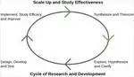
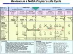

# Research & Development
> 2019.03.21 [🚀](../../index/index.md) [despace](index.md) → [R&D](rnd.md)  
> *Navigation:*  
> **[FAQ](faq.md)**【**[SCS](scs.md)**·КК, **[SC (OE+SGM)](sc.md)**·КА】**[CON](contact.md)·[Pers](person.md)**·Контакт, **[Ctrl](control.md)**·Упр., **[Doc](doc.md)**·Док., **[Drawing](drawing.md)**·Чертёж, **[EF](ef.md)**·ВВФ, **[Error](error.md)**·Ошибки, **[Event](event.md)**·Событ., **[FS](fs.md)**·ТЭО, **[HF&E](hfe.md)**·Эрго., **[KT](kt.md)**·КТ, **[N&B](nnb.md)**·БНО, **[Project](project.md)**·Проект, **[QM](qm.md)**·БКНР, **[R&D](rnd.md)**·НИОКР, **[SI](si.md)**·СИ, **[Test](test.md)**·ЭО, **[TRL](trl.md)**·УГТ

**Table of contents:**

[TOC]

---

|*Phase*| | |*Design*| | | | |*Mass prod.:*| |
|:-|:-|:-|:-|:-|:-|:-|:-|:-|:-|
|**[R&D phases](rnd.md)**|0 (pre‑A)|A|≈ B|≈ B|≈ C|≈ C/D|≈ E|…|F|
|**[НИОКР](rnd.md)**|[НИР](rnd_0.md)|[АП](rnd_ap.md)|[ЭП](rnd_ep.md)|[ТП](rnd_tp.md)|[РКД (РРД)](rnd_rkd.md)|[Макеты, НЭО](test.md)|[ЛИ](rnd_e.md)|ПСП → СП → ПЭ|Вывод|
| |*[NIR](rnd_0.md)*|*[AP](rnd_ap.md)*|*[EP](rnd_ep.md)*|*[TP](rnd_tp.md)*|*[RKD (RRD)](rnd_rkd.md)*|*[Models, Tests](test.md)*|*[LI](rnd_e.md)*|*PSP → SP → PE*|*Close&shy;out*|

> <small>**Научно‑исследовательские и опытно‑конструкторские работы (НИОКР)** — русскоязычный термин. **Research & Development (R&D)** — англоязычный эквивалент.</small>  
>> <small>А я не поехал. Я купил мотыля и пошёл на реку. Я люблю рыбалку. Сядешь на берегу, закинешь удочку… клюёт!  *(S.P.O.R.T., 2000 г.)*</small>

**Научно‑исследовательские и опытно‑конструкторские работы (НИОКР)** — [совокупность работ](st_act.md), направленных на получение новых знаний и практическое применение при создании нового изделия / технологии. Включают в себя:

   1. **[Научно‑исследовательские работы](rnd_0.md) (НИР)** — работы поискового, теоретического и экспериментального характера с целью определения технической возможности создания новой техники в определённые сроки. Делятся на *фундаментальные* (получение новых знаний) и *прикладные* (применение новых знаний для решения конкретных задач). Могут включать или заменяться:
      - [Proposal](proposal.md)
      - [White paper](colour_papers.md)
   1. **Опытно‑конструкторские работы (ОКР)** и *Технологические работы (ТР)* — разработка КД и ТД на опытный образец, изготовление и испытания опытного образца.

Ниже приведены типовые этапы разработки ОКР (СЧ ОКР) в РФ и [ESA](contact/esa.md). По согласованию с Заказчиком этапы могут исключаться и вводиться новые. Цели нижеприведённого:

   1. стандартизация [работ](workflow.md) и документации для различных этапов ОКР;
   1. уменьшение количества [ошибок](error.md) и разночтений [НД](doc.md) для исполнителя и [кооперации](contact.md);
   1. уменьшение количества бумажной документации и переписки;
   1. систематизация опыта работы над [различными ОКР](project.md);
   1. получение [достаточных данных о СЧ](suitc.md), необходимых для работы с ними.

**Прочие страницы в данной категории** — [Test](test.md)・ [Конкурс на ОКР (СЧ ОКР)](pubprocom.md)・ [Контрольная сборка](contr_asm.md)・ [Рабочая группа](wg.md)・ [Руководство ОКР](mgmt.md)・ [САС](lifetime.md)・ [ТРИЗ](triz.md)・ [Унификация](commonality.md)・ [ТХСЧ](suitc.md)

| | |
|:-|:-|
|||

 

## People

Common spacecraft R&D team:

   1. **Lead Designer (Chief engineer)**
   1. **Project manager**
   1. Electrical engineer
   1. External environment engineer
   1. GNC engineer (incl. ballistics)
   1. Ground systems engineer
   1. Manufacturing engineer
   1. Mechanical engineer
   1. Payload engineer
   1. Production engineer
   1. Propulsion engineer
   1. Quality assurance engineer
   1. RF engineer
   1. Software engineer
   1. Structural engineer
   1. Testing engineer
   1. Thermal engineer

Типовой состав рабочей группы по НИОКР для СНГ:

   1. **Руководитель проекта**
   1. **Главный конструктор**
   1. Главный технолог
   1. Инженер по антенно-фидерным системам
   1. Инженер по баллистике (баллистика, возмущения)
   1. Инженер по БКС
   1. Инженер по бортовому комплексу управления
   1. Инженер по бортовому радиокомплексу
   1. Инженер по вибродинамической модели
   1. Инженер по внешним факторам
   1. Инженер по двигательной системе
   1. Инженер по конструкции
   1. Инженер по логике управления
   1. Инженер по материалам
   1. Инженер по метрологии
   1. Инженер по наземной отработке
   1. Инженер по наземному научному комплексу
   1. Инженер по наземным средствам
   1. Инженер по патентам
   1. Инженер по надёжности и безопасности
   1. Инженер по общему проектированию
   1. Инженер по полезной нагрузке
   1. Инженер по прочности
   1. Инженер по средствам выведения
   1. Инженер по стандартизации
   1. Инженер по телеметрии
   1. Инженер по тепловому проектированию (СОТР, тепловые трубы, тепловой баланс)
   1. Инженер по транспортированию и работам на космодроме
   1. Инженер по условиям при выведении
   1. Инженер по циклограмме функционирования и электропотребления
   1. Инженер по электрическому проектированию
   1. Инженер по электромагнитной совместимости
   1. Инженер по ЭРИ
   1. Менеджер по качеству
   1. Экономист

 

## Steps

### Formal steps

【**Table.** R&D stages】  
АП и ЭП похожи по составу, отличаются глубиной проработки — на АП поощряется создание вариантов КА и СЧ.  
СЧ АП (ЭП) — это АП (ЭП) на его СЧ. Сквозной нумерации нет, но таковая возможна внутри каждого АП (ЭП).

|*#*|*Этап*|*Phase*|
|:-|:-|:-|
| |**【НИОКР】**|**【R&D】**|
|**1**|**[Научно-исследовательская работа](rnd_0.md) (НИР)**  Комплекс теоретических/экспериментальных исследований с целью получения обоснованных исходных данных, изыскания принципов/путей создания/модернизации продукции.|**Phase 0 (pre‑A)**  Concept studies.|
|**2**|**[Техническое предложение (Аванпроект)](rnd_ap.md) (АП)**  Анализ ТЗ. Подбор материалов. Присвоение документам литеры «П». Цель — выявление доп./уточнённых требований к [изделию](unit.md), которые не могли быть указаны в ТЗ или рассмотрены в НИР, и это целесообразно сделать на основе конструкторской проработки и анализа вариантов изделия. *(не распространяется на КД, разраб. по заказу Мин. обороны ([ГОСТ 2.103](гост_2_103.md) п.4.1))*|**Phase A**  Concept & technology development.|
| |**【ОКР】**|**【R&D】**|
|**3**|**[Эскизный проект](rnd_ep.md) (ЭП)**  Рассмотрение и утверждение АП, уточнение его результатов. Цель — установление принципиальных решений изделия, дающих общее представление о принципе работы и (или) устройстве изделия. Можно рассматривать варианты изделий. В итоге должен быть выбран 1 вариант исполнения изделий.|**Phase B**  Preliminary design & technology completion. At the end of p.B the system requirements together with a statement of work are sent out requesting proposals from industry.|
|**4**|**[Технический проект](rnd_tp.md) (ТП)**  Необязательный этап. Имеет состав ЭП. Рассмотрение и утверждение ЭП. Присвоение документам литеры «Т». Изготовление и испытание макетов (при необходимости). ТП разраб. с целью выявления окончательных технических решений, дающих полное представление о конструкции изделия, когда это целесообразно сделать до РРД.|**Phase B**  Preliminary design & technology completion. At the end of p.B the system requirements together with a statement of work are sent out requesting proposals from industry.|
|**5**|**[Разработка конструкторской документации](rnd_rkd.md) (РКД, РРД)**  Рассмотрение и утверждение ТП (ЭП, если не было ТП). Разработка [КД](doc.md), предназначенной для изготовления и [испытания](test.md) опытного образца (опытной партии), без присвоения литеры.|**Phase C**  Final design & fabrication.|
|**6**|**[Наземная экспериментальная отработка, макетирование](test.md) (НЭО)**  Создание макетов КА и его СЧ, проведение наземной экспериментальной отработки, корректировка КД (при необходимости), поставка штатных образцов.|**Phase C/D**  System assembly, integration & testing. Launch.|
|**7**|**[Лётные испытания](rnd_e.md) (ЛИ)**  Старт и функционирование [изделия](unit.md).|**Phase E**  Operations & sustainment.|
|**8**|**[Подготовка документации для серийного производства](пдсп.md)**  Корректировка (разработка), проверка, согласование и утверждение комплектов КД (в т.ч. ЭД), присвоение ей литеры «О₁» или более высокой литеры на изделия серийного производства.|**…**  …|
|**9**|**[Серийное производство](сп.md)**  Постановка на серийное производство, изготовление и испытания изделий, корректировка документации на изделия серийного производства.|**…**  …|
|**10**|**[Приём в эксплуатацию](прэ.md)**  Ввод и приём в эксплуатацию ракетной и космической техники.|**…**  …|
|**11**|**Вывод из эксплуатации**  Вывод из эксплуатации ракетной и космической техники.|**Phase F**  Closeout.|

**За рубежом.**

[Spacecraft systems](scs.md) are normally developed under the responsibility of space agencies as [NASA](contact/nasa.md), [ESA](contact/esa.md) etc. In the space area standardized terms & processes have been introduced to allow for unambiguous communication between all partners & efficient usage of all documents. For instance the life cycle of [SCS](scs.md) is divided in phases.  
На каждом этапе проводятся [design review](design_review.md).

 

### Logical steps
> <small>**NGO** ​— need, goals, objectives. **НГО** ​— цель, вопросы, задачи.</small>

Define NGOs (need, goals, objectives).

   - **Need** — A single statement that drives everything else. It should relate to the problem that the system is supposed to solve but not be the solution. The need statement is singular. Trying to satisfy more than one need requires a trade between the two, which could easily result in failing to meet at least one, & possibly several, stakeholder expectations.
   - **Goals** — An elaboration of the need, which constitutes a specific set of expectations for the system. Goals address the critical issues identified during the problem assessment. Goals need not be in a quantitative or measurable form, but they should allow us to assess whether the system has achieved them.
   - **Objectives** — Specific target levels of outputs the system must achieve. Each objective should relate to a particular goal. It’s important to remember that objectives are not requirements. Objectives are identified during pre‑Phase A development & help with the eventual formulation of a requirements set, but it’s the requirements themselves that are contractually binding & will be verified against the “as‑built” system design. Generally, objectives should be:
      1. Specific enough to provide clear direction, so developers, customers, & testers will understand them. They should aim at results & reflect what the system needs to do but not outline how to implement the solution.
      1. Measurable, quantifiable, verifiable. The project needs to monitor the system’s success in achieving each objective.
      1. Aggressive but attainable, challenging but reachable, & targets need to be realistic. Objectives “To Be Determined” (TBD) may be included until trade studies occur, operations concepts solidify, or technology matures. Objectives need to be feasible before requirements are written & systems designed.
      1. Result‑oriented focused on desired outputs‑outcomes, not on the methods used to achieve a target (what, not how).

**10 steps “how to launch a spacecraft”** ([by GKLaunch ⎆](https://www.instagram.com/p/CO2pJSoD7uL/))

   1. Envisage your idea. What is your SC mission?
   1. Decide on the SC type: satellite or a smallsat, nanosat or even femtosat (little thing less than 100 g in weight)?
   1. Design your satellite. No problem, if you are not an engineer, seek a professional company specialising in SC design.
   1. Do not forget about ground systems to receive & decipher signals from your SC.
   1. Remember your international obligations & take care of the SC registration process.
   1. Choose your launch operator based on its reliability, affordability & launches frequency.
   1. Discuss available slots & deployers on the LV. Plus, talk over the launch insurance possibility.
   1. Negotiate the potential launch date & place.
   1. Provide your SC for the technical control & fit checks.
   1. Come to the cosmodrome & watch the launch of the rocket with your SC onboard!

 

## Docs & links (TRANSLATEME ALREADY)
|*Sections & pages*|
|:-|
|**【[R&D](rnd.md)】**  [Design review](design_review.md)・ [Management](mgmt.md)・ [MBSE](se.md)・ [Proposal](proposal.md)・ [Test](test.md)・ [V‑model](v_model.md)・ [Validation, Verification](vnv.md)  [АП](rnd_ap.md)・ [ЛИ](rnd_e.md)・ [Макеты, НЭО](test.md)・ [НИР](rnd_0.md)・ [РКД (РРД)](rnd_rkd.md)・ [ТП](rnd_tp.md)・ [ЭП](rnd_ep.md)|

   1. Docs: …
   1. <https://en.wikipedia.org/wiki/Research_and_development>
   1. <https://en.wikipedia.org/wiki/Systems_development_life_cycle>
   1. <https://en.wikipedia.org/wiki/System_requirements_(spacecraft_system)>
