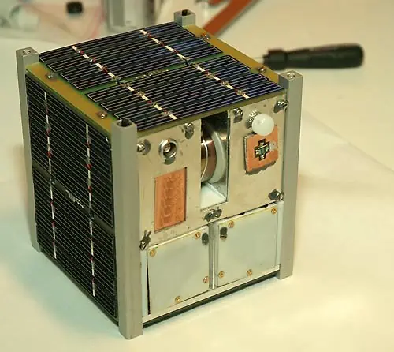
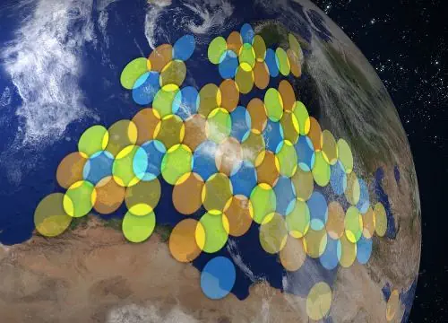

# Космический аппарат
> 2019.05.12 [🚀](../../index/index.md) [despace](index.md) → [SC](sc.md)
> *Navigation:*
> **[FAQ](faq.md)**【**[SCS](scs.md)**·КК, **[SC (OE+SGM)](sc.md)**·КА】**[CON](contact.md)·[Pers](person.md)**·Контакт, **[Ctrl](control.md)**·Упр., **[Doc](doc.md)**·Док., **[Drawing](drawing.md)**·Чертёж, **[EF](ef.md)**·ВВФ, **[Error](error.md)**·Ошибки, **[Event](event.md)**·Событ., **[FS](fs.md)**·ТЭО, **[HF&E](hfe.md)**·Эрго., **[KT](kt.md)**·КТ, **[N&B](nnb.md)**·БНО, **[Project](project.md)**·Проект, **[QM](qm.md)**·БКНР, **[R&D](rnd.md)**·НИОКР, **[SI](si.md)**·СИ, **[Test](test.md)**·ЭО, **[TRL](trl.md)**·УГТ

**Table of contents:**

[TOC]

---

> <small>**Космический аппарат (КА)** — русскоязычный термин. **Spacecraft (SC)** — англоязычный эквивалент.</small>

**Космический аппарат (КА)**, нар. **Махарайка, пепелац** — техническое устройство, предназначенное для функционирования в космическом пространстве с целью решения задач в соответствии с назначением [КК (КС)](scs.md).

Любой КА прост как смартфон среднего уровня. Осталось решить вопросы температур, перегрузок, радиации и вперёд. [Что же общего](drawing.md) ~~у ворона и письменного стола~~ у КА и смартфона 2015 года выпуска.

|*СЧ*|*КА*|*Смартфон*|
|:-|:-|:-|
|[Аккумулятор](eb.md)|+|+|
|[Акселерометр](.md)|(гироскоп)|+|
|[Антенны](antenna.md)|+|+|
|[Батарея солнечная](sp.md)|+|опция|
|[Блок автоматики и стабилизации](eas.md)|+|+|
|[Дальномер](doppler.md)|+|+|
|[Двигатель](ps.md)|+|–|
|[Двигатель‑маховик](iu.md)|+|–|
|[Звёздный датчик](sensor.md)|+|–|
|[Конструкция, механизмы, материалы](sc.md)|+|+|
|[Пилот](manned_sf.md)|+|+|
|[Привод антенны](devd.md)|+|опция|
|[Привод батареи солнечной](devd.md)|+|опция|
|[Провода](cable.md)|+|+|
|[Процессор](obc.md)|+|+|
|[Радиаторы, нагреватели](tcs.md)|+|+|
|[Радиомодуль](comms.md)|+|+|
|[Солнечный датчик](sensor.md)|+|+|
|[Телеметрия](tms.md)|+|+|

【**Table.** Manufacturers】

| | |
|:-|:-|
|**AE**|…|
|**AU**|…|
|**CA**|・[ADGA](contact/adga.md) — space systems engineering  ・[AQST Canada](contact/qstc.md)  ・[BRASS](contact/brass.md) — design consultancy  ・[C-CORE](contact/c_core.md) — technology consultancy  ・[Canadensys](contact/canadensys.md)  ・[Magellan Aerospace](contact/magellan_as.md)  ・[MDA](contact/mda.md) — Earth sats  ・[MSCI](contact/msci.md)  ・[SatCan](contact/satcan.md) — engineering & business consultancy for sat telecom & space tech sectors  ・[Space Concordia](contact/space_concordia.md) — (Student community) CubeSats  ・[UTIAS](contact/utias.md) — Research for space mechatronics, robotics, microsats, fluid dynamics|
|**CN**|…|
|**EU**|…|
|**IL**|…|
|**IN**|…|
|**JP**|・[ALE](contact/ale.md) — small Earth satellites  ・[Astroflash](contact/astroflash.md) — small sats  ・[Astroscale](contact/astroscale.md) — space debris  ・[Axelspace](contact/axelspace.md) — microsats  ・[CE Space](contact/ce_space.md) — microsats  ・[ispace](contact/ispace.md)  ・[JAMSS](contact/jamss.md) — Earth sats  ・JAXA [ISAS](contact/isas.md)  ・JAXA [Tsukuba Space Center](contact/tsukuba_sc.md)  ・[Kawasaki HVI](contact/kawasaki_hvi.md)  ・[Meisei](contact/meisei.md) — microsats  ・[Mitsubishi Electric](contact/mitsubishi.md)  ・[NEC](contact/nec.md)  ・[PDAS](contact/pd_aerospace.md) — suborbital spaceplane for tourism  ・[SKY Perfect JSAT](contact/sky_perfect_jsat.md)  ・[Space Walker](contact/space_walker.md) — suborbital spaceplane for tourism  ・[Synspective](contact/synspective.md) — small Earth sats  ・[Warpspace](contact/warpspace.md)|
|**KR**|・[KAI](contact/kai.md)  ・[KARI](contact/kari.md)  ・[Satrec Initiative](contact/satreci.md)|
|**RU**|・Lavochkin Association  ・[VNIIEM](contact/vniiem.md)  ・[РКК Энергия](ркк_энергия.md)  ・[AvantSpace](contact/avantspace.md)|
|**SA**|…|
|**SG**|…|
|**US**|・[Ball A&T](contact/ball_at.md)  ・[Xplore](contact/xplore.md)|
|**VN**|…|

## ➀ Разновидности и типичные формы
> <small>**Типичные формы КА** — русскоязычный термин, не имеющий аналога в английском языке. **Typical spacecrafts shapes** — дословный перевод с русского на английский.</small>

   - **Гайка** — [Фобос‑Грунт](фобос_грунт.md)
   - **Гнездо** — [Луна‑Грунт](luna_28.md)
   - **Голубятня** — [Luna‑25](луна_25.md), [Luna‑27](луна_27.md)
   - **Куб** — …
   - **Скворечник** — [Luna‑26](луна_26.md)

**Разновидности:**

   - **Авиационно‑космическая система (АКС)** — *Aerospace system* — РН с КА стартует с летящего самолёта.
   - **Автоматический космический аппарат (АКА)**.
   - **Композитный космический аппарат (ККА)** — КА, включающий в себя другие КА.
   - **Кубсат**.
   - **Многоразовая космическая транспортная система (МКТС, МТКС)** — *Reusable space transport system* — разновидность МКА.
   - **Многоразовый космический аппарат (МКА)**, иногда *«космический аппарат многоразового использования»* — *Re‑entry space vehicle* — КА, конструкция которого предусматривает повторное использование КА или его СЧ после возвращения из космического полёта.
   - **Модуль** — в некоторой степени автономная составная часть КА.
   - **Пилотируемый космический аппарат (ПКА)** — manned spacecraft (MSC) — КА для живых существ в космосе.
   - **Спутник**.

|*#*|*Class*|*Description*|
|:-|:-|:-|
|1|**Atmospheric**  (атмосферный КА) |1. Balloon — ➀ high‑height, ➁ low‑height, ➂ powered, ➃ simple, ➄ variable altitude  2. Communications atmospheric spacecraft (КА для связи)  3. Plane — ➀ glider, ➁ powered, ➂ maneuverable|
|2|**Base**  (база)|1. Ground  2. Orbital|
|3|**Lander**  (посадочный КА)|1. Communications lander (КА для связи)  2. Penetrator (КА‑пенетратор)  3. Plane — ➀ glider, ➁ powered, ➂ maneuverable  4. Rover (планетоход)|
|4|**Orbiter / Satellite**  (орбитальный КА)|1. [Communications orbiter](sc.md) (КА для связи) — ➀ high‑height, ➁ L1/L2, ➂ low‑height  2. Fly‑by spacecraft (пролётный КА)  3. Observatory (КА‑обсерватория) — ➀ high‑height, ➁ L1/L2, ➂ low‑height|
|5|**Robot**|1. Arm  2. Antropomorphic  3. Digger|
|6|**Other** (applicable  to almost any of the  above mentioned)|1. Manned — ➀ manned, ➁ unmanned  2. Size — ➀ large, ➁ medium, ➂ micro, ➃ nano, ➄ small  3. Swarm — ➀ net, ➁ single|

## ➁ Подвиды

### Кубсат
> <small>**Кубсат** — русскоязычный термин. **Cubesat** — англоязычный эквивалент.</small>

**Кубсат, CubeSat**, также **вошь**, **горох** — формат малых (сверхмалых) искусственных спутников, имеющих объём 1 литр и массу не более 1.33 ㎏ или несколько (кратно) более. Имеется ещё более малый формат покетсат (буквально карманный) в несколько сотен или десятков грамм и несколько сантиметров.

   1. <https://www.nanosats.eu/cubesat>
   1. <http://www.cubesat.org/>
   1. <https://en.wikipedia.org/wiki/CubeSat>
   1. <http://directory.eoportal.org/web/eoportal/satellite-missions/c-missions/cubesat-concept> — [archived ❐](f/scs/cubesat_concept_seor.pdf) 2016.05.06
   1. <http://www.cubesatshop.com> — магазин оборудования для кубсатов.

**Кубсат** — спутник размером 10×10×10 ㎝ (1U) и массой не более 1.33 ㎏. Допускается объединение 2 или 3 стандартных кубов в составе одного спутника (обозначаются 2U и 3U и имеют размер 10×10×20 или 10×10×30 ㎝).

Кубсаты обычно используют шасси‑каркас спецификации CubeSat и покупные стандартные комплектующие — COTS‑электронику и прочие узлы. Спецификации CubeSat были разработаны в 1999 году Калифорнийским политехническим и Стэнфордским университетами, чтобы упростить создание сверхмалых спутников. Формат кубсат сделал широким распространение университетских спутников; для унификации и координации существует всемирная межуниверситетская программа запуска кубсатов.

Кубсаты имеют стоимость выведения до нескольких десятков тысяч долларов, а покетсаты — до нескольких тысяч долларов.

Кубсаты выводятся, как правило, сразу по несколько единиц либо посредством [ракет‑носителей](lv.md), либо с борта космических кораблей и орбитальных станций. Несколько компаний предоставляет услуги по выводу кубсатов на орбиту, в частности ISC Kosmotras и Eurokot. Для размещения на РН или КА, запуска и разведения кубсатов разработаны многоместные контейнеры‑платформы, в т.ч. с револьверным выводом на орбиту. Также для вывода кубсатов разрабатываются сверхмалые РН — наноносители.

Термином «CubeSat» обозначаются наноспутники (Nano‑satellite), удовлетворяющие спецификациям стандарта, созданному под руководством профессора Bob Twiggs (факультет аэронавтики и астронавтики, Стэнфорд), Спутники имеют размер 10×10×10 ㎝ и запускаются при помощи Poly‑PicoSatellite Orbital Deployer (P‑POD). Стандарт допускает объединение 2 или 3 стандартных кубов в составе одного спутника (обозначаются 2U и 3U и имеют размер 10×10×20 или 10×10×30 ㎝). Один P‑POD имеет размеры, достаточные для запуска трёх спутников 10×10×10 ㎝ или меньшего количества, общим размером не более 3U.

На 2004 год, спутники в формате CubeSats могли быть изготовлены и запущены на околоземную орбиту за $ 65 000 ‑ 80 000. На 2012 год типичная стоимость запуска CubeSat оценивалась в $ 40 000 (иногда доходя также до 80 000, хотя NASA заявило и о возможности запуска за 20 000). Несколько покетсатов могут компоноваться и запускаться в контейнерном месте и по цене одного кубсата, т.е. за несколько тысяч долларов каждый. Столь низкая стоимость и унификация платформ и комплектующих позволяет разрабатывать и запускать кубсаты университетам и даже школам, небольшим частным компаниям и любительским объединениям, а покетсаты — частным лицам.

Большинство CubeSat имеют один или два научных прибора, некоторые имеют небольшие выдвижные антенны и поверхностные или распахивающиеся солнечные батареи.

【**Table.** Manufacturers】

| | |
|:-|:-|
|**AU**|…|
|**CA**|・[AlbertaSat](contact/albertasat.md)  ・[Kepler Communications](contact/kepler_comms.md)  ・[DSS](contact/dsslabs.md)  ・[SFL](contact/utias.md)|
|**CN**|…|
|**EU**|…|
|**IN**|…|
|**IL**|…|
|**JP**|…|
|**KR**|…|
|**RU**|・[AvantSpace](contact/avantspace.md)  ・[Спутникс](contact/sputnix.md)|
|**SA**|…|
|**SG**|…|
|**US**|…|
|**AE**|…|
|**VN**|…|

### ПКА
> <small>**Пилотируемый космический аппарат (ПКА)** — русскоязычный термин. **Manned spacecraft** — англоязычный эквивалент.</small>

**Пилотируемый космический аппарат (ПКА)** — космический аппарат, снабжённый [системами жизнеобеспечения](ls.md) и управления полётом, и предназначенный для жизни, работы или иной деятельности одного или нескольких человек в космическом пространстве. Встречаются также наименования *пилотируемый космический корабль (ПКК)* и *пилотируемая орбитальная станция (ПОС)*.

Управление ПКА может осуществляться экипажем, операторами наземных [ЦУП](scs.md), системами автоматики или комбинацией этих методов.

В состав ПКА, в дополнение к [обычным системам](drawing.md) [КА](sc.md), входят:

   1. [Система аварийного спасения](les.md) (САС)
   1. [Система жизнеобеспечения](ls.md) (СЖО)
   1. **Спускаемый аппарат** или **Космоплан** для возврата экипажа на Землю

【**Table.** Manufacturers】

| | |
|:-|:-|
|**AU**|…|
|**CA**|…|
|**CN**|・[CNSA](contact/cnsa.md)|
|**EU**|・[ESA](contact/esa.md)|
|**IN**|…|
|**IL**|…|
|**JP**|・[JAXA](contact/jaxa.md)|
|**KR**|…|
|**RU**|・[РКК Энергия](ркк_энергия.md)|
|**SA**|…|
|**SG**|…|
|**US**|・[Blue Origin](blue_origin.md)  ・[Boeing](contact/boeing.md)  ・[Lockheed Martin](lockheed_martin.md)  ・[SpaceX](contact/spacex.md) — [Dragon](dragon.md)|
|**AE**|…|
|**VN**|…|

### Спутник
> <small>**Спутник** — русскоязычный термин. **Satellite** — англоязычный эквивалент.</small>

**Satellite mass classification**  
Классификация спутников по массе

   - ≥ 1 000 ㎏ — Large satellites — Тяжёлые спутники
   - 500 ‑ 1 000 ㎏ — Medium satellites — Средние спутники
   - ≤ 500 ㎏ — Small satellites — Малые спутники
      - 100 ‑ 500 ㎏ — Minisatellites — Миниспутники
      - 10 ‑ 100 ㎏ — Microsatellites — Микроспутники
      - 1 ‑ 10 ㎏ — Nanosatellites — Наноспутники (all Cube‑, Pocket‑, Tube‑, Sun‑, Thin‑Sats & non‑standard picosats)
      - 0.1 ‑ 1 ㎏ — Picosatellites — Пикоспутники
      - 0.01 ‑ 0.1 ㎏ — Femtosatellites — Фемтоспутники
      - 0.001 ‑ 0.01 ㎏ — Attosatellites — Аттоспутники
      - 0.0001 ‑ 0.001 ㎏ — Zeptosatellites — Зептоспутники
   - CubeSat parametres — Параметры кубсатов:
      - 0.25 ‑ 27U
      - 0.2 ‑ 40 ㎏

### Communication spacecraft
> <small>**Communication spacecraft** — EN term. **Космический аппарат связи** — RU analogue.</small>

<mark>TBD</mark>

   1. <https://en.wikipedia.org/wiki/High-throughput_satellite>
   1. <https://en.wikipedia.org/wiki/Fixed-satellite_service>

#### FSS
> <small>**Fixed-satellite service (FSS)** — EN term. **Фиксированная спутниковая служба (ФСС)** — RU analogue.</small>

#### HTS
> <small>**High-throughput satellite (HTS)** — EN term. **Высокопроизводительный спутник (ВПС)** — literal RU translation.</small>

**High-throughput satellite (HTS)** is a communications satellite that provides more throughput than a classic FSS satellite (at least twice, though usually by a factor of 20 or more) for the same amount of allocated orbital spectrum, thus significantly reducing cost-per-bit. ViaSat-1 and EchoStar XVII (also known as Jupiter-1) do provide more than 100 Gbit/s of capacity, which is more than 100 times the capacity offered by a conventional FSS satellite. When it was launched in October 2011 ViaSat-1 had more capacity (140 Gbit/s) than all other commercial communications satellites over North America combined.

The significant increase in capacity is achieved by a high level frequency re-use and spot beam technology which enables frequency re-use across multiple narrowly focused spot beams (usually in the order of hundreds of kilometers), as in cellular networks, which both are defining technical features of high-throughput satellites. By contrast traditional satellite technology utilizes a broad single beam (usually in the order of thousands of kilometers) to cover wide regions or even entire continents. In addition to a large amount of bandwidth capacity HTS are defined by the fact that they often, but not solely, target the consumer market. In the last 10 years, the majority of high-throughput satellites operated in the Ka band, however this is not a defining criterion, and at the beginning of 2017 there was at least 10 Ku band HTS satellites projects, of which 3 were already launched and 7 were in construction.

Initially, HTS systems used satellites in the same geosynchronous orbit (at an altitude of 35 786 km) as satellite TV craft (with satellites such as KA-SAT, Yahsat 1A and Astra 2E sharing TV and HTS functionality) but the propagation delay for a round-trip internet protocol transmission via a geosynchronous satellite can exceed 550 ms which is detrimental to many digital connectivity applications, such as automated stock trades, hardcore gaming and Skype video chats. and the focus for HTS is increasingly shifting to the lower Medium Earth orbit (MEO) and Low Earth orbit (LEO), with altitudes as low as 600 km and delays as short as 40 ms. Also, the lower path losses of MEO and LEO orbits reduces ground station and satellite power requirements and costs, and so vastly increased throughput and global coverage is achieved by using constellations of many smaller, cheaper high-throughput satellites. SES's O3b constellation was the first MEO high-throughput satellite system, launched in 2013, and by 2018 more than 18 000 new LEO satellites had been proposed to launch by 2025.

Despite the higher costs associated with spot beam technology, the overall cost per circuit is considerably lower as compared to shaped beam technology. While Ku band FSS bandwidth can cost well over $ 100 million per gigabit per second in space, HTS like ViaSat-1 can supply a gigabit of throughput in space for less than $ 3 million. While a reduced cost per bit is often cited as a substantial advantage of high-throughput satellites, the lowest cost per bit is not always the main driver behind the design of an HTS system, depending on the industry it will be serving.

HTS are primarily deployed to provide broadband Internet access service (point-to-point) to regions unserved or underserved by terrestrial technologies where they can deliver services comparable to terrestrial services in terms of pricing and bandwidth. While many current HTS platforms were designed to serve the consumer broadband market, some are also offering services to government and enterprise markets, as well as to terrestrial cellular network operators who face growing demand for broadband backhaul to rural cell sites. For cellular backhaul, the reduced cost per bit of many HTS platforms creates a significantly more favorable economic model for wireless operators to use satellite for cellular voice and data backhaul. Some HTS platforms are designed primarily for the enterprise, telecom or maritime sectors. HTS can furthermore support point-to-multipoint applications and even broadcast services such as DTH distribution to relatively small geographic areas served by a single spot beam.

A fundamental difference between HTS satellites is the fact that certain HTS are linked to ground infrastructure through a feeder link using a regional spot beam dictating the location of possible teleports while other HTS satellites allow the use of any spot beam for the location of the teleports. In the latter case, the teleports can be set up in a wider area as their spotbeams' footprints cover entire continents and regions like it is the case for traditional satellites .

Industry analysts at Northern Sky Research believe that high-throughput satellites will supply at least 1.34 TB/s of capacity by 2020 and thus will be a driving power for the global satellite backhaul market which is expected to triple in value – jumping from the 2012 annual revenue of about US $ 800 million to $ 2.3 billion by 2021.

【**Рисунок.** KA-SAT coverage over Europe showing frequency reuse by different colors】  

#### (RU) HTS
> <small>**High-throughput satellite (HTS)** — EN term. **Высокопроизводительный спутник (ВПС)** — literal RU translation.</small>

**HTS (англ. high-throughput satellite)** — класс спутников связи с высокой пропускной способностью, которые обеспечивают увеличение общей пропускной способности по сравнению с традиционными спутниками от двух до 20 и более раз при том же самом орбитальном спектре частот.

Большая пропускная способность позволяет уменьшать стоимость использования спутникового канала. Наиболее известные спутники этой категории — ViaSat-1 и EchoStar XVII (известный также как Jupiter-1), они обеспечивают общую скорость передачи данных более 100 Гбит/с, что более чем в 100 раз превышает ёмкость традиционных спутниковых каналов. Спутник ViaSat-1 был запущен в октябре 2011 года и имел  общую скорость передачи информации 140 Гбит/с, что больше, чем у всех остальных коммерческих спутников связи в Северной Америке.

Принципиальная разница между HTS и традиционными спутниками состоит в наличии у первых множества лучей, что позволяет повторно использовать их частотный ресурс.

Основным элементом таких спутников является антенная система. Её параметры определяют потенциальные возможности всей системы. Выбор необходимых параметров антенной системы, рабочей зоны, ориентации лучей и др. влияет на окупаемость спутниковой системы. В настоящее время используются многолучевые зеркальные антенны, выполненные по типу «один рупор — один луч». Возможна также реализация бортовых многолучевых антенн с кластерными облучателями, так как это решение, несмотря на то, что проигрывает по антенным техническим параметрам, однако позволяет существенно сократить массу антенной системы HTS за счёт сокращения числа облучателей антенн в её составе.

**Запуски.** Запуск спутников класса HTS производится с 2004 года, среди них:

   - Anik F2 (июль 2004)
   - Thaicom 4 (IPSTAR) (август 2005)
   - Spaceway-3 (август 2007)
   - WINDS (февраль 2008)
   - KA-SAT (декабрь 2010)
   - Yahsat 1A (апрель 2011)
   - ViaSat-1 (октябрь 2011)
   - Yahsat 1B (апрель 2012)
   - EchoStar XVII (июль 2012)
   - HYLAS 2 (июль 2012)
   - Astra 2E (сентябрь 2013)
   - Inmarsat Global Xpress constellation (2013-2015)
   - Sky Muster (NBN Co-1A) (октябрь 2015)
   - Badr-7 for TRIO Connect (ноябрь 2015)
   - Intelsat 29e (2016)
   - Intelsat 33e (2016)
   - Intelsat 32e (2017)
   - Intelsat 37e (2017)
   - SES-14 (Q4, 2017)
   - Eutelsat 172B (2017)
   - Fibersat-1 (Q4, 2018)
   - На 2019 год намечен запуск спутника ViaSat-3, ориентированного на американский рынок. Антенная система этого спутника будет формировать 5 000 узких лучей. Заявленная пропускная способность составит около 1 Тбит/с. В России проводится работа над HTS «Энергия-100». Его антенная система будет формировать 1 500 лучей.

 

## ➂ Onboard equipment
**Onboard equipment (OE)** *(ru. Бортовая аппаратура, БА)* — the general name of the equipment installed on the [SC](sc.md). Includes service equipment & payload.

<small>

|*Service equipment* (ru. Служебная аппаратура, СА) — the general name of the OE that ensures the functioning of the SC & the implementation of the target task by the SC|*Payload* (ru. Научная аппаратура, НА, Комплекс научной аппаратуры, КНА, Полезная нагрузка, ПН) — the general name of the OE used to implement the target task for a [SC](sc.md) & [SCS](scs.md)|
|:-|:-|
|**[Aimed antenna drive (AIAD)](devd.md)**·ПНА|—|
|—|**Analyzer of gas**·Газоанализатор|
|**[Automatic control unit (ACU)](eas.md)**·БАППТ|—|
|**[Autonomous navigation system (ANS)](ans.md)**·САН|—|
|**Beacon**·Маяк|**Beacon**·Маяк|
|**[Cable](cable.md)**·БКС|+|
|**[Camera (gen., 3D, diff. spectra)](cam.md)**·Kамера (обыч., 3D, разн. спектров)|**[Camera (gen., 3D, diff. spectra)](cam.md)**·Kамера (обыч., 3D, разн. спектров)|
|**[Comms (transmitter, receiver)](comms.md)**·Радио (приёмник, передатчик)|—|
|**[Control module (CM)](eas.md)**·БУ|—|
|**[Data storage (DS)](ds.md)**·ЗУ|—|
|**[Doppler](doppler.md)**·ИСР|**Radar**·Радар|
|—|**Radar for subsoil**·Радар подпочвенный|
|**[Ecology](ecology.md)**·Экология|+|
|**[Electronic components](elc.md)**·ЭКБ|—|
|**[Electric battery (EB)](eb.md)**·ХИТ|—|
|**[Electro-automatic system (EAS)](eas.md)**·СЭА|—|
|**[EMC](emc.md)**·ЭМС|+|
|**[Fuel](ps.md)**·Топливо|—|
|**[GNC](gnc.md)**·БКУ|—|
|**[Inertial unit (UI)](iu.md)**·Гироскоп|—|
|**[Landing gear (LAG)](lag.md)**·ПУC|—|
|**[Launch escape system (LES)](les.md)**·САСП|—|
|**[Life support (LS)](ls.md)**·СЖО|—|
|**[Manned spacecraft (MSC)](sc.md)**·ПКА|—|
|—|**Meter of energetic particles**·Измеритель энергетичных частиц|
|**[Meter of magnetic fields (magnetometer)](sensor.md)**·Магнитометр|**[Meter of magnetic fields (magnetometer)](sensor.md)**·Магнитометр|
|—|**Meter of plasma**·Измеритель плазмы|
|—|**Meter of seismic activity (seismometer)**·Сейсмометр|
|—|**Meter of spectra (spectrometer: IR, UV, Fourier, etc.)**·Спектрометр|
|—|**Meter of stellar wind**·Измеритель звёздного ветра|
|**[Nuclear reactor (NR)](nr.md)**·ЯР|—|
|**[Onboard computer (OBC)](obc.md)**·ЦВМ|—|
|**[Patent](patent.md)**·Патент|+|
|**[Propulsion system (PS)](ps.md)**·ДУ|—|
|**[Reaction wheel (RW)](iu.md)**·ДМ|—|
|—|**Reflector**·Отражатель|
|**[Robot](robot.md)**·Робот|—|
|**[Rotor](iu.md)**·Ротор|—|
|**[Rover](robot.md)**·Ровер|—|
|**[RTG, RHU](rtg.md)**·РИТЭГ, РИТ|—|
|**[Sensor (general)](sensor.md)**·Датчик (общий)|**[Sensor of dust/gas/temp./wind](sensor.md)**·Датчик пыли/газа/темп./ветра|
|**[Structures, gears, materials (SGM)](sc.md)**·KММ|+|
|**[Software](soft.md)**·ПО|+|
|**[Soil sample system (SSS)](sss.md)**·ГЗУ|**[Soil collector](sss.md)**·Грунтозаборник|
|**[Solar panel (SP)](sp.md)**·БС|—|
|**[Solar panels orientation system (SPOS)](devd.md)**·СОСБ|—|
|**[Spacecraft power system (SPS)](sps.md)**·СЭС|—|
|**[Star tracker](sensor.md)**·Звёздный датчик|—|
|**[Sun sensor](sensor.md)**·Солнечный датчик|—|
|**[Systems engineering (SE)](se.md)**·СЭ|+|
|**[Telemetry system (TMS)](tms.md)**·ТМС|+|
|**[Thermal control system (TCS)](tcs.md)**·СОТР|+|
|**[Timeline](timeline.md)**·Циклограмма|+|
|**[Wind turbine (WT)](wt.md)**·Ветрогенератор|—|

</small>

### Description & manufacturers

In common any onboard equipment can be basically described using the following table.

|*Characteristics*|*Value*|
|:-|:-|
|Composition| 【TBD: single unit, wires, a number of units, pressurization level, etc.】 |
|Consumption, W| 【TBD: typical, basic timeline, etc.】 |
|Dimensions, ㎜| 【TBD: general dimensions, not volume】 |
|Interfaces| 【TBD: connectors, mounting points, orientation】 |
|Lifetime/Resource, h(y)| 【TBD: lifetime for total lifetime, resource for active state】 |
|Mass, ㎏| 【TBD: mass of the unit(s) in space】 |
|[Overload](vibration.md), Grms| 【TBD: acceptable loads & their direction】 |
|Rad.resist, ㏉ (㎭)| 【TBD: total ionising dose】 |
|Reliability per lifetime| 【TBD: a calculated/proven reliability】 |
|Thermal range, ℃| 【TBD: for an active condition & for transportation】 |
|TRL| 【TBD: current TRL】 |
|Voltage, V| 【TBD: nominal, acceptable range for a constant work & for a transition periods】 |
|**【Specific】**|• • •|
|Specific req. #1| |
|Specific req. #…| |
| | 【TBD: photo, sketch, scheme, render, etc.】 |

【**Table.** Manufacturers】

| | |
|:-|:-|
|**AE**|…|
|**AU**|…|
|**CA**|・[MDA](contact/mda.md)  ・[Thoth Tech.](contact/thoth_tech.md) — cameras, spectrometers|
|**CN**|…|
|**EU**|…|
|**IL**|…|
|**IN**|…|
|**JP**|…|
|**KR**|…|
|**RU**|・[IKI RAS](contact/iki_ras.md) — payload|
|**SA**|…|
|**SG**|…|
|**US**|…|
|**VN**|…|

 

## ➃ Structures, gears, materials
**Structures, gears, materials (SGM)** *(ru. Конструктивные элементы, механизмы, материалы, КММ)* — elements of SC or their parts.

Below is a list & characteristics of materials used in the space (and not so) industry.

【**Table.** Manufacturers】

| | |
|:-|:-|
|**AE**|…|
|**AU**|…|
|**CA**|・[Canadensys](contact/canadensys.md) — mechanisms, structures  ・[Macfab](contact/macfab.md) —  housings & covers for mission-critical electronics, separation systems, structures machined from magnesium & composite honeycomb panels  ・[UTIAS](contact/utias.md) — Research for space mechatronics, robotics, microsats, fluid dynamics|
|**CN**|…|
|**EU**|…|
|**IL**|…|
|**IN**|…|
|**JP**|・[Mitsubishi Elecric](contact/mitsubishi.md) — structural panels  ・[Tamagawa Seiki](contact/tamagawa_seiki.md) — servo components|
|**KR**|…|
|**RU**|・SGM of SC manufactures everyone who manufacture SC ([VNIIEM](contact/vniiem.md), [ISS](contact/iss_r.md), [LAV](contact/lav.md), etc.)  ・[NIICOM](contact/niicom.md) — rotary devices, drives;  ・[RSC AC](contact/rsc_ac.md) — chemicals, materials, coatings|
|**SA**|…|
|**SG**|…|
|**US**|…|
|**VN**|…|

### Structures & gears

   - [Containers for transportation](ship_contain.md)
   - [Nominal](nominal.md)

|*Gears*|*Structures*|
|:-|:-|
|・[Directional Antenna Drive](devd.md)  ・[Landing gear (PUS)](lag.md)  ・[Pusher](толкатель.md)  ・[Robotics](robot.md)|・[Capillar intake unit (CINU)](cinu.md)  ・[Capillary gas storage (CGS)](cgs.md)  ・[Hermetic container](гермоконтейнер.md)  ・[Sensor](sensor.md)  ・[Slice](слайс.md)  ・[Thermal honeycomb](tsp.md)  ・[Typical forms of SC](sc.md)|

### Materials

   - The use of the following materials in a SC (especially, in parts interacting with an atmosphere or soil or affecting SC actions) shall be deliberately limited:  Diamond, Platinoids, Silicon carbide, Ag, As, Au, Bi, [Cu](copper.md), Ga, Ge, In, [Ni](nickel.md), [Sn](tin.md), Sb, Se, Te, Zn
   - [Fuel](ps.md)
   - [Materials characteristics](matc.md)

|*Gas*|*Liquid*|*Metal*|*Non‑metal*|
|:-|:-|:-|:-|
|・[Helium](helium.md)  ・[Hydrogen](hydrogen.md)|・|・[Aluminium](aluminium.md) (01570, AMg6)  ・[Copper](copper.md)  ・[Magnesium](magnesium.md)  ・[Nickel](nickel.md) (Inconel)  ・[Niobium](niobium.md)  ・[Tin](tin.md)  ・[Titanium](titanium.md) (VT23)|・[Asbotextolite](asc_lam.md)  ・[Bakelite](bakelite.md)  ・[Carbon fiber](cfrp.md)  ・[Gravimol](gravimol.md)  ・[MLI](mli.md)  ・[Nitron](acryl_fiber.md)  ・[Polyformaldehyde](polyoxymethylene.md)|

 

## ➄ Docs & links (TRANSLATEME ALREADY)
|*Sections & pages*|
|:-|
|**【[Spacecraft (SC)](sc.md)】**  [Cleanliness level](clean_lvl.md)・ [Communication SC](sc.md)・ [Cubesat](sc.md)・ [FSS](sc.md)・ [HTS](sc.md)・ [Interface](interface.md)・ [Manned SC](sc.md)・ [Satellite](sc.md)・ [Sub-item](sui.md)・ [Typical forms](sc.md)|

   1. Docs:
      - [ГОСТ 53802](гост_53802.md), п. 102‑103
   1. <https://en.wikipedia.org/wiki/Payload>
   1. <https://www.spacematdb.com/>
   1. <https://en.wikipedia.org/wiki/Reusable_launch_system>
   1. <https://en.wikipedia.org/wiki/Spacecraft>
   1. <https://en.wikipedia.org/wiki/Reusable_spacecraft>
   1. <https://en.wikipedia.org/wiki/List_of_crewed_spacecraft>
   1. <https://ru.wikipedia.org/wiki/Пилотируемый_космический_аппарат>
   1. <https://ru.wikipedia.org/wiki/Пилотируемый_космический_корабль>
   1. <https://www.nasa.gov/audience/forstudents/postsecondary/features/F_Spacecraft_Classification.html>
