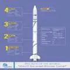
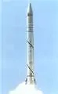

# Shavit
> 2019.07.04 [🚀](../../index/index.md) [despace](index.md) → [LV](lv.md)
> *Navigation:*
> **[FAQ](faq.md)**【**[SCS](scs.md)**·КК, **[SC (OE+SGM)](sc.md)**·КА】**[CON](contact.md)·[Pers](person.md)**·Контакт, **[Ctrl](control.md)**·Упр., **[Doc](doc.md)**·Док., **[Drawing](drawing.md)**·Чертёж, **[EF](ef.md)**·ВВФ, **[Error](error.md)**·Ошибки, **[Event](event.md)**·Событ., **[FS](fs.md)**·ТЭО, **[HF&E](hfe.md)**·Эрго., **[KT](kt.md)**·КТ, **[N&B](nnb.md)**·БНО, **[Project](project.md)**·Проект, **[QM](qm.md)**·БКНР, **[R&D](rnd.md)**·НИОКР, **[SI](si.md)**·СИ, **[Test](test.md)**·ЭО, **[TRL](trl.md)**·УГТ

**Table of contents:**

[TOC]

---

> <small>**Shavit** — англоязычный термин, не имеющий аналога в русском языке. **Шавит** — дословный перевод с английского на русский.</small>

**Шави́т** (ивр. ‏שביט‏‎ — «комета») — израильская одноразовая твердотопливная ракета‑носитель лёгкого класса.

|*Version*|*Description*|*Activity*|
|:-|:-|:-|
|Shavit|Базовый вариант.|**Активен** (1988 ‑ …)|

---

 

## Shavit
**Шави́т** (ивр. ‏שביט‏‎ — «комета») — израильская одноразовая твердотопливная ракета‑носитель лёгкого класса.

|*Characteristic*|*[Value](si.md)*|
|:-|:-|
|Активность|**Активен** (1988.09.19 ‑ …)|
|[Аналоги](analogue.md)|[Electron](electron.md) (Н.Зел.)・ [Pegasus](pegasus.md) (США)・ [Smart Dragon 1](smart_dragon.md) (Китай)|
|Длина/диаметр|26.4 м / 1.35 м|
|[Космодромы](spaceport.md)|[Palmachim](spaceport.md)|
|Масса старт./сух.|30 500 ㎏ / … ㎏|
|Разраб./изготов.|[IAI](contact/iai.md) (Израиль) / [IAI](contact/iai.md) (Израиль)|
|Ступени|4|
|[Fuel](ps.md)|[HTPB](ps.md)|
| ||

**Выводимые массы.**

|*Космодром*|*РН*|<small>*Масса,  [НОО](nnb.md), т*</small>|<small>*Масса,  [ГСО](nnb.md), т*</small>|<small>*Масса к  [Луне](moon.md), т*</small>|<small>*Масса к  [Венере](venus.md), т*</small>|<small>*Масса к  [Марсу](mars.md), т*</small>|*Примечания*|
|:-|:-|:-|:-|:-|:-|:-|:-|
|[Palmachim](spaceport.md)|0.38|—|—|—|—|—|Пуск — $ 25 млн (2017 г);  ПН 1.24 % от ст.массы|

<small>Примечания:  **1)** Указана масса для наихудших условий старта.  **2)** В скобках указана масса для наилучших условий старта.</small>

 

## Архивные

…

 

## Docs & links (TRANSLATEME ALREADY)
|*Sections & pages*|
|:-|
|**【[Launch vehicle (LV)](lv.md)】**  [ICBM](icbm.md)・ [Integrated payload unit](lv.md)・ [Non‑rocket spacelaunch](nrs.md)・ [Throw weight](throw_weight.md) • • •  **China:** [Long March](long_march.md) ┊ **EU:** [Arian](arian.md), [Vega](vega.md) ┊ **India:** [GSLV](gslv.md), [PSLV](pslv.md) ┊ **Israel:** [Shavit](shavit.md) ┊ **Japan:** [Epsilon](epsilon.md), [H2](h2.md), [H3](h3.md) ┊ **Korea N.:** [Unha](unha.md) ┊ **Korea S.:** *([Naro‑1](naro_1.md))* ┊ **RF,CIF:** [Angara](angara.md), [Proton](proton.md), [Soyuz](soyuz.md), [Yenisei](yenisei.md), [Zenit](zenit.md) *([Energia](energia.md), [Korona](korona.md), [N‑1](n_1.md), [R‑1](r_7.md))* ┊ **USA:** [Antares](antares.md), [Atlas](atlas.md), [BFR](bfr.md), [Delta](delta.md), [Electron](electron.md), [Falcon](falcon.md), [Firefly Alpha](firefly_alpha.md), [LauncherOne](launcherone.md), [New Armstrong](new_armstrong.md), [New Glenn](new_glenn.md), [Minotaur](minotaur.md), [Pegasus](pegasus.md), [Shuttle](shuttle.md), [SLS](sls.md), [Vulcan](vulcan.md) *([Saturn](saturn_lv.md), [Sea Dragon](sea_dragon.md))*|

   1. Docs: …
   1. <https://en.wikipedia.org/wiki/Shavit>
   1. <https://www.iai.co.il/p/shavit>
