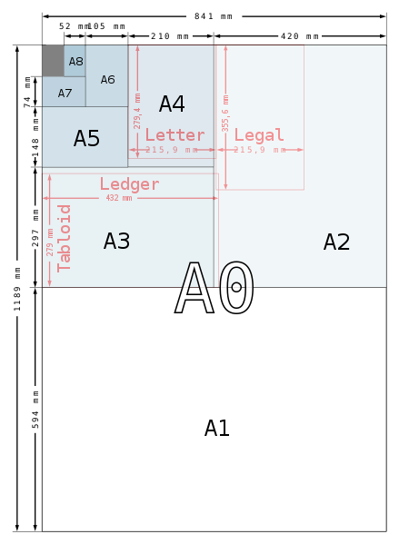

# СИ и Формулы
> 2019.05.12 [🚀](../../index/index.md) [despace](index.md) → **[СИ и формулы](si.md)**
> *Navigation:*
> **[FAQ](faq.md)**【**[SCS](scs.md)**·КК, **[SC (OE+SGM)](sc.md)**·КА】**[CON](contact.md)·[Pers](person.md)**·Контакт, **[Ctrl](control.md)**·Упр., **[Doc](doc.md)**·Док., **[Drawing](drawing.md)**·Чертёж, **[EF](ef.md)**·ВВФ, **[Error](error.md)**·Ошибки, **[Event](event.md)**·Событ., **[FS](fs.md)**·ТЭО, **[HF&E](hfe.md)**·Эрго., **[KT](kt.md)**·КТ, **[N&B](nnb.md)**·БНО, **[Project](project.md)**·Проект, **[QM](qm.md)**·БКНР, **[R&D](rnd.md)**·НИОКР, **[SI](si.md)**·СИ, **[Test](test.md)**·ЭО, **[TRL](trl.md)**·УГТ

**Table of contents:**

[TOC]

---

## СИ

> <small>**Международная система единиц** — русскоязычный термин. **International System of Units** — англоязычный эквивалент.</small>  
>> <small>В мире есть 10 типов людей, мой друг — те, кто понимает двоичную систему счисления, и те, кто не понимает.</small>

**Международная система единиц (СИ)**, фр. **Le Système International d’Unités (SI)** — система единиц физических величин, современная метрическая система, наиболее используемая в мире. Принята в качестве основной системы единиц большинством стран мира и почти всегда используется в области техники, даже в странах, где повседневно используются традиционные единицы. Основные единицы:

|*Величина*|<small>*Символ*|*Наимен.  рус.*|*Наимен.  фр./англ.*|<small>*Обозн.  рус.*|<small>*Обозн.  междун.*|
|:-|:-|:-|:-|:-|:-|
|**Длина**|L|метр|mètre / metre|м|m|
|**Масса**|M|килограмм| kilogramme / kilogram|кг|㎏|
|**Время**|T|секунда|seconde / second|с|s|
|**Сила электрического тока**|I|ампер|ampère / ampere|А|A|
|**Термодинамическая температура**|Θ|кельвин|kelvin|К|K|
|**Количество вещества**|N|моль|mole|моль|㏖|
|**Сила света**|J|кандела|candela|кд|㏅|
|**Электрический заряд**|q|кулон|coulomb|Кл|C|

### Расстояние
   - 1 ㎞ = 1 000 м = 100 000 ㎝ = 1 000 000 ㎜

| |*Кратные*| |•| |*Дольные*| |
|:-|:-|:-|:-|:-|:-|:-|
|10¹ м|декаметр|дам (dam)|•|10⁻¹ м|дециметр|дм (dm)|
|10² м|гектометр|гм (hm)|•|10⁻² м|сантиметр|см (㎝)|
|10³ м|километр|км (km)|•|10⁻³ м|миллиметр|мм (㎜)|
|10⁶ м|мегаметр|Мм (Mm)|•|10⁻⁶ м|микрометр|мкм (㎛)|
|10⁹ м|гигаметр|Гм (Gm)|•|10⁻⁹ м|нанометр|нм (㎚)|
|10¹² м|тераметр|Тм (Tm)|•|10⁻¹² м|пикометр|пм (pm)|
|10¹⁵ м|петаметр|Пм (Pm)|•|10⁻¹⁵ м|фемтометр|фм (㎙)|
|10¹⁸ м|эксаметр|Эм (Em)|•|10⁻¹⁸ м|аттометр|ам (am)|
|10²¹ м|зеттаметр|Зм (Zm)|•|10⁻²¹ м|зептометр|зм (zm)|
|10²⁴ м|йоттаметр|Им (Ym)|•|10⁻²⁴ м|йоктометр|им (ym)|

**Нестандартные**

|*Вид*|*Наименование*|*Размер*|
|:-|:-|:-|
|**Астроном.  длины**|1 астрон. единица  (а.е.)|149 597 870.691 ㎞ = ~ 150 млн ㎞ = 0.000004848 парсека|
| |1 [парсек](parsec.md) (пк)|206 264.8 а.е. = 3.0856776·10¹⁶ м = 30.8568 трлн ㎞ (петаметров) = 3.2616 светового года|
| |1 световой год|9 460 730 472 580 820 м = ~ 9.5 трлн ㎞ (петаметров) = 63 241.1 а.е. = 0.306 601 парсек|
|**Длины**|1 верста|1.0668 ㎞|
| |1 дюйм (")|2.54 ㎝|
| |1 кабельтов|182.88 м = 185.2 м (междунар.) = 185.3184 м (англ.) = 219.456 м (старый США)|
| |1 лига|4.828032 ㎞|
| |1 лье|4.445 ㎞ (сухопутное) = 5.565 ㎞ (морское) = 3.898 ㎞ (почтовое)|
| |1 миля|1.609344 ㎞ (англ./амер.) = 1.852 ㎞ (морская)|
| |1 фут|30.48 ㎝|
| |1 ярд|0.9144 м|
| |1 удав|5 м = 2 слонёнка = 38 попугаев|
| |1 слонёнок|2.5 м = 19 попугаев|
| |1 попугай|0.13 м|

### Радиация
   - 1 Гр (㏉) = 100 рад — поглощённая энергия в 1 Дж на 1 ㎏ массы вещества
   - 1 рад = 0.01 Гр (㏉) — неСИ — поглощённая энергия в 100 эрг на 1 грамм вещества
   - 1 кулон/килограмм (Кл/㎏) = 3 876 R — доза фотонного излучения, образующего ионы с зарядом в 1 ед. заряда СГСЭ (⅓·10⁻⁹ кулон) в 1 ㎝² воздуха
   - 1 рентген (R) = 0.000.257.976 Кл/㎏ — неСИ

### Объём
|*Вид*|*Наименование*|*Размер*|
|:-|:-|:-|
|**Объём жидк.**|1 л|1.76 пинты = 0.23 галлона = 0.001 m³|
|**Англ. внесист.**|1 баррель|0.16365 m³ (для сыпучих веществ)|
| |1 бушель|36.36872 л = 8 галлонов = 0.036.368.7 m³ (междунар. коробка 18 ㎏)|
| |1 кгарта|2 пинты = ¼ галлона = 1.23 л|
| |1 пинта|0.57 л|
| |1 галлон|8 пинт = 4.55 л (Имперский галлон)|
| |1 унция|2.841·10⁻⁵ m³|
|**Амер. внесист.**|1 амер. галлон|3.785 л (распространён в США)|
| |1 унция|2.957·10⁻⁵ m³|
|**Антич. внесист.**|Котила|0.275 л|
|**Др.-еврейские**|Эйфа|24 883 ㎝² (Эйфа́)|
| |Омер|0.1 эйфы|
| |Гин|4 147 ㎝²|
| |Кав|1 382 ㎝²|
|**Рус. внесист.**|Бочка|40 вёдер = 492 л|
| |Бутылка (вино)|1/16 ведра = 0.77 л|
| |Бутылка (пиво)|1/20 ведра = 0.61 л|
| |Ведро|4 четверти = 8 штофов = 12.3 л|
| |Гарнец|3.2798 л|
| |Кружка|10 чарок = 20 шкаликов = 1.23 л|
| |Мера|4.7 ведра|
| |Чарка|2 шкалика = 0.123 л|
| |Четверик|26.238 л|
| |Четверть|4 бутылки = 3.075 л|
| |Шкалик (косушка)|пол чарки = 0.0615 л|
| |Штоф|1.54 л|
|**Прочие**|1 дюйм³|1.63871·10⁻⁵ m³|
| |1 литр|1·10⁻³ m³|
| |Лямбда 1 λ|1·10⁻⁹ m³|
| |1 стер|1 m³|
| |1 фут³|0.0283168 m³|
| |1 ярд³|0.76455 m³|

### Свет

   - **Канде́ла** *(от лат. candela — свеча; русское обозначение: кд; международное: cd)* — единица силы света. Определена как «сила света в заданном направлении источника, испускающего монохроматическое излучение частотой 540⋅10¹² Гц, энергетическая сила света которого в этом направлении составляет 1 / 683 Вт/ср». Из определения следует, что значение спектральной световой эффективности монохроматического излучения для частоты 540⋅10¹² Гц равно 683 ㏐/W = 683 ㏅·ср/W точно. Выбранная частота соответствует длине волны 555.016 нм в воздухе при стандартных условиях и находится вблизи максимума чувствительности человеческого глаза (555 нм). Если излучение имеет другую длину волны, то для достижения той же силы света требуется бо́льшая энергетическая сила света.
   - **Люкс (㏓, лк)** — единица измерения освещённости в СИ. Один люкс равен освещённости поверхности площадью 1 m² при световом потоке падающего на неё излучения, равном 1 ㏐.

|*Свет*|*Размер*|
|:-|:-|
|1 W/m²|68 300 000 000 ㏓ （1 W/㎝² = 6 830 000 ㏓）|
|1 ㏓|1 ㏐/m² = 1 ㏅·ср/m² = 1 / 68 300 000 000 W/m²|

### Силы

   - **[Атмосфера](atmosphere.md)** — внесистемная единица измерения давления, приблизительно равная атмосферному давлению на поверхности Земли на уровне Мирового океана.
   - **Килограмм‑сила** *(кгс или кГ)* равна силе, сообщающей телу массой один килограмм [ускорение 9.80665 ㎧²](g.md). Килограмм‑сила ≈ силе, с которой тело массой 1 ㎏ давит на весы на поверхности Земли (примерно, т.к. вес немного зависит от широты, т.к. от неё зависит ускорение силы тяжести *g* ввиду не шарообразной формы Земли, которое имеет разное значение на полюсах и экваторе).
   - [Ускорение свободного падения](g.md).
   - **Хмель** — единица фильтрации оппонента — равна силе фильтрации информационного потока, исходящего от оппонента, позволяющей сохранить здравое видение мира в процессе потока. Эталон единицы — Д.С. Хмель.

|*Силы*|*Размер*|
|:-|:-|
|1 [атм](atmosphere.md) (атм, atm, ата)|101 325 ㎩ ≈ 101 ㎪ = 760 ㎜ рт ст = 10 332.275.649.687 ㎏f/m² = 10 м глубины океана|
|1 атм техн. (ат, at, ㎏f/㎝², ати)|98 066.5 ㎩|
|1 ㎏f|9.80665 N|
|100 ㎏f/m²|≈ 1 ㎪ = 1 N/m²|
|1 hp (л.с., PS, CV)|735.49875 W ≈ 75 ㎏f·㎧|
|1 Н|≈ 0.101.971.620 ㎏f = 1 ㎏·㎧²|

### Скорости

   - **Скорость света** — абсолютная величина скорости распространения электромагнитных волн в вакууме. 299 792 458 ㎧ ≈ 300 000 ㎞/s = 1 079 252 848.8 ㎞/h = 173 а.е./день.
   - **Космическая скорость** — это минимальная скорость, при которой какое‑либо тело в свободном движении с поверхности небесного тела сможет:
      - v₁ — круговая скорость — стать спутником небесного тела (то есть вращаться по круговой орбите вокруг небесного тела на нулевой или пренебрежимо малой высоте относительно поверхности);
      - v₂ — параболическая скорость, скорость убегания — преодолеть гравитацию небесного тела и уйти на бесконечность; **v₂ = √(2·v₁)**
      - v₃ — покинуть звёздную систему, преодолев притяжение звезды;
      - v₄ — покинуть галактику.
   - **Скорость звука (СЗ)** — скорость распространения упругих волн в среде: как продольных (в газе, жидкости, твёрдом теле), так и поперечных, сдвиговых (в твёрдых телах). Определяется упругостью и плотностью среды: как правило, в газах СЗ меньше, чем в жидкостях, а в жидкостях — меньше, чем в твёрдых телах. В газах СЗ зависит от температуры газа, в монокристаллах — от направления распространения волны. Обычно не зависит от частоты волны и её амплитуды; если СЗ зависит от частоты, говорят о дисперсии звука. СЗ в различных средах:

|*0 ℃, 101 325 ㎩*| *㎧*|*㎞/h*|•|*0 ℃, 101 325 ㎩*|*㎧*|*㎞/h*|
|:-|:-|:-|:-|:-|:-|:-|
|Азот|334|1 202.4| |Литий|6 000|21 600.0|
|Аммиак|415|1 494.0| |Метан|430|1 548.0|
|Ацетилен|327|1 177.2| |Угарный газ|338|1 216.8|
|Водород|1 284|4 622.4| |Неон|435|1 566.0|
|**Воздух**|**331**|**1 191.6**| |Ртуть|1 383|4 978.0|
|Гелий|965|3 474.0| |Стекло|4 800|17 280.0|
|Железо|5 950|21 420.0| |Углекислый газ|259|932.4|
|Золото|3 240|11 664.0| |Хлор|206|741.6|
|Кислород|316|1 137.6| | | | |

### Электричество

**Электрический заряд** (количество электричества) — физическая скалярная величина, определяющая способность тел быть источником электромагнитных полей и принимать участие в электромагнитном взаимодействии. Размерность — кулон.
   - 1 Вт·ч = 1 В · 1 А·ч
   - 1 кулон (Кл) = 1 А·с = 1 / 3 600 А·ч

### Paper size
> <small>**Paper size** — EN term. **Формат бумаги** — RU analogue.</small>

**Paper size** standards govern the size of sheets of paper used as writing paper, stationery, cards, & for printed documents.

The ISO 216 standard, which includes the commonly used A4 size, is the international standard for paper size. It is used across the world except in North America & parts of Central & South America, where North American paper sizes such as “Letter” & “Legal” are used. The international standard for envelopes is the C series of ISO 269.

Some major paper sizes in a portrait orientation.

|*Size*|*A, ㎜ × ㎜*|*B, ㎜ × ㎜*|*C, ㎜ × ㎜*|*D, ㎜ × ㎜*|*Unusual, ㎜ × ㎜*|
|:-|:-|:-|:-|:-|:-|
|0|841 × 1 189|1 000 × 1 414|917 × 1 297|771 × 1 090| |
|1|594 × 841|707 × 1 000|648 × 917|545 × 771| |
|2|420 × 594|500 × 707|458 × 648|385 × 545| |
|3|297 × 420|353 × 500|324 × 458|272 × 385|297 × 420 (Ledger)|
|4|210 × 297|250 × 353|229 × 324|192 × 272|216 × 280 (Letter)  216 × 356 (Legal)|
|5|148 × 210|176 × 250|162 × 229|136 × 192| |
|6|105 × 148|125 × 176|114 × 162|96 × 136| |
|7|74 × 105|88 × 125|81 × 114|68 × 96| |
|8|52 × 74|62 × 88|57 × 81|48 × 68| |
|9|37 × 52|44 × 62|40 × 57|—| |
|10|26 × 37|31 × 44|28 × 40|—| |

## Формулы

### Геометрия
[Калькулятор для расчёта ❐](f/si/geometry.ods) площади и объёма.

   - **3-угольник.** `S = (a·b·sin α)/2` и `S = b·h/2`, где a, b — стороны, α — угол между ними, h — высота, проведённая к стороне.
   - **6-угольник.** `S = 3·√3·a²/2`, где a — длина стороны.
   - **8-угольник.** `S = 2·a²·(1+√2)`, где a — длина стороны.
   - **Конус целиком.** `S = π·R·(R+l)` и `V = π·R²·h/3`, где R и l — радиус и длина образующей соответственно.
   - **Конус сбоку.** `S = π·R·l`, где R и l — радиус и длина образующей соответственно.
   - **Круг.** `S = π·R²`
   - **Сектор круга.** `S = R²·θ/2`, где R и θ — соответственно радиус и угол сектора (в радианах).
   - **Сфера.** `S = 4·π·R²` и `V = 4·π·R²/3`; объём сферы растёт пропорционально ∛R росту радиуса.
   - **Цилиндр целиком.** `Ssurface = 2·π·R·(R+h)` и `V = π·R²·h`, где R и h — радиус и высота цилиндра соответственно.
   - **Цилиндр сбоку.** `Ssurface = 2·π·R·h`, где R и h — радиус и высота цилиндра соответственно.
   - **Эллипс.** `S = π·a·b`, где a, b — большая и малая полуоси эллипса.

### ДУ

**Тяга ДУ:**

   - **При мягкой посадке на поверхность:**
      - **Тяга** (Н) = Mстартовая • gпланеты • Резерв
      - Для перевода в кгс разделить на 9.81. Резерв рекомендуется ≥ 180 ‑ 210 %; больше резерв — меньше влияния прочих факторов. Не учтены грав.потери, сопротивление атмосферы и пр.
   - **При взлёте с поверхности:**
      - **Тяга** (Н) = Mстартовая • gпланеты • Резерв
      - Для перевода в кгс разделить на 9.81. Резерв рекомендуется ≥ 10 ‑ 15 %; больше резерв — меньше влияния прочих факторов. Не учтены грав.потери, сопротивление атмосферы и пр.

**Заправка:**

   - Складывается из расхода топлива
      - \+ невырабатываемые остатки (в баках, магистралях), для АТ+НДМГ ≈ 6 %
      - \+ уход топлива через клапаны за САС
      - \+ топливо на старт/стоп [ТНА](turbopump.md), если таковой имеется.
   - **Расход топлива:**
      - **Основной вариант.** `μk = e^(V/(g·Isp))` → `Mend = Mstart/μk` → `Mt = Mstart − Mend − Mstab`
      - **Ещё вариант.** `Mt = Mstart·(1 − e^(−V/(g·Isp)))` — массы в ㎏, время в с, импульс в с (кгс).
      - **Ресурс двигателя по топливу.** `R = N·T/Isp`, где **R** *(㎏)* — ресурс по топливу; **N** *(кгс)* — тяга двигателя; **T** *(с)* — суммарное время включения; **Isp** *(с)* — удельный импульс.

 

## Docs & links (TRANSLATEME ALREADY)
|*Sections & pages*|
|:-|
|**`СИ, формулы:`**  [Атмосфера](atmosphere.md)・ [Квази](quasi.md)・ [Параллакс](parallax.md)・ [Парсек](parsec.md)・ [Ускорение свободного падения](g.md)|

   1. Docs:
      - [Расчёт площади и объёма ❐](f/si/geometry.ods)
   1. <https://en.wikipedia.org/wiki/International_System_of_Units>
   1. <https://en.wikipedia.org/wiki/Speed_of_sound>
   1. <https://en.wikipedia.org/wiki/Speed_of_light>
   1. <https://en.wikipedia.org/wiki/Electric_charge>
   1. <https://en.wikipedia.org/wiki/Paper_size>
   1. <https://www.translatorscafe.com/unit-converter/RU/illumination/1-11/>
