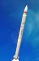
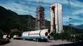

# Smart Dragon
> 2019.07.04 [🚀](../../index/index.md) [despace](index.md) → [LV](lv.md)
> *Navigation:*
> **[FAQ](faq.md)**【**[SCS](scs.md)**·КК, **[SC (OE+SGM)](sc.md)**·КА】**[CON](contact.md)·[Pers](person.md)**·Контакт, **[Ctrl](control.md)**·Упр., **[Doc](doc.md)**·Док., **[Drawing](drawing.md)**·Чертёж, **[EF](ef.md)**·ВВФ, **[Error](error.md)**·Ошибки, **[Event](event.md)**·Событ., **[FS](fs.md)**·ТЭО, **[HF&E](hfe.md)**·Эрго., **[KT](kt.md)**·КТ, **[N&B](nnb.md)**·БНО, **[Project](project.md)**·Проект, **[QM](qm.md)**·БКНР, **[R&D](rnd.md)**·НИОКР, **[SI](si.md)**·СИ, **[Test](test.md)**·ЭО, **[TRL](trl.md)**·УГТ

**Table of contents:**

[TOC]

---

> <small>**Jielong / Smart Dragon** — англоязычный термин, не имеющий аналога в русском языке. **Умный Дракон** — дословный перевод с английского на русский.</small>

**Jielong (Smart Dragon)** — китайская одноразовая твердотопливная ракета‑носитель лёгкого класса.

|*Version*|*Description*|*Activity*|
|:-|:-|:-|
|Smart Dragon 1|Базовый вариант.|**Активен** (2019 ‑  …)|

---

 

## Smart Dragon-1
**Jielong-1 (Smart Dragon-1)** — китайская одноразовая твердотопливная ракета‑носитель лёгкого класса.

|*Characteristic*|*[Value](si.md)*|
|:-|:-|
|Активность|**Активен** (2019.07.15 ‑ …)|
|[Аналоги](analogue.md)|[Electron](electron.md) (США)・ [Shavit](shavit.md) (Израиль)・ [Unha](unha.md) (Корея сев.)|
|Длина/диаметр|19.5 м / 1.2 м|
|[Космодромы](spaceport.md)|[Jiuquan](spaceport.md)|
|Масса старт./сух.|23 100 ㎏ / … ㎏|
|Разраб./изготов.|CASC group (Китай) / CASC group (Китай)|
|Ступени|4|
|[Fuel](ps.md)|[HTPB](ps.md)|
| | |

**Выводимые массы.**

|*Космодром*|*РН*|<small>*Масса,  [НОО](nnb.md), т*</small>|<small>*Масса,  [ГСО](nnb.md), т*</small>|<small>*Масса к  [Луне](moon.md), т*</small>|<small>*Масса к  [Венере](venus.md), т*</small>|<small>*Масса к  [Марсу](mars.md), т*</small>|*Примечания*|
|:-|:-|:-|:-|:-|:-|:-|:-|
|[Jiuquan](spaceport.md)|Smart Dragon-1|0.25|…|…|…|…|Пуск — $ … млн (… г);  ПН 1.08 % от ст.массы;  На [ССО](nnb.md) — 150 кг|

<small>Примечания:  **1)** Указана масса для наихудших условий старта.  **2)** В скобках указана масса для наилучших условий старта.</small>

 

## Архивные

…

 

## Docs & links (TRANSLATEME ALREADY)
|*Sections & pages*|
|:-|
|**【】**  <mark>NOCAT</mark>|

   1. Docs: …
   1. <https://space.skyrocket.de/doc_lau/jielong-1.htm>
