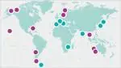
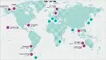

# SSC GGSN
> 2019.05.12 [🚀](../../index/index.md) [despace](index.md) → [Swedish Space Corporation](swedish_sc.md), **[НС](scs.md)**  
> *Navigation:*  
> **[FAQ](faq.md)**【**[SCS](scs.md)**·КК, **[SC (OE+SGM)](sc.md)**·КА】**[CON](contact.md)·[Pers](person.md)**·Контакт, **[Ctrl](control.md)**·Упр., **[Doc](doc.md)**·Док., **[Drawing](drawing.md)**·Чертёж, **[EF](ef.md)**·ВВФ, **[Error](error.md)**·Ошибки, **[Event](event.md)**·Событ., **[FS](fs.md)**·ТЭО, **[HF&E](hfe.md)**·Эрго., **[KT](kt.md)**·КТ, **[N&B](nnb.md)**·БНО, **[Project](project.md)**·Проект, **[QM](qm.md)**·БКНР, **[R&D](rnd.md)**·НИОКР, **[SI](si.md)**·СИ, **[Test](test.md)**·ЭО, **[TRL](trl.md)**·УГТ

**Table of contents:**

[TOC]

---

> <small>**Swedish Space Corporation’s Global Ground Station Network (SSC GGSN)** — англоязычный термин, не имеющий аналога в русском языке. **Глобальная сеть наземных станций Шведской Космической Корпорации (SSC GGSN)** — дословный перевод с английского на русский.</small>

**Swedish Space Corporation’s Global Ground Station Network (SSC GGSN)** — глобальная сеть НС [Swedish Space Corporation](swedish_sc.md).

|*Расположение станций*|*И с указанием диапазона*|
|:-|:-|
|||

Основные станции:

   - **Clewiston.** USA, Florida, Clewiston, 26°44' N, 81°02' W. [Bands](comms.md): **S** (♁↗), **dual X** (🚀↘).
   - **Dongara.** Australia, Dongara, 29° 03' S, 115°21' E. [Bands](comms.md): **S** (♁↗ 🚀↘), **X** (♁↗ 🚀↘), **Ku** (♁↗ 🚀↘), **Ka** (♁↗ 🚀↘).
   - **Esrange.** Sweden, Kiruna, 67° 53' N, 21° 04' E. [Bands](comms.md): **UHF** (🚀↘), **S** (♁↗ 🚀↘), **X** (🚀↘).
   - **Inuvik.** Canada, Inuvik, 68° 24' N, 133° 30' W. [Bands](comms.md): **S** (♁↗ 🚀↘), **X** (♁↗ 🚀↘).
   - **North Pole.** USA, Alaska, North Pole, 64° 48' N, 147° 39' W. [Bands](comms.md): **S** (♁↗ 🚀↘), **X** (🚀↘).
   - **Punta Arenas.** Chile, Punta Arenas, 52°56' S, 70°51' W. [Bands](comms.md): **S** (♁↗ 🚀↘), **X** (♁↗ 🚀↘).
   - **Santiago.** Chile, Santiago de Chile, 33° 08' S, 70° 40' W. [Bands](comms.md): **S** (♁↗ 🚀↘), **C** (♁↗ 🚀↘), **Ka** (♁↗ 🚀↘).
   - **Siracha.** Thailand, Siracha, 13° 6' N, 100° 55' E. [Bands](comms.md): **S** (♁↗ 🚀↘), **X** (🚀↘).
   - **South Point.** USA, Hawaii, South Point, 19°1' N, 155°40' W. [Bands](comms.md): **S** (♁↗ 🚀↘), **X** (♁↗ 🚀↘), **Ku** (♁↗ 🚀↘).
   - **Yatharagga.** Australia, Dongara, 29° 05' S, 115°35' E. [Bands](comms.md): **S** (♁↗ 🚀↘), **X** (🚀↘), **Ka** (🚀↘).

Станции с кооперацией:

   - O'Higgins, Antarctica
   - Fucino, Italy
   - Weilheim, Germany
   - Madrid, Spain
   - Hartebesthook, South Africa
   - Bengaluru, India
   - Hokkaido, Japan
   - Okinawa, Japan

## Docs & links (TRANSLATEME ALREADY)
|*Sections & pages*|
|:-|
|**`Наземная станция (НС):`**  …    [CDSN](cdsn.md)・ [DSN](dsn.md)・ [ESTRACK](estrack.md)・ [IDSN](idsn.md)・ [SSC_GGSN](ssc_ggsn.md)・ [UDSC](udsc.md)|

   1. Docs: …
   1. <https://www.sscspace.com/ssc-worldwide/ground-station-network/>
