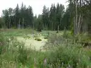
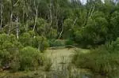

# Болото
> 2019.05.12 [🚀](../../index/index.md) [despace](index.md) → [Contact](contact.md), [Control](control.md), [Экология](ecology.md)
> *Navigation:*
> **[FAQ](faq.md)**【**[SCS](scs.md)**·КК, **[SC (OE+SGM)](sc.md)**·КА】**[CON](contact.md)·[Pers](person.md)**·Контакт, **[Ctrl](control.md)**·Упр., **[Doc](doc.md)**·Док., **[Drawing](drawing.md)**·Чертёж, **[EF](ef.md)**·ВВФ, **[Error](error.md)**·Ошибки, **[Event](event.md)**·Событ., **[FS](fs.md)**·ТЭО, **[HF&E](hfe.md)**·Эрго., **[KT](kt.md)**·КТ, **[N&B](nnb.md)**·БНО, **[Project](project.md)**·Проект, **[QM](qm.md)**·БКНР, **[R&D](rnd.md)**·НИОКР, **[SI](si.md)**·СИ, **[Test](test.md)**·ЭО, **[TRL](trl.md)**·УГТ

**Table of contents:**

[TOC]

---

> <small>**Болото** — русскоязычный термин. **Swamp** — англоязычный эквивалент.</small>

**Боло́то** — участок ландшафта, характеризующийся избыточным увлажнением, влаголюбивым живым напочвенным покровом. Для болота характерно отложение на поверхности почвы неполностью разложившегося органического вещества, превращающегося в дальнейшем в торф.

## Описание
В России распространены на севере и в центре Европейской части (в том числе в районе Москвы и Подмосковья), в Западной Сибири, на Камчатке.

Болота возникают двумя основными путями: из‑за заболачивания почвы или же из‑за зарастания водоёмов.

|Болото на Валдае близ озера Селигер|Болото на южной окраине Санкт‑Петербурга (бассейн Невы)|[РКС](contact/rss.md)|
|:-|:-|:-|
||||

## В ноосфере
В ноосфере болото склонно к образованию при любом из следующих условий:

   - в государственных [предприятиях](contact.md), институтах и университетах;
   - при большом количестве [управленцев](manager.md) в организации;
   - при нечётком [разграничении обязанностей](orgstruct.md) в организации;
   - при завязывании вопросов на [конкретных персонах](sw_sys.md).

Результатом образования болота в организации являются:

   1. увеличенное время рассмотрения и согласования документации;
   1. потеря документации;
   1. несвоевременное выполнение работ;
   1. увеличение количества живности.

 

## Docs & links (TRANSLATEME ALREADY)
|*Sections & pages*|
|:-|
|**【[Control](Control.md)】**  [Ad hoc](ad_hoc.md)・ [Business travel](business_travel.md)・ [Chief designers council](cocd.md)・ [CML](cml.md)・ [Competence](competence.md)・ [Confident](confident.md)・ [Consp.theory](consp_theory.md)・ [Control sys. (CS)](cs.md)・ [Coordinate system](coord_sys.md)・ [Curator](curator.md)・ [Designer’s supervision](des_spv.md)・ [E‑sig](esig.md)・ [Engineer](se.md)・ [Errand](errand.md)・ [Federal law](fed_law.md)・ [Federal TP](fed_tp.md)・ [Federal SP](fed_sp.md)・ [GNC](gnc.md)・ [Gravity assist](gravass.md)・ [Industrial archaeology](ind_arch.md)・ [Instruction](instruction.md)・ [Lean manuf.](lean_man.md)・ [Lifetime](lifetime.md)・ [Manager](manager.md)・ [MBSE](se.md)・ [Meeting](meeting.md)・ [MCC](scs.md)・ [MIC](mic.md)・ [MML](mml.md)・ [MoU](contract.md)・ [Nav. & ballistics (NB)](nnb.md)・ [Nonprofit org.](nonprof_org.md)・ [NX](nx.md)・ [Oberth effect](oberth_eff.md)・ [Org.structure](orgstruct.md)・ [Outcomes commission](outccom.md)・ [Patent](patent.md)・ [Peter prin.](peter_principle.md)・ [Plan](plan.md)・ [PMBok](pmbok.md)・ [Quorum](quorum.md)・ [R&D management](mgmt.md)・ [R&D support](rnd_support.md)・ [Recursion](recurs.md)・ [Schulze_method](schulze_method.md)・ [Sci'N'Tech activities](st_act.md)・ [Sci'N'Tech council](satc.md)・ [Single-window system](sw_sys.md)・ [Situ.leadership](situ_leadership.md)・ [Skunk works](se.md)・ [State arm. plan](plan_sa.md)・ [Swamp](swamp.md)・ [Teamcenter](teamcenter.md)・ [Tennis racket theorem](tr_theorem.md)・ [TRIZ](triz.md)・ [TRL](trl.md)・ [V‑model](v_model.md)・ [Veto](veto.md)・ [Workflow](workflow.md)・ [Workgroup](wg.md)|

   1. Docs: …
   1. <https://ru.wikipedia.org/wiki/Болото>
   1. <https://ru.wikipedia.org/wiki/Ноосфера>
   1. <http://lurkmore.to/Армейский_способ>
   1. <https://masterok.livejournal.com/2667699.html>
