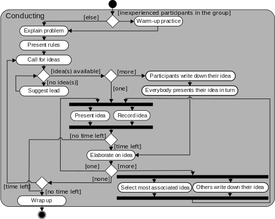
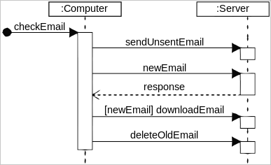
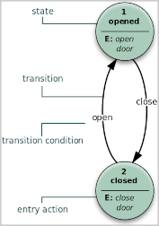
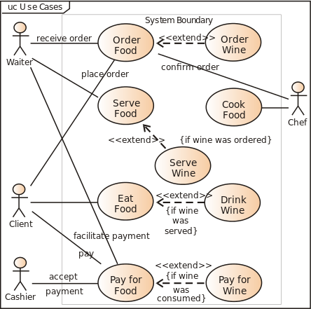

# SysML
> 2021.02.04 [🚀](../../index/index.md) [despace](index.md) → [SE](se.md), [Soft](soft.md)
> *Navigation:*
> **[FAQ](faq.md)**【**[SCS](scs.md)**·КК, **[SC (OE+SGM)](sc.md)**·КА】**[CON](contact.md)·[Pers](person.md)**·Контакт, **[Ctrl](control.md)**·Упр., **[Doc](doc.md)**·Док., **[Drawing](drawing.md)**·Чертёж, **[EF](ef.md)**·ВВФ, **[Error](error.md)**·Ошибки, **[Event](event.md)**·Событ., **[FS](fs.md)**·ТЭО, **[HF&E](hfe.md)**·Эрго., **[KT](kt.md)**·КТ, **[N&B](nnb.md)**·БНО, **[Project](project.md)**·Проект, **[QM](qm.md)**·БКНР, **[R&D](rnd.md)**·НИОКР, **[SI](si.md)**·СИ, **[Test](test.md)**·ЭО, **[TRL](trl.md)**·УГТ

**Table of contents:**

[TOC]

---

> <small>**The Systems Modeling Language (SysML)** — EN term. **Язык моделирования систем** — RU analogue.</small>

The **Systems Modeling Language (SysML)** is a general‑purpose open source modeling language for systems engineering applications & an enabling technology for [MBSE](se.md) (de facto standard). It supports the specification, analysis, design, [V&V](vnv.md) of systems & systems‑of‑systems. Originated in 2001 by decision by the [INCOSE](contact/incose.md) Model Driven Systems Design workgroup to customize the **Unified Modeling Language (UML)** for systems engineering applications; is defined as an extension of a subset of the UML using UML’s profile mechanism; offers several improvements, which tends to be software‑centric:

   - SysML’s semantics are more flexible & expressive. SysML reduces UML’s software‑centric restrictions, reuses 7/14 of UML diagrams, & adds 2 diagrams (requirement — for requirements engineering, & parametric — for performance & quantitative analysis) for a total of 9 diagram types. Consequent to these enhancements, SysML is able to model a wide range of systems, which may include hardware, software, information, processes, personnel, & facilities.  ➊ Activity diagram, ➋ Block definition diagram, ➌ Internal block diagram, ➍ Package diagram, ➎ Parametric diagram, ➏ Requirement diagram, ➐ State machine diagram, ➑ Sequence diagram, ➒ Use case diagram
   - SysML is a small language that is easier to learn & apply. Since SysML removes many of UML’s software‑centric constructs, the overall language is smaller both in diagram types & total constructs.
   - SysML allocation tables support common kinds of allocations. While UML provides limited support for tabular notations, SysML furnishes flexible allocation tables that support requirements, functional & structural allocations — this facilitates automated V&V & gap analysis.
   - SysML model management constructs support models, views, & viewpoints. They extend UML’s capabilities & are architecturally aligned with IEEE‑Std‑1471‑2000 (IEEE Recommended Practice for Architectural Description of Software Intensive Systems).
   - Example (modeling an automotive system): with SysML one can use Requirement diagrams to efficiently capture functional, performance, & interface requirements, whereas with UML one is subject to the limitations of use case diagrams to define high‑level functional requirements. Likewise, with SysML one can use Parametric diagrams to precisely define performance & quantitative constraints like max acceleration, min curb weight, & air conditioning capacity. UML provides no straightforward mechanism to capture this sort of essential performance & quantitative info. As for the rest of the automotive system, activity & state machine diagrams can be used to specify the embedded software control logic & information flows for the on‑board automotive computers. Other SysML diagrams can be used to model factories that build the automobiles, as well as the interfaces between the organizations that work in the factories.

**OMG SysML.** SysML Merge Team was adopted by OMG 2006.07 as an open source [OMG SysML ⎆](https://www.omgsysml.org/). The current v.1.6 issued 2019.12 (ISO/IEC 19514:2017 “Information technology — Object management group systems modeling language”). OMG issued a Request for Proposals (RFP) for v.2 in 2017, that will incorporate enhancements from experience applying SysML, enhance the interoperability of MBSE tools, & will include a UML profile, metamodel, & mapping between them.

**SysML in MBSE.** Several SysML usage modes of progressive rigor:

   1. **SysML‑as‑Pretty‑Pictures 【Least rigorous & most common usage mode】** — here SysML notation is used in lieu of ad hoc modeling notation (e.g., Visio or PowerPoint drawings), but little attention is paid to SysML wellformedness & its underlying simulatable & executable semantics. Consequently, the SysML models generated in current mode are rarely capable of driving dynamic simulations or precisely specifying system architecture blueprints.
   1. **SysML‑as‑Model‑Simulation** — improvement of №1 — it emphasizes the simulation of system dynamic behavior & system parametric constraints. In current mode some of SysML behavioral diagrams (Activity, Sequence, State Machine) are exercised by a behavioral simulation engine. Also, some of the Parametric diagram constraints may also be exercised by a constraint propagation engine (MATLAB/Simulink, OpenModelica, SysML tool proprietary plugin, etc.). This’s an intermediate SysML usage mode for those who seek to escape from №1 language abuse.
   1. **SysML‑as‑System‑Architecture‑Blueprint** — improvement of №2 — additionally includes the precise & complete specification of a **System Architecture Model (SAM)**. The purpose of the SAM is to be sufficiently precise & complete to serve as the “system architecture truth” for all engineering processes, incl. systems engineers (SEs), software ones (SWEs), electrical ones (EEs), mechanical ones (MEs), etc. In order for the SAM to serve as system architecture truth for a SE project the SAM must satisfy 5 C's of system architecture [quality](qm.md) (Correct, Complete, Clear, Concise, Consistent).
   1. **SysML‑as‑Executable‑System‑Architecture 【Most rigorous & rarest usage mode】** — improvement of №3 — it extends the №3 to make majority of SAM behavioral & parametric specifications simulatable, & potentially executable. Executable in MBSE generally refers to the automated generation of system interfaces, system test cases.

**Software:** (open source, of course; [here is ⎆](https://en.wikipedia.org/wiki/List_of_SysML_tools) a long list)

   - [Eclipse Capella ⎆](https://www.eclipse.org/capella/)
   - [Eclipse Papyrus ⎆](https://www.eclipse.org/papyrus/)
   - [Gaphor ⎆](https://github.com/gaphor/gaphor)
   - [Modelio ⎆](https://www.modelio.org/)

 

## Diagrams

### Activity diagram
**Activity diagrams** are graphical representations of workflows of stepwise activities & actions with support for choice, iteration & concurrency. In the Unified Modeling Language, activity diagrams are intended to model both computational & organizational processes (i.e., workflows), as well as the data flows intersecting with the related activities. Although activity diagrams primarily show the overall flow of control, they can also include elements showing the flow of data between activities through one or more data stores.

**Construction.**  
Activity diagrams are constructed from a limited number of shapes, connected with arrows. The most important shape types:

   - ellipses represent actions;
   - diamonds represent decisions;
   - bars represent the start (split) or end (join) of concurrent activities;
   - a black circle represents the start (initial node) of the workflow;
   - an encircled black circle represents the end (final node).

Arrows run from the start towards the end & represent the order in which activities happen. Activity diagrams can be regarded as a form of a structured flowchart combined with a traditional data flow diagram. Typical flowchart techniques lack constructs for expressing concurrency. However, the join & split symbols in activity diagrams only resolve this for simple cases; the meaning of the model is not clear when they are arbitrarily combined with decisions or loops. While in UML 1.x, activity diagrams were a specialized form of state diagrams, in UML 2.x, the activity diagrams were reformalized to be based on Petri net‑like semantics, increasing the scope of situations that can be modeled using activity diagrams. These changes cause many UML 1.x activity diagrams to be interpreted differently in UML 2.x. UML activity diagrams in v.2.x can be used in various domains, e.g. in design of embedded systems. It is possible to verify such a specification using model checking technique.

 

### Package diagram
A **package diagram** in the UML depicts the dependencies between the packages that make up a model. In addition to the standard UML Dependency relationship, there are 2 special types of dependencies defined between packages:

   1. A **package import** is “a relationship between an importing namespace & a package, indicating that the importing namespace adds the names of the members of the package to its own namespace”. By default, an unlabeled dependency between two packages is interpreted as a package import relationship. In this relationship, elements within the target package will be imported into the source package.
   1. A **package merge** is “a directed relationship between two packages, that indicates that the contents of the two packages are to be combined. It is very similar to Generalisation in the sense that the source element conceptually adds the characteristics of the target element to its own characteristics resulting in an element that combines the characteristics of both” In this relationship, if an element exists within both the source package & the target package, then the source element’s definition will be expanded to include the target element’s definition.

**Elements:**

   1. **Package** — a general purpose mechanism for organising model elements & diagrams into groups. It provides an encapsulated namespace within which all the names must be unique. It is used to group semantically related elements. It is a namespace as well as an element that can be contained in other packages’ namespaces.
   1. **Class** — a representation of an object that reflects its structure & behavior within the system. It is a template from which running instances are created. Classes usually describe the logical structure of the system.
   1. **Interface** — a specification of behavior. An implementation class must be written to support the behavior of an interface class.
   1. **Object** — an instance of a class. It is often used in analysis to represent an artifact or other item.
   1. **Table** — a stereotyped class.

**Usage.**

   - Package diagrams can use packages containing use cases to illustrate the functionality of a software system.
   - Package diagrams can use packages that represent the different layers of a software system to illustrate the layered architecture of a software system. The dependencies between these packages can be adorned with labels / stereotypes to indicate the communication mechanism between the layers.
   - **When to use:**
      1. It is used in large scale systems to picture dependencies between major elements in the system
      1. Package diagrams represent a compile time grouping mechanism.

 

### Requirement diagram
A **requirement diagram** is a diagram specially used in SysML in which requirements & the relations between them & their relationship to other model elements are shown as discussed in the following paragraphs.

   - **Derive requirement relationship.** If a requirement is derived from another requirement, their relation is named “derive requirement relationship”.
   - **Namespace containment.** If a requirement is contained in another requirement, their relation is named “namespace containment”.
   - **Satisfy relationship.** If a requirement is satisfied by a design element, their relation is named “satisfy relationship”.
   - **Copy relationship.** If a requirement is a copy of another requirement, their relation is named “copy relationship”.
   - **Verify relationship.** If there exists a relation between a requirement & a test case verifying this requirement, their relation is named “verify relationship”.
   - **Test case.** A test case is defined by a flow checking whether the system under consideration satisfies a requirement.
   - **Refine relationship.** If a requirement is refined by other requirements / model elements, the relation is named “refine relationship”.
   - **Trace relationship.** If there exists a relation between a requirement & an arbitrary model element traced by this requirement, their relation is named “trace relationship”.

 

### Sequence diagram
A **sequence diagram** shows object interactions arranged in time sequence. It depicts the objects involved in the scenario & the sequence of messages exchanged between the objects needed to carry out the functionality of the scenario. Sequence diagrams are typically associated with use case realizations in the Logical View of the system under development. Sequence diagrams are sometimes called event diagrams or event scenarios.  
A sequence diagram shows, as parallel vertical lines (lifelines), different processes or objects that live simultaneously, and, as horizontal arrows, the messages exchanged between them, in the order in which they occur. This allows the specification of simple runtime scenarios in a graphical manner.

**Diagram building blocks.**  
If the lifeline is that of an object, it demonstrates a role. Leaving the instance name blank can represent anonymous & unnamed instances.  
Messages, written with horizontal arrows with the message name written above them, display interaction. Solid arrow heads represent synchronous calls, open arrow heads represent asynchronous messages, & dashed lines represent reply messages. If a caller sends a synchronous message, it must wait until the message is done, such as invoking a subroutine. If a caller sends an asynchronous message, it can continue processing & doesn’t have to wait for a response. Asynchronous calls are present in multithreaded applications, event‑driven applications & in message‑oriented middleware. Activation boxes, or method‑call boxes, are opaque rectangles drawn on top of lifelines to represent that processes are being performed in response to the message (ExecutionSpecifications in UML).  
Objects calling methods on themselves use messages & add new activation boxes on top of any others to indicate a further level of processing. If an object is destroyed (removed from memory), an X is drawn on bottom of the lifeline, & the dashed line ceases to be drawn below it. It should be the result of a message, either from the object itself, or another.  
A message sent from outside the diagram can be represented by a message originating from a filled‑in circle (found message in UML) or from a border of the sequence diagram (gate in UML).  
UML has introduced significant improvements to the capabilities of sequence diagrams. Most of these improvements are based on the idea of interaction fragments which represent smaller pieces of an enclosing interaction. Multiple interaction fragments are combined to create a variety of combined fragments, which are then used to model interactions that include parallelism, conditional branches, optional interactions.

 

### State diagram

A **state diagram** is a type of diagram used in computer science & related fields to describe the behavior of systems. State diagrams require that the system described is composed of a finite number of states; sometimes, this is indeed the case, while at other times this is a reasonable abstraction. Many forms of state diagrams exist, which differ slightly & have different semantics.

State diagrams are used to give an abstract description of the behavior of a system. This behavior is analyzed & represented by a series of events that can occur in one or more possible states. Hereby “each diagram usually represents objects of a single class & track the different states of its objects through the system”.

State diagrams can be used to graphically represent finite‑state machines (also called finite automata). This was introduced by Claude Shannon & Warren Weaver in their 1949 book The Mathematical Theory of Communication. Another source is Taylor Booth in his 1967 book Sequential Machines & Automata Theory. Another possible representation is the state‑transition table.

 

### Use case diagram
A **use case diagram** at its simplest is a representation of a user’s interaction with the system that shows the relationship between the user & the different use cases in which the user is involved. A use case diagram can identify the different types of users of a system & the different use cases & will often be accompanied by other types of diagrams as well. The use cases are represented by either circles or ellipses.

**Application.**  
While a use case itself might drill into a lot of detail about every possibility, a use‑case diagram can help provide a higher‑level view of the system. It has been said before that “Use case diagrams are the blueprints for your system”.  
Due to their simplistic nature, use case diagrams can be a good communication tool for stakeholders. The drawings attempt to mimic the real world & provide a view for the stakeholder to understand how the system is going to be designed. Siau & Lee conducted research to determine if there was a valid situation for use case diagrams at all or if they were unnecessary. What was found was that the use case diagrams conveyed the intent of the system in a more simplified manner to stakeholders & that they were “interpreted more completely than class diagrams”.  
The purpose of use case diagram is to capture the dynamic aspect of a system. Additional diagrams & documentation can be used to provide a complete functional & technical view of the system.They provide the simplified & graphical representation of what the system must actually do.

 

## (RU) SysML
**SysML** *(англ. The Systems Modeling Language, язык моделирования систем)* — предметно‑ориентированный язык моделирования систем. Поддерживает определение, анализ, проектирование, проверку и подтверждение соответствия широкого спектра систем. SysML изначально разрабатывался в рамках проекта спецификации с открытым исходным кодом, и имеет открытую лицензию для распространения и использования. Как язык, SysML является расширением части языка UML. По сравнению с UML, ориентированным на моделирование программных продуктов, SysML предоставляет системному инженеру дополнительные возможности:

   - Большая гибкость и выразительность. SysML убирает программно‑ориентированные ограничения UML за счёт введения двух дополнительных типов диаграмм: диаграммы требований и параметрической диаграммы. Первая служит для сбора требований, а вторая — для количественного анализа и анализа производительности. В результате становится возможным моделирование широкого спектра систем, которые могут включать оборудование, ПО, информацию, процессы, персонал и площади.
   - SysML более компактный язык, его легче изучать и применять, так как он избавлен от многих программно‑ориентированных особенностей UML.
   - Конструкции языка для управления моделью поддерживают модели, представления (англ. views), и точки зрения (англ. viewpoints) (используются для создания представлений). Эти конструкции расширяют возможности UML и архитектурно стоят в одном ряду с IEEE‑Std‑1471‑2000 (Рекомендованная IEEE практика для архитектурного описания программно‑нагруженных систем) англ. (IEEE Recommended Practice for Architectural Description of Software Intensive Systems).

**UML** *(англ. Unified Modeling Language — унифицированный язык моделирования)* — язык графического описания для объектного моделирования при разработке ПО, моделирования бизнес‑процессов, системного проектирования и отображения организационных структур. UML — язык широкого профиля, открытый стандарт, использующий графические обозначения для создания абстрактной модели системы, называемой UML‑моделью. UML был создан для определения, визуализации, проектирования и документирования, в основном, программных систем. UML не является языком программирования, но на основании UML‑моделей возможна генерация кода.

 

## Docs & links
|*Sections & pages*|
|:-|
|**【[Systems engineering](se.md)】**  [Competence](competence.md)・ [Coordinate system](coord_sys.md)・ [Designer’s supervision](des_spv.md)・ [Industrial archaeology](ind_arch.md)・ [Instruction](instruction.md)・ [Lean manuf.](lean_man.md)・ [Lifetime](lifetime.md)・ [MBSE](se.md)・ [MML](mml.md)・ [Nav. & ballistics (NB)](nnb.md)・ [NASA SEH](book_nasa_seh.md)・ [Oberth effect](oberth_eff.md)・ [PMBok](pmbok.md)・ [Quorum](quorum.md)・ [R&D management](mgmt.md)・ [R&D support](rnd_support.md)・ [Recursion](recurs.md)・ [Schulze_method](schulze_method.md)・ [Sci'N'Tech activities](st_act.md)・ [Sci'N'Tech council](satc.md)・ [Skunk works](se.md)・ [SysML](sysml.md)・ [Tennis racket theorem](tr_theorem.md)・ [TRIZ](triz.md)・ [TRL](trl.md)・ [V‑model](v_model.md)・ [Workflow](workflow.md)・ [Workgroup](wg.md)|
|**【[Software](soft.md)】**  [ASP](asp.md)・ [Blender](blender.md)・ [C](plang.md)・ [Cosmographia](cosmographia.md)・ [DOORS](doors.md)・ [DWG](cad_f.md)・ [GIMP](gimp.md)・ [Git](git.md)・ [IGES](cad_f.md)・ [ISIS](isis.md)・ [JT](cad_f.md)・ [NGT](neogeography_toolkit.md)・ [NX](nx.md)・ [Octave](gnu_octave.md)・ [OS](os.md)・ [PDF](pdf.md)・ [Python](plang.md)・ [R](plang.md)・ [SPICE](spice.md)・ [STEP](cad_f.md)・ [STL](stk.md)・ [SVG](cad_f.md)・ [Syncthing](syncthing.md)・ [SysML](sysml.md)・ [Teamcenter](teamcenter.md)・ [Система управления версиями](vcs.md)・ [ХРИП](adra.md)|

   1. Docs: [System Modelling Language explained ❐](f/se/sysml_explained_finance.pdf)
   1. <https://en.wikipedia.org/wiki/Systems_Modeling_Language>
   1. <http://www.sysml.org/> — Открытые спецификации SysML, ЧаВО, списки рассылки, и открытые лицензии
   1. <http://www.omgsysml.org/> — Спецификации OMG SysML, учебные пособия по SysML, статьи, и информацию о поставщиках инструментария
   1. <http://www.softwarestencils.com/sysml/index.html> — SysML 1.0 образцы и шаблоны для MS Visio
