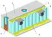
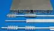

# Тепловая сотопанель
> 2019.05.12 [🚀](../../index/index.md) [despace](index.md) → [SGM](sc.md), [СОТР](tcs.md)  
> *Navigation:*  
> **[FAQ](faq.md)**【**[SCS](scs.md)**·КК, **[SC (OE+SGM)](sc.md)**·КА】**[CON](contact.md)·[Pers](person.md)**·Контакт, **[Ctrl](control.md)**·Упр., **[Doc](doc.md)**·Док., **[Drawing](drawing.md)**·Чертёж, **[EF](ef.md)**·ВВФ, **[Error](error.md)**·Ошибки, **[Event](event.md)**·Событ., **[FS](fs.md)**·ТЭО, **[HF&E](hfe.md)**·Эрго., **[KT](kt.md)**·КТ, **[N&B](nnb.md)**·БНО, **[Project](project.md)**·Проект, **[QM](qm.md)**·БКНР, **[R&D](rnd.md)**·НИОКР, **[SI](si.md)**·СИ, **[Test](test.md)**·ЭО, **[TRL](trl.md)**·УГТ

**Table of contents:**

[TOC]

---

> <small>**Тепловая сотопанель (ТСП)** — русскоязычный термин. **Thermal sandwich panel (TSP)** — англоязычный эквивалент.</small>

**Тепловая сотопанель (ТСП)** (иногда *термостабилизированная сотопанель*, что неверно) — элемент конструкции и средств обеспечения теплового режима космического аппарата.

Тепловая сотопанель (далее ТСП) предназначена для:

   1. крепления на неё аппаратуры;
   1. создания плоских конструктивных элементов;
   1. прокладки [тепловых труб](hp.md).

Основные особенности ТСП по сравнению с листовыми материалами и ферменными конструкциями:

   1. лёгкость;
   1. низкая теплопроводность;
   1. возможность установки разнообразных закладных элементов.

## Строение ТСП
| | |
|:-|:-|
||ТСП в разрезе:  1 — обшивка;  2 — плёночный клей (например, ВК-41);  3 — [тепловая труба](hp.md);  4 — сотопласт (например, фольга АМг 2-Н-0.03);  5 — самовспенивающийся клей;  6 — закладной элемент.|
||Общий вид ТСП с тепловыми трубами.|

 

## Docs & links (TRANSLATEME ALREADY)
|*Sections & pages*|
|:-|
|**【[Structures, gears, materials (SGM)](sc.md)】**  [Гермоконтейнер](гермоконтейнер.md)・ [Датчик](sensor.md)・ [Задел](margin.md)・ [Изделие](unit.md)・ [Испарение материалов](matc.md)・ [Кавитация](cavitation.md)・ [КЗУ](cinu.md) (ВБУ КТ)・ [КХГ](cgs.md)・ [Контейнеры для транспортировки](ship_contain.md)・ [Крейцкопф](crosshead.md)・ [Номинал](nominal.md)・ [ПУС](lag.md)・ [ПНА, ПОНА, ПСНА](devd.md)・ [Резерв](reserve.md)・ [Слайс](слайс.md)・ [ТСП](tsp.md)・ [Типичные формы КА](sc.md)・ [Толкатель](толкатель.md)・ [Унификация](commonality.md)|
|**【Thermal control system (TCS)】**  [Thermal characteristics](thermal_chars.md)・ [Гермоконтейнер](гермоконтейнер.md)・ [Насосы для СОТР](сотр_насос.md)・ [Покрытия для СОТР](сотр_покрытия.md)・ [Радиатор](радиатор.md)・ [РИТ (РИТЭГ)](rtg.md)・ [Стандартные условия](sctp.md)・ [Тепловая труба](hp.md)・ [ТЗП](hs.md)・ [Тепловой аккумулятор](heat_bank.md)・ [ТСП](tsp.md)・ [Шторка](thermal_curtain.md)・ [ЭВТИ](mli.md)|

   1. Docs: …
   1. <http://www.lab-hp.kiev.ua/sotopaneli.shtml>
