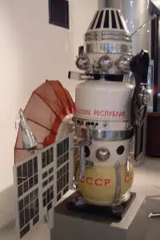

# Venera 5, 6
> 2019.12.10 [🚀](../../index/index.md) [despace](index.md) → [Venus](venus.md), **[Project](project.md)**  
> *Navigation:*  
> **[FAQ](faq.md)**【**[SCS](scs.md)**·КК, **[SC (OE+SGM)](sc.md)**·КА】**[CON](contact.md)·[Pers](person.md)**·Контакт, **[Ctrl](control.md)**·Упр., **[Doc](doc.md)**·Док., **[Drawing](drawing.md)**·Чертёж, **[EF](ef.md)**·ВВФ, **[Error](error.md)**·Ошибки, **[Event](event.md)**·Событ., **[FS](fs.md)**·ТЭО, **[HF&E](hfe.md)**·Эрго., **[KT](kt.md)**·КТ, **[N&B](nnb.md)**·БНО, **[Project](project.md)**·Проект, **[QM](qm.md)**·БКНР, **[R&D](rnd.md)**·НИОКР, **[SI](si.md)**·СИ, **[Test](test.md)**·ЭО, **[TRL](trl.md)**·УГТ

**Table of contents:**

[TOC]

---

> <small>**Венера‑5** — RU term w/o analogues in English. **Venera 5** — English equivalent.</small>  
> <small>**Венера‑6** — RU term w/o analogues in English. **Venera 6** — English equivalent.</small>

**Venera 5** (**Венера‑5**) and **Venera 6** (**Венера‑6**)  were spacecraft in the Soviet Venera program for the exploration of Venus. During the descent from 55 to 18 ㎞, the lander took measurements of temperature (from 25 to 320 ℃), pressure (from 0.5 to 27 atm), illumination and chemical composition of the planet’s atmosphere, which was 97 % CO₂, 2 % N₂, O₂<1 %, and traces of water vapor were found.

 

|*Type*|*[Param.](si.md)*|
|:-|:-|
|**【Mission】**|• • •|
|Cost|… or … ㎏ of [gold](sc_price.md)|
|Development|…|
|Duration|**Venera 5:** Travel: 131 days; Atmosphere: 53 minutes  **Venera 6:** Travel: 127 days, Atmosphere: 51 minutes|
|Launch|**Venera 5:** January 5, 1969, 06:28:08 UTC Rocket: Molniya 8K78M  **Venera 6:** January 10, 1969, 05:51:52 UTC Rocket: Molniya 8K78M|
|Operator|Lavochkin|
|Programme|Venera programme|
|Similar to|・Proposed: [Vega 1 and 2](vega_1_2.md)  ・Current: …   ・Past: [Venera 4](venera_4.md)|
|Target|Exploring the planet Venus, studying Venus from inside the atmosphere and on the surface|
|[Type](sc.md)|Atmospheric spacecraft|
|**【Spacecraft】**|• • •|
|Comms|2 m parabolic HGA (decimeter range)|
|Composition|Lander, orbiter|
|Contractor|…|
|[ID](spaceid.md)|**Venera 5:** NSSDC ID (COSPAR ID): [1969-001A ⎆](https://nssdc.gsfc.nasa.gov/nmc/spacecraft/display.action?:id=1969-001A), SCN: 3642  **Venera 6:** NSSDC ID (COSPAR ID): [1969-002A ⎆](https://nssdc.gsfc.nasa.gov/nmc/spacecraft/display.action?:id=1969-002A), SCN: 3648|
|Manufacturer|Lavochkin|
|Mass|SC 1 130 ㎏, Lander dry 410 ㎏ ([large satellite](sc.md), [EVN‑073](venus.md))|
|Orbit / Site|**Venera 5:** Heliocentric 0.72 × 0.98 AU; T = 286 days  **Venera 6:** Heliocentric 0.71 × 0.98 AU; T = 285 days|
|Payload|**Spacecraft:** Instrument to study the flows of cosmic particles, to determine the distribution of oxygen and hydrogen in the planet’s atmosphere  **Lander:** Equipment for Making Atmospheric Measurements|
|Power|…|

Achieved targets & investigations:

   - **T** — technical; **C** — contact research; **D** — distant research; **F** — fly‑by; **H** — manned; **S** — soil sample return; **X** — technology demonstration
   - **Sections of measurement and observation:**
      - Atmospheric/climate — **Ac** composition, **Ai** imaging, **Am** mapping, **Ap** pressure, **As** samples, **At** temperature, **Aw** wind speed/direction.
      - General — **Gi** planet’s interactions with outer space.
      - Soil/surface — **Sc** composition, **Si** imaging, **Sm** mapping, **Ss** samples.

<small>

|*EVN‑XXX*|*T*|*EN*|*Section of m&o*|*D*|*C*|*F*|*H*|*S*|
|:-|:-|:-|:-|:-|:-|:-|:-|:-|
|EVN‑001| |Atmosphere: preliminary model.| |D|C|F| | |
|EVN‑003|T|Exploration: from inside of atmosphere.| |D|C| | | |
|EVN‑008| |Atmosphere: nightglows.| |D| | | | |
|EVN‑012| |Atmosphere: lightnings.| |D| | | | |
|EVN‑013| |Atmosphere: illumination of the surface & the atmo layers.| |D| | | | |
|EVN‑014| |Atmosphere: composition.| |D| | |F| |
|EVN‑073|T|Exploration with [satellites](sc.md): large satellites.| |D| |F| | |
|EVN‑077| |Atmosphere: chemical elements distribution.| |D| |F| | |
|EVN‑092|T|Serve as a relay to Earth for stand‑alone SC/instruments.| |D| | | | |
|EVN‑097| |Atmosphere: effect of solar Rad & interplanetary space on the atmo.| |D| |F| | |

</small>

 

## Mission
Venera 5 and Venera 6 were launched towards Venus to obtain atmospheric data. The spacecrafts were very similar to [Venera 4](venera_4.md) although they were designed to be more firm. The launches were conducted using a Molniya-M rocket, flying from the Baikonur Cosmodrome.

**Venera 5**

Venera 5 was launched into an Earth parking orbit on 5 January 1969 at 06:28:08 UTC and then from a Tyazheliy Sputnik (69-001C) towards Venus. After a mid-course maneuver on 14 March 1969, the lander was released from the orbiter on 16 May 1969 at a distance of 37 000 ㎞ from Venus. The lander entered the nightside atmosphere at 06:01 UTC ([EVN‑003](venus.md)) and when the velocity slowed to 210 ㎧ the parachute deployed and transmissions to Earth began. The lander sent read-outs every 45 s for 53 min before finally succumbing to the temperature and pressure at roughly 320 ℃, 26.1 ㍴.

The lander confirmed the high temperatures, pressures, and carbon dioxide composition of the atmosphere found by Venera 4 ([EVN‑001](venus.md), [014](venus.md), [077](venus.md)). It landed at 3°S 18°E.

None of the photometers did not register any glow of the atmosphere ([EVN‑008](venus.md)), although the photometer Venera 5 has registered a great value light conditions just before shutdown − a light level of 250 W/m² ([EVN‑012](venus.md)). It could be a flash of lightning, but given time it most likely was an electrical discharge, due to the inevitable destruction of the device.

**Venera 6**

Venera 6 was launched into an Earth parking orbit on January 10, 1969 at 05:51:52 UTC and then from a Tyazheliy Sputnik (69-002C) towards Venus. After a mid-course maneuver on March 16 the Venera 6 spacecraft was released on May 17, 1969, 25 000 ㎞ from the planet.

It entered the nightside atmosphere at 06:05 UTC ([EVN‑003](venus.md)) and deployed the parachute. The lander sent back readouts every 45 s for 51 min and ceased operation due the temperature and pressure effects at roughly 10 to 12 ㎞ altitude. The photometer failed to operate, but the atmosphere was sampled at 2 bar and 10 ㍴ pressures. It landed at 5°S 23°E.

After analyzing data obtained, the composition of the atmosphere according to the updated data was: carbon dioxide 97 %, nitrogen 2 % ([EVN‑001](venus.md), [014](venus.md), [077](venus.md)). A sensor with a sensitivity limit of 0.1 % of oxygen could not detect.

Photovoltaic sensors failed to detect illumination above the threshold of 0.5 W/m² (corresponds to deep twilight) ([EVN‑013](venus.md)).

The orbital spacecraft Venera 5 and Venera 6 have provided data on the solar wind in the vicinity of Venus and its interaction with the planet ([EVN‑097](venus.md)).

 

## Science goals & payload
For the 1969 launch window, Lavochkin manufactured two new 3MV series spacecrafts.

According to the results of the Venera 4, it was decided that the new lander should be stronger and descend faster to reach deeper layers of the atmosphere. The spacecrafts were similar to Venera 4 (designed for higher pressure and had a smaller parachute area).

The main task of the spacecrafts was to obtain data about the atmosphere with the help of more accurate instruments of the lander (study of chemical composition, physical parameters). Landing on the surface was not expected.

**Spacecraft**

   - Instrument **COP-18-3M** for the study of cosmic particle streams;
   - **LA-2U** device for determining the distribution of oxygen and hydrogen in the planet’s atmosphere (Lyman‑alpha line) ([EVN‑077](venus.md)).

**Lander**

   - Pressure sensors **MDDA-A** type to measure atmospheric pressure in the range from 100 to 30 000 ㎜ Hg Art. (0.13 — 40 atm);
   - **G-8** gas analyzers to determine the chemical composition of the atmosphere ([EVN‑014](venus.md));
   - **VIP** device for determining the density of the atmosphere at an altitude;
   - **FD-69** for illumination measurements in the atmosphere ([EVN‑013](venus.md));
   - **EC-164D** to determine the temperature at the height of the atmosphere.

 

## Spacecraft
The spacecrafts comprised a lander, designed to enter the Venus atmosphere and parachute to the surface, and a carrier spacecraft, which carried the lander to Venus and served as a communications relay for the lander ([EVN‑092](venus.md)).

The orbiters were idential to Venera 4. The landers were strenghtened, withstanding an overload of 450 G and pressure up to 25 ㍴. The heat shield withstood a temperature of 11 000 ℃. The design of the Venera 5 was similar to the design of the Venera 4, only the lander underwent significant changes.

The area of the brake dome was reduced to 1.9 m² and the main dome to 12 m². The heat resistant parachute fabric was designed to operate at temperatures above 500 ℃.

The spacecrafts were equipped with parabolic high‑gain antennas (the antennas played the role of a radiator and were directed in the opposite direction from the solar panels).

 

## Community, library, links

**PEOPLE:**

<mark>TBD</mark>

   1. [Vladimir Pavlovich Dolgopolov](person.md) (Владимир Павлович Долгополов)

**COMMUNITY:**

<mark>TBD</mark>

 

## Docs & links
|*Sections & pages*|
|:-|
|**【】**  <mark>NOCAT</mark>|

   1. Docs:
      - П. С. Шубин — Венера. Неукротимая планета. Издание второе, расширенное и дополненное. М.: Издательство «Голос‑Пресс»; Кемерово: издатель П. С. Шубин, 2018. – 352 стр.
   1. <https://en.wikipedia.org/wiki/Venera_5>
   1. <https://en.wikipedia.org/wiki/Venera_6>
   1. <https://galspace.spb.ru/index498.html>
   1. <htpps://www.laspace.ru/projects/planets/venera-5/>
   1. <htpps://www.laspace.ru/projects/planets/venera-6/>
