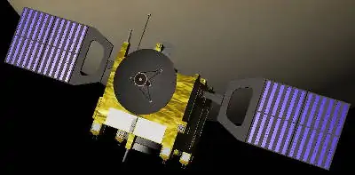
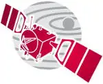
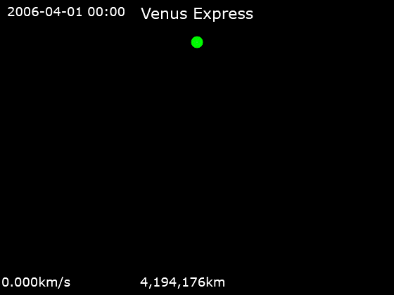
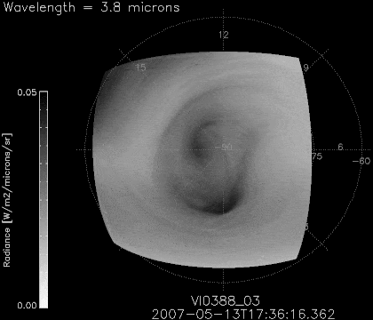
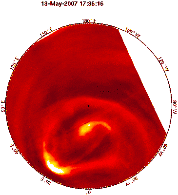
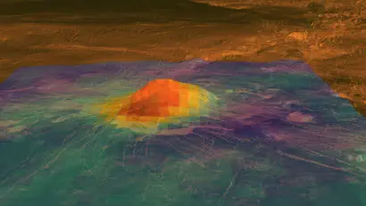
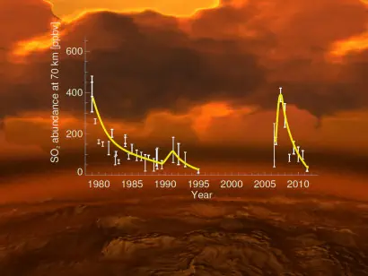
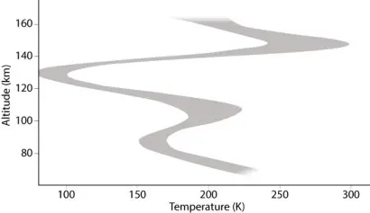
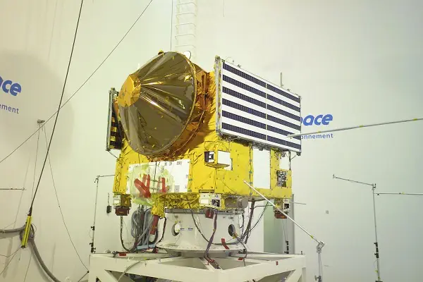
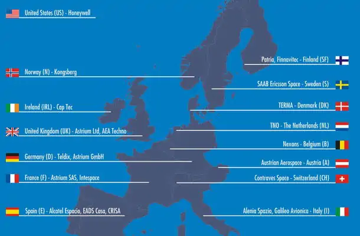

# Venus Express
> 2019.11.01 [🚀](../../index/index.md) [despace](index.md) → [Venus](venus.md), **[Project](project.md)**  
> *Navigation:*  
> **[FAQ](faq.md)**【**[SCS](scs.md)**·КК, **[SC (OE+SGM)](sc.md)**·КА】**[CON](contact.md)·[Pers](person.md)**·Контакт, **[Ctrl](control.md)**·Упр., **[Doc](doc.md)**·Док., **[Drawing](drawing.md)**·Чертёж, **[EF](ef.md)**·ВВФ, **[Error](error.md)**·Ошибки, **[Event](event.md)**·Событ., **[FS](fs.md)**·ТЭО, **[HF&E](hfe.md)**·Эрго., **[KT](kt.md)**·КТ, **[N&B](nnb.md)**·БНО, **[Project](project.md)**·Проект, **[QM](qm.md)**·БКНР, **[R&D](rnd.md)**·НИОКР, **[SI](si.md)**·СИ, **[Test](test.md)**·ЭО, **[TRL](trl.md)**·УГТ

**Table of contents:**

[TOC]

---

> <small>**Venus Express (VEX)** — EN term. **Венера‑Экспресс (ВЕКС)** — RU analogue.</small>

**Venus Express (VEX)** — Venus spacecraft for ranged investigations. It was based on the [Mars Express](mars_express.md), what lead to lower the costa and to make a rapid development.

 

 

|*Type*|*[Param.](si.md)*|
|:-|:-|
|**【Mission】**|• • •|
|Cost|$ 262 million or 18 323 ㎏ [gold](sc_price.md) in 2005 prices|
|[CML](cml.md) / [TRL](trl.md)|CML: <mark>TBD</mark>, TRL: <mark>TBD</mark>|
|Development|2001 — 2005|
|Duration|planned: 2 years;   final: 9 y 2 m 9 d|
|Launch|9 November 2005, 03:33:34 UTC; Rocket: Soyuz-FG/Fregat|
|Operator|European Space Agency|
|Programme|Venus Express|
|Similar to|・Proposed: …  ・Current: [Akatsuki](akatsuki.md) (JP 2010).  ・Past: [Вега‑1/2](vega_1_2.md) (SU 1984), [Венера‑11/12](venera_11_12.md) (SU 1978), [Венера‑9/10](venera_9_10.md) (SU 1975).|
|Target|To perform a global investigation of the Venusian atmosphere|
|[Type](sc.md)|Orbiter spacecraft|
|**【Spacecraft】**|• • •|
|Comms|2 high‑gain dishes, 1.3 m and 0.3 m in diameter, 2 low‑gain antennas|
|Composition|Orbiter|
|Contractor|[EADS Astrium](contact/astrium.md)|
|[ID](spaceid.md)|NSSDC ID (COSPAR ID): [2005-045A ⎆](https://nssdc.gsfc.nasa.gov/nmc/spacecraft/display.action?:id=2005-045A), SCN: 28901|
|Manufacturer|[EADS Astrium](contact/astrium.md)|
|Mass|Dry: 700 ㎏ ([Medium satellite](sc.md), [EVN‑072](venus.md))|
|Orbit / Site|Cytherocentric: 250 x 66 000 ㎞; i = 90 °; T = 24 h|
|Power|1 100 W|
|Payload|Venus Monitoring Camera; Analyser of Space Plasma and Energetic Atoms; Planetary Fourier Spectrometer; Visible/Ultraviolet/Near-infrared Mapping Spectrometer; Venus Express Magnetometer; Venus Radio Science Experiment; Ultraviolet and Infrared Atmospheric Spectrometer|

Achieved targets & investigations:

   - **T** — technical; **C** — contact research; **D** — distant research; **F** — fly‑by; **H** — manned; **S** — soil sample return; **X** — technology demonstration
   - **Sections of measurement and observation:**
      - Atmospheric/climate — **Ac** composition, **Ai** imaging, **Am** mapping, **Ap** pressure, **As** samples, **At** temperature, **Aw** wind speed/direction.
      - General — **Gi** planet’s interactions with outer space.
      - Soil/surface — **Sc** composition, **Si** imaging, **Sm** mapping, **Ss** samples.

<small>

|*EVN‑XXX*|*T*|*EN*|*Section of m&o*|*D*|*C*|*F*|*H*|*S*|
|:-|:-|:-|:-|:-|:-|:-|:-|:-|
|EVN‑005|T|Exploration: from Venusian orbit.| |D| |F| | |
|EVN‑008| |Atmosphere: nightglows.| |D| | | | |
|EVN‑009| |Atmosphere: SO₂ concentration & nature of its variations.| |D| | | | |
|EVN‑010| |Atmosphere: vertical model.| |D| | | | |
|EVN‑011| |Atmosphere: common circulation model.| |D| | | | |
|EVN‑014| |Atmosphere: composition| | |D| |F| |
|EVN‑015| |Atmosphere: structure of the mesosphere.|All A|D| | | | |
|EVN‑020| |Inner structure of the planet.| |D| | | | |
|EVN‑028| |Magnetosphere structure.| |D| |F| | |
|EVN‑029| |Is Venus geologically active?:| |D|C|F| | |
|EVN‑033| |Atmosphere: nature/rate of its escape| | |D| | | |
|EVN‑034| |Atmosphere: nature of the superrotation.| |D| | | | |
|EVN‑035| |Atmosphere: nature of the UV‑absorber.| |D| | | | |
|EVN‑041| |Common connection between the atmosphere & the surface.| |D| | | | |
|EVN‑046| |Surface: causes of the changes during the last billion years.| |D|C|F| | |
|EVN‑049| |Nature & characteristics of the thermal tides| | |D| | | |
|EVN‑050| |Causes of the water loss.| |D| | | | |
|EVN‑067| |Atmosphere: nature of the polar dipole & turbulence.| |D| | | | |
|EVN‑072|T|Exploration with [satellites](sc.md): medium satellites.| |D| |F| | |
|EVN‑074| |Meteorological model.| |D| |F| | |
|EVN‑076| |Surface: volcanoes, their presence.| |D| |F| | |
|EVN‑077| |Atmosphere: chemical elements distribution.| |D| |F| | |
|EVN‑078|T|Atmosphere: radiography.| |D| | | | |
|EVN‑079| |Precise duration of the Venusian day.| |D| | | | |
|EVN‑091| |The loss rate of water from Venus.| |D| |F| | |
|EVN‑093|T|Atmosphere/surface imaging.| |D| |F| | |
|EVN‑096| |Atmosphere: ionosphere.| |D| |F| | |
|EVN‑097| |Atmosphere: effect of solar Rad & interplanetary space on the atmo.| |D| |F| | |
|EVN‑080| |Albedo: changes in time|Gi| |D|F| | |

</small>

 

## Mission
**Launch and start of the mission**

The mission was proposed in 2001 to reuse the design of the Mars Express. However, some mission characteristics led to design changes: primarily in the areas of thermal control, communications and electrical power.

The launch window for Venus Express was open from 26 October to 23 November 2005. It was launched by a Soyuz-FG/Fregat rocket from the Baikonur Cosmodrome in Kazakhstan on 9 November 2005 at 03:33:34 UTC into a parking Earth orbit and 1 h 36 min after launch put into its transfer orbit to Venus. A first trajectory correction maneuver was successfully performed on 11 November 2005. It arrived at Venus on 11 April 2006, after 153 days of journey, and fired its main engine to reduce its velocity so that it could be captured by Venusian gravity. Seven further orbit control maneuvers, two with the main engine and five with the thrusters, were required for Venus Express to reach its final operational 24-hour orbit around Venus.

Venus Express studied the Venusian atmosphere and clouds in detail, the plasma environment and the surface characteristics of Venus from orbit ([EVN‑005](venus.md)). It also made global maps of the Venusian surface temperatures. Its nominal mission was originally planned to last for 500 Earth days, but the mission was extended five times. On 2013.06.20, the mission was extended a final time until 2015.

|*Animation of Venus Express’s trajectory around Venus from 1 April 2006 to 1 April 2008  (Pink — Venus Express; Green — Venus)*|
|:-|
||

**MAJOR DISCOVERIES BY VENUS EXPRESS: 2006-2014**

   1. **Shape-shifting polar vortices.**

The existence of the polar vortices on Venus has been known for many years, but high‑resolution infrared measurements obtained by the VIRTIS instrument on Venus Express have revealed that the southern vortex is far more complex than previously believed.

<small>

|*Thermal infrared radiation (at a wavelength of 3.8 microns).*|
|:-|
|
|**Reconstruction of the motion of the polar atmosphere of Venus. The cross marks the South Pole and the white circle marks the centre of rotation of the polar atmospheric vortex**|
||

</small>

The new observations show that the centre of the vortex has a highly variable shape and internal structure, and its morphology is constantly changing. The images show that the core of the dynamic southern vortex can take almost any shape, so although it often looks like an “S” or “8”, it may become completely irregular, or even chaotic, in appearance. These rapid shape changes indicate complex weather patterns, which are strongly influenced by the fact that the centre of the vortex does not coincide with the geographical pole ([EVN‑067](venus.md)).

Images from the Venus Monitoring Camera and from  the VIRTIS instrument show that the speeds of the zonal winds change with latitude, so that the vortex is continually being pulled and stretched. Although the mean zonal wind is retrograde, its speed decreases toward the pole.

The centre of rotation drifts right around the pole over a period of 5 ‑ 10 Earth days. Its average displacement from the South Pole is about three degrees of latitude, or several hundred kilometres ([EVN‑011](venus.md)).

   2. **Recent volcanism?:**

Small-scale temperature variations on the planet’s surface are extremely difficult to measure. The VIRTIS instrument and the VMC have both contributed to the study of volcanism on Venus. These instruments can observe thermal emission from the surface at a wavelength of around 1 micron, where it is weakly absorbed by the planet’s atmosphere.

|*Surface warmth on a volcano on Venus.*|
|:-|
||

VIRTIS has measured the spectral emissivity of the surface in order to detect variations in chemical composition and they can be used to study the properties of likely Venusian hot spots. In particular, around volcanoes in three of the hot spots (Imdr, Themis and Dione Regiones), VIRTIS data show anomalously high emissivity values. These are interpreted to indicate that the lava flows observed in these regions are relatively unweathered and therefore recent — perhaps a few thousands to a few tens of thousands of years in age ([EVN‑046](venus.md)).

The VMC has also detected some bright, transient features, including an apparent hot spot in the Ganiki Chasma region. The localised region of higher-than-expected temperature may have been a volcanic eruption or fresh lava flow, although this interpretation of the images is by no means certain ([EVN‑076](venus.md)).

Indirect evidence of a major volcanic eruption has come from large changes in the sulphur dioxide content of the planet’s atmosphere ([EVN‑009](venus.md)). Immediately after arriving at Venus in 2006, the spacecraft recorded a significant increase in the average density of sulphur dioxide in the upper atmosphere, followed by a sharp decrease. One possibility is that the dramatic swing in atmospheric composition was caused by buoyant plumes of volcanic gases released by a large eruption and floating upward ([EVN‑029](venus.md)).

|*Surface warmth on a volcano on Venus.*|
|:-|
||

   3. **Spinning Venus is slowing down.**

Over its four-year mission, NASA’s [Magellan](magellan.md) Orbiter was able to watch surface features rotate beneath it, allowing scientists to determine that the length of a day on Venus was 243.0185 Earth days. However, the landforms seen by Venus Express some 16 years later could only be lined up with those observed by Magellan if the length of the Venus day is on average 6.5 minutes longer ([EVN‑079](venus.md)).

Scientists have looked at the possibility of this change arising from short-term, random variations in the length of a Venus day, but have concluded that these should average themselves out over time. On the other hand, atmospheric models have shown that the planet may have weather cycles stretching over decades, which could lead to equally long-term changes in the rotation period.

These detailed measurements from orbit are helping scientists determine whether Venus has a solid or liquid core, which will help our understanding of the planet’s formation and how it evolved. If Venus has a solid core, its mass must be more concentrated towards the centre. In this case, the planet’s rotation would react less to external forces. The most important of those external forces is associated with the dense atmosphere and high velocity winds ([EVN‑020](venus.md)).

   4. **Super‑rotation is speeding up.**

After its arrival at the planet in 2006, Venus Express was able to conduct the most detailed survey of cloud motions in the atmosphere of Venus, with the surprising discovery that the planet’s high level winds have become faster over time. By tracking the movements of distinct cloud features in the cloud tops some 70 ㎞ above the planet’s surface over a period of 10 Venusian years, scientists were able to monitor patterns in the long-term global wind speeds.

In 2006, average cloud-top wind speeds between latitudes 50° on either side of the equator were clocked at roughly 300 ㎞/h. However, detailed cloud tracking studies revealed that these already remarkably rapid winds are becoming even faster, increasing to 400 ㎞/h over the course of the mission. The reason for this dramatic increase is unknown.

On top of this long-term increase in the average wind speed, studies have also revealed regular variations linked to the local time of day and the altitude of the Sun above the horizon, as well as the rotation period of Venus.

There have also been dramatic variations in the average wind speeds observed between consecutive orbits of Venus Express around the planet. In some cases, wind speeds at low latitudes varied such that clouds completed one journey around the planet in 3.9 days, while on other occasions they took 5.3 days ([EVN‑034](venus.md), [EVN‑074](venus.md)).

   5. **Snow on Venus.**

Although the planet’s surface is like a red hot furnace, conditions are very different at an altitude of 125 ㎞, where Venus Express revealed a very frigid layer with a temperature of around -175 ℃. The unexpected cold layer is far chillier than any part of Earth’s atmosphere, despite Venus being much closer to the Sun.

The discovery was made by studying light from the Sun as it passed through the atmosphere, revealing the concentration of carbon dioxide gas molecules at various altitudes along the terminator. Armed with information about the concentration of carbon dioxide and data on atmospheric pressure at each height, scientists could then calculate the corresponding temperatures.

|*Surface warmth on a volcano on Venus.*|
|:-|
||

Since the temperature at some heights dips below the freezing temperature of carbon dioxide, the main constituent of the atmosphere, carbon dioxide ice might be able to form there — possibly forming clouds of ice or snow particles.

   6. **Ozone layer.**

Using observations made with the SPICAV instrument, scientists were able to detect the presence of a tenuous layer of ozone gas in its atmosphere ([EVN‑077](venus.md)).

The ozone was detected by means of stellar occultations — analysing light from distant stars as it passed through different layers of the atmosphere. The method relies on the availability of stars in the line of sight, meaning that it yields an uneven coverage of the planet and is limited to the night side.

Ozone is located at varying altitudes in the Venusian atmosphere, between 90 and 120 ㎞ ([EVN‑015](venus.md)), compared with 15-50 ㎞ on Earth, and is always confined to a rather thin layer, measuring 5 to 10 ㎞ across. The ozone layer on Venus is also very tenuous — up to 1000 times less dense than that on Earth.

   7. **Water loss.**

Venus Express has confirmed that a large quantity of water has been lost into space over billions of years ([EVN‑050](venus.md)). The spacecraft’s MAG made the first ever detection of atmospheric loss on Venus’s day side. Then, in 2007, the ASPERA instrument discovered a rapid loss of hydrogen and oxygen from the night side. This depletion occurs because water molecules in its upper atmosphere are split by incoming ultraviolet radiation from the Sun. This process creates two hydrogen atoms and one oxygen atom for each dissociated molecule. The solar wind then strikes the upper atmosphere and carries the hydrogen and oxygen atoms into space. Unlike Earth, Venus does not generate a magnetic field which can protect its atmosphere from the solar wind. Venus Express has measured the rate of this escape ([EVN‑033,091](venus.md)) and confirmed that roughly twice as much hydrogen as oxygen is escaping, confirmation that water is the source of these escaping ions. It has also shown that a heavy form of hydrogen, called deuterium, is progressively enriched in the upper regions of Venus’s atmosphere because the heavier gas finds it less easy to escape the planet’s gravitational grip.

Scientists used Venus Express had identified difference between Earth and Venus: Venus has a substantial electric field, with a potential around 10 V. Previous observations in search of electric fields at Earth and Mars have failed to make a decisive detection, but they indicate that, if one exists, it is less than 2 V. The electric field detected by Venus Express is much stronger than expected, and it can provide enough energy to oxygen ions to accelerate them upwards fast enough to escape the gravitational pull of the planet. The discovery thus reveals another process, in addition to the solar wind stripping, that could contribute to the very low water content at Venus ([EVN‑050](venus.md)).

   8. **A magnetic surpise**

Venus has no magnetosphere to deflect the charged particles of the solar wind as they stream past the planet, it is partially protected from erosion of the outer atmosphere by an induced magnetic field ([EVN‑028](venus.md)) arising from the interaction of the solar wind and the planet’s ionosphere ([EVN‑097](venus.md)).

As on Earth, solar ultraviolet radiation removes electrons from the atoms and molecules in the upper atmosphere, creating a region of electrically charged gas known as the ionosphere. This ionised layer interacts with the solar wind and the magnetic field carried by the solar wind ([EVN‑096](venus.md)).

During the continuous battle with the solar wind, the ionosphere is able to slow and divert the flow of particles around the planet, creating an elongated magnetotail ([EVN‑097](venus.md)). Until now, magnetic reconnection was not generally thought to occur near non-magnetised planets, so scientists were surprised when Venus Express found the first evidence of this process in Venus’ magnetotail. Reconnection converts magnetic energy into kinetic energy in the form of accelerating particles and occurs when oppositely directed magnetic field lines break and connect with each other. On Earth, it is responsible for magnetic storms and polar auroras ([EVN‑028](venus.md)).

The reconnection splits the magnetotail, causing most of the plasma in the tail to be ejected into space. It also forms a plasmoid structure which heads towards Venus and channels some of the energy of the solar wind into the night-side atmosphere. As a result, the magnetic reconnection causes plasma circulation at Venus, similar to what happens in Earth’s magnetotail. The discovery was made possible by the near‑polar orbit of Venus Express, which is ideal for instruments such as the magnetometer and low‑energy particle detector to observe the solar wind — ionosphere — magnetotail interaction. Previous missions, such as [Pioneer Venus 1](pioneer_venus_1.md) and [Pioneer Venus 2](pioneer_venus_2.md), have either been in different orbits or been active at different periods of solar activity, so they were not able to detect the reconnection events.

**Communication and data transfer**

All communications to and from Venus Express were controlled through one single centre, the Venus Express Mission Control Centre. When the spacecraft was in orbit around Venus, communication with Venus Express was done using the 35 m antenna dish.

Once in orbit around Venus, Venus Express essentially played on a “look-store-downlink” mission scenario. The spacecraft collected most of its scientific data during about one hour and a half passage over the pericentre, when the spacecraft was closer to the surface of the planet. The part of the orbit where the spacecraft is farther from the planet was shared between global remote sensing observations, in situ observations and periods of data transmission.

All data collected during observations were transmitted to Earth for about eight hours a day. Eight hours of transmission corresponded to the downlink of between 100 and 800 Mbytes of data, depending on the actual distance between Earth and Venus.

**Schedule in orbit**

From 23:00 hours to 01:00 hours — High (spatial) resolution observations of atmosphere and surface in the Northern hemisphere (near pericentre)
From 01:00 to 09:00 — Communication with Earth and transmission of the scientific data
From 11:00 to 13:00 — Global mapping  and study of large scale phenomena in the Southern hemisphere (around apocentre)
From 15:00 to 23:00 — Study of the dynamics of the atmosphere and the cloud systems
Various orbital phases — High (vertical) resolution studies of the atmosphere, through solar, stellar and Earth occultation

NB 00:00 hours corresponds to the passage over the pericentre

**The end of the mission**

On 28 November 2014, mission control lost contact with Venus Express. Intermittent contact was reestablished on 3 December 2014, though there was no control over the spacecraft, likely due to exhaustion of propellant. On 16 December 2014, ESA announced that the Venus Express mission had ended.

 

## Science goals & payload 
Venus Express studied its complex dynamics and chemistry, and the interactions between the atmosphere and the surface ([EVN‑041](venus.md)), which has given clues about surface’s characteristics. It also studied the interactions between the atmosphere and the interplanetary environment — solar wind ([EVN‑097](venus.md)) to better understand the evolution of the planet.

In the most comprehensive study of the Venusian atmosphere ever, Venus Express had many open questions to tackle:

   - How do the complex global dynamics of the planet work?:
      - What causes the super-fast atmospheric rotation and the hurricane-force winds?:
      - What maintains the double atmospheric vortex at the poles?:
   - How does the cloud system work?:
      - How do clouds and haze form and evolve at different altitudes?:
      - What is at the origin of mysterious ultraviolet marks at the clouds tops?:
   - What processes govern the chemical state of the atmosphere?:
   - What role does the “green-house effect” play in the global evolution of the Venusian climate?:
   - What governs the escape processes of the atmosphere?:
   - Are there water, carbon dioxide or sulphuric acid cycles on Venus?:
   - What caused the global volcanic resurfacing of Venus 500 million years ago?:
   - Why are some areas on the surface so reflective to radar?:
   - Is there present volcanic or seismic activity on the planet?:

**Payload**

   1. **ASPERA-4**: An acronym for “**A**nalyzer of **S**pace **P**lasmas and **E**nergetic **A**toms”, ASPERA-4 investigated the interaction between the solar wind and the Venusian atmosphere ([EVN‑097](venus.md)), determine the impact of plasma processes on the atmosphere, determine global distribution of plasma and neutral gas, study energetic neutral atoms, ions and electrons, and analyze other aspects of the near Venus environment. ASPERA-4 is a re-use of the ASPERA-3 design used on Mars Express, but adapted for the harsher near‑Venus environment.
   1. **MAG**: The magnetometer is designed to measure the strength of Venus’s magnetic field and the direction of it as affected by the solar wind and Venus itself ([EVN‑028](venus.md)). It mapped the magnetosheath, magnetotail, ionosphere, and magnetic barrier in high resolution in three-dimensions, aid ASPERA-4 in the study of the interaction of the solar wind with the atmosphere of Venus, identify the boundaries between plasma regions, and carry planetary observations as well (such as the search for and characterization of Venus lightning). MAG is derived from the Rosetta lander’s ROMAP instrument. One measuring device is placed on the body of the craft. The identical second of the pair is placed the necessary distance away from the body by unfolding a 1 m long boom (carbon composite tube). Two redundant pyrotechnical cutters cut one loop of thin rope to free the power of metal springs. The driven knee lever rotates the boom perpendicularly outwards and latches it in place. Only the use of a pair of sensors together with the rotation of the sonde allows the spacecraft to resolve the small natural magnetic field beneath the disturbing fields of the Orbiter itself. The measurements to identify the fields produced by the craft took place on the route from Earth to Venus. The lack of magnetic cleanness was due to the reuse of the Mars Express spacecraft bus which did not carry a magnetometer. By combining the data from two-point simultaneous measurements and using software to identify and remove interference generated by Venus Express itself, it was possible to obtain results of a quality comparable to those produced by a magnetically clean craft.
   1. **PFS**: The “**P**lanetary **F**ourier **S**pectrometer” operates in the infrared between the 0.9 µm and 45 µm wavelength range and is designed to perform vertical optical sounding of the Venus atmosphere. It performed global, long-term monitoring of the three-dimensional temperature field in the lower atmosphere (cloud level up to 100 ㎞). Furthermore, it searched for minor atmospheric constituents that may be present, but had not yet been detected, analyzed atmospheric aerosols, and investigated surface to atmosphere exchange processes. The design is based on a spectrometer on Mars Express, but modified for optimal performance for the Venus Express mission.
   1. **SPICAV**: The “**Sp**ectroscopy for **I**nvestigation of **C**haracteristics of the **A**tmosphere of **V**enus” is an imaging spectrometer that was used for analyzing radiation in the infrared and ultraviolet wavelengths. It’s derived from the SPICAM instrument flown on Mars Express. However, SPICAV has an additional channel known as **SOIR** (**S**olar **O**ccultation at **I**nfra**r**ed) that was used to observe the Sun through Venus’s atmosphere in the infrared. ([EVN‑014](venus.md))
   1. **VIRTIS**: The “**V**isible and **I**nfrared **T**hermal **I**maging **S**pectrometer” is an imaging spectrometer that observes in the near‑ultraviolet, visible, and infrared parts of the electromagnetic spectrum. It analyzed all layers of the atmosphere, surface temperature and surface/atmosphere interaction phenomena ([EVN‑014,041](venus.md)).
   1. **VeRa**: **Ve**nus **Ra**dio Science is a radio sounding experiment that transmitted radio waves from the spacecraft and passed them through the atmosphere or reflected them off the surface. These radio waves were received by a ground station on Earth for analysis of the ionosphere, atmosphere ([EVN‑078](venus.md)) and surface of Venus. It’s derived from the Radio Science Investigation instrument flown on Rosetta.
   1. **VMC**: The **V**enus **M**onitoring **C**amera is a wide-angle, multi‑channel CCD. The VMC is designed for global imaging of the planet ([EVN‑093](venus.md)). It operates in the visible, ultraviolet, and near infrared spectral ranges, and maps surface brightness distribution searching for volcanic activity, monitoring airglow ([EVN‑008](venus.md)), studying the distribution of unknown ultraviolet absorbing phenomenon at the cloud-tops ([EVN‑035](venus.md)), and making other science observations. It’s derived in part by the Mars Express High Resolution Stereo Camera (HRSC) and the Rosetta Optical, Spectroscopic and Infrared Remote Imaging System (OSIRIS). The camera includes an FPGA to pre‑process image data, reducing the amount transmitted to Earth. The consortium of institutions responsible for the VMC includes the Max Planck Institute for Solar System Research, the Institute of Planetary Research at the German Aerospace Center and the Institute of Computer and Communication Network Engineering at Technische Universität Braunschweig. It’s not to be confused with Visual Monitoring Camera mounted on Mars Express, of which it is an evolution.

The combination of data from the PFS, SPICAV, and VIRTUS instruments made it possible to obtain fairly accurate information about the vertical structure of the Venus atmosphere ([EVN‑010](venus.md)). This data served as the basis for the [Akatsuki](akatsuki.md) mission to work in this direction.

 

## Spacecraft
|*Parameter*|*Value*|
|:-|:-|
|Spacecraft bus dimensions|1.5 x 1.8 x 1.4 m|
|Spacecraft mass|1 270 ㎏ (including 93 ㎏ of payload and 570 ㎏ fuel)|
|Thrust of main engine|400 N|
|Attitude thrusters|Two sets of four, each delivering 10 N each|
|Solar arrays|Two triple-junction Ga As; 5.7 m²; generating 800 W near Earth and 1 100 W at Venus|
|Power storage|Three lithium-ion batteries|
|Antennas|Two high‑gain dishes, 1.3 m and 0.3 m in diameter, 2 low‑gain antennas|

**Structure**

The spacecraft body itself, termed a bus, was a honeycomb aluminium box about one and a half metres wide. With its solar arrays extended, it measured about eight metres across. Payload was concentrated on three sides of the spacecraft.

**Thermal control**

To keep Venus Express within temperatures that are safe for the spacecraft, the radiators on the spacecraft surface have been increased in area and efficiency. The spacecraft coating, called multi-layer insulation or MLI, was composed of 23 layers. For Venus Express, the MLI was gold, which provided more capability to reflect radiation away.

**Power**

The two symmetric solar arrays, counting about six square metres, were based on a “triple junction” gallium arsenide (GaAs) technology.

The solar cells, each composed by four layers of gallium arsenide, were more tolerant to high temperatures (up to around 120 ℃), so they were more suitable for hot environments. They were able of exploiting a wider range of solar radiation. The solar cells were separated by aluminium strips that help to reject heat. All together, these aluminium strips covered half of the overall solar array surface.

When the spacecraft was in shadow (eclipse) or when its power demand exceeded the capacity of the solar arrays, electrical power was supplied by three lithium-ion batteries that were charged by the solar-generated power.

**Propulsion**

The gravity of Venus, almost the same as Earth’s, is about eight times higher than that of Mars. This, plus the fact that the gravitational pull of the Sun is stronger at Venus, means that Venus Express needed more energy to brake and be captured into orbit around Venus.

This energy was provided by part of the 570 ㎏ of propellant on board. Major spacecraft manoeuvres, like the injection into orbit around Venus, were performed by firing the main engine located at the bottom floor of the spacecraft, while minor manoeuvres were made using four pairs of thrusters located at the four bottom corners of the spacecraft.

The thrusters were used for small trajectory corrections, spacecraft attitude changes, and to corrected the altitude of the Venus Express orbit’s pericentre about every 50 days. In fact, due to the gravitational pull of the Sun while the spacecraft was farther away from the planet, the pericentre naturally drifted upwards at a rate of about 1.5 ㎞/day.

**Communications**

For a SC in Venus orbit, it was not always possible to point a single antenna dish at Earth while always keeping the cold face of the spacecraft, hosting delicate instruments, away from the Sun.

To overcome this pointing constraint, Venus Express has two high‑gain antennas, mounted on different spacecraft faces. The main high‑gain antenna, used for most of the communication with Earth, is a dish measuring 1.3 m diameter.

The second and smaller high‑gain antenna was used to communicate with Earth when the spacecraft is in the part of the orbit closest to our planet.

Two low‑gain antennas were also mounted on board, to communicate with Earth during launch, in the first days of the cruise and, should it occur, during severe “safe modes”.

**Navigation and attitude control**

Venus Express was a three‑axis stabilised spacecraft. Through three different systems on board, the SC could acquire data about its position in space, attitude (orientation) and change of velocity.

These on-board systems consisted of two star trackers, two Sun sensors and a set composed by three laser gyroscopes and three accelerometers. They provided data necessary to re-orient the spacecraft and the solar arrays when necessary.

The actual spacecraft re-orientation manoeuvre or trajectory correction is performed by means of so-called “reaction wheels” or by firing the thrusters.

**Data storage**

The Venus Express on-board computer was responsible for supervising and managing the overall spacecraft functioning, for handling all data acquired by instruments and sensors and for sending commands through the whole spacecraft.

Part of the computer was the Solid State Mass Memory, which had a capacity of 12 Gbits. All scientific data collected by the instruments were stored here until they could be downloaded to Earth during the appropriate orbital phase.

 

## Community, library, links

  
The Venus Express prime contractor is EADS Astrium, Toulouse, FR, leading a team of 25 subcontractors from 14 European countries.

**PEOPLE:**

   1. Constantine Tsang — **senior research scientist**
   1. Accomazzo, Andrea — **spacecraft operations manager**
   1. McCoy, Don — **project manager**
   1. [Svedhem, Håkan](person.md) — **project scientist**
   1. [Titov, Dmitrij](person.md)
   1. Witting, Michael — **launch campaign manager**

**COMMUNITY:**

   1. <mark>TBD</mark>

 

## Docs & links
|*Sections & pages*|
|:-|
|**【】**  <mark>NOCAT</mark>|

   1. Docs: …
   1. <https://en.wikipedia.org/wiki/Venus_Express>
   1. <https://sci.esa.int/web/venus-express>
   1. <http://www.esa.int/Science_Exploration/Space_Science/Venus_Express>
   1. <https://nssdc.gsfc.nasa.gov/nmc/spacecraft/display.action?:id=2005-045A>
