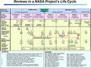

# Design review
> 2019.05.12 ┊ **🚀 [despace](index.md)** → **[R&D](rnd.md)**

[TOC]

---

> <small>*Термины:* **Design review** — англоязычный термин, не имеющий аналога в русском языке. **Проверка проекта** — дословный перевод с английского на русский.</small>

A **design review** is a milestone within a product development process whereby a design is evaluated against its requirements in order to verify the outcomes of previous activities and identify issues before committing to — and if need to be re‑prioritise — further work. The ultimate design review, if successful, therefore triggers the product launch or product release.

## Описание
The conduct of design reviews is compulsory as part of design controls, when developing products in certain regulated contexts such as medical devices.

By definition, a review must include persons who are external to the design team.

**Contents of a design review**  
In order to evaluate a design against its requirements, a number of means may be considered, such as:

   - Physical tests.
   - Engineering simulations.
   - Examinations (Walk‑through).

**Timing of design reviews**  
Most formalised systems engineering processes recognise that the cost of correcting a fault increases as it progresses through the development process. Additional effort spent in the early stages of development to discover and correct errors is therefore likely to be worthwhile. Design reviews are example of such an effort. Therefore, a number of design reviews may be carried out, for example to evaluate the design against different sets of criteria (consistency, usability, ease of localisation, environmental) or during various stages of the design process.

## In US
In the United States military integrated acquisition lifecycle the Technical section has multiple acquisition “Technical Reviews”. Technical reviews and audits assist the acquisition and the number and types are tailored to the acquisition. Typical topics examined include adequacy of program/contract metrics, proper staffing, risks, budget, and schedule.

In [NASA's](03_nasa.md) engineering design life cycle, a phase of design reviews are held for technical and programmatic accountability and to authorize the release of funding to a project. A design review provides an in‑depth assessment, by an independent team of discipline experts and managers, that the design (or concept) is realistic and attainable from a programmatic and technical sense.

In 21CFR820.3(h), design review is described as *“documented, comprehensive, systematic examination of the design to evaluate the adequacy of the design requirements, to evaluate the capability of the design to meet these requirements, and to identify problems.”* The FDA also specifies that a design review should include an independent reviewer.

||
|:--|
|   |

## Процесс
**Таблица.** Описание проверок.

|*Аббр.*|*Этап*|*Описание*|
|:--|:--|:--|
|MCR  |*Mission  Concept  Review*  |The MCR affirms the mission need and examines the proposed mission's objectives and the concept for meeting those objectives.  |
|SRR  |*System  Requirements  Review*  |The SRR examines the functional requirements and performance requirements defined for the system and the preliminary program or project plan and ensures that the requirements and the selected concept will satisfy the mission.  |
|  |*Рассмотрение  системных  требований*  |Цель SRR — достижение уверенности в полном и однозначном понимании заданных требований к КА и его СЧ, выявление и исправление несоответствий в требованиях, рассмотрение обоснованных предложений по улучшению характеrистик продукции.  Проводится на этапе [ЭП](rnd_ep.md).  |
|EQSR  |*Equipment  Qualification  Status  Review*  |EQSL process primarily intended to check suitability of equipment already flown on heritage programme for suitability on new user programmes.  |
|  |*Рассмотрение  состояния  квалификации  оборудования*  |EQSR — это анализ соответствия оборудования заданным условиям эксплуатации и требованиям к функциональным характеристикам и ресурсу, а также анализ риска разработки нового оборудования. В зависимости от состояния разработки оборудования, наличия лётного опыта его использования и его прототипов на рассмотрении должна быть определена категория «состояния разработки», необходимый объём испытаний для подтверждения полной квалификации оборудования на обеспечение заданных госконтрактом (контрактом, договором), ТТЗ, ТЗ требований.  Проводится на этапе [ЭП](rnd_ep.md) или [РКД](ркд.md).  |
|MDR  |*Mission  Definition  Review*  |The MDR examines the proposed requirements, the mission architecture, and the flow down to all functional elements of the mission to ensure that the overall concept is complete, feasible, and consistent with available resources.  |
|SDR  |*System  Design  Review*  |The SDR examines the proposed system architecture and design and the flow down to all functional elements of the system.  |
|PDR  |*Preliminary  Design  Review*  |The PDR demonstrates that the preliminary design meets all system requirements with acceptable risk and within the cost and schedule constraints and establishes the basis for proceeding with detailed design. It will show that the correct design options have been selected, interfaces have been identified, and verification methods have been described.  The following are typical objectives of a PDR:  • Ensure that all system requirements have been validated, allocated, the requirements are complete, and the flowdown is adequate to verify system performance.  • Show that the proposed design is expected to meet the functional and performance requirements.  • Show sufficient maturity in the proposed design approach to proceed to final design.  • Show that the design is verifiable and that the risks have been identified, characterized, and mitigated where appropriate.  |
|  |*Предварительное  рассмотрение  проекта*  |Цель PDR — обзор концепции построения и реализуемости ожидаемых характеристик КА, подсистем, оборудования и планов их проектирования и разработки, подтверждение возможности проекта удовлетворить заданным требованиям.   Проводится по окончании этапа [ЭП](rnd_ep.md) или в начале [РКД](ркд.md).  |
|CDR  |*Critical  Design  Review*  |The CDR demonstrates that the maturity of the design is appropriate to support proceeding with full‑scale fabrication, assembly, integration, and test. CDR determines that the technical effort is on track to complete the flight and ground system development and mission operations, meeting mission performance requirements within the identified cost and schedule constraints.  The following are typical objectives of a CDR:  • Ensure that the “build‑to” baseline contains detailed hardware and software specifications that can meet functional and performance requirements.  • Ensure that the design has been satisfactorily audited by production, verification, operations, and other specialty engineering organizations.  • Ensure that the production processes and controls are sufficient to proceed to the fabrication stage.  • Establish that planned Quality Assurance (QA) activities will establish perceptive verification and screening processes for producing a quality product.  • Verify that the final design fulfills the specifications established at PDR.  |
|  |*Критическое  рассмотрение  проекта*  |Цель CDR — обзор состояния изделия, РД, приемлемости для полёта оборудования и подсистем, достижение уверенности в завершении проектирования и разработки оборудования, подсистем и КА в целом.   Проводится по окончании этапа [РКД](ркд.md).  |
|MRR  |*Mission  Readiness  Review*  |The purpose of a MRR is to assess the readiness status of spacecraft systems prior to launch. As the final review before launch, it provides a last opportunity to detect and correct “show‑stoppers”. The MRR covers all activities required for a successful launch, including the flight preparedness of launch systems, flight systems, ground systems, supporting facilities, and operations personnel. MRR is distinguished from a launch readiness review in that MRR also evaluates the readiness of the mission plan to accomplish the mission objectives.  |
|  |*Рассмотрение  готовности  к изготовлению*  |Цель МRR — удостовериться в готовности производства к началу изготовления экспериментальных и лётного изделий.  |
|PRR  |*Production  Readiness  Review*  |A PRR is held for Flight System and Ground Support projects developing or acquiring multiple or similar systems greater than three or as determined by the project. The PRR determines the readiness of the system developers to efficiently produce the required number of systems. It ensures that the production plans; fabrication, assembly, and integration enabling products; and personnel are in place and ready to begin production.  |
|TRR  |*Test  Readiness  Review*  |A TRR ensures that the test article (hardware/software), test facility, support personnel, and test procedures are ready for testing and data acquisition, reduction, and control. This is not a prerequisite for KDP E.  |
|  |*Рассмотрение  готовности  к ПСИ*  |Цель TRR — оценка конфигурации и готовности изделия, оборудования и документации к проведению испытаний.  |
|TRB  |*…*  |  |
|  |*Рассмотрение  результатов  ПСИ*  |Цель ТRВ — обзор характеристик КА, подверждение итогов пo несоответствиям, отступлениям, устранению сбоев, возникших в ходе испытаний, а также проверки и подтверждение данных, полученных по результатам испытаний.  |
|SAR  |*System  Acceptance  Review*  |The SAR verifies the completeness of the specific end products in relation to their expected maturity level and assesses compliance to stakeholder expectations. The SAR examines the system, its end products and documentation, and test data and analyses that support verification. It also ensures that the system has sufficient technical maturity to authorize its shipment to the designated operational facility or launch site.  |
|DRB  |*…*  |  |
|  |*Рассмотрение  готовности  к поставке*  |Цель DRВ — проверка соответствия комплектующих изделий КА и его СЧ требованиям, заданным в госконтракте (контракте, договоре), ТТЗ, ТЗ, для подтверждения их готовности к поставке и установке на изделия более высокого конфигурационного уровня.  |
|ORR  |*Operational  Readiness  Review*  |The ORR examines the actual system characteristics and the procedures used in the system or end product's operation and ensures that all system and support (flight and ground) hardware, software, personnel, procedures, and user documentation accurately reflect the deployed state of the system.   The following are typical objectives of an ORR:  • Establish that the system is ready to transition into an operational mode through examination of available ground and flight test results, analyses, and operational demonstrations.  • Confirm that the system is operationally and logistically supported in a satisfactory manner considering all modes of operation and support (normal, contingency, and unplanned).  • Establish that operational documentation is complete and represents the system configuration and its planned modes of operation.  • Establish that the training function is in place and has demonstrated capability to support all aspects of system maintenance, preparation, operation, and recovery.  |
|FRR  |*Flight  Readiness  Review*  |The FRR examines tests, demonstrations, analyses, and audits that determine the system's readiness for a safe and successful flight or launch and for subsequent flight operations. It also ensures that all flight and ground hardware, software, personnel, and procedures are operationally ready.  The following are typical objectives of a FRR:  • Receive certification that flight operations can safely proceed with acceptable risk.  • Confirm that the system and support elements are properly configured and ready for launch.  • Establish that all interfaces are compatible and function as expected.  • Establish that the system state supports a launch “go” decision based on go/no‑go criteria.  |

 

## Docs & links (TRANSLATEME ALREADY)
|…°·•¹²³±×÷≤≥≈≠ ‑ −— ⎆✉ ❐“”’«»✔→✘☐☑├┕┆ 1 lb = 0.453592 kg; 1 g = 9.80665 m/s²|
|:--|
|<small>**[FAQ](faq.md)**, **[Cable](cable.md)**·БКС, **[Camera](camera.md)**·Камера, **[Comms](comms.md)**·Радиосв., **[Contact](contact.md)**·Контакт, **[Control](control.md)**·Управ., **[Doc](doc.md)**·Док., **[Doppler](doppler.md)**·ИСР, **[DS](ds.md)**·ЗУ, **[EB](eb.md)**·ХИТ, **[ECO](ecology.md)**·Экол., **[EF](ef.md)**·ВВФ, **[ElC](elc.md)**·ЭКБ, **[EMC](emc.md)**·ЭМС, **[Errors](error.md)**·Ошибки, **[Events](event.md)**·События, **[FS](fs.md)**·ТЭО, **[Fuel](fuel.md)**·Топливо, **[GNC](gnc.md)**·БКУ, **[GS](scs.md)**·НС, **[HF&E](hfe.md)**·Эргоном., **[IMU](imu.md)**·Гироскоп, **[Incubator](incubator.md)**·Инкуб., **[KT](kt.md)**·КТЕХ, **[LAG](lag.md)**·ПУC, **[LES](les.md)**·САСП, **[LS](ls.md)**·СЖО, **[LV](lv.md)**·РН, **[MAG](mag.md)**·Магнитом., **[MCC](mcc.md)**·ЦУП, **[Model](model.md)**·Модель, **[MSC](sc.md)**·ПКА, **[N&B](nnb.md)**·БНО, **[NR](nr.md)**·ЯР, **[OBC](obc.md)**·ЦВМ, **[OE](oe.md)**·БА, **[Patent](патент.md)**·Патент, **[Project](project.md)**·Проект, **[PS](ps.md)**·ДУ, **[QA](quality.md)**·QA, **[R&D](rnd.md)**·НИОКР, **[RAMS](rams.md)**·НиБ, **[Risk](risk.md)**·Риск, **[Robot](robotics.md)**·Робот, **[Rover](rover.md)**·Планетоход, **[RTG](rtg.md)**·РИТЭГ, **[RW](rw.md)**·ДМ, **[SARC](sarc.md)**·ПСК, **[Sensor](sensor.md)**·Датчик, **[SC](sc.md)**·КА, **[SCS](scs.md)**·КК, **[SGM](sgm.md)**·КММ, **[SI](si.md)**·СИ, **[Soft](soft.md)**·ПО, **[SP](sp.md)**·БС, **[Spaceport](spaceport.md)**·Космодром, **[SPS](sps.md)**·СЭС, **[SSS](sss.md)**·ГЗУ, **[TCS](tcs.md)**·СОТР, **[Test](test.md)**·ЭО, **[Timeline](timeline.md)**·Циклограмма, **[TMS](tms.md)**·ТМС, **[TOR](tor.md)**·ТЗ, **[TRL](trl.md)**·УГТ</small>|
|*Sections & pages*|
|**··•  •··**  <mark>NOCAT</mark> |

**Docs:**

   1. [Design Review: MRR ❐](f/rnd/design_review_mrr.pdf)

**Links:**

   1. Notable interwikies — …
   1. <https://en.wikipedia.org/wiki/Design_review>
   1. <https://en.wikipedia.org/wiki/Design_review_(US_Government)>
