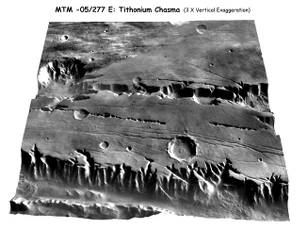
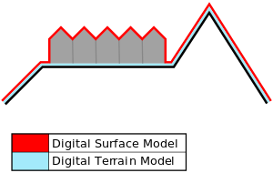

# Digital elevation model
> 2019.09.13 ┊ **🚀 [despace](index.md)** → **[Модель](model.md)**

[TOC]

---

> <small>*Термины:* **Digital elevation model (DEM)** — англоязычный термин, не имеющий аналога в русском языке. **Цифровая модель рельефа (ЦМР)** — дословный перевод с английского на русский.</small>

A **digital elevation model (DEM)** is a 3D CG representation of a terrain’s surface — commonly of a planet (e.g. Earth), moon, or asteroid — created from a terrain’s elevation data. A «global DEM» refers to a discrete global grid.

|*3D rendering of a DEM of Tithonium Chasma on Mars*|*Surfaces represented by a Digital Surface Model include buildings and other objects. Digital Terrain Models represent the bare ground.*|
|:--|:--|
|  |  |

## Description
DEMs are used often in geographic information systems, and are the most common basis for digitally produced relief maps. While a digital surface model (DSM) may be useful for landscape modeling, city modeling and visualization applications, a digital terrain model (DTM) is often required for flood or drainage modeling, land-use studies, geological applications, and other applications, and in planetary science.

## Uses
Common uses of DEMs include:

   - Extracting terrain parameters for geomorphology
   - Modeling water flow for hydrology or mass movement (for example avalanches and landslides)
   - Modeling soils wetness with Cartographic Depth to Water Indexes (DTW-index)
   - Creation of relief maps
   - Rendering of 3D visualizations.
   - 3D flight planning and TERCOM
   - Creation of physical models (including raised relief maps)
   - Rectification of aerial photography or satellite imagery
   - Reduction (terrain correction) of gravity measurements (gravimetry, physical geodesy)
   - Terrain analysis in geomorphology and physical geography
   - Geographic information systems (GIS)
   - Engineering and infrastructure design
   - Satellite navigation (for example GPS and GLONASS)
   - Line-of-sight analysis
   - Base mapping
   - Flight simulation
   - Precision farming and forestry
   - Surface analysis
   - Intelligent transportation systems (ITS)
   - Auto safety / advanced driver-assistance systems (ADAS)
   - Archaeology

 

## Docs & links (TRANSLATEME ALREADY)
|…°·•¹²³±×÷≤≥≈≠ ‑ −— ⎆✉ ❐“”’«»✔→✘☐☑├┕┆ 1 lb = 0.453592 kg; 1 g = 9.80665 m/s²|
|:--|
|<small>**[FAQ](faq.md)**, **[Cable](cable.md)**·БКС, **[Camera](camera.md)**·Камера, **[Comms](comms.md)**·Радиосв., **[Contact](contact.md)**·Контакт, **[Control](control.md)**·Управ., **[Doc](doc.md)**·Док., **[Doppler](doppler.md)**·ИСР, **[DS](ds.md)**·ЗУ, **[EB](eb.md)**·ХИТ, **[ECO](ecology.md)**·Экол., **[EF](ef.md)**·ВВФ, **[ElC](elc.md)**·ЭКБ, **[EMC](emc.md)**·ЭМС, **[Errors](error.md)**·Ошибки, **[Events](event.md)**·События, **[FS](fs.md)**·ТЭО, **[Fuel](fuel.md)**·Топливо, **[GNC](gnc.md)**·БКУ, **[GS](scs.md)**·НС, **[HF&E](hfe.md)**·Эргоном., **[IMU](imu.md)**·Гироскоп, **[Incubator](incubator.md)**·Инкуб., **[KT](kt.md)**·КТЕХ, **[LAG](lag.md)**·ПУC, **[LES](les.md)**·САСП, **[LS](ls.md)**·СЖО, **[LV](lv.md)**·РН, **[MAG](mag.md)**·Магнитом., **[MCC](mcc.md)**·ЦУП, **[Model](model.md)**·Модель, **[MSC](sc.md)**·ПКА, **[N&B](nnb.md)**·БНО, **[NR](nr.md)**·ЯР, **[OBC](obc.md)**·ЦВМ, **[OE](oe.md)**·БА, **[Patent](патент.md)**·Патент, **[Project](project.md)**·Проект, **[PS](ps.md)**·ДУ, **[QA](quality.md)**·QA, **[R&D](rnd.md)**·НИОКР, **[RAMS](rams.md)**·НиБ, **[Risk](risk.md)**·Риск, **[Robot](robotics.md)**·Робот, **[Rover](rover.md)**·Планетоход, **[RTG](rtg.md)**·РИТЭГ, **[RW](rw.md)**·ДМ, **[SARC](sarc.md)**·ПСК, **[Sensor](sensor.md)**·Датчик, **[SC](sc.md)**·КА, **[SCS](scs.md)**·КК, **[SGM](sgm.md)**·КММ, **[SI](si.md)**·СИ, **[Soft](soft.md)**·ПО, **[SP](sp.md)**·БС, **[Spaceport](spaceport.md)**·Космодром, **[SPS](sps.md)**·СЭС, **[SSS](sss.md)**·ГЗУ, **[TCS](tcs.md)**·СОТР, **[Test](test.md)**·ЭО, **[Timeline](timeline.md)**·Циклограмма, **[TMS](tms.md)**·ТМС, **[TOR](tor.md)**·ТЗ, **[TRL](trl.md)**·УГТ</small>|
|*Sections & pages*|
|**`Модель:`**  [DEM](digital_elev_model.md) ┊ [SPICE](spice.md) ┊ [ВДМ](vd_model.md) ┊ [Лимит](limit.md) ┊ [МИХ](mic.md) ┊ [Осциллятор](oscillator.md) |

**Docs:**

   1. …

**Links:**

   1. Notable interwikies — …
   1. <https://en.wikipedia.org/wiki/Digital_elevation_model>

