# Чертежи, модели
> 2019.05.12 [🚀](../index/index.md) [despace](index.md) → **[Док.](doc.md)**, [Схема](doc.md)

[TOC]

---

> <small>**Чертежи, модели** — русскоязычный термин. **Drafts, models** — англоязычный эквивалент.</small>

 

## ➀ Модель
> <small>**Model** — EN term. **Модель** — RU analogue.</small>

A **conceptual model** is a representation of a system, made of the composition of concepts which are used to help people know, understand, or simulate a subject the model represents. It is also a set of concepts. In contrast, physical models are physical objects; for example, a toy model which may be assembled, & may be made to work like the object it represents.

   1. <https://en.wikipedia.org/wiki/Conceptual_model>
   1. <https://ru.wikipedia.org/wiki/Модель>

Conceptual model may refer to models which are formed after a conceptualization or generalization process. Conceptual models are often abstractions of things in the real world, whether physical or social. Semantic studies are relevant to various stages of concept formation. Semantics is basically about concepts, the meaning that thinking beings give to various elements of their experience.

**Концептуальная модель** — это модель, представленная множеством понятий и связей между ними, определяющих смысловую структуру рассматриваемой предметной области или её конкретного объекта.

Концептуальная модель — модель предметной области, состоящей из перечня взаимосвязанных понятий, используемых для описания этой области, вместе со свойствами и характеристиками, классификацией этих понятий, по типам, ситуациям, признакам в данной области и законов протекания процессов в ней.

Концептуальная (содержательная) модель — это структура моделируемой системы, свойства её элементов и причинно‑следственные связи, присущие системе и существенные для достижения цели моделирования.

Концептуальная модель относится к моделям, которые формируются после процесса концептуализации или обобщения. Концептуальные модели часто являются абстракциями вещей в реальном мире. Для различных этапов формирования концепта актуальны семантические исследования. Семантика — это понятие, значение, которое мыслящие существа придают различным элементам своего опыта.

**Моде́ль** *(фр. modèle от лат. modulus «мера, аналог, образец»)* — это система, исследование которой служит средством для получения информации о другой системе; представление некоторого реального процесса, устройства или концепции.

Модель есть абстрактное представление реальности в какой‑либо форме (например, в математической, физической, символической, графической или дескриптивной), предназначенное для представления определённых аспектов этой реальности и позволяющее получить ответы на изучаемые вопросы.

 

### Digital elevation model
> <small>**Digital elevation model (DEM)** — англоязычный термин, не имеющий аналога в русском языке. **Цифровая модель рельефа (ЦМР)** — дословный перевод с английского на русский.</small>

A **digital elevation model (DEM)** is a 3D CG representation of a terrain’s surface — commonly of a planet (e.g. Earth), moon, or asteroid — created from a terrain’s elevation data. A «global DEM» refers to a discrete global grid.

   1. <https://en.wikipedia.org/wiki/Digital_elevation_model>

DEMs are used often in geographic information systems, and are the most common basis for digitally produced relief maps. While a digital surface model (DSM) may be useful for landscape modeling, city modeling and visualization applications, a digital terrain model (DTM) is often required for flood or drainage modeling, land-use studies, geological applications, and other applications, and in planetary science.

|*3D rendering of a DEM of Tithonium Chasma on Mars*|*Surfaces represented by a Digital Surface Model include buildings & other objects. Digital Terrain Models represent the bare ground.*|
|:--|:--|
|[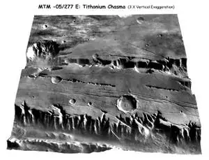](f/model/dem_01.webp)|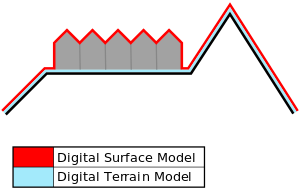|

Common uses of DEMs include:

   - Extracting terrain parameters for geomorphology
   - Modeling water flow for hydrology or mass movement (for example avalanches and landslides)
   - Modeling soils wetness with Cartographic Depth to Water Indexes (DTW-index)
   - Creation of relief maps
   - Rendering of 3D visualizations.
   - 3D flight planning and TERCOM
   - Creation of physical models (including raised relief maps)
   - Rectification of aerial photography or satellite imagery
   - Reduction (terrain correction) of gravity measurements (gravimetry, physical geodesy)
   - Terrain analysis in geomorphology and physical geography
   - Geographic information systems (GIS)
   - Engineering and infrastructure design
   - Satellite navigation (for example GPS and GLONASS)
   - Line-of-sight analysis
   - Base mapping
   - Flight simulation
   - Precision farming and forestry
   - Surface analysis
   - Intelligent transportation systems (ITS)
   - Auto safety / advanced driver-assistance systems (ADAS)
   - Archaeology

 

### Вибродинамическая модель
> <small>**Вибродинамическая модель (ВДМ)** — русскоязычный термин, не имеющий аналога в английском языке. **Vibrodynamic model** — дословный перевод с русского на английский.</small>

**Вибродинамическая модель (ВДМ)**, также **низкочастотная динамическая схема (НДСа)** — математическая модель напряжений и изгибающих моментов в узлах и материалах [изделия](unit.md) на различных этапах деятельности.

ВДМ предназначена для определения нагрузок на узлы изделия, его СЧ, а также внешних объектов на различных этапах деятельности.

Вибрация:

   - квазистатическая;
   - статическая;

 

## ➁ Схема

### Схема деления
> <small>**Схема деления изделия на составные части (СхД)** — русскоязычный термин. **Unit decomposition scheme (UDS)** — примерный англоязычный эквивалент.</small>

**Схема деления изделия на составные части (СхД)** — [КД](doc.md), определяющий состав [изделия](unit.md), входимость СЧ, их назначение и взаимосвязь. Разрабатывается на основании [ГОСТ 2.711](гост_2_711.md) и относится к категории «[Схема](doc.md)».

СД разрабатывают на изделие (СЧ изделия), на которые имеются ТТЗ или ТЗ заказчика (головной организации). СД разрабатывают начиная со [стадии технического проекта](rnd.md) (ЭП, если технический проект не выполняется) и обозначают с присвоением кода Е1 (ГОСТ 2.711‑82). СД оформляется на форматке.  
В СД приводят состав изделия (комплексы, сборочные единицы, детали, входящие в изделие, как вновь разработанные, так и заимствованные и покупные), при этом указывают:

   1. обозначение изделия и его СЧ;
   1. наименование изделия и его СЧ;
   1. индексы, присвоенные заказчиком изделию и СЧ (для изделий, разрабатываемых по заказам Министерства обороны).

Данные об изделии и его СЧ следует помещать в условные графические обозначения СЧ изделия (см. рисунок 1).

【**Рисунок 1.** Условные графические обозначения】  
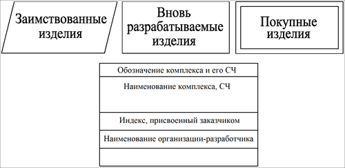

   - Уровень деления (раскрытия) изделия на СЧ зависит от сложности и спецификации изделия и устанавливается разработчиком изделия по согласованию с заказчиком. (см. ГОСТ 2.711‑82 п. 1.5)
   - Условные графические обозначения изделия и его СЧ должны быть соединены между собой сплошными тонкими линиями. Линии следует заканчивать стрелками (рисунок 2).
   - При необходимости продолжить графическую часть СД ка каком‑либо из последующих листов у соответствующего графического обозначения следует поместить надпись с номером листа (рисунок 2).
   - На каждую СЧ, разрабатываемую по ТТЗ (ТЗ), СД оформляется самостоятельным конструкторским документом, и ссылка на неё должна быть приведена в СД изделия в целом (на комплекс, аппарат и т.д.) как показано на рисунке 2. (см. ГОСТ 2.711‑82 п. 1.6)
   - Покупные и заимствованные СЧ изделия на СЧ более низкого уровня не делятся.

【**Рисунок 2.** Пример схемы деления】  
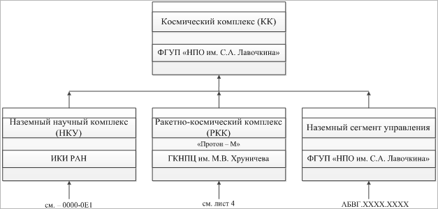

 

### Схема конструктивно‑силовая

<mark>TBD</mark>

 

### Схема осцилляторов
> <small>**Схема осцилляторов** — русскоязычный термин. **Oscillator circuit** — англоязычный эквивалент.</small>

**Схема осцилляторов** — [КД](doc.md), имеющий графическое представление, который определяет расположение основных [осцилляторов](mic.md) на изделии. Схема предназначена для создания вибродинамической модели и оценки влияния осцилляторов на управление, точность наведения и стабилизации КА.

Отдельно не регламентируется нормативной документацией; при создании схемы осцилляторов рекомендуется использовать общие требования к чертежам из [ГОСТ 2.109](гост_2_109.md).

 

### Схема пневмо‑гидравлическая

<mark>TBD</mark>

 

### Схема полей зрения
> <small>**Схема полей зрения** — русскоязычный термин, не имеющий аналога в английском языке. **Field of view draft** — дословный перевод с русского на английский.</small>

**Схема полей зрения** — [КД](doc.md), имеющий графическое представление, который определяет расположение и взаимное влияние [полей зрения](fov.md) оптических приборов на [изделии](unit.md). Схема предназначена для оценки выполнения требований оптических приборов по незатенению полей зрения приборов и для оптимизации расположения оптических приборов на КА.

Отдельно не регламентируется нормативной документацией; при создании схемы осцилляторов рекомендуется использовать общие требования к чертежам из [ГОСТ 2.109](гост_2_109.md).

 

### Схема программируемая логическая интегральная

<mark>TBD</mark>

 

### Схема членения
> <small>**Схема членения (СхЧ)** — русскоязычный термин, не имеющий аналога в английском языке. **Unit decomposition diagram / Unit exploded view** — дословный перевод с русского на английский.</small>

**Схема членения (СхЧ)**, также **схема технологического членения**, **схема разузлования** — [КД](doc.md), отсутствующий в НД и в ГОСТ 2.701 — определяющий логику деления [изделия](unit.md) на основные узлы, их входимость. Предлагается разрабатывать на основании [ГОСТ 2.711-82](гост_2_711_82.md) и относится к категории «[Схема](doc.md)».

Представляет собой изометрическое изображение изделия ([чертёж](drawing.md)) с разнесёнными в разные стороны основными узлами (частями) с указанием их обозначений.

 

### Схема электрическая
> <small>**Схема электрическая (СхЭ)** — русскоязычный термин. **Electrical interconnect diagram** — англоязычный эквивалент.</small>

**Электри́ческая схе́ма (СхЭ)** — документ, составленный в виде условных изображений или обозначений СЧ [изделия](unit.md), действующих при помощи электрической энергии, и их взаимосвязей. Эл. схемы являются разновидностью [схем изделия](doc.md) и обозначаются в шифре основной надписи буквой **Э**.

   1. Docs:
      - ГОСТ 2.701-2008 ЕСКД. Схемы. Виды и типы. Общие требования к выполнению.
      - ГОСТ 2.702-2011 ЕСКД. Правила выполнения электрических схем.
   1. <https://ru.wikipedia.org/wiki/Электрическая_схема>
   1. 2019.03.12 [Хабр: Схемы электрические. Типы схем ⎆](https://habr.com/ru/post/451158/)

Правила выполнения всех типов электрических схем установлены [ГОСТ 2.702](гост_2_702.md), при выполнении схем цифровой вычислительной техники руководствуются ГОСТ 2.708-81.

|*Тип схемы электрической*|*Определение*|*<small>Код типа</small>*|
|:--|:--|:--|
|Структурная|Определяет основные функциональные СЧ, их назначение и взаимосвязи|1|
|Функциональная|Разъясняет процессы, протекающие в отдельных функциональных цепях изделия или изделия в целом|2|
|Принципиальная (полная)|Определяет полный состав элементов и взаимосвязи между ними и, как правило, дающий полное (детальное) представления о принципах работы изделия (установки)|3|
|Соединений (монтажная)|Показывает соединения СЧ изделия (установки) и определяющий провода, жгуты, кабели или трубопроводы, которыми осуществляются эти соединения, а также места их присоединений и ввода (разъемы, платы, зажимы и т.п.)|4|
|Подключения|Показывает внешние подключения изделия|5|
|Общая|Определяет СЧ комплекса и соединения их между собой на месте эксплуатации|6|
|Расположения|Определяет относительное расположение СЧ изделия (установки), и, при необходимости, жгутов, проводов, кабелей, трубопроводов, световодов и т.п.|7|
|Объединённая|Содержит элементы различных типов схем одного вида|0|

Примечание — Наименования типов схем, указанные в скобках, устанавливают для электрических схем энергетических сооружений.

|*Схема электрическая*|<small>*Пример   (изображение)*</small>|
|:--|:--|
|**Структурная (Э1)**  Изображают основные функциональные СЧ (элементы, устройства, функц. группы) и основные взаимосвязи между ними. Графическое построение схемы должно обеспечивать наилучшее представление о последовательности взаимодействия функциональных частей в изделии. На линиях взаимосвязей рекомендуется стрелками обозначать направление хода процессов в изделии.|[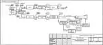](f/chart/eid_ru_01.webp)|
|**Функциональная (Э2)**  Изображают функциональные СЧ (элементы, устройства, функц. группы), участвующие в процессе, иллюстрируемом схемой, и связи между этими частями. Графическое построение схемы должно давать наглядное представление о последовательности процессов, иллюстрируемых схемой.|[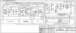](f/chart/eid_ru_02.webp)|
|**Принципиальная (полная) (Э3)**  Изображают все эл. элементы или устройства, необходимые для осуществления и контроля в изделии установленных эл. процессов, все эл. взаимосвязи между ними, а также эл. элементы (соединители, зажимы и т.д.), которыми заканчиваются вх/вых цепи. Допускается изображать элементы соединительные и монтажные, устанавливаемые по конструктивным соображениям. Схемы выполняют для изделий в отключённом положении.|[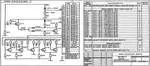](f/chart/eid_ru_03.webp)|
|**Соединений (монтажная) (Э4)**  Изображают все устройства и элементы, входящие в состав изделия, их вх/вых элементы (соединители, платы, зажимы и т.д.) и соединения между ними. Расположение изображений входных и выходных элементов или выводов внутри графических обозначений и устройств или элементов должно примерно соответствовать их действительному размещению в изделии.|[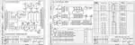](f/chart/eid_ru_04.webp)|
|**Подключения (Э5)**  Изображают изделие, его вх/вых элементы (соединители, зажимы и т.д.) и подводимые к ним концы проводов и кабелей внешнего монтажа, около которых помещают данные о подключении изделия (характеристики внешних цепей и/или адреса). Размещение изображений вх/вых элементов внутри графического обозначения изделия должно примерно соответствовать их действительному размещению. Следует указывать позиционные обозначения вх/вых элементов, присвоенные им на Э3.|[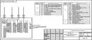](f/chart/eid_ru_05.webp)|
|**Общая (Э6)**  Изображают устройства и элементы, входящие в комплекс, а также провода, жгуты и кабели, соединяющие эти устройства и элементы. Расположение графических обозначений устройств и элементов на схеме должно примерно соответствовать их действительному размещению таковых.|[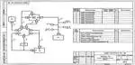](f/chart/eid_ru_06.webp)|
|**Расположения (Э7)**  Изображают СЧ изделия, а при необходимости связи между ними — конструкцию, помещение или местность, на которых эти СЧ будут расположены.|[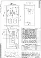](f/chart/eid_ru_07.webp)|
|**Объединённая (Э0)**  На Э0 изображают различные типы, которые объединяются между собой на одном чертеже.|[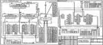](f/chart/eid_ru_08.webp)|

**<https://habr.com/ru/post/451158/>:**

> **oam2oam, 12 мая 2019 в 13:17**  
> Мне часто приходится разрабатывать электронные комплексы, и вот что получается — в действительности время сильно ограничено (рынок давит, китайцы на пятки наступают) и для не очень сложных (а они почти все такие) дел приходится использовать самый минимум схем — только чтобы получить рабочие данные для CAM… С другой стороны есть методология, например, model‑based Arcadia (реализация capella) — там совсем другой подход, но освоить пока не удалось…  
> И вот тут у меня сомнения — во‑первых, такое деление на схемы, как в статье, должно опираться на методологию — а она устарела, во‑вторых, поддерживаться ПО — но я не знаю ни одной системы, которая бы её поддерживала…  
> В результате год назад я столкнулся с такой ситуацией — инженер с одного очень серьёзного завода предложил разместить у них заказ. Я им отдал схему, gerber'ы — так вот они ещё 40 (!) дней дорисовывали и изукрашивали надписями эти документы, а потом только определились с ценой (по их словам, участвовало 27 человек!) — так я за эти 40 дней уже дважды провернул цикл разработки‑изготовления‑отладки и успел про них забыть…  
> И вот вопрос — как же быть в современных условиях?: Ведь даже отменно и по всем ГОСТам начерченная схема не сможет быть промоделирована и не позволит получить файлы CAM, если она сделана карандашом на ватмане…  
>> **SignallerK, 12 мая 2019 в 17:06**  
>> По моему в таких случаях необходимо применять принцип разумной достаточности, если иное не оговорено заказчиком или законом. Например, если устройство одно и монтируется по месту (читай хоббийный проект), то хватает принципиалки.  
>> А вот если устройств более одного, с монтажом на стороне… То возникают вопросы как это должно быть размещено, в каком порядке устанавливаться и соединяться — тут уже просится монтажная схема и схема соединений.  
>> Наконец, если устройство большое или состоит из нескольких модулей, то может оказаться, что принципиальная схема не читаема (в рамках одного листа), или не отвечает на более общие вопросы, типа как сигнал проходит по блокам. И тут нужна структурная или функциональная схема.  
>> Иногда получается применять простое правило — дать почитать КД человеку с ней незнакомому (но хотя бы с минимальным пониманием предмета). И спросить, например, как что соединяется, или как получить тот или иной результат. Вот тут‑то баги доки и проявляются.  
>> PS: Например  в ИТ хорошая практика — это дать почитать дизайн (тот что с бизнес‑логикой), девам и тестировщикам. При таком подходе внезапно выясняется, что «простое и очевидное» утверждение может по‑разному трактоваться разными людьми, и лучше его переделать.

> **wax_ru, 13 мая 2019 в 09:43**  
> Ну здесь ведь как: по сути на предприятиях используется три с половиной вида схем.  
> 1. Электрическая структурная — обычно её выполняет руководитель сектора/лаборатории/темы, чтобы вместе с ТЗ на разработку СЧ раздать непосредственным исполнителем схем принципиальных СЧ, ну или пояснять на всяких совещаниях чего он собрался наворотить. Смысл её в том, чтобы пояснить из каких СЧ будет состоять готовое изделие и как эти части между собой взаимодействуют. Часто эту схему потом пихают во всякие не конструкторские документы вроде пояснительных записок, расчётов надёжности, ЗИПа, спецфакторов и пр.  
> 2. Схема электрическая принципиальная — это схема основная. На ней показывают все СЧ и электрические связи между ними до элемента. Она делается на этапе РКД и является «Альфой» практически для всех остальных конструкторских документов. Когда сделана эта схема — начинают работать конструктора, писаться и готовится всякие расчёты, писать код программисты.  
> 3. Схема электрическая подключения/соединений — делается обычно сразу на этапе ТП и нужна в основном заказчику. Необходимость разработки этой схемы почти всегда указана в ТЗ. Смысл этих схем в том, что они показывают заказчику, как он будет подключаться к разработанному по ТЗ изделию. А разница между ними проста: схема электрическая подключения делается, если заказчику выдаётся некий моноблок, к которому надо подключиться, а соединений — если заказчику выдаётся несколько СЧ, которые нужно будет электрически соединить между собой.  
> Что касается остальных схем — то ни разу не слышал о том, чтобы их кто‑то действительно разрабатывал.

 

## ➂ Чертёж

### 3D- и Электронная модель
> <small> ・**3D-модель** — русскоязычный термин. **3D model** — англоязычный эквивалент.</small>  
> <small> ・**Электронная модель изделия (ЭМИЗ)** — русскоязычный термин, не имеющий аналога в английском языке. **Electronic model of product (EMOP)** — дословный перевод с русского на английский.</small>

**3D‑модель** — см. Электронная модель.

   1. 3D‑модель. [Пример ❐](f/doc/3d_sample.7z)
   1. 3D‑модель, отчёт о разработке. Пример. <mark>TBD</mark> Шаблон. <mark>TBD</mark>

**Электронная модель изделия (ЭМИЗ)**, она же 3D‑модель ─ [КД](doc.md), содержащий электронную геометрическую модель изделия, соответствующие электронные геометрические модели его СЧ, свойства, характеристики и другие данные, необходимые для сборки (изготовления) и контроля. В зависимости от стадии разработки включает в себя предельные отклонения размеров, шероховатости поверхностей и др. По [ГОСТ 2.052](гост_2_052.md):

   - В компьютерной среде ЭМИ представляется в виде набора данных, которые вместе определяют геометрию изделия и иные свойства, необходимые для изготовления и работ с изделием.
   - ЭМИ, как правило, состоит из геометрической модели изделия, произвольного количества атрибутов модели и может включать технические требования. ЭМИ должна содержать полный набор параметров согласно [ГОСТ 2.109](гост_2_109.md), необходимых для расчётов, моделирования и т.д.

Следующие электронные модели являются разновидностью ЭМИ и описываются [ГОСТ 2.052](гост_2_052.md):

   1. Электронная модель детали;
   1. Электронная модель сборочной единицы;
   1. Электронный макет.

 

### Чертёж габаритный (ГЧ)
> <small>**Габаритный чертёж (ГЧ)** — русскоязычный термин. **Mechanical interface control drawing (MICD), Dimensional drawing (DIDR)** — англоязычный эквивалент.</small>

**Габаритный чертёж (ГЧ)** ─ по [ГОСТ 2.102](гост_2_102.md) ─ [КД](doc.md), содержащий контурное (упрощённое) изображение изделия с габаритными, установочными и присоединительными размерами. По [ГОСТ 2.109](гост_2_109.md):

   1. ГЧ не предназначены для изготовления по ним изделий и не содержат данных для изготовления/сборки.
   1. Изображение выполняют с максимальными упрощениями. Изделие изображают так, чтобы были видны крайние положения перемещающихся/выдвигаемых/откидываемых частей/рычагов/кареток/крышек на петлях и т.п. Допускается не показывать элементы, выступающие за основной контур на незначительную величину по сравнению с размерами изделия.
   1. Количество видов должно быть минимальным, но достаточным, чтобы дать исчерпывающее представление о внешних очертаниях изделия, о положениях его выступающих частей (рычагов, маховиков, ручек, кнопок и т.п.), об элементах, которые должны быть постоянно в поле зрения (например, шкалах), о расположении элементов связи изделия с другими изделиями.
   1. Изображение изделия выполняют сплошными основными линиями, а очертания перемещающихся частей в крайних положениях — штрихпунктирными тонкими с двумя точками. Допускается крайние положения перемещающихся частей изображать на отдельных видах.
   1. Допустимо изображать сплошными тонкими линиями детали и сбор. единицы, не входящие в состав изделия.
   1. Наносят габаритные, установочные и присоединительные размеры изделия и, при необх., размеры, определяющие положение выступающих частей. Установочные и присоединительные размеры, необходимые для увязки с другими изделиями, должны быть указаны с предельными отклонениями. Допускается указывать координаты центра масс. Не указывают, что все размеры справочные.
   1. Допустимо указывать условия применения, хранения, транспортирования и эксплуатации при отсутствии этих данных в техническом описании, технических условиях или другом КД на изделие.
   1. **Для быстрого получения информации об изделии при отсутствии ЧОВ на НПО Лавочкина дополнительно требуют указывать на ГЧ следующую информацию, даже если требования к СЧ не заданы в ТЗ (требования пишутся в Исходных данных, ТЗ, либо задаются по месту):** <!--На НПОЛ заведена практика создания так называемых «документов для генералов», когда можно взять 1 ‑ 2 документа на СЧ и быстро понять её основные характеристики без необходимости розыска этих характеристик по толстому пакету документов. Приведённый ниже список рассмотрели и согласились представители конструкторов (Верин),...-->
      1. движущиеся части <!--…-->
      1. допустимое направление действия перегрузок <!--…-->
      1. зоны, типы расположения ЭВТИ, покрытий, и способы их крепления <!--…-->
      1. массово‑инерционные характеристики (подтверждаемые): центр масс прибора, моменты инерции в рабочем и транспортном положениях с допусками <!--…-->
      1. массу с допусками — в пункте № 1 ТУ чертежа, а в штампе — ссылку на пункт ТУ <!--ГОСТ 2.109 п. 1.1.12 говорит о том, что масса должна писаться в штампе; допускается указывать допуск на массу в ТУ чертежа, или писать массу с допусками в ТУ чертежа, давая ссылку в штампе. В связи с тем, что при переписывании массы в другие документы были зафиксированы ситуации, когда в один документ масса попадала с допусками, а в другой — без них, что в результате приводило к разночтениям на последующих этапах, решено унифицировать расположение массы на чертеже.-->
      1. масштаб <!--…-->
      1. материал и толщину корпуса и покрытий прибора <!--…-->
      1. место, способ крепления и момент затяжки крепежа <!--…-->
      1. металлизацию/заземление прибора — способ, точки, материалы <!--…-->
      1. оптико‑физические характеристики открытых поверхностей <!--…-->
      1. ориентацию, оси прибора (при необходимости) и их материализацию <!--…-->
      1. режимы работы прибора <!--…-->
      1. режимы температурные посадочных мест <!--…-->
      1. режимы температурные прибора во время дегазации <!--…-->
      1. степень герметичности прибора <!--(Не)герметичность прибора может стать причиной ряда отказов или ухудшения характеристик. Например, несмотря на то, что приборы обычно дегазируют, это не отменяет того факта, что внутри у них находятся элементы, испаряющиеся быстрее корпуса.  В случае нештатной ситуации это может быть одной из её причин. Или негерметичные зоны могут стать причиной коротких замыканий. Поэтому решено указывать степень герметичности в бинарном виде.-->
      1. съёмные элементы, снимаемые перед установкой прибора на КА и до пуска <!--…-->
      1. тепловыделение прибора (упрощённая циклограмма, либо разброс значений), площадь теплопроводящей поверхности и распределение тепла <!--…-->
      1. термическое сопротивление между посадочным местом прибора и конструкцией КА <!--…-->
      1. термодатчики — места расположения, количество, тип <!--…-->
      1. требования к посадочным местам прибора и установочной поверхности <!--…-->
      1. электропотребление прибора (упрощённая циклограмма, либо разброс значений) <!--…-->

 

<big><u>**ENG**</u></big>

For each OE, a general drawing shall be provided containing a contour (simplified) image of the OE with general, installation & connection dimensions, keeping in mind that:

   1. The drawing is not intended for the manufacture of the OE & does not contain data for manufacture/assembly.
   1. The drawing is performed with maximum simplifications. The product is depicted so that the extreme positions of the moving/extending/folding parts/levers/carriages/hinged covers, etc. are visible. It’s allowed not to show elements that protrude beyond the main contour by an insignificant amount in comparison with the dimensions of the OE.
   1. The number of views shall be minimal, but sufficient to give a comprehensive idea of ​​the external outlines of the product, the positions of its protruding parts (levers, handwheels, handles, buttons, etc.), the elements that should be constantly in the field of view (for example, scales), on the location of the elements of connection of the OE with other OE.
   1. The image of the OE is performed with solid main lines, & the outlines of the moving parts in the extreme positions are dash‑dotted thin with two dots. It is allowed to depict the extreme positions of the moving parts in separate views. It’s permissible to depict parts & assembly units that are not part of the OE with solid thin lines.
   1. Indicate the overall, installation & connection dimensions of the OE and, if necessary, the dimensions that determine the position of the protruding parts. Installation & connection dimensions required for linking with other units must be indicated with maximum allowed deviations. It is allowed to indicate the coordinates of the center of mass. Do not indicate that all sizes are for reference.
   1. It’s permissible to indicate the conditions of use, storage, transportation & operation in the absence of these data in the technical description, specifications or other design documentation for the OE.
   1. **To obtain full information about a OE, it’s additionally required to indicate:**
      1. allowed direction of overloads
      1. grade of tightness of the OE
      1. heat dissipation of the OE’s (simplified timeline, or the spread of values), the area of ​​the heat‑conducting surface & the distribution of heat
      1. mass with tolerances — in stamp
      1. mass‑inertial characteristics, center of mass of the OE in working & transport positions
      1. material & thickness of the OE’s body & coatings of the device
      1. metallization/grounding of the OE — method, points, materials
      1. moving parts
      1. operating modes of the OE
      1. optical‑physical characteristics of open surfaces
      1. orientation of the OE, it’s axes (if needed) & their materialization
      1. place, method of fastening & tightening torque of fasteners
      1. power consumption of the device (simplified timeline, or the spread of values)
      1. requirements for the seats of the OE & the mounting surface
      1. scale of the drawing
      1. technological units removed before installing the OE on the SC & before launch
      1. temperature modes of seats
      1. temperature modes of the OE during degassing
      1. thermal resistance between the OE seat & the SC structure
      1. thermal sensors — location, quantity, type
      1. zones, types of location of MLI, coatings, & methods of their fastening

 

### Чертёж монтажный
> <small>**Монтажный чертёж (МЧ)** — русскоязычный термин. **Installation drawing** — англоязычный эквивалент.</small>

**Монтажный чертёж (МЧ)** — по [ГОСТ 2.102](гост_2_102.md) — документ, содержащий контурное (упрощённое) изображение [изделия](unit.md), а также данные, необходимые для его установки (монтажа) на месте применения. К монтажным чертежам также относят чертежи фундаментов, специально разрабатываемых для установки изделия.

 

### Чертёж общего вида (ЧОВ)
> <small>**Чертёж общего вида (ЧОВ)** — русскоязычный термин. **Technical drawing (drafting / drawing) (TD)** — примерный англоязычный эквивалент.</small>

**Чертёж общего вида (ЧОВ)** — [КД](doc.md), имеющий графическое представление, который определяет конструкцию того или иного узла/агрегата. Из него становится ясно, каким образом взаимодействуют его основные компоненты, каков общий принцип функционирования устройства. ЧОВ содержит:

   1. Сечения, разрезы, виды и другие изображения, которые дают полное представление о том, каким образом сконструировано изделие и каким образом взаимодействуют его СЧ.
   1. Номера, которые имеют отдельные компоненты устройства.
   1. Информация, описывающая состав технического изделия и включающая в себя марки деталей и конструкционных материалов, наименования основных СЧ и их обозначения.
   1. Справочные, присоединительные, установочные и габаритные размеры.
   1. Основная надпись.
   1. Допускается указывать требования к СЧ или производству.

**По [ГОСТ 2.118](гост_2_118.md):** общий вид изделия может быть выполнен в виде бумажного КД (чертёж общего вида) и в виде ЭМСЕ, выполняемой по [ГОСТ 2.502](гост_2_502.md). В общем случае они должны содержать:

   1. изображения вариантов изделия, текстовую часть и надписи, необходимые для сопоставления рассматриваемых вариантов, и установления требований к разрабатываемому изделию, а также позволяющие получить представление о компоновочных и основных конструктивных исполнениях изделия, взаимодействии его основных СЧ и принципе работы;
   1. наименования/обозначения (если они имеются) тех СЧ изделия, для которых необходимо указать данные (тех.характеристики, количество и др.) или запись которых необходима для пояснения изображений ЧОВ или ЭМСЕ; описания принципа работы изделия, указания о его составе и др.;
   1. размеры и другие наносимые на изображение данные (при необходимости);
   1. схему (электрическую, гидравлическую и др.), если она необходима, но оформлять её отдельным документом нецелесообразно;
   1. тех.характеристики изделия, если это необходимо для удобства сопоставления вариантов по ЧОВ или ЭМСЕ. В этом случае тех.характеристики в пояснительной записке можно не приводить, а сделать ссылку на ЧОВ или ЭМСЕ. При выполнении ЧОВ в виде ЭМСЕ, рекомендуется модели отдельных СЧ изделия размещать в отдельных файлах.

Изображения следует выполнять с макс.упрощениями, предусмотренными ЕСКД. Допускается:

   1. изображать контурными очертаниями любые СЧ;
   1. изображать только те СЧ, которые рассматриваются при сопоставлении вариантов;
   1. не показывать связи между СЧ, если они не рассматриваются при сопоставлении вариантов.

Наименования и обозначения СЧ изделия на ЧОВ следует указывать одним из следующих способов:

   1. на полках линий‑выносок;
   1. в таблице, размещаемой на том же листе, что и изображение изделия. В этом случае на полках линий‑выносок указывают номера позиций составных частей, включенных в таблицу.
   1. Таблица, в общем случае, должна состоять из граф: «Поз.», «Обозначение», «Наименование», «Кол.», «Дополнительные указания».
   1. В ЭМСЕ рекомендуется наименования/обозначения СЧ указывать на полках линий‑выносок, применять одновременно отображение ЭСИ (вместо таблицы) и его эл.модели, обеспечив возможность подсветки (выделения) СЧ эл.модели при указании соответствующего элемента ЭСИ. Элементы ЧОВ/ЭМСЕ (номера позиций, текст тех.требований, надписи и др.) выполнять по ЕСКД.

 

### Чертёж сборочный
> <small>**Сборочный чертёж** — русскоязычный термин. **Assembly drawing** — англоязычный эквивалент.</small>

**Сборочный чертёж** ─ по [ГОСТ 2.102](гост_2_102.md) — [КД](doc.md), содержащий изображение сборочной единицы и другие данные, необходимые для её сборки (изготовления) и контроля. К сборочным чертежам также относят чертежи, по которым выполняют гидромонтаж и пневмомонтаж.

**По [ГОСТ 2.109](гост_2_109.md) п.3:** количество сборочных чертежей должно быть минимальным, но достаточным для рациональной организации производства (сборки и контроля) изделий. При необходимости на сборочных чертежах приводят данные о работе изделия и о взаимодействии его СЧ.

Сборочный чертёж должен содержать:

   1. изображение сборочной единицы, дающее представление о расположении и взаимной связи СЧ, соединяемых по данному чертежу, и обеспечивающее возможность осуществления сборки и контроля сборочной единицы. Допускается на сборочных чертежах помещать дополнительные схематические изображения соединения и расположения СЧ;
   1. размеры, предельные отклонения и другие параметры и требования, которые должны быть выполнены или проконтролированы по данному сборочному чертежу. Допускается указывать в качестве справочных размеры деталей, определяющие характер сопряжения;
   1. указания о характере сопряжения и методах его осуществления, если точность сопряжения обеспечивается не заданными предельными отклонениями размеров, а подбором, пригонкой и т.п., а также указания о выполнении неразъёмных соединений (сварных, паяных и др.);
   1. номера позиций составных частей, входящих в изделие;
   1. габаритные размеры изделия;
   1. установочные, присоединительные и другие необходимые справочные размеры;
   1. техническую характеристику изделия (при необходимости);
   1. координаты центра масс (при необходимости).

 

### Чертёж теоретический (ТЧ)
> <small>**Теоретический чертёж (ТЧ)** — русскоязычный термин. **Sheer drawing** — англоязычный эквивалент.</small>

**Теоретический чертёж (ТЧ)** ─ по [ГОСТ 2.102](гост_2_102.md) — [КД](doc.md), определяющий геометрическую форму (контур) изделия и координаты расположения составных частей. Разрабатывается в соответствии с [ГОСТ 2.419](гост_2_419.md).

 

### Чертёж упаковочный
> <small>**Упаковочный чертёж (УЧ)** — русскоязычный термин. **Packing drawing** — примерный англоязычный эквивалент.</small>

**Упаковочный чертёж (УЧ)** — по ГОСТ 2.418 — [КД](doc.md), содержащий данные, необходимые для выполнения упаковывания изделия.

ГОСТом предусматривается 3 варианта оформления КД на упаковку:

   - **Вариант А**. Показать всё на сборочном чертеже. Этот вариант обычно выбирают, когда конструкция тары (и способ упаковки) не сложная и изображение упаковываемого изделия не затрудняет понимание того, как собрать саму тару.
   - **Вариант Б**. Размещение изделия в таре показывается на специальном чертеже, который называется «Упаковочный чертёж». Этот вариант обычно выбирают, когда конструкция тары (и способ упаковки) сложная и изображение упаковываемого изделия на сборочном чертеже тары затруднит понимание того, как собрать саму тару.
   - **Вариант В**. Разрабатывается КД со своим обозначением, которую называют «Изделие в упаковке». В этом КД упаковывание показывают на сборочном чертеже. Этот вариант рекомендуется использовать для упаковки отдельных деталей или комбинации специфицированных изделий и отдельных деталей.

 

### Чертёж электромонтажный
> <small>**Электромонтажный чертёж (МЭ)** — русскоязычный термин. **Electric assembly drawing** — англоязычный эквивалент.</small>

**Электромонтажный чертёж (МЭ)** — по [ГОСТ 2.102](гост_2_102.md) — документ, содержащий данные, необходимые для выполнения электрического монтажа [изделия](unit.md). Разрабатывается в соответствии с [ГОСТ 2.413](гост_2_413.md).

 

## Docs & links (TRANSLATEME ALREADY)
|Navigation|
|:--|
|**[FAQ](faq.md)**【**[SCS](scs.md)**·КК, **[SC (OE+SGM)](sc.md)**·КА】**[CON](contact.md)·[Pers](person.md)**·Контакт, **[Ctrl](control.md)**·Упр., **[Doc](doc.md)**·Док., **[Drawing](drawing.md)**·Чертёж, **[EF](ef.md)**·ВВФ, **[Error](error.md)**·Ошибки, **[Event](event.md)**·События, **[FS](fs.md)**·ТЭО, **[HF&E](hfe.md)**·Эрго., **[KT](kt.md)**·КТ, **[N&B](nnb.md)**·БНО, **[Project](project.md)**·Проект, **[QM](qm.md)**·БКНР, **[R&D](rnd.md)**·НИОКР, **[SI](si.md)**·СИ, **[Test](test.md)**·ЭО, **[TRL](trl.md)**·УГТ, **[Way](way.md)**·Пути|
|*Sections & pages*|
|**【[Documents](doc.md)】**  **Схема:** [КСС](ксс.md)・ [ПГС](пгс.md)・ [ПЛИС](плис.md)・ [СхД](drawing.md)・ [СхО](drawing.md)・ [СхПЗ](drawing.md)・ [СхЧ](drawing.md)・ [СхЭ](drawing.md)  [Interface](interface.md)・ [Mission proposal](proposal.md)|

   1. Docs: …
   1. <http://gk-drawing.ru/plotting/general-view-drawing.php>

