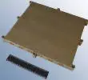
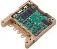
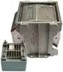

# Data storage (a list)
> 2019.07.31 [🚀](../index/index.md) [despace](index.md) → [Sensor](sensor.md)

[TOC]

---

A list of [Data storage](ds.md) units.

## Current

 

### OBMU
> <small>**SAIT On-board Memory Unit (OBMU)** — англоязычный термин, не имеющий аналога в русском языке. **Бортовой модуль памяти НПП Саит (OBMU)** — дословный перевод с английского на русский.</small>

**SAIT On-board Memory Unit (OBMU)** — постоянное запоминающее устройство (ПЗУ) на основе твердотельного накопителя для хранения цифровой информации.  
*Разработчик:* [НПП Саит](contact/sait_ltd.md). Разработано ранее 2013 года активное применение

|*Characteristics*|*[Value](si.md)  (OBMU)*|
|:-|:-|
|Composition|Single unit|
|Consumption, W|12 чтение/запись, 0 в простое|
|Dimensions, ㎜|292 × 264 × 27|
|[Interfaces](interface.md)|[LVDS](lvds.md). Four ports with 4 pairs each (primary data/clock, redundant data/clock, spare). [MIL-STD-1553](mil_std_1553.md)/[CAN-2B](can.md) (dual redundant buses). 2 [RS-422](rs_xxx.md) for external devices control|
|[Lifetime](lifetime.md)/Resource, h(y)|… / 61 320 (7)|
|Mass, ㎏| |
|[Overload](vibration.md), Grms| |
|[Rad.resist](ion_rad.md), ㏉ (㎭)|60 (6 000) при Al 1.5 g/㎝², ≥40 МэВ·㎝²/㎎|
|[Reliability](qm.md) per [lifetime](lifetime.md)|0.995|
|[Thermal range](tcs.md), ℃|–20 ‑ +50|
|[TRL](trl.md)|9|
|[Voltage](sps.md), V|27 (22 ‑ 35)|
|**【Specific】**|• • •|
|Algorithms (compr.)| |
|Algorithms (encryp.)| |
|Bitrate, Mbit/s (㎆/s)|1 228 (153.6) write, 800 (100) read|
|Capacity, Mbit (㎆)|1 048 576 (131 072)|
|Cycles of rewrite| |
|Inputs|4|
| ||

**Notes:**

   1. [OBMU Datasheet ❐](f/comms/s/sait_obmu_datasheet.pdf)
   1. **Applicability:** Ресурс‑П

 

### Sirius TCM
> <small>**Sirius TCM** — англоязычный термин, не имеющий аналога в русском языке. **Сириус ТСМ** — дословный перевод с английского на русский.</small>

**Sirius TCM** — постоянное запоминающее устройство (ПЗУ) на основе твердотельного накопителя для хранения цифровой информации.  
Разработчик [AAC CS](contact/aac_cs.md). Разработано ранее 2019 года активное применение

|*Characteristics*|*[Value](si.md)  (Sirius TCM)*|
|:-|:-|
|Composition| |
|Consumption, W|1.3|
|Dimensions, ㎜|96 × 91 × 18|
|[Interfaces](interface.md)|2 [SpaceWire](spacewire.md) 50 Mbps, 3 [RS-422](rs_xxx.md) / [RS-485](rs_xxx.md) UARTs, 2 RS-485-only UARTs, 1 PSS Interface RS-485 PPS input|
|[Lifetime](lifetime.md)/Resource, h(y)|НОО: 43 800 (5)|
|Mass, ㎏|0.134|
|[Overload](vibration.md), Grms| |
|[Rad.resist](ion_rad.md), ㏉ (㎭)|300 (30 000)|
|[Reliability](qm.md) per [lifetime](lifetime.md)| |
|[Thermal range](tcs.md), ℃|−30 ‑ +60|
|[TRL](trl.md)|9|
|[Voltage](sps.md), V|4.5 ‑ 16|
|**【Specific】**|• • •|
|Algorithms (compr.)| |
|Algorithms (encryp.)| |
|Bitrate, Mbit/s (㎆/s)| |
|Capacity, Mbit (㎆)|262 144 (32 768)|
|Cycles of rewrite| |
|Inputs| |
| ||

**Notes:**

   1. [Sirius TCM Datasheet ❐](f/comms/s/sirius_tcm_datasheet.pdf)
   1. **Applicability:** …

 

### SSR
**Solid State Recorder (SSR)** *(твердотельное записывающее устройство)* ─ постоянное запоминающее устройство (ПЗУ) на основе твердотельного накопителя для хранения цифровой информации.  
*Разработчик:* [ADS](contact/ads.md). Разработано в 1990 году. Активное применение.

|*Characteristics*|*[Value](si.md)  (SSR)*|
|:-|:-|
|Consumption, W|10 ‑ 100|
|Dimensions, ㎜|300 ‑ 600 × 250 × 250|
|[Interfaces](interface.md)|[SpaceWire](spacewire.md), [LVDS](lvds.md) link, [МКО](mil_std_1553.md), Wizard Link, Channel Link, GigaLink, [RS-422](rs_xxx.md) UART, Parallel|
|[Lifetime](lifetime.md)/Resource, h(y)|[НОО](nnb.md): 131 400 (15) / …|
|Mass, ㎏|8 ‑ 20|
|[Overload](vibration.md), Grms| |
|[Rad.resist](ion_rad.md), ㏉ (㎭)|400 (40 000)|
|[Reliability](qm.md) per [lifetime](lifetime.md)|0.99 за 7 лет на орбите|
|[Thermal range](tcs.md), ℃|−25 ‑ +60 при работе; −40 ‑ +75 при простое|
|[TRL](trl.md)|9|
|[Voltage](sps.md), V| |
|**【Specific】**|• • •|
|Algorithms (compr.)|JPEG, WAVELET, [CCSDS](ccsds.md) 122 BPE, BAQ, FFT BAQ, advanced BAQ|
|Algorithms (encryp.)|TRIPLE‑DES, AES и пр. для передачи информации (до 600 Мбит/с)|
|Bitrate, Mbit/s (㎆/s)|8 192 (1 024)|
|Capacity, Mbit (㎆)|1 024 ‑ 20 480 (128 ‑ 2 560)|
|Cycles of rewrite| |
|Inputs| |

**Notes:**

   1. [Solid Space Recorders for space applications ❐](f/ds/ssr_ens_5_ssr_2014_bd.pdf) (ADS, 2014 год)
   1. <http://www.space-airbusds.com/en/equipment/ssr-solid‑state-recorders-for-space-applications.html>
   1. Устройство имеет в своём составе микропроцессор со средствами управления и диагностики памяти в ЗУ.
   1. **Applicability:** [Chandrayaan-1](chandrayaan_1.md)・ [Chang'E-1](chang_e_1.md)・ [LRO](lunar_reconnaissance_orbiter.md)

 

### SZI-M
> <small>**СЗИ-М** — RU term w/o analogues in English. **SZI-M** — literal EN translation.</small>

**СЗИ‑М** ─ постоянное [запоминающее устройство](ds.md) (ПЗУ). Система сбора, регистрации и хранения информации от датчико‑преобразующей аппаратуры, информации БЦВМ, речевой информации. СЗИ‑М обеспечивает спасение информации при воздействии удара (скорость встречи с преградой 150 ㎧) и высокой температуры (+700 ℃ в течение 30 минут) («черный ящик»).  
Разработчик [НПО ИТ](contact/npoit.md).  

|*Characteristics*|*[Value](si.md)  (СЗИ-М)*|
|:-|:-|
|Composition|3 блока:  устройство преобразования УП‑М — 2 шт. (с возможностью расширения до 8);  устройство накопителя УН‑М в ударотеплозащищённом корпусе — 1 шт.|
|Consumption, W|18.85 (9 — каждый УП‑М; 0.85 — УН‑М)|
|Dimensions, ㎜| |
|[Interfaces](interface.md)|[МКО](mil_std_1553.md) (2 дублированных), 1 вход регистрации речевой аналоговой информации до 4 500 ㎐|
|[Lifetime](lifetime.md)/Resource, h(y)|… / 105 120 (12)|
|Mass, ㎏|11.8 (1.65 — каждый УП‑М; 8.5 — УН‑М)|
|[Overload](vibration.md), Grms| |
|[Rad.resist](ion_rad.md), ㏉ (㎭)| |
|[Reliability](qm.md) per [lifetime](lifetime.md)| |
|[Thermal range](tcs.md), ℃| |
|[TRL](trl.md)|9|
|[Voltage](sps.md), V|… — для УП‑М; +4.75 — для УН‑М|
|**【Specific】**|• • •|
|Algorithms (compr.)| |
|Algorithms (encryp.)| |
|Bitrate, Mbit/s (㎆/s)|2 (0.25)|
|Capacity, Mbit (㎆)|32 768 (4 096)|
|Cycles of rewrite|100 000|
|Inputs|до 32 — регистрации температурной информации с опросом до 100 Гц;  до 256 — регистрации параметров с опросом от 25 до 2 000 Гц;  увеличение частоты опроса до 32 000 Гц при соответствующем сокращении количества опрашиваемых входов|
| ||

**Notes:**

   1. [Чертёж ❐](f/ds/s/szi-m_sketch1.webp)
   1. <http://www.npoit.ru/products/telemetricheskie-sistemy/sistema-zapominaniya-informatsii-szi-m>
   1. **Applicability:** …

 

## Archive

 

## Docs & links (TRANSLATEME ALREADY)
|Navigation|
|:-|
|**[FAQ](faq.md)**【**[SCS](scs.md)**·КК, **[SC (OE+SGM)](sc.md)**·КА】**[CON](contact.md)·[Pers](person.md)**·Контакт, **[Ctrl](control.md)**·Упр., **[Doc](doc.md)**·Док., **[Drawing](drawing.md)**·Чертёж, **[EF](ef.md)**·ВВФ, **[Error](error.md)**·Ошибки, **[Event](event.md)**·События, **[FS](fs.md)**·ТЭО, **[HF&E](hfe.md)**·Эрго., **[KT](kt.md)**·КТ, **[N&B](nnb.md)**·БНО, **[Project](project.md)**·Проект, **[QM](qm.md)**·БКНР, **[R&D](rnd.md)**·НИОКР, **[SI](si.md)**·СИ, **[Test](test.md)**·ЭО, **[TRL](trl.md)**·УГТ, **[Way](way.md)**·Пути|
|*Sections & pages*|
|**`Запоминающее устройство (ЗУ):`**  [5D optical data storage](ds.md)  • • •  **Европа:** [SSR](ds_lst.md) (8)・ [Sirius TCM](ds_lst.md) (0.14)  ▮  **РФ:** [СЗИ-М](ds_lst.md) (11.8)・ [OBMU](ds_lst.md) (1.8)|

   1. Docs: …
   1. …
