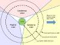

# NASA Deep Space Network
> 2019.05.12 **[🚀](../index/index.md) [despace](index.md)** → [JPL](zz_jpl.md), [NASA](zz_nasa.md), **[НС](scs.md)**

[TOC]

---

> <small>*Термины:* **NASA Deep Space Network** — англоязычный термин, не имеющий аналога в русском языке. **Сеть дальней космической связи НАСА** — дословный перевод с английского на русский.</small>

**Сеть дальней космической связи НАСА** — международная сеть радиотелескопов и средств связи, используемых как для радиоастрономического исследования Солнечной системы и Вселенной, так и для управления межпланетными космическими аппаратами.

DSN является частью [Лаборатории реактивного движения НАСА](zz_jpl.md). Аналогами этой сети можно назвать сеть ESTRACK Европейского центра управления космическими полётами (ЕКА), Восточный центр дальней космической связи в России, а также китайский и индийский центры дальней космической связи.

|*Расположение станций*|*Охват сферы*|
|:--|:--|
|   |   |

**Инструменты:**

   - **Голдстоун** (Калифорния, США) — радиообсерватория, планетный радар. [Bands](rf.md): <mark>TBD</mark>
   - **Мадридский комплекс дальней космической связи** (Робледо‑де‑Чавела, Испания) — радиообсерватория. [Bands](rf.md): **L** (↓), **S** (↑/↓), **X** (↑/↓).
   - **Комплекс дальней космической связи в Канберре** (Австралия) — радиообсерватория. [Bands](rf.md): <mark>TBD</mark>

 

## Docs & links (TRANSLATEME ALREADY)
|…°·•¹²³±×÷≤≥≈≠ ‑ −— ⎆✉ ❐“”’«»✔→✘☐☑├┕┆ 1 lb = 0.453592 kg; 1 g = 9.80665 m/s²|
|:--|
|<small>**[FAQ](faq.md)**, **[Cable](cable.md)**·БКС, **[Camera](camera.md)**·Камера, **[Comms](comms.md)**·Радио, **[Contact](contact.md)**·Контакт, **[Control](control.md)**·Управ., **[Doc](doc.md)**·Док., **[Doppler](doppler.md)**·ИСР, **[DS](ds.md)**·ЗУ, **[EB](eb.md)**·ХИТ, **[ECO](ecology.md)**·Экол., **[EF](ef.md)**·ВВФ, **[ElC](elc.md)**·ЭКБ, **[EMC](emc.md)**·ЭМС, **[Errors](error.md)**·Ошибки, **[Events](event.md)**·События, **[FS](fs.md)**·ТЭО, **[Fuel](fuel.md)**·Топливо, **[GNC](gnc.md)**·БКУ, **[GS](scs.md)**·НС, **[HF&E](hfe.md)**·Эрго., **[IU](iu.md)**·Гиро., **[KT](kt.md)**·КТЕХ, **[LAG](lag.md)**·ПУC, **[LES](les.md)**·САСП, **[LS](ls.md)**·СЖО, **[LV](lv.md)**·РН, **[MCC](mcc.md)**·ЦУП, **[Model](model.md)**·Модель, **[MSC](sc.md)**·ПКА, **[N&B](nnb.md)**·БНО, **[NR](nr.md)**·ЯР, **[OBC](obc.md)**·ЦВМ, **[OE](oe.md)**·БА, **[Pat.](патент.md)**·Патент, **[Project](project.md)**·Проект, **[PS](ps.md)**·ДУ, **[QA](quality.md)**·QA, **[R&D](rnd.md)**·НИОКР, **[RAMS](rams.md)**·НиБ, **[Risk](risk.md)**·Риск, **[Robot](robotics.md)**·Робот, **[Rover](rover.md)**·Планетоход, **[RTG](rtg.md)**·РИТЭГ, **[SARC](sarc.md)**·ПСК, **[Sensor](sensor.md)**·Датчик, **[SC](sc.md)**·КА, **[SCS](scs.md)**·КК, **[SGM](sgm.md)**·КММ, **[SI](si.md)**·СИ, **[Soft](soft.md)**·ПО, **[SP](sp.md)**·БС, **[Spaceport](spaceport.md)**·Космодром, **[SPS](sps.md)**·СЭС, **[SSS](sss.md)**·ГЗУ, **[TCS](tcs.md)**·СОТР, **[Test](test.md)**·ЭО, **[Timeline](timeline.md)**·Циклограмма, **[TMS](tms.md)**·ТМС, **[TOR](tor.md)**·ТЗ, **[TRL](trl.md)**·УГТ</small>|
|*Sections & pages*|
|**`Наземная станция (НС):`**  …    [CDSN](cdsn.md) ┊ [DSN](dsn.md) ┊ [ESTRACK](estrack.md) ┊ [IDSN](idsn.md) ┊ [SSC_GGSN](ssc_ggsn.md) ┊ [UDSC](udsc.md) |

   1. Docs: …
   1. Notable interwikies — …
   1. <https://en.wikipedia.org/wiki/NASA_Deep_Space_Network>
   1. <https://ru.wikipedia.org/wiki/Сеть_дальней_космической_связи_НАСА>
   1. <https://deepspace.jpl.nasa.gov/>
   1. <https://eyes.nasa.gov/dsn/dsn.html>

