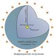
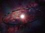
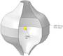

# Сфера Дайсона
> 2019.05.12 [🚀](../index/index.md) [despace](index.md) → [Project](project.md)

[TOC]

---

> <small>**Сфера Дайсона** — русскоязычный термин. **Dyson sphere** — англоязычный эквивалент.</small>

**Сфе́ра Да́йсона** — гипотетический [астроинженерный проект](project.md), предложенный Фрименом Дайсоном, представляющий собой относительно тонкую сферическую оболочку большого радиуса (порядка радиуса планетных орбит) со звездой в центре.

Предполагается, что технологически развитая цивилизация может применять подобное сооружение для максимально возможного использования энергии центральной звезды и/или для решения проблемы жизненного пространства. Согласно теоретическим расчётам, для сооружения сферы Дайсона вокруг Солнца необходимо вещество с массой порядка массы Юпитера.

|<small>*Оболочка Дайсона (англ. Dyson shell),  вариант сферы Дайсона, с радиусом  в 1 астрономическую единицу*</small>|<small>*Кольцо Нивена*</small>|<small>*Сфера Дайсона — вариант с  поверхностями постоянного абсолютного  значения вектора ускорения свободного  падения (модель показана с сечением)*</small>|
|:--|:--|:--|
||||

## Критика
Сфера Дайсона должна быть приведена во вращение вокруг центральной оси, чтобы центробежная сила уравновесила силу притяжения центрального светила. Однако, так как центробежная сила достигает максимума на экваторе и равна 0 на полюсах вращающегося тела, на полюсах сферы Дайсона ничто не уравновешивает силы притяжения центрального светила. В результате сфера будет неизбежно разрушена.

Станислав Лем в «Сумме технологии» показал, что сооружение сферы для решения проблем жизненного пространства квадриллионов разумных существ бессмысленно с точки зрения логики и социологии, так как на алтарь «свободы неограниченного размножения» (которая непонятно почему должна остаться неприкосновенной, вместо её ограничения) нужно возложить множество других свобод (например, свободу передвижений, выбора профессии и т. п.), что в итоге привело бы к краху культурных ценностей и было бы извращением идеи прогресса, который предполагает их увеличение, а не уменьшение. Также Лем скептически настроен по отношению к возможности существования монокультуры с населением порядка нескольких квадриллионов. Автор считал сферу Дайсона одним из наиболее поразительных примеров ортоэволюционной экстраполяции развития технологии (то есть относящейся к гипотезам, согласно которым будущее — это лишь приумноженное настоящее).

## Модификации
Для предупреждения угрозы саморазрушения сферы, идея изменения её конструкции была развита в нескольких вариантах:

   - Жёсткое кольцо относительно небольшой ширины (порядка процентов диаметра) — см. Кольцо Нивена.
   - Жёсткое широкое экваториальное кольцо, разомкнутое вблизи полюсов и изогнутое по поверхности постоянного абсолютного значения вектора ускорения свободного падения, так что вес пробного тела одинаков в любой точке на внутренней стороне Сферы. Такая поверхность напоминает по форме игрушку‑волчок с центральным утолщением. Большее притяжение звезды вблизи экватора компенсируется центробежной силой за счёт большей линейной скорости вращения в неинерциальной системе отсчёта; в высоких широтах в связи с уменьшением гравитационного воздействия звезды требуются меньшие центробежная сила и радиус сечения плоскостью, перпендикулярной к оси вращения. Данная поверхность не является эквипотенциальной для гравитационного поля (складывающегося из гравитационного поля звезды и поля центробежной силы) в собственной вращающейся системе отсчёта конструкции, поэтому сила тяжести направлена не по нормали к поверхности. Однако внутренняя сторона Сферы может быть сконструирована в виде концентрических террас, а не гладкой, так чтобы локальное отклонение силы тяжести от нормали к поверхности террасы не превышало заданного значения.
   - Раковина Покровского — модификация, предложенная советским учёным Г.И. Покровским, представляющая собой совокупность колец.
   - Структура Крисвелла — развитие идеи Сферы Дайсона, но с фрактальной поверхностью для максимизации площади, воспринимающей излучение звезды поверхности.

Все такие варианты уже нельзя называть «сферой», но такое общее название сохраняется исторически.

 

## Docs & links (TRANSLATEME ALREADY)
|Navigation|
|:--|
|**[FAQ](faq.md)**【**[SCS](scs.md)**·КК, **[SC (OE+SGM)](sc.md)**·КА】**[CON](contact.md)·[Pers](person.md)**·Контакт, **[Ctrl](control.md)**·Упр., **[Doc](doc.md)**·Док., **[EF](ef.md)**·ВВФ, **[Error](error.md)**·Ошибки, **[Event](event.md)**·События, **[FS](fs.md)**·ТЭО, **[HF&E](hfe.md)**·Эрго., **[KT](kt.md)**·КТ, **[Model](model.md)**·Модель, **[N&B](nnb.md)**·БНО, **[Patent](патент.md)**·Пат., **[Project](project.md)**·Проект, **[QM](qm.md)**·БКНР, **[R&D](rnd.md)**·НИОКР, **[SI](si.md)**·СИ, **[Test](test.md)**·ЭО, **[TRL](trl.md)**·УГТ, **[Way](way.md)**·Пути|
|*Sections & pages*|
|**【】**  <mark>NOCAT</mark>|

   1. Docs: …
   1. Notable interwikies — …
   1. <https://en.wikipedia.org/wiki/Dyson_sphere>
   1. <https://ru.wikipedia.org/wiki/Сфера_Дайсона>
