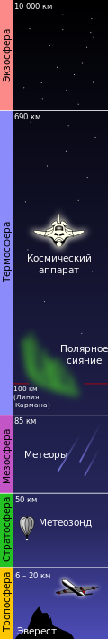

# Атмосфера Земли
> 2019.05.12 [🚀](../index/index.md) [despace](index.md) → [ВВФ](ef.md), [Земля](earth.md)

[TOC]

---

> <small>*Термины:* **Атмосфе́ра Земли** — русскоязычный термин. **Atmosphere of Earth** — англоязычный эквивалент.</small>

**Атмосфе́ра Земли** *(от. др.-греч. ἀτμός — пар и σφαῖρα — шар)* — газовая оболочка, окружающая планету Земля, одна из геосфер. Внутренняя её поверхность покрывает гидросферу и частично земную кору, внешняя переходит в околоземную часть космического пространства.

## Уровни
[Атмосфера](atmosphere.md) и околоземное космическое пространство.  
Уровень моря — 101 300 Па (1 атм.; 760 мм рт.ст. атмосферного давления), плотность среды 2,7·10¹⁹ молекул/cm³.

|*Высота, км*|*Описание*|
|:--|:--|
|0.5|до этой высоты проживает 80 % человеческого населения мира.|
|2|до этой высоты проживает 99 % населения мира.|
|2 ‑ 3|начало проявления недомоганий (горная болезнь) у неакклиматизированных людей.|
|4.7|МФА требует дополнительного снабжения кислородом для пилотов и пассажиров.|
|5,0|50 % от атмосферного давления на уровне моря.|
|5.3|половина всей массы атмосферы лежит ниже этой высоты (чуть ниже вершины Эльбруса).|
|6|граница постоянного обитания человека, граница наземной жизни в горах.|
|6.6|самая высоко расположенная каменная постройка (гора Льюльяильяко, Южная Америка).|
|7|граница приспособляемости человека к длительному пребыванию в горах.|
|8.2|граница смерти без кислородной маски: даже здоровый и тренированный человек может в любой момент потерять сознание и погибнуть.|
|8.848|высочайшая точка Земли гора Эверест — предел доступности пешком.|
|9|предел приспособляемости к кратковременному дыханию атмосферным воздухом.|
|12|дыхание воздухом эквивалентно пребыванию в космосе (одинаковое время потери сознания ~10 ‑ 20 s); предел кратковременного дыхания чистым кислородом без дополнительного давления; потолок дозвуковых пассажирских лайнеров.|
|15|дыхание чистым кислородом эквивалентно пребыванию в космосе.|
|16|при нахождении в высотном костюме в кабине нужно дополнительное давление. Над головой осталось 10 % атмосферы.|
|10 ‑ 18|граница между тропосферой и стратосферой на разных широтах (тропопауза). Также это граница подъёма обычных облаков, дальше простирается разрежённый и сухой воздух.|
|18.9 ‑ 19.35|линия Армстронга — начало космоса для организма человека — закипание воды при температуре человеческого тела. Внутренние телесные жидкости на этой высоте ещё не кипят, поскольку тело генерирует достаточно внутреннего давления, чтобы предотвратить этот эффект, но могут начать кипеть слюна и слёзы с образованием пены, набухать глаза.|
|19|яркость тёмно‑фиолетового неба в зените 5 % от яркости чистого синего неба на уровне моря (74,3 ‑ 75 кд против 1 500 кд/m²), днём могут быть видны самые яркие звёзды и планеты.|
|20|интенсивность первичной космической радиации начинает преобладать над вторичной (рождённой в атмосфере).|
|20|потолок тепловых аэростатов (монгольфьеров) (19 811 м).|
|20 ‑ 22|верхняя граница биосферы: предел подъёма в атмосферу живых спор и бактерий воздушными потоками.|
|20 ‑ 25|яркость неба днём в 20 ‑ 40 раз меньше яркости на уровне моря, как в центре полосы полного солнечного затмения и как в сумерки, когда Солнце ниже горизонта на 9 ‑ 10° и видны звёзды до 2‑й звёздной величины.|
|25|днём можно ориентироваться по ярким звёздам.|
|25 ‑ 26|макс. высота стабильного полёта нынешних реактивных самолётов (практический потолок).|
|15 ‑ 30|озоновый слой на разных широтах.|
|34.668|официальный рекорд высоты для воздушного шара (стратостата), управляемого двумя стратонавтами (Проект Страто‑Лаб, 1961 г.).|
|35|начало космоса для воды или тройная точка воды: на этой высоте вода кипит при 0 ℃, а выше не может находиться в жидком виде.|
|37.65|рекорд высоты существующих турбореактивных самолётов (Миг‑25, динамический потолок).|
|38.48|(52 000 шагов) верхняя граница атмосферы в 11 веке: первое научное определение высоты атмосферы по продолжительности сумерек (араб. учёный Альгазен, 965 ‑ 1039 гг.).|
|39|рекорд высоты стратостата, управляемого одним человеком (Ф. Баумгартнер, 2012 г.).|
|45|теоретический предел для прямоточного воздушно‑реактивного самолёта.|
|48|атмосфера не ослабляет ультрафиолетовые лучи Солнца.|
|50|граница между стратосферой и мезосферой (стратопауза).|
|51.694|последний пилотируемый рекорд высоты в докосмическую эпоху (Джозеф Уокер на ракетоплане X‑15, 30 марта 1961 г.)|
|51.82|рекорд высоты для газового беспилотного аэростата.|
|55|атмосфера не воздействует на космическую радиацию.|
|40 ‑ 80|максимальная ионизация воздуха (превращение воздуха в плазму) от трения о корпус спускаемого аппарата при входе в атмосферу с первой космической скоростью.|
|70|верхняя граница атмосферы в 1714 г. по расчёту Эдмунда Галлея на основе данных альпинистов, законе Бойля и наблюдений за метеорами.|
|80|граница между мезосферой и термосферой (мезопауза): высота серебристых облаков.|
|80.45|(50 миль) официальная высота границы космоса в США.|
|100|официальная международная граница между атмосферой и космосом — линия Кармана, граница между аэронавтикой и космонавтикой. Аэродинамические поверхности (крылья) начиная с этой высоты не имеют смысла, так как скорость полёта для создания подъёмной силы становится выше первой космической скорости и атмосферный ЛА превращается в КА. Плотность среды на этой высоте 12 триллионов молекул на 1 дm³|

## Давление
Для тех, кому нужны более точные цифры:  
Давление кПа, плотность kg/m³, температура ℃ — земной атмосферы (воздуха) в зависимоcти от высоты над уровнем моря по версии ICAO. От ‑250 м до 30 000 м.

|*Высота над  уровнем моря, м*|*Давление, кПа*|*Плотность, kg/m³*|*Температура, ℃*|
|:--|:--|:--|:--|
|‑250|104.4|1.25|17|
|0|101.3|1.22|15|
|250|98.4|1.20|13|
|500|95.5|1.17|12|
|750|92.6|1.14|10|
|1 000|89.9|1.11|8|
|1 500|84.6|1.06|5|
|2 000|79.5|1.00|2|
|2 500|74.7|0.96|‑1|
|3 000|70.1|0.91|‑4|
|3 500|65.8|0.86|‑8|
|4 000|61.6|0.82|‑11|
|4 500|57.7|0.78|‑14|
|5 000|54.0|0.74|‑18|
|6 000|47.2|0.66|‑24|
|7 000|41.1|0.59|‑30|
|8 000|35.6|0.53|‑37|
|9 000|30.7|0.47|‑44|
|10 000|26.4|0.41|‑50|
|12 000|19.3|0.31|‑56|
|14 000|14.1|0.23|‑56|
|16 000|10.3|0.17|‑56|
|18 000|7.5|0.12|‑56|
|20 000|5.5|0.088|‑56|
|22 000|4.0|0.064|‑54|
|24 000|2.9|0.046|‑52|
|26 000|2.2|0.034|‑50|
|28 000|1.6|0.025|‑48|
|30 000|1.2|0.018|‑46|

Для тех, кому нужна ещё более полная информация о свойствах атмосферы Земли до высоты 1 200 000 м, вот 165 листов [Межгосударственного стандарта «Атмосфера стандартная» ❐](f/doc/gost4401_81_atmosfera_standartnaya.pdf).

## Графика

 

## Docs & links (TRANSLATEME ALREADY)
|Navigation|
|:--|
|<small>**[FAQ](faq.md)**, **[Cable](cable.md)**·БКС, **[Camera](cam.md)**·Камера, **[Comms](comms.md)**·Радио, **[Contact](contact.md)**·Контакт, **[Control](control.md)**·Упр., **[Doc](doc.md)**·Док., **[Doppler](doppler.md)**·ИСР, **[DS](ds.md)**·ЗУ, **[EB](eb.md)**·ХИТ, **[ECO](ecology.md)**·Экол., **[EF](ef.md)**·ВВФ, **[ElC](elc.md)**·ЭКБ, **[EMC](emc.md)**·ЭМС, **[Error](error.md)**·Ошибки, **[Event](event.md)**·События, **[FS](fs.md)**·ТЭО, **[Fuel](fuel.md)**·Топливо, **[GNC](gnc.md)**·БКУ, **[GS](scs.md)**·НС, **[HF&E](hfe.md)**·Эрго., **[IU](iu.md)**·Гиро., **[KT](kt.md)**·КТЕХ, **[LAG](lag.md)**·ПУC, **[LES](les.md)**·САСП, **[LS](ls.md)**·СЖО, **[LV](lv.md)**·РН, **[MCC](mcc.md)**·ЦУП, **[Model](model.md)**·Модель, **[MSC](sc.md)**·ПКА, **[N&B](nnb.md)**·БНО, **[NR](nr.md)**·ЯР, **[OBC](obc.md)**·ЦВМ, **[OE](oe.md)**·БА, **[Pat.](патент.md)**·Патент, **[Project](project.md)**·Проект, **[PS](ps.md)**·ДУ, **[R&D](rnd.md)**·НИОКР, **[SRRQ](srrq.md)**·БКНР, **[Robot](robotics.md)**·Робот, **[Rover](rover.md)**·Планетоход, **[RTG](rtg.md)**·РИТЭГ, **[SARC](sarc.md)**·ПСК, **[Sensor](sensor.md)**·Датчик, **[SC](sc.md)**·КА, **[SCS](scs.md)**·КК, **[SGM](sgm.md)**·КММ, **[SI](si.md)**·СИ, **[Soft](soft.md)**·ПО, **[SP](sp.md)**·БС, **[Spaceport](spaceport.md)**·Космодром, **[SPS](sps.md)**·СЭС, **[SSS](sss.md)**·ГЗУ, **[TCS](tcs.md)**·СОТР, **[Test](test.md)**·ЭО, **[Timeline](timeline.md)**·ЦГМ, **[TMS](tms.md)**·ТМС, **[TOR](tor.md)**·ТЗ, **[TRL](trl.md)**·УГТ</small>|
|*Sections & pages*|
|**`Внешние воздействующие факторы (ВВФ):`**  [Астрономический объект](aob.md) ┊ [Атмосфера](atmosphere.md) ┊ [Атмосфера Земли](earth_atmo.md) ┊ [Время](time.md) ┊ [Гравитационные волны](gravwave.md) ┊ [Диапазоны частот](rf.md) ┊ [Ионизирующее излучение](ion_rad.md) ┊ [Космические лучи](cr.md) ┊ [Космический мусор](sdeb.md) ┊ [Радиационные пояса Земли](varb.md) ┊ [Солнечная активность](solar_ph.md) ┊ [Стандартные условия](sctp.md)|

   1. Docs: …
   1. Notable interwikies — …
   1. <http://nearspace.ru/?:page_id=327>
   1. <https://ru.wikipedia.org/wiki/Атмосфера_Земли>

