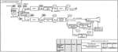
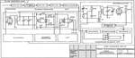
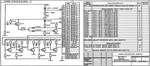
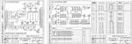
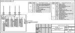
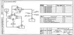
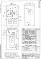
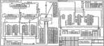

# Схема электрическая
> 2019.05.12 ┊ **🚀 [despace](index.md)** → **[КД](doc.md)**, [Схема](doc.md)

[TOC]

---

> <small>*Термины:* **Схема электрическая (СхЭ)** — русскоязычный термин. **Electrical interconnect diagram** — англоязычный эквивалент.</small>

**Электри́ческая схе́ма (СхЭ)** — это документ, составленный в виде условных изображений или обозначений СЧ [изделия](unit.md), действующих при помощи электрической энергии, и их взаимосвязей. Эл. схемы являются разновидностью [схем изделия](doc.md) и обозначаются в шифре основной надписи буквой **Э**.

 

## Описание
Правила выполнения всех типов электрических схем установлены [ГОСТ 2.702](гост_2_702.md), при выполнении схем цифровой вычислительной техники руководствуются ГОСТ 2.708-81.

|*Тип схемы электрической*|*Определение*|*<small>Код типа схемы</small>*|
|:--|:--|:--|
| Структурная  | Определяет основные функциональные СЧ, их назначение и взаимосвязи  | 1 |
| Функциональная  | Разъясняет процессы, протекающие в отдельных функциональных цепях изделия или изделия в целом  | 2 |
| Принципиальная (полная)  | Определяет полный состав элементов и взаимосвязи между ними и, как правило, дающий полное (детальное) представления о принципах работы изделия (установки)  | 3 |
| Соединений (монтажная)  | Показывает соединения СЧ изделия (установки) и определяющий провода, жгуты, кабели или трубопроводы, которыми осуществляются эти соединения, а также места их присоединений и ввода (разъемы, платы, зажимы и т.п.)  | 4 |
| Подключения  | Показывает внешние подключения изделия  | 5 |
| Общая  | Определяет СЧ комплекса и соединения их между собой на месте эксплуатации  | 6 |
| Расположения  | Определяет относительное расположение СЧ изделия (установки), и, при необходимости, жгутов, проводов, кабелей, трубопроводов, световодов и т.п.  | 7 |
| Объединённая  | Содержит элементы различных типов схем одного вида  | 0 |

Примечание — Наименования типов схем, указанные в скобках, устанавливают для электрических схем энергетических сооружений.

 

## Состав и примеры

|*Схема электрическая*|<small>*Пример   (изображение)*</small>|
|:--|:--|
|**Структурная (Э1)**  Изображают основные функциональные СЧ (элементы, устройства, функц. группы) и основные взаимосвязи между ними. Графическое построение схемы должно обеспечивать наилучшее представление о последовательности взаимодействия функциональных частей в изделии. На линиях взаимосвязей рекомендуется стрелками обозначать направление хода процессов в изделии.  |  |
|**Функциональная (Э2)**  Изображают функциональные СЧ (элементы, устройства, функц. группы), участвующие в процессе, иллюстрируемом схемой, и связи между этими частями. Графическое построение схемы должно давать наглядное представление о последовательности процессов, иллюстрируемых схемой.  |  |
|**Принципиальная (полная) (Э3)**  Изображают все эл. элементы или устройства, необходимые для осуществления и контроля в изделии установленных эл. процессов, все эл. взаимосвязи между ними, а также эл. элементы (соединители, зажимы и т.д.), которыми заканчиваются вх/вых цепи. Допускается изображать элементы соединительные и монтажные, устанавливаемые по конструктивным соображениям. Схемы выполняют для изделий в отключённом положении.  |  |
|**Соединений (монтажная) (Э4)**  Изображают все устройства и элементы, входящие в состав изделия, их вх/вых элементы (соединители, платы, зажимы и т.д.) и соединения между ними. Расположение изображений входных и выходных элементов или выводов внутри графических обозначений и устройств или элементов должно примерно соответствовать их действительному размещению в изделии. |  |
|**Подключения (Э5)**  Изображают изделие, его вх/вых элементы (соединители, зажимы и т.д.) и подводимые к ним концы проводов и кабелей внешнего монтажа, около которых помещают данные о подключении изделия (характеристики внешних цепей и/или адреса). Размещение изображений вх/вых элементов внутри графического обозначения изделия должно примерно соответствовать их действительному размещению. Следует указывать позиционные обозначения вх/вых элементов, присвоенные им на Э3.  |  |
|**Общая (Э6)**  Изображают устройства и элементы, входящие в комплекс, а также провода, жгуты и кабели, соединяющие эти устройства и элементы. Расположение графических обозначений устройств и элементов на схеме должно примерно соответствовать их действительному размещению таковых.  |  |
|**Расположения (Э7)**  Изображают СЧ изделия, а при необходимости связи между ними — конструкцию, помещение или местность, на которых эти СЧ будут расположены.  |  |
|**Объединённая (Э0)**  На Э0 изображают различные типы, которые объединяются между собой на одном чертеже.  |  |

 

## Критика и мнения

**<https://habr.com/ru/post/451158/>:**

> **oam2oam, 12 мая 2019 в 13:17**  
> Мне часто приходится разрабатывать электронные комплексы, и вот что получается — в действительности время сильно ограничено (рынок давит, китайцы на пятки наступают) и для не очень сложных (а они почти все такие) дел приходится использовать самый минимум схем — только чтобы получить рабочие данные для CAM… С другой стороны есть методология, например, model‑based Arcadia (реализация capella) — там совсем другой подход, но освоить пока не удалось…  
> И вот тут у меня сомнения — во‑первых, такое деление на схемы, как в статье, должно опираться на методологию — а она устарела, во‑вторых, поддерживаться ПО — но я не знаю ни одной системы, которая бы её поддерживала…  
> В результате год назад я столкнулся с такой ситуацией — инженер с одного очень серьёзного завода предложил разместить у них заказ. Я им отдал схему, gerber'ы — так вот они ещё 40 (!) дней дорисовывали и изукрашивали надписями эти документы, а потом только определились с ценой (по их словам, участвовало 27 человек!) — так я за эти 40 дней уже дважды провернул цикл разработки‑изготовления‑отладки и успел про них забыть…  
> И вот вопрос — как же быть в современных условиях? Ведь даже отменно и по всем ГОСТам начерченная схема не сможет быть промоделирована и не позволит получить файлы CAM, если она сделана карандашом на ватмане…  
>> **SignallerK, 12 мая 2019 в 17:06**  
>> По моему в таких случаях необходимо применять принцип разумной достаточности, если иное не оговорено заказчиком или законом. Например, если устройство одно и монтируется по месту (читай хоббийный проект), то хватает принципиалки.  
>> А вот если устройств более одного, с монтажом на стороне… То возникают вопросы как это должно быть размещено, в каком порядке устанавливаться и соединяться — тут уже просится монтажная схема и схема соединений.  
>> Наконец, если устройство большое или состоит из нескольких модулей, то может оказаться, что принципиальная схема не читаема (в рамках одного листа), или не отвечает на более общие вопросы, типа как сигнал проходит по блокам. И тут нужна структурная или функциональная схема.  
>> Иногда получается применять простое правило — дать почитать КД человеку с ней незнакомому (но хотя бы с минимальным пониманием предмета). И спросить, например, как что соединяется, или как получить тот или иной результат. Вот тут‑то баги доки и проявляются.  
>> PS: Например  в ИТ хорошая практика — это дать почитать дизайн (тот что с бизнес‑логикой), девам и тестировщикам. При таком подходе внезапно выясняется, что «простое и очевидное» утверждение может по‑разному трактоваться разными людьми, и лучше его переделать.

> **wax_ru, 13 мая 2019 в 09:43**  
> Ну здесь ведь как: по сути на предприятиях используется три с половиной вида схем.  
> 1. Электрическая структурная — обычно её выполняет руководитель сектора/лаборатории/темы, чтобы вместе с ТЗ на разработку СЧ раздать непосредственным исполнителем схем принципиальных СЧ, ну или пояснять на всяких совещаниях чего он собрался наворотить. Смысл её в том, чтобы пояснить из каких СЧ будет состоять готовое изделие и как эти части между собой взаимодействуют. Часто эту схему потом пихают во всякие не конструкторские документы вроде пояснительных записок, расчётов надёжности, ЗИПа, спецфакторов и пр.  
> 2. Схема электрическая принципиальная — это схема основная. На ней показывают все СЧ и электрические связи между ними до элемента. Она делается на этапе РКД и является «Альфой» практически для всех остальных конструкторских документов. Когда сделана эта схема — начинают работать конструктора, писаться и готовится всякие расчёты, писать код программисты.  
> 3. Схема электрическая подключения/соединений — делается обычно сразу на этапе ТП и нужна в основном заказчику. Необходимость разработки этой схемы почти всегда указана в ТЗ. Смысл этих схем в том, что они показывают заказчику, как он будет подключаться к разработанному по ТЗ изделию. А разница между ними проста: схема электрическая подключения делается, если заказчику выдаётся некий моноблок, к которому надо подключиться, а соединений — если заказчику выдаётся несколько СЧ, которые нужно будет электрически соединить между собой.  
> Что касается остальных схем — то ни разу не слышал о том, чтобы их кто‑то действительно разрабатывал.

 

## Docs & links (TRANSLATEME ALREADY)
|…°·•¹²³±×÷≤≥≈≠ ‑ −— ⎆✉ ❐“”’«»✔→✘☐☑├┕┆ 1 lb = 0.453592 kg; 1 g = 9.80665 m/s²|
|:--|
|<small>**[FAQ](faq.md)**, **[Cable](cable.md)**·БКС, **[Camera](camera.md)**·Камера, **[Comms](comms.md)**·Радиосв., **[Contact](contact.md)**·Контакт, **[Control](control.md)**·Управ., **[Doc](doc.md)**·Док., **[Doppler](doppler.md)**·ИСР, **[DS](ds.md)**·ЗУ, **[EB](eb.md)**·ХИТ, **[ECO](ecology.md)**·Экол., **[EF](ef.md)**·ВВФ, **[ElC](elc.md)**·ЭКБ, **[EMC](emc.md)**·ЭМС, **[Errors](error.md)**·Ошибки, **[Events](event.md)**·События, **[FS](fs.md)**·ТЭО, **[Fuel](fuel.md)**·Топливо, **[GNC](gnc.md)**·БКУ, **[GS](scs.md)**·НС, **[HF&E](hfe.md)**·Эргоном., **[IMU](imu.md)**·Гироскоп, **[Incubator](incubator.md)**·Инкуб., **[KT](kt.md)**·КТЕХ, **[LAG](lag.md)**·ПУC, **[LES](les.md)**·САСП, **[LS](ls.md)**·СЖО, **[LV](lv.md)**·РН, **[MAG](mag.md)**·Магнитом., **[MCC](mcc.md)**·ЦУП, **[Model](model.md)**·Модель, **[MSC](sc.md)**·ПКА, **[N&B](nnb.md)**·БНО, **[NR](nr.md)**·ЯР, **[OBC](obc.md)**·ЦВМ, **[OE](oe.md)**·БА, **[Patent](патент.md)**·Патент, **[Project](project.md)**·Проект, **[PS](ps.md)**·ДУ, **[QA](quality.md)**·QA, **[R&D](rnd.md)**·НИОКР, **[RAMS](rams.md)**·НиБ, **[Risk](risk.md)**·Риск, **[Robot](robotics.md)**·Робот, **[Rover](rover.md)**·Планетоход, **[RTG](rtg.md)**·РИТЭГ, **[RW](rw.md)**·ДМ, **[SARC](sarc.md)**·ПСК, **[Sensor](sensor.md)**·Датчик, **[SC](sc.md)**·КА, **[SCS](scs.md)**·КК, **[SGM](sgm.md)**·КММ, **[SI](si.md)**·СИ, **[Soft](soft.md)**·ПО, **[SP](sp.md)**·БС, **[Spaceport](spaceport.md)**·Космодром, **[SPS](sps.md)**·СЭС, **[SSS](sss.md)**·ГЗУ, **[TCS](tcs.md)**·СОТР, **[Test](test.md)**·ЭО, **[Timeline](timeline.md)**·Циклограмма, **[TMS](tms.md)**·ТМС, **[TOR](tor.md)**·ТЗ, **[TRL](trl.md)**·УГТ</small>|
|*Sections & pages*|
|**··• [Documents](doc.md) •··**  **Схема:** [КСС](ксс.md) ┊ [ПГС](пгс.md) ┊ [ПЛИС](плис.md) ┊ [СхД](wbs.md) ┊ [СхО](draft_model.md) ┊ [СхПЗ](draft_model.md) ┊ [СхЧ](unit_decd.md) ┊ [СхЭ](ei_diagram.md) |

**Docs:**

   1. ГОСТ 2.701-2008 ЕСКД. Схемы. Виды и типы. Общие требования к выполнению.
   1. ГОСТ 2.702-2011 ЕСКД. Правила выполнения электрических схем.

**Links:**

   1. Notable interwikies — …
   1. <https://ru.wikipedia.org/wiki/Электрическая_схема>
   1. 2019.03.12 [Хабр: Схемы электрические. Типы схем ⎆](https://habr.com/ru/post/451158/)
