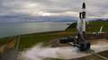
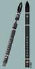
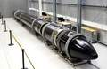
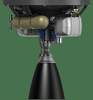

# Electron
> 2019.05.20 ┊ **[🚀](../index/index.md) [despace](index.md)** → **[LV](lv.md)**

[TOC]

---

> <small>*Термины:* **Electron** — англоязычный термин, не имеющий аналога в русском языке. **Электрон** — дословный перевод с английского на русский.</small>

**«Электрон»** (англ. **Electron**) — новозеландская одноразовая жидкостная [ракета‑носитель](lv.md) сверхлёгкого класса, разработанная новозеландским подразделением частной аэрокосмической компании [Rocket Lab](zz_rocket_lab.md) (США).

|*Version*|*Description*|*Activity*|
|:--|:--|:--|
|Electron  |Базовый вариант.  |**Активен** (2017 ‑ …)  |

 

## Electron
**«Электрон»** (англ. **Electron**) — новозеландская одноразовая жидкостная [ракета‑носитель](lv.md) сверхлёгкого класса, разработанная новозеландским подразделением частной аэрокосмической компании [Rocket Lab](zz_rocket_lab.md) (США).  
Electron позволяет вывести полезную нагрузку массой до 150 кг на ССО 500 км (до 250 кг на НОО). Основные элементы РН, несущий корпус и баки ступеней выполнены из [углепластика](cfrp.md) и производятся Rocket Lab. Применение композиционных материалов позволило существенно снизить вес конструкции. РН оборудована композитным ГО длиной 2.5 м, диаметром 1.2 м и массой около 50 кг.

|*Characteristic*|*[Value](si.md)*|
|:--|:--|
|Активность  |**Активен** (2017‑…)  |
|[Аналоги](analogue.md)  |**Kuaizhou** (Китай) ┊ **LauncherOne** (США) ┊ **Pegasus** (США) ┊ **Super Strypi** (США) ┊ **Vector‑H** (США)  |
|Длина/диаметр  | 17 / 1.2 м  |
|[Космодромы](spaceport.md)  | [Rocket Lab LC1](rocket_lab_lc1.md)  |
|Масса старт./сух.  | 12 550 / 1 250 кг  |
|Разраб./изготов.  | [Rocket Lab](zz_rocket_lab.md) (США) / [Rocket Lab](zz_rocket_lab.md) (США)  |
|Ступени  | 2  |
|[Топливо](fuel.md)  | [Кислород + Керосин](o_plus.md)  |
||  |

**Выводимые массы.**

|*Космодром*|*РН*|<small>*Масса,  [НОО](nnb.md), т*</small>|<small>*Масса,  [ГСО](nnb.md), т*</small>|<small>*Масса к  [Луне](moon.md), т*</small>|<small>*Масса к  [Венере](venus.md), т*</small>|<small>*Масса к  [Марсу](mars.md), т*</small>|*Примечания*|
|:--|:--|:--|:--|:--|:--|:--|:--|
| [Rocket Lab LC1](rocket_lab_lc1.md)  | Electron  | 0.25 | — | — | — | — | Пуск — $ 6 млн (2019 г);  ПН 1.99 % от ст.массы  |

<small>Примечания:  **1)** Указана масса для наихудших условий старта.  **2)** В скобках указана масса для наилучших условий старта.</small>

|*РН в сравнении  с человеком*|*В сборочном  помещении*|*Двигатель  «Резерфорд»*|
|:--|:--|:--|
|   |   |   |

 

## Архивные

…

 

## Docs & links (TRANSLATEME ALREADY)
|…°·•¹²³±×÷≤≥≈≠ ‑ −— ⎆✉ ❐“”’«»✔→✘☐☑├┕┆ 1 lb = 0.453592 kg; 1 g = 9.80665 m/s²|
|:--|
|<small>**[FAQ](faq.md)**, **[Cable](cable.md)**·БКС, **[Camera](camera.md)**·Камера, **[Comms](comms.md)**·Радиосв., **[Contact](contact.md)**·Контакт, **[Control](control.md)**·Управ., **[Doc](doc.md)**·Док., **[Doppler](doppler.md)**·ИСР, **[DS](ds.md)**·ЗУ, **[EB](eb.md)**·ХИТ, **[ECO](ecology.md)**·Экол., **[EF](ef.md)**·ВВФ, **[ElC](elc.md)**·ЭКБ, **[EMC](emc.md)**·ЭМС, **[Errors](error.md)**·Ошибки, **[Events](event.md)**·События, **[FS](fs.md)**·ТЭО, **[Fuel](fuel.md)**·Топливо, **[GNC](gnc.md)**·БКУ, **[GS](scs.md)**·НС, **[HF&E](hfe.md)**·Эргоном., **[IMU](imu.md)**·Гироскоп, **[Incubator](incubator.md)**·Инкуб., **[KT](kt.md)**·КТЕХ, **[LAG](lag.md)**·ПУC, **[LES](les.md)**·САСП, **[LS](ls.md)**·СЖО, **[LV](lv.md)**·РН, **[MAG](mag.md)**·Магнитом., **[MCC](mcc.md)**·ЦУП, **[Model](model.md)**·Модель, **[MSC](sc.md)**·ПКА, **[N&B](nnb.md)**·БНО, **[NR](nr.md)**·ЯР, **[OBC](obc.md)**·ЦВМ, **[OE](oe.md)**·БА, **[Patent](патент.md)**·Патент, **[Project](project.md)**·Проект, **[PS](ps.md)**·ДУ, **[QA](quality.md)**·QA, **[R&D](rnd.md)**·НИОКР, **[RAMS](rams.md)**·НиБ, **[Risk](risk.md)**·Риск, **[Robot](robotics.md)**·Робот, **[Rover](rover.md)**·Планетоход, **[RTG](rtg.md)**·РИТЭГ, **[RW](rw.md)**·ДМ, **[SARC](sarc.md)**·ПСК, **[Sensor](sensor.md)**·Датчик, **[SC](sc.md)**·КА, **[SCS](scs.md)**·КК, **[SGM](sgm.md)**·КММ, **[SI](si.md)**·СИ, **[Soft](soft.md)**·ПО, **[SP](sp.md)**·БС, **[Spaceport](spaceport.md)**·Космодром, **[SPS](sps.md)**·СЭС, **[SSS](sss.md)**·ГЗУ, **[TCS](tcs.md)**·СОТР, **[Test](test.md)**·ЭО, **[Timeline](timeline.md)**·Циклограмма, **[TMS](tms.md)**·ТМС, **[TOR](tor.md)**·ТЗ, **[TRL](trl.md)**·УГТ</small>|
|*Sections & pages*|
|**··• [Launch vehicle (LV)](lv.md) •··**  [ICBM](icbm.md) ┊ [Integrated payload unit](lv.md) ┊ [Non‑rocket spacelaunch](nrs.md) ┊ [Throw weight](throw_weight.md) • • •  **China:** [Long March](long_march.md) ┊ **EU:** [Arian](arian.md), [Vega](vega.md) ┊ **India:** [GSLV](gslv.md), [PSLV](pslv.md) ┊ **Israel:** [Shavit](shavit.md) ┊ **Japan:** [Epsilon](epsilon.md), [H2](h2.md), [H3](h3.md) ┊ **Korea N.:** [Unha](unha.md) ┊ **Korea S.:** *([Naro‑1](naro_1.md))* ┊ **RF,CIF:** [Angara](angara.md), [Proton](proton.md), [Soyuz](soyuz.md), [Yenisei](yenisei.md), [Zenit](zenit.md) *([Energia](energia.md), [Korona](korona.md), [N‑1](n_1.md), [R‑1](r_7.md))* ┊ **USA:** [Antares](antares.md), [Atlas](atlas.md), [BFR](bfr.md), [Delta](delta.md), [Electron](electron.md), [Falcon](falcon.md), [Firefly Alpha](firefly_alpha.md), [LauncherOne](launcherone.md), [New Armstrong](new_armstrong.md), [New Glenn](new_glenn.md), [Minotaur](minotaur.md), [Pegasus](pegasus.md), [Shuttle](shuttle.md), [SLS](sls.md), [Vulcan](vulcan.md) *([Saturn](saturn_lv.md), [Sea Dragon](sea_dragon.md))* |

   1. Docs: …
   1. Notable interwikies — …
   1. <https://en.wikipedia.org/wiki/Electron_(rocket)>
   1. <https://ru.wikipedia.org/wiki/LauncherOne>
   1. <https://ru.wikipedia.org/wiki/Куайчжоу>
   1. <https://ru.wikipedia.org/wiki/Пегас_(ракета‑носитель)>
   1. <https://ru.wikipedia.org/wiki/Электрон_(ракета‑носитель)>
   1. <https://en.wikipedia.org/wiki/Comparison_of_orbital_launch_systems>
   1. 2016.09.26 [Rocket Lab Opens Private Orbital Launch Site in New Zealand ⎆](https://www.space.com/34195-rocket-lab-opens-private-launch-site-new-zealand.html)
