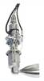
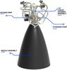
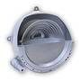
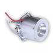
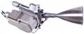
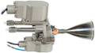
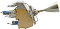
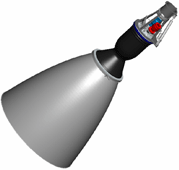

# Engines (a list)
> 2019.05.12 [🚀](../index/index.md) [despace](index.md) → [PS](ps.md)

[TOC]

---

A list of [Engines](ps.md).

## Current

 

### 1NMHT (EU)
**1NMHT** — 1‑component [engine](ps.md) by [OPC LAM](contact/opc_lam.md). Designed in 1996.

|*Characteristics*|*[Value](si.md)  (1NMHT)*|
|:--|:--|
|Composition| |
|Consumption, W| |
|Dimensions, ㎜| |
|[Interfaces](interface.md)| |
|[Lifetime](lifetime.md)/Resource, h(y)|… / …|
|Mass, ㎏|0.29|
|[Overload](vibration.md), Grms| |
|[Rad.resist](ion_rad.md), ㏉ (㎭)| |
|[Reliability](qm.md) per [lifetime](lifetime.md)| |
|[Thermal range](tcs.md), ℃| |
|[TRL](trl.md)|9|
|[Voltage](sps.md), V| |
|**【Specific】**|• • •|
|[Fuel](fuel.md)|[Hydrazine](гидразин.md)|
|Fuel — combustion products| |
|Fuel — consumption, ㎏/s, ≤|0.44 (0.142 ‑ 0.447)|
|Fuel — mass ratio of components|—|
|Mach number / [Adiabatic exponent](heat_cr.md)| |
|Press. — comb. chamber, ㎫ (kgf/㎝²)| |
|Press. — engine entrance, ㎫ (kgf/㎝²)|0.56 ‑ 2.24 (5.5 ‑ 22)|
|Press. — nozzle cut, ㎫ (kgf/㎝²)| |
|Res. — fuel, ㎏, ≥|67|
|Res. — number of thrusts, ≥|59 000|
|Res. — total impulse, N·s (kgf·s), ≥| |
|Res. — total thrust, N (kgf), ≥|135 000 (13 760)|
|Res. — total thrust duration, s, ≥|180 000|
|Temp. — comb. chamber, К (℃)| |
|Temp. — nozzle cut, К (℃)| |
|Thrust, N (kgf)|1 (0.1)|
|Thrust — deviation, N (kgf)|0.32 ‑ 1.1 (0.032 ‑ 1.12)|
|Thrust — [Isp](isp.md), N·s/㎏ (s), ≥|1 962 ‑ 2 190 (200 ‑ 223)|
|Thrust — max duration of 1 thrust, s|43 200|
|Thrust — max switching frequency, ㎐| |
|Thrust — [res.impulse](ing.md), N·s (kgf·s), ≤| |
|Thrust — torch angle, °| |
|[Turbopump](turbopump.md) speed, rpm|—|
| ||

**Notes:**

   1. [Products brochures ❐](f/con/o/opc_lam_brochures.7z)
   1. <http://www.space-propulsion.com/spacecraft-propulsion/hydrazine-thrusters/1n-hydrazine-thruster.html> — [archive ❐](f/ps/1nmht_site.pdf) of 2019.02.21)
   1. Specs’re for vacuum & nominal continuous thrust starting from the 2nd second after energizing the solenoid valves.
   1. **Applicability:** CSO-3 (…)・ CSO-2 (…)・ CSO-1 (2016)・ Sentinel 2B (2016)・ Sentinel 5P (2016)・ SEOSAT (Ingenio) (2015)・ Sentinel 2A (2015)・ SEOSAR (Paz) (2015)・ Taranis (2015)・ AstroTerra 2 (2014)・ KRS (2014)・ Jason-3 (2013)・ Vietnam-1 (2013)・ AstroTerra 1 (2012)・ Pleiades HR2 (2012)・ Elisa-1 (2011)・ Elisa-2 (2011)・ Elisa-3 (2011)・ Elisa-4 (2011)・ Pleiades HR1 (2011)・ SSOT (2011)・ Alsat 2A (2010)・ Alsat 2B (2010)・ CosmoSkymed-4 (2010)・ TANDEM-X (2010)

 

### 11D428A-16 (RU)
**11D428A-16** (rus. **11Д428А-16**) — 2‑component [engine](ps.md) by [NIIMASH](contact/niimash.md).

|*Characteristics*|*[Value](si.md)  (11D428A-16)*|*[Value](si.md)  (11D428AF-16)*|
|:--|:--|:--|
|Composition| | |
|Consumption, W| | |
|Dimensions, ㎜|290 × … **⁽¹⁾**|372 × 158 **⁽¹⁾**|
|[Interfaces](interface.md)| | |
|[Lifetime](lifetime.md)/Resource, h(y)|… / …|… / …|
|Mass, ㎏|1.5 **⁽¹⁾**|1.9 **⁽¹⁾**|
|[Overload](vibration.md), Grms| | |
|[Rad.resist](ion_rad.md), ㏉ (㎭)| | |
|[Reliability](qm.md) per [lifetime](lifetime.md)| | |
|[Thermal range](tcs.md), ℃| | |
|[TRL](trl.md)|9 **⁽¹⁾ ⁽²⁾**|9 **⁽¹⁾ ⁽²⁾**|
|[Voltage](sps.md), V| | |
|**【Specific】**|• • •|• • •|
|[Fuel](fuel.md)|[AT+UDMH](at_plus.md) **⁽¹⁾**|[AT+UDMH](at_plus.md) **⁽¹⁾**|
|Fuel — combustion products|H₂, H₂O, CO, CO₂, N₂|H₂, H₂O, CO, CO₂, N₂|
|Fuel — consumption, ㎏/s, ≤|0.0452875|0.0411392|
|Fuel — mass ratio of components|1.85 ± 0.15 **⁽¹⁾**|1.85 ± 0.05 **⁽¹⁾**|
|Mach number / [Adiabatic exponent](heat_cr.md)| | |
|Press. — comb. chamber, ㎫ (kgf/㎝²)| | |
|Press. — engine entrance, ㎫ (kgf/㎝²)|0.98 ‑ 1.86 (9.8 ‑ 18.6) **⁽¹⁾**|1.37 ‑ 1.57 (13.7 ‑ 15.7) **⁽¹⁾**|
|Press. — nozzle cut, ㎫ (kgf/㎝²)| | |
|Res. — fuel, ㎏, ≥|2 250|2 042|
|Res. — number of thrusts, ≥|500 000 **⁽¹⁾**|500 000 **⁽¹⁾**|
|Res. — total impulse, N·s (kgf·s), ≥| |
|Res. — total thrust, N (kgf), ≥|6 458 000|6 175 000|
|Res. — total thrust duration, s, ≥|50 000|50 000 **⁽¹⁾**|
|Temp. — comb. chamber, К (℃)| | |
|Temp. — nozzle cut, К (℃)| | |
|Thrust, N (kgf)|129.16 (13.1) **⁽¹⁾**|123.5 (12.5) **⁽¹⁾**|
|Thrust — deviation, N (kgf)| | |
|Thrust — [Isp](isp.md), N·s/㎏ (s), ≥|2 852 (290) **⁽¹⁾**|3 002 (306) **⁽¹⁾**|
|Thrust — max duration of 1 thrust, s|0.03 ‑ 2 000 **⁽¹⁾**|0.03 ‑ 2 000 **⁽¹⁾**|
|Thrust — max switching frequency, ㎐| | |
|Thrust — [res.impulse](ing.md), N·s (kgf·s), ≤| | |
|Thrust — torch angle, °| | |
|[Turbopump](turbopump.md) speed, rpm|—|—|

**Notes:**

   1. Specs’re for vacuum & nominal continuous thrust starting from the 2nd second after energizing the solenoid valves.
   1. **[1]** — see [NIIMASH](contact/niimash.md) site, 2016 y.
   1. **Applicability:**
      - **17D428A-16**: Orbital manned station Salyut・ Orbital manned station Mir・ Soyuz-TM・ Progress-M・ Service module Zvezda at the International Space Station Astrophysical Observatory Gamma
      - **17D428AF-16**. Fobos-Grunt, PS of the returning module

 

### 11D457 (RU)
**11D457** (rus. **11Д457**) — 2‑component [engine](ps.md) by [NIIMASH](contact/niimash.md).

|*Characteristics*|*[Value](si.md)  (11D457)*|*[Value](si.md)  (11D457F)*|
|:--|:--|:--|
|Composition| | |
|Consumption, W| | |
|Dimensions, ㎜|236 × … **⁽¹⁾**|257 × 68 **⁽²⁾**|
|[Interfaces](interface.md)| | |
|[Lifetime](lifetime.md)/Resource, h(y)|… / …|1 825 (5) **⁽²⁾** / …|
|Mass, ㎏|1.2 **⁽¹⁾**|1.2 **⁽²⁾**|
|[Overload](vibration.md), Grms| | |
|[Rad.resist](ion_rad.md), ㏉ (㎭)| | |
|[Reliability](qm.md) per [lifetime](lifetime.md)| | |
|[Thermal range](tcs.md), ℃| | |
|[TRL](trl.md)|9 **⁽¹⁾ ⁽²⁾**|9 **⁽¹⁾ ⁽²⁾**|
|[Voltage](sps.md), V| | |
|**【Specific】**|• • •|• • •|• • •|
|[Fuel](fuel.md)|[AT+UDMH](at_plus.md) **⁽¹⁾ ⁽²⁾**|[AT+UDMH](at_plus.md) **⁽¹⁾ ⁽²⁾**|
|Fuel — combustion products|H₂, H₂O, CO, CO₂, N₂|H₂, H₂O, CO, CO₂, N₂|
|Fuel — consumption, ㎏/s, ≤|0.0216552|0.0190007|
|Fuel — mass ratio of components|1.85 ± 0.15 **⁽¹⁾ ⁽²⁾**| |
|Mach number / [Adiabatic exponent](heat_cr.md)| | |
|Press. — comb. chamber, ㎫ (kgf/㎝²)| | |
|Press. — engine entrance, ㎫ (kgf/㎝²)|1.05 ‑ 1.35 (10 ‑ 13) **⁽¹⁾**|1.18 (12) **⁽²⁾**|
|Press. — nozzle cut, ㎫ (kgf/㎝²)| | |
|Res. — fuel, ㎏, ≥| |109|
|Res. — number of thrusts, ≥|100 000 **⁽¹⁾**|100 000 **⁽²⁾**|
|Res. — total impulse, N·s (kgf·s), ≥| | |
|Res. — total thrust, N (kgf), ≥| |310 000 (31 600)|
|Res. — total thrust duration, s, ≥| |5 750 **⁽²⁾**|
|Temp. — comb. chamber, К (℃)| | |
|Temp. — nozzle cut, К (℃)| | |
|Thrust, N (kgf)|53.9 (5.5) **⁽¹⁾**|54 (5.5) **⁽²⁾**|
|Thrust — deviation, N (kgf)| |± 6.9 **⁽²⁾**|
|Thrust — [Isp](isp.md), N·s/㎏ (s), ≥|2 489 (253) **⁽¹⁾**|2 842 (290) **⁽²⁾**|
|Thrust — max duration of 1 thrust, s|0.03 ‑ 300 **⁽¹⁾**|0.03 ‑ 2 000 **⁽²⁾**|
|Thrust — max switching frequency, ㎐| |8 **⁽²⁾**|
|Thrust — [res.impulse](ing.md), N·s (kgf·s), ≤| |2.45 (0.25) **⁽²⁾**|
|Thrust — torch angle, °| | |
|[Turbopump](turbopump.md) speed, rpm|—|—|

**Notes:**

   1. Specs’re for vacuum & nominal continuous thrust starting from the 2nd second after energizing the solenoid valves.
   1. **[1]** — see Specification & [NIIMASH](contact/niimash.md) site, 2016 y.
   1. **Applicability:**
      - **11D457** — manned station "Yantar"・ SC "Neman"・ SC "Sapphire"・ SC "Kobalt-M"・ SC "Orlets"・ SC "Kometa"・ SC "Don"・ SC "Lotos"・ SC "Resurs-Dk"
      - **11D457F** — [Luna‑26](луна_26.md)・ [Spektr-M](спектр_м.md)

 

### 11D458 (RU)
**11D458** (rus. **11Д458**) — 2‑component [engine](ps.md) by [NIIMASH](contact/niimash.md).

|*Characteristics*|*[Value](si.md)  (11D458)*|*[Value](si.md)  (11D458M)*|*[Value](si.md)  (11D458F)*|
|:--|:--|:--|:--|
|Composition| | | |
|Consumption, W| | | |
|Dimensions, ㎜|370 × … **⁽¹⁾**|470 × 192 **⁽¹⁾**|465 × 202 **⁽²⁾**|
|[Interfaces](interface.md)| | | |
|[Lifetime](lifetime.md)/Resource, h(y)|… / …|… / …|1 825 (5) **⁽²⁾** / …|
|Mass, ㎏|2.5 **⁽¹⁾**|3 **⁽¹⁾**|3 **⁽²⁾**|
|[Overload](vibration.md), Grms| | | |
|[Rad.resist](ion_rad.md), ㏉ (㎭)| | | |
|[Reliability](qm.md) per [lifetime](lifetime.md)| | | |
|[Thermal range](tcs.md), ℃| | | |
|[TRL](trl.md)|9 **⁽¹⁾ ⁽²⁾**|9 **⁽¹⁾ ⁽²⁾**|9 **⁽¹⁾ ⁽²⁾**|
|[Voltage](sps.md), V| | | |
|**【Specific】**|• • •|• • •|• • •|
|[Fuel](fuel.md)|[AT+UDMH](at_plus.md) **⁽¹⁾ ⁽²⁾**|[AT+UDMH](at_plus.md) **⁽¹⁾ ⁽²⁾**|[AT+UDMH](at_plus.md) **⁽¹⁾ ⁽²⁾**|
|Fuel — combustion products|H₂, H₂O, CO, CO₂, N₂|H₂, H₂O, CO, CO₂, N₂|H₂, H₂O, CO, CO₂, N₂|
|Fuel — consumption, ㎏/s, ≤|0.1587044|0.1324333|0.1282309|
|Fuel — mass ratio of components|1.85 ± 0.15 **⁽¹⁾ ⁽²⁾**|1.85 ± 0.15 **⁽¹⁾ ⁽²⁾**|1.85 ± 0.15 **⁽¹⁾ ⁽²⁾**|
|Mach number / [Adiabatic exponent](heat_cr.md)| | | |
|Press. — comb. chamber, ㎫ (kgf/㎝²)| | | |
|Press. — engine entrance, ㎫ (kgf/㎝²)|0.98 ‑ 1.96 (9.8 ‑ 19.6) **⁽¹⁾**|1.27 ‑ 1.97 (12.7 ‑ 19.7) **⁽¹⁾**|1.13 ‑ 1.23 (11.3 ‑ 12.3) **⁽²⁾**|
|Press. — nozzle cut, ㎫ (kgf/㎝²)| | | |
|Res. — fuel, ㎏, ≥| |132 **⁽¹⁾**; 509 **⁽³⁾**|350 **⁽²⁾**|
|Res. — number of thrusts, ≥|33 000 **⁽¹⁾**|10 000 **⁽¹⁾**|10 000 **⁽²⁾**|
|Res. — total impulse, N·s (kgf·s), ≥| |
|Res. — total thrust, N (kgf), ≥| |392 000 (40 000)  1 569 600 (160 000)| |
|Res. — total thrust duration, s, ≥| |1 000 **⁽¹⁾**; 4 000 **⁽³⁾**|2 750 **⁽²⁾**|
|Temp. — comb. chamber, К (℃)| | | |
|Temp. — nozzle cut, К (℃)| | | |
|Thrust, N (kgf)|392 (39.9) **⁽¹⁾**|392.4 (39.9) **⁽¹⁾**|382 (39) **⁽²⁾**|
|Thrust — deviation, N (kgf)| | |± 10 **⁽²⁾**|
|Thrust — [Isp](isp.md), N·s/㎏ (s), ≥|2 470 (252) **⁽¹⁾**|2 963 (302) **⁽¹⁾**|2 979 (304) **⁽²⁾**|
|Thrust — max duration of 1 thrust, s|0.1 ‑ 3 000 **⁽¹⁾**|0.05 ‑ 1 000 **⁽¹⁾**; 0.05 ‑ 1 500 **⁽³⁾**|0.05 ‑ 2 000 **⁽²⁾**|
|Thrust — max switching frequency, ㎐| | |8 **⁽²⁾**|
|Thrust — [res.impulse](ing.md), N·s (kgf·s), ≤| | |9.41 (0.96) **⁽²⁾**|
|Thrust — torch angle, °| | | |
|[Turbopump](turbopump.md) speed, rpm|—|—|—|

**Notes:**

   1. Specs’re for vacuum & nominal continuous thrust starting from the 2nd second after energizing the solenoid valves.
   1. **[1,2,3]** — see Specification & [NIIMASH](contact/niimash.md) site, 2016 y.
   1. **Applicability:**
      - **11Д458:** [Briz](бриз.md)・ Orbital manned station "Almaz"・ Orbital manned station "Mir"・ FGB "Zarya" (ISS)
      - **11Д458М:** [Briz](бриз.md)・ [Luna‑26](луна_26.md)
      - **11Д458Ф:** [Spektr-M](спектр_м.md)

 

### 14D30 (RU)
**11D30** (rus. **14Д30**) — 2‑component [engine](ps.md) by [KBHM](contact/kbhm.md)

|*Characteristics*|*[Value](si.md)  (14D30)*|
|:--|:--|
|Composition| |
|Consumption, W| |
|Dimensions, ㎜|948 × 1 150 **⁽¹⁾**|
|[Interfaces](interface.md)| |
|[Lifetime](lifetime.md)/Resource, h(y)|… / …|
|Mass, ㎏|95 **⁽¹⁾**|
|[Overload](vibration.md), Grms| |
|[Rad.resist](ion_rad.md), ㏉ (㎭)| |
|[Reliability](qm.md) per [lifetime](lifetime.md)| |
|[Thermal range](tcs.md), ℃| |
|[TRL](trl.md)|9 **⁽¹⁾**|
|[Voltage](sps.md), V| |
|**【Specific】**|• • •|
|[Fuel](fuel.md)|[AT+UDMH](at_plus.md) **⁽¹⁾**|
|Fuel — combustion products|H₂, H₂O, CO, CO₂, N₂|
|Fuel — consumption, ㎏/s, ≤|6.08560794|
|Fuel — mass ratio of components|2.0 **⁽¹⁾**|
|Mach number / [Adiabatic exponent](heat_cr.md)| |
|Press. — comb. chamber, ㎫ (kgf/㎝²)|10 (100) **⁽¹⁾**|
|Press. — engine entrance, ㎫ (kgf/㎝²)| |
|Press. — nozzle cut, ㎫ (kgf/㎝²)| |
|Res. — fuel, ㎏, ≥|19 470|
|Res. — number of thrusts, ≥|8 **⁽¹⁾**|
|Res. — total impulse, N·s (kgf·s), ≥| |
|Res. — total thrust, N (kgf), ≥|62 700 000 (6 400 000)|
|Res. — total thrust duration, s, ≥|3 200 **⁽¹⁾**|
|Temp. — comb. chamber, К (℃)| |
|Temp. — nozzle cut, К (℃)| |
|Thrust, N (kgf)|19 620 (2 000) **⁽¹⁾**|
|Thrust — deviation, N (kgf)| |
|Thrust — [Isp](isp.md), N·s/㎏ (s), ≥|3 224 (328.6) **⁽¹⁾**|
|Thrust — max duration of 1 thrust, s|2 500 **⁽¹⁾**|
|Thrust — max switching frequency, ㎐|1 thrust/2.6 s **⁽¹⁾**|
|Thrust — [res.impulse](ing.md), N·s (kgf·s), ≤| |
|Thrust — torch angle, °| |
|[Turbopump](turbopump.md) speed, rpm|—|

**Notes:**

   1. Specs’re for vacuum & nominal continuous thrust starting from the 2nd second after energizing the solenoid valves.
   1. **[1]** — see [KBHM](contact/kbhm.md) site, 2016 y.
   1. **Applicability:** [Briz](бриз.md)

 

### 17D16 (RU)
**17D16** (rus. **17Д16**) — 2‑component [engine](ps.md) by [NIIMASH](contact/niimash.md).

|*Characteristics*|*[Value](si.md)  (17D16)*|
|:--|:--|
|Composition| |
|Consumption, W| |
|Dimensions, ㎜|360 × 88 **⁽¹⁾**|
|[Interfaces](interface.md)| |
|[Lifetime](lifetime.md)/Resource, h(y)|… / …|
|Mass, ㎏|7 **⁽¹⁾**|
|[Overload](vibration.md), Grms| |
|[Rad.resist](ion_rad.md), ㏉ (㎭)| |
|[Reliability](qm.md) per [lifetime](lifetime.md)| |
|[Thermal range](tcs.md), ℃| |
|[TRL](trl.md)|9 **⁽¹⁾**|
|[Voltage](sps.md), V| |
|**【Specific】**|• • •|
|[Fuel](fuel.md)|[O + Kerosene](o_plus.md) **⁽¹⁾**|
|Fuel — combustion products| |
|Fuel — consumption, ㎏/s, ≤|0.0778262|
|Fuel — mass ratio of components| |
|Mach number / [Adiabatic exponent](heat_cr.md)| |
|Press. — comb. chamber, ㎫ (kgf/㎝²)| |
|Press. — engine entrance, ㎫ (kgf/㎝²)|2.45 ‑ 5.88 (24.5 ‑ 58.8) **⁽¹⁾**|
|Press. — nozzle cut, ㎫ (kgf/㎝²)| |
|Res. — fuel, ㎏, ≥|355|
|Res. — number of thrusts, ≥|40 000 **⁽¹⁾**|
|Res. — total impulse, N·s (kgf·s), ≥| |
|Res. — total thrust, N (kgf), ≥|902 500 (92 000)|
|Res. — total thrust duration, s, ≥|4 600 **⁽²⁾**|
|Temp. — comb. chamber, К (℃)| |
|Temp. — nozzle cut, К (℃)| |
|Thrust, N (kgf)|196.2 (20) **⁽¹⁾**|
|Thrust — deviation, N (kgf)| |
|Thrust — [Isp](isp.md), N·s/㎏ (s), ≥|2 521 (257) **⁽¹⁾**|
|Thrust — max duration of 1 thrust, s|0.06 ‑ 180 **⁽¹⁾**|
|Thrust — max switching frequency, ㎐| |
|Thrust — [res.impulse](ing.md), N·s (kgf·s), ≤| |
|Thrust — torch angle, °| |
|[Turbopump](turbopump.md) speed, rpm|—|

**Notes:**

   1. [Описание двигателя ❐](f/ps/17d16_doc_20180130.pdf) (2018 год)
   1. Specs’re for vacuum & nominal continuous thrust starting from the 2nd second after energizing the solenoid valves.
   1. **[1]** — see [NIIMASH](contact/niimash.md) site, 2016 y.
   1. **[2]** — see engine description from 2018 y.
   1. **Applicability:** "Buran", the engine designed to control the orientation in space at the command of the control system.

 

### 17D58E (RU)
**17D58E** (rus. **17Д58Э**) — 2‑component [engine](ps.md) by [NIIMASH](contact/niimash.md).

|*Characteristics*|*[Value](si.md)  (17D58E)*|*[Value](si.md)  (17D58EF)*|
|:--|:--|:--|
|Composition| | |
|Consumption, W| | |
|Dimensions, ㎜|137 × 43|137 × 43 **⁽¹⁾**|
|[Interfaces](interface.md)| | |
|[Lifetime](lifetime.md)/Resource, h(y)|5 475 (15) **⁽²⁾** / …|… / …|
|Mass, ㎏|0.5 **⁽²⁾**|0.55 **⁽¹⁾**|
|[Overload](vibration.md), Grms| | |
|[Rad.resist](ion_rad.md), ㏉ (㎭)| | |
|[Reliability](qm.md) per [lifetime](lifetime.md)| | |
|[Thermal range](tcs.md), ℃| | |
|[TRL](trl.md)|9 **⁽¹⁾ ⁽²⁾**|9 **⁽¹⁾ ⁽²⁾**|
|[Voltage](sps.md), V| | |
|**【Specific】**|• • •|• • •|
|[Fuel](fuel.md)|[AT+UDMH](at_plus.md) **⁽¹⁾ ⁽²⁾**|[AT+UDMH](at_plus.md) **⁽¹⁾ ⁽²⁾**|
|Fuel — combustion products|H₂, H₂O, CO, CO₂, N₂|H₂, H₂O, CO, CO₂, N₂|
|Fuel — consumption, ㎏/s, ≤|0.0049665|0.0048823|
|Fuel — mass ratio of components|1.85 ± 0.2 **⁽¹⁾ ⁽²⁾**|1.85 ± 0.2 **⁽¹⁾ ⁽²⁾**|
|Mach number / [Adiabatic exponent](heat_cr.md)| | |
|Press. — comb. chamber, ㎫ (kgf/㎝²)| | |
|Press. — engine entrance, ㎫ (kgf/㎝²)|1.47 (15) **⁽²⁾**|1.13 ‑ 3 (11.3 ‑ 30) **⁽¹⁾**|
|Press. — nozzle cut, ㎫ (kgf/㎝²)| | |
|Res. — fuel, ㎏, ≥|893| |
|Res. — number of thrusts, ≥|450 000 **⁽²⁾**|450 000 **⁽¹⁾**|
|Res. — total impulse, N·s (kgf·s), ≥| |
|Res. — total thrust, N (kgf), ≥|2 400 000 (244 950)| |
|Res. — total thrust duration, s, ≥|180 000 **⁽²⁾**| |
|Temp. — comb. chamber, К (℃)| | |
|Temp. — nozzle cut, К (℃)| | |
|Thrust, N (kgf)|13.35 (1.36) **⁽²⁾**|12.45 (1.26) **⁽¹⁾**|
|Thrust — deviation, N (kgf)|± 10| |
|Thrust — [Isp](isp.md), N·s/㎏ (s), ≥|2 688 (274) **⁽²⁾**|2 550 (260) **⁽¹⁾**|
|Thrust — max duration of 1 thrust, s|0.03 ‑ 10 000 **⁽²⁾**|0.03 ‑ 10 000 **⁽¹⁾**|
|Thrust — max switching frequency, ㎐|10 **⁽²⁾**| |
|Thrust — [res.impulse](ing.md), N·s (kgf·s), ≤|0.32| |
|Thrust — torch angle, °| | |
|[Turbopump](turbopump.md) speed, rpm|—|—|

**Notes:**

   1. Specs’re for vacuum & nominal continuous thrust starting from the 2nd second after energizing the solenoid valves.
   1. **[1]** — see [NIIMASH](contact/niimash.md) site, 2016 y.
   1. **[2]** — see 17Д58Э.000.00 ТУ11, 1984 y.
   1. **Applicability:**
      - **17D458E** — Almaz・ Mir (modules "Kvant", "Kristall", "Spectrum", "Nature")・ FGB "Zarya" (ISS)
      - **17D458EF** — [Luna‑26](луна_26.md)・ [Spektr-M](спектр_м.md)・ [Fobos-Grunt](фобос_грунт.md)

 

### 20NMHT (EU)
**20NMHT** — 1‑component [engine](ps.md) by [OPC LAM](contact/opc_lam.md). Designed in 1982.

|*Characteristics*|*[Value](si.md)  (20NMHT)*|
|:--|:--|
|Composition| |
|Consumption, W| |
|Dimensions, ㎜| |
|[Interfaces](interface.md)| |
|[Lifetime](lifetime.md)/Resource, h(y)|… / …|
|Mass, ㎏|0.65|
|[Overload](vibration.md), Grms| |
|[Rad.resist](ion_rad.md), ㏉ (㎭)| |
|[Reliability](qm.md) per [lifetime](lifetime.md)| |
|[Thermal range](tcs.md), ℃| |
|[TRL](trl.md)|9|
|[Voltage](sps.md), V| |
|**【Specific】**|• • •|
|[Fuel](fuel.md)|[Hydrazine](гидразин.md)|
|Fuel — combustion products| |
|Fuel — consumption, ㎏/s, ≤|0.0032 ‑ 0.0104|
|Fuel — mass ratio of components|—|
|Mach number / [Adiabatic exponent](heat_cr.md)| |
|Press. — comb. chamber, ㎫ (kgf/㎝²)| |
|Press. — engine entrance, ㎫ (kgf/㎝²)|0.56 ‑ 2.44 (5.5 ‑ 24)|
|Press. — nozzle cut, ㎫ (kgf/㎝²)| |
|Res. — fuel, ㎏, ≥|290|
|Res. — number of thrusts, ≥|93 130|
|Res. — total impulse, N·s (kgf·s), ≥| |
|Res. — total thrust, N (kgf), ≥|517 000 (52 700)|
|Res. — total thrust duration, s, ≥|37 800|
|Temp. — comb. chamber, К (℃)| |
|Temp. — nozzle cut, К (℃)| |
|Thrust, N (kgf)| |
|Thrust — deviation, N (kgf)|7.9 ‑ 24.6 (0.8 ‑ 2.5)|
|Thrust — [Isp](isp.md), N·s/㎏ (s), ≥|2 177 ‑ 2 250 (222 ‑ 230)|
|Thrust — max duration of 1 thrust, s|5 400|
|Thrust — max switching frequency, ㎐| |
|Thrust — [res.impulse](ing.md), N·s (kgf·s), ≤| |
|Thrust — torch angle, °| |
|[Turbopump](turbopump.md) speed, rpm|—|
| ||

**Notes:**

   1. [Products brochures ❐](f/con/o/opc_lam_brochures.7z)
   1. <http://www.space-propulsion.com/spacecraft-propulsion/hydrazine-thrusters/20n-hydrazine-thruster.html> — [archive ❐](f/ps/20nmht_site.pdf) of 2019.02.21)
   1. Specs’re for vacuum & nominal continuous thrust starting from the 2nd second after energizing the solenoid valves.
   1. **Applicability:** NGSAR (2018 ‑ 2019), Herschel (2009), Planck (2009), METOP 1-3 (2006), Integral (2002)

 

### 255U.487 (RU)
**255U.487** (rus. **255У.487**) — 2‑component [engine](ps.md) by [KBHM](contact/kbhm.md)

|*Characteristics*|*[Value](si.md)  (255U.487)*|*[Value](si.md)  (DMT-600)*|
|:--|:--|:--|
|Composition| | |
|Consumption, W| | |
|Dimensions, ㎜|416 × 148 **⁽¹⁾**| |
|[Interfaces](interface.md)| | |
|[Lifetime](lifetime.md)/Resource, h(y)|30 **⁽¹⁾** / …|… / …|
|Mass, ㎏|3.6 **⁽¹⁾**|4.2 **⁽²⁾**|
|[Overload](vibration.md), Grms| | |
|[Rad.resist](ion_rad.md), ㏉ (㎭)| | |
|[Reliability](qm.md) per [lifetime](lifetime.md)| | |
|[Thermal range](tcs.md), ℃| | |
|[TRL](trl.md)|6 **⁽¹⁾**|3 **⁽²⁾**|
|[Voltage](sps.md), V| | |
|**【Specific】**|• • •|• • •|
|[Fuel](fuel.md)|[AT+UDMH](at_plus.md) **⁽¹⁾ ⁽²⁾**|[AT+UDMH](at_plus.md) **⁽¹⁾ ⁽²⁾**|
|Fuel — combustion products|H₂, H₂O, CO, CO₂, N₂ **⁽¹⁾**|H₂, H₂O, CO, CO₂, N₂ **⁽¹⁾**|
|Fuel — consumption, ㎏/s, ≤|0.2028254|0.2005347|
|Fuel — mass ratio of components|1.8169 ± 0.066 **⁽¹⁾**|1.85 **⁽²⁾**|
|Mach number / [Adiabatic exponent](heat_cr.md)|4.8639 / 1.23 **⁽¹⁾**| |
|Press. — comb. chamber, ㎫ (kgf/㎝²)|1.177 (12.0) **⁽¹⁾**|0.9 (9) **⁽²⁾**|
|Press. — engine entrance, ㎫ (kgf/㎝²)|1.96 (20) **⁽¹⁾**|1.7 (17) **⁽²⁾**|
|Press. — nozzle cut, ㎫ (kgf/㎝²)|0.00167 (0.0119) **⁽¹⁾**| |
|Res. — fuel, ㎏, ≥|20|1 000|
|Res. — number of thrusts, ≥|100 **⁽¹⁾**|6 000 **⁽²⁾**|
|Res. — total impulse, N·s (kgf·s), ≥| |
|Res. — total thrust, N (kgf), ≥|60 300 (6 150)|300 000 (30 580)|
|Res. — total thrust duration, s, ≥|100 **⁽¹⁾**|5 000 **⁽²⁾**|
|Temp. — comb. chamber, К (℃)|3 000 (2 700) **⁽¹⁾**| |
|Temp. — nozzle cut, К (℃)|840 (560) **⁽¹⁾**| |
|Thrust, N (kgf)|603±16 (61.44±1.65) **⁽¹⁾**|600 (61) **⁽²⁾**|
|Thrust — deviation, N (kgf)| | |
|Thrust — [Isp](isp.md), N·s/㎏ (s), ≥|2 973 (303±2.2) **⁽¹⁾**|2 992 (305) **⁽²⁾**|
|Thrust — max duration of 1 thrust, s|от 0.2 до 50 **⁽¹⁾**|от 0.05 до 1 500 **⁽²⁾**|
|Thrust — max switching frequency, ㎐|3 **⁽¹⁾**| |
|Thrust — [res.impulse](ing.md), N·s (kgf·s), ≤|17±4.6 (1.735±0.473) **⁽¹⁾**| |
|Thrust — torch angle, °| | |
|[Turbopump](turbopump.md) speed, rpm|—|—|

**Notes:**

   1. Specs’re for vacuum & nominal continuous thrust starting from the 2nd second after energizing the solenoid valves.
   1. **[1]** — see 255У.487.00‑0 ТУ‑5, 2015 y.
   1. **[2]** — see [KBHM](contact/kbhm.md) site, 2016 y.
   1. The content of dissolved helium in the fuel is ≤ 0.03 g/l. Work poorly with [CINU](cinu.md).
   1. The angular deviation of the engine nozzle axis relative to the base longitudinal axis is ≤ 5 " (angular), & ≤ 0.5 ㎜ (linear).
   1. The purity of the fuel supplied to the engine is not lower than [class 5](clean_lvl.md).
   1. **Applicability:** [Luna‑25](луна_25.md)

 

### 255U.530 (RU)
**255U.530** (rus. **255У.530**) — 2‑component [engine](ps.md) by [KBHM](contact/kbhm.md).

|*Characteristics*|*[Value](si.md)  (255У.530.00-0)*|
|:--|:--|
|Composition| |
|Consumption, W| |
|Dimensions, ㎜|416 × 148|
|[Interfaces](interface.md)| |
|[Lifetime](lifetime.md)/Resource, h(y)|26 280 (3) / …|
|Mass, ㎏|3.6|
|[Overload](vibration.md), Grms| |
|[Rad.resist](ion_rad.md), ㏉ (㎭)| |
|[Reliability](qm.md) per [lifetime](lifetime.md)| |
|[Thermal range](tcs.md), ℃| |
|[TRL](trl.md)|4|
|[Voltage](sps.md), V| |
|**【Specific】**|• • •|
|[Fuel](fuel.md)|[AT+UDMH](at_plus.md)|
|Fuel — combustion products|H₂, H₂O, CO, CO₂, N₂|
|Fuel — consumption, ㎏/s, ≤|0.2028254289|
|Fuel — mass ratio of components|1.8169 ± 0.066|
|Mach number / [Adiabatic exponent](heat_cr.md)|4.8639 / 1.23|
|Press. — comb. chamber, ㎫ (kgf/㎝²)|1.177 (12.0)|
|Press. — engine entrance, ㎫ (kgf/㎝²)|1.96 (20)|
|Press. — nozzle cut, ㎫ (kgf/㎝²)|0.00167 (0.0119)|
|Res. — fuel, ㎏, ≥|20|
|Res. — number of thrusts, ≥|200|
|Res. — total impulse, N·s (kgf·s), ≥| |
|Res. — total thrust, N (kgf), ≥|120 600 (12 290)|
|Res. — total thrust duration, s, ≥|200|
|Temp. — comb. chamber, К (℃)|3 000 (2 700)|
|Temp. — nozzle cut, К (℃)|840 (560)|
|Thrust, N (kgf)|588±49 (60±5)|
|Thrust — deviation, N (kgf)| |
|Thrust — [Isp](isp.md), N·s/㎏ (s), ≥|2 973 (303±2.2)|
|Thrust — max duration of 1 thrust, s|0.2 ‑ 70|
|Thrust — max switching frequency, ㎐|3|
|Thrust — [res.impulse](ing.md), N·s (kgf·s), ≤|17±4.6 (1.735±0.473)|
|Thrust — torch angle, °| |
|[Turbopump](turbopump.md) speed, rpm|—|

**Notes:**

   1. Specs’re based on vacuum & nominal continuous thrust starting from the 0.13 second after energizing the solenoid valves.
   1. Designed for the needs of the [Luna-27](luna_27.md) based on the engine [255U.487](engine_lst.md).
   1. The content of dissolved helium in the fuel is ≤ 0.03 g/l. Work poorly with [CINU](cinu.md).
   1. The angular deviation of the engine nozzle axis relative to the base longitudinal axis is ≤ 5 " (angular), & ≤ 0.5 ㎜ (linear).
   1. The purity of the fuel supplied to the engine is not lower than [class 5](clean_lvl.md).
   1. **Applicability:** [Luna‑27](луна_27.md)

 

### 400NMHT (EU)
**400NMHT** — 1‑component [engine](ps.md) by [OPC LAM](contact/opc_lam.md). Designed in 1996.

|*Characteristics*|*[Value](si.md)  (400NMHT)*|
|:--|:--|
|Composition| |
|Consumption, W| |
|Dimensions, ㎜| |
|[Interfaces](interface.md)| |
|[Lifetime](lifetime.md)/Resource, h(y)|… / …|
|Mass, ㎏|2.7 or 3.8|
|[Overload](vibration.md), Grms| |
|[Rad.resist](ion_rad.md), ㏉ (㎭)| |
|[Reliability](qm.md) per [lifetime](lifetime.md)| |
|[Thermal range](tcs.md), ℃| |
|[TRL](trl.md)|9|
|[Voltage](sps.md), V| |
|**【Specific】**|• • •|
|[Fuel](fuel.md)|[Hydrazine](гидразин.md)|
|Fuel — combustion products| |
|Fuel — consumption, ㎏/s, ≤|0.058 ‑ 0.19|
|Fuel — mass ratio of components|—|
|Mach number / [Adiabatic exponent](heat_cr.md)| |
|Press. — comb. chamber, ㎫ (kgf/㎝²)| |
|Press. — engine entrance, ㎫ (kgf/㎝²)|0.56 ‑ 2.65 (5.5 ‑ 26)|
|Press. — nozzle cut, ㎫ (kgf/㎝²)| |
|Res. — fuel, ㎏, ≥|300|
|Res. — number of thrusts, ≥|3 900|
|Res. — total impulse, N·s (kgf·s), ≥| |
|Res. — total thrust, N (kgf), ≥|188 000|
|Res. — total thrust duration, s, ≥|850|
|Temp. — comb. chamber, К (℃)| |
|Temp. — nozzle cut, К (℃)| |
|Thrust, N (kgf)| |
|Thrust — deviation, N (kgf)|120 ‑ 420 (12.2 ‑ 42.8)|
|Thrust — [Isp](isp.md), N·s/㎏ (s), ≥|2 080 ‑ 2 160 (212 ‑ 220)|
|Thrust — max duration of 1 thrust, s|450|
|Thrust — max switching frequency, ㎐| |
|Thrust — [res.impulse](ing.md), N·s (kgf·s), ≤| |
|Thrust — torch angle, °| |
|[Turbopump](turbopump.md) speed, rpm|—|
| ||

**Notes:**

   1. [Products brochures ❐](f/con/o/opc_lam_brochures.7z)
   1. <http://www.space-propulsion.com/spacecraft-propulsion/hydrazine-thrusters/400n-hydrazine-thruster.html> — [archive ❐](f/ps/400nmht_site.pdf) of 2019.02.21)
   1. Specs’re for vacuum & nominal continuous thrust starting from the 2nd second after energizing the solenoid valves.
   1. **Applicability:** Ariane 5 G, GS and ES versions for the roll and attitude control・ ExoMars-2016 DM

 

### BE-3
**BE-3** — 2‑component [engine](ps.md) by [Blue Origin](blue_origin.md).

|*Characteristics*|*[Value](si.md)  (BE-3)*|*[Value](si.md)  (BE-3U)*|
|:--|:--|:--|
|Composition| | |
|Consumption, W| | |
|Dimensions, ㎜| | |
|[Interfaces](interface.md)| | |
|[Lifetime](lifetime.md)/Resource, h(y)|… / …|… / …|
|Mass, ㎏| | |
|[Overload](vibration.md), Grms| | |
|[Rad.resist](ion_rad.md), ㏉ (㎭)| | |
|[Reliability](qm.md) per [lifetime](lifetime.md)| | |
|[Thermal range](tcs.md), ℃| | |
|[TRL](trl.md)|9|6|
|[Voltage](sps.md), V| | |
|**【Specific】**|• • •|• • •|
|[Fuel](fuel.md)|[O + H](o_plus.md)|[O + H](o_plus.md)|
|Fuel — combustion products|H₂, H₂O|H₂, H₂O|
|Fuel — consumption, ㎏/s, ≤| | |
|Fuel — mass ratio of components| | |
|Mach number / [Adiabatic exponent](heat_cr.md)| | |
|Press. — comb. chamber, ㎫ (kgf/㎝²)| | |
|Press. — engine entrance, ㎫ (kgf/㎝²)| | |
|Press. — nozzle cut, ㎫ (kgf/㎝²)| | |
|Res. — fuel, ㎏, ≥| | |
|Res. — number of thrusts, ≥| | |
|Res. — total impulse, N·s (kgf·s), ≥| |
|Res. — total thrust, N (kgf), ≥| | |
|Res. — total thrust duration, s, ≥| | |
|Temp. — comb. chamber, К (℃)| | |
|Temp. — nozzle cut, К (℃)| | |
|Thrust, N (kgf)|490 000 (49 950)|670 000 (68 300)|
|Thrust — deviation, N (kgf)|19 ‑ 100| |
|Thrust — [Isp](isp.md), N·s/㎏ (s), ≥| | |
|Thrust — max duration of 1 thrust, s| | |
|Thrust — max switching frequency, ㎐| | |
|Thrust — [res.impulse](ing.md), N·s (kgf·s), ≤| | |
|Thrust — torch angle, °| | |
|[Turbopump](turbopump.md) speed, rpm| | |

**Notes:**

   1. <https://en.wikipedia.org/wiki/BE-3>
   1. Specs’re for vacuum & nominal continuous thrust starting from the 2nd second after energizing the solenoid valves.
   1. There are 2 variations: **BE-3** — basic version; **BE-3U** — for upper stages operating in vacuum.
   1. **Applicability:**
      - **BE-3:** [New Shepard](new_shepard.md) (from 2015)・ LV [New Glenn](new_glenn.md)・ LV [Vulcan](vulcan.md) (from 2020)
      - **BE-3U:** …

 

### BE-4
**BE‑4** — 2‑component [engine](ps.md) by [Blue Origin](blue_origin.md).

|*Characteristics*|*[Value](si.md)  (BE-4)*|
|:--|:--|
|Composition| |
|Consumption, W| |
|Dimensions, ㎜| |
|[Interfaces](interface.md)| |
|[Lifetime](lifetime.md)/Resource, h(y)|… / …|
|Mass, ㎏| |
|[Overload](vibration.md), Grms| |
|[Rad.resist](ion_rad.md), ㏉ (㎭)| |
|[Reliability](qm.md) per [lifetime](lifetime.md)| |
|[Thermal range](tcs.md), ℃| |
|[TRL](trl.md)|6|
|[Voltage](sps.md), V| |
|**【Specific】**|• • •|
|[Fuel](fuel.md)|[O + Methane](o_plus.md)|
|Fuel — combustion products| |
|Fuel — consumption, ㎏/s, ≤| |
|Fuel — mass ratio of components| |
|Mach number / [Adiabatic exponent](heat_cr.md)| |
|Press. — comb. chamber, ㎫ (kgf/㎝²)|13.4 (1.36)|
|Press. — engine entrance, ㎫ (kgf/㎝²)| |
|Press. — nozzle cut, ㎫ (kgf/㎝²)| |
|Res. — fuel, ㎏, ≥| |
|Res. — number of thrusts, ≥|25|
|Res. — total impulse, N·s (kgf·s), ≥| |
|Res. — total thrust, N (kgf), ≥| |
|Res. — total thrust duration, s, ≥| |
|Temp. — comb. chamber, К (℃)| |
|Temp. — nozzle cut, К (℃)| |
|Thrust, N (kgf)|2 400 000 (244 650) **⁽¹⁾**|
|Thrust — deviation, N (kgf)|50 ‑ 100|
|Thrust — [Isp](isp.md), N·s/㎏ (s), ≥| |
|Thrust — max duration of 1 thrust, s| |
|Thrust — max switching frequency, ㎐| |
|Thrust — [res.impulse](ing.md), N·s (kgf·s), ≤| |
|Thrust — torch angle, °| |
|[Turbopump](turbopump.md) speed, rpm| |

**Notes:**

   1. <https://en.wikipedia.org/wiki/BE-4>
   1. <https://ru.wikipedia.org/wiki/BE-4>
   1. Specs’re for vacuum & nominal continuous thrust starting from the 2nd second after energizing the solenoid valves.
   1. **[1]** — на уровне моря.
   1. Has a drive, deviates by ±5°.
   1. **Applicability:** РН [New Glenn](new_glenn.md) ┊ РН [Vulcan](vulcan.md) (с 2020 года)

|Сравнение [BE‑4](engine_lst.md), [Raptor](engine_lst.md), Merlin 1D|
|:--|
||

 

### BE-7
**BE-7** — 2‑component [engine](ps.md) by [Blue Origin](blue_origin.md).

|*Characteristics*|*[Value](si.md)  (BE-7)*|
|:--|:--|
|Composition| |
|Consumption, W| |
|Dimensions, ㎜| |
|[Interfaces](interface.md)| |
|[Lifetime](lifetime.md)/Resource, h(y)|… / …|
|Mass, ㎏| |
|[Overload](vibration.md), Grms| |
|[Rad.resist](ion_rad.md), ㏉ (㎭)| |
|[Reliability](qm.md) per [lifetime](lifetime.md)| |
|[Thermal range](tcs.md), ℃| |
|[TRL](trl.md)|3|
|[Voltage](sps.md), V| |
|**【Specific】**|• • •|
|[Fuel](fuel.md)|[O + H](o_plus.md)|
|Fuel — combustion products|H₂, H₂O|
|Fuel — consumption, ㎏/s, ≤| |
|Fuel — mass ratio of components| |
|Mach number / [Adiabatic exponent](heat_cr.md)| |
|Press. — comb. chamber, ㎫ (kgf/㎝²)| |
|Press. — engine entrance, ㎫ (kgf/㎝²)| |
|Press. — nozzle cut, ㎫ (kgf/㎝²)| |
|Res. — fuel, ㎏, ≥| |
|Res. — number of thrusts, ≥| |
|Res. — total impulse, N·s (kgf·s), ≥| |
|Res. — total thrust, N (kgf), ≥| |
|Res. — total thrust duration, s, ≥| |
|Temp. — comb. chamber, К (℃)| |
|Temp. — nozzle cut, К (℃)| |
|Thrust, N (kgf)|40 000 (4 100)|
|Thrust — deviation, N (kgf)| |
|Thrust — [Isp](isp.md), N·s/㎏ (s), ≥| |
|Thrust — max duration of 1 thrust, s| |
|Thrust — max switching frequency, ㎐| |
|Thrust — [res.impulse](ing.md), N·s (kgf·s), ≤| |
|Thrust — torch angle, °| |
|[Turbopump](turbopump.md) speed, rpm| |
| |  |

**Notes:**

   1. <https://www.blueorigin.com/engines/be-7>
   1. Specs’re for vacuum & nominal continuous thrust starting from the 2nd second after energizing the solenoid valves.
   1. **Applicability:** [Blue Moon](blue_moon.md) (from 2024)

 

### BT-4 (JP)
**BT-4** — 2‑component [engine](ps.md) by [IHI](contact/ihi.md). Designed in 2007.

|*Characteristics*|*[Value](si.md)  (BT-4)*|
|:--|:--|
|Composition| |
|Consumption, W| |
|Dimensions, ㎜|80 × …|
|[Interfaces](interface.md)| |
|[Lifetime](lifetime.md)/Resource, h(y)|… / …|
|Mass, ㎏|4|
|[Overload](vibration.md), Grms| |
|[Rad.resist](ion_rad.md), ㏉ (㎭)| |
|[Reliability](qm.md) per [lifetime](lifetime.md)| |
|[Thermal range](tcs.md), ℃| |
|[TRL](trl.md)|9|
|[Voltage](sps.md), V| |
|**【Specific】**|• • •|
|[Fuel](fuel.md)|[АТ + Hydrazine](at_plus.md)|
|Fuel — combustion products| |
|Fuel — consumption, ㎏/s, ≤| |
|Fuel — mass ratio of components|1.69|
|Mach number / [Adiabatic exponent](heat_cr.md)| |
|Press. — comb. chamber, ㎫ (kgf/㎝²)|13.4 (1.36)|
|Press. — engine entrance, ㎫ (kgf/㎝²)| |
|Press. — nozzle cut, ㎫ (kgf/㎝²)| |
|Res. — fuel, ㎏, ≥| |
|Res. — number of thrusts, ≥|25|
|Res. — total impulse, N·s (kgf·s), ≥| |
|Res. — total thrust, N (kgf), ≥| |
|Res. — total thrust duration, s, ≥| |
|Temp. — comb. chamber, К (℃)| |
|Temp. — nozzle cut, К (℃)| |
|Thrust, N (kgf)|500 (51) **⁽¹⁾**|
|Thrust — deviation, N (kgf)|50 ‑ 100|
|Thrust — [Isp](isp.md), N·s/㎏ (s), ≥|(320±5)|
|Thrust — max duration of 1 thrust, s| |
|Thrust — max switching frequency, ㎐| |
|Thrust — [res.impulse](ing.md), N·s (kgf·s), ≤| |
|Thrust — torch angle, °| |
|[Turbopump](turbopump.md) speed, rpm| |

**Notes:**

   1. <https://en.wikipedia.org/wiki/BT-4_(rocket_engine)>
   1. Specs’re for vacuum & nominal continuous thrust starting from the 2nd second after energizing the solenoid valves.
   1. **[1]** — in vacuum.
   1. The BT-4 is a family that has been used as Liquid Apogee Engine, orbital maneuvering engine and as a thruster. Known Variations:
       - **BT-4 (Cygnus):** Used mainly as thruster, it burns MMH/N2O4 with a thrust of 450 N (100 lbf). It weighs 4 ㎏ (8.8 lb) and is 65 cm (26 in) tall.
       - **BT-4 (450N):** Used mainly as LAE, it burns Hydrazine/N2O4 in a 1.69 O/F ratio. It has a thrust of 450 N (100 lbf), a specific impulse of 329 s (3.23 km/s) and an input pressure of 1.62 ㎫ (235 psi). As of 2014, it had a demonstrated life of 32,850 seconds.
       - **BT-4 (500N):** Used mainly as LAE, it burns Hydrazine/N2O4 with a thrust of 500 N (110 lbf), a specific impulse of 329 s (3.23 km/s). It weights 4 ㎏ (8.8 lb) and is 80 cm (31 in) tall.
       - **490N MON Thruster:** Burns MMH/MON-3 with a 478 N (107 lbf) nominal thrust, a specific impulse of 316 s (3.10 km/s) and an inlet pressure of 1.72 ㎫ (249 psi). As of 2014, it had a demonstrated life of 15,000 seconds.
       - **HBT-5:** Developed for the HTV to crew-rated standards, it burns MMH/MON-3, and has a thrust of 500 N (110 lbf). Used in HTV-3 and since HTV-5 onward.
       - **SELENE OME:** Based on the DRTS Liquid Apogee Engine, the SELENE Orbital Maneuvering Engine burned a Hydrazine/MON-3 mixture. It had a thrust of 547 ± 54 N (123 ± 12 lbf) and a specific impulse of 319.8 ± 5.1 s (3.136 ± 0.050 km/s) with an input pressure of 1.77 ㎫ (257 psi).
   1. **Applicability:** Lunar-A (cancelled)・ Some geostationary communications satellite based on the Lockheed Martin A2100 and GEOStar-2 satellite buses.

 

### DMT-500 (RU)
**DMT-500** (rus. **ДМТ-500**) — 2‑component [engine](ps.md) by [KBHM](contact/kbhm.md).

|*Characteristics*|*[Value](si.md)  (DMT-500)*|
|:--|:--|
|Composition| |
|Consumption, W| |
|Dimensions, ㎜| |
|[Interfaces](interface.md)| |
|[Lifetime](lifetime.md)/Resource, h(y)|… / …|
|Mass, ㎏|3.6 **⁽¹⁾**|
|[Overload](vibration.md), Grms| |
|[Rad.resist](ion_rad.md), ㏉ (㎭)| |
|[Reliability](qm.md) per [lifetime](lifetime.md)| |
|[Thermal range](tcs.md), ℃| |
|[TRL](trl.md)|9 **⁽¹⁾**|
|[Voltage](sps.md), V| |
|**【Specific】**|• • •|
|[Fuel](fuel.md)|[AT+UDMH](at_plus.md) **⁽¹⁾**|
|Fuel — combustion products|H₂, H₂O, CO, CO₂, N₂|
|Fuel — consumption, ㎏/s, ≤|0.164419|
|Fuel — mass ratio of components|1.85 **⁽¹⁾**|
|Mach number / [Adiabatic exponent](heat_cr.md)| |
|Press. — comb. chamber, ㎫ (kgf/㎝²)|0.9 (9) **⁽¹⁾**|
|Press. — engine entrance, ㎫ (kgf/㎝²)|1.6 (16) **⁽¹⁾**|
|Press. — nozzle cut, ㎫ (kgf/㎝²)| |
|Res. — fuel, ㎏, ≥|1 645|
|Res. — number of thrusts, ≥|20 **⁽¹⁾**|
|Res. — total impulse, N·s (kgf·s), ≥| |
|Res. — total thrust, N (kgf), ≥|5 000 000 (509 600)|
|Res. — total thrust duration, s, ≥|10 000 **⁽¹⁾**|
|Temp. — comb. chamber, К (℃)| |
|Temp. — nozzle cut, К (℃)| |
|Thrust, N (kgf)|500 (51) **⁽¹⁾**|
|Thrust — deviation, N (kgf)| |
|Thrust — [Isp](isp.md), N·s/㎏ (s), ≥|3 041 (310) **⁽¹⁾**|
|Thrust — max duration of 1 thrust, s|0.05 ‑ 3 500 **⁽¹⁾**|
|Thrust — max switching frequency, ㎐| |
|Thrust — [res.impulse](ing.md), N·s (kgf·s), ≤| |
|Thrust — torch angle, °| |
|[Turbopump](turbopump.md) speed, rpm|—|

**Notes:**

   1. Specs’re for vacuum & nominal continuous thrust starting from the 2nd second after energizing the solenoid valves.
   1. **[1]** — see [KBHM](contact/kbhm.md) site, 2016 y.
   1. They put forward requirements for fuel degassing. They work poorly with [CINU](cinu.md).
   1. **Applicability:** …

 

### DMT-1000 (RU)
**DMT-1000** (rus. **ДМТ-1000**) — 2‑component [engine](ps.md) by [KBHM](contact/kbhm.md)

|*Characteristics*|*[Value](si.md)  (DMT-1000)*|
|:--|:--|
|Composition| |
|Consumption, W| |
|Dimensions, ㎜| |
|[Interfaces](interface.md)| |
|[Lifetime](lifetime.md)/Resource, h(y)|… / …|
|Mass, ㎏|2 **⁽¹⁾**|
|[Overload](vibration.md), Grms| |
|[Rad.resist](ion_rad.md), ㏉ (㎭)| |
|[Reliability](qm.md) per [lifetime](lifetime.md)| |
|[Thermal range](tcs.md), ℃| |
|[TRL](trl.md)|9 **⁽¹⁾**|
|[Voltage](sps.md), V| |
|**【Specific】**|• • •|
|[Fuel](fuel.md)|[AT+UDMH](at_plus.md) **⁽¹⁾**|
|Fuel — combustion products|H₂, H₂O, CO, CO₂, N₂|
|Fuel — consumption, ㎏/s, ≤|0.362844|
|Fuel — mass ratio of components|1.85 **⁽¹⁾**|
|Mach number / [Adiabatic exponent](heat_cr.md)| |
|Press. — comb. chamber, ㎫ (kgf/㎝²)|4 (40) **⁽¹⁾**|
|Press. — engine entrance, ㎫ (kgf/㎝²)|7 (70) **⁽¹⁾**|
|Press. — nozzle cut, ㎫ (kgf/㎝²)| |
|Res. — fuel, ㎏, ≥|10|
|Res. — number of thrusts, ≥|1 000 **⁽¹⁾**|
|Res. — total impulse, N·s (kgf·s), ≥| |
|Res. — total thrust, N (kgf), ≥|30 000 (3 050)|
|Res. — total thrust duration, s, ≥|30 **⁽¹⁾**|
|Temp. — comb. chamber, К (℃)| |
|Temp. — nozzle cut, К (℃)| |
|Thrust, N (kgf)|1 000 (102) **⁽¹⁾**|
|Thrust — deviation, N (kgf)| |
|Thrust — [Isp](isp.md), N·s/㎏ (s), ≥|2 756 (281) **⁽¹⁾**|
|Thrust — max duration of 1 thrust, s|0.035 ‑ 3 **⁽¹⁾**|
|Thrust — max switching frequency, ㎐| |
|Thrust — [res.impulse](ing.md), N·s (kgf·s), ≤| |
|Thrust — torch angle, °| |
|[Turbopump](turbopump.md) speed, rpm|—|

**Notes:**

   1. Specs’re for vacuum & nominal continuous thrust starting from the 2nd second after energizing the solenoid valves.
   1. **[1]** — see [KBHM](contact/kbhm.md) site, 2016 y.
   1. They put forward requirements for fuel degassing. They work poorly with [CINU](cinu.md).
   1. **Applicability:** …

 

### DMT-2200 (RU)
**DMT-2200** (rus. **ДМТ-2200**) — 2‑component [engine](ps.md) by [KBHM](contact/kbhm.md).

|*Characteristics*|*[Value](si.md)  (DMT-2200)*|
|:--|:--|
|Composition| |
|Consumption, W| |
|Dimensions, ㎜| |
|[Interfaces](interface.md)| |
|[Lifetime](lifetime.md)/Resource, h(y)|… / …|
|Mass, ㎏|6.5 **⁽¹⁾**|
|[Overload](vibration.md), Grms| |
|[Rad.resist](ion_rad.md), ㏉ (㎭)| |
|[Reliability](qm.md) per [lifetime](lifetime.md)| |
|[Thermal range](tcs.md), ℃| |
|[TRL](trl.md)|9 **⁽¹⁾**|
|[Voltage](sps.md), V| |
|**【Specific】**|• • •|
|[Fuel](fuel.md)|[AT+UDMH](at_plus.md) **⁽¹⁾**|
|Fuel — combustion products|H₂, H₂O, CO, CO₂, N₂|
|Fuel — consumption, ㎏/s, ≤|0.752005|
|Fuel — mass ratio of components|1.95 **⁽¹⁾**|
|Mach number / [Adiabatic exponent](heat_cr.md)| |
|Press. — comb. chamber, ㎫ (kgf/㎝²)|1.8 (18) **⁽¹⁾**|
|Press. — engine entrance, ㎫ (kgf/㎝²)|2.45 (24.5) **⁽¹⁾**|
|Press. — nozzle cut, ㎫ (kgf/㎝²)| |
|Res. — fuel, ㎏, ≥|157|
|Res. — number of thrusts, ≥|500 **⁽¹⁾**|
|Res. — total impulse, N·s (kgf·s), ≥| |
|Res. — total thrust, N (kgf), ≥|472 500 (48 150)|
|Res. — total thrust duration, s, ≥|210 **⁽¹⁾**|
|Temp. — comb. chamber, К (℃)| |
|Temp. — nozzle cut, К (℃)| |
|Thrust, N (kgf)|2 250 (229) **⁽¹⁾**|
|Thrust — deviation, N (kgf)| |
|Thrust — [Isp](isp.md), N·s/㎏ (s), ≥|2 992 (305) **⁽¹⁾**|
|Thrust — max duration of 1 thrust, s|0.05 ‑ 210 **⁽¹⁾**|
|Thrust — max switching frequency, ㎐| |
|Thrust — [res.impulse](ing.md), N·s (kgf·s), ≤| |
|Thrust — torch angle, °| |
|[Turbopump](turbopump.md) speed, rpm|—|

**Notes:**

   1. Specs’re for vacuum & nominal continuous thrust starting from the 2nd second after energizing the solenoid valves.
   1. **[1]** — see [KBHM](contact/kbhm.md) site, 2016 y.
   1. They put forward requirements for fuel degassing. They work poorly with [CINU](cinu.md).
   1. **Applicability:** …

 

### DOC-10 (RU)
**DOC-10** (rus. **ДОК-10**) — 1‑component [engine](ps.md) by [KBHM](contact/kbhm.md)

|*Characteristics*|*[Value](si.md)  (DOC-10)*|
|:--|:--|
|Composition| |
|Consumption, W| |
|Dimensions, ㎜| |
|[Interfaces](interface.md)| |
|[Lifetime](lifetime.md)/Resource, h(y)|… / …|
|Mass, ㎏|0.6 **⁽¹⁾**|
|[Overload](vibration.md), Grms| |
|[Rad.resist](ion_rad.md), ㏉ (㎭)| |
|[Reliability](qm.md) per [lifetime](lifetime.md)| |
|[Thermal range](tcs.md), ℃| |
|[TRL](trl.md)| |
|[Voltage](sps.md), V| |
|**【Specific】**|• • •|
|[Fuel](fuel.md)|[Hydrazine](гидразин.md) **⁽¹⁾**|
|Fuel — combustion products|H₂, N₂|
|Fuel — consumption, ㎏/s, ≤|0.0044444|
|Fuel — mass ratio of components|—|
|Mach number / [Adiabatic exponent](heat_cr.md)| |
|Press. — comb. chamber, ㎫ (kgf/㎝²)|1.0 (10) **⁽¹⁾**|
|Press. — engine entrance, ㎫ (kgf/㎝²)|1.5 (15) **⁽¹⁾**|
|Press. — nozzle cut, ㎫ (kgf/㎝²)| |
|Res. — fuel, ㎏, ≥|6.5|
|Res. — number of thrusts, ≥|4 000 **⁽¹⁾**|
|Res. — total impulse, N·s (kgf·s), ≥| |
|Res. — total thrust, N (kgf), ≥|15 000 (1 530)|
|Res. — total thrust duration, s, ≥|1 500 **⁽¹⁾**|
|Temp. — comb. chamber, К (℃)| |
|Temp. — nozzle cut, К (℃)| |
|Thrust, N (kgf)|10 (1) **⁽¹⁾**|
|Thrust — deviation, N (kgf)| |
|Thrust — [Isp](isp.md), N·s/㎏ (s), ≥|2 250 (229) **⁽¹⁾**|
|Thrust — max duration of 1 thrust, s|0.05 ‑ 600 **⁽¹⁾**|
|Thrust — max switching frequency, ㎐| |
|Thrust — [res.impulse](ing.md), N·s (kgf·s), ≤| |
|Thrust — torch angle, °| |
|[Turbopump](turbopump.md) speed, rpm|—|

**Notes:**

   1. Specs’re for vacuum & nominal continuous thrust starting from the 2nd second after energizing the solenoid valves.
   1. **[1]** — see [KBHM](contact/kbhm.md) site, 2016 y.
   1. **Applicability:** …

 

### DOC-50 (RU)
**DOC-50** (rus. **ДОК-50**) — 1‑component [engine](ps.md) by [KBHM](contact/kbhm.md)

|*Characteristics*|*[Value](si.md)  (DOC-50)*|
|:--|:--|
|Composition| |
|Consumption, W| |
|Dimensions, ㎜| |
|[Interfaces](interface.md)| |
|[Lifetime](lifetime.md)/Resource, h(y)|… / …|
|Mass, ㎏|1.1 **⁽¹⁾**|
|[Overload](vibration.md), Grms| |
|[Rad.resist](ion_rad.md), ㏉ (㎭)| |
|[Reliability](qm.md) per [lifetime](lifetime.md)| |
|[Thermal range](tcs.md), ℃| |
|[TRL](trl.md)| |
|[Voltage](sps.md), V| |
|**【Specific】**|• • •|
|[Fuel](fuel.md)|[Hydrazine](гидразин.md) **⁽¹⁾**|
|Fuel — combustion products|H₂, N₂|
|Fuel — consumption, ㎏/s, ≤|0.0222222|
|Fuel — mass ratio of components|—|
|Mach number / [Adiabatic exponent](heat_cr.md)| |
|Press. — comb. chamber, ㎫ (kgf/㎝²)|0.8 (8) **⁽¹⁾**|
|Press. — engine entrance, ㎫ (kgf/㎝²)|1.5 (15) **⁽¹⁾**|
|Press. — nozzle cut, ㎫ (kgf/㎝²)| |
|Res. — fuel, ㎏, ≥|33|
|Res. — number of thrusts, ≥|4 000 **⁽¹⁾**|
|Res. — total impulse, N·s (kgf·s), ≥| |
|Res. — total thrust, N (kgf), ≥|75 000 (7 600)|
|Res. — total thrust duration, s, ≥|1 500 **⁽¹⁾**|
|Temp. — comb. chamber, К (℃)| |
|Temp. — nozzle cut, К (℃)| |
|Thrust, N (kgf)|50 (5.1) **⁽¹⁾**|
|Thrust — deviation, N (kgf)| |
|Thrust — [Isp](isp.md), N·s/㎏ (s), ≥|2 250 (229) **⁽¹⁾**|
|Thrust — max duration of 1 thrust, s|0.05 ‑ 600 **⁽¹⁾**|
|Thrust — max switching frequency, ㎐| |
|Thrust — [res.impulse](ing.md), N·s (kgf·s), ≤| |
|Thrust — torch angle, °| |
|[Turbopump](turbopump.md) speed, rpm|—|

**Notes:**

   1. Specs’re for vacuum & nominal continuous thrust starting from the 2nd second after energizing the solenoid valves.
   1. **[1]** — see [KBHM](contact/kbhm.md) site, 2016 y.
   1. **Applicability:** …

 

### DOT-5 (RU)
**DOT-5** (rus. **ДОТ-5**) — 1‑component [engine](ps.md) by [KBHM](contact/kbhm.md)

|*Characteristics*|*[Value](si.md)  (DOT-5)*|
|:--|:--|
|Composition| |
|Consumption, W| |
|Dimensions, ㎜| |
|[Interfaces](interface.md)| |
|[Lifetime](lifetime.md)/Resource, h(y)|… / …|
|Mass, ㎏|0.9 **⁽¹⁾**|
|[Overload](vibration.md), Grms| |
|[Rad.resist](ion_rad.md), ㏉ (㎭)| |
|[Reliability](qm.md) per [lifetime](lifetime.md)| |
|[Thermal range](tcs.md), ℃| |
|[TRL](trl.md)| |
|[Voltage](sps.md), V| |
|**【Specific】**|• • •|
|[Fuel](fuel.md)|[Hydrazine](гидразин.md) **⁽¹⁾**|
|Fuel — combustion products|H₂, N₂|
|Fuel — consumption, ㎏/s, ≤|0.002217|
|Fuel — mass ratio of components|—|
|Mach number / [Adiabatic exponent](heat_cr.md)| |
|Press. — comb. chamber, ㎫ (kgf/㎝²)|0.38 (3.8) **⁽¹⁾**|
|Press. — engine entrance, ㎫ (kgf/㎝²)|1.2 (12) **⁽¹⁾**|
|Press. — nozzle cut, ㎫ (kgf/㎝²)| |
|Res. — fuel, ㎏, ≥|260|
|Res. — number of thrusts, ≥|55 000 **⁽¹⁾**|
|Res. — total impulse, N·s (kgf·s), ≥| |
|Res. — total thrust, N (kgf), ≥|600 000 (61 150)|
|Res. — total thrust duration, s, ≥|120 000 **⁽¹⁾**|
|Temp. — comb. chamber, К (℃)| |
|Temp. — nozzle cut, К (℃)| |
|Thrust, N (kgf)|5 (0.5) **⁽¹⁾**|
|Thrust — deviation, N (kgf)| |
|Thrust — [Isp](isp.md), N·s/㎏ (s), ≥|2 255 (230) **⁽¹⁾**|
|Thrust — max duration of 1 thrust, s|0.05 ‑ 8 000 **⁽¹⁾**|
|Thrust — max switching frequency, ㎐| |
|Thrust — [res.impulse](ing.md), N·s (kgf·s), ≤| |
|Thrust — torch angle, °| |
|[Turbopump](turbopump.md) speed, rpm|—|

**Notes:**

   1. Specs’re for vacuum & nominal continuous thrust starting from the 2nd second after energizing the solenoid valves.
   1. **[1]** — see [KBHM](contact/kbhm.md) site, 2016 y.
   1. **Applicability:** …

 

### DOT-25 (RU)
**DOT-25** (rus. **ДОТ-25**) — 1‑component [engine](ps.md) by [KBHM](contact/kbhm.md)

|*Characteristics*|*[Value](si.md)  (DOT-25)*|
|:--|:--|
|Composition| |
|Consumption, W| |
|Dimensions, ㎜| |
|[Interfaces](interface.md)| |
|[Lifetime](lifetime.md)/Resource, h(y)|… / …|
|Mass, ㎏|1.3 **⁽¹⁾**|
|[Overload](vibration.md), Grms| |
|[Rad.resist](ion_rad.md), ㏉ (㎭)| |
|[Reliability](qm.md) per [lifetime](lifetime.md)| |
|[Thermal range](tcs.md), ℃| |
|[TRL](trl.md)| |
|[Voltage](sps.md), V| |
|**【Specific】**|• • •|
|[Fuel](fuel.md)|[Hydrazine](гидразин.md) **⁽¹⁾**|
|Fuel — combustion products|H₂, N₂|
|Fuel — consumption, ㎏/s, ≤|0.010869|
|Fuel — mass ratio of components|—|
|Mach number / [Adiabatic exponent](heat_cr.md)| |
|Press. — comb. chamber, ㎫ (kgf/㎝²)|0.45 (4.5) **⁽¹⁾**|
|Press. — engine entrance, ㎫ (kgf/㎝²)|1.5 (15) **⁽¹⁾**|
|Press. — nozzle cut, ㎫ (kgf/㎝²)| |
|Res. — fuel, ㎏, ≥|267|
|Res. — number of thrusts, ≥|6 000 **⁽¹⁾**|
|Res. — total impulse, N·s (kgf·s), ≥| |
|Res. — total thrust, N (kgf), ≥|625 000 (63 700)|
|Res. — total thrust duration, s, ≥|25 000 **⁽¹⁾**|
|Temp. — comb. chamber, К (℃)| |
|Temp. — nozzle cut, К (℃)| |
|Thrust, N (kgf)|25 (2.5) **⁽¹⁾**|
|Thrust — deviation, N (kgf)| |
|Thrust — [Isp](isp.md), N·s/㎏ (s), ≥|2 300 (234) **⁽¹⁾**|
|Thrust — max duration of 1 thrust, s|0.05 ‑ 6 000 **⁽¹⁾**|
|Thrust — max switching frequency, ㎐| |
|Thrust — [res.impulse](ing.md), N·s (kgf·s), ≤| |
|Thrust — torch angle, °| |
|[Turbopump](turbopump.md) speed, rpm|—|

**Notes:**

   1. Specs’re for vacuum & nominal continuous thrust starting from the 2nd second after energizing the solenoid valves.
   1. **[1]** — see [KBHM](contact/kbhm.md) site, 2016 y.
   1. **Applicability:** …

 

### Draco
**Draco** — a family of 2-component [engines](ps.md) by [SpaceX](contact/spacex.md).

|*Characteristics*|*[Value](si.md)  (Draco)*|*[Value](si.md)  (SuperDraco)*|
|:--|:--|:--|
|Composition| | |
|Consumption, W| | |
|Dimensions, ㎜|14 000 × …| |
|[Interfaces](interface.md)| | |
|[Lifetime](lifetime.md)/Resource, h(y)|… / …|… / …|
|Mass, ㎏| | |
|[Overload](vibration.md), Grms| | |
|[Rad.resist](ion_rad.md), ㏉ (㎭)| | |
|[Reliability](qm.md) per [lifetime](lifetime.md)| | |
|[Thermal range](tcs.md), ℃| | |
|[TRL](trl.md)|9|6|
|[Voltage](sps.md), V| | |
|**【Specific】**|• • •|• • •|
|[Fuel](fuel.md)|[АТ + MMH](at_plus.md)|[АТ + MMH](at_plus.md)|
|Fuel — combustion products| | |
|Fuel — consumption, ㎏/s, ≤|0.135915|30.148619|
|Fuel — mass ratio of components| | |
|Mach number / [Adiabatic exponent](heat_cr.md)| | |
|Press. — comb. chamber, ㎫ (kgf/㎝²)| |6.9 (67.7)|
|Press. — engine entrance, ㎫ (kgf/㎝²)| | |
|Press. — nozzle cut, ㎫ (kgf/㎝²)| | |
|Res. — fuel, ㎏, ≥| |1 388|
|Res. — number of thrusts, ≥| | |
|Res. — total impulse, N·s (kgf·s), ≥| |
|Res. — total thrust, N (kgf), ≥| |1 770 000 (180 900)|
|Res. — total thrust duration, s, ≥| |25|
|Temp. — comb. chamber, К (℃)| | |
|Temp. — nozzle cut, К (℃)| | |
|Thrust, N (kgf)|400 (40.7)|71 000 (7 237)|
|Thrust — deviation, N (kgf)| |20 ‑ 100 %|
|Thrust — [Isp](isp.md), N·s/㎏ (s), ≥|2 943 (300)|2 355 (240)|
|Thrust — max duration of 1 thrust, s| | |
|Thrust — max switching frequency, ㎐| | |
|Thrust — [res.impulse](ing.md), N·s (kgf·s), ≤| | |
|Thrust — torch angle, °| | |
|[Turbopump](turbopump.md) speed, rpm| | |

**Notes:**

   1. <https://en.wikipedia.org/wiki/Draco_(rocket_engine_family)>
   1. <https://en.wikipedia.org/wiki/SpaceX_rocket_engines>
   1. <https://en.wikipedia.org/wiki/SuperDraco>
   1. <https://ru.wikipedia.org/wiki/Draco_(ракетный_двигатель)>
   1. <https://ru.wikipedia.org/wiki/SuperDraco_(ракетный_двигатель)>
   1. Specs’re for vacuum & nominal continuous thrust starting from the 2nd second after energizing the solenoid valves.
   1. There are 2 variations: **Draco**; **SuperDraco** uses 3D printing, the combustion chamber is created from [inconel](nickel.md).
   1. **Applicability:**
      - **Draco** — [Dragon](dragon.md)・ [Dragon V2](dragon.md)・ [Falcon v.1.0](falcon.md), 2nd stage (2010‑2013)
      - **SuperDraco** — [Dragon V2](dragon.md)

 

### GT-50 (RU)
**GT-50** — electric ion [engine](ps.md) by [Avantspace](contact/avantspace.md).

|*Characteristics*|*[Value](si.md)  (GT-50)*|*[Value](si.md)  (GT-50)*|
|:--|:--|:--|
|Composition|engine, tanks, structures  (in fact, the entire PS)|engine, tanks, structures  (in fact, the entire PS)|
|Consumption, W|180|240|
|Dimensions, ㎜|100 × 200 × 300|100 × 200 × 300|
|[Interfaces](interface.md)| | |
|[Lifetime](lifetime.md)/Resource, h(y)|20 000 (2.28) / …|20 000 (2.28) / …|
|Mass, ㎏|8 **⁽²⁾**|8 **⁽²⁾**|
|[Overload](vibration.md), Grms| | |
|[Rad.resist](ion_rad.md), ㏉ (㎭)| | |
|[Reliability](qm.md) per [lifetime](lifetime.md)| | |
|[Thermal range](tcs.md), ℃| | |
|[TRL](trl.md)|4|4|
|[Voltage](sps.md), V| | |
|**【Specific】**|• • •|• • •|
|[Fuel](fuel.md)|[Xenon](ксенон.md) **⁽¹⁾**|[Xenon](ксенон.md) **⁽¹⁾**|
|Fuel — combustion products| | |
|Fuel — consumption, ㎏/s, ≤| | |
|Fuel — mass ratio of components| | |
|Mach number / [Adiabatic exponent](heat_cr.md)| | |
|Press. — comb. chamber, ㎫ (kgf/㎝²)| | |
|Press. — engine entrance, ㎫ (kgf/㎝²)| | |
|Press. — nozzle cut, ㎫ (kgf/㎝²)| | |
|Res. — fuel, ㎏, ≥| | |
|Res. — number of thrusts, ≥| | |
|Res. — total impulse, N·s (kgf·s), ≥| | |
|Res. — total thrust, N (kgf), ≥| | |
|Res. — total thrust duration, s, ≥| | |
|Temp. — comb. chamber, К (℃)| | |
|Temp. — nozzle cut, К (℃)| | |
|Thrust, N (kgf)|0.005 (0.0005)|0.007 (0.0007)|
|Thrust — deviation, N (kgf)| | |
|Thrust — [Isp](isp.md), N·s/㎏ (s), ≥|19 600 (2 000)|19 600 (2 000)|
|Thrust — max duration of 1 thrust, s| | |
|Thrust — max switching frequency, ㎐| | |
|Thrust — [res.impulse](ing.md), N·s (kgf·s), ≤| | |
|Thrust — torch angle, °| | |
|[Turbopump](turbopump.md) speed, rpm|—|—|
| |||

**Notes:**

   1. [A bunch of presentations](f/ps/g/gt_50_doc01.pdf)
   1. <http://www.avantspace.com/>
   1. <https://habr.com/ru/post/484364/>
   1. Specs’re for vacuum & nominal continuous thrust starting from the 2nd second after energizing the solenoid valves.
   1. **[1]** — see site [Avantspace](contact/avantspace.md), 2020 y.
   1. **Applicability:** …

 

### K10 (RU)
**K10** (rus. **К10**) — 1‑component [engine](ps.md) by [OKB Fakel](contact/edb_fakel.md).

|*Characteristics*|*[Value](si.md)  (K10)*|
|:--|:--|
|Composition| |
|Consumption, W| |
|Dimensions, ㎜|137×130×44 **⁽¹⁾**|
|[Interfaces](interface.md)| |
|[Lifetime](lifetime.md)/Resource, h(y)|… / …|
|Mass, ㎏|0.2 **⁽¹⁾**|
|[Overload](vibration.md), Grms| |
|[Rad.resist](ion_rad.md), ㏉ (㎭)| |
|[Reliability](qm.md) per [lifetime](lifetime.md)| |
|[Thermal range](tcs.md), ℃| |
|[TRL](trl.md)|9 **⁽¹⁾**|
|[Voltage](sps.md), V| |
|**【Specific】**|• • •|
|[Fuel](fuel.md)|[Hydrazine](гидразин.md) **⁽¹⁾**|
|Fuel — combustion products|H₂, N₂|
|Fuel — consumption, ㎏/s, ≤|0.00004638|
|Fuel — mass ratio of components|—|
|Mach number / [Adiabatic exponent](heat_cr.md)| |
|Press. — comb. chamber, ㎫ (kgf/㎝²)| |
|Press. — engine entrance, ㎫ (kgf/㎝²)|0.18 (1.8) **⁽¹⁾**|
|Press. — nozzle cut, ㎫ (kgf/㎝²)| |
|Res. — fuel, ㎏, ≥|20 **⁽¹⁾**|
|Res. — number of thrusts, ≥|70 000 **⁽¹⁾**|
|Res. — total impulse, N·s (kgf·s), ≥| |
|Res. — total thrust, N (kgf), ≥|44 000 (4 480)|
|Res. — total thrust duration, s, ≥|440 000|
|Temp. — comb. chamber, К (℃)| |
|Temp. — nozzle cut, К (℃)| |
|Thrust, N (kgf)|0.1 (0.01) **⁽¹⁾**|
|Thrust — deviation, N (kgf)| |
|Thrust — [Isp](isp.md), N·s/㎏ (s), ≥|2 156 (220) **⁽¹⁾**|
|Thrust — max duration of 1 thrust, s| |
|Thrust — max switching frequency, ㎐| |
|Thrust — [res.impulse](ing.md), N·s (kgf·s), ≤| |
|Thrust — torch angle, °| |
|[Turbopump](turbopump.md) speed, rpm|—|

**Notes:**

   1. Specs’re based on vacuum & nominal continuous thrust starting from the 4th second after energizing the solenoid valves.
   1. **[1]** — see [OKB Fakel](contact/edb_fakel.md) site, 2016 y.
   1. **Applicability:** …

 

### K50 (RU)
**K50** (rus. **К50**) — 1‑component [engine](ps.md) by [OKB Fakel](contact/edb_fakel.md).

|*Characteristics*|*[Value](si.md)  (К50-10.1)*|
|:--|:--|
|Composition| |
|Consumption, W| |
|Dimensions, ㎜|112×70×38 **⁽¹⁾**|
|[Interfaces](interface.md)| |
|[Lifetime](lifetime.md)/Resource, h(y)|… / …|
|Mass, ㎏|0.46 **⁽¹⁾**|
|[Overload](vibration.md), Grms| |
|[Rad.resist](ion_rad.md), ㏉ (㎭)| |
|[Reliability](qm.md) per [lifetime](lifetime.md)| |
|[Thermal range](tcs.md), ℃| |
|[TRL](trl.md)|9 **⁽¹⁾**|
|[Voltage](sps.md), V| |
|**【Specific】**|• • •|
|[Fuel](fuel.md)|[Hydrazine](гидразин.md) **⁽¹⁾**|
|Fuel — combustion products|H₂, N₂|
|Fuel — consumption, ㎏/s, ≤|0.00025023|
|Fuel — mass ratio of components|—|
|Mach number / [Adiabatic exponent](heat_cr.md)| |
|Press. — comb. chamber, ㎫ (kgf/㎝²)| |
|Press. — engine entrance, ㎫ (kgf/㎝²)|0.8 (8) **⁽¹⁾**|
|Press. — nozzle cut, ㎫ (kgf/㎝²)| |
|Res. — fuel, ㎏, ≥|20 **⁽¹⁾**|
|Res. — number of thrusts, ≥|130 000 **⁽¹⁾**|
|Res. — total impulse, N·s (kgf·s), ≥| |
|Res. — total thrust, N (kgf), ≥|47 500 (4 840)|
|Res. — total thrust duration, s, ≥|88 000|
|Temp. — comb. chamber, К (℃)| |
|Temp. — nozzle cut, К (℃)| |
|Thrust, N (kgf)|0.54 (0.05) **⁽¹⁾**|
|Thrust — deviation, N (kgf)| |
|Thrust — [Isp](isp.md), N·s/㎏ (s), ≥|2 158 (220) **⁽¹⁾**|
|Thrust — max duration of 1 thrust, s|10 800 **⁽¹⁾**|
|Thrust — max switching frequency, ㎐| |
|Thrust — [res.impulse](ing.md), N·s (kgf·s), ≤| |
|Thrust — torch angle, °| |
|[Turbopump](turbopump.md) speed, rpm|—|

**Notes:**

   1. Specs’re based on vacuum & nominal continuous thrust starting from the 4th second after energizing the solenoid valves.
   1. **[1]** — see [OKB Fakel](contact/edb_fakel.md) site, 2016 y.
   1. **Applicability:** [Arktika-M](арктика_м.md)・ [Elektro-M](электро_м.md)

 

### KVD1 (RU)
**KVD1** (rus. **КВД1**) — 2‑component [engine](ps.md) by [KBHM](contact/kbhm.md)

|*Characteristics*|*[Value](si.md)  (KVD1)*|
|:--|:--|
|Composition| |
|Consumption, W| |
|Dimensions, ㎜|2 140 × 1 580 **⁽¹⁾**|
|[Interfaces](interface.md)| |
|[Lifetime](lifetime.md)/Resource, h(y)|… / …|
|Mass, ㎏|282 **⁽¹⁾**|
|[Overload](vibration.md), Grms| |
|[Rad.resist](ion_rad.md), ㏉ (㎭)| |
|[Reliability](qm.md) per [lifetime](lifetime.md)| |
|[Thermal range](tcs.md), ℃| |
|[TRL](trl.md)|9 **⁽¹⁾**|
|[Voltage](sps.md), V| |
|**【Specific】**|• • •|
|[Fuel](fuel.md)|[O + H](o_plus.md) **⁽¹⁾**|
|Fuel — combustion products|H₂, H₂O|
|Fuel — consumption, ㎏/s, ≤|15.365100|
|Fuel — mass ratio of components|6 **⁽¹⁾**|
|Mach number / [Adiabatic exponent](heat_cr.md)| |
|Press. — comb. chamber, ㎫ (kgf/㎝²)|5.7 (57) **⁽¹⁾**|
|Press. — engine entrance, ㎫ (kgf/㎝²)| |
|Press. — nozzle cut, ㎫ (kgf/㎝²)| |
|Res. — fuel, ㎏, ≥|12 300|
|Res. — number of thrusts, ≥|3 **⁽¹⁾**|
|Res. — total impulse, N·s (kgf·s), ≥| |
|Res. — total thrust, N (kgf), ≥|55 720 000 (5 670 000)|
|Res. — total thrust duration, s, ≥|800 **⁽¹⁾**|
|Temp. — comb. chamber, К (℃)| |
|Temp. — nozzle cut, К (℃)| |
|Thrust, N (kgf)|69 650 (7 100) **⁽¹⁾**|
|Thrust — deviation, N (kgf)| |
|Thrust — [Isp](isp.md), N·s/㎏ (s), ≥|4 533 (462) **⁽¹⁾**|
|Thrust — max duration of 1 thrust, s|600 **⁽¹⁾**|
|Thrust — max switching frequency, ㎐|1 thrust/7.5 s **⁽¹⁾**|
|Thrust — [res.impulse](ing.md), N·s (kgf·s), ≤| |
|Thrust — torch angle, °| |
|[Turbopump](turbopump.md) speed, rpm|—|

**Notes:**

   1. <https://en.wikipedia.org/wiki/KVD-1>
   1. Specs’re for vacuum & nominal continuous thrust starting from the 2nd second after energizing the solenoid valves.
   1. **[1]** — see [KBHM](contact/kbhm.md) site, 2016 y.
   1. **Applicability:** …

 

### LEROS
**LEROS** — 2‑component [engine](ps.md) by [Moog inc](contact/moog_inc.md). Manufacturing in UK. Classified as [HTAE](htae.md).

|*Characteristics*|*[Value](si.md)  (LEROS 1b)*|*[Value](si.md)  (LEROS 1c)*|*[Value](si.md)  (LEROS 2b)*|*[Value](si.md)  (LEROS 4)*|
|:--|:--|:--|:--|:--|
|Composition| | | | |
|Consumption, W| | | | |
|Dimensions, ㎜|540 × 289 **⁽¹⁾**|527 × 288 **⁽¹⁾**|671 × 334 **⁽¹⁾**|1 106 × 500 **⁽³⁾**|
|[Interfaces](interface.md)| | | | |
|[Lifetime](lifetime.md)/Resource, h(y)|… / …|… / …|… / …|… / …|
|Mass, ㎏|4.5 **⁽¹⁾**|4.3 **⁽¹⁾**|5.0 **⁽¹⁾**|6.5 **⁽³⁾**|
|[Overload](vibration.md), Grms| | | | |
|[Rad.resist](ion_rad.md), ㏉ (㎭)| | | | |
|[Reliability](qm.md) per [lifetime](lifetime.md)| | | | |
|[Thermal range](tcs.md), ℃| | | | |
|[TRL](trl.md)|9 **⁽¹⁾**|9 **⁽¹⁾**|9 **⁽¹⁾**|4 **⁽²⁾**|
|[Voltage](sps.md), V| | | | |
|**【Specific】**|• • •|• • •|• • •|• • •|
|[Fuel](fuel.md)|[АТ + Hydrazine](at_plus.md) **⁽¹⁾**|[АТ + Hydrazine](at_plus.md) **⁽¹⁾**|[АТ + MMH](at_plus.md) **⁽¹⁾ ⁽²⁾**|[АТ + MMH](at_plus.md) **⁽¹⁾ ⁽²⁾**|
|Fuel — combustion products| | | | |
|Fuel — consumption, ㎏/s, ≤|0.204180|0.144115|0.130532|0.352790|
|Fuel — mass ratio of components|0.8 ‑ 0.9 **⁽¹⁾**|0.78 ‑ 0.89 **⁽¹⁾**|1.43 ‑ 1.81 **⁽¹⁾**|1.5 ‑ 1.8 **⁽²⁾**|
|Mach number / [Adiabatic exponent](heat_cr.md)| | | | |
|Press. — comb. chamber, ㎫ (kgf/㎝²)| | | | |
|Press. — engine entrance, ㎫ (kgf/㎝²)|1.52 ‑ 2.03 (15‑20) **⁽¹⁾**|1.32 ‑ 2.03 (13 ‑ 20) **⁽¹⁾**|1.32 ‑ 1.73 (13 ‑ 17) **⁽¹⁾**|1.54 (15) **⁽²⁾**|
|Press. — nozzle cut, ㎫ (kgf/㎝²)| | | | |
|Res. — fuel, ㎏, ≥|4 180|4 480|3 900| |
|Res. — number of thrusts, ≥|10 500 **⁽¹⁾**|10 500 **⁽¹⁾**|10 500 **⁽¹⁾**| |
|Res. — total impulse, N·s (kgf·s), ≥| |
|Res. — total thrust, N (kgf), ≥|13 000 000  (1 326 900)|14 198 000  (1 447 300)|12 169 000  (1 240 450)| |
|Res. — total thrust duration, s, ≥|20 500 **⁽¹⁾**|31 000 **⁽¹⁾**|29 900 **⁽¹⁾**| |
|Temp. — comb. chamber, К (℃)| | | | |
|Temp. — nozzle cut, К (℃)| | | | |
|Thrust, N (kgf)|635 (64.7) **⁽¹⁾**|458 (46.9) **⁽¹⁾**|407 (41.5) **⁽¹⁾**|1 100 (102) **⁽¹⁾**|
|Thrust — deviation, N (kgf)|587 ‑ 707 **⁽¹⁾**  (59.8 ‑ 72)|386 ‑ 470 **⁽¹⁾**  (39.3 ‑ 49.7)|367 ‑ 456 **⁽¹⁾**  (37.4 ‑ 46.4)|900 ‑ 1 300 **⁽¹⁾**  (91.7 ‑ 132.5)|
|Thrust — [Isp](isp.md), N·s/㎏ (s), ≥|3 110 (317) **⁽¹⁾**|3 178 (324) **⁽¹⁾**|3 118 (318) **⁽¹⁾**|3 118 (323) **⁽²⁾**|
|Thrust — max duration of 1 thrust, s|2 520 **⁽¹⁾**|5 800 **⁽¹⁾**|4 000 **⁽¹⁾**| |
|Thrust — max switching frequency, ㎐| | | |17 ‑ 34 **⁽³⁾**|
|Thrust — [res.impulse](ing.md), N·s (kgf·s), ≤| | | | |
|Thrust — torch angle, °| | | | |
|[Turbopump](turbopump.md) speed, rpm|—|—|—|—|

**Notes:**

   1. Docs: [Upper Stage Engines Rev 0913 ❐](f/ps/leros_upper_stage_engines_rev_0913.djvu)・ [An overview of LEROS 4, Space Propulsion 2014 Conference ❐](f/ps/leros_sp2014_2969298.djvu)・ [An overview of LEROS 4, Space Propulsion 2012 Conference ❐](f/ps/leros_sp2012_2394092_witherrata.djvu)
   1. <https://en.wikipedia.org/wiki/LEROS>
   1. Specs’re for vacuum & nominal continuous thrust starting from the 2nd second after energizing the solenoid valves.
   1. **[1]** — см. Upper Stage Engines Rev 0913, 2018 год.
   1. **[2]** — см. An overview of LEROS 4, Space Propulsion 2014 Conference, 2014 год.
   1. **[3]** — см. An overview of LEROS 4, Space Propulsion 2012 Conference, 2012 год.
   1. **Applicability:** A2100 platform (including GPS Ⅲ, GOES-R/S, and SBIRS)・ 702MP Platform (including Intelsat)・ Mercury MESSENGER・ Mars Global Surveyor・ Mars Climate Orbiter・ Mars Odyssey・ [Juno](juno.md)

 

### MD08 (RU)
**MD08** (rus. **МД08**) — gas [engine](ps.md) by [NIIMASH](contact/niimash.md).

|*Characteristics*|*[Value](si.md)  (MD08)*|*[Value](si.md)  (MD08-02)*|
|:--|:--|:--|
|Composition| | |
|Consumption, W| | |
|Dimensions, ㎜|60 × 8 **⁽²⁾**|60 × 8 **⁽²⁾**|
|[Interfaces](interface.md)| | |
|[Lifetime](lifetime.md)/Resource, h(y)|1 095 (3) **⁽²⁾** / …|1 095 (3  **⁽²⁾** / …|
|Mass, ㎏|0.25 **⁽²⁾**|0.25 **⁽²⁾**|
|[Overload](vibration.md), Grms| | |
|[Rad.resist](ion_rad.md), ㏉ (㎭)| | |
|[Reliability](qm.md) per [lifetime](lifetime.md)| | |
|[Thermal range](tcs.md), ℃| | |
|[TRL](trl.md)|9 **⁽²⁾**|9 **⁽²⁾**|
|[Voltage](sps.md), V| | |
|**【Specific】**|• • •|• • •|
|[Fuel](fuel.md)|[N](азот.md) / [He](гелий.md) **⁽²⁾**|[N](азот.md) / [He](гелий.md) **⁽²⁾**|
|Fuel — combustion products|[N](азот.md) / [He](гелий.md)|[N](азот.md) / [He](гелий.md)|
|Fuel — consumption, ㎏/s, ≤|0.0011438 / 0.0004420|0.0011438 / 0.0004420|
|Fuel — mass ratio of components|—|—|
|Mach number / [Adiabatic exponent](heat_cr.md)| | |
|Press. — comb. chamber, ㎫ (kgf/㎝²)| | |
|Press. — engine entrance, ㎫ (kgf/㎝²)|1.47 ‑ 1.96 (15 ‑ 20) **⁽²⁾**|1.47 ‑ 1.96 (15 ‑ 20) **⁽²⁾**|
|Press. — nozzle cut, ㎫ (kgf/㎝²)| | |
|Res. — fuel, ㎏, ≥|11.3 / 4.3|11.3 / 4.3|
|Res. — number of thrusts, ≥|80 000 **⁽²⁾**|80 000 **⁽²⁾**|
|Res. — total impulse, N·s (kgf·s), ≥|8 000 (816) / 7 300 (744) **⁽²⁾**|8 000 (816) / 7 300 (744) **⁽²⁾**|
|Res. — total thrust, N (kgf), ≥|8 190 (834) / 7 330 (747)|8 190 (834) / 7 330 (747)|
|Res. — total thrust duration, s, ≥|10 000 **⁽²⁾**|10 000 **⁽²⁾**|
|Temp. — comb. chamber, К (℃)| | |
|Temp. — nozzle cut, К (℃)| | |
|Thrust, N (kgf)|0.819 (0.083) / 0.733 (0.074) **⁽²⁾**|0.819 (0.083) / 0.733 (0.074) **⁽²⁾**|
|Thrust — deviation, N (kgf)|± 1 **⁽²⁾**|± 1 **⁽²⁾**|
|Thrust — [Isp](isp.md), N·s/㎏ (s), ≥|716 (73) / 1 658 (169) **⁽²⁾**|716 (73) / 1 658 (169) **⁽²⁾**|
|Thrust — max duration of 1 thrust, s|0.05 ‑ 100 **⁽²⁾**|0.05 ‑ 100 **⁽²⁾**|
|Thrust — max switching frequency, ㎐|10 **⁽²⁾**|10 **⁽²⁾**|
|Thrust — [res.impulse](ing.md), N·s (kgf·s), ≤| | |
|Thrust — torch angle, °| | |
|[Turbopump](turbopump.md) speed, rpm|—|—|

**Notes:**

   1. Specs’re for vacuum & nominal continuous thrust starting from the 2nd second after energizing the solenoid valves.
   1. **[1,2]** — see Specification & [NIIMASH](contact/niimash.md) site, 2016 y.
   1. **Applicability:** [Fobos‑Grunt](фобос_грунт.md) (MD08-02)

 

### MD5 (RU)
**MD5** (rus. **МД5**) — gas [engine](ps.md) by [NIIMASH](contact/niimash.md). Archived.

|*Characteristics*|*[Value](si.md)  (MD5)*|
|:--|:--|
|Composition| |
|Consumption, W| |
|Dimensions, ㎜|91×71×38 **⁽¹⁾**|
|[Interfaces](interface.md)| |
|[Lifetime](lifetime.md)/Resource, h(y)|… / …|
|Mass, ㎏|0.35 **⁽¹⁾**|
|[Overload](vibration.md), Grms| |
|[Rad.resist](ion_rad.md), ㏉ (㎭)| |
|[Reliability](qm.md) per [lifetime](lifetime.md)| |
|[Thermal range](tcs.md), ℃| |
|[TRL](trl.md)|9 **⁽¹⁾**|
|[Voltage](sps.md), V| |
|**【Specific】**|• • •|
|[Fuel](fuel.md)|[N](азот.md) / [Air](воздух.md) **⁽¹⁾**|
|Fuel — combustion products|[N](азот.md) / [Air](воздух.md)|
|Fuel — consumption, ㎏/s, ≤|0.0071428|
|Fuel — mass ratio of components| |
|Mach number / [Adiabatic exponent](heat_cr.md)| |
|Press. — comb. chamber, ㎫ (kgf/㎝²)| |
|Press. — engine entrance, ㎫ (kgf/㎝²)|1.08 ‑ 1.57 (10 ‑ 15) **⁽¹⁾**|
|Press. — nozzle cut, ㎫ (kgf/㎝²)| |
|Res. — fuel, ㎏, ≥| |
|Res. — number of thrusts, ≥|250 000 **⁽¹⁾**|
|Res. — total impulse, N·s (kgf·s), ≥| |
|Res. — total thrust, N (kgf), ≥| |
|Res. — total thrust duration, s, ≥| |
|Temp. — comb. chamber, К (℃)| |
|Temp. — nozzle cut, К (℃)| |
|Thrust, N (kgf)|5 (0.5) **⁽¹⁾**|
|Thrust — deviation, N (kgf)| |
|Thrust — [Isp](isp.md), N·s/㎏ (s), ≥|686 (70) **⁽¹⁾**|
|Thrust — max duration of 1 thrust, s|0.012 ‑ 3 000 **⁽¹⁾**|
|Thrust — max switching frequency, ㎐| |
|Thrust — [res.impulse](ing.md), N·s (kgf·s), ≤| |
|Thrust — torch angle, °| |
|[Turbopump](turbopump.md) speed, rpm|—|

**Notes:**

   1. Specs’re for vacuum & nominal continuous thrust starting from the 2nd second after energizing the solenoid valves.
   1. **[1]** — see [NIIMASH](contact/niimash.md) site, 2016 y.
   1. **Applicability:** …

 

### Merlin
**Merlin** — a family of 2‑components [engines](ps.md) by [SpaceX](contact/spacex.md).

|*Characteristics*|*[Value](si.md)  (Merlin 1A)*|*[Value](si.md)  (Merlin 1B)*|*[Value](si.md)  (Merlin 1C)*|*[Value](si.md)  (Merlin 1C Vac)*|
|:--|:--|:--|:--|:--|
|Composition| | | | |
|Consumption, W| | | | |
|Dimensions, ㎜| | |2 920 × …| |
|[Interfaces](interface.md)| | | | |
|[Lifetime](lifetime.md)/Resource, h(y)|… / …|… / …|… / …|… / …|
|Mass, ㎏| | |630| |
|[Overload](vibration.md), Grms| | | | |
|[Rad.resist](ion_rad.md), ㏉ (㎭)| | | | |
|[Reliability](qm.md) per [lifetime](lifetime.md)| | | | |
|[Thermal range](tcs.md), ℃| | | | |
|[TRL](trl.md)| | |9|9|
|[Voltage](sps.md), V| | | | |
|**【Specific】**|• • •|• • •|• • •|• • •|
|[Fuel](fuel.md)|[O + Kerosene](o_plus.md)|[O + Kerosene](o_plus.md)|[O + Kerosene](o_plus.md)|[O + Kerosene](o_plus.md)|
|Fuel — combustion products| | | | |
|Fuel — consumption, ㎏/s, ≤| |141.318977|160.427807|122.205663|
|Fuel — mass ratio of components|2.17|2.17|2.17|2.17|
|Mach number / [Adiabatic exponent](heat_cr.md)| | | | |
|Press. — comb. chamber, ㎫ (kgf/㎝²)| | |6.77 (66.4)| |
|Press. — engine entrance, ㎫ (kgf/㎝²)| | | | |
|Press. — nozzle cut, ㎫ (kgf/㎝²)| | | | |
|Res. — fuel, ㎏, ≥| | | | |
|Res. — number of thrusts, ≥| | | | |
|Res. — total impulse, N·s (kgf·s), ≥| |
|Res. — total thrust, N (kgf), ≥| | | | |
|Res. — total thrust duration, s, ≥| | |1 620|330|
|Temp. — comb. chamber, К (℃)| | | | |
|Temp. — nozzle cut, К (℃)| | | | |
|Thrust, N (kgf)|340 000 (34 658)|420 000 (42 813)|480 000 (49 930)|410 000 (41 896)|
|Thrust — deviation, N (kgf)| | |60 ‑ 100| |
|Thrust — [Isp](isp.md), N·s/㎏ (s), ≥| |2 972 (303)|2 992 (305)|3 355 (342)|
|Thrust — max duration of 1 thrust, s| | | | |
|Thrust — max switching frequency, ㎐| | | | |
|Thrust — [res.impulse](ing.md), N·s (kgf·s), ≤| | | | |
|Thrust — torch angle, °| |
|[Turbopump](turbopump.md) speed, rpm|—|
| || |||

 

**Continue:**

|*Characteristics*|*[Value](si.md)  (Merlin 1D)*|*[Value](si.md)  (Merlin 1D Vac)*|
|:--|:--|:--|
|Composition| | |
|Consumption, W| | |
|Dimensions, ㎜|… × 1 000| |
|[Interfaces](interface.md)| | |
|[Lifetime](lifetime.md)/Resource, h(y)|… / …|… / …|
|Mass, ㎏|470|470|
|[Overload](vibration.md), Grms| | |
|[Rad.resist](ion_rad.md), ㏉ (㎭)| | |
|[Reliability](qm.md) per [lifetime](lifetime.md)| | |
|[Thermal range](tcs.md), ℃| | |
|[TRL](trl.md)|9|7|
|[Voltage](sps.md), V| | |
|**【Specific】**|• • •|• • •|
|[Fuel](fuel.md)|[O + Kerosene](o_plus.md)|[O + Kerosene](o_plus.md)|
|Fuel — combustion products| | |
|Fuel — consumption, ㎏/s, ≤| | |
|Fuel — mass ratio of components|2.34|2.36|
|Mach number / [Adiabatic exponent](heat_cr.md)| | |
|Press. — comb. chamber, ㎫ (kgf/㎝²)|9.7 (95.2)| |
|Press. — engine entrance, ㎫ (kgf/㎝²)| | |
|Press. — nozzle cut, ㎫ (kgf/㎝²)| | |
|Res. — fuel, ㎏, ≥| | |
|Res. — number of thrusts, ≥| | |
|Res. — total impulse, N·s (kgf·s), ≥| |
|Res. — total thrust, N (kgf), ≥| | |
|Res. — total thrust duration, s, ≥| | |
|Temp. — comb. chamber, К (℃)| | |
|Temp. — nozzle cut, К (℃)| | |
|Thrust, N (kgf)|914 000 (93 170)|934 000 (95 208)|
|Thrust — deviation, N (kgf)|40 ‑ 100 %|39 ‑ 100 %|
|Thrust — [Isp](isp.md), N·s/㎏ (s), ≥|3 051 (311)|3 413 (348)|
|Thrust — max duration of 1 thrust, s| | |
|Thrust — max switching frequency, ㎐| | |
|Thrust — [res.impulse](ing.md), N·s (kgf·s), ≤| | |
|Thrust — torch angle, °| | |
|[Turbopump](turbopump.md) speed, rpm| | |
| || |

**Notes:**

   1. <https://en.wikipedia.org/wiki/Merlin_(rocket_engine_family)>
   1. <https://ru.wikipedia.org/wiki/Мерлин_(ракетный_двигатель)>
   1. 2014.10.05 [Хабр: Превосходство Маска. О магии «Мерлина» замолвим слово ⎆](https://habr.com/ru/post/236761/) — [archive ❐](f/archive/20141005_1.pdf) of 2014.10.05)
   1. 2014.11.21 [Why is the Merlin 1D specific impulse so low?: ⎆](https://www.reddit.com/r/spacex/comments/2my35n/why_is_the_merlin_1d_specific_impulse_so_low/) — [archive ❐](f/archive/20141121_1.pdf) of 2014.11.21)
   1. Specs’re for vacuum & nominal continuous thrust starting from the 2nd second after energizing the solenoid valves.
   1. There are 6 variations: **Merlin 1A** — 2 pieces were made. **Merlin 1B** — it was a successor of 1A, 1 piece was made, but it never flew. **Merlin 1C**. **Merlin 1C Vac**. **Merlin 1D**. **Merlin 1D Vac**.
   1. **[1]** — …
   1. **Applicability:**
      - **Merlin 1A**. [Falcon 1](falcon.md) (2006 ‑ 2007)
      - **Merlin 1B**. [Falcon 1](falcon.md) (never)
      - **Merlin 1C**. [Falcon 1](falcon.md) (2008)・ [Falcon 9](falcon.md) (2010 ‑ 2013)
      - **Merlin 1C Vac**. [Falcon 9](falcon.md) (2010 ‑ 2013)
      - **Merlin 1D**. [Falcon 9 v.1.1](falcon.md) (2013 ‑ 2018)・ [Falcon Heavy](falcon.md) (2018 ‑ 2018)
      - **Merlin 1D Vac**. [Falcon 9 v.1.1](falcon.md) (2015 ‑ 2018)・ [Falcon Heavy](falcon.md) (2018 ‑ 2018)

|Comparison [BE‑4](engine_lst.md), [Raptor](engine_lst.md), Merlin 1D|
|:--|
||

 

### Raptor
**Raptor** — a family of 2-component [engines](ps.md) by [SpaceX](contact/spacex.md).

|*Characteristics*|*[Value](si.md)  (ER40)*|*[Value](si.md)  (ER200)*|*[Value](si.md)  (Raptor 2017‑SL)*|*[Value](si.md)  (Raptor 2017‑V)*|
|:--|:--|:--|:--|:--|
|Composition| | | | |
|Consumption, W| | | | |
|Dimensions, ㎜|3 300 × 1 730|6 400 × 3 870|… × 1 300|… × 2 400|
|[Interfaces](interface.md)| | | | |
|[Lifetime](lifetime.md)/Resource, h(y)|… / …|… / …|… / …|… / …|
|Mass, ㎏|1 000|2 300| | |
|[Overload](vibration.md), Grms| | | | |
|[Rad.resist](ion_rad.md), ㏉ (㎭)| | | | |
|[Reliability](qm.md) per [lifetime](lifetime.md)| | | | |
|[Thermal range](tcs.md), ℃| | | | |
|[TRL](trl.md)|3|3|6|6|
|[Voltage](sps.md), V| | | | |
|**【Specific】**|• • •|• • •|• • •|• • •|
|[Fuel](fuel.md)|[O + Methane](o_plus.md)|[O + Methane](o_plus.md)|[O + Methane](o_plus.md)|[O + Methane](o_plus.md)|
|Fuel — combustion products| | | | |
|Fuel — consumption, ㎏/s, ≤|922.5|934.08|486.82|516.58|
|Fuel — mass ratio of components|3.5 ‑ 3.8|3.5 ‑ 3.8|3.5 ‑ 3.8|3.5 ‑ 3.8|
|Mach number / [Adiabatic exponent](heat_cr.md)| | | | |
|Press. — comb. chamber, ㎫ (kgf/㎝²)|5.9 (57) - 30.6 (300)|5.9 (57) - 30.6 (300)| | |
|Press. — engine entrance, ㎫ (kgf/㎝²)| | | | |
|Press. — nozzle cut, ㎫ (kgf/㎝²)|0.0735 (0.721)|0.09 (0.883)| | |
|Res. — fuel, ㎏, ≥| | | | |
|Res. — number of thrusts, ≥| | | | |
|Res. — total impulse, N·s (kgf·s), ≥| |
|Res. — total thrust, N (kgf), ≥| | | | |
|Res. — total thrust duration, s, ≥| | | | |
|Temp. — comb. chamber, К (℃)|3 250|3 250|3 250|3 250|
|Temp. — nozzle cut, К (℃)| | | | |
|Thrust, N (kgf)|3 285 000 (334 860)|3 500 000 (356 770)|1 700 000 (173 290)|1 900 000 (193 680)|
|Thrust — deviation, N (kgf)|20 ‑ 100 %|20 ‑ 100 %| | |
|Thrust — [Isp](isp.md), N·s/㎏ (s), ≥|3 561 (363)|3 747 (382)|3 492 (356)|3 678 (375)|
|Thrust — max duration of 1 thrust, s| | | | |
|Thrust — max switching frequency, ㎐| | | | |
|Thrust — [res.impulse](ing.md), N·s (kgf·s), ≤| | | | |
|Thrust — torch angle, °| | | | |
|[Turbopump](turbopump.md) speed, rpm|—|—|—|—|

**Notes:**

   1. <https://en.wikipedia.org/wiki/Raptor_(rocket_engine_family)>
   1. <https://en.wikipedia.org/wiki/SpaceX_rocket_engines>
   1. <https://ru.wikipedia.org/wiki/Raptor_(ракетный_двигатель)>
   1. 2017.06.28 [Хабр: Подробный разбор ЖРД «Raptor» ⎆](https://geektimes.ru/post/290549/) — [archive ❐](f/archive/20170628_1.pdf) of 2019.02.13)
   1. 2017.10.18 [Всё, что известно о двигателях Раптор и даже больше ⎆](https://elonmusk.su/vse-chto-izvestno-o-dvigatelyakh-raptor-i-dazhe-bolshe/) — [archive ❐](f/archive/20171018_1.pdf) of 2019.02.13)
   1. Specs’re for vacuum & nominal continuous thrust starting from the 2nd second after energizing the solenoid valves.
   1. It’s the successor to [Merlin](engine_lst.md). In contrast, it runs on the fuel [O + Methane](o_plus.md) & has a full‑flow closed cycle. For 2017 — the only full‑flow closed cycle engine in the world.
   1. There are 4 variations: **ER40** — basic version, works in both atmosphere and vacuum. **ER200** — ER40 version for vacuum operation. **Raptor2017‑SL** — development of 2017, works in both atmosphere & vacuum. **Raptor2017-V** — 2017 version for vacuum operation.
   1. **[1]** — …
   1. **Applicability:** [BFR](bfr.md), [ITC](itc.md)

|Raptor Engine Test Site, 2017.01.30  [Source 1 ⎆](https://www.reddit.com/r/engineteststands/comments/43lmbn/spacexs_raptor_test_stand_under_construction_at/), [Source 2 ⎆](http://pictures.jtbuice.com/SpaceX-2/McGregor-Flyover-1-30-2016/)|Comparison [BE‑4](engine_lst.md), [Raptor](engine_lst.md), Merlin 1D|
|:--|:--|
|||

 

### RIT 2X (EU)
**RIT 2X** — electric [engine](ps.md) by [OPC LAM](contact/opc_lam.md).

|*Characteristics*|*[Value](si.md)  (RIT 2X)*|*[Value](si.md)  (RIT 2X)*|*[Value](si.md)  (RIT 2X)*|
|:--|:--|:--|:--|
|Composition| | | |
|Consumption, W|2 000 ‑ 2 500|4 000 ‑ 4 500|4 800 ‑ 5 300|
|Dimensions, ㎜|330 × 220|330 × 220|330 × 220|
|[Interfaces](interface.md)| | | |
|[Lifetime](lifetime.md)/Resource, h(y)|… / …|… / …|… / …|
|Mass, ㎏| | | |
|[Overload](vibration.md), Grms| | | |
|[Rad.resist](ion_rad.md), ㏉ (㎭)| | | |
|[Reliability](qm.md) per [lifetime](lifetime.md)| | | |
|[Thermal range](tcs.md), ℃| | | |
|[TRL](trl.md)|9 **⁽¹⁾**|9 **⁽¹⁾**|9 **⁽¹⁾**|
|[Voltage](sps.md), V| | | |
|**【Specific】**|• • •|• • •|• • •|
|[Fuel](fuel.md)|[Xenon](ксенон.md) **⁽¹⁾**|[Xenon](ксенон.md) **⁽¹⁾**|[Xenon](ксенон.md) **⁽¹⁾**|
|Fuel — combustion products| | | |
|Fuel — consumption, ㎏/s, ≤| | | |
|Fuel — mass ratio of components| | | |
|Mach number / [Adiabatic exponent](heat_cr.md)| | | |
|Press. — comb. chamber, ㎫ (kgf/㎝²)| | | |
|Press. — engine entrance, ㎫ (kgf/㎝²)| | | |
|Press. — nozzle cut, ㎫ (kgf/㎝²)| | | |
|Res. — fuel, ㎏, ≥| | | |
|Res. — number of thrusts, ≥|10 000|10 000|10 000|
|Res. — total impulse, N·s (kgf·s), ≥| |
|Res. — total thrust, N (kgf), ≥|10 000 000 (1 019 360)|10 000 000 (1 019 360)|10 000 000 (1 019 360)|
|Res. — total thrust duration, s, ≥|72 000 000 (20 000 h / 2.3 y)|72 000 000 (20 000 h / 2.3 y)|72 000 000 (20 000 h / 2.3 y)|
|Temp. — comb. chamber, К (℃)| | | |
|Temp. — nozzle cut, К (℃)| | | |
|Thrust, N (kgf)|0.070 ‑ 0.088  (0.0071 ‑ 0.0089)|0.151 ‑ 0.171  (0.0154 ‑ 0.0174)|0.198 ‑ 0.215  (0.0201 ‑ 0.0219)|
|Thrust — deviation, N (kgf)| | | |
|Thrust — [Isp](isp.md), N·s/㎏ (s), ≥|33 350 ‑ 34 350  (3 400 ‑ 3 500)|32 350 ‑ 34 350  (3 300 ‑ 3 500)|24 400 ‑ 27 000  (2 450 ‑ 2 750)|
|Thrust — max duration of 1 thrust, s| | | |
|Thrust — max switching frequency, ㎐| | | |
|Thrust — [res.impulse](ing.md), N·s (kgf·s), ≤| | | |
|Thrust — torch angle, °|25|25|25|
|[Turbopump](turbopump.md) speed, rpm|—|—|—|
| ||||

**Notes:**

   1. <http://www.space-propulsion.com/spacecraft-propulsion/propulsion-systems/electric-propulsion/index.html>
   1. Specs’re for vacuum & nominal continuous thrust starting from the 2nd second after energizing the solenoid valves.
   1. **Applicability:** …

 

### RIT‑10 (EU)
**RIT 10 EVO** — electric [engine](ps.md) by [OPC LAM](contact/opc_lam.md).

|*Characteristics*|*[Value](si.md)  (RIT‑10)*|*[Value](si.md)  (RIT‑10)*|*[Value](si.md)  (RIT‑10)*|
|:--|:--|:--|:--|
|Composition| | | |
|Consumption, W|145|435|760|
|Dimensions, ㎜|186 × 134|186 × 134|186 × 134|
|[Interfaces](interface.md)| | | |
|[Lifetime](lifetime.md)/Resource, h(y)|… / …|… / …|… / …|
|Mass, ㎏|1.8|1.8|1.8|
|[Overload](vibration.md), Grms| | | |
|[Rad.resist](ion_rad.md), ㏉ (㎭)| | | |
|[Reliability](qm.md) per [lifetime](lifetime.md)| | | |
|[Thermal range](tcs.md), ℃| | | |
|[TRL](trl.md)|9 **⁽¹⁾**|9 **⁽¹⁾**|9 **⁽¹⁾**|
|[Voltage](sps.md), V| | | |
|**【Specific】**|• • •|• • •|• • •|
|[Fuel](fuel.md)|[Xenon](ксенон.md) **⁽¹⁾**|[Xenon](ксенон.md) **⁽¹⁾**|[Xenon](ксенон.md) **⁽¹⁾**|
|Fuel — combustion products| | | |
|Fuel — consumption, ㎏/s, ≤| | | |
|Fuel — mass ratio of components| | | |
|Mach number / [Adiabatic exponent](heat_cr.md)| | | |
|Press. — comb. chamber, ㎫ (kgf/㎝²)| | | |
|Press. — engine entrance, ㎫ (kgf/㎝²)| | | |
|Press. — nozzle cut, ㎫ (kgf/㎝²)| | | |
|Res. — fuel, ㎏, ≥| | | |
|Res. — number of thrusts, ≥|10 000|10 000|10 000|
|Res. — total impulse, N·s (kgf·s), ≥| |
|Res. — total thrust, N (kgf), ≥|1 100 000 (112 130)|1 100 000 (112 130)|1 100 000 (112 130)|
|Res. — total thrust duration, s, ≥|72 000 000 (20 000 h / 2.3 y)|72 000 000 (20 000 h / 2.3 y)|72 000 000 (20 000 h / 2.3 y)|
|Temp. — comb. chamber, К (℃)| | | |
|Temp. — nozzle cut, К (℃)| | | |
|Thrust, N (kgf)|0.005 (0.0005)|0.015 (0.0015)|0.025 (0.0025)|
|Thrust — deviation, N (kgf)| | | |
|Thrust — [Isp](isp.md), N·s/㎏ (s), ≥|18 600 (1 900)|29 400 (3 000)|31 400 (3 200)|
|Thrust — max duration of 1 thrust, s| | | |
|Thrust — max switching frequency, ㎐| | | |
|Thrust — [res.impulse](ing.md), N·s (kgf·s), ≤| | | |
|Thrust — torch angle, °|15|15|15|
|[Turbopump](turbopump.md) speed, rpm|—|—|—|
| ||||

**Notes:**

   1. <http://www.space-propulsion.com/spacecraft-propulsion/propulsion-systems/electric-propulsion/index.html>
   1. Specs’re for vacuum & nominal continuous thrust starting from the 2nd second after energizing the solenoid valves.
   1. **Applicability:** …

 

### RIT µX (EU)
**RIT µX** — electric [engine](ps.md) by [OPC LAM](contact/opc_lam.md).

|*Characteristics*|*[Value](si.md)  (RIT µX)*|
|:--|:--|
|Composition| |
|Consumption, W|50|
|Dimensions, ㎜|76 × 78|
|[Interfaces](interface.md)| |
|[Lifetime](lifetime.md)/Resource, h(y)|… / …|
|Mass, ㎏|0.44|
|[Overload](vibration.md), Grms| |
|[Rad.resist](ion_rad.md), ㏉ (㎭)| |
|[Reliability](qm.md) per [lifetime](lifetime.md)| |
|[Thermal range](tcs.md), ℃| |
|[TRL](trl.md)|9 **⁽¹⁾**|
|[Voltage](sps.md), V| |
|**【Specific】**|• • •|
|[Fuel](fuel.md)|[Xenon](ксенон.md) **⁽¹⁾**|
|Fuel — combustion products| |
|Fuel — consumption, ㎏/s, ≤| |
|Fuel — mass ratio of components| |
|Mach number / [Adiabatic exponent](heat_cr.md)| |
|Press. — comb. chamber, ㎫ (kgf/㎝²)| |
|Press. — engine entrance, ㎫ (kgf/㎝²)| |
|Press. — nozzle cut, ㎫ (kgf/㎝²)| |
|Res. — fuel, ㎏, ≥| |
|Res. — number of thrusts, ≥|10 000|
|Res. — total impulse, N·s (kgf·s), ≥| |
|Res. — total thrust, N (kgf), ≥|10 000 ‑ 200 000|
|Res. — total thrust duration, s, ≥|72 000 000 (20 000 h / 2.3 г)|
|Temp. — comb. chamber, К (℃)| |
|Temp. — nozzle cut, К (℃)| |
|Thrust, N (kgf)|0.00005 ‑ 0.0005 (0.00000509 ‑ 0.0000509)|
|Thrust — deviation, N (kgf)| |
|Thrust — [Isp](isp.md), N·s/㎏ (s), ≥|2 943 ‑ 29 430 (300 ‑ 3 000)|
|Thrust — max duration of 1 thrust, s| |
|Thrust — max switching frequency, ㎐| |
|Thrust — [res.impulse](ing.md), N·s (kgf·s), ≤| |
|Thrust — torch angle, °|17|
|[Turbopump](turbopump.md) speed, rpm|—|
| ||

**Notes:**

   1. <http://www.space-propulsion.com/spacecraft-propulsion/propulsion-systems/electric-propulsion/index.html>
   1. Specs’re for vacuum & nominal continuous thrust starting from the 2nd second after energizing the solenoid valves.
   1. **Applicability:** …

 

### S10 (EU)
**S10** — 2‑component [engine](ps.md) by [OPC LAM](contact/opc_lam.md). Разработан в 1975 г.

|*Characteristics*|*[Value](si.md)  (S10‑13, S10‑18, S10‑26)*|
|:--|:--|
|Composition| |
|Consumption, W|24|
|Dimensions, ㎜| |
|[Interfaces](interface.md)| |
|[Lifetime](lifetime.md)/Resource, h(y)|… / …|
|Mass, ㎏|0.35 (SST) or 0.65 (DST)|
|[Overload](vibration.md), Grms| |
|[Rad.resist](ion_rad.md), ㏉ (㎭)| |
|[Reliability](qm.md) per [lifetime](lifetime.md)| |
|[Thermal range](tcs.md), ℃| |
|[TRL](trl.md)|9|
|[Voltage](sps.md), V| |
|**【Specific】**|• • •|
|[Fuel](fuel.md)|[АТ (MON‑1, MON‑3) + MMH](at_plus.md)|
|Fuel — combustion products| |
|Fuel — consumption, ㎏/s, ≤|0.0035 (0.0023 ‑ 0.0042)|
|Fuel — mass ratio of components|1.65 (1.2 ‑ 2.1)|
|Mach number / [Adiabatic exponent](heat_cr.md)| |
|Press. — comb. chamber, ㎫ (kgf/㎝²)|0.91 (9)|
|Press. — engine entrance, ㎫ (kgf/㎝²)|1.01 ‑ 2.34 (10 ‑ 23)|
|Press. — nozzle cut, ㎫ (kgf/㎝²)| |
|Res. — fuel, ㎏, ≥|870|
|Res. — number of thrusts, ≥|1 000 000|
|Res. — total impulse, N·s (kgf·s), ≥| |
|Res. — total thrust, N (kgf), ≥|2 484 000 (253 200)|
|Res. — total thrust duration, s, ≥|248 400|
|Temp. — comb. chamber, К (℃)| |
|Temp. — nozzle cut, К (℃)| |
|Thrust, N (kgf)|10 (1)|
|Thrust — deviation, N (kgf)|6 ‑ 12.5 (0.6 ‑ 1.27)|
|Thrust — [Isp](isp.md), N·s/㎏ (s), ≥|2 860 (292)|
|Thrust — max duration of 1 thrust, s|28 800|
|Thrust — max switching frequency, ㎐| |
|Thrust — [res.impulse](ing.md), N·s (kgf·s), ≤| |
|Thrust — torch angle, °| |
|[Turbopump](turbopump.md) speed, rpm|—|
| | *S10‑13*  *S10‑18*  *S10‑26*|

**Notes:**

   1. [Products brochures ❐](f/con/o/opc_lam_brochures.7z)
   1. <http://www.space-propulsion.com/spacecraft-propulsion/bipropellant-thrusters/10-bipropellant-thrusters.html> — [archive ❐](f/ps/s/s10_site.pdf) of 2019.02.21)
   1. Specs’re for vacuum & nominal continuous thrust starting from the 2nd second after energizing the solenoid valves.
   1. Modifications:
      - **S10-13** with single seat, monostable, torque motor valve from a US supplier.
      - **S10-18** with dual seat valve, comprising an upstream latch valve & a downstream monostable valve from a US supplier.
      - **S10-26** with dual seat valve, comprising an upstream latch valve & a downstream monostable valve supplied by ArianeGroup, Germany.
   1. **[1]** — see <mark>TBD</mark>
   1. **Applicability:** …

 

### S200 (EU)
**S200** — 2‑component [engine](ps.md) by [OPC LAM](contact/opc_lam.md).

|*Characteristics*|*[Value](si.md)  (S200)*|
|:--|:--|
|Composition| |
|Consumption, W|32|
|Dimensions, ㎜| |
|[Interfaces](interface.md)| |
|[Lifetime](lifetime.md)/Resource, h(y)|… / …|
|Mass, ㎏|1.9|
|[Overload](vibration.md), Grms| |
|[Rad.resist](ion_rad.md), ㏉ (㎭)| |
|[Reliability](qm.md) per [lifetime](lifetime.md)| |
|[Thermal range](tcs.md), ℃| |
|[TRL](trl.md)|9|
|[Voltage](sps.md), V| |
|**【Specific】**|• • •|
|[Fuel](fuel.md)|MON-3 + [ММГ](mmh.md) или [АТ+НДМГ](at_plus.md)|
|Fuel — combustion products| |
|Fuel — consumption, ㎏/s, ≤|0.078 (0.06 ‑ 0.1)|
|Fuel — mass ratio of components|1.65 (1.2 ‑ 1.9)|
|Mach number / [Adiabatic exponent](heat_cr.md)| |
|Press. — comb. chamber, ㎫ (kgf/㎝²)|0.815 (8)|
|Press. — engine entrance, ㎫ (kgf/㎝²)|1.32 ‑ 2.45 (13 ‑ 24)|
|Press. — nozzle cut, ㎫ (kgf/㎝²)| |
|Res. — fuel, ㎏, ≥|3 600|
|Res. — number of thrusts, ≥|270 000|
|Res. — total impulse, N·s (kgf·s), ≥| |
|Res. — total thrust, N (kgf), ≥|10 040 000 (1 020 000)|
|Res. — total thrust duration, s, ≥|46 500|
|Temp. — comb. chamber, К (℃)|1 420 (+1 150)|
|Temp. — nozzle cut, К (℃)|1 070 (800)|
|Thrust, N (kgf)|216±10 (22±1)|
|Thrust — deviation, N (kgf)|180±15 ‑ 270±15 (18.3±1.5 ‑ 27.5±1.5)|
|Thrust — [Isp](isp.md), N·s/㎏ (s), ≥|2 650 (270)|
|Thrust — max duration of 1 thrust, s|11 400|
|Thrust — max switching frequency, ㎐|5|
|Thrust — [res.impulse](ing.md), N·s (kgf·s), ≤| |
|Thrust — torch angle, °| |
|[Turbopump](turbopump.md) speed, rpm|—|
| ||

**Notes:**

   1. [Products brochures ❐](f/con/o/opc_lam_brochures.7z)
   1. <http://www.space-propulsion.com/spacecraft-propulsion/bipropellant-thrusters/200n-bipropellant-thrusters.html> — [archive ❐](f/ps/s/s200_site.pdf) of 2019.02.21)
   1. Specs’re for vacuum & nominal continuous thrust starting from the 2nd second after energizing the solenoid valves.
   1. **Applicability:** …

 

### S400 (EU)
**S400** — 2‑component [engine](ps.md) by [OPC LAM](contact/opc_lam.md).

|*Characteristics*|*[Value](si.md)  (S400‑12)*|*[Value](si.md)  (S400‑15)*|
|:--|:--|:--|
|Composition| | |
|Consumption, W|35|35|
|Dimensions, ㎜|503 × 248|669 × 316|
|[Interfaces](interface.md)| | |
|[Lifetime](lifetime.md)/Resource, h(y)|… / …|… / …|
|Mass, ㎏|3.6|4.3|
|[Overload](vibration.md), Grms| | |
|[Rad.resist](ion_rad.md), ㏉ (㎭)| | |
|[Reliability](qm.md) per [lifetime](lifetime.md)| | |
|[Thermal range](tcs.md), ℃| | |
|[TRL](trl.md)|9|9|
|[Voltage](sps.md), V| | |
|**【Specific】**|• • •|• • •|
|[Fuel](fuel.md)|[АТ (MON‑1, MON‑3) + MMH](at_plus.md)|[АТ (MON‑1, MON‑3) + MMH](at_plus.md)|
|Fuel — combustion products| | |
|Fuel — consumption, ㎏/s, ≤|0.135 (0.11 ‑ 0.142)|0.135 (0.11 ‑ 0.142)|
|Fuel — mass ratio of components|1.65 (1.5 ‑ 1.8)|1.65 (1.5 ‑ 1.8)|
|Mach number / [Adiabatic exponent](heat_cr.md)| | |
|Press. — comb. chamber, ㎫ (kgf/㎝²)|1.02 (10)|1.02 (10)|
|Press. — engine entrance, ㎫ (kgf/㎝²)|1.27 ‑ 1.88 (12.5 ‑ 18.5)|1.27 ‑ 1.88 (12.5 ‑ 18.5)|
|Press. — nozzle cut, ㎫ (kgf/㎝²)| | |
|Res. — fuel, ㎏, ≥|4 000|4 100|
|Res. — number of thrusts, ≥|100|135|
|Res. — total impulse, N·s (kgf·s), ≥| |
|Res. — total thrust, N (kgf), ≥|12 550 000 (1 280 000)|13 000 000 (1 325 000)|
|Res. — total thrust duration, s, ≥|29 900|30 600|
|Temp. — comb. chamber, К (℃)| | |
|Temp. — nozzle cut, К (℃)| | |
|Thrust, N (kgf)|420 (42.8)|425 (43.3)|
|Thrust — deviation, N (kgf)|340 ‑ 440 (34.65 ‑ 44.85)|340 ‑ 440 (34.65 ‑ 44.85)|
|Thrust — [Isp](isp.md), N·s/㎏ (s), ≥|3 120 (318)|3150 (321)|
|Thrust — max duration of 1 thrust, s|4 000|6 700|
|Thrust — max switching frequency, ㎐| | |
|Thrust — [res.impulse](ing.md), N·s (kgf·s), ≤| | |
|Thrust — torch angle, °| | |
|[Turbopump](turbopump.md) speed, rpm|—|—|
| |||

**Notes:**

   1. [Products brochures ❐](f/con/o/opc_lam_brochures.7z)
   1. <https://en.wikipedia.org/wiki/S400_(rocket_engine)>
   1. <http://www.space-propulsion.com/spacecraft-propulsion/apogee-motors/index.html>
   1. Specs’re for vacuum & nominal continuous thrust starting from the 2nd second after energizing the solenoid valves.
   1. **[1]** — см. <mark>TBD</mark>
   1. **Applicability:** Symphonie 1 (1974), Symphonie 2 (1975), TV-Sat 1 (1987), TDF-1 (1988), Galileo (1989), Tele X (1989), DFS Kopernikus 1 (1989), TV-Sat 2 (1989), DFS Kopernikus 2 (1989), TDF-2 (1990), Eutelsat 2-F1 (1990), Eutelsat 2-F2 (1991), Eutelsat 2-F3 (1991), Arabsat 1C (1992), Eutelsat 2-F4 (1992), DFS Kopernikus 3 (1992), Eutelsat 2-F5 (1994), Turksat 1A (1994), Turksat 1AR (1994), Turksat 1B (1994), HotBird 1 (1995), Amos 1 (1995), Arabsat 2A (1996), Turksat 1C (1996), Arabsat 2B (1996), Nahuel 1A (1997), Thaicom 3 (1997), Sirius 2 FM1 (1997), Sinosat (1998), Eutelsat W2 (1998), GE 5 (1998), Arabsat 3A (1999), Eutelsat W3 (1999), Hispasat 1C (2000), Eutelsat W4 (2000), Cluster FM 6, FM 7 (2000), Cluster FM 5, FM 8 (2000), Amsat P3D (2000), Eurasiasat (2001), Sicral (2001), Eurobird (2001), Artemis (2001), Atlantic Bird 2 (2001), Atlantic Bird 3 (2002), Atlantic Bird 1 (2002), HotBird 6 (2002), Meteosat SG 1 (2002), Hispasat 1D (2002), Eutelsat W5 (2002), Astra 1K (2002), Mars Express (2003), AMC 9 (2003), Amos 2 (2003), Apstar 6 (2005), AMC 12 (2005), AMC 13 (2005), MSG FM2 (2005), Syracruse 3A (2005), Venus Express (2005), HB7A, APA2 (2006), Koreasat 5 (2006), Syracuse 3B FM2 (2006), THAICOM 5 (2006), Chinasat 6B (2007), Galaxy 17 (2007), Rascom RC1 (2007), Star One C1 (2007), Chinasat 9 (2008), CIEL 2 (2008), Star One C2 (2008), Turksat 3A (2008), Eutelsat W3A (2009), Eutelsat W7 (2009), Comsat-Bw 1 (2009), Palapa D (2009), SICRAL2 (1B) (2009), Thor-6 (2009), Eutelsat W3B (2010), Comsat-Bw 2 (2010), Nilesat 201 (2010), RASCOM QAF 1R (2010), Eutelsat W3C (2011), MSG FM3 (2011), Apstar 7A (2012), Apstar 7B (2012), Eutelsat W6A (2012), Alphasat (2013), MSG FM4 (2013), AMOS 4 (2013), ARSAT (2014), Athena Fidus (2014), MSG FM4 (2015), ARSAT 2 (2015), E8WB (2015), Türkmensat (2015), Sicral 2 (2015), Exomars Orbiter (2016), Amos 6 (LV failure), EDRS (2016), SGDC (2017), Koreasat 7 (2017), Koreasat 5A (2017), Telkom 3S (2017), Inmarsat HS3 (2018), KARI GK2A (2018), KARI GK2B ( ), BS1 (2018), Quantum (2019), MTG I1 (2020), Egyptsat (2019), Yamal 601 (2019), MTG-S1 ()

 

### S5.86 (RU)
**S5.86** (rus. **С5.86**, also **КМД** (кислородно‑метановый двигатель) — 2‑component [engine](ps.md) by [KBHM](contact/kbhm.md)

|*Characteristics*|*[Value](si.md)  (S5.86)*|
|:--|:--|
|Composition| |
|Consumption, W| |
|Dimensions, ㎜| |
|[Interfaces](interface.md)| |
|[Lifetime](lifetime.md)/Resource, h(y)|… / …|
|Mass, ㎏| |
|[Overload](vibration.md), Grms| |
|[Rad.resist](ion_rad.md), ㏉ (㎭)| |
|[Reliability](qm.md) per [lifetime](lifetime.md)| |
|[Thermal range](tcs.md), ℃| |
|[TRL](trl.md)|5 **⁽¹⁾**|
|[Voltage](sps.md), V| |
|**【Specific】**|• • •|
|[Fuel](fuel.md)|[O + Methane](o_plus.md) **⁽¹⁾**|
|Fuel — combustion products| |
|Fuel — consumption, ㎏/s, ≤|20.26859504|
|Fuel — mass ratio of components| |
|Mach number / [Adiabatic exponent](heat_cr.md)| |
|Press. — comb. chamber, ㎫ (kgf/㎝²)| |
|Press. — engine entrance, ㎫ (kgf/㎝²)| |
|Press. — nozzle cut, ㎫ (kgf/㎝²)| |
|Res. — fuel, ㎏, ≥| |
|Res. — number of thrusts, ≥| |
|Res. — total impulse, N·s (kgf·s), ≥| |
|Res. — total thrust, N (kgf), ≥| |
|Res. — total thrust duration, s, ≥| |
|Temp. — comb. chamber, К (℃)| |
|Temp. — nozzle cut, К (℃)| |
|Thrust, N (kgf)|73 575 (7 500) **⁽¹⁾**|
|Thrust — deviation, N (kgf)| |
|Thrust — [Isp](isp.md), N·s/㎏ (s), ≥|3 630 (370) **⁽¹⁾**|
|Thrust — max duration of 1 thrust, s| |
|Thrust — max switching frequency, ㎐| |
|Thrust — [res.impulse](ing.md), N·s (kgf·s), ≤| |
|Thrust — torch angle, °| |
|[Turbopump](turbopump.md) speed, rpm|—|

**Notes:**

   1. Specs’re for vacuum & nominal continuous thrust starting from the 2nd second after energizing the solenoid valves.
   1. **[1]** — see [KBHM](contact/kbhm.md) site, 2016 y.
   1. **Applicability:** …

 

### S5.92 (RU)
**S5.92** (rus. **С5.92**) — 2‑component [engine](ps.md) by [KBHM](contact/kbhm.md)

|*Characteristics*|*[Value](si.md),  (S5.92, high thrust)*|*[Value](si.md),  (S5.92, low thrust)*|
|:--|:--|:--|
|Composition| | |
|Consumption, W| | |
|Dimensions, ㎜|677 × 838 × 1028 **⁽¹⁾**|677 × 838 × 1028 **⁽¹⁾**|
|[Interfaces](interface.md)| | |
|[Lifetime](lifetime.md)/Resource, h(y)|300 **⁽¹⁾** / …|300 **⁽¹⁾** / …|
|Mass, ㎏|75 **⁽¹⁾**|75 **⁽¹⁾**|
|[Overload](vibration.md), Grms| | |
|[Rad.resist](ion_rad.md), ㏉ (㎭)| | |
|[Reliability](qm.md) per [lifetime](lifetime.md)| | |
|[Thermal range](tcs.md), ℃| | |
|[TRL](trl.md)|9 **⁽¹⁾**|9 **⁽¹⁾**|
|[Voltage](sps.md), V| | |
|**【Specific】**|• • •|• • •|
|[Fuel](fuel.md)|[AT+UDMH](at_plus.md) **⁽¹⁾**|[AT+UDMH](at_plus.md) **⁽¹⁾**|
|Fuel — combustion products|H₂, H₂O, CO, CO₂, N₂|H₂, H₂O, CO, CO₂, N₂|
|Fuel — consumption, ㎏/s, ≤|6.1159601|4.4303225|
|Fuel — mass ratio of components|1.95 ‑ 2.05|2 ‑ 2.1|
|Mach number / [Adiabatic exponent](heat_cr.md)| | |
|Press. — comb. chamber, ㎫ (kgf/㎝²)|9.8 (98) **⁽¹⁾**|6.85 (58.5) **⁽¹⁾**|
|Press. — engine entrance, ㎫ (kgf/㎝²)|0.6 ‑ 0.8 (6 ‑ 8)|0.6 ‑ 0.8 (6 ‑ 8)|
|Press. — nozzle cut, ㎫ (kgf/㎝²)| | |
|Res. — fuel, ㎏, ≥|12 230|8 860|
|Res. — number of thrusts, ≥|50 **⁽¹⁾**|50 **⁽¹⁾**|
|Res. — total impulse, N·s (kgf·s), ≥| |
|Res. — total thrust, N (kgf), ≥|39 200 000 (4 000 000)|27 400 000 (2 800 000)|
|Res. — total thrust duration, s, ≥|2 000 **⁽¹⁾**|2 000 **⁽¹⁾**|
|Temp. — comb. chamber, К (℃)| | |
|Temp. — nozzle cut, К (℃)| | |
|Thrust, N (kgf)|19 620 (2 000) **⁽¹⁾**|13 734 (1 400) **⁽¹⁾**|
|Thrust — deviation, N (kgf)| | |
|Thrust — [Isp](isp.md), N·s/㎏ (s), ≥|3 208 (327) **⁽¹⁾**|3 100 (316) **⁽¹⁾**|
|Thrust — max duration of 1 thrust, s| | |
|Thrust — max switching frequency, ㎐|1 thrust/6 min **⁽¹⁾** (max pause 300 d)|1 thrust/6 min **⁽¹⁾** (max pause 300 d)|
|Thrust — [res.impulse](ing.md), N·s (kgf·s), ≤| | |
|Thrust — torch angle, °| | |
|[Turbopump](turbopump.md) speed, rpm|58 000|43 000|

**Notes:**

   1. Specs’re for vacuum & nominal continuous thrust starting from the 2nd second after energizing the solenoid valves.
   1. **[1]** — see [KBHM](contact/kbhm.md) site, 2016 y.
   1. Turbopump consumes 4 ㎏ of fuel for the start, 5.5 — for the stop.
   1. **Applicability:** [Fregat](fregat.md) & MDU (regular main engine)・ [Fobos-Grunt](фобос_грунт.md) (as a part of MDU)

 

### S5.120 (RU)
**S5.120** (rus. **С5.120**) — 2‑component [engine](ps.md) by [KBHM](contact/kbhm.md)

|*Characteristics*|*[Value](si.md)  (S5.120)*|
|:--|:--|
|Composition| |
|Consumption, W| |
|Dimensions, ㎜|820 × 440|
|[Interfaces](interface.md)| |
|[Lifetime](lifetime.md)/Resource, h(y)|… / …|
|Mass, ㎏|30 **⁽¹⁾**|
|[Overload](vibration.md), Grms| |
|[Rad.resist](ion_rad.md), ㏉ (㎭)| |
|[Reliability](qm.md) per [lifetime](lifetime.md)| |
|[Thermal range](tcs.md), ℃| |
|[TRL](trl.md)|9|
|[Voltage](sps.md), V| |
|**【Specific】**|• • •|
|[Fuel](fuel.md)|[AT+UDMH](at_plus.md)|
|Fuel — combustion products|H₂, H₂O, CO, CO₂, N₂|
|Fuel — consumption, ㎏/s, ≤|1.9672131|
|Fuel — mass ratio of components| |
|Mach number / [Adiabatic exponent](heat_cr.md)| |
|Press. — comb. chamber, ㎫ (kgf/㎝²)| |
|Press. — engine entrance, ㎫ (kgf/㎝²)| |
|Press. — nozzle cut, ㎫ (kgf/㎝²)| |
|Res. — fuel, ㎏, ≥| |
|Res. — number of thrusts, ≥|10|
|Res. — total impulse, N·s (kgf·s), ≥| |
|Res. — total thrust, N (kgf), ≥| |
|Res. — total thrust duration, s, ≥| |
|Temp. — comb. chamber, К (℃)| |
|Temp. — nozzle cut, К (℃)| |
|Thrust, N (kgf)|5 886 (600)|
|Thrust — deviation, N (kgf)| |
|Thrust — [Isp](isp.md), N·s/㎏ (s), ≥|2 983 (305)|
|Thrust — max duration of 1 thrust, s| |
|Thrust — max switching frequency, ㎐| |
|Thrust — [res.impulse](ing.md), N·s (kgf·s), ≤| |
|Thrust — torch angle, °| |
|[Turbopump](turbopump.md) speed, rpm|—|

**Notes:**

   1. <http://lpre.de/kbhm/index.htm>
   1. Specs’re for vacuum & nominal continuous thrust starting from the 2nd second after energizing the solenoid valves.
   1. **[1]** — expert review.
   1. **Applicability:** «Аргон» («Zenith‑6U») ┊ upper-stage «Курьер» (1998 y)

 

### S5.140 (RU)
**S5.140** (rus. **С5.140**, also **ДМТ-6**) — 2‑component [engine](ps.md) by [KBHM](contact/kbhm.md)

|*Characteristics*|*[Value](si.md)  (S5.140)*|*[Value](si.md)  (DMT-6)*|
|:--|:--|:--|
|Composition| | |
|Consumption, W| | |
|Dimensions, ㎜|200 × 26.6 **⁽¹⁾**| |
|[Interfaces](interface.md)| | |
|[Lifetime](lifetime.md)/Resource, h(y)|60 **⁽¹⁾** / …|… / …|
|Mass, ㎏|0.95 **⁽¹⁾**|0.9 **⁽²⁾**|
|[Overload](vibration.md), Grms| | |
|[Rad.resist](ion_rad.md), ㏉ (㎭)| | |
|[Reliability](qm.md) per [lifetime](lifetime.md)| | |
|[Thermal range](tcs.md), ℃| | |
|[TRL](trl.md)|6 **⁽¹⁾**|3 **⁽²⁾**|
|[Voltage](sps.md), V| | |
|**【Specific】**|• • •|• • •|
|[Fuel](fuel.md)|[AT+UDMH](at_plus.md) **⁽¹⁾ ⁽²⁾**|[AT+UDMH](at_plus.md) **⁽¹⁾ ⁽²⁾**|
|Fuel — combustion products|H₂, H₂O, CO, CO₂, N₂ **⁽¹⁾**|H₂, H₂O, CO, CO₂, N₂ **⁽¹⁾**|
|Fuel — mass ratio of components|1.838 ± 0.097 **⁽¹⁾**|1.85 **⁽²⁾**|
|Fuel — consumption, ㎏/s, ≤|0.0023509|0.0024469|
|Mach number / [Adiabatic exponent](heat_cr.md)|4.9969 / 1.2044 **⁽¹⁾**| |
|Press. — engine entrance, ㎫ (kgf/㎝²)|1.47 (15) **⁽¹⁾**|1.2 (12) **⁽²⁾**|
|Press. — comb. chamber, ㎫ (kgf/㎝²)|0.647 (6.6) **⁽¹⁾**|0.62 (6.3) **⁽²⁾**|
|Press. — nozzle cut, ㎫ (kgf/㎝²)|0.000296 (0.00302) **⁽¹⁾**| |
|Res. — fuel, ㎏, ≥|11|48|
|Res. — number of thrusts, ≥|30 000 **⁽¹⁾**|300 000 **⁽²⁾**|
|Res. — total thrust duration, s, ≥|4 700 **⁽¹⁾**|20 000 **⁽²⁾**|
|Res. — total impulse, N·s (kgf·s), ≥| |
|Res. — total thrust, N (kgf), ≥| | |
|Temp. — comb. chamber, К (℃)|1 900 (1 700) **⁽¹⁾**| |
|Temp. — nozzle cut, К (℃)|600 (330) **⁽¹⁾**| |
|Thrust — deviation, N (kgf)| | |
|Thrust — [Isp](isp.md), N·s/㎏ (s), ≥|2 633±151 (268.4±15.4) **⁽¹⁾**|2 452 (250) **⁽²⁾**|
|Thrust — max duration of 1 thrust, s|0.045 ‑ 100 **⁽¹⁾**|0.045 ‑ 150 **⁽²⁾**|
|Thrust — max switching frequency, ㎐|10.5 **⁽¹⁾**| |
|Thrust, N (kgf)|6.19±0.143 (0.631±0.015) **⁽¹⁾**|6 (0.6) **⁽²⁾**|
|Thrust — [res.impulse](ing.md), N·s (kgf·s), ≤|0.294 (0.03) **⁽¹⁾**| |
|Thrust — torch angle, °| | |
|[Turbopump](turbopump.md) speed, rpm|—|—|

**Notes:**

   1. Specs’re for vacuum & nominal continuous thrust starting from the 2nd second after energizing the solenoid valves.
   1. **[1,2]** — see Specification & [КБХМ](contact/kbhm.md) site, 2016 y.
   1. They put forward requirements for fuel degassing. They work poorly with [CINU](cinu.md).
   1. The angular deviation of the axis of the engine nozzle relative to the base longitudinal axis is ≤ 30 ".
   1. **Applicability:** [Luna‑25](луна_25.md)・ [Luna‑27](луна_27.md)

 

### S5.142 (RU)
**S5.142** (rus. **С5.142**) — 2‑component [engine](ps.md) by [KBHM](contact/kbhm.md)

|*Characteristics*|*[Value](si.md)  (S5.142)*|*[Value](si.md)  (DST-25)*|
|:--|:--|:--|
|Composition| | |
|Consumption, W|15.8| |
|Dimensions, ㎜| | |
|[Interfaces](interface.md)| | |
|[Lifetime](lifetime.md)/Resource, h(y)|… / …|… / …|
|Mass, ㎏|0.9|0.9 **⁽¹⁾**|
|[Overload](vibration.md), Grms| | |
|[Rad.resist](ion_rad.md), ㏉ (㎭)| | |
|[Reliability](qm.md) per [lifetime](lifetime.md)| | |
|[Thermal range](tcs.md), ℃| | |
|[TRL](trl.md)|9 **⁽¹⁾**|9 **⁽¹⁾**|
|[Voltage](sps.md), V| | |
|**【Specific】**|• • •|• • •|
|[Fuel](fuel.md)|[AT+UDMH](at_plus.md) **⁽¹⁾**|[AT+UDMH](at_plus.md) **⁽¹⁾**|
|Fuel — combustion products|H₂, H₂O, CO, CO₂, N₂|H₂, H₂O, CO, CO₂, N₂|
|Fuel — consumption, ㎏/s, ≤|0.0087406; 0.0083248|0.0089605|
|Fuel — mass ratio of components| |1.85 **⁽¹⁾**|
|Mach number / [Adiabatic exponent](heat_cr.md)| | |
|Press. — comb. chamber, ㎫ (kgf/㎝²)|0.78 (8)|0.8 (8) **⁽¹⁾**|
|Press. — engine entrance, ㎫ (kgf/㎝²)|1.47 (15)|1.5 (10.5) **⁽¹⁾**|
|Press. — nozzle cut, ㎫ (kgf/㎝²)| | |
|Res. — fuel, ㎏, ≥|208|220|
|Res. — number of thrusts, ≥|100 000|300 000 **⁽¹⁾**|
|Res. — total impulse, N·s (kgf·s), ≥| |
|Res. — total thrust, N (kgf), ≥| | |
|Res. — total thrust duration, s, ≥|25 000|25 000 **⁽¹⁾**|
|Temp. — comb. chamber, К (℃)|3 300 ‑ 3 800 (3 000 ‑ 3 500)|3 300 ‑ 3 800 (3 000 ‑ 3 500)|
|Temp. — nozzle cut, К (℃)| | |
|Thrust, N (kgf)|24.5 (2.5)|25 (2.5) **⁽¹⁾**|
|Thrust — deviation, N (kgf)| | |
|Thrust — [Isp](isp.md), N·s/㎏ (s), ≥|2 803 (285); 2 943 (300) **⁽²⁾**|2 790 (284) **⁽¹⁾**|
|Thrust — max duration of 1 thrust, s|0.03 ‑ 4 000|0.03 ‑ 4 000 **⁽¹⁾**|
|Thrust — max switching frequency, ㎐| | |
|Thrust — [res.impulse](ing.md), N·s (kgf·s), ≤| | |
|Thrust — torch angle, °| | |
|[Turbopump](turbopump.md) speed, rpm|—|—|

**Notes:**

   1. Specs’re for vacuum & nominal continuous thrust starting from the 2nd second after energizing the solenoid valves.
   1. **[1]** — see [KBHM](contact/kbhm.md) site, 2016 год.
   1. **[2]** — can be achieved by modernization by increasing the pressure by 10 atm.
   1. They put forward requirements for fuel degassing. They work poorly with [CINU](cinu.md).
   1. **Applicability:** Soyuz‑TMA

 

### S5.144 (RU)
**S5.144** (rus. **С5.144**) — 2‑component [engine](ps.md) by [KBHM](contact/kbhm.md)

|*Characteristics*|*[Value](si.md)  (S5.144)*|*[Value](si.md)  (DST-100)*|*[Value](si.md)  (DST-100A)*|
|:--|:--|:--|:--|
|Composition| | | |
|Consumption, W|34.2| | |
|Dimensions, ㎜| | | |
|[Interfaces](interface.md)| | | |
|[Lifetime](lifetime.md)/Resource, h(y)|… / …|… / …|… / …|
|Mass, ㎏|1.5|1.1 **⁽¹⁾**|1.5 **⁽¹⁾**|
|[Overload](vibration.md), Grms| | | |
|[Rad.resist](ion_rad.md), ㏉ (㎭)| | | |
|[Reliability](qm.md) per [lifetime](lifetime.md)| | | |
|[Thermal range](tcs.md), ℃| | | |
|[TRL](trl.md)|9 **⁽¹⁾**|9 **⁽¹⁾**|9 **⁽¹⁾**|
|[Voltage](sps.md), V| | | |
|**【Specific】**|• • •|• • •|• • •|
|[Fuel](fuel.md)|[AT+UDMH](at_plus.md) **⁽¹⁾**|[AT+UDMH](at_plus.md) **⁽¹⁾**|[AT+UDMH](at_plus.md) **⁽¹⁾**|
|Fuel — combustion products|H₂, H₂O, CO, CO₂, N₂|H₂, H₂O, CO, CO₂, N₂|H₂, H₂O, CO, CO₂, N₂|
|Fuel — consumption, ㎏/s, ≤|0.0331418; 0.0322591|0.0369685|0.0335570|
|Fuel — mass ratio of components|1.85 **⁽¹⁾**|1.85 **⁽¹⁾**|1.85 **⁽¹⁾**|
|Mach number / [Adiabatic exponent](heat_cr.md)| | | |
|Press. — comb. chamber, ㎫ (kgf/㎝²)|0.74 (7.5)|1.5 (15) **⁽¹⁾**|0.77 (7.7) **⁽¹⁾**|
|Press. — engine entrance, ㎫ (kgf/㎝²)|1.81 (18.5)|2.5 (25) **⁽¹⁾**|1.6 (16) **⁽¹⁾**|
|Press. — nozzle cut, ㎫ (kgf/㎝²)| | | |
|Res. — fuel, ㎏, ≥|1 610|371|1 680|
|Res. — number of thrusts, ≥|450 000|10 000 **⁽¹⁾**|450 000 **⁽¹⁾**|
|Res. — total impulse, N·s (kgf·s), ≥| |
|Res. — total thrust, N (kgf), ≥| | |
|Res. — total thrust duration, s, ≥|50 000|10 000 **⁽¹⁾**|50 000 **⁽¹⁾**|
|Temp. — comb. chamber, К (℃)|3 300 ‑ 3 800 (3 000 ‑ 3 500)|3 300 ‑ 3 800 (3 000 ‑ 3 500)|3 300 ‑ 3 800 (3 000 ‑ 3 500)|
|Temp. — nozzle cut, К (℃)| | | |
|Thrust, N (kgf)|98.1 (10.0)|100 (10.2) **⁽¹⁾**|100 (10.2) **⁽¹⁾**|
|Thrust — deviation, N (kgf)| | | |
|Thrust — [Isp](isp.md), N·s/㎏ (s), ≥|2 960 (302); 3 041 (310) **⁽²⁾**|2 705 (275) **⁽¹⁾**|2 980 (303) **⁽¹⁾**|
|Thrust — max duration of 1 thrust, s|0.03 ‑ 2 500|0.05 ‑ 300 **⁽¹⁾**|0.05 ‑ 4 000 **⁽¹⁾**|
|Thrust — max switching frequency, ㎐| | | |
|Thrust — [res.impulse](ing.md), N·s (kgf·s), ≤| | | |
|Thrust — torch angle, °| | | |
|[Turbopump](turbopump.md) speed, rpm|—|—|—|

**Notes:**

   1. Specs’re for vacuum & nominal continuous thrust starting from the 2nd second after energizing the solenoid valves.
   1. **[1]** — see [KBHM](contact/kbhm.md) site, 2016 y.
   1. **[2]** — can be achieved by modernization by increasing the pressure by 10 atm.
   1. They put forward requirements for fuel degassing. They work poorly with [CINU](cinu.md).
   1. **Applicability:** S5.144 — ISS in 2016 ‑ 2018.

 

### S5.145 (RU)
**S5.145** (rus. **С5.145**) — 2‑component [engine](ps.md) by [KBHM](contact/kbhm.md)

|*Characteristics*|*[Value](si.md)  (S5.145)*|*[Value](si.md)  (DST-50)*|
|:--|:--|:--|
|Composition| | |
|Consumption, W|15.8| |
|Dimensions, ㎜|280 × 102.25 **⁽¹⁾**| |
|[Interfaces](interface.md)| | |
|[Lifetime](lifetime.md)/Resource, h(y)|60 **⁽¹⁾** / …|… / …|
|Mass, ㎏|1.3 **⁽¹⁾**|1.1 **⁽²⁾**|
|[Overload](vibration.md), Grms| | |
|[Rad.resist](ion_rad.md), ㏉ (㎭)| | |
|[Reliability](qm.md) per [lifetime](lifetime.md)| | |
|[Thermal range](tcs.md), ℃| | |
|[TRL](trl.md)|6 **⁽¹⁾**|3 **⁽²⁾**|
|[Voltage](sps.md), V| | |
|**【Specific】**|• • •|• • •|
|[Fuel](fuel.md)|[AT+UDMH](at_plus.md) **⁽¹⁾ ⁽²⁾**|[AT+UDMH](at_plus.md) **⁽¹⁾ ⁽²⁾**|
|Fuel — combustion products|H₂, H₂O, CO, CO₂, N₂ **⁽¹⁾**|H₂, H₂O, CO, CO₂, N₂ **⁽¹⁾**|
|Fuel — consumption, ㎏/s, ≤|0.01768639251|0.01757469244|
|Fuel — mass ratio of components|1.85 ± 0.05 **⁽¹⁾ ⁽²⁾**|1.85 ± 0.05 **⁽¹⁾ ⁽²⁾**|
|Mach number / [Adiabatic exponent](heat_cr.md)|5.7168 / 1.2196 **⁽¹⁾**| |(290) **⁽²⁾**|
|Press. — comb. chamber, ㎫ (kgf/㎝²)|0.775 (7.6) **⁽¹⁾**|0.75 (7.5) **⁽²⁾**|
|Press. — engine entrance, ㎫ (kgf/㎝²)|1.47 (15) **⁽¹⁾**|1.5 (15) **⁽²⁾**|
|Press. — nozzle cut, ㎫ (kgf/㎝²)|0.000179 (0.00176) **⁽¹⁾**| |
|Res. — fuel, ㎏, ≥|177|439|
|Res. — number of thrusts, ≥|20 000 **⁽¹⁾**|300 000 **⁽²⁾**|
|Res. — total impulse, N·s (kgf·s), ≥| |
|Res. — total thrust, N (kgf), ≥| |
|Res. — total thrust duration, s, ≥|10 000 **⁽¹⁾**|25 000|
|Temp. — comb. chamber, К (℃)|2 500 (2 300) **⁽¹⁾**| |
|Temp. — nozzle cut, К (℃)|600 (330) **⁽¹⁾**| |
|Thrust, N (kgf)|52.9 (5.4) **⁽¹⁾**|50 (5.1) **⁽²⁾**|
|Thrust — deviation, N (kgf)| | |
|Thrust — [Isp](isp.md), N·s/㎏ (s), ≥|2 991±15 (305±2) **⁽¹⁾**|2 845|
|Thrust — max duration of 1 thrust, s|0.045 ‑ 3 000 **⁽¹⁾**|0.03 ‑ 4 000 **⁽²⁾**|
|Thrust — max switching frequency, ㎐|10.5 **⁽¹⁾**| |
|Thrust — [res.impulse](ing.md), N·s (kgf·s), ≤|0.75 ‑ 2.34 (0.076 ‑ 0.239) **⁽¹⁾**| |
|Thrust — torch angle, °| | |
|[Turbopump](turbopump.md) speed, rpm|—|—|

**Notes:**

   1. Specs’re for vacuum & nominal continuous thrust starting from the 2nd second after energizing the solenoid valves.
   1. **[1,2]** — see Specification & [KBHM](contact/kbhm.md) site, 2016 y.
   1. They put forward requirements for fuel degassing. They work poorly with [CINU](cinu.md).
   1. The angular deviation of the axis of the engine nozzle relative to the base longitudinal axis is ≤ 30 ".
   1. **Applicability:** [Luna‑25](луна_25.md)・ [Luna‑27](луна_27.md)

 

### S5.146 (RU)
**S5.146** (rus. **С5.146**) — 2‑component [engine](ps.md) by [KBHM](contact/kbhm.md).

|*Characteristics*|*[Value](si.md)  (S5.146)*|*[Value](si.md)  (DST-200)*|*[Value](si.md)  (DST-200A)*|
|:--|:--|:--|:--|
|Composition| | | |
|Consumption, W|34.2| | |
|Dimensions, ㎜| | | |
|[Interfaces](interface.md)| | | |
|[Lifetime](lifetime.md)/Resource, h(y)|… / …|… / …|… / …|
|Mass, ㎏|1.7|1.3 **⁽¹⁾**|1.7 **⁽¹⁾**|
|[Overload](vibration.md), Grms| | | |
|[Rad.resist](ion_rad.md), ㏉ (㎭)| | | |
|[Reliability](qm.md) per [lifetime](lifetime.md)| | | |
|[Thermal range](tcs.md), ℃| | | |
|[TRL](trl.md)|9 **⁽¹⁾**|9 **⁽¹⁾**|9 **⁽¹⁾**|
|[Voltage](sps.md), V| | | |
|**【Specific】**|• • •|• • •|
|[Fuel](fuel.md)|[AT+UDMH](at_plus.md) **⁽¹⁾**|[AT+UDMH](at_plus.md) **⁽¹⁾**|[AT+UDMH](at_plus.md) **⁽¹⁾**|
|Fuel — combustion products|H₂, H₂O, CO, CO₂, N₂|H₂, H₂O, CO, CO₂, N₂|H₂, H₂O, CO, CO₂, N₂|
|Fuel — consumption, ㎏/s, ≤|0.0651394; 0.0634951|0.0727272|0.0680272|
|Fuel — mass ratio of components|1.85 **⁽¹⁾**|1.85 **⁽¹⁾**|1.85 **⁽¹⁾**|
|Mach number / [Adiabatic exponent](heat_cr.md)| | | |
|Press. — comb. chamber, ㎫ (kgf/㎝²)|0.74 (7.5)|1.5 (15) **⁽¹⁾**|0.7 (7) **⁽¹⁾**|
|Press. — engine entrance, ㎫ (kgf/㎝²)|1.81 (18.5)|2.5 (25) **⁽¹⁾**|1.6 (16) **⁽¹⁾**|
|Press. — nozzle cut, ㎫ (kgf/㎝²)| | | |
|Res. — fuel, ㎏, ≥|1 270|364|682|
|Res. — number of thrusts, ≥|45 000|10 000 **⁽¹⁾**|100 000 **⁽¹⁾**|
|Res. — total impulse, N·s (kgf·s), ≥| |
|Res. — total thrust, N (kgf), ≥| |
|Res. — total thrust duration, s, ≥|20 000|5 000 **⁽¹⁾**|10 000 **⁽¹⁾**|
|Temp. — comb. chamber, К (℃)|3 300 ‑ 3 800 (3 000 ‑ 3 500)|3 300 ‑ 3 800 (3 000 ‑ 3 500)|3 300 ‑ 3 800 (3 000 ‑ 3 500)|
|Temp. — nozzle cut, К (℃)| | | |
|Thrust, N (kgf)|196.2 (20.0)|200 (20.4) **⁽¹⁾**|200 (20.4) **⁽¹⁾**|
|Thrust — deviation, N (kgf)| | | |
|Thrust — [Isp](isp.md), N·s/㎏ (s), ≥|3 012 (307); 3 090 (315) **⁽²⁾**|2 750 (280) **⁽¹⁾**|2 940 (299) **⁽¹⁾**|
|Thrust — max duration of 1 thrust, s|0.03 ‑ 2 500|0.05 ‑ 300 **⁽¹⁾**|0.05 ‑ 4 000 **⁽¹⁾**|
|Thrust — max switching frequency, ㎐| | | |
|Thrust — [res.impulse](ing.md), N·s (kgf·s), ≤| | | |
|Thrust — torch angle, °| | | |
|[Turbopump](turbopump.md) speed, rpm|—|—|—|

**Notes:**

   1. Specs’re for vacuum & nominal continuous thrust starting from the 2nd second after energizing the solenoid valves.
   1. **[1]** — see [KBHM](contact/kbhm.md) site, 2016 y.
   1. **[2]** — can be achieved by upgrading.
   1. They put forward requirements for fuel degassing. They work poorly with [CINU](cinu.md).
   1. **Applicability:** С5.146 — ISS in 2016 ‑ 2018 y.

 

### S5.154 (RU)
**S5.154** (rus. **С5.154, КТД** (корректирующе‑тормозной двигатель))) — 2‑component [engine](ps.md) by [KBHM](contact/kbhm.md)

|*Characteristics*|*[Value](si.md)  (S5.154)*|
|:--|:--|
|Composition| |
|Consumption, W| |
|Dimensions, ㎜|280×340×860 **⁽¹⁾**|
|[Interfaces](interface.md)| |
|[Lifetime](lifetime.md)/Resource, h(y)|720 (30 days) **⁽²⁾ ⁽³⁾** / …|
|Mass, ㎏|54 **⁽²⁾**|
|[Overload](vibration.md), Grms| |
|[Rad.resist](ion_rad.md), ㏉ (㎭)| |
|[Reliability](qm.md) per [lifetime](lifetime.md)| |
|[Thermal range](tcs.md), ℃| |
|[TRL](trl.md)|9 **⁽¹⁾**|
|[Voltage](sps.md), V| |
|**【Specific】**|• • •|
|[Fuel](fuel.md)|[AT+UDMH](at_plus.md) **⁽¹⁾**|
|Fuel — combustion products|H₂, H₂O, CO, CO₂, N₂ **⁽¹⁾**|
|Fuel — consumption, ㎏/s, ≤|1.2546385 - 1.5054382|
|Fuel — mass ratio of components|1.886 ± 0.1 **⁽¹⁾**|
|Mach number / [Adiabatic exponent](heat_cr.md)|5.971 / … **⁽¹⁾**|
|Press. — comb. chamber, ㎫ (kgf/㎝²)| |
|Press. — engine entrance, ㎫ (kgf/㎝²)|1.96 (20) **⁽¹⁾**|
|Press. — nozzle cut, ㎫ (kgf/㎝²)| |
|Res. — fuel, ㎏, ≥|1 580|
|Res. — number of thrusts, ≥|10 **⁽¹⁾ ⁽³⁾**|
|Res. — total impulse, N·s (kgf·s), ≥| |
|Res. — total thrust, N (kgf), ≥|4 510 300 - 5 411 900 (459 765 - 551 671)|
|Res. — total thrust duration, s, ≥|1 150 **⁽¹⁾**|
|Temp. — comb. chamber, К (℃)|2 500 (2 300)|
|Temp. — nozzle cut, К (℃)|690 (420) **⁽¹⁾**|
|Thrust, N (kgf)|3 922 - 4 706 (400 - 480) **⁽¹⁾**|
|Thrust — deviation, N (kgf)| |
|Thrust — [Isp](isp.md), N·s/㎏ (s), ≥|3 126±29 (319±3) **⁽¹⁾**|
|Thrust — max duration of 1 thrust, s|5 - 460 **⁽¹⁾**|
|Thrust — max switching frequency, ㎐|1 thrust/15 s for landing **⁽¹⁾**; 1 thrust/9 000 s for flight **⁽¹⁾**|
|Thrust — [res.impulse](ing.md), N·s (kgf·s), ≤|1 961±392 (200±40) **⁽¹⁾**|
|Thrust — torch angle, °| |
|[Turbopump](turbopump.md) speed, rpm| |

**Notes:**

   1. Specs’re for vacuum & nominal continuous thrust starting from the 2nd second after energizing the solenoid valves.
   1. **[1,2,4]** — see ТУ.
   1. **[3]** — requires clarification. Potentially, the values are many times higher. 
   1. They put forward requirements for fuel degassing. They work poorly with [CINU](cinu.md).
   1. Turbopump consumes 1.1 ㎏ of fuel for the start, 1.7 — for the stop.
   1. **Applicability:** [Luna‑25](луна_25.md)

 

### S5.175 (RU)
**S5.175** (**С5.175, КТД** (корректирующе‑тормозной двигатель)) — 2‑component [engine](ps.md) by [KBHM](contact/kbhm.md)

|*Characteristics*|*[Value](si.md)  (S5.175)*|
|:--|:--|
|Composition| |
|Consumption, W| |
|Dimensions, ㎜|280×340×860 [1, 2]|
|[Interfaces](interface.md)| |
|[Lifetime](lifetime.md)/Resource, h(y)|720 (30 d) / …|
|Mass, ㎏|54|
|[Overload](vibration.md), Grms| |
|[Rad.resist](ion_rad.md), ㏉ (㎭)| |
|[Reliability](qm.md) per [lifetime](lifetime.md)| |
|[Thermal range](tcs.md), ℃| |
|[TRL](trl.md)|9 **⁽¹⁾**|
|[Voltage](sps.md), V| |
|**【Specific】**|• • •|
|[Fuel](fuel.md)|[AT+UDMH](at_plus.md) **⁽¹⁾**|
|Fuel — combustion products|H₂, H₂O, CO, CO₂, N₂ **⁽¹⁾**|
|Fuel — consumption, ㎏/s, ≤|1.254638516 - 1.726167626|
|Fuel — mass ratio of components|1.886 ± 0.1 **⁽¹⁾**|
|Mach number / [Adiabatic exponent](heat_cr.md)|5.971 / … **⁽¹⁾**|
|Press. — comb. chamber, ㎫ (kgf/㎝²)| |
|Press. — engine entrance, ㎫ (kgf/㎝²)|1.96 (20) **⁽¹⁾**|
|Press. — nozzle cut, ㎫ (kgf/㎝²)| |
|Res. — fuel, ㎏, ≥|1 580|
|Res. — number of thrusts, ≥|10 **⁽¹⁾ ⁽²⁾**|
|Res. — total impulse, N·s (kgf·s), ≥| |
|Res. — total thrust, N (kgf), ≥| |
|Res. — total thrust duration, s, ≥|1 150 **⁽¹⁾**|
|Temp. — comb. chamber, К (℃)| |
|Temp. — nozzle cut, К (℃)|690 (420) **⁽¹⁾**|
|Thrust, N (kgf)|3 922-5 396 (400-550) **⁽¹⁾**|
|Thrust — deviation, N (kgf)| |
|Thrust — [Isp](isp.md), N·s/㎏ (s), ≥|3 126±29 (319±3) **⁽¹⁾**|
|Thrust — max duration of 1 thrust, s|до 460 **⁽¹⁾**|
|Thrust — max switching frequency, ㎐|1 thrust/15 s for landing **⁽¹⁾**; 1 thrust/9 000 s for flight **⁽¹⁾**|
|Thrust — [res.impulse](ing.md), N·s (kgf·s), ≤|1 961±392 (200±40) **⁽¹⁾**|
|Thrust — torch angle, °| |
|[Turbopump](turbopump.md) speed, rpm|TBD|

**Notes:**

   1. Specs’re for vacuum & nominal continuous thrust starting from the 2nd second after energizing the solenoid valves.
   1. **[1]** — see ТУ С5.154.0000‑0 ТУ‑6, 2015 y.
   1. **[2]** — requires clarification. Potentially, the values are many times higher.
   1. They put forward requirements for fuel degassing. They work poorly with [CINU](cinu.md).
   1. Designed for the needs of the [Luna-27](луна_27.md) based on the engine [С5.154](engine_lst.md).
   1. **Applicability:** [Luna‑27](луна_27.md)

 

### SPD-25 (RU)
**SPD-25** (rus. **СПД-25**, Стационарный плазменный двигатель) — electric [engine](ps.md) by [OKB Fakel](contact/edb_fakel.md).

|*Characteristics*|*[Value](si.md)  (SPD-25)*|
|:--|:--|
|Composition| |
|Consumption, W|100 **⁽¹⁾**|
|Dimensions, ㎜| |
|[Interfaces](interface.md)| |
|[Lifetime](lifetime.md)/Resource, h(y)|… / …|
|Mass, ㎏|0.3 **⁽¹⁾**|
|[Overload](vibration.md), Grms| |
|[Rad.resist](ion_rad.md), ㏉ (㎭)| |
|[Reliability](qm.md) per [lifetime](lifetime.md)| |
|[Thermal range](tcs.md), ℃| |
|[TRL](trl.md)|4 **⁽¹⁾**|
|[Voltage](sps.md), V| |
|**【Specific】**|• • •|
|[Fuel](fuel.md)|[Xenon](ксенон.md) **⁽¹⁾**|
|Fuel — combustion products| |
|Fuel — consumption, ㎏/s, ≤|0.00000089171|
|Fuel — mass ratio of components| |
|Mach number / [Adiabatic exponent](heat_cr.md)| |
|Press. — comb. chamber, ㎫ (kgf/㎝²)| |
|Press. — engine entrance, ㎫ (kgf/㎝²)| |
|Press. — nozzle cut, ㎫ (kgf/㎝²)| |
|Res. — fuel, ㎏, ≥|4.725|
|Res. — number of thrusts, ≥| |
|Res. — total impulse, N·s (kgf·s), ≥| |
|Res. — total thrust, N (kgf), ≥|39 200 (4 000) **⁽¹⁾**|
|Res. — total thrust duration, s, ≥|5 400 000 (1 500 h, 62 d) **⁽¹⁾**|
|Temp. — comb. chamber, К (℃)| |
|Temp. — nozzle cut, К (℃)| |
|Thrust, N (kgf)|0.007 (0.0007) **⁽¹⁾**|
|Thrust — deviation, N (kgf)| |
|Thrust — [Isp](isp.md), N·s/㎏ (s), ≥|7 850 (800) **⁽¹⁾**|
|Thrust — max duration of 1 thrust, s| |
|Thrust — max switching frequency, ㎐| |
|Thrust — [res.impulse](ing.md), N·s (kgf·s), ≤| |
|Thrust — torch angle, °| |
|[Turbopump](turbopump.md) speed, rpm|—|

**Notes:**

   1. Specs’re for vacuum & nominal continuous thrust starting from the 2nd second after energizing the solenoid valves.
   1. **[1]** — see [OKB Fakel](contact/edb_fakel.md) site, 2016 y.
   1. **Applicability:** …

 

### SPD-50 (RU)
**SPD-50** (rus. **СПД-50**, Стационарный плазменный двигатель) — electric [engine](ps.md) by [OKB Fakel](contact/edb_fakel.md).

|*Characteristics*|*[Value](si.md)  (SPD-50)*|
|:--|:--|
|Composition| |
|Consumption, W|220 **⁽¹⁾**|
|Dimensions, ㎜|160×120×91|
|[Interfaces](interface.md)| |
|[Lifetime](lifetime.md)/Resource, h(y)|… / …|
|Mass, ㎏|1.23 **⁽¹⁾**|
|[Overload](vibration.md), Grms| |
|[Rad.resist](ion_rad.md), ㏉ (㎭)| |
|[Reliability](qm.md) per [lifetime](lifetime.md)| |
|[Thermal range](tcs.md), ℃| |
|[TRL](trl.md)|9 **⁽¹⁾**|
|[Voltage](sps.md), V| |
|**【Specific】**|• • •|
|[Fuel](fuel.md)|[Xenon](ксенон.md) **⁽¹⁾**|
|Fuel — combustion products| |
|Fuel — consumption, ㎏/s, ≤|0.00000166073|
|Fuel — mass ratio of components| |
|Mach number / [Adiabatic exponent](heat_cr.md)| |
|Press. — comb. chamber, ㎫ (kgf/㎝²)| |
|Press. — engine entrance, ㎫ (kgf/㎝²)| |
|Press. — nozzle cut, ㎫ (kgf/㎝²)| |
|Res. — fuel, ㎏, ≥|14.650|
|Res. — number of thrusts, ≥| |
|Res. — total impulse, N·s (kgf·s), ≥| |
|Res. — total thrust, N (kgf), ≥|127 500 (13 000) **⁽¹⁾**|
|Res. — total thrust duration, s, ≥|9 000 000 (2 500 h, 104 d) **⁽¹⁾**|
|Temp. — comb. chamber, К (℃)| |
|Temp. — nozzle cut, К (℃)| |
|Thrust, N (kgf)|0.0140 (0.0014) **⁽¹⁾**|
|Thrust — deviation, N (kgf)| |
|Thrust — [Isp](isp.md), N·s/㎏ (s), ≥|8 430 (860) **⁽¹⁾**|
|Thrust — max duration of 1 thrust, s| |
|Thrust — max switching frequency, ㎐| |
|Thrust — [res.impulse](ing.md), N·s (kgf·s), ≤| |
|Thrust — torch angle, °| |
|[Turbopump](turbopump.md) speed, rpm|—|

**Notes:**

   1. Specs’re for vacuum & nominal continuous thrust starting from the 2nd second after energizing the solenoid valves.
   1. **[1]** — see [OKB Fakel](contact/edb_fakel.md) site, 2016 y.
   1. **Applicability:** …

 

### SPD-70 (RU)
**SPD-70** (rus. **СПД-70**, Стационарный плазменный двигатель) — electric [engine](ps.md) by [OKB Fakel](contact/edb_fakel.md).

|*Characteristics*|*[Value](si.md)  (SPD-70)*|
|:--|:--|
|Composition| |
|Consumption, W|660 **⁽¹⁾**|
|Dimensions, ㎜|198×146×98 **⁽¹⁾**|
|[Interfaces](interface.md)| |
|[Lifetime](lifetime.md)/Resource, h(y)|… / …|
|Mass, ㎏|2 **⁽¹⁾**|
|[Overload](vibration.md), Grms| |
|[Rad.resist](ion_rad.md), ㏉ (㎭)| |
|[Reliability](qm.md) per [lifetime](lifetime.md)| |
|[Thermal range](tcs.md), ℃| |
|[TRL](trl.md)|9 **⁽¹⁾**|
|[Voltage](sps.md), V| |
|**【Specific】**|• • •|
|[Fuel](fuel.md)|[Xenon](ксенон.md) **⁽¹⁾**|
|Fuel — combustion products| |
|Fuel — consumption, ㎏/s, ≤|0.00000277392|
|Fuel — mass ratio of components| |
|Mach number / [Adiabatic exponent](heat_cr.md)| |
|Press. — comb. chamber, ㎫ (kgf/㎝²)| |
|Press. — engine entrance, ㎫ (kgf/㎝²)| |
|Press. — nozzle cut, ㎫ (kgf/㎝²)| |
|Res. — fuel, ㎏, ≥|31.126|
|Res. — number of thrusts, ≥| |
|Res. — total impulse, N·s (kgf·s), ≥| |
|Res. — total thrust, N (kgf), ≥| |
|Res. — total thrust duration, s, ≥|11 160 000 (3 100 h, 129 d) **⁽¹⁾**|
|Temp. — comb. chamber, К (℃)| |
|Temp. — nozzle cut, К (℃)| |
|Thrust, N (kgf)|0.0400 (0.0041) **⁽¹⁾**|
|Thrust — deviation, N (kgf)| |
|Thrust — [Isp](isp.md), N·s/㎏ (s), ≥|14 420 (1 470) **⁽¹⁾**|
|Thrust — max duration of 1 thrust, s| |
|Thrust — max switching frequency, ㎐| |
|Thrust — [res.impulse](ing.md), N·s (kgf·s), ≤| |
|Thrust — torch angle, °| |
|[Turbopump](turbopump.md) speed, rpm|—|

**Notes:**

   1. Specs’re for vacuum & nominal continuous thrust starting from the 2nd second after energizing the solenoid valves.
   1. **[1]** — see [OKB Fakel](contact/edb_fakel.md) site, 2016 y.
   1. **Applicability:** …

 

### SPD-100 (RU)
**SPD-100** (rus. **СПД-100**, Стационарный плазменный двигатель) — electric [engine](ps.md) by [OKB Fakel](contact/edb_fakel.md).

|*Characteristics*|*[Value](si.md)  (SPD-100)*|
|:--|:--|
|Composition| |
|Consumption, W|1 350 **⁽¹⁾**|
|Dimensions, ㎜| |
|[Interfaces](interface.md)| |
|[Lifetime](lifetime.md)/Resource, h(y)|3 650 (10) **⁽¹⁾** / …|
|Mass, ㎏|3.5 **⁽¹⁾**|
|[Overload](vibration.md), Grms| |
|[Rad.resist](ion_rad.md), ㏉ (㎭)| |
|[Reliability](qm.md) per [lifetime](lifetime.md)| |
|[Thermal range](tcs.md), ℃| |
|[TRL](trl.md)|9 **⁽¹⁾**|
|[Voltage](sps.md), V| |
|**【Specific】**|• • •|
|[Fuel](fuel.md)|[Xenon](ксенон.md) **⁽¹⁾**|
|Fuel — combustion products| |
|Fuel — consumption, ㎏/s, ≤|0.00000564625|
|Fuel — mass ratio of components| |
|Mach number / [Adiabatic exponent](heat_cr.md)| |
|Press. — comb. chamber, ㎫ (kgf/㎝²)| |
|Press. — engine entrance, ㎫ (kgf/㎝²)| |
|Press. — nozzle cut, ㎫ (kgf/㎝²)| |
|Res. — fuel, ㎏, ≥|201.6|
|Res. — number of thrusts, ≥| |
|Res. — total impulse, N·s (kgf·s), ≥| |
|Res. — total thrust, N (kgf), ≥|2 988 000 (304 587)|
|Res. — total thrust duration, s, ≥|36 000 000 (10 000 h, 416 d) **⁽¹⁾**|
|Temp. — comb. chamber, К (℃)| |
|Temp. — nozzle cut, К (℃)| |
|Thrust, N (kgf)|0.0830 (0.0084) **⁽¹⁾**|
|Thrust — deviation, N (kgf)| |
|Thrust — [Isp](isp.md), N·s/㎏ (s), ≥|14 700 (1 500) **⁽¹⁾**|
|Thrust — max duration of 1 thrust, s| |
|Thrust — max switching frequency, ㎐| |
|Thrust — [res.impulse](ing.md), N·s (kgf·s), ≤| |
|Thrust — torch angle, °| |
|[Turbopump](turbopump.md) speed, rpm|—|

**Notes:**

   1. Specs’re for vacuum & nominal continuous thrust starting from the 2nd second after energizing the solenoid valves.
   1. **[1]** — see [OKB Fakel](contact/edb_fakel.md) site, 2016 y.
   1. **Applicability:** …

 

### SPD-140 (RU)
**SPD-140** (rus. **СПД-140**, Стационарный плазменный двигатель) — electric [engine](ps.md) by [OKB Fakel](contact/edb_fakel.md).

|*Characteristics*|*[Value](si.md)  (SPD-140)*|*[Value](si.md)  (SPD-140D)*|
|:--|:--|:--|
|Composition| | |
|Consumption, W|3 000 **⁽¹⁾**|4 500 **⁽²⁾**|
|Dimensions, ㎜| | |
|[Interfaces](interface.md)| | |
|[Lifetime](lifetime.md)/Resource, h(y)|… / …|3 650 (10) **⁽²⁾** / …|
|Mass, ㎏|8.4 **⁽¹⁾**|8.4 **⁽²⁾**|
|[Overload](vibration.md), Grms| | |
|[Rad.resist](ion_rad.md), ㏉ (㎭)| | |
|[Reliability](qm.md) per [lifetime](lifetime.md)| | |
|[Thermal range](tcs.md), ℃| | |
|[TRL](trl.md)|9 **⁽¹⁾ ⁽²⁾**|9 **⁽¹⁾ ⁽²⁾**|
|[Voltage](sps.md), V| | |
|**【Specific】**|• • •|• • •|
|[Fuel](fuel.md)|[Xenon](ксенон.md) **⁽¹⁾ ⁽²⁾**|[Xenon](ксенон.md) **⁽¹⁾ ⁽²⁾**|
|Fuel — combustion products| | |
|Fuel — consumption, ㎏/s, ≤|0.00001171116|0.00001770235|
|Fuel — mass ratio of components| | |
|Mach number / [Adiabatic exponent](heat_cr.md)| | |
|Press. — comb. chamber, ㎫ (kgf/㎝²)| | |
|Press. — engine entrance, ㎫ (kgf/㎝²)| |
|Press. — nozzle cut, ㎫ (kgf/㎝²)| | |
|Res. — fuel, ㎏, ≥| |494.610|
|Res. — number of thrusts, ≥| |625 **⁽²⁾**|
|Res. — total impulse, N·s (kgf·s), ≥| |
|Res. — total thrust, N (kgf), ≥| |6 500 000 (662 500) **⁽²⁾**|
|Res. — total thrust duration, s, ≥|28 260 000 (7 850 h, 327 d) **⁽¹⁾**|28 000 000 (7 800 h, 325 d) **⁽²⁾**|
|Temp. — comb. chamber, К (℃)| | |
|Temp. — nozzle cut, К (℃)| | |
|Thrust, N (kgf)|0.193 (0.0196) **⁽¹⁾**|0.290 (0.0295)|
|Thrust — deviation, N (kgf)| |⁺ ⁵₋₁₅ **⁽²⁾**|
|Thrust — [Isp](isp.md), N·s/㎏ (s), ≥|16 480 (1 680) **⁽¹⁾**|16 382 (1 670) **⁽²⁾**|
|Thrust — max duration of 1 thrust, s| |60 ‑ 360 000 **⁽²⁾**|
|Thrust — max switching frequency, ㎐| |1 thrust/15 m **⁽²⁾**|
|Thrust — [res.impulse](ing.md), N·s (kgf·s), ≤| | |
|Thrust — torch angle, °| | |
|[Turbopump](turbopump.md) speed, rpm|—|—|

**Notes:**

   1. Specs’re for vacuum & nominal continuous thrust starting from the 2nd second after energizing the solenoid valves.
   1. **[1]** — see [OKB Fakel](contact/edb_fakel.md) site, 2016 y.
   1. **Applicability:** [Intergeliozond]([интергелиозонд.md) (SPD-140D)

 

### SPD-230 (RU)
**SPD-230** (rus. **СПД-230**, Стационарный плазменный двигатель) — electric [engine](ps.md) by [OKB Fakel](contact/edb_fakel.md).

|*Characteristics*|*[Value](si.md)  (SPD-230)*|
|:--|:--|
|Composition| |
|Consumption, W|15 000 **⁽¹⁾**|
|Dimensions, ㎜| |
|[Interfaces](interface.md)| |
|[Lifetime](lifetime.md)/Resource, h(y)|… / …|
|Mass, ㎏|25 **⁽¹⁾**|
|[Overload](vibration.md), Grms| |
|[Rad.resist](ion_rad.md), ㏉ (㎭)| |
|[Reliability](qm.md) per [lifetime](lifetime.md)| |
|[Thermal range](tcs.md), ℃| |
|[TRL](trl.md)|3 **⁽¹⁾**|
|[Voltage](sps.md), V| |
|**【Specific】**|• • •|
|[Fuel](fuel.md)|[Xenon](ксенон.md) **⁽¹⁾**|
|Fuel — combustion products|H₂O, N₂|
|Fuel — consumption, ㎏/s, ≤|0.00002964501|
|Fuel — mass ratio of components| |
|Mach number / [Adiabatic exponent](heat_cr.md)| |
|Press. — comb. chamber, ㎫ (kgf/㎝²)| |
|Press. — engine entrance, ㎫ (kgf/㎝²)| |
|Press. — nozzle cut, ㎫ (kgf/㎝²)| |
|Res. — fuel, ㎏, ≥| |
|Res. — number of thrusts, ≥| |
|Res. — total impulse, N·s (kgf·s), ≥| |
|Res. — total thrust, N (kgf), ≥| |
|Res. — total thrust duration, s, ≥| |
|Temp. — comb. chamber, К (℃)| |
|Temp. — nozzle cut, К (℃)| |
|Thrust, N (kgf)|0.785 (0.080) **⁽¹⁾**|
|Thrust — deviation, N (kgf)| |
|Thrust — [Isp](isp.md), N·s/㎏ (s), ≥|26 480 (2 700) **⁽¹⁾**|
|Thrust — max duration of 1 thrust, s| |
|Thrust — max switching frequency, ㎐| |
|Thrust — [res.impulse](ing.md), N·s (kgf·s), ≤| |
|Thrust — torch angle, °| |
|[Turbopump](turbopump.md) speed, rpm|—|

**Notes:**

   1. Specs’re for vacuum & nominal continuous thrust starting from the 2nd second after energizing the solenoid valves.
   1. **[1]** — see [OKB Fakel](contact/edb_fakel.md) site, 2016 y.
   1. **Applicability:** …

 

### TK500M (RU)
**TK500M** (rus. **ТК500М**) — 1‑component [engine](ps.md) by [OKB Fakel](contact/edb_fakel.md).

|*Characteristics*|*[Value](si.md)  (TK500M)*|
|:--|:--|
|Composition| |
|Consumption, W| |
|Dimensions, ㎜|110×129×67 **⁽¹⁾**|
|[Interfaces](interface.md)| |
|[Lifetime](lifetime.md)/Resource, h(y)|3 650 (10) **⁽¹⁾** / …|
|Mass, ㎏|0.44 **⁽¹⁾**|
|[Overload](vibration.md), Grms| |
|[Rad.resist](ion_rad.md), ㏉ (㎭)| |
|[Reliability](qm.md) per [lifetime](lifetime.md)| |
|[Thermal range](tcs.md), ℃| |
|[TRL](trl.md)|9 **⁽¹⁾**|
|[Voltage](sps.md), V| |
|**【Specific】**|• • •|
|[Fuel](fuel.md)|[Hydrazine](гидразин.md) **⁽¹⁾**|
|Fuel — combustion products|H₂, N₂|
|Fuel — consumption, ㎏/s, ≤|0.0004633 - 0.0025949|
|Fuel — mass ratio of components|—|
|Mach number / [Adiabatic exponent](heat_cr.md)| |
|Press. — comb. chamber, ㎫ (kgf/㎝²)|0.8 (8) **⁽¹⁾**|
|Press. — engine entrance, ㎫ (kgf/㎝²)| |
|Press. — nozzle cut, ㎫ (kgf/㎝²)| |
|Res. — fuel, ㎏, ≥|200 **⁽¹⁾**|
|Res. — number of thrusts, ≥|60 000 **⁽¹⁾**|
|Res. — total impulse, N·s (kgf·s), ≥| |
|Res. — total thrust, N (kgf), ≥| |
|Res. — total thrust duration, s, ≥| |
|Temp. — comb. chamber, К (℃)| |
|Temp. — nozzle cut, К (℃)| |
|Thrust, N (kgf)|1.0 - 5.6 (0.1 - 0.57) **⁽¹⁾**|
|Thrust — deviation, N (kgf)| |
|Thrust — [Isp](isp.md), N·s/㎏ (s), ≥|2 158 (220) **⁽¹⁾**|
|Thrust — max duration of 1 thrust, s|1 800 **⁽¹⁾**|
|Thrust — max switching frequency, ㎐|1 thrust/3.5 h **⁽¹⁾**|
|Thrust — [res.impulse](ing.md), N·s (kgf·s), ≤| |
|Thrust — torch angle, °| |
|[Turbopump](turbopump.md) speed, rpm|—|

**Notes:**

   1. Specs’re based on vacuum & nominal continuous thrust starting from the 4th second after energizing the solenoid valves.
   1. **[1]** — see [OKB Fakel](contact/edb_fakel.md) site, 2016 y.
   1. **Applicability:** [Arktika-M](арктика_м.md)・ [Elektro-M](электро_м.md)

 

## Archive

 

### BE-1
**BE-1** — 1‑component [engine](ps.md) by [Blue Origin](blue_origin.md).

|*Characteristics*|*[Value](si.md)  (BE-1)*|
|:--|:--|
|Composition| |
|Consumption, W| |
|Dimensions, ㎜| |
|[Interfaces](interface.md)| |
|[Lifetime](lifetime.md)/Resource, h(y)|… / …|
|Mass, ㎏| |
|[Overload](vibration.md), Grms| |
|[Rad.resist](ion_rad.md), ㏉ (㎭)| |
|[Reliability](qm.md) per [lifetime](lifetime.md)| |
|[Thermal range](tcs.md), ℃| |
|[TRL](trl.md)| |
|[Voltage](sps.md), V| |
|**【Specific】**|• • •|
|[Fuel](fuel.md)|[H peroxide](h_peroxide.md)|
|Fuel — combustion products|H₂, H₂O, O|
|Fuel — consumption, ㎏/s, ≤| |
|Fuel — mass ratio of components|—|
|Mach number / [Adiabatic exponent](heat_cr.md)| |
|Press. — comb. chamber, ㎫ (kgf/㎝²)| |
|Press. — engine entrance, ㎫ (kgf/㎝²)| |
|Press. — nozzle cut, ㎫ (kgf/㎝²)| |
|Res. — fuel, ㎏, ≥| |
|Res. — number of thrusts, ≥| |
|Res. — total impulse, N·s (kgf·s), ≥| |
|Res. — total thrust, N (kgf), ≥| |
|Res. — total thrust duration, s, ≥| |
|Temp. — comb. chamber, К (℃)| |
|Temp. — nozzle cut, К (℃)| |
|Thrust, N (kgf)|9 000 (920)|
|Thrust — deviation, N (kgf)| |
|Thrust — [Isp](isp.md), N·s/㎏ (s), ≥| |
|Thrust — max duration of 1 thrust, s| |
|Thrust — max switching frequency, ㎐| |
|Thrust — [res.impulse](ing.md), N·s (kgf·s), ≤| |
|Thrust — torch angle, °| |
|[Turbopump](turbopump.md) speed, rpm| |

**Notes:**

   1. <https://www.blueorigin.com/engines/>
   1. Specs’re for vacuum & nominal continuous thrust starting from the 2nd second after energizing the solenoid valves.
   1. **Applicability:** …

 

### BE-2
**BE-7** — 2‑component [engine](ps.md) by [Blue Origin](blue_origin.md).

|*Characteristics*|*[Value](si.md)  (BE-2)*|
|:--|:--|
|Composition| |
|Consumption, W| |
|Dimensions, ㎜| |
|[Interfaces](interface.md)| |
|[Lifetime](lifetime.md)/Resource, h(y)|… / …|
|Mass, ㎏| |
|[Overload](vibration.md), Grms| |
|[Rad.resist](ion_rad.md), ㏉ (㎭)| |
|[Reliability](qm.md) per [lifetime](lifetime.md)| |
|[Thermal range](tcs.md), ℃| |
|[TRL](trl.md)| |
|[Voltage](sps.md), V| |
|**【Specific】**|• • •|
|[Fuel](fuel.md)|[H peroxide](h_peroxide.md) + Kerosene|
|Fuel — combustion products| |
|Fuel — consumption, ㎏/s, ≤| |
|Fuel — mass ratio of components| |
|Mach number / [Adiabatic exponent](heat_cr.md)| |
|Press. — comb. chamber, ㎫ (kgf/㎝²)| |
|Press. — engine entrance, ㎫ (kgf/㎝²)| |
|Press. — nozzle cut, ㎫ (kgf/㎝²)| |
|Res. — fuel, ㎏, ≥| |
|Res. — number of thrusts, ≥| |
|Res. — total impulse, N·s (kgf·s), ≥| |
|Res. — total thrust, N (kgf), ≥| |
|Res. — total thrust duration, s, ≥| |
|Temp. — comb. chamber, К (℃)| |
|Temp. — nozzle cut, К (℃)| |
|Thrust, N (kgf)|140 000 (14 300)|
|Thrust — deviation, N (kgf)| |
|Thrust — [Isp](isp.md), N·s/㎏ (s), ≥| |
|Thrust — max duration of 1 thrust, s| |
|Thrust — max switching frequency, ㎐| |
|Thrust — [res.impulse](ing.md), N·s (kgf·s), ≤| |
|Thrust — torch angle, °| |
|[Turbopump](turbopump.md) speed, rpm| |

**Notes:**

   1. <https://www.blueorigin.com/engines/>
   1. Specs’re for vacuum & nominal continuous thrust starting from the 2nd second after energizing the solenoid valves.
   1. **Applicability:** …

 

### Kestrel
**Kestrel** — 2‑component [engine](ps.md) by [SpaceX](contact/spacex.md).

|*Characteristics*|*[Value](si.md)  (Kestrel)*|
|:--|:--|
|Composition| |
|Consumption, W| |
|Dimensions, ㎜|0.7 × …|
|[Interfaces](interface.md)| |
|[Lifetime](lifetime.md)/Resource, h(y)|… / …|
|Mass, ㎏|52|
|[Overload](vibration.md), Grms| |
|[Rad.resist](ion_rad.md), ㏉ (㎭)| |
|[Reliability](qm.md) per [lifetime](lifetime.md)| |
|[Thermal range](tcs.md), ℃| |
|[TRL](trl.md)|9|
|[Voltage](sps.md), V| |
|**【Specific】**|• • •|
|[Fuel](fuel.md)|[O + Kerosene](o_plus.md)|
|Fuel — combustion products| |
|Fuel — consumption, ㎏/s, ≤|9.871382637|
|Fuel — mass ratio of components| |
|Mach number / [Adiabatic exponent](heat_cr.md)| |
|Press. — comb. chamber, ㎫ (kgf/㎝²)|0.93 (9.12)|
|Press. — engine entrance, ㎫ (kgf/㎝²)| |
|Press. — nozzle cut, ㎫ (kgf/㎝²)| |
|Res. — fuel, ㎏, ≥| |
|Res. — number of thrusts, ≥| |
|Res. — total impulse, N·s (kgf·s), ≥| |
|Res. — total thrust, N (kgf), ≥|3 070 000 (312 900)|
|Res. — total thrust duration, s, ≥|100|
|Temp. — comb. chamber, К (℃)| |
|Temp. — nozzle cut, К (℃)| |
|Thrust, N (kgf)|30 700 (3 130)|
|Thrust — deviation, N (kgf)| |
|Thrust — [Isp](isp.md), N·s/㎏ (s), ≥|3 110 (317)|
|Thrust — max duration of 1 thrust, s| |
|Thrust — max switching frequency, ㎐| |
|Thrust — [res.impulse](ing.md), N·s (kgf·s), ≤| |
|Thrust — torch angle, °| |
|[Turbopump](turbopump.md) speed, rpm|—|
| ||

**Notes:**

   1. <https://en.wikipedia.org/wiki/Kestrel_(rocket_engine)>
   1. <https://en.wikipedia.org/wiki/SpaceX_rocket_engines>
   1. Specs’re for vacuum & nominal continuous thrust starting from the 2nd second after energizing the solenoid valves.
   1. Built on the basis of the engine [Merlin](engine_lst.md), but does not have [turbopump](turbopump.md). Has a drive.
   1. **Applicability:** [Falcon 1](falcon.md), 2nd stage (2006‑2009)

 

### RDMT3 (RU)
> 2019.05.12 [🚀](../index/index.md) [despace](index.md) → [PS](ps.md)
**RDMT3** (rus. **РДМТ3**) — 2‑component [engine](ps.md) by [NIIMASH](contact/niimash.md). Archived.

|*Characteristics*|*[Value](si.md)  (RDMT3)*|
|:--|:--|
|Composition| |
|Consumption, W| |
|Dimensions, ㎜|137 × …|
|[Interfaces](interface.md)| |
|[Lifetime](lifetime.md)/Resource, h(y)|… / …|
|Mass, ㎏|0.31|
|[Overload](vibration.md), Grms| |
|[Rad.resist](ion_rad.md), ㏉ (㎭)| |
|[Reliability](qm.md) per [lifetime](lifetime.md)| |
|[Thermal range](tcs.md), ℃| |
|[TRL](trl.md)|4|
|[Voltage](sps.md), V| |
|**【Specific】**|• • •|
|[Fuel](fuel.md)|[AT+UDMH](at_plus.md)|
|Fuel — combustion products|H₂, H₂O, CO, CO₂, N₂|
|Fuel — consumption, ㎏/s, ≤|0.0010806|
|Fuel — mass ratio of components|1.85±0.2|
|Mach number / [Adiabatic exponent](heat_cr.md)| |
|Press. — comb. chamber, ㎫ (kgf/㎝²)| |
|Press. — engine entrance, ㎫ (kgf/㎝²)|1.47 (14.4)|
|Press. — nozzle cut, ㎫ (kgf/㎝²)| |
|Res. — fuel, ㎏, ≥|0.63|
|Res. — number of thrusts, ≥|450 000|
|Res. — total impulse, N·s (kgf·s), ≥| |
|Res. — total thrust, N (kgf), ≥|1 800 (183.4)|
|Res. — total thrust duration, s, ≥|600|
|Temp. — comb. chamber, К (℃)| |
|Temp. — nozzle cut, К (℃)| |
|Thrust, N (kgf)|3 (0.3)|
|Thrust — deviation, N (kgf)| |
|Thrust — [Isp](isp.md), N·s/㎏ (s), ≥|2 776 (283)|
|Thrust — max duration of 1 thrust, s|0.02 ‑ 600|
|Thrust — max switching frequency, ㎐| |
|Thrust — [res.impulse](ing.md), N·s (kgf·s), ≤| |
|Thrust — torch angle, °| |
|[Turbopump](turbopump.md) speed, rpm|—|

**Notes:**

   1. Specs’re for vacuum & nominal continuous thrust starting from the 2nd second after energizing the solenoid valves.
   1. **Applicability:** …

 

### RDMT10 (RU)
**RDMT10** (rus. **РДМТ10**) — 2‑component [engine](ps.md) by [NIIMASH](contact/niimash.md). Archived.

|*Characteristics*|*[Value](si.md)  (RDMT10)*|
|:--|:--|
|Composition| |
|Consumption, W| |
|Dimensions, ㎜|164 × …|
|[Interfaces](interface.md)| |
|[Lifetime](lifetime.md)/Resource, h(y)|… / …|
|Mass, ㎏|0.35|
|[Overload](vibration.md), Grms| |
|[Rad.resist](ion_rad.md), ㏉ (㎭)| |
|[Reliability](qm.md) per [lifetime](lifetime.md)| |
|[Thermal range](tcs.md), ℃| |
|[TRL](trl.md)|4|
|[Voltage](sps.md), V| |
|**【Specific】**|• • •|
|[Fuel](fuel.md)|[AT+UDMH](at_plus.md)|
|Fuel — combustion products|H₂, H₂O, CO, CO₂, N₂|
|Fuel — consumption, ㎏/s, ≤|0.00414651|
|Fuel — mass ratio of components|1.85±0.2|
|Mach number / [Adiabatic exponent](heat_cr.md)| |
|Press. — comb. chamber, ㎫ (kgf/㎝²)| |
|Press. — engine entrance, ㎫ (kgf/㎝²)|1.47 (14.4)|
|Press. — nozzle cut, ㎫ (kgf/㎝²)| |
|Res. — fuel, ㎏, ≥|41.3|
|Res. — number of thrusts, ≥|450 000|
|Res. — total impulse, N·s (kgf·s), ≥| |
|Res. — total thrust, N (kgf), ≥|120 000 (12 230е)|
|Res. — total thrust duration, s, ≥|10 000|
|Temp. — comb. chamber, К (℃)| |
|Temp. — nozzle cut, К (℃)| |
|Thrust, N (kgf)|12 (1.22)|
|Thrust — deviation, N (kgf)| |
|Thrust — [Isp](isp.md), N·s/㎏ (s), ≥|2 894 (295)|
|Thrust — max duration of 1 thrust, s|0.02 ‑ 10 000|
|Thrust — max switching frequency, ㎐| |
|Thrust — [res.impulse](ing.md), N·s (kgf·s), ≤| |
|Thrust — torch angle, °| |
|[Turbopump](turbopump.md) speed, rpm|—|

**Notes:**

   1. Specs’re for vacuum & nominal continuous thrust starting from the 2nd second after energizing the solenoid valves.
   1. **Applicability:** …

 

### RDMT50 (RU)
**RDMT50** (rus. **РДМТ50**) — 2‑component [engine](ps.md) by [NIIMASH](contact/niimash.md). Archived.

|*Characteristics*|*[Value](si.md)  (RDMT50M)*|
|:--|:--|
|Composition| |
|Consumption, W| |
|Dimensions, ㎜|253 × …|
|[Interfaces](interface.md)| |
|[Lifetime](lifetime.md)/Resource, h(y)|… / …|
|Mass, ㎏|1.3|
|[Overload](vibration.md), Grms| |
|[Rad.resist](ion_rad.md), ㏉ (㎭)| |
|[Reliability](qm.md) per [lifetime](lifetime.md)| |
|[Thermal range](tcs.md), ℃| |
|[TRL](trl.md)|4|
|[Voltage](sps.md), V| |
|**【Specific】**|• • •|
|[Fuel](fuel.md)|[AT+UDMH](at_plus.md)|
|Fuel — combustion products|H₂, H₂O, CO, CO₂, N₂|
|Fuel — consumption, ㎏/s, ≤|0.0189806|
|Fuel — mass ratio of components|1.85±0.2|
|Mach number / [Adiabatic exponent](heat_cr.md)| |
|Press. — comb. chamber, ㎫ (kgf/㎝²)| |
|Press. — engine entrance, ㎫ (kgf/㎝²)|1.18 (11.5)|
|Press. — nozzle cut, ㎫ (kgf/㎝²)| |
|Res. — fuel, ㎏, ≥| |
|Res. — number of thrusts, ≥|100 000|
|Res. — total impulse, N·s (kgf·s), ≥| |
|Res. — total thrust, N (kgf), ≥| |
|Res. — total thrust duration, s, ≥| |
|Temp. — comb. chamber, К (℃)| |
|Temp. — nozzle cut, К (℃)| |
|Thrust, N (kgf)|54 (5.5)|
|Thrust — deviation, N (kgf)| |
|Thrust — [Isp](isp.md), N·s/㎏ (s), ≥|2 845 (290)|
|Thrust — max duration of 1 thrust, s|0.03 ‑ 300|
|Thrust — max switching frequency, ㎐| |
|Thrust — [res.impulse](ing.md), N·s (kgf·s), ≤| |
|Thrust — torch angle, °| |
|[Turbopump](turbopump.md) speed, rpm|—|

**Notes:**

   1. Specs’re for vacuum & nominal continuous thrust starting from the 2nd second after energizing the solenoid valves.
   1. **Applicability:** …

 

### RDMT100 (RU)
**RDMT100 (rus. **РДМТ100**) — 2‑component [engine](ps.md) by [NIIMASH](contact/niimash.md). Archived.

|*Characteristics*|*[Value](si.md)  (RDMT100-OH)*|
|:--|:--|
|Composition| |
|Consumption, W| |
|Dimensions, ㎜|270 × …|
|[Interfaces](interface.md)| |
|[Lifetime](lifetime.md)/Resource, h(y)|… / …|
|Mass, ㎏|1.2|
|[Overload](vibration.md), Grms| |
|[Rad.resist](ion_rad.md), ㏉ (㎭)| |
|[Reliability](qm.md) per [lifetime](lifetime.md)| |
|[Thermal range](tcs.md), ℃| |
|[TRL](trl.md)|4|
|[Voltage](sps.md), V| |
|**【Specific】**|• • •|
|[Fuel](fuel.md)|[O + H](o_plus.md)|
|Fuel — combustion products|H₂, H₂O|
|Fuel — consumption, ㎏/s, ≤|0.0269687|
|Fuel — mass ratio of components|1.6 ‑ 1.7|
|Mach number / [Adiabatic exponent](heat_cr.md)| |
|Press. — comb. chamber, ㎫ (kgf/㎝²)| |
|Press. — engine entrance, ㎫ (kgf/㎝²)|1.1 (10.8)|
|Press. — nozzle cut, ㎫ (kgf/㎝²)| |
|Res. — fuel, ㎏, ≥| |
|Res. — number of thrusts, ≥|100 000|
|Res. — total impulse, N·s (kgf·s), ≥| |
|Res. — total thrust, N (kgf), ≥| |
|Res. — total thrust duration, s, ≥| |
|Temp. — comb. chamber, К (℃)| |
|Temp. — nozzle cut, К (℃)| |
|Thrust, N (kgf)|100 (10.2)|
|Thrust — deviation, N (kgf)| |
|Thrust — [Isp](isp.md), N·s/㎏ (s), ≥|3 708 (378)|
|Thrust — max duration of 1 thrust, s|0.01 ‑ 20|
|Thrust — max switching frequency, ㎐| |
|Thrust — [res.impulse](ing.md), N·s (kgf·s), ≤| |
|Thrust — torch angle, °| |
|[Turbopump](turbopump.md) speed, rpm|—|

**Notes:**

   1. Specs’re for vacuum & nominal continuous thrust starting from the 2nd second after energizing the solenoid valves.
   1. **Applicability:** …

 

### RDMT2600 (RU)
**RDMT2600** (rus. **РДМТ2600**) — 2‑component [engine](ps.md) by [NIIMASH](contact/niimash.md). Archived.

|*Characteristics*|*[Value](si.md)  (RDMT2600)*|
|:--|:--|
|Composition| |
|Consumption, W| |
|Dimensions, ㎜|464 × …|
|[Interfaces](interface.md)| |
|[Lifetime](lifetime.md)/Resource, h(y)|… / …|
|Mass, ㎏|5|
|[Overload](vibration.md), Grms| |
|[Rad.resist](ion_rad.md), ㏉ (㎭)| |
|[Reliability](qm.md) per [lifetime](lifetime.md)| |
|[Thermal range](tcs.md), ℃| |
|[TRL](trl.md)|4|
|[Voltage](sps.md), V| |
|**【Specific】**|• • •|
|[Fuel](fuel.md)|O₂ (gas) + ethyl alcohol|
|Fuel — combustion products|H₂, H₂O, CO, CO₂, N₂|
|Fuel — consumption, ㎏/s, ≤|1|
|Fuel — mass ratio of components|1.2|
|Mach number / [Adiabatic exponent](heat_cr.md)| |
|Press. — comb. chamber, ㎫ (kgf/㎝²)| |
|Press. — engine entrance, ㎫ (kgf/㎝²)|4.5 ‑ 5.7 (44.1 ‑ 55.9)|
|Press. — nozzle cut, ㎫ (kgf/㎝²)| |
|Res. — fuel, ㎏, ≥| |
|Res. — number of thrusts, ≥|1 000|
|Res. — total impulse, N·s (kgf·s), ≥| |
|Res. — total thrust, N (kgf), ≥| |
|Res. — total thrust duration, s, ≥| |
|Temp. — comb. chamber, К (℃)| |
|Temp. — nozzle cut, К (℃)| |
|Thrust, N (kgf)|2 600 (265)|
|Thrust — deviation, N (kgf)| |
|Thrust — [Isp](isp.md), N·s/㎏ (s), ≥|2 600 (265)|
|Thrust — max duration of 1 thrust, s|0.015 ‑ 15|
|Thrust — max switching frequency, ㎐| |
|Thrust — [res.impulse](ing.md), N·s (kgf·s), ≤| |
|Thrust — torch angle, °| |
|[Turbopump](turbopump.md) speed, rpm|—|

**Notes:**

   1. Specs’re for vacuum & nominal continuous thrust starting from the 2nd second after energizing the solenoid valves.
   1. **Applicability:** …

 

### S5.78 (RU)
**S5.78** (rus. **С5.78**) — 2‑component [engine](ps.md) by [KBHM](contact/kbhm.md). Archived.

|*Characteristics*|*[Value](si.md)  (S5.78)*|
|:--|:--|
|Composition| | |
|Consumption, W| |
|Dimensions, ㎜| |
|[Interfaces](interface.md)| |
|[Lifetime](lifetime.md)/Resource, h(y)|… / …|
|Mass, ㎏|34.5 **⁽¹⁾**|
|[Overload](vibration.md), Grms| |
|[Rad.resist](ion_rad.md), ㏉ (㎭)| |
|[Reliability](qm.md) per [lifetime](lifetime.md)| |
|[Thermal range](tcs.md), ℃| |
|[TRL](trl.md)|9 **⁽¹⁾**|
|[Voltage](sps.md), V| |
|**【Specific】**|• • •|
|[Fuel](fuel.md)|[AT+Hydrazine](at_plus.md) **⁽¹⁾**|
|Fuel — combustion products|H₂, H₂O, NH₃, N₂ **⁽¹⁾**|
|Fuel — consumption, ㎏/s, ≤|0.00151260504|
|Fuel — mass ratio of components|1 **⁽¹⁾**|
|Mach number / [Adiabatic exponent](heat_cr.md)|5.38 **⁽¹⁾**|
|Press. — comb. chamber, ㎫ (kgf/㎝²)|1.77 (17.4) **⁽¹⁾**|
|Press. — engine entrance, ㎫ (kgf/㎝²)|3.16 ‑ 4.48 (31 ‑ 44) **⁽¹⁾**|
|Press. — nozzle cut, ㎫ (kgf/㎝²)|0.0087 (0.0853) **⁽¹⁾**|
|Res. — fuel, ㎏, ≥|5 630|
|Res. — number of thrusts, ≥|9 **⁽¹⁾**|
|Res. — total impulse, N·s (kgf·s), ≥| |
|Res. — total thrust, N (kgf), ≥| |
|Res. — total thrust duration, s, ≥|3 000 **⁽¹⁾**|
|Temp. — comb. chamber, К (℃)| |
|Temp. — nozzle cut, К (℃)| |
|Thrust, N (kgf)|6 000 (606.4) **⁽¹⁾**|
|Thrust — deviation, N (kgf)|10 **⁽¹⁾**|
|Thrust — [Isp](isp.md), N·s/㎏ (s), ≥|3 170 (323) **⁽¹⁾**|
|Thrust — max duration of 1 thrust, s| |
|Thrust — max switching frequency, ㎐|0.66 **⁽¹⁾**|
|Thrust — [res.impulse](ing.md), N·s (kgf·s), ≤|1 982±392 (200±40) **⁽¹⁾**|
|Thrust — torch angle, °| |
|[Turbopump](turbopump.md) speed, rpm|39 500|

**Notes:**

   1. Specs’re for vacuum & nominal continuous thrust starting from the 2nd second after energizing the solenoid valves.
   1. **[1]** — see document ФГ‑0000‑0ПЗ.5.
   1. Has a turbopump without afterburning the working fluid of the turbine. 
   1. **Applicability:** [Fobos-Grunt](фобос_грунт.md)

 

## Docs & links
|Navigation|
|:--|
|**[FAQ](faq.md)**【**[SCS](scs.md)**·КК, **[SC (OE+SGM)](sc.md)**·КА】**[CON](contact.md)·[Pers](person.md)**·Контакт, **[Ctrl](control.md)**·Упр., **[Doc](doc.md)**·Док., **[EF](ef.md)**·ВВФ, **[Error](error.md)**·Ошибки, **[Event](event.md)**·События, **[FS](fs.md)**·ТЭО, **[HF&E](hfe.md)**·Эрго., **[KT](kt.md)**·КТ, **[Model](model.md)**·Модель, **[N&B](nnb.md)**·БНО, **[Project](project.md)**·Проект, **[QM](qm.md)**·БКНР, **[R&D](rnd.md)**·НИОКР, **[SI](si.md)**·СИ, **[Test](test.md)**·ЭО, **[TRL](trl.md)**·УГТ, **[Way](way.md)**·Пути|
|*Sections & pages*|
|**`Двигательная установка (ДУ):`**  [HTAE](htae.md)・ [TALOS](talos.md)・ [Баки топливные](fuel_tank.md)・ [Варп‑двигатель](engine_type.md)・ [Газовый двигатель](engine_type.md)・ [Гибридный двигатель](гбрд.md)・ [Двигатель Бассарда](engine_type.md)・ [ЖРД](engine_type.md)・ [ИПТ](ing.md)・ [Ионный двигатель](иод.md)・ [Как считать топливо?](si.md)・ [КЗУ](cinu.md)・ [КХГ](cgs.md)・ [Номинал](nominal.md)・ [Мятый газ](exhsteam.md)・ [РДТТ](engine_type.md)・ [Сильфон](сильфон.md)・ [СОЗ](соз.md)・ [СОИС](соис.md)・ [Солнечный парус](солнечный_парус.md)・ [ТНА](turbopump.md)・ [Топливные мембраны](топливные_мембраны.md)・ [Топливные мешки](топливные_мешки.md)・ [Топливо](fuel.md)・ [Тяговооружённость](ttwr.md)・ [ТЯРД](тярд.md)・ [УИ](isp.md)・ [Фотонный двигатель](фотонный_двигатель.md)・ [ЭРД](engine_type.md)・ [Эффект Оберта](oberth_eff.md)・ [ЯРД](engine_type.md)|

   1. Docs: …
   1. Notable interwikies — …
   1. …
