# EnVision
> 2019.10.10 [🚀](../index/index.md) [despace](index.md) → [Venus](venus.md), [Проекты](project.md)

[TOC]

---

> <small>**EnVision** — EN term. **ЭнВижн** — rough RU analogue.</small>

**EnVision** is a [ESA’s](contact/esa.md) proposed orbital mission to [Venus](venus.md) (the [M5 mission candidate in the ESA Science Programme ⎆](https://www.esa.int/Our_Activities/Space_Science/ESA_selects_three_new_mission_concepts_for_study)) that would perform high‑resolution radar mapping & atmospheric studies.

EnVision will investigate Venus from its inner core to its atmosphere at an unprecedented scale of resolution, characterising in particular, core & mantle structure ([EVN‑051](venus.md)), signs of active ([EVN‑029](venus.md)) & past geologic processes ([EVN‑042](venus.md)) & looking for evidence of the past existence of oceans ([EVN‑040](venus.md)). The mission would help scientists understand the relationships between its geological activity & atmosphere ([EVN‑036](venus.md)), & it would investigate why Venus & [Earth](earth.md) took such different evolutionary paths ([EVN‑027](venus.md)). The mission is studied in collaboration with [NASA](contact/nasa.md), with the potential sharing of responsibilities.

[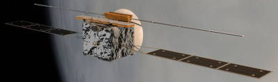](f/project/e/envision/pic01.jpg) 

 

|*Type*|*[Param.](si.md)*|
|:--|:--|
|**【Mission】**|• • •|
|Cost|€ 544 M or 12 290 ㎏ of [gold](sc_price.md) in 2019 prices|
|[CML](cml.md) / [TRL](trl.md)|CML: <mark>TBD</mark>, TRL: <mark>TBD</mark>|
|Development|2021 — 2032|
|Duration|・Total: 5.16 years (baseline) & 6.29 years (backup);  ・Flight: 2.5 years (baseline) & 3.63 years (backup);  ・Work: 2.66 years.|
|Launch|2032.11 (baseline) & 2033 (backup), [Guiana Space Centre](spaceport.md) (CSG), [Ariane 6.2](arian.md)|
|Operator|[ESA](contact/esa.md)|
|Programme|Cosmic Vision|
|Similar to|・Proposed: [Venus Flagship Mission](venus_flagship_mission.md) (US), [Venera‑D](venera_d.md) (RU);  ・Current: [Akatsuki](akatsuki.md) (JP 2010);  ・Past: [Venus Express](venus_express.md) (EU 2005), [Венера‑15/16](venera_15_16.md) (SU 1983), [Pioneer-Venus-1](pioneer_venus_1.md) (US 1978), [Pioneer-Venus-2](pioneer_venus_2.md) (US 1978).|
|Target|To detect activity & measure small‑scale changes on Venus, incl. geological & geochemical cycles involving the interior, surface, atmosphere|
|[Type](sc.md)|Orbiter spacecraft|
|**【Spacecraft】**|• • •|
|Comms|・X‑band (TT&C);  ・Ka‑band (science transmit).  ・GSs: 35 m [ESTRACK](estrack.md) (Malargue, New Norcia NNO‑1, Cebreros), NASA DSN, 15 m (Kourou 15 m, New Norcia 2 4.5 m).|
|Composition|Venus orbiter|
|Contractor|Arianespace|
|[ID](spaceid.md)|NSSDC ID (COSPAR ID): <mark>TBD</mark>, SCN: <mark>TBD</mark>|
|Manufacturer|[Thales Alenia Space](contact/tas_i.md)|
|Mass|・Launch: 2 611.3 ㎏ (baseline) & 2 781.5  ㎏ (backup);  ・Wet: 2 561.3 ㎏ (baseline) & 2 731.5 ㎏ (backup);  ・Dry: 1 295.4 ㎏; ([large satellite](sc.md), [EVN‑073](venus.md))  ・㎩yload: 255 ㎏.|
|Orbit / Site|220 × 470 ㎞ 88° ([EVN‑005](venus.md))|
|Power|2 350 W (max.)|
|Payload|1. VenSAR;  2. VenSpec (VenSpec‑H, VenSpec‑M, VenSpec‑U);  3. SRS|

 

**Projected** targets & objectives:

   - **T** — technical; **C** — contact research; **D** — distant research; **F** — fly‑by; **H** — manned; **S** — soil sample return; **X** — technology demonstration
   - **Sections of measurement and observation:**
      - Atmospheric/climate — **Ac** composition, **Ai** imaging, **Am** mapping, **Ap** pressure, **As** samples, **At** temperature, **Aw** wind speed/direction.
      - General — **Gi** planet’s interactions with outer space.
      - Soil/surface — **Sc** composition, **Si** imaging, **Sm** mapping, **Ss** samples.

<small>

|*EVN‑XXX*|*T*|*EN*|*Section of m&o*|*D*|*C*|*F*|*H*|*S*|
|:--|:--|:--|:--|:--|:--|:--|:--|:--|
|EVN‑005|T|Exploration: from Venusian orbit.| |D| |F| | |
|EVN‑009| |Atmosphere: SO₂ concentration & nature of its variations.| |D| | | | |
|EVN‑014| |Atmosphere: composition.| |D| | |F| |
|EVN‑017| |Atmosphere: structure.| |D| | | | |
|EVN‑019| |Atmosphere: energetic balance.| |D| | | | |
|EVN‑020| |Inner structure of the planet.| |D| | | | |
|EVN‑021| |Surface: map, 3D.| |D|C| | | |
|EVN‑022| |Surface: map, precise.| |D| | | | |
|EVN‑023| |Surface: mineralogical composition.| | |C| | | |
|EVN‑024| |Surface: composition.| | |C| | | |
|EVN‑025| |Surface: structure.| | |C| | | |
|EVN‑027| |The causes why Venus evolved in a planet so different from Earth.| |D|C|F| | |
|EVN‑029| |Is Venus geologically active?:| |D|C|F| | |
|EVN‑035| |Atmosphere: nature of the UV‑absorber.| |D| | | | |
|EVN‑036| |Atmosphere: cause & influence of geological & chemical activity on the climate & clouds.| |D| | | | |
|EVN‑040| |Were there oceans & why have they gone| |D|C|F| | |
|EVN‑041| |Common connection between the atmosphere & the surface.| |D| | | | |
|EVN‑042| |History & causes of the planet’s volcanic & tectonic evolution.| |D| | | | |
|EVN‑045| |Surface: nature of the tessera.| |D| | | | |
|EVN‑046| |Surface: causes of the changes during the last billion years.| |D|C|F| | |
|EVN‑051| |Dimensions & characteristics of the mantle & the core.| |D| | | | |
|EVN‑073|T|Exploration with [satellites](sc.md): large satellites.| |D| |F| | |
|EVN‑076| |Surface: volcanoes, their presence.| |D| |F| | |
|EVN‑077| |Atmosphere: chemical elements distribution.| |D| |F| | |
|EVN‑079| |Precise duration of the Venusian day.| |D| | | | |
|EVN‑085|T|Surface: tessera investigations, remote| |D| |F| | |
|EVN‑087| |Crustal support mechanisms.| |D| | | | |
|EVN‑088|T|Surface: subsurface investigations.| | |C| | | |
|EVN‑089| |Measuring the planetary gravitational field.| |D| |F| | |
|EVN‑090| |Spin axis.| |D| | | | |

</small>

 

## Mission
The concept was selected in May 2018 as a finalist to become the fifth Medium‑class mission (M5) of the Cosmic Vision programme by the ESA. The other two finalists are SPICA (an infrared space telescope), & THESEUS (a gamma‑ray space observatory). The winner will be selected in 2021 & it would launch in 2032.

EnVision would be capable of detecting cm‑scale surface changes that would enable characterization of volcanic & tectonic activity ([EVN‑029](venus.md)), & estimate rates of weathering & surface alteration ([EVN‑046](venus.md)). The Subsurface Radar Sounder would image faults, stratigraphy & weathering in the upper ~100 m of the areas mapped, to identify structural relationships & geological history ([EVN‑088](venus.md), [EVN‑042](venus.md)).

**WHY VENUS**

Despite the emphasis on Venus of early space exploration (Mariner, Venera, Vega, & Pioneer), & the more recent [Magellan](magellan.md), [Venus Express](venus_express.md), & [Akatsuki](akatsuki.md) Missions, Venus remains a global mystery. Sitting in our own planetary back yard, Venus represents an unusual example of terrestrial planet formation & evolution that obviously differs from Earth & the other solid planets of the inner solar system. Many fundamental questions remain unanswered. For example, did Venus have oceans, how has that atmosphere evolved over time, & when & why did the runaway greenhouse begin?: How does Venus lose its heat, how volcanicly & tectonicly active has Venus been over the last billion years?: Has Venus always had a «stagnant‑lid», or was a plate tectonics regime ever present earlier in her history?: What is the composition of the highland tessera terrain, are these regions the oldest rocks exposed on the Venus surface, how oxidized are those rocks & do these surfaces retain evidence of an earlier time when water was more prevalent?:  
The NASA Magellan, ESA Venus Express, & JAXA’s Akatsuki missions to Venus have revealed a complex, dynamic planet with surprising similarities as well as differences from Earth, & yet it remains the least understood of the terrestrial planets. The dramatic discovery of volcanic hotspots in Venus Express data suggest that the next stage of Venus exploration must focus on its surface: the geological interface between its dense, hostile atmosphere & its Earth‑like but puzzling interior. Magellan data reveal an incredible number of volcanoes, as well as rift systems, mountain belts, & a range of features still poorly understood, on a world with a crater count indicative of mean surface age of only 500 Ma.

**Role of Venus investigations in understanding the Earth**  
Further Venus exploration to find the causes of differences between Earth & Venus is crucial to understanding how the Solar System works & the conditions for planet formation & the emergence of life. This is of particular relevance in this era of discovery & characterization of a variety of terrestrial planets in other stellar systems & discussion on their path toward habitability.  In our solar system, Venus is the most Earth‑like planet, yet at some point in planetary history there was a bifurcation between the two: Earth has been continually habitable since the end‑Hadean, whereas Venus became uninhabitable. Indeed, Venus is the type‑planet for a world that has transitioned from habitable & Earth‑like conditions, through the inner edge of the habitable zone; thus it provides a natural laboratory to study the evolution of habitability.

**Pathway to habitability & astrobiology**  
Venus accounts for 40 % of the mass of terrestrial planets in our solar system, yet even fundamental parameters such as the relative size of its core to mantle are unknown. As we expand the scope of planetary science to include those planets around other stars, the lack of measurements for basic planetary properties such as moment of inertia, whether parts of its current surface was formed in the presence of water, core‑size & density variations with depth, & thermal profile for Venus hinders our ability to compare the potential uniqueness of the Earth & our solar System to other planetary systems.  
The prime focus of astrobiology research is the search for life elsewhere in the universe, & this proceeds with the pragmatic methodology of looking for water & Earth‑like conditions. If we seek to understand habitability, proper understanding of the boundaries of the habitable zone are necessary: further study & development of our understanding of the evolution of Venus’ environment is imperative.

**Naming conventions of Venus landscape**  
Venus features are named after females goddesses, mythological heroines & famous women in international history (poets, writers, artists, scientists) by the [International Astronomical Union’s (IAU) ⎆](https://planetarynames.wr.usgs.gov/Page/VENUS/target) Working Group for Planetary System Nomenclature, with the exception of Alpha Regio, Beta Regio, & Maxwell Montes named after James Clerk Maxwell (1831 — 1879).  
The naming of Venus Paterae include [89 famous women in history ⎆](https://planetarynames.wr.usgs.gov/SearchResults?:target=VENUS&featureType=Patera,%20paterae). More than 900 craters on Venus are named after [famous women or female first names ⎆](https://planetarynames.wr.usgs.gov/SearchResults?:target=VENUS&featureType=Crater,%20craters), such as Inge Lehmann (1888 — 1993), a Danish pioneer geophysicist, pictured below.  As thousands of never‑seen‑before geological structures will be discovered by EnVision, there will be renewed opportunities to expand the list in honour of women.

**The European Spaceport**

The Guiana Space Centre (CSG) is located in French Guiana, a French overseas department. It lies on the Atlantic coast of the Northern part of South America, close to the equator, between the latitudes of 2° & of 6° North at the longitude of 50° West. The European spaceport is located between the two towns of Kourou & Sinnamary & is operational since 1968. The CSG is governed under an agreement between France & the European Space Agency & is managed by the French National Space Agency (Centre National d’Etudes Spatiales — CNES) on behalf of the European Space Agency.

**EnVision launch & transfer options**

The proposed mission will launch in late November 2032 on Ariane 6.2 for delivery to Venus. Following orbit insertion & periapsis walk‑down in 2034, orbit circularisation will be achieved by aerobraking over a period of several months, with the main mission phase starting around end 2035. Various trade‑offs on the transfer options were performed for the ESTEC Phase 0 / CDF study ending in fall 2018, to allow more margin on the spacecraft mass, which was particularly constraining following a first assessment of the M5 proposal.

Our baseline launch in November 2032 encompasses a comparably short transfer duration. A launch in HEO (High Earth Orbit) followed by two escape manoeuvres gives more flexibility with available launch mass of 2 870 ㎏. In order to have a feasible mission, this HEO launch strategy — about 100 000 ㎞ apogee, nearly a third of the Earth‑Moon distance — is considered as baseline, with the drawback of having a time‑critical escape manoeuvre that adds a risk to be further managed at study & project level.

[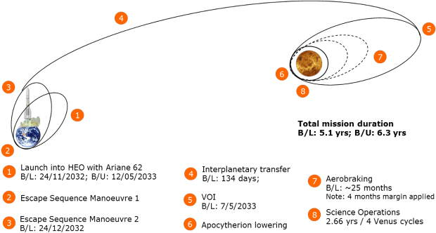](f/project/e/envision/pic06.jpg)  <small>*(Launch in High‑Earth Orbit (HEO) in November 2032, transfer & orbital insertion manoeuvers, after final ESA Concurrent Design Facility (CDF) mission study in Dec. 2018. A backup launch is foreseen in May 2033 & is significantly longer due to an Earth swing‑by. Both launch options are compatible with the programmatic mission aspects & are both feasible in terms of mass budget. Acronyms: B/L = baseline; B/U = backup; VOI = Venus Orbit Insertion; HEO = High Earth Orbit.)*</small>

**Operational orbit for Venus science**

One of the main trade‑offs involved revisiting the operational orbit options between quasi‑circular, periodic eccentricity, highly elliptical.

The selected science orbit is a quasi‑polar slightly elliptical low Venus orbit. Its Apocytherion & Pericytherion are evolving in the 220 × 470 ㎞ altitude range. Its specificity is that it has a periodic eccentricity. This means that the eccentricity vector, describing the eccentricity & argument of pericentre, evolves in time, but the initial value is such that at the end of the cycle it is back to its initial point. This characteristic enables cycle‑to‑cycle InSAR measurements, which require that the repeat & the reference orbits are such that the angular separation between the spacecraft positions at the acquisitions of two [SAR](cam.md) images of a given InSAR pair, as seen by any point imaged on the surface of Venus within the targeted Regions of Interest, remains smaller than the critical angular baseline or 1.4 deg (this includes the maximum frequency shift capability of the SAR to compensate for spectral baseline shift), provided this viewing angle is known better than 0.5 mrad.

From a nominal frozen eccentricity ~250 ㎞ altitude elliptical orbit, the imaging radar will operate in three different modes across four cycles. Each four‑orbit sequence will consist of one stereo pair stripmap; two interferometric pass‑to‑pass stripmaps; & a targeted acquisition of high resolution multipolar images.

The imaging strategy permits collection of nested image data products: [SAR](cam.md) imagery at 30 m resolution of the 20 % of the planet, repeated interferometric pairs & multi‑polarimetric imagery, for change detection & surface material mapping, over this same 20 %, & high resolution (<5 m) imaging of approximately 2 % of the planet’s surface. Core mission instruments will also provide subsurface sounder profiles, & global infrared emissivity mapping from nightside observations & spectroscopic data to identify key volcanic gases.

**Ariane 6.2 fairing**

Considering the volume available on the launcher fairing, different configuration options were considered during the CDF study, taking into account especially the solar array & SAR antenna configuration & accommodation (stored & deployed). Other factors to take into consideration were the mission profile, potential interferences, antennas position (VenSAR & SRS antennas wrt. HGA), & the radiators configuration in order to sustain the thermal requirements of the spacecraft.

[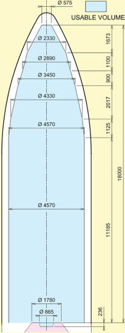](f/project/e/envision/pic07.png)  <small>*(The Ariane 6.2 usable volume beneath payload fairing in single launch structure. This volume constitutes the limits that the static dimensions of the spacecraft, including manufacturing tolerance, thermal protection installation, etc shall not exceed.)*</small>

 

## Science goals & payload
[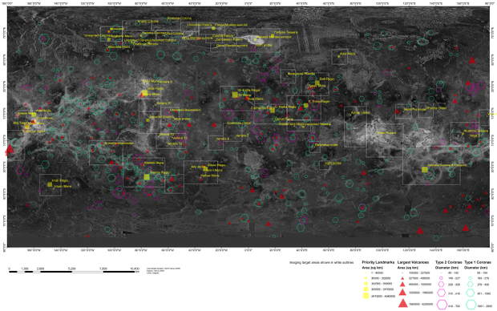](f/project/e/envision/pic03.jpg)

The core goal of EnVision is to detect activity & measure small‑scale changes on Venus, including geological & geochemical cycles involving the interior, surface & atmosphere ([EVN‑036](venus.md)). EnVision will use a number of different techniques to search for active geological processes, measure changes in surface temperature associated with active volcanism ([EVN‑029](venus.md)), characterise regional & local geological features ([EVN‑024](venus.md)), determine crustal support mechanisms ([EVN‑087](venus.md)) & constrain mantle & core properties ([EVN‑020,051](venus.md)). The mission would repeatedly observe specific targets (~20 % of the surface) with the widest possible range of measurements to fully characterise these areas. Core science measurements are:

   - high‑res mapping of specific targets ([EVN‑022](venus.md)),
   - surface change ([EVN‑046](venus.md)),
   - geomorphology ([EVN‑046](venus.md)),
   - topography ([EVN‑022](venus.md)),
   - subsurface ([EVN‑088](venus.md)),
   - thermal emission ([EVN‑019](venus.md)),
   - SO₂, H₂O, D/H ratio  ([EVN‑009,014,077](venus.md)),
   - gravity ([EVN‑089](venus.md)),
   - spin rate ([EVN‑079](venus.md)),
   - spin axis ([EVN‑090](venus.md)).

**The specific mission’s goals are:**

   - Change — Is Venus geologically active today?: How?: ([EVN‑029](venus.md))
   - Surface — What is Venus’ geological history?: ([EVN‑042](venus.md))
   - Atmosphere — How is Venus’ atmosphere linked to geological activity?: ([EVN‑041](venus.md))
   - Planetary Interior — What happens inside Venus?: ([EVN‑020](venus.md))

**Science investigation**

EnVision will use a number of different techniques to search for active geological processes, measure changes in surface temperature associated with active volcanism, characterise regional & local geological features, determine crustal support mechanisms & constrain mantle & core properties:

   - Use **differential interferometric SAR** (DiffInSAR) to look for cm‑scale surface changes over large areas. This can detect volcanic changes such as new lava flows, or for inflation or deflation of underground magma chambers. Note that for change detection, measurement of cm‑scale motion in the line‑of‑sight of the instrument would be sufficient; however, for diagnosis particularly of tectonic motions, it is necessary to resolve the vertical & horizontal components of the motion — this implies opposite‑look InSAR observations
   - Search for changes in **repeated radar imagery** of regions of interest. Change detection can be achieved either by looking for changes in reflection properties, or from changes in unit boundaries. Change detection in Magellan imagery is often not possible due to different look angle between cycles; therefore it is imperative for change detection that imagery from different cycles is obtained at the same look angle
   - Look for **thermal signature** of volcanic activity. This can be done through repeated observations either in near‑IR spectral window regions & in microwave wavelengths
   - **Spectrometry** of different surface units is critical for understanding their composition. Although the optically thick Venus atmosphere precludes this at most wavelengths, there are five spectral windows between 0.8 & 1.2 μm at which thermal emission fromthe surface escapes to space. Surface emissivity at these wavelengths encodes crucial information about mineralogical characteristics like Fe content. Emissivity mapping using these wavelengths, helps to test theories of surface composition, for example about whether the tessera highlands are composed of felsic materials akin to Earth’s granitic continental crust ([EVN‑023](venus.md)).
   - Search for plumes of possibly **volcanogenic gases** such as H₂O, SO₂, CO or OCS
   - Sensitivity to unit boundaries **beneath the surface**, & ability to detect buried structures, would significantly enhance the reconstruction of stratigraphy & thus in the reconstruction of the geological record. Subsurface sounding can enable measurement of the depth of volcanic flows & therefore the volume of volcanic effusions; of buried unit boundaries beneath volcanic plains, such as mapping of the edges of tessera regions; & could reveal unexpected features such as buried impact craters ([EVN‑088](venus.md))
   - The **internal properties of Venus**. Venus is less dense than expected if it had similar Earth’s bulk composition. In order to assess information on its interior structure, it is crucial to determine the k₂ Love number & the moment of inertia ([EVN‑020](venus.md)). The tidal Love number, estimated from Doppler tracking of Magellan & Pioneer Venus Orbiter spacecraft data, is not accurate enough to constrain the state & size of the core, the mantle composition & viscosity. EnVision shall **map the gravity field for at least 50 % of the surface with spatial resolution of better than 200 ㎞**, that is equivalent to the knowledge of spherical harmonics to at least degree of 90 & accuracy of at least 10 mGal/km. EnVision will also measure the k₂ Love number of the planet with an accuracy better than ±0.01 —compared to its current knowledge to ±0.066 uncertainty — allowing to constrain the size & state of Venus’ core & the composition of Venus’ mantle ([EVN‑051](venus.md), [EVN‑089](venus.md)).

**Venus’ global hypsometry**

Venus’ global hypsometry (variations in surface elevation relative to a mean) is unimodal, unlike the Earth’s. The study of the cumulative hypsometric curve for both planets reveals that there exists a domain of elevation for which the relationship between the elevation & the square root of cumulative area percentage is linear. This domain covers about 80 % of the mapped venusian surface & nearly all the terrestrial oceanic surface (55 % of the earth’s surface) & corresponds to an elevation range of about 2 000 m for both planets.  It places an upper bound at 90±10 ㎞ for the modal thermal lithospheric thickness of Venus, similar to the Earth’s oceanic lithosphere.  The low‑excentricity, near‑polar & relatively low altitude (220 — 400 ㎞) orbit of EnVision offers the opportunity to obtain a high‑resolved gravity field at each longitude & latitude of the Venusian globe. The analysis of the gravity field together with the topography gives insights on the lithospheric & crustal structure, allowing to better understand Venus’ geological evolution ([EVN‑042](venus.md)).

**Plains**

About 70 % of Venus topography lies near the global mean average, consisting variously of smooth, gently undulating or ridged terrain. There is a huge variety of features found on these plains — from volcanic features (see‑sides domes etc), tectonic features (e.g. wrinkle ridges etc), evidence of flows (canali), aeolian features (dune fields, parabolae). Are canali or other specific magmatic features confined to a past regime or still active today?: Is there a correlation between mesospheric SO₂ concentration & volcanic activity?: Are crater floors effusively infilled & buried from below?: Were the plains formed from a few massive outpourings in a short period of time or from many thousands of small flows over their entire history?: Or were they formed, or modified, in an entirely different way?:

**Tectonic features**

The surface of Venus is not organised into large plates like Earth’s oceans but it is partitioned into areas of low strain bounded by narrow margins of high strain ([EVN‑024,025](venus.md)), analogous to continental basins & microplates. Are these regions actively created & destroyed, like Earth’s oceans, or simply mobilised locally?: What is the significance of the global network of elevated rift systems, similar in extent to mid‑ocean ridges but very different in appearance?: Unique to Venus are coronae, quasi‑circular tectonic features, typically 100 — 500 ㎞ across, with a range of associated volcanic features. Are coronae the surface expression of plumes or magmatic intrusions?: What role do they play in global tectonic & volcanic change?:

[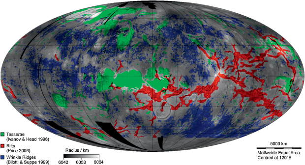](f/project/e/envision/pic04.jpg)  <small>*(Volcanic & Tectonic Features (after Ghail et al. 2018). Rifts follow topographic rises along great circle arcs, similar to Earth’s mid‑ocean ridges; wrinkle ridges are predominantly in the lowlands. Tesserae are highly deformed terrain across a range of elevations, & are possibly continental crust.)*</small>

**Impact craters**

Impact craters give absolute age of some surfaces, but too few can be seen to allow dating constraints on different geological units. On Venus, the spatial distribution of impact craters cannot be distinguished from a completely spatially random population. This indicates a relatively young surface (less than 600 — 800 Ma). There are open questions about buried features & the nature of volcanic resurfacing. It could have occurred steadily or experienced catastrophic episodes. A debate still exists between «directional» & «non‑directional» models. Mapping impact craters & their geological alteration processes will allow to construct a global chronology of the surface that is currently missing ([EVN‑022,025,046](venus.md)).

[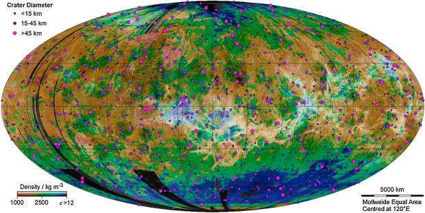](f/project/e/envision/pic05.jpg)  <small>*(Global Crater Distribution (after Ghail et al. 2018). That the spatial distribution of impact craters is indistinguishable from a random is a puzzle because no other features on Venus occur at random. Underlying colour map shows surface materials: pink − loose sediment; brown − sedimentary or weathered rock; green − volcanic rock; blue − low permittivity materials.)*</small>

**Tesserae highlands**

Representing about 10 % of the Venus surface, tesserae may represent the oldest terrain on Venus. The processes which have shaped them are unknown. They have never been visited by any lander, so their composition is unknown. They might be either felsic (formed in a water‑rich environment) or mafic rock types. Detailed morphology & their tectonic features, coupled with characterization of surface emissivity & subsurface features, will provide an extensive investigation of these regions ([EVN‑045,085](venus.md)).

**Volcanic rises**

Given its similar size & bulk composition as Earth, Venus is expected to be volcanicly & tectonicly active today (unlike Mars, which, being only a tenth of Earth’s mass, has lost more of its internal heat). Steep slopes & landslides are common on Venus’ surface geology, implying active uplift, but existing data provide no constraint on current rates of tectonic activity. Comparaison of gravity mapping & topography have revealed some regions which appear to be at higher elevation than would be the case if the mantle were stagnant, implying that they lie atop magmatic upwelling. There are regions where volcanic activity is particularly likely to occur. Sites of potential volcanism identified in Venus Express data were in these locations. Therefore the observation & characterization of these regions are of high priority ([EVN‑029,076](venus.md)).

**Radio Science Experiment**. To measure the gravity field of Venus at an unprecedented resolution.  [PI](principal_investigator.md) — [Caroline Dumoulin](person.md), LPG, Université de Nantes, France; [Pascal Rosenblatt](person.md), LPG, Université de Nantes, France.

The notional payload consists of 3 instruments:

   1. **VenSAR (Venus Synthetic Aperture Radar)** operates at 3.2 ㎓ in the S band (9.4 ㎝ wavelength) for spatial resolutions of 1 — 30 m. Operating at a frequency below 30 ㎒ has the advantage that the signal penetrates the ground, providing information on subsurface structures that are crucial to understanding the history of Venus. A sounder in the 9 — 30 ㎒ range is able to penetrate to a crustal depth of 750 — 340 m respectively & image subsurface features at a vertical resolution of 5 — 16 m. ([EVN‑042](venus.md), [EVN‑088](venus.md)) An earlier version of the proposal intended to use spare parts produced for the Earth‑orbiting Sentinel‑1 satellite.  [PI](principal_investigator.md) — [Richard Ghail](person.md), Royal Holloway, University of London, UK.
   2. **VenSpec (Venus Spectroscopy suite)** consists of 3 channels: VenSpec‑M (VEM), VenSpec‑U (VeSUV), VenSpec‑H (VIVO). This suite would search for temporal variations in surface temperatures & tropospheric concentrations of volcanic gases, indicative of volcanic eruptions.
      - **VEM (VenSpec‑M)** would provide compositional data on rock types;  [PI](principal_investigator.md) — [Jörn Helbert](person.md), DLR Institute of Planetary Research, Berlin, Germany;
      - **VeSUV (VenSpec‑U)** would monitor sulphured minor species (mainly SO & SO₂) as well as the mysterious UV absorber ([EVN‑035](venus.md)) in Venusian upper clouds;  [PI](principal_investigator.md) — [Emmanuel Marcq](person.md), LATMOS, IPSL, France;
      - **VIVO (VenSpec‑H)** would perform extremely high resolution atmospheric measurements;  [PI](principal_investigator.md) — [Ann Carine Vandaele](person.md), Royal Belgian Institute for Space Aeronomy (BIRA/IASB), Belgium.
   3. **SRS (Subsurface Radar Sounder)** would image faults, stratigraphy & weathering in the upper ~100 m of the areas mapped by VenSAR, to identify structural relationships & geological history ([EVN‑041](venus.md)).  [PI](principal_investigator.md) — [Lorenzo Bruzzone](person.md), Università di Trento, Italy.

 

### VenSAR
VenSAR is based on the NovaSAR‑S instrument built for the UK Space Agency & launched in 2018. NovaSAR‑S SAR Payload developed by Airbus Defence & Space is an active antenna is configured from an array of 18 identical phase centres each comprising a 2 × 2 array of dual polar, 6‑element sub‑arrays, designed for low‑cost Earth Observations & operating at 3.2 ㎓ (9.4 ㎝) in the S‑band, ideal for the Venus atmosphere. VenSAR adapts this modular design by taking 24 of these phase centres & configuring them into a six columns of four rows, producing a 5.47 × 0.60 m active phased array antenna capable of delivering five key science modes: InSAR (VI1 as standard, VI2 for orbit‑to‑orbit, & VI3 for opposite‑look), stereo polarimetry (VP1 StereoPolSAR), all at Reconnaissance scale (30 m resolution); Exploration scale imagery (VH1 HiRes at 6 m resolution); Locality‑scale Sliding Spotlight (VS1 Spotlight at 1 m resolution); & Zonal‑scale microwave brightness temperature (VR1 Radiometry).

[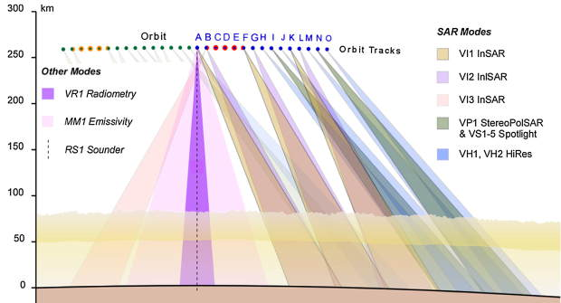](f/project/e/envision/pic12.jpg)  <small>*(This figure illustrates the VenSAR mapping sequence for the ~16 orbits in every 24 hours: 4 orbits are reserved for telemetry (open circles); 3 pairs of orbits for InSAR (VI1 & either VI2 or VI3); 2 orbits for StereoPolSAR; & 4 orbits for HiRes & Spotlight.)*</small>

EnVision’s InSAR radar instrument is sensitive primarily to the morphology (roughness & slope) & relative permittivity of the surface materials. Polarimetric data provide important information about the nature of the surface & near subsurface that cannot be obtained solely with backscatter power images, such as those obtained by Magellan. In particular, polarisation ratios can help identify the thickness & grainsize of loose surface sediment. Since terrestrial studies show that almost all natural targets have reciprocal cross polarisation (i.e. HV backscatter is identical with VH), only HH, VV, & VH (or HV) polarisations are required to characterise the backscatter properties.

Differential InSAR (DInSAR) is the only tool capable of measuring geological‑scale strains from orbit & is particularly effective across high strain rate terrane margins, in which LoS displacements may be 10 ㎜ a⁻¹ or more. Combining LoS displacements derived from DInSAR sets in ascending & descending (opposite look) orbits allows the vertical & at least one of the horizontal components of displacement to be isolated. Two complementary methods are commonly used to detect displacements as small as 1 ㎜ a⁻¹, even in the absence of an earthquake. Combining these techniques with opposite look sets to isolate components of movement means that even the low strain deformation of terrane interiors is detectable with DInSAR.

 

### VenSpec Suite

VenSpec will provide unprecedented insights into the current state of Venus & its past evolution. VenSpec will perform a comprehensive search for volcanic activity by targeting atmospheric signatures, thermal signatures & compositional signatures, as well as a global map of surface composition ([EVN‑076](venus.md)).

The VenSpec consortium structure is a balance between a fully integrated instrument & three completely independent instruments. It builds on a long history of collaboration between the consortium partners.

The figure below shows the shared responsibilities of each European partner with respect to the VenSpec channels. The VenSpec consortium consists of three sub‑instruments with a joint science team. The shared management of the consortium structure allows to leverage the synergies between the three instruments & minimize the resources, while at the same time ensuring that each partner can develop their contributions largely independently.

The VenSpec instrument suite consists of three channels: VenSpec‑M, VenSpec‑H, VenSpec‑U, & the Central Control Unit (CCU). All three channels have their independent optics due to the very different imaging concepts & wavelengths ranges covered. The instruments are all nadir pointing.

Each instrument has its own electronic unit for functionalities dedicated to that instrument. The central control unit contains two sub‑units, the Data Handling Unit (DHU) & the Power Handling & Distribution Unit (PHDU). The DHU will handle the data interface to the spacecraft & can perform common control functions for all units. The PHDU will provide dedicated voltages to each of the instruments in the VenSpec suite. The details of the functionality of the CCU will be part of the Phase A study.

VenSpec‑M will use the methodology pioneered by VIRTIS on Venus Express but with more & wider spectral bands, the VenSAR‑derived DEM, & EnVision’s circular orbit to deliver near‑global multichannel spectroscopy with wider spectral coverage & an order of magnitude improvement in sensitivity. It will obtain repeated imagery of surface thermal emission, constraining current rates of volcanic activity following earlier observations from Venus Express.

VenSpec‑H will be dedicated to high resolution atmospheric measurements. The main objective of the VenSpec‑H instrument is to detect & quantify SO₂, H₂O & HDO in the lower atmosphere ([EVN‑009](venus.md)), to enable characterization of volcanic plumes & other sources of gas exchange with the surface of Venus, complementing VenSAR & VenSpec‑M surface & SRS subsurface observations. A nadir pointed high‑resolution infrared spectrometer is the ideal instrument for these observations at the 1·0 μm, 1·7 μm, & 2·0 — 2·3 μm atmospheric windows that permit measurements of the loweratmosphere during the night, & above the clouds during the day. Baseline observations will be performed on the night side but observations at all times of day are possible.

VenSpec‑U will monitor sulphured minor species (mainly SO & SO₂) & the as yet unknown UV absorber in Venusian upper clouds & just above. It will therefore complement the two other channels by investigating how the upper atmosphere interacts with the lower atmosphere, & especially characterise to which extent outgassing processes such as volcanic plumes are able to disturb the atmosphere through the thick Venusian clouds. A twin channel (0.2 nm in high‑resolution, 2 nm in low‑resolution) spectral imager in the 190 — 380 nm range able to operate in nadir would be especially suited to such a task.

**VenSpec thermal control**

Thermally VenSpec will require a stabilized temperature reference point (e.g. a coldfinger) for the optics & detectors of VenSpec‑M & VenSpec‑U. VenSpec‑H requires sun observations for calibration. Whether these are obtained with a dedicated sun port or via a pointing mirror is part of the Phase A study. Also for VenSpec‑H, a dedicated radiator might be required pending a detailed performance analysis in Phase A.

 

### VenSpec‑H
VenSpec‑H is a high‑resolution infrared spectrometer working in nadir viewing mode. It is an echelle grating spectrometer coupled to a high‑performance, actively‑cooled SOFRADIR HgCdTe detector, with an Acousto‑Optic Tunable Filter (AOTF) at its entrance for order selection (. These components are optimised for Venus atmospheric observations in the spectral range 1.0 — 2.5 μm.

VenSpec‑H instrument will detect & quantify SO₂, H₂O & HDO in the lower atmosphere, to enable characterization of volcanic plumes & other sources of gas exchange with the surface of Venus, complementing VenSAR & VenSpec‑M surface & SRS subsurface observations. A nadir pointed high‑resolution infrared spectrometer is the ideal instrument for these observations at the 1·0 μm, 1·7 μm, & 2·0 — 2·3 μm atmospheric windows that permit measurements of the lower atmosphere during the night, & above the clouds during the day. Baseline observations will be performed on the night side but observations at all times of day are possible.

**VenSpec‑H optics**

The optical path of NOMAD‑LNO is reused for VenSpec‑H. The occultation capability (periscope & flip mirror) is skipped in the baseline version of VenSpec‑H since it is a pure nadir oriented instrument. However, calibration of the instrument might require pointing to the Sun.

The optics of the VenSpec‑H channel are divided in three main units :

   - Entrance optics that collects the light, defines the FOV & restricts the observed wavelength domain using an AOTF;
   - Spectrometer with an echelle grating that defines the free spectral range & the instrument line profile (ILP);
   - Detector system that records the spectra.

 

### VenSpec‑M
VenSpec‑M will use the methodology pioneered by VIRTIS on Venus Express but with more & wider spectral bands, the VenSAR‑derived DEM, & EnVision’s circular orbit to deliver near‑global multichannel spectroscopy with wider spectral coverage & an order of magnitude improvement in sensitivity. It will obtain repeated imagery of surface thermal emission, constraining current rates of volcanic activity following earlier observations from Venus Express.

Observations from VIRTIS have revealed surface emissivity variations correlated with geological features, but existing data sets contain only three spectral channels. VenSpec‑M is optimized to map the surface composition & texture, & to search for active volcanism using the narrow atmospheric windows, building on lessons from prior instrumentation & methodology. It offers an opportunity to gain important information about surface mineralogy ([EVN‑023](venus.md)) & texture ([EVN‑025](venus.md)) by virtue of having six different channels for surface mapping. This investigation is also based on high temperature laboratory experiments currently performed at the Planetary Spectroscopy Laboratory in DLR Berlin.

VenSpec is focused mainly on observing the surface, mapping in all near‑IR atmospheric windows using filters with spectral characteristics optimized for the wavelengths & widths of those windows. It offers an opportunity to gain important information about surface mineralogy & texture by virtue of having six different channels for surface mapping. It also observes bands necessary for correcting atmospheric effects; these bands also provide valuable scientific data on composition as well as altitude & size distribution of the cloud particles ([EVN‑077](venus.md)), & on H₂O vapor abundance variations in the lowest 15 ㎞ of the atmosphere.

[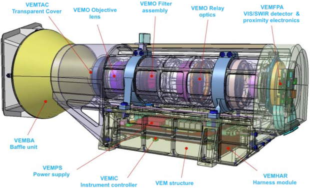](f/project/e/envision/pic13.jpg)

**VenSpec‑M optics**

The VenSpec‑M optics has a field of view (FOV) of 45°, equivalent to 307 ㎞ from the nominal orbit altitude. Each pixel resolves 0·07° × 0·07° (303 m), which with an integration time of 90 ms, leads to pixel dimension of 303 m across & 1 000 m along track. Each ultra‑narrow‑band filter (made by Materion) occupies 33 of the 640 pixels across track; these are binned along & across track into 10 × 10 ㎞ cells at the top of the clouds (for cloud correction) & 60 × 60 ㎞ cells at the surface, providing a SNR of at least 300 for the cloud correction band at <1·5 μm & >500 for the mineralogical bands. This approach provides contiguous spectral emissivity coverage with the 10 ㎞ orbit advance.

 

### VenSpec‑U
VenSpec‑U is a dual channel (low resolution, hereafter LR: 190 — 380 nm; & high resolution, hereafter HR: 210 — 240 nm) UV spectral imager designed to monitor cloud top abundances of volcanic sulphured gases (SO, SO₂) as well as UV contrasts through spectral analysis of backscattered sunlight on the day side of Venus. The entrance objective is shared by both channels & consists in two lenses forming the image of the field of view (FOV) onto a common plane including two slits. Both slits (LR & HR) are parallel, & their corresponding FOV are slightly shifted in their narrow direction, equivalent to 9° (corresponding to 30 ㎞ at the cloud top level of observation). Each slit image is then spectrally dispersed by their respective toroidal holographic grating, & is formed on a shared E2V Capella CMOS detector. Therefore, the narrow‑slit axis of the detector contains the spectral information, whereas the long‑slit axis contains the spatial information along the 22.5° FOV of each slit. Binning on the spatial axis is performed on the CMOS, enabling a SNR ~ 100 for both channels (resulting in a coarser spatial resolution on the more dispersed HR channel). The remaining spatial direction is provided through orbital scrolling, an observational strategy known as pushbroom. Observations can be conducted in a strict nadir geometry (null emission angle), or in near‑nadir geometry (emission angle < 30°).

 

### SRS
The Subsurface Radar Sounder (SRS) is a nadir‑looking radar sounder instrument, which transmits low‑frequency radio waves with the unique capability to penetrate into the subsurface. When these radio waves travel through the subsurface, their reflected signal varies in power through the interaction with subsurface horizons & structures representing dielectric discontinuities. These varying reflections are detected by the radar sounder & used to create a depth image of the subsurface (referred to as radargram) & so map unexposed subsurface features. The design of the SRS instrument depends on the physical & electromagnetic modelling of the surface & subsurface targets.

**SRS science targets for subsurface observation**

On the surface of Venus, a number of unusual geological features such as pancake domes, complex ridged terrain (tesserae) & unusually long lava channels have been identified from images acquired by previous missions. The knowledge of how these features were formed can reveal significant information about the geodynamic evolution of Venus’ surface & interior. SRS can acquire fundamental information on subsurface geology by mapping the vertical structure (mechanical & dielectric interfaces) & properties of tesserae, buried craters plains, lava flows & volcanic features, thus providing useful data for inferring their genesis. It can also provide information on the surface in terms of roughness, composition & dielectric properties at wavelengths completely different from those of SAR, thus allowing a better understanding of the surface properties. The goals of the SRS measurements are:

   - To determine any layering in modified craters & to search for **buried craters**
   - To characterize **buried strata**
   - To determine the **three‑dimensional structure of the tesserae** & to characterize cross‑cutting relationships at their edges ([EVN‑021](venus.md))
   - To determine the volume of **flow units** & help to establish the sequence of emplacement events
   - To search for **buried features** & understand in three dimensions the boundaries between units

**SRS sounder design**

SRS heritage includes RIME onboard JUICE, MARSIS on the Mars Express & SHARAD on the Mars Reconnaissance Orbiter. SRS consists of a deployable dipole antenna & an instrument block consisting of two main parts: the receiver & digital subsystem (RDS), containing the receiver module & the digital electronics section (DES) that includes the digital & conversion functions; & the transmitter (Tx) & matching network, which provide the high power amplification for the signal for transmission & impedance matching to the antenna.

**SRS operation modes**

To achieve the science goals, the radar shall be designed to work with a central frequency in the range 9 — 30 ㎒ for optimal ground penetration capability. The baseline is to adopt a central frequency of 9 ㎒ with 6 ㎒ bandwidth resulting in a fractional bandwidth of about 67 %. The maximum radiated power baseline is 200 W. The SRS maximum penetration depth has been inferred from the various dielectric measurements in different types of Venus‑analog basaltic rocks. For the baseline configuration assuming a mean relative permittivity ε = 6, radar operations at a central frequency of 9 ㎒ result in an average penetration of 600 m & a range resolution of ~16 m. Higher central frequencies, such as 30 ㎒, result in a shallower penetration (~350 m) & an improved resolution of 5 m.

In the nominal mode for science operation different parameters can be combined to accomplish two main kinds of acquisitions:

   - **SRS Hi‑density:** To acquire data of some high relevance targets (~20 % of the planet) with high resolution & track‑to‑track distance ≤10 ㎞. The high density allows a better reconstruction of the analyzed area.
   - **SRS Low‑density:** To acquire low‑resolution data for obtaining uniform global coverage (>80 % of the planet) with track‑to‑track distance ≤50 ㎞.

 

### RSGE
**Mapping the local gravity field**

Any orbiting spacecraft is sensitive to the **local gravity field**, plus the gravity field of the Sun and, to a minor extent, other planets. These gravitational perturbations, generate spacecraft orbital velocity perturbations from which the gravity field of a planet can be determined at a spatial resolution which depends on the **orbital altitude**: the lower the altitude, the better the resolution. This low‑altitude has to be performed everywhere over the planet to determine the expected high‑resolution gravity field, hence a near‑circular & near‑polar orbit is preferable. It was not the case with the Magellan mission which had elliptic orbits to solve for the gravity field harmonics, leading to uneven resolution over longitude & latitude. Another limitation of low‑altitude orbit for the gravity field is the **atmospheric drag** which perturbs the resolution of gravity harmonics primarily because the density of the high‑altitude atmosphere (the thermosphere) is highly variable. The lowest altitudes reached by Magellan orbits were significantly affected by the drag below about 200 ㎞ altitude. **The low‑excentricity, near‑polar & relatively low altitude (220 — 400 ㎞) orbit of EnVision offers the opportunity to obtain a high‑resolved gravity field at each longitude & latitude of the Venusian globe.** The analysis of the gravity field together with the topography gives insights on the lithospheric & crustal structure, allowing to better understand Venus’ geological evolution.

**Tidal deformation**

In the absence of seismic data, **the measurements of the tidal deformation & proper motion of the planet** provide the way to probe its **deep internal structure** (size & state of the core). The tidal deformation can be measured in the EnVision orbital velocity perturbations through the gravitational potential variations it generates (so‑called **k₂ tidal Love number**).

**Sounding the neutral atmosphere & ionosphere of Venus**

EnVision’s communication system will also be used for **sounding the neutral atmosphere & ionosphere of Venus**, during the frequent **occultations** that occur during the communications links. As the spacecraft starts to be occulted (or after, when reappearing from behind the planet during egress) the spacecraft carrier signal probes the layers of the planet’s atmosphere, causing changes in the frequency & amplitude of the carrier waves (at X‑ & Ka‑bands). The bending that occurs through atmospheric refraction can be retrieved from the Doppler shift residual obtained during the occultation event, with accurate estimates of the spacecraft state vectors. By determining the dependence of the signal bending angle with respect to altitude (more precisely the impact parameter which is related to the refractivity coefficient), profiles of the neutral atmosphere & plasma densities can be derived, essential for characterising the **atmospheric structure & dynamics** ([EVN‑017](venus.md)): By probing the neutral atmosphere above ~ 40 ㎞, **density, temperature & pressure profiles** can be derived to characterise the atmospheric dynamics & its longitudinal & latitudinal as well as local time variations. In the same way, by probing the ionosphere above ~ 80 ㎞, its structure can be characterised & its interaction with the solar wind plasma studied. When conducting this experiment, coherent dual‑frequency transmission (X‑ & Ka‑band) is desirable in order to separate the nondispersive from the dispersive media effects, both to distinguish the neutral atmosphere from the ionosphere, & also to reduce the propagation noise of the tracking observables from solar corona & solar wind effects. The experiment will be conducted in two/three‑way mode, as required for navigation purposes so that normally ingress profiles & egress profiles at some extent will result from the experiment.

The use of Ka‑band will provide for the first time the **opportunity to distinguish between gaseous & liquid (droplets) sulfuric acid** ([EVN‑077](venus.md)) concentration in the atmosphere of the planet (at about 45 — 55 ㎞ altitude). This unique measurement of gaseous vs liquid compound of sulfuric acid is a decisive observation to constrain the SO₂ volcanic gas cycle into the atmosphere, & in turn the current geologic activity of Venus ([EVN‑029](venus.md)).

 

## Spacecraft
Key principles of EnVision:

   - Nested SAR imaging
   - Combination of interior, surface, and atmospheric data
   - Careful selection of target regions
   - Repeated observations (2 Venus days — cycle)

**Spacecraft stowed configuration**

[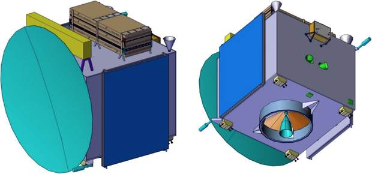](f/project/e/envision/pic08.jpg)  <small>*(EnVision stowed configuration is shown without the launcher fairing. Approximate size is 2.0 × 2.0 × 2.0 m. The satellite has a compact body & the Solar Arrays, the SAR antenna & the SRS antenna are the elements stowed during launch & deployed in orbit. At the bottom right is the 420 N Main Engine. Also visible are 8 + 8 10 N thrusters for AOCS.)*</small>

**Spacecraft deployed configuration**

[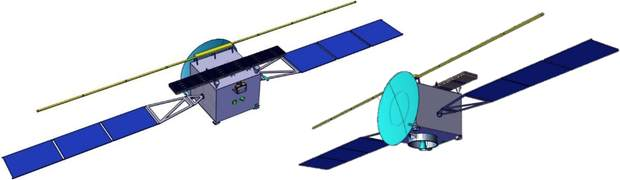](f/project/e/envision/pic09.jpg)  <small>*(EnVision deployed configuration & the position of the main deployable elements (i.e. SAR antenna, SRS antenna & Solar Arrays) in their selected positions as consolidated during the discussions in the CDF study sessions. Solar arrays are 97 ㎏ with a 15.7 m² area (57 % solar cells, 40 % optical reflectors). A fixed, 3‑m HGA requires dedicated slews. Ka‑Band downlink is 4.2 Mbps @ 1.7 AU (Venus superior conjunction), 75 Mbps @ 0.3 AU (Venus inferior conjunction) at transponder saturation limit.)*</small>

**Instrument locations**

The location of the instruments are on the top panel of the spacecraft. This panel faces the launcher flight direction of the satellite in launch configuration. The top panel of the s/c will be nadir looking during observations.

[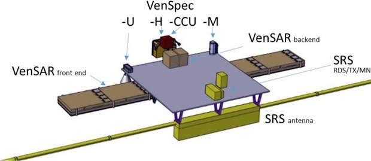](f/project/e/envision/pic10.jpg)  <small>*(Spacecraft top panel with mission instruments.)*</small>

[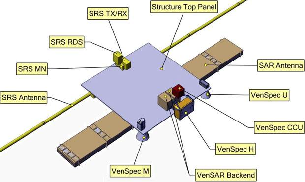](f/project/e/envision/pic11.jpg)  <small>*(A detail of the EnVision Mission Instrument panel shows the distribution of the units.The top panel of the s/c will be nadir looking during observations.)*</small>

**EnVision mission propulsion**

Chemical, electric & hybrid propulsion options were assessed, even if the hybrid ones were discarded early on in the study, due to added complexity & mass. In order to compare the two options (chemical & electric), they were selected to be assessed as system options. The electric propulsion option would see a transfer, Venus orbit insertion & science orbit acquisition with the electrical thrusters, while the station keeping & AOCS would be executed with monopropellant. The chemical propulsion option has every manoeuvre done through a bi‑propellant system & uses aerobraking for the science orbit acquisition.

 

## Community, library, links
**PEOPLE:**

[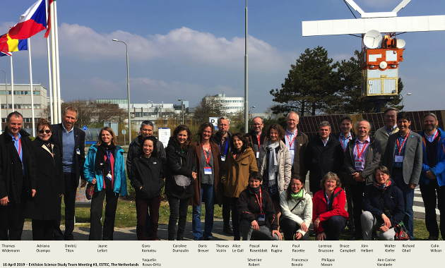](f/project/e/envision/pic02.jpg)

**ESA‑NASA consortium**

The mission is studied in collaboration with [NASA](contact/nasa.md), with the potential sharing of responsibilities currently under assessment. Main contact: [Ocampo, Adriana Christian](person.md).

**EnVision proposal team**

   1. [Lorenzo Bruzzone](person.md) — Subsurface Sounding (SRS)
   1. [Caroline Dumoulin](person.md) — Interior Structure & Dynamics
   1. [Richard Ghail](person.md) — Radar Systems Engineering, **Lead proposer** (VenSAR)
   1. [Jörn Helbert](person.md) — Thermal Infrared Mapping, Mineralogy (VenSpec‑M)
   1. [Emmanuel Marcq](person.md) — UV Spectroscopy, Volcanic Gases (VenSpec‑U)
   1. [Philippa Mason](person.md) — Surface Processes
   1. [Pascal Rosenblatt](person.md) — Spin Dynamics
   1. [Ann Carine Vandaele](person.md) — IR Spectroscopy, Volcanic Gases (VenSpec‑H)
   1. [Thomas Widemann](person.md) — UV, Visible & Infrared Spectroscopy, **Deputy lead**
   1. [Colin Wilson](person.md) — Atmospheric Science, **Deputy lead**

**Science Study Team (SST)**

   1. [Veronique Ansan](person.md), LPG, University de Nantes, France
   1. [Francesca Bovolo](person.md), CICT, Fondazione Bruno Kessler, Italy
   1. [Doris Breuer](person.md), DLR Institute of Planetary Research, Berlin, Germany
   1. [Bruce Campbell](person.md), Center for Earth & Planetary Studies, National Air & Space Museum, Washington, DC
   1. [Richard Ghail](person.md), Dpt. Earth Sciences, Royal Holloway, University of London, UK
   1. [Walter Kiefer](person.md), Lunar & Planetary Institute, Houston, TX
   1. [Goro Komatsu](person.md), IRSPS, Università degli Studi G. d’Annunzio Chieti e Pescara, Italy
   1. [Alice Le Gall](person.md), LATMOS, IPSL, France
   1. [Philippa Mason](person.md), Dpt. Earth Science & Engineering, Imperial College, London, UK
   1. [Thomas Widemann](person.md), LESIA, Observatoire de Paris, France
   1. [Colin Wilson](person.md), Dpt. Physics, University of Oxford, UK

**ESA Study Team**

   1. [Jayne Lefort](person.md) — EnVision study operations manager
   1. [Jens Romstedt](person.md) — EnVision study payload manager
   1. [Ana Rugina](person.md) — EnVision study system manager
   1. [Dmitrij Titov](person.md) — EnVision study scientist
   1. [Thomas Voirin](person.md) — EnVision study manager
   1. [Arno Wielders](person.md) — EnVision study deputy payload manager

**EnVision Science Team**

The EnVision Science study team & the EnVision proposal team are gathering support from the larger science community to form the EnVision Science Team.

 

**COMMUNITY:**

**EnVision International Conference 2020**  
The first international conference to discuss the scientific investigations of the EnVision mission at CNES headquarters in central Paris, France from 12 — 14 February 2020. The conference will welcome all presentations related to the mission’s payload & its science investigations. The conference will take place at CNES Paris headquarters, salle de l’Espace (maximum 128 participants). The Centre national d’études spatiales (CNES) is the French government space agency. Its headquarters are located in central Paris. CNES is jointly operated by the French Ministry of Defence & Ministry of Research & Higher Education. <http://bit.ly/EnVisionConference>

 

## Docs & links
|Navigation|
|:--|
|**[FAQ](faq.md)**【**[SCS](scs.md)**·КК, **[SC (OE+SGM)](sc.md)**·КА】**[CON](contact.md)·[Pers](person.md)**·Контакт, **[Ctrl](control.md)**·Упр., **[Doc](doc.md)**·Док., **[EF](ef.md)**·ВВФ, **[Error](error.md)**·Ошибки, **[Event](event.md)**·События, **[FS](fs.md)**·ТЭО, **[HF&E](hfe.md)**·Эрго., **[KT](kt.md)**·КТ, **[Model](model.md)**·Модель, **[N&B](nnb.md)**·БНО, **[Project](project.md)**·Проект, **[QM](qm.md)**·БКНР, **[R&D](rnd.md)**·НИОКР, **[SI](si.md)**·СИ, **[Test](test.md)**·ЭО, **[TRL](trl.md)**·УГТ, **[Way](way.md)**·Пути|
|*Sections & pages*|
|**【】**  <mark>NOCAT</mark>|

   1. Docs:
      - [Page directory](f/project/e/envision/)
      - [Proposal_M5_5oct2016 ❐](f/envision/doc001.pdf)
      - [EnVision_CDF_IFP_2018_Summary ❐](f/envision/doc002.pdf)
   1. <https://envisionvenus.eu/>
   1. <https://en.wikipedia.org/wiki/EnVision_(spacecraft)>
   1. <https://twitter.com/envisionvenus>
   1. <https://www.facebook.com/EnVisionVenus/>
