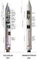
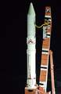
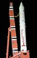
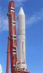

# Epsilon
> 2019.05.23 [🚀](../index/index.md) [despace](index.md) → [LV](lv.md)

[TOC]

---

> <small>**Epsilon** — англоязычный термин, не имеющий аналога в русском языке. **Эпсилон** — дословный перевод с английского на русский.</small>

**Epsilon** — семейство японских одноразовых твердотопливных ракет‑носителей лёгкого класса, ранее известная как ASR (от англ. Advanced Solid Rocket — передовая твердотопливная ракета), для запуска лёгких научных космических аппаратов. Её разработка началась в 2007 году, как замена четырёхступенчатой твердотопливной ракеты‑носителя «Мю‑5», использование которой было прекращено в 2006 году.

|*Version*|*Description*|*Activity*|
|:--|:--|:--|
|Epsilon|Базовый вариант.|Экспл. завершена (2013 ‑ 2013)|
|┕ Epsilon 2|Модификация.|**Активен** (2016 ‑ …)|

---

 

## Epsilon 2
**Epsilon 2** — японская одноразовая твердотопливная ракета‑носитель лёгкого класса. После первого полёта РН Epsilon подверглась модификации: общая масса выросла до 95.1 т, длина — до 26 м, ПН на НОО до 1 500 ㎏, а на ССО — до 590 ㎏ (с использованием четвёртой ступени CLPS).

|*Characteristic*|*[Value](si.md)*|
|:--|:--|
|Активность|**Активен** (2016.12.20 ‑ …)|
|[Аналоги](analogue.md)|[Long March 6](long_march.md) (Китай) ┊ [Minotaur 4 и 5](minotaur.md) (США) ┊ [Vega](vega.md) (Европа)|
|Длина/диаметр|26 м / 2.6 м|
|[Космодромы](spaceport.md)|[Uchinoura](uchinoura.md) (LP-Mu)|
|Масса старт./сух.|95 400 ㎏ / … ㎏|
|Разраб./изготов.|[JAXA](zz_jaxa.md), [IHI](zz_ihi.md) (Япония) / [IHI](zz_ihi.md) (Япония)|
|Ступени|3|
|[Топливо](fuel.md)|[HTPB](htpb.md)|
| | |

**Выводимые массы.**

|*Космодром*|*РН*|<small>*Масса,  [НОО](nnb.md), т*</small>|<small>*Масса,  [ГСО](nnb.md), т*</small>|<small>*Масса к  [Луне](moon.md), т*</small>|<small>*Масса к  [Венере](venus.md), т*</small>|<small>*Масса к  [Марсу](mars.md), т*</small>|*Примечания*|
|:--|:--|:--|:--|:--|:--|:--|:--|
|[Uchinoura](uchinoura.md)|Epsilon|1.5|0.4|—|—|—|Пуск — $ 39 млн (2019 г);  ПН 1.57 % от ст.массы|

<small>Примечания:  **1)** Указана масса для наихудших условий старта.  **2)** В скобках указана масса для наилучших условий старта.</small>

 

## Архивные

### Epsilon
**Epsilon** — японская одноразовая твердотопливная ракета‑носитель лёгкого класса. Первоначальная версия ракеты‑носителя использовалась только для одного запуска, затем была заменена на Epsilon 2. В качестве первой ступени установлен модифицированный твердотопливный боковой ускоритель SRB-A3, используемый на РН [H-IIA](h2.md) и [H-IIB](h2.md). Длина обтекателя составляет 9.19 м, диаметр — 2.5 м, вес — около 800 ㎏.

|*Characteristic*|*[Value](si.md)*|
|:--|:--|
|Активность|Экспл. завершена (2013.09.14 ‑ 2013.09.14)|
|[Аналоги](analogue.md)|[Long March 6](long_march.md) (Китай)|
|Длина/диаметр|22.4 м / 2.6 м|
|[Космодромы](spaceport.md)|[Uchinoura](uchinoura.md) (LP-Mu)|
|Масса старт./сух.|91 000 ㎏ / … ㎏|
|Разраб./изготов.|[JAXA](zz_jaxa.md), [IHI](zz_ihi.md) (Япония) / [IHI](zz_ihi.md) (Япония)|
|Ступени|3|
|[Топливо](fuel.md)|[HTPB](htpb.md)|
| ||

**Выводимые массы.**

|*Космодром*|*РН*|<small>*Масса,  [НОО](nnb.md), т*</small>|<small>*Масса,  [ГСО](nnb.md), т*</small>|<small>*Масса к  [Луне](moon.md), т*</small>|<small>*Масса к  [Венере](venus.md), т*</small>|<small>*Масса к  [Марсу](mars.md), т*</small>|*Примечания*|
|:--|:--|:--|:--|:--|:--|:--|:--|
|[Uchinoura](uchinoura.md)|Epsilon|1.2|0.3|—|—|—|Пуск — $ 39 млн (2017 г);  ПН 1.31 % от ст.массы|

<small>Примечания:  **1)** Указана масса для наихудших условий старта.  **2)** В скобках указана масса для наилучших условий старта.</small>

 

## Docs & links (TRANSLATEME ALREADY)
|Navigation|
|:--|
|**[FAQ](faq.md)**, **[Cable](cable.md)**·БКС, **[Camera](cam.md)**·Камера, **[Comms](comms.md)**·Радио, **[Contact](contact.md)**·Контакт, **[Control](control.md)**·Упр., **[Doc](doc.md)**·Док., **[Doppler](doppler.md)**·ИСР, **[DS](ds.md)**·ЗУ, **[EB](eb.md)**·ХИТ, **[ECO](ecology.md)**·Экол., **[EF](ef.md)**·ВВФ, **[ElC](elc.md)**·ЭКБ, **[EMC](emc.md)**·ЭМС, **[Error](error.md)**·Ошибки, **[Event](event.md)**·События, **[FS](fs.md)**·ТЭО, **[Fuel](fuel.md)**·Топливо, **[GNC](gnc.md)**·БКУ, **[GS](scs.md)**·НС, **[HF&E](hfe.md)**·Эрго., **[IU](iu.md)**·Гиро., **[KT](kt.md)**·КТЕХ, **[LAG](lag.md)**·ПУC, **[LES](les.md)**·САСП, **[LS](ls.md)**·СЖО, **[LV](lv.md)**·РН, **[MCC](mcc.md)**·ЦУП, **[Model](model.md)**·Модель, **[MSC](sc.md)**·ПКА, **[N&B](nnb.md)**·БНО, **[NR](nr.md)**·ЯР, **[OBC](obc.md)**·ЦВМ, **[OE](oe.md)**·БА, **[Pat.](патент.md)**·Патент, **[Proj.](project.md)**·Проект, **[PS](ps.md)**·ДУ, **[R&D](rnd.md)**·НИОКР, **[Robot](robotics.md)**·Робот, **[Rover](rover.md)**·Ровер, **[RTG](rtg.md)**·РИТЭГ, **[SARC](sarc.md)**·ПСК, **[SE](se.md)**·СЭ, **[Sens.](sensor.md)**·Датч., **[SC](sc.md)**·КА, **[SCS](scs.md)**·КК, **[SGM](sgm.md)**·КММ, **[SI](si.md)**·СИ, **[Soft](soft.md)**·ПО, **[SP](sp.md)**·БС, **[Spaceport](spaceport.md)**·Космодр., **[SPS](sps.md)**·СЭС, **[SRRQ](srrq.md)**·БКНР, **[SSS](sss.md)**·ГЗУ, **[TCS](tcs.md)**·СОТР, **[Test](test.md)**·ЭО, **[Timeline](timeline.md)**·ЦГМ, **[TMS](tms.md)**·ТМС, **[TOR](tor.md)**·ТЗ, **[TRL](trl.md)**·УГТ|
|*Sections & pages*|
|**··• [Launch vehicle (LV)](lv.md) •··**  [ICBM](icbm.md) ┊ [Integrated payload unit](lv.md) ┊ [Non‑rocket spacelaunch](nrs.md) ┊ [Throw weight](throw_weight.md) • • •  **China:** [Long March](long_march.md) ┊ **EU:** [Arian](arian.md), [Vega](vega.md) ┊ **India:** [GSLV](gslv.md), [PSLV](pslv.md) ┊ **Israel:** [Shavit](shavit.md) ┊ **Japan:** [Epsilon](epsilon.md), [H2](h2.md), [H3](h3.md) ┊ **Korea N.:** [Unha](unha.md) ┊ **Korea S.:** *([Naro‑1](naro_1.md))* ┊ **RF,CIF:** [Angara](angara.md), [Proton](proton.md), [Soyuz](soyuz.md), [Yenisei](yenisei.md), [Zenit](zenit.md) *([Energia](energia.md), [Korona](korona.md), [N‑1](n_1.md), [R‑1](r_7.md))* ┊ **USA:** [Antares](antares.md), [Atlas](atlas.md), [BFR](bfr.md), [Delta](delta.md), [Electron](electron.md), [Falcon](falcon.md), [Firefly Alpha](firefly_alpha.md), [LauncherOne](launcherone.md), [New Armstrong](new_armstrong.md), [New Glenn](new_glenn.md), [Minotaur](minotaur.md), [Pegasus](pegasus.md), [Shuttle](shuttle.md), [SLS](sls.md), [Vulcan](vulcan.md) *([Saturn](saturn_lv.md), [Sea Dragon](sea_dragon.md))*|

   1. Docs: …
   1. Notable interwikies — …
   1. <https://en.wikipedia.org/wiki/Epsilon_(rocket)>
   1. <https://ru.wikipedia.org/wiki/Эпсилон_(ракета‑носитель)>
   1. <https://www.spacelaunchreport.com/epsilon.html>
   1. <https://space.skyrocket.de/doc_lau/epsilon.htm>
   1. 2018.02.12 [Интересное наблюдение по запуску Falcon Heavy ⎆](https://habr.com/post/374245/) — [archive ❐](f/lv/falcon/20180212_habr_com_001.djvu) of 2019.02.08)
   1. 2015.09.21 <https://www.reddit.com/r/spacex/comments/3lsm0q/f9ft_vs_f9v11_fuel_mass_flow_rate_isp/>
