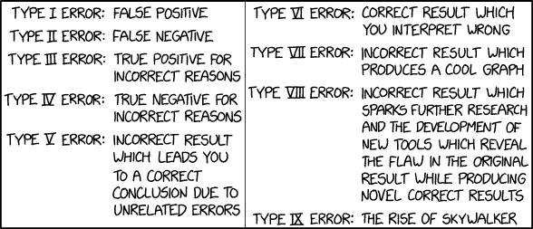

# Типичные ошибки
> 2019.12.19 **[🚀](../index/index.md) [despace](index.md)** → [Качество](srrq.md), **[НД](doc.md)**

[TOC]

---

> <small>*Термины:* **Типичные ошибки** — русскоязычный термин, не имеющий аналога в английском языке. **Typical mistakes** — дословный перевод с русского на английский.</small>

> <small>*Никогда нет времени сделать правильно, зато всегда есть время исправить.  Errare humanum est.*</small>

В данном руководстве приведён перечень типичных ошибок в работе и [документации](doc.md).

Список ошибок собран из опыта работы над различными НИОКР, почти не привязан к какой‑то конкретной организации и в целом универсален. Предназначен для:

   1. снижения затрат на последующие исправления,
   1. повышения качества работ,
   1. фокусировки на главном, а не второстепенном.

 

## Основной список
**Таблица.** Обычные ошибки, их причины и последствия.

|*#*|*Наименование*|
|:--|:--|
|**1**| **Внедрять дополнительную систему для той же самой задачи.**  Приводит к накладным расходам и ошибкам при переписывании из одной в другую. |
|**2**| **Глупость.**  «Есть 2 бесконечности — Вселенная и человеческая глупость. Насчёт Вселенной не уверен.» |
|**3**| **Игра «залезть в жопу, а потом героически из неё вылезти».**  Классика. Принять неверное решение, а потом с потом и кровью разгребать последствия. |
|**4**| **Изменять то, что работает, без изучения почему было сделано именно так.**  Приводит к поломкам/усложнениям — часто то, что выглядит несуразно, но сделано умными людьми, сделано именно так неспроста. Чернобыльская АЭС сгорела именно из‑за этого. |
|**5**| **Малое количество времени.**  «Быстро, качественно, дёшего — выбирайте любые 2». Часто выбирают «быстро, дёшего». |
|**6**| **Нерабочая атмосфера.**  Нервы, давление, шум, звонки и пр. отвлекают, сбивают с мысли, снижают концентрацию. |
|**7**| **Передача информации на словах. [Договор](contract.md) на словах.**  Когда человек говорит что‑то, а не пишет это на бумаге и не ставит подпись, то [сквозной информационный тракт](etedp.md) выглядит примерно так: *«Что человек подумал → Что почувствовал → Что сказал → Что решил, что сказал → Что услышал оппонент → Что понял → Что запомнил»*; в каждом переходе возможно искажение информации. В мозгу человека есть «центр критики», через который проходит входящая информация, но не исходящая. Т.о. человек может говорить не то, что хочет, а оппонент — воспринимать не то, что слышит. Пишите протоколы и подписывайте их на месте. |
|**8**| **Отрыв от процесса, частое переключение между процессами.**  |
|**9**| **Попытка сделать последовательные процессы параллельными.**  См. статью [Рабочий процесс](workflow.md). |
|**10**| **Систематическая ошибка выжившего.**  Делать вывод только на основе того, что было проще достать. |
|**11**| **[Совещания](meeting.md) с быстрыми решениями.**  Часто на совещаниях принимают быстро решения без детального погружения в вопрос. Впоследствии приходится тратить ресурсы на исправление последствий этих решений. |
|**12**| **Единоличное принятие решений.**  Всегда есть те, кто (не)осознанно искажает факты в личных интересах. Поэтому существует научный подход и рецензирование, и поэтому конценсус важен. |
|**13**| **(Не)считать всех вокруг идиотами.** |
|**14**| **Арфаграфия, граматика.**  Ну куда ж без них‑то. MS Word умеет, конечно, что‑то проверять, но всё же вычитывайте. Также читайте художественную литературу, повышайте собственную грамотность. |
|**15**| **Беглое чтение документов.**  Дьявол — в деталях, а впопыхах деталей не разглядеть. А иногда бывает, что в документе почти нет воды, которую можно пропустить, а написанные слова написаны неспроста. |
|**16**| **Дублирование информации в различных разделах/документах.**  Если некая информация (состав, масса, габариты и пр.) указывается больше, чем в одном месте, то при корректировках часто в одном месте она правится, а в других — забывается. |
|**17**| **Заниматься не своей работой.**  [Не делайте за других их работу ❐](f/doc/20191106_1.pdf). |
|**18**| **Излишняя информация.**  Мы пишем техническую документацию, которую, во‑первых, читают непонимающие в технике менеджеры и генералы, а во‑вторых, технические специалисты, которые потом по ней точат железки и осуществляют сборку. Поэтому не надо растекаться мыслей по древу, — пишите кратко, чётко и по делу, следуйте принципу [бритвы Оккама](dont_panic.md). |
|**19**| **Использование одновременно [единиц измерения СИ](si.md) и не‑СИ.**  Часто при переводе одной размерности в другую будет допущена ошибка в размере. |
|**20**| **Использование термина «энергообеспечение» и т.д.**  Правильный термин «электрообеспечение». Энергия — разная, а электричество — одно. |
|**21**| **Мифическая «общеизвестная информация».**  То, что сегодня известно всем, завтра может потерять актуальность. Поэтому старайтесь ссылаться (а лучше приводить в тексте) на общепринятые системы, константы, расчёты, чтобы через 2, 10, 30 лет можно было понять как это всё работает и зачем. |
|**22**| **Нарушение алфавитного порядка.**  При составлении списков работ, документов, сотрудников и пр. возникает желание сортировать их в не‑алфавитном порядке (по важности, значимости, этапам и пр.). Это приводит к тому, что, после согласования документа с автором такового порядка, требуется разъяснять этот порядок каждому, кто согласует впоследствии. А потом все забывают про смысл этой логики и тратят время на поиск нужного пункта. Алфавитный порядок хорош своей быстротой и непредвзятостью. |
|**23**| **Отсутствие номеров у ссылочных документов.**  «Усы, лапы и хвост» любого документа — это название, номер и подписи. Документов с таким названием может быть много, документов с таким названием и номером — один. |
|**24**| **Отсутствие явного выбора.**  Выбор должен быть прописан чётко: «по результатам такой‑то проработки выбрано то‑то и то‑то». Никаких условностей, предложений, отсылок типа «ну, мы в выводах написали одно, а вот в сносках на сотой странице мелким шрифтом написано, что выводам не верить». |
|**25**| **Различные наименования одной и той же сущности.**  Часто в рамках одного документа/проекта приборы называются то по названию, то по названию с приставкой, то по индексу, то по обиходному названию, то ещё как‑нибудь. Это вызывает вопросы — а точно ли речь идёт об одном и том же приборе? Иногда это не так и речь идёт о разных. То же касается названия документов, организаций, мест, этапов и пр. |
|**26**| **Ссылки на не‑общедоступную документацию.**  Если имеется ссылка на не‑общедоступную документацию (внутренние распоряжения, СЗ, материалы другого ОКР и пр.), то они должны быть приложены. Нет гарантии, что они будут в наличии у Заказчика, а тем более при проверке прокурором через пару лет. |
|**27**| **История не терпит сослагательного наклонения.**  При оценке истории неверно говорить вроде: «Если бы Македонский не дошёл до Индии, то…», т.к. история пошла так, как пошла, а всё остальное — безосновательные спекуляции. |
|**28**| **Один дурак способен тысячу мудрецов поставить в тупик.**  Собственник «не обязан знать все технические детали» и ему ещё надо объяснить, что такой сотрудник генерит бред, для этого надо потратить уйму дорогостоящего времени на разжёвывание того, где эти идеи несостоятельны. Собственник видит «активно старающегося решить проблемы работника». Заканчивается это тем, что все устают и начинают этот бред тупо внедрять, параллельно сотрудники чаще появляются на собеседованиях других работодателей. После смены поколения сотрудников бизнес такого предприятия напоминает велокостылед, которого «могила исправит» или очень нехилые инвестиции в наведение порядка, а потом уже могила. |
|**29**| **Судья и прокурор в одном лице.**  Обсуждать/решать должны равные, судить — третья сторона, если равные не договорились. |
|**30**| **Неявность/нечёткость выражений и суждений.**  К документу не должен прилагаться человек. Всё должно быть: написано внятно, все цифры доступны, ссылки на месте и пр. |
|**31**| **Цифры без разброса.**  Обычно считается, что цифра (масса, электричество, размеры и пр.) — это худшая граница, т.е. хуже значения не будет. Но иногда при недобросовестной/халатной работе исполнители склонны считать указанную цифру номиналом и впоследствии давать на неё допуски. Требуйте сразу либо писать допуски, либо указывать словами, что масса лимитная. |

 

## Метрология
   - Можно применять только единицы СИ; в скобках можно указывать не‑СИ.
   - Можно применять международные или русские обозначения, но не одновременно.
   - Нельзя сокращать обозначения величин, если они употребляются без цифр, кроме величин в головах и боковиках таблиц и в расшифровках буквенных обозначений, входящих в формулы и рисунки.
   - Недопустимо отделять название от цифры (переносить их на разные строки/страницы).
   - В тексте документа, за исключением формул, таблиц, рисунков, не допускается:
      - применять знак «−» (следует писать словом минус);
      - применять знак «⌀» (следует писать словом диаметр);
      - применять без числовых значений матем. знаки, например, \>, \< , =, ≤, ≥, ≠, №, %.
   - В соотв. с ГОСТ 2.105 п. 4.2.3 в документе не допускается:
      - применять обороты разговорной речи, техницизмы, профессионализмы;
      - применять для одного и того же понятия различные близкие по смыслу термины, иностранные термины при наличии равнозначных терминов в русском языке;
      - применять произвольные словообразования;
      - применять сокращения слов, кроме установленных правилами орфографии, соответствующими государственными стандартами.

**Размерности**

|*Правильно* |*Неправильно* |*Комментарии*|
|:--|:--|:--|
| г | гр |  |
| кг | Кг |  |
| мин | м |  |
| ч | час |  |
| с | сек |  |
| рад | град |  |
| 5 градусов или 5° | 5 град |  |
| 10 угловых минут или 10´ | 10 угл. мин |  |
| 40 угловых секунд или 40´´ | 40 угл. с |  |
| 10 угловых градусов или 10° | 10 угл. град. |  |
| окт/мин | октава/мин |  |
| К | °К |  |
| °/с или угловой градус в секунду | град/с |  |
| °/ч | град/час |  |
| Па (кгс/cm²) | кгс/cm²; кГс/cm²; кг/cm² |  |
| Ом | Ом∙м |  |
| Гр или Гр (рад) | рад |  |
| Дж | дж |  |
| В | в |  |
| Гц | гц |  |
| км/ч | км/час |  |
| m/s² (g) | g, (ед) | <small>g не является единицей величины ускорения, а лишь символьное обозначение ускорения.</small> |
| Па∙с/м | Пас/м |  |
| Па∙с/m³ | Пас/m³ |  |
| (7 ± 2) Н·м [(70 ± 20) кгс·см] | 7 Н·м |  |
| 70 ± 20 кгс·см |  |
| бит  Б, байт  кбит  Кбайт | б  бт  Кбит  кбайт |  |
| При нормальных условиях  m³ | нm³ |  |
| Lр (исх. 20 мкПа) = 20 дБ или  20 дБ (исх. 20 мкПа)  Не более 80 дБ (исх. 1 мкА)  Не менее 120 дБ (исх. 1 мкВ/м) | Не более 80 дБ мкА  Не менее 120 дБ мкВ/м | <small>Пример обозначения уровня звукового давления. Необходимо указывать исходную величину, её значение помещают в скобках  за обозначением  логарифмической величины. При краткой форме записи значение исходной величины указывают в скобках за значением уровня.</small> |
| 100 кВт  80 %  20 ℃  10 Ом  20°  1220×740 мм  5,758°  | 100кВт  80 %  20℃  10Ом  20 °  1220×740мм  5°758 |  |
| кПа∙с/м | Па∙кс/м |  |
| v = 3,6 s/t,  где v – скорость,км/ч;  s – путь, м;  t – время, с | v = 3,6 s/t км/ч,  где  s – путь, м;  t – время, с |  |
| Вт/(м∙К) | Вт/м∙К |  |
| Н∙м  А∙m²  Па∙с | НмНхм  Аm² Ахm²  Пас |  |
| Вт∙м⁻²∙К⁻¹  Вт/(m²·К) | Вт/m²/К |  |
| 80 км/ч  80 километров в час | 80 км/час  80 км в час |  |
| Провести испытания пяти труб, каждая длиной 5 м.  Отобрать 15 труб для испытания на давление. | Провести испытания 5‑ти труб, каждая длиной 5 м. | <small>Числовые значения величин с обозначением единиц величин и единиц счёта следует писать цифрами, а числа без обозначения единиц величин и единиц счёта от единицы до девяти – словами.</small> |
| 1,50; 1,75; 2,00 м | 1,50 м; 1,75 м; 2,00 м |  |
| Диаметр крепёжных отверстий прибора должен соответствовать М 4 (4,5 мм) | Диаметр креп!жных отверстий прибора должен соответствовать М 4 (⌀ 4,5) |  |
| От 1 до 5 мм  От 10 до 100 кг  От плюс 10 до минус 40 ℃  От 8454,3 до 8464,3 МГц  | От 1 мм до 5 мм  10 … 100 кг  +10 ‑ −40 ℃  (8459,3 ± 5,0) МГц |  |
| Не более (если допустимы все значения меньше указанного значения).  Не менее (если допустимы все значения больше указанного значения).  Знак «±» не ставят перед не более, не менее | Больше, ниже, выше, меньше, хуже.  Не более ± 5 ℃.  Не менее ± 5 ℃ |  |
| Шероховатость поверхности.  Rₐ = 0,63 мкм  Rz= 0,63 мкм | Чистота поверхности не хуже √ 0,63 |  |
| 1,22∙10⁴ | 1,22Е+04 |  |
| Lo ≥ 15 МэВ/(мг∙см⁻²)  σо ≤ 10⁻² cm² | Lo ≥ 15 МэВ/(мг∙см⁻²)  σо ≤ 10⁻² cm² |  |

**Термины**

|*Правильно*|*Неправильно*|
|:--|:--|
| Температура точки росы ℃ | Точка росы |
| Измерение | Замер, обмер |
| Точность, прецизионность | Верность измерений |
| Произвести измерение | Замерить, мерить, обмерить |
| Измерить давление | Померить давление |
| Измерить значение  напряжения или определить значение напряжения | Измерить  напряжение или  измерить величину напряжения |
| Результат измерений | Измеренные значения |
| Температура выражается в кельвинах | Температура измеряется в кельвинах |
| Единица скорости | Размерность скорости |
| Погрешность средств измерений | Погрешность показания прибора |
| Класс точности прибора указывается – 0,1; 0,2; 1, 2, 3. | Класс точности прибора ± 1,5 % |
| Погрешность измерения не должна быть  более 0,01 г  Погрешность измерения ±0,01 г | Ошибка измерения 0,01 г |
| Температура минус (60 ± 5) ℃ | Температура – 60 ℃ |
| Диапазон измерений от минус 50 до плюс 200 ℃ | Предел измерений (−50…200) ℃ |
| Оси находились на одной высоте с допускаемыми отклонениями ± 1 мм | Оси находились на одной высоте с погрешностью ± 1 мм |
| Погрешность измерений не должна быть более (не менее) 1 %;  Погрешность измерения ± 1 % | Точность измерений 1 % |
| Погрешность измерений равна ± 5 % | Погрешность 3σ равна  ± 5 % |
| Единицы  величин | Единиц физических величин |
| Средство измерений или измерительный прибор | Мерительное средство |
| Средство измерений или измерительный прибор | Измерительная аппаратура |
| Средство измерений или измерительный прибор | Для измерения применялось средство контроля |
| Стандартный образец или измерительный прибор | Эталонная деталь |
| Нормальные климатические условия с указанием конкретных значений величин | Комнатная температура |
| Значение пусковой силы тока бортовой аппаратуры должна не превышать полуторократного номинального значения силы тока (указать значение или заменить термин номинального тока на потребляемый ток) электропотребления на время до 50 мс. | Величина пускового тока бортовой аппаратуры не должна превышать полуторократного значения номинального тока электро&shy;потребления на время до 50 мс. |
| Увеличение силы электрического тока до 23,5 А | Увеличение тока до 23,5 А |
| Значение силы электрического тока | Величина тока |
| Значение атмосферного давления 8,6∙10⁴ Па (645 мм рт. ст.) | Величина атмосферного давления 645 мм рт. ст. |
| Ускорение | Перегрузка |
| Масса 3 кг | Груз 3 кг |
| Изделие массой 1 500 т | Изделие весом 1 500 т |
| Среднее квадратическое отклонение (стандартное отклонение) — параметр функции распределения измеренных значений или показаний, характеризующий их рассеивание и равный положительному корню квадратному из дисперсии этого распределения. | Не корректное употребление термина среднее квадратическое отклонение |  |

 

## Систематическая ошибка выжившего
**Системати́ческая оши́бка вы́жившего** (англ. **survivorship bias**) — разновидность систематической ошибки отбора, когда по одной группе («выжившим») есть много данных, а по другой («погибшим») — практически нет. Так что исследователи пытаются искать общие черты среди «выживших» и упускают из вида, что не менее важная информация скрывается среди «погибших».

**Примеры:**

   1. В WW2 математику А. Вальду из нью‑йоркской лаборатории SRG поручили найти решение задачи: не все бомбардировщики США возвращались, а на вернувшихся было много пробоин, но распределены они были неравномерно: много — на фюзеляже, меньше — в топливной системе и мало — в двигателе. Значит, в пробитых местах нужно больше брони? Вальд ответил: нет, исследование как раз показывает, что самолёт с пробоинами в этих местах может вернуться. Самолёт, которому попали в двигатель или бензобак, не возвращается. Т.к. попадания в первом приближении распределены равномерно, укреплять надо места, которые у вернувшихся наиболее «чистые».
   1. Также известно мнение о доброте дельфинов, основанное на рассказах пловцов, которых животные толкали к берегу, но нет данных от тех, кого толкали в обратном направлении.
   1. Исследования по охране труда осложняются тем, что не приспособленные к вредным условиям рабочие быстро увольняются (так называемый эффект здорового рабочего).

 

## Docs & links (TRANSLATEME ALREADY)
|…°·•¹²³±×÷≤≥≈≠ ‑ −— ⎆✉ ❐“”’«»✔→✘☐☑├┕┆ 1 lb = 0.453592 kg; 1 g = 9.80665 m/s²|
|:--|
|<small>**[FAQ](faq.md)**, **[Cable](cable.md)**·БКС, **[Camera](cam.md)**·Камера, **[Comms](comms.md)**·Радио, **[Contact](contact.md)**·Контакт, **[Control](control.md)**·Упр., **[Doc](doc.md)**·Док., **[Doppler](doppler.md)**·ИСР, **[DS](ds.md)**·ЗУ, **[EB](eb.md)**·ХИТ, **[ECO](ecology.md)**·Экол., **[EF](ef.md)**·ВВФ, **[ElC](elc.md)**·ЭКБ, **[EMC](emc.md)**·ЭМС, **[Error](error.md)**·Ошибки, **[Event](event.md)**·События, **[FS](fs.md)**·ТЭО, **[Fuel](fuel.md)**·Топливо, **[GNC](gnc.md)**·БКУ, **[GS](scs.md)**·НС, **[HF&E](hfe.md)**·Эрго., **[IU](iu.md)**·Гиро., **[KT](kt.md)**·КТЕХ, **[LAG](lag.md)**·ПУC, **[LES](les.md)**·САСП, **[LS](ls.md)**·СЖО, **[LV](lv.md)**·РН, **[MCC](mcc.md)**·ЦУП, **[Model](model.md)**·Модель, **[MSC](sc.md)**·ПКА, **[N&B](nnb.md)**·БНО, **[NR](nr.md)**·ЯР, **[OBC](obc.md)**·ЦВМ, **[OE](oe.md)**·БА, **[Pat.](патент.md)**·Патент, **[Project](project.md)**·Проект, **[PS](ps.md)**·ДУ, **[R&D](rnd.md)**·НИОКР, **[SRRQ](srrq.md)**·БКНР, **[Robot](robotics.md)**·Робот, **[Rover](rover.md)**·Планетоход, **[RTG](rtg.md)**·РИТЭГ, **[SARC](sarc.md)**·ПСК, **[Sensor](sensor.md)**·Датчик, **[SC](sc.md)**·КА, **[SCS](scs.md)**·КК, **[SGM](sgm.md)**·КММ, **[SI](si.md)**·СИ, **[Soft](soft.md)**·ПО, **[SP](sp.md)**·БС, **[Spaceport](spaceport.md)**·Космодром, **[SPS](sps.md)**·СЭС, **[SSS](sss.md)**·ГЗУ, **[TCS](tcs.md)**·СОТР, **[Test](test.md)**·ЭО, **[Timeline](timeline.md)**·ЦГМ, **[TMS](tms.md)**·ТМС, **[TOR](tor.md)**·ТЗ, **[TRL](trl.md)**·УГТ</small>|
|*Sections & pages*|
|**`Качество:`**  [Bus factor](bus_factor.md) ┊ [АВПКО](fmenca.md) ┊ [Авторский надзор](des_spv.md) ┊ [Бережливое производство](lean_man.md) ┊ [Валидация](validation.md) ┊ [Верификация](verification.md) ┊ [Класс чистоты](clean_lvl.md) ┊ [Конструктивное совершенство](con_vel.md) ┊ [Крит. технологии](kt.md) ┊ [Крит. элементы](sens_elem.md) ┊ [Метрология](metrology.md) ┊ [Надёжность](srrq.md) ┊ [Нештатная ситуация](emergency.md) ┊ [Ошибки](error.md) ┊ [Система менеджмента качества](qms.md) ┊ [УГТ](trl.md)/[TRL](trl.md) |

   1. Docs:
      - [Не делайте за других их работу ❐](f/doc/20191106_1.pdf)
   1. Notable interwikies — …
   1. <https://en.wikipedia.org/wiki/List_of_common_misconceptions>
   1. <https://en.wikipedia.org/wiki/Survivorship_bias>
   1. <https://ru.wikipedia.org/wiki/Систематическая_ошибка_выжившего>
