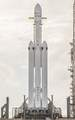
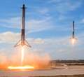
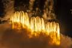

# Falcon
> 2019.05.23 [🚀](../index/index.md) [despace](index.md) → [LV](lv.md)

[TOC]

---

> <small>**Falcon** — англоязычный термин, не имеющий аналога в русском языке. **Фалькон** — дословный перевод с английского на русский.</small>

**Falcon** ([ˈfælkən], [ˈfɒlkən]; с англ. — «сокол») — серия американских одноразовых и многоразовых жидкостных ракет‑носителей тяжёлого и сверхтяжёлого классов. Все ракеты серии — двухступенчатые и используют жидкостные ракетные двигатели, топливными компонентами для которых являются керосин и жидкий кислород. Своё название ракета получила в честь звездолёта «Тысячелетний сокол» из фантастической эпопеи «Звёздные войны».

|*Version*|*Description*|*Activity*|
|:--|:--|:--|
|Falcon 1|Базовый вариант.|Экспл. завершена (2008 ‑ 2009)|
|╙ Falcon 1e|Модификация.|Отменена (2009)|
|Falcon 5|Базовый вариант.|Отменена (2006)|
|Falcon 9 v.1.0|Базовый вариант.|Экспл. завершена (2009 ‑ 2013)|
|╟ Falcon 9 Air|Модификация Falcon 9 v1.0.|Отменена (2012)|
|╟ Falcon 9 v.1.1|Модификация Falcon 9 v1.0.|Экспл. завершена (2013 ‑ 2016)|
|╙ Falcon 9 v.1.2 (FT)|Модификация v1.1.|**Активен** (2015 ‑ …)|
|Falcon Heavy|Базовый вариант. На основе Falcon 9.|**Активен** (2018 ‑ …)|

---

 

## Falcon 9
**Falcon 9** ([ˈfælkən naɪn], falcon с англ. — «сокол») — американская одноразовая и многоразовая жидкостная ракета‑носителей тяжёлого класса. Цифра «9» в названии означает количество ЖРД [Merlin](merlin.md), установленных на 1‑ой ступени. Первая ступень может быть повторно использована, на неё установлено оборудование для возврата и вертикального приземления на посадочную площадку или плавающую платформу ASDS.

|*Characteristic*|*[Value](si.md)*|
|:--|:--|
|Активность|**Активен** v.1.2 (2015.12.22 ‑ …)|
|[Аналоги](analogue.md)|[Ariane 5/6](arian.md) (Европа)・ [Ангара‑А5](angara.md) (РФ)・ [Протон‑М](proton.md) (РФ)|
|Длина/диаметр|v.1.2 — 70 м (с ГЧ) / 3.7 м;  1.1 — 68.4 м (с ГЧ) / 3.7 м;  1.0 — 54.9 м (с ГЧ) / 3.7 м|
|[Космодромы](spaceport.md)|[Ванденберг](vandenberg.md) (SLC‑4E)・ [Канаверал](canaveral.md) (SLC‑40)・ [КЦ Кеннеди](kennedy.md) (LC‑39A)|
|Масса старт./сух.|v.1.2 — 549 054 ㎏ / 33 800 ㎏;  1.1 — 505 846 ㎏ / 31 200 ㎏;  1.0 — 333 400 ㎏ / … ㎏|
|Разраб./изготов.|[SpaceX](zz_spacex.md) (США) / [SpaceX](zz_spacex.md) (США)|
|Ступени|2|
|[Топливо](fuel.md)|[Кислород + Керосин](o_plus.md)|
| ||

**Выводимые массы.**

|*Космодром*|*РН*|<small>*Масса,  [НОО](nnb.md), т*</small>|<small>*Масса,  [ГСО](nnb.md), т*</small>|<small>*Масса к  [Луне](moon.md), т*</small>|<small>*Масса к  [Венере](venus.md), т*</small>|<small>*Масса к  [Марсу](mars.md), т*</small>|*Примечания*|
|:--|:--|:--|:--|:--|:--|:--|:--|
|[Ванденберг](vandenberg.md);  [Канаверал](canaveral.md);  [КЦ Кеннеди](kennedy.md)|Falcon 9  1.2|22.8  18.5 **⁽³⁾**|8.3  5.8 **⁽³⁾**|7.9  6.4 **⁽³⁾**|…  … **⁽³⁾**|…  4.02 **⁽³⁾**|Пуск — $ 62 млн (2019 г)  Пуск — $ 52 млн **⁽³⁾** (2019 г);  ПН 4.15 % от ст.массы;  ПН 3.36 % от ст.массы **⁽³⁾**|
|[Ванденберг](vandenberg.md);  [Канаверал](canaveral.md);  [КЦ Кеннеди](kennedy.md)|Falcon 9  1.1|13.15|4.85|—|—|—|Пуск — $ 61.2 млн (2014 г);  ПН 2.59 % от ст.массы|
|[Ванденберг](vandenberg.md);  [Канаверал](canaveral.md);  [КЦ Кеннеди](kennedy.md)|Falcon 9  1.0|9|3.4|—|—|—|Пуск — $ 56 млн (2010 г);  ПН 2.69 % от ст.массы|

<small>Примечания:  **1)** Указана масса для наихудших условий старта.  **2)** В скобках указана масса для наилучших условий старта.  **3)** С возвратом первой ступени.</small>

 

## Falcon Heavy
**Falcon Heavy** (букв. с англ. — «тяжёлый сокол») — американская многоразовая жидкостная ракета‑носителей сверхтяжёлого класса. Входит в семейство Falcon и является одной из крупнейших РН в истории — наряду с «Сатурном‑5», «Н-1», «Спейс Шаттл», «Энергией». Разработана на основе Falcon 9 и использует её усиленную первую ступень в качестве центрального блока (I ступени), и 2 модифицированные первые ступени Falcon 9 в качестве боковых ускорителей. На момент первого запуска — самая грузоподъёмная, мощная и тяжёлая РН, находящаяся в эксплуатации. Имеет рекорд по числу маршевых двигателей (28, в т.ч. 27 одновременно работающих) среди успешно летавших РН.

|*Characteristic*|*[Value](si.md)*|
|:--|:--|
|Активность|**Активен** (2018.02.06 ‑ …)|
|[Аналоги](analogue.md)|[Saturn 5](saturn_lv.md) (США)・ [Shuttle](shuttle.md) (США)・ [Н-1](n_1.md) (СССР)・ [Энергия](energia.md) (СССР)|
|Длина/диаметр|70 м / 12.2 м|
|[Космодромы](spaceport.md)|[Ванденберг](vandenberg.md) (SLC‑4E)・ [КЦ Кеннеди](kennedy.md) (LC‑39A)|
|Масса старт./сух.|1 420 788 кг / 72 200 ㎏|
|Разраб./изготов.|[SpaceX](zz_spacex.md) (США) / [SpaceX](zz_spacex.md) (США)|
|Ступени|2 + ускорители|
|[Топливо](fuel.md)|[Кислород + Керосин](o_plus.md)|
| |  |

**Выводимые массы.**

|*Космодром*|*РН*|<small>*Масса,  [НОО](nnb.md), т*</small>|<small>*Масса,  [ГСО](nnb.md), т*</small>|<small>*Масса к  [Луне](moon.md), т*</small>|<small>*Масса к  [Венере](venus.md), т*</small>|<small>*Масса к  [Марсу](mars.md), т*</small>|*Примечания*|
|:--|:--|:--|:--|:--|:--|:--|:--|
|[Ванденберг](vandenberg.md);  [КЦ Кеннеди](kennedy.md)|Falcon  Heavy|63.8  38.2 **⁽³⁾**  30 **⁽⁴⁾**|26.7  16 **⁽³⁾**  8 **⁽⁴⁾**|…  … **⁽³⁾**  … **⁽⁴⁾**|…  … **⁽³⁾**  … **⁽⁴⁾**|16.8  … **⁽³⁾**  … **⁽⁴⁾**|*Масса к Плутону — 3.5 т.*;  Пуск — $ 150 млн (2018 г);  Пуск — $ … млн **⁽³⁾** (… г);   Пуск — $ 90 млн **⁽⁴⁾** (2018 г);  ПН 4.49 % от ст.массы;  ПН 2.68 % от ст.массы; **⁽³⁾**  ПН 2.11 % от ст.массы **⁽⁴⁾**|

<small>Примечания:  **1)** Указана масса для наихудших условий старта.  **2)** В скобках указана масса для наилучших условий старта.  **3)** С возвратом ускорителей.  **4)** С возвратом ускорителей и 1-й ступени.</small>

 

## Архивные

### Falcon 1
…

### Falcon 5
…

 

---

#### Docs & links (TRANSLATEME ALREADY)
|Navigation|
|:--|
|**[FAQ](faq.md)**, **[Cable](cable.md)**·БКС, **[Camera](cam.md)**·Камера, **[Comms](comms.md)**·Радио, **[CON](contact.md)·[Pers](person.md)**·Контакт, **[Control](control.md)**·Упр., **[Doc](doc.md)**·Док., **[Doppler](doppler.md)**·ИСР, **[DS](ds.md)**·ЗУ, **[EB](eb.md)**·ХИТ, **[ECO](ecology.md)**·Экол., **[EF](ef.md)**·ВВФ, **[ElC](elc.md)**·ЭКБ, **[EMC](emc.md)**·ЭМС, **[Error](error.md)**·Ошибки, **[Event](event.md)**·События, **[FS](fs.md)**·ТЭО, **[Fuel](fuel.md)**·Топливо, **[GNC](gnc.md)**·БКУ, **[GS](scs.md)**·НС, **[HF&E](hfe.md)**·Эрго., **[IU](iu.md)**·Гиро., **[KT](kt.md)**·КТЕХ, **[LAG](lag.md)**·ПУC, **[LES](les.md)**·САСП, **[LS](ls.md)**·СЖО, **[LV](lv.md)**·РН, **[MCC](mcc.md)**·ЦУП, **[Model](model.md)**·Модель, **[MSC](sc.md)**·ПКА, **[N&B](nnb.md)**·БНО, **[NR](nr.md)**·ЯР, **[OBC](obc.md)**·ЦВМ, **[OE](oe.md)**·БА, **[Pat.](патент.md)**·Патент, **[Proj.](project.md)**·Проект, **[PS](ps.md)**·ДУ, **[QM](qm.md)**·БКНР, **[R&D](rnd.md)**·НИОКР, **[Robot](robotics.md)**·Робот, **[Rover](rover.md)**·Ровер, **[RTG](rtg.md)**·РИТЭГ, **[SARC](sarc.md)**·ПСК, **[SE](se.md)**·СЭ, **[Sens.](sensor.md)**·Датч., **[SC](sc.md)**·КА, **[SCS](scs.md)**·КК, **[SGM](sgm.md)**·КММ, **[SI](si.md)**·СИ, **[Soft](soft.md)**·ПО, **[SP](sp.md)**·БС, **[Spaceport](spaceport.md)**·Космодр., **[SPS](sps.md)**·СЭС, **[SSS](sss.md)**·ГЗУ, **[TCS](tcs.md)**·СОТР, **[Test](test.md)**·ЭО, **[Timeline](timeline.md)**·ЦГМ, **[TMS](tms.md)**·ТМС, **[TOR](tor.md)**·ТЗ, **[TRL](trl.md)**·УГТ|
|*Sections & pages*|
|**··• [Launch vehicle (LV)](lv.md) •··**  [ICBM](icbm.md)・ [Integrated payload unit](lv.md)・ [Non‑rocket spacelaunch](nrs.md)・ [Throw weight](throw_weight.md) • • •  **China:** [Long March](long_march.md) ┊ **EU:** [Arian](arian.md), [Vega](vega.md) ┊ **India:** [GSLV](gslv.md), [PSLV](pslv.md) ┊ **Israel:** [Shavit](shavit.md) ┊ **Japan:** [Epsilon](epsilon.md), [H2](h2.md), [H3](h3.md) ┊ **Korea N.:** [Unha](unha.md) ┊ **Korea S.:** *([Naro‑1](naro_1.md))* ┊ **RF,CIF:** [Angara](angara.md), [Proton](proton.md), [Soyuz](soyuz.md), [Yenisei](yenisei.md), [Zenit](zenit.md) *([Energia](energia.md), [Korona](korona.md), [N‑1](n_1.md), [R‑1](r_7.md))* ┊ **USA:** [Antares](antares.md), [Atlas](atlas.md), [BFR](bfr.md), [Delta](delta.md), [Electron](electron.md), [Falcon](falcon.md), [Firefly Alpha](firefly_alpha.md), [LauncherOne](launcherone.md), [New Armstrong](new_armstrong.md), [New Glenn](new_glenn.md), [Minotaur](minotaur.md), [Pegasus](pegasus.md), [Shuttle](shuttle.md), [SLS](sls.md), [Vulcan](vulcan.md) *([Saturn](saturn_lv.md), [Sea Dragon](sea_dragon.md))*|

   1. Docs: …
   1. Notable interwikies — …
   1. <https://ru.wikipedia.org/wiki/Falcon_(семейство_ракет‑носителей)>
   1. <https://en.wikipedia.org/wiki/Falcon_9>
   1. <https://ru.wikipedia.org/wiki/Falcon_9>
   1. <https://en.wikipedia.org/wiki/Falcon_Heavy>
   1. <https://ru.wikipedia.org/wiki/Falcon_Heavy>
   1. <https://en.wikipedia.org/wiki/Comparison_of_orbital_launch_systems>
   1. 2018.02.12 [Интересное наблюдение по запуску Falcon Heavy ⎆](https://habr.com/post/374245/) *([archive ❐](f/lv/falcon/20180212_habr_com_001.djvu) of 2019.02.08)
   1. 2015.09.21 <https://www.reddit.com/r/spacex/comments/3lsm0q/f9ft_vs_f9v11_fuel_mass_flow_rate_isp/>

