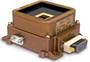
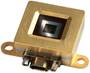

# FSS
> 2019.05.12 [🚀](../index/index.md) [despace](index.md) → **[СД](sensor.md)**

[TOC]

---

> <small>**Fine Sun Sensor (FSS)** — англоязычный термин, не имеющий аналога в русском языке. **Точный солнечный датчик** — дословный перевод с английского на русский.</small>

**Fine Sun Sensor (FSS)** — аналоговый солнечный датчик, предназначенный для: 1) построения постоянной солнечной ориентации (ПСО) после отделения от [РБ](lv.md); 2) построения и поддержания ПСО, где при работе [научной аппаратуры](sc.md) ПСО используется в качестве рабочей ориентации; 3) построения и поддержания ПСО в нештатных ситуациях (НШС), когда парирование НШС в режиме инерциальной ориентации невозможно.  
Разработчик [Bradford Engineering](zz_bradford_eng.md). Разработано в 2005 году Активное использование. Покупное изделие. (на 2018.03.28)

|*Characteristics*|*[Value](si.md)  (FSS)*|*[Value](si.md)  (Mini FSS)*|
|:--|:--|:--|
|Composition|Single unit|Single unit|
|Consumption, W|0.25|0 (пассивный)|
|Dimensions, ㎜|108 × 108 × 53|50 × 46 × 17|
|[Interfaces](interface.md)| | |
|[Lifetime](lifetime.md)/Resource, h(y)|43 800 (5) / …|43 800 (5) / …|
|Mass, ㎏|0.375|0.05|
|[Overload](vibration.md), Grms| | |
|[Rad.resist](ion_rad.md), ㏉ (㎭)|100 (10 000)|100 (10 000)|
|[Reliability](qm.md) per [lifetime](lifetime.md)|0.997|0.997|
|[Thermal range](tcs.md), ℃|–50 ‑ +85 ℃|–50 ‑ +85 ℃|
|[TRL](trl.md)| | |
|[Voltage](voltage.md), V|± 15| |
|**【Specific】**|• • •|• • •|
|Accuracy|0.3° (3σ)|от 0.2 до 1.5° (3σ)|
|Range °, ≥|128 × 128|128 × 128|
|Ready mode| | |
|Refresh rate, ㎐| | |
| |||
| || |

**Notes:**

   1. …
   1. **Applicability:**
      - Galileo
      - Globalstar

 

## Docs & links (TRANSLATEME ALREADY)
|Navigation|
|:--|
|**[FAQ](faq.md)**【**[SCS](scs.md)**·КК, **[SC (OE+SGM)](sc.md)**·КА】**[CON](contact.md)·[Pers](person.md)**·Контакт, **[Ctrl](control.md)**·Упр., **[Doc](doc.md)**·Док., **[EF](ef.md)**·ВВФ, **[Error](error.md)**·Ошибки, **[Event](event.md)**·События, **[FS](fs.md)**·ТЭО, **[HF&E](hfe.md)**·Эрго., **[KT](kt.md)**·КТ, **[Model](model.md)**·Модель, **[N&B](nnb.md)**·БНО, **[Patent](патент.md)**·Пат., **[Project](project.md)**·Проект, **[QM](qm.md)**·БКНР, **[R&D](rnd.md)**·НИОКР, **[SI](si.md)**·СИ, **[Test](test.md)**·ЭО, **[TRL](trl.md)**·УГТ, **[Way](way.md)**·Пути|
|*Sections & pages*|
|**`Солнечный датчик (СД):`**  [ПЗр](fov.md)  • • •  (КА) **Европа:** [FSS](fss_jo.md) (650)・ [FSS](fss.md) (50 ‑ 375)・ [CSS](css.md) (275)・ [CoSS](coss.md) (15 ‑ 24)  ▮  **РФ:** [ТДС](tds.md) (2 300)・ [347К](347k.md) (700)・ [ОСД](osd.md) (650)・ [СДП-1](sdp_1.md) (400)・ [SX-SUNR-01](sx_sunr_01.md) (40)  *(Кубсаты) **США:** [MSS](mss_sm.md) (0.036)・ [CSS](css_sm.md) (0.02)*|

   1. Docs:
      - [FSS, ТО ❐](f/sensor/f/fss_datasheet.djvu) (2017)
      - [Mini FSS, ТО ❐](f/sensor/f/fss_mini_datasheet.djvu) (2017)
   1. Notable interwikies — …
   1. <http://bradford-space.com/products-aocs-fine-sun-sensors.php>
   1. <http://bradford-space.com/products-aocs-mini-fine-sun-sensors.php>
