# Galileo
> 2019.05.29 **[🚀](../index/index.md) [despace](index.md)** → [Venus](venus.md), **[Project](project.md)**

[TOC]

---

> <small>*Terms:* **Galileo** — English term with no analogues in Russian. **Галилео** — Russian equivalent.</small>

**Galileo** was an American unmanned spacecraft that studied the planet Jupiter and its moons, as well as several other Solar System bodies. It consisted of an Orbiter and an Lander.

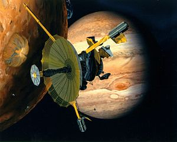

 

|*Type*|*[Param.](si.md)*|
|:--|:--|
|**Mission:**|• • •|
|Cost| US $ 1.4 billion or 114 155 kg of [gold](sc_price.md) in 1977 prices |
|Development| 1977 ‑ 1986 |
|Duration| **Planned:** 8 y 1 m 19 d, **In orbit:** 7 y 9 m 13 d, **Final:** 13 y 11 m 3 d |
|Launch| October 18, 1989, 16:53:40 UTC, Rocket: Space Shuttle Atlantis STS-34 / IUS |
|Operator| NASA |
|Programme| Galileo |
|Similar to| • Proposed: [Cassini-Guygens](cassini.md)   • Current: …   • Past: … |
|Target| Research of Jupiter’s system |
|[Type](sc.md)| Orbiter spacecraft; Atmospheric Spacecraft |
|**Spacecraft:**|• • •|
|Composition| Orbiter; Lander |
|Contractor| … |
|Manufacturer| JPL; Messerschmitt-Bölkow-Blohm; General Electric; Hughes Aircraft Company |
|Comms| 4.8 m high‑gain antenna (during the flight did not open) |
|[ID](spaceid.md)| NSSDC ID (COSPAR ID): 1989-084B, SCN: 20298 |
|Mass| **Dry mass**  Orbiter: 1 884 kg ([Large satellite](спутник.md), [EVN‑073](venus.md)); Lander: 339 kg ([Minisatellite](спутник.md), [EVN‑070](venus.md)) |
|Orbit / Site| Kronocentric |
|Payload| Orbiter: Solid‑state imaging camera, near‑infrared mapping spectrometer, ultlaviolet spectrometer, photopolarimeter radiometer, energetic particles detector, plasma investigation, plasma wave subsystem, dust detector, heavy ion counter |
|Power| Orbiter: 570 W; Lander: 730 W/h |

Targets & investigations:

   - **T** — technical; **C** — contact research; **D** — distant research; **F** — fly‑by; **H** — manned; **S** — soil sample return; **X** — technology demonstration
   - **Sections of measurement and observation:**
      - Atmospheric/climate — **Ac** composition, **Ai** imaging, **Am** mapping, **Ap** pressure, **As** samples, **At** temperature, **Aw** wind speed/direction.
      - General — **Gi** planet’s interactions with outer space.
      - Soil/surface — **Sc** composition, **Si** imaging, **Sm** mapping, **Ss** samples.

<small>

|*EVN‑XXX*|*T*|*EN*|*Section of m&o*|*D*|*C*|*F*|*H*|*S*|
|:--|:--|:--|:--|:--|:--|:--|:--|:--|
|EVN‑070|T|Exploration with [satellites](sc.md): minisatellites.|  |D||F|||
|EVN‑073|T|Exploration with [satellites](sc.md): large satellites.|  |D||F|||
|EVN‑093|T|Atmosphere/surface imaging|  ||D|F|||

</small>

 

## Mission
Work on the spacecraft began at Jet Propulsion Laboratory in 1977. As the shuttle program got underway, Galileo was scheduled for launch in 1984, but this later slipped to 1985 and then to 1986. The mission was further delayed by the hiatus in launches that occurred after the Space Shuttle Challenger disaster. New safety protocols introduced as a result of the disaster prohibited the use of the Centaur-G stage on the Shuttle, forcing Galileo to use a lower-powered Inertial Upper Stage solid‑fuel booster. The mission was re-profiled in 1987 to use several gravitational slingshots, referred to as the Venus-Earth-Earth Gravity Assist or VEEGA maneuvers, to provide the additional velocity required to reach its destination. It was finally launched on October 18, 1989, by Space Shuttle Atlantis on the STS-34 mission.

Galileo flew by Venus at 05:58:48 UTC on February 10, 1990, at a range of 16 106 km. Having gained 8 030 km/h in speed, the spacecraft flew by Earth twice, the first time at a range of 960 km at 20:34:34 UTC on December 8, 1990, before approaching the S-type asteroid 951 Gaspra to a distance of 1 604 km at 22:37 UTC on October 29, 1991.

On April 11, 1991, the controllers sent a command for Galileo to unfurl the high‑gain antenna. The antenna failed to open when the signal was sent. A fault analysis determined that some of the antenna’s «ribs» got stuck. To correct this error, an algorithm was developed to compress data for transmission to Earth so that Galileo could send full data to Earth.

Galileo performed a second fly‑by of Earth at 303.1 km at 15:09:25 UTC on December 8, 1992, adding 13 320 km/h to its cumulative speed. Galileo performed close observations of a second asteroid, 243 Ida, at 16:51:59 UTC on August 28, 1993, at a range of 2 410 km. The spacecraft discovered Ida has a moon, Dactyl, the first discovery of a natural satellite orbiting an asteroid.

|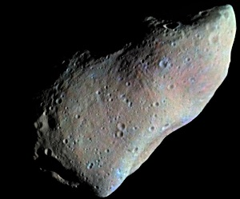|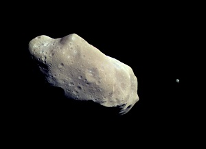|
|:--|:--|
|***951 Gaspra (enhanced colorization)***|***243 Ida, with its moon Dactyl to the right***|

One of Galileo’s first science targets was Comet Shoemaker-Levy 9. Jupiter’s gravity had pulled the comet towards the planet and broken it up into more than 20 pieces. When the shards slammed into Jupiter in July 1994, the astronomical community eagerly watched. Galileo was en route to Jupiter at that time and snapped some shots of the hits. The spacecraft encountered «interplanetary dust storms» on its way to Jupiter, possibly from particles coming from within the Jovian system. At one point, Galileo was tracking 20 000 dust particles a day, compared to a typical one particle every three days.

Galileo was still flying at Jupiter when on July 13, 1995, it released a probe to smack the planet’s atmosphere in December. When the probe finished its descent, NASA was surprised at its measurements of helium — half of what they expected — and the dryness of the region in which the probe flew. After releasing its atmospheric probe, the Galileo Orbiter became the first man-made satellite of Jupiter at 01:16 UTC on December 8, 1995, after it fired its main engine to enter a 198 day parking orbit.

The spacecraft traveled around Jupiter in elongated ellipses, each orbit lasting about two months. The differing distances from Jupiter afforded by these orbits allowed Galileo to sample different parts of the planet’s extensive magnetosphere. The orbits were designed for close-up fly‑bys of Jupiter’s largest moons. Once the prime mission concluded, an extended mission started on December 7, 1997; the spacecraft made several fly‑bys of Europa and Io. The closest approach was 180 km on October 15, 2001. The radiation environment near Io was very unhealthy for Galileo’s systems, and so these fly‑bys were saved for the extended mission when loss of the spacecraft would be more acceptable. Galileo’s cameras were deactivated on January 17, 2002, after they had sustained irreparable radiation damage. NASA engineers were able to recover the damaged tape recorder electronics, and Galileo continued to return scientific data until it was deorbited, performing one last scientific experiment: a measurement of the moon Amalthea’s mass as the spacecraft swung by it.

|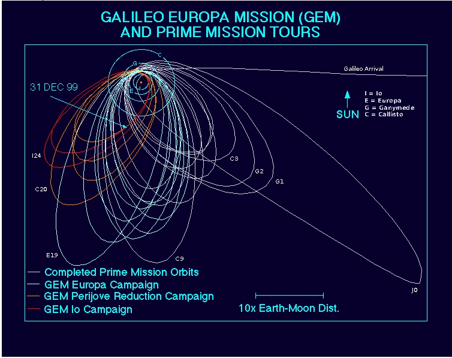|
|:--|
|***Galileo’s prime and extended mission orbits***|

After completing 35 orbits around Jupiter throughout a nearly eight-year mission, the Galileo Orbiter was destroyed during a controlled impact with Jupiter on September 21, 2003. During that intervening time, Galileo changed the way scientists saw Jupiter and provided a wealth of information on the moons orbiting the planet which will be studied for years to come. Culled from NASA’s press kit, the top Orbiter scientific results were:

   - Galileo made the first observation of ammonia clouds in another planet’s atmosphere. The atmosphere creates ammonia ice particles from material coming up from lower depths.
   - The moon Io was confirmed to have extensive volcanic activity that is 100 times greater than that found on Earth. The heat and frequency of eruptions are reminiscent of early Earth.
   - Complex plasma interactions in Io’s atmosphere create immense electrical currents which couple to Jupiter’s atmosphere.
   - Several lines of evidence from Galileo support the theory that liquid oceans exist under Europa’s icy surface.
   - Ganymede possesses its own, substantial magnetic field – the first satellite known to have one.
   - Galileo magnetic data provided evidence that Europa, Ganymede and Callisto have a liquid salt water layer under the visible surface. «What sort of life, if there it, could lie underneath the surface?»
   - Evidence exists that Europa, Ganymede, and Callisto all have a thin atmospheric layer known as a ’surface-bound exosphere'.
   - Jupiter’s ring system is formed by dust kicked up as interplanetary meteoroids smash into the planet’s four small inner moons. The outermost ring is actually two rings, one embedded with the other. There is probably a separate ring along Amalthea’s orbit, as well.
   - The Galileo spacecraft identified the global structure and dynamics of a giant planet’s magnetosphere.

|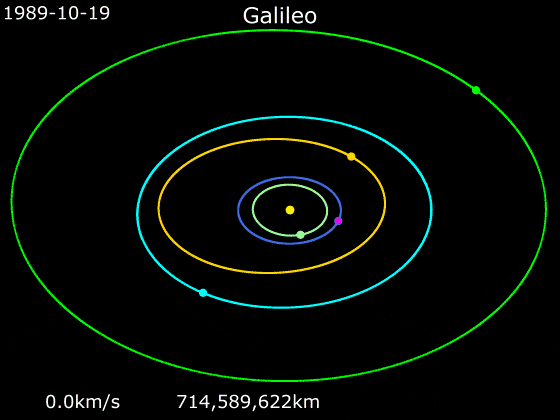|Pink — Galileo    Inner dim green — Venus    Blue — Earth    Turquoise — 243 Ida    Outer bright green — Jupiter    Yellow ellipse — 951 Gaspra    Yellow dot — Sun |
|:--|:--|
|***Animation of ’s trajectory from October 19, 1989, to September 30, 2003***||

  

|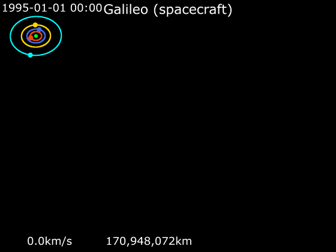|Pink — Galileo    Green — Jupiter    Red — Io    Blue — Europa    Yellow — Ganymede    Turquoise — Callisto |
|:--|:--|
|***Animation of ’s trajectory around Jupiter from August 1, 1995, to September 30, 2003***||

On December 11, 2013, NASA reported, based on results from the Galileo mission, the detection of «clay‑like minerals» (specifically, phyllosilicates), often associated with organic materials, on the icy crust of Europa. The presence of the minerals may have been the result of a collision with an asteroid or comet, according to the scientists.

**Images of Jupiter’s moons taken by Galileo**

|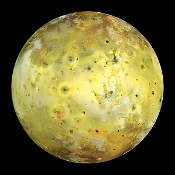|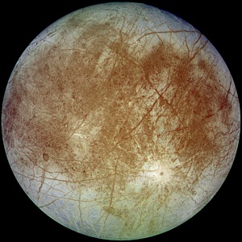 |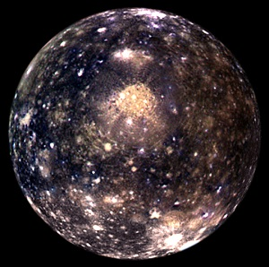 |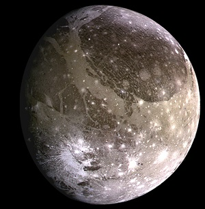 |
|:--|:--|:--|:--|
|**Io**|**Europa**|**Callisto**|**Ganymede**|

 

## Science goals & payload
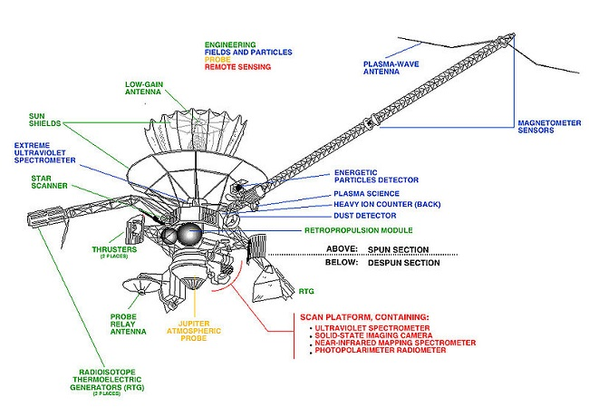

Scientific instruments to measure fields and particles were mounted on the spinning section of the spacecraft, together with the main antenna, power supply, the propulsion module and most of Galileo’s computers and control electronics. The sixteen instruments, weighing 118 kg altogether, included magnetometer sensors mounted on an 11 m boom to minimize interference from the spacecraft; a plasma instrument for detecting low‑energy charged particles and a plasma-wave detector to study waves generated by the particles; a high‑energy particle detector; and a detector of cosmic and Jovian dust. It also carried the Heavy Ion Counter, an engineering experiment to assess the potentially hazardous charged particle environments the spacecraft flew through, and an extreme ultraviolet detector associated with the UV spectrometer on the scan platform.

The despun section’s instruments included the camera system; the near infrared mapping spectrometer to make multi-spectral images for atmospheric and moon surface chemical analysis; the ultraviolet spectrometer to study gases; and the photopolarimeter-radiometer to measure radiant and reflected energy. The camera system was designed to obtain images of Jupiter’s satellites at resolutions 20 to 1 000 times better than Voyager’s best, because Galileo flew closer to the planet and its inner moons, and because the more modern CCD sensor in Galileo’s camera was more sensitive and had a broader color detection band than the vidicons of Voyager.
### Orbiter
**DESPUN SECTION**

   - *Solid State Imager (**SSI**)*.

|||
|:--|:--|
|The SSI was an 800 × 800 pixel solid state camera consisting of an array of silicon sensors called a charge-coupled device (CCD). Galileo was one of the first spacecraft to be equipped with a CCD camera. The optical portion of the camera was built as a Cassegrain telescope. Light was collected by the primary mirror and directed to a smaller secondary mirror that channeled it through a hole in the center of the primary mirror and onto the CCD. The CCD sensor was shielded from radiation, a particular problem within the harsh Jovian magnetosphere. The shielding was accomplished by means of a 10 mm thick layer of tantalum surrounding the CCD except where the light enters the system. An eight-position filter wheel was used to obtain images at specific wavelengths. The images were then combined electronically on Earth to produce color images. The spectral response of the SSI ranged from about 400 to 1100 nm. The SSI weighed 29.7 kg and consumed, on average, 15 W of power.|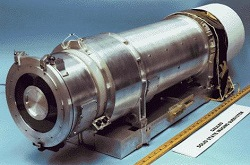|

   - *Near-Infrared Mapping Spectrometer (**NIMS**)*.

|||
|:--|:--|
|The NIMS instrument was sensitive to 0.7 to 5.2 µm wavelength infrared light, overlapping the wavelength range of the SSI. The telescope associated with NIMS was all reflective (using only mirrors and no lenses) with an aperture of 229 mm. The spectrometer of NIMS used a grating to disperse the light collected by the telescope. The dispersed spectrum of light was focused on detectors of indium, antimonide and silicon. The NIMS weighed 18 kg and used 12 W of power on average.|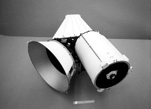|

   - *Ultraviolet Spectrometer / Extreme Ultraviolet Spectrometer (**UVS/EUV**)*.

|||
|:--|:--|
|The Cassegrain telescope of the UVS had a 250 mm aperture and collected light from the observation target. Both the UVS and EUV instruments used a ruled grating to disperse this light for spectral analysis. This light then passed through an exit slit into photomultiplier tubes that produced pulses or «sprays» of electrons. These electron pulses were counted, and these count numbers constituted the data that were sent to Earth. The UVS was mounted on Galileo’s scan platform and could be pointed to an object in inertial space. The EUV was mounted on the spun section. As Galileo rotated, EUV observed a narrow ribbon of space perpendicular to the spin axis. The two instruments combined weighed about 9.7 kg and used 5.9 W of power.|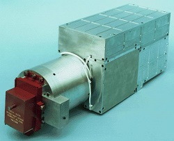|

   - *Photopolarimeter-Radiometer (**PPR**)*.

|||
|:--|:--|
|The PPR had seven radiometry bands. One of these used no filters and observed all incoming radiation, both solar and thermal. Another band allowed only solar radiation through. The difference between the solar-plus-thermal and the solar-only channels gave the total thermal radiation emitted. The PPR also measured in five broadband channels that spanned the spectral range from 17 to 110 µm. The radiometer provided data on the temperatures of Jupiter’s atmosphere and satellites. The design of the instrument was based on that of an instrument flown on the [Pioneer Venus spacecraft](pioneer_venus_1.md). A 100 mm aperture reflecting telescope collected light and directed it to a series of filters, and, from there, measurements were performed by the detectors of the PPR. The PPR weighed 5.0 kg and consumed about 5 W of power.|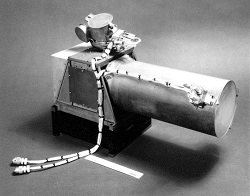|

**SPUN SECTION**

   - *Dust Detector Subsystem (**DDS**)*.

|||
|:--|:--|
|The DDS was used to measure the mass, electric charge, and velocity of incoming particles. The masses of dust particles that the DDS could detect go from 1,0 E−16 to 1,0 E−7 g. The speed of these small particles could be measured over the range of 1 to 70 km/s. The instrument could measure impact rates from 1 particle per 115 days to 100 particles per second. Such data was used to help determine dust origin and dynamics within the magnetosphere. The DDS weighed 4.2 kg and used an average of 5.4 W of power.|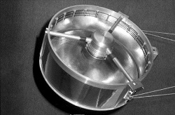|

   - *Energetic Particles Detector (**EPD**)*.

|||
|:--|:--|
|The EPD was designed to measure the numbers and energies of ions and electrons whose energies exceeded about 20 keV (3.2 fJ). The EPD could also measure the direction of travel of such particles and, in the case of ions, could determine their composition (whether the ion is oxygen or sulfur, for example). The EPD used silicon solid‑state detectors and a time-of-flight detector system to measure changes in the energetic particle population at Jupiter as a function of position and time. These measurements helped determine how the particles got their energy and how they were transported through Jupiter’s magnetosphere. The EPD weighed 10.5 kg and used 10.1 W of power on average.|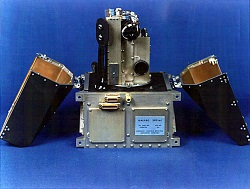|

   - *Heavy Ion Counter (**HIC**)*.

|||
|:--|:--|
|The HIC was, in effect, a repackaged and updated version of some parts of the flight spare of the Voyager Cosmic Ray System. The HIC detected heavy ions using stacks of single crystal silicon wafers. The HIC could measure heavy ions with energies as low as 6 MeV (1 pJ) and as high as 200 MeV (32 pJ) per nucleon. This range included all atomic substances between carbon and nickel. The HIC and the EUV shared a communications link and, therefore, had to share observing time. The HIC weighed 8.0 kg and used an average of 2.8 W of power.|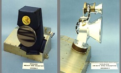|

   - *Magnetometer (**MAG**)*.

|||
|:--|:--|
|The MAG used two sets of three sensors. The three sensors allowed the three orthogonal components of the magnetic field section to be measured. One set was located at the end of the magnetometer boom and, in that position, was about 11 m from the spin axis of the spacecraft. The second set, designed to detect stronger fields, was 6.7 m from the spin axis. The boom was used to remove the MAG from the immediate vicinity of Galileo to minimize magnetic effects from the spacecraft. However, not all these effects could be eliminated by distancing the instrument. The rotation of the spacecraft was used to separate natural magnetic fields from engineering-induced fields. Another source of potential error in measurement came from the bending and twisting of the long magnetometer boom. To account for these motions, a calibration coil was mounted rigidly on the spacecraft to generate a reference magnetic field during calibrations. The magnetic field at the surface of the Earth has a strength of about 50 000 nT. At Jupiter, the outboard set of sensors could measure magnetic field strengths in the range from ±32 to ±512 nT, while the inboard set was active in the range from ±512 to ±16 384 nT. The MAG experiment weighed 7.0 kg and used 3.9 W of power.|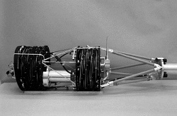|

   - *Plasma Subsystem (**PLS**)*.

|||
|:--|:--|
|The PLS used seven fields of view to collect charged particles for energy and mass analysis. These fields of view covered most angles from 0 to 180 degrees, fanning out from the spin axis. The rotation of the spacecraft carried each field of view through a full circle. The PLS measured particles in the energy range from 0.9 to 52 000 eV (0.14 to 8 300 aJ). The PLS weighed 13.2 kg and used an average of 10.7 W of power.|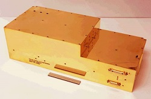|

   - *Plasma Wave Subsystem (**PWS**)*.

|||
|:--|:--|
|An electric dipole antenna was used to study the electric fields of plasmas, while two search coil magnetic antennas studied the magnetic fields. The electric dipole antenna was mounted at the tip of the magnetometer boom. The search coil magnetic antennas were mounted on the high‑gain antenna feed. Nearly simultaneous measurements of the electric and magnetic field spectrum allowed electrostatic waves to be distinguished from electromagnetic waves. The PWS weighed 7.1 kg and used an average of 9.8 W.|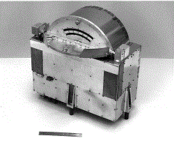|

**General energy-mass summary of scientific equipment of the Galileo Orbiter**

|*Instrument*|*Mass*|*Power input*|
|:--|:--|:--|
| **SSI** | 29.7 kg | 15 W |
| **NIMS** | 18 kg | 12 W |
| **UVS/EUV** | 9.7 kg | 5.9 W |
| **PPR** | 5 kg | 5 W |
| **DDS** | 4.2 kg | 5.4 W |
| **EPD** | 10.5 kg | 10.1 W |
| **HIC** | 8 kg | 2.8 W |
| **MAG** | 7 kg | 3.9 W |
| **PLS** | 13.2 kg | 10.7 W |
| **PWS** | 7.1 kg | 9.8 W |

### Probe

   - Helium abundance detector — instrument for accurate measurement of the proportion of helium in the atmosphere.
   - Atmospheric structure instrument — measurement of temperature, pressure and density during descent.
   - Neutral mass spectrometer — determination of the chemical composition of the atmosphere.
   - Nephelometer — studying the structure of clouds and the nature of their constituent particles.
   - Net flux radiometer — instrument for recording radiation and energy flows in the atmosphere.
   - Lightning and radio emission detector — instrument for lightning registration, radio emission measurement and charged particle registration.

A radio transmitter was also used to measure wind speed by the Doppler effect.

 

## Spacecraft
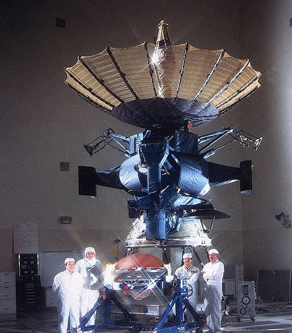

The Jet Propulsion Laboratory built the Galileo spacecraft and managed the Galileo mission for NASA. West Germany’s Messerschmitt-Bölkow-Blohm supplied the propulsion module. NASA’s Ames Research Center managed the atmospheric probe, which was built by Hughes Aircraft Company.

One section of the **Orbiter** rotated at three rpm, keeping Galileo stable and holding six instruments that gathered data from many different directions, including the fields and particles instruments. The other section of the Orbiter was a 4.8 m wide, umbrella‑like high‑gain antenna, and data were periodically transmitted to it. Back on the ground, the mission operations team used software containing 650 000 lines of programming code in the orbit sequence design process; 1 615 000 lines in the telemetry interpretation; and 550 000 lines of code in navigation.

The Galileo **Lander** was an atmospheric-entry Lander carried by the main Galileo Orbiter on its way to Jupiter. It separated from the main spacecraft on July 10, 1995, five months before its rendezvous with the planet on December 7. After a rough deceleration, the Descent Module started to return data to the main spacecraft orbiting high above Jupiter. Inside the Lander’s heat shield, the Descent Module with its scientific instruments was protected from extreme heat and pressure during its high‑speed journey into the Jovian atmosphere, entering at 47.8 km/s.

During the 57 min of data collecting, the Galileo Lander returned data on Jupiter’s atmospheric conditions and composition and achieved some new discoveries.

At launch, the Orbiter and Lander together had a mass of 2 562 kg and stood 6.15 m tall.

|*Parameter*|*Value*|
|:--|:--|
|**`Orbiter`**||
| Launch mass | 2 223 kg |
| Science instruments mass | 118 kg |
| Propellant mass | 925 kg |
| High | 5.3 m |
| Diameter of the antenna | 4.8 kg |
| Power | 570 W |
|**`Lander`**||
| Mass | 339 kg |
| High | 0.91 m |
| Diameter | 1.27 m |

**Command and Data Handling (CDH)**

The CDH subsystem was actively redundant, with two parallel data system buses running at all times. The CDH subsystem was responsible for maintaining the following functions:

   - decoding of uplink commands
   - execution of commands and sequences
   - execution of system-level fault-protection responses
   - collection, processing, and formatting of telemetry data for downlink transmission
   - movement of data between subsystems via a data system bus

The spacecraft was controlled by six RCA 1802 COSMAC microprocessor CPUs: four on the spun side and two on the despun side.

Each CPU was fabricated on sapphire (silicon on sapphire), which is a radiation-and static-hardened material ideal for spacecraft operation.

**Propulsion**

The propulsion subsystem consisted of a 400 N main engine and twelve 10 N thrusters. The fuel for the system was monomethylhydrazine and nitrogen tetroxide.

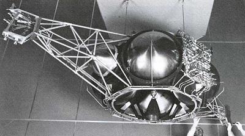

**Electrical power**

Two radioisotope thermoelectric generators (RTGs) which powered the spacecraft through the radioactive decay of plutonium-238. Each RTG, mounted on a 5 m long boom, carried 7.8 kg of 238Pu.

The RTGs produced about 570 W at launch. The power output initially decreased at the rate of 0.6 W per month and was 493 W when Galileo arrived at Jupiter.

 

## Community, library, links

**PEOPLE:**

   - Carl Sagan − was an American astronomer, cosmologist, astrophysicist, astrobiologist, author, science popularizer, and science communicator in astronomy and other natural sciences. He is best known for his work as a science popularizer and communicator.
   - James Van Allen − was an American space scientist at the University of Iowa. He was instrumental in establishing the field of magnetospheric research in space.

**COMMUNITY:**

<mark>TBD</mark>

 

## Docs & links
|…°·•¹²³±×÷≤≥≈≠ ‑ −— ⎆✉ ❐“”’«»✔→✘☐☑├┕┆ 1 lb = 0.453592 kg; 1 g = 9.80665 m/s²|
|:--|
|<small>**[FAQ](faq.md)**, **[Cable](cable.md)**·БКС, **[Camera](camera.md)**·Камера, **[Comms](comms.md)**·Радио, **[Contact](contact.md)**·Контакт, **[Control](control.md)**·Управ., **[Doc](doc.md)**·Док., **[Doppler](doppler.md)**·ИСР, **[DS](ds.md)**·ЗУ, **[EB](eb.md)**·ХИТ, **[ECO](ecology.md)**·Экол., **[EF](ef.md)**·ВВФ, **[ElC](elc.md)**·ЭКБ, **[EMC](emc.md)**·ЭМС, **[Errors](error.md)**·Ошибки, **[Events](event.md)**·События, **[FS](fs.md)**·ТЭО, **[Fuel](fuel.md)**·Топливо, **[GNC](gnc.md)**·БКУ, **[GS](scs.md)**·НС, **[HF&E](hfe.md)**·Эрго., **[IU](iu.md)**·Гиро., **[KT](kt.md)**·КТЕХ, **[LAG](lag.md)**·ПУC, **[LES](les.md)**·САСП, **[LS](ls.md)**·СЖО, **[LV](lv.md)**·РН, **[MCC](mcc.md)**·ЦУП, **[Model](model.md)**·Модель, **[MSC](sc.md)**·ПКА, **[N&B](nnb.md)**·БНО, **[NR](nr.md)**·ЯР, **[OBC](obc.md)**·ЦВМ, **[OE](oe.md)**·БА, **[Pat.](патент.md)**·Патент, **[Project](project.md)**·Проект, **[PS](ps.md)**·ДУ, **[QA](quality.md)**·QA, **[R&D](rnd.md)**·НИОКР, **[RAMS](rams.md)**·НиБ, **[Risk](risk.md)**·Риск, **[Robot](robotics.md)**·Робот, **[Rover](rover.md)**·Планетоход, **[RTG](rtg.md)**·РИТЭГ, **[SARC](sarc.md)**·ПСК, **[Sensor](sensor.md)**·Датчик, **[SC](sc.md)**·КА, **[SCS](scs.md)**·КК, **[SGM](sgm.md)**·КММ, **[SI](si.md)**·СИ, **[Soft](soft.md)**·ПО, **[SP](sp.md)**·БС, **[Spaceport](spaceport.md)**·Космодром, **[SPS](sps.md)**·СЭС, **[SSS](sss.md)**·ГЗУ, **[TCS](tcs.md)**·СОТР, **[Test](test.md)**·ЭО, **[Timeline](timeline.md)**·Циклограмма, **[TMS](tms.md)**·ТМС, **[TOR](tor.md)**·ТЗ, **[TRL](trl.md)**·УГТ</small>|
|*Sections & pages*|
|**··•  •··**  <mark>NOCAT</mark> |

   1. Docs: …
   1. Notable interwikies — …
   1. <https://en.wikipedia.org/wiki/Galileo_(spacecraft)>
   1. <https://www.space.com/18632-galileo-spacecraft.html> — Spacecraft Galileo: To Jupiter and Its Moons
   1. <https://www.jpl.nasa.gov/missions/galileo/> — MISSION TO JUPITER / Galileo
   