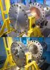
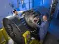
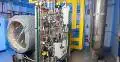
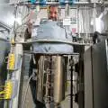

# GEER
> 2020.01.23 [🚀](../index/index.md) [despace](index.md) → [GRC](contact/grc.md), [Venus](venus.md), **[Test](test.md)**

[TOC]

---

> <small>**Glenn Extreme Environment Rig (GEER)** — англоязычный термин, не имеющий аналога в русском языке. **Устройство для экстремальных условий Гленна (ГИИР)** — дословный перевод с английского на русский.</small>

**Glenn Extreme Environment Rig (GEER)** — камеры, имитирующие экстремальные условия атмосферы других планет. Расположены в [GRC](contact/grc.md).

The Glenn Extreme Environments Rig (GEER) can simulate many planetary environments, but is currently configured for warm environments including high temperature, high pressure & multicomponent chemistry.

Science, technology and/or mission applications:

   - Venus (environment & chemistry — surface to above clouds)
   - Saturn, Jupiter, Uranus, moons (chemistry & temp / pressure within rig limits)
   - Exoplanets — Chemistry for science & model inputs

|*GEER*|*GEER*|*GEER*|*miniGEER*|
|:--|:--|:--|:--|
|||||

## Описание
| |*GEER*|*miniGEER*|
|:--|:--|:--|
|**Газовых потоков**|8|3, быстрая смена смесей|
|**Давление**|9.5 ㎫ (94 атм) номинал,  … ㎫ (… атм) макс.|18.8 ㎫ (186 атм) номинал,  … ㎫ (… атм) макс.|
|**Масса**|14 000 ㎏| |
|**Объём**|811 л (0.811 m³, 910 × 1220 ㎜)|4 л (0.004 m³, 127 × 310 ㎜)|
|**Температура**|500 ℃ номинал,  538 ℃ макс.|510 ℃ номинал,  … ℃ макс.|

   - Возможность подавать внутрь заданную газовую смесь. Specific gas quantities can be very accurately controlled down to parts per million accuracy depending on the gas. Available gases for Venus include CO₂, N₂, COS, H₂S, SO₂, HF, HCL, NO, & CO. Water may be added in small quantities.
   - Доступна для интернационального использования. Контакт в GRC — [Tibor Kremic](person.md).
   - GEER operated for a total of 274.5 Earth days at Venus conditions (на 2019.10).
   - Chamber rated from ambient to 1 400 PSI & 500 ℃ (achieves Venus surface pressure & temperature conditions). Can achieve higher pressures at lower temperatures
   - Control atmosphere composition to ppb accuracy for any known atmospheric chemistry
   - System infrastructure is designed & sized to accommodate a larger or an additional chamber
   - Remote data & control access can be made available increasing efficiency & reducing costs
   - Ability to conduct tests at given static test points (composition, temperature & pressure)
   - Accurately measure & deliver desired gas mixture to the vessel
   - Provide before & after gas analysis
   - Run passive samples
   - Simple rail system for mounting
   - Provide facility data that’s captured through a PLC data logger
   - 28 ft stainless steel pressure vessel
   - Simulate planetary atmospheres with full chemistry, temperature, & pressure
   - Up to 8 gas streams plus water
   - Ability to change gas mixtures during system operation
   - Currently configured for Venus surface conditions
      - CO₂, N₂, SO₂, HF, HCl, CO, OCS, H₂S, & H₂O
      - 1 340 psia at 470 ℃

Major subsystems include:

   - pressure vessel,
   - gas containment,
   - gas mixing,
   - programmable control systems,
   - pumping station,
   - temperature control,
   - analytics,
   - operation stations all in a specially designed facility.

Smaller vessels being incorporated.

## ЧаВо
   - **What is GEER?:** Glenn Extreme Environments Rig (GEER) is a unique & world class ground‑based test rig that can accurately most simulate atmospheric conditions for any planet or moon in the solar system & beyond. This capability enables science investigations & pre‑flight development & validation of spacecraft systems & instrumentation in extreme environments. GEER has gas mixing capabilities to reproduce unique planetary environments, such as the very caustic sulfuric acid found in Venus’ atmosphere, or hydrocarbons like methane found in the atmosphere of Satern’s moon Titan.
   - **How long can GEER run?:** GEER is designed to handle extreme temperatures & pressures for long durations. The length of time needed to complete a test will vary depending on customers requirements. Recently, we ran a test lasting 24 days, & could have extended if needed.
   - **How can my test article be supported?:** Each test is different & will require various level of support. We meet with all of our customers to understand their goals & mission, & then we design custom sample holder to meet their test requirements.
   - **Can GEER be customized to meet any test conditions?:** Yes, GEER can provide access to specialized extreme environments including simulating the atmospheres of Venus, Jupiter, Saturn, & numerous exoplanets. GEER can be configured for almost any combination of gasses, temperature & pressure within the vessel structural limits. GEER capabilities are unique in the world.
   - **Can you use hydrogen in GEER?:** Yes, the GEER facility is equip to handle the generation, installation, storage, piping, use, & handling of hydrogen in compressed gas (GH₂) form. If you are interested in using hydrogen, please contact us for additional information.
   - **Who uses GEER?:** Science, technology & planetary mission communities have a growing interest in components & systems that are capable of working in extreme (high) temperature & pressure conditions. Terrestrial applications range from scientific research, aerospace, defense automotive systems, energy storage & power distribution, deep mining & others.

**Facility Details:**

   - 3 ft. diameter & 4 ft. long
   - Automated gas delivery
   - Custom gas mixer (eight gas streams)
   - Gas analyzer (Fourier Transform Infrared (FTIR) spectrometer)
   - Programmable logic controller
   - Touchscreen interface

**Process Details:**

   - System starts at ambient temperature & vacuum pressure
   - Vessel is then filled with correct blend at ambient temperature
   - Heat is applied & controlled to bring system to steady‑state operating point
   - Chemical mix an be metered into vessel by gas flow controller

**Doing Business with GEER**

There are currently three ways to do business with GEER:

   1. **Space Act Agreement (SAA).** The National Aeronautics & Space Act of 1958 (the Space Act), as amended, provides NASA with the unique authority to enter into a wide range of «other transactions», commonly referred to as Space Act Agreements (SAAs). The Agency enters into SAAs with various partners to advance NASA mission & program objectives, including international cooperative space activities. NASA also enters into other types of non‑procurement agreements under other specific authorities, such as Cooperative Research & Development Agreements (CRADAs), Enhanced Used Lease (EULs), & Commercial Space Launch Act (CSLA).
   1. **Research Opportunities in Space & Earth Sciences (ROSES).** ROSES uses NASA Research Announcements (NRAs) to solicit proposals for various investigations.
   1. **Post Doctoral Fellowship.** The Post Doctoral Fellowship allows candidates to have access to unique experimental capabilities & instrumentation technology to carry out their studies.

**Operational History**

The Glenn Extreme Environments Rig successfully demonstrated the ability to reach & operate at Venus surface conditions for 24 days in November 2014. A custom gas mixer was used create the Venusian atmosphere containing 96.5 % CO₂, 3.5 % N₂, 180 ppm SO₂, 23 ppm CO, 0.4 ppm HCl, 0.05 ppm HF, 4.4 ppm OCS & deliver it to the vessel.

After 2.5 days of heating at 7 ℃/hr., the vessel reached Venus surface conditions of 460 ℃ & 1 334 psia while maintaining a leak free seal.

The system boundaries were tested by increasing temperature & pressure to 470 ℃ & 1 400 psia where the vessel remaining for 24 days. Over this period of time, the heaters & setpoints were varied to gain operational experience & knowledge of the system.

 

## Docs & links (TRANSLATEME ALREADY)
|Navigation|
|:--|
|**[FAQ](faq.md)**【**[SCS](scs.md)**·КК, **[SC (OE+SGM)](sc.md)**·КА】**[CON](contact.md)·[Pers](person.md)**·Контакт, **[Ctrl](control.md)**·Упр., **[Doc](doc.md)**·Док., **[Drawing](drawing.md)**·Чертёж, **[EF](ef.md)**·ВВФ, **[Error](error.md)**·Ошибки, **[Event](event.md)**·События, **[FS](fs.md)**·ТЭО, **[HF&E](hfe.md)**·Эрго., **[KT](kt.md)**·КТ, **[N&B](nnb.md)**·БНО, **[Project](project.md)**·Проект, **[QM](qm.md)**·БКНР, **[R&D](rnd.md)**·НИОКР, **[SI](si.md)**·СИ, **[Test](test.md)**·ЭО, **[TRL](trl.md)**·УГТ, **[Way](way.md)**·Пути|
|*Sections & pages*|
|**【[Test](test.md)】**  [JTAG](jtag.md)・ [Proto fligt model](pfm.md)・ [Безэховая камера](ach.md)・ [Валидация](vnv.md)・ [Класс чистоты](clean_lvl.md)・ [КПЭО](ctpr.md)・ [Перечень методик испытаний](list_tp.md)・ [Программа и методика испытаний](pmot.md)・ [Опытный образец](pilot_sample.md)・ [Циклограмма](obc.md)・ [Штатный образец](flight_unit.md)・ [ЭО](test.md)・ [Экспериментально‑теоретический метод](etetm.md)|

   1. Docs: …
   1. <https://geer.grc.nasa.gov/>
   1. <https://www.nasa.gov/feature/glenn/2019/small-but-mighty-mini-version-of-extreme-environments-chamber-extends-planetary-science>

