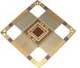

# GR712RC
> 2019.05.12 ┊ **🚀 [despace](index.md)** → **[ЦВМ](obc.md)**

[TOC]

---

**GR712RC** — процессор, предназначенный для использования в составе [КА](sc.md).  
*Разработчик:* [Cobham](cobham.md). Разработано в 2019 году. активное использование <small>(на 2019 год)</small>
   - **Предшественник:** 
   - **Преемник:** 

||
|:--|
|   |

<small>

|*Характеристика*|*[Значение](si.md) <small>()</small>*|
|:--|:--|
|[УГТ](trl.md)| 9  |
| Быстродействие  | 100 МГц (200 MIPS, 200 MFLOPS) |
| Время восстановления  работоспособности, с  |  |
|Исполнение|  Моноблок  |
| Команды, датчики, входы  |… — команд управления; … — релейных матричных команд управления; … — ТМ‑датчиков; … — входов прерываний от контактных датчиков; … — входов прерываний от импульсных датчиков  |
| Объём  | 16 KiB multi-way instruction cache and 16 KiB multi-way data cache, 192 kByte memory block with EDAC  |
| Разрядность данных  | 32 бит |
| Тип процессора  | dual-core LEON3FT SPARC V8, 180 nm standard CMOS, Tower Semiconductors Ltd |
|**Etc:**|• • •|
|[ВБР](rams.md) за САС|  |
|Dimensions, L×W×H, mm|  75 × 75 × 3.5  |
|Интерфейсы|  • Four SpaceWire ports, maximum 200 Mbps full-duplex data rate;  • Redundant [MIL-STD-1553B](mil_std_1553b.md) BRM (BC/RT/BM) interface;  • Two CAN 2.0B bus controllers;  • Six UART ports, with 8-byte FIFO;  • Ethernet MAC with RMII 10/100 Mbps port;  • SPI master serial port;  • I2C master serial port;  • ASCS16 (STR) serial port;  • SLINK 6 MHz serial port;  • CCSDS/ECSS 5-channel Telecommand decoder, 10 Mbps input rate;  • CCSDS/ECSS Telemetry encoder, 50 Mbps output rate;  • 26 input and 38 input/output general purpose ports  |
|Mass, kg|  0.017  |
|[Voltage](voltage.md), V|  1.8 или 3.3 |
|Overload, g|   |
|[Rad.resist](ion_rad.md), Gy (rad)|  3 000 (300 000)   |
|Resource, h (y)|   |
|[Lifetime](lifetime.md), h (y)|  |
|[Тепловой режим](tcs.md), °C|  от −55 до +125 °C  |
|Consumption, W|   |

</small>

 

## Примечания
   1. …

## Применяемость
По состоянию на 2019.03.11 прибор GR712RC применяется в составе:

   1. [Beresheet](beresheet.md)

## Опыт использования
…

 

## Docs & links (TRANSLATEME ALREADY)
|…°·•¹²³±×÷≤≥≈≠ ‑ −— ⎆✉ ❐“”’«»✔→✘☐☑├┕┆ 1 lb = 0.453592 kg; 1 g = 9.80665 m/s²|
|:--|
|<small>**[FAQ](faq.md)**, **[Cable](cable.md)**·БКС, **[Camera](camera.md)**·Камера, **[Comms](comms.md)**·Радиосв., **[Contact](contact.md)**·Контакт, **[Control](control.md)**·Управ., **[Doc](doc.md)**·Док., **[Doppler](doppler.md)**·ИСР, **[DS](ds.md)**·ЗУ, **[EB](eb.md)**·ХИТ, **[ECO](ecology.md)**·Экол., **[EF](ef.md)**·ВВФ, **[ElC](elc.md)**·ЭКБ, **[EMC](emc.md)**·ЭМС, **[Errors](error.md)**·Ошибки, **[Events](event.md)**·События, **[FS](fs.md)**·ТЭО, **[Fuel](fuel.md)**·Топливо, **[GNC](gnc.md)**·БКУ, **[GS](scs.md)**·НС, **[HF&E](hfe.md)**·Эргоном., **[IMU](imu.md)**·Гироскоп, **[Incubator](incubator.md)**·Инкуб., **[KT](kt.md)**·КТЕХ, **[LAG](lag.md)**·ПУC, **[LES](les.md)**·САСП, **[LS](ls.md)**·СЖО, **[LV](lv.md)**·РН, **[MAG](mag.md)**·Магнитом., **[MCC](mcc.md)**·ЦУП, **[Model](model.md)**·Модель, **[MSC](sc.md)**·ПКА, **[N&B](nnb.md)**·БНО, **[NR](nr.md)**·ЯР, **[OBC](obc.md)**·ЦВМ, **[OE](oe.md)**·БА, **[Patent](патент.md)**·Патент, **[Project](project.md)**·Проект, **[PS](ps.md)**·ДУ, **[QA](quality.md)**·QA, **[R&D](rnd.md)**·НИОКР, **[RAMS](rams.md)**·НиБ, **[Risk](risk.md)**·Риск, **[Robot](robotics.md)**·Робот, **[Rover](rover.md)**·Планетоход, **[RTG](rtg.md)**·РИТЭГ, **[RW](rw.md)**·ДМ, **[SARC](sarc.md)**·ПСК, **[Sensor](sensor.md)**·Датчик, **[SC](sc.md)**·КА, **[SCS](scs.md)**·КК, **[SGM](sgm.md)**·КММ, **[SI](si.md)**·СИ, **[Soft](soft.md)**·ПО, **[SP](sp.md)**·БС, **[Spaceport](spaceport.md)**·Космодром, **[SPS](sps.md)**·СЭС, **[SSS](sss.md)**·ГЗУ, **[TCS](tcs.md)**·СОТР, **[Test](test.md)**·ЭО, **[Timeline](timeline.md)**·Циклограмма, **[TMS](tms.md)**·ТМС, **[TOR](tor.md)**·ТЗ, **[TRL](trl.md)**·УГТ</small>|
|*Sections & pages*|
|**··•  •··**  <mark>NOCAT</mark> |

**Docs:**

   1. 3D‑модель <mark>TBD</mark>
   1. Чертёж <mark>TBD</mark>

**Links:**

   1. Notable interwikies — …
   1. <https://www.gaisler.com/index.php/products/components/gr712rc>
