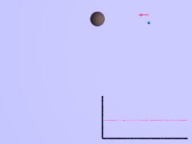
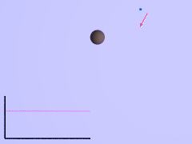

# Гравитационный манёвр
> 2019.05.12 [🚀](../index/index.md) [despace](index.md) → **[БНО](nnb.md)**, [Control](control.md)

[TOC]

---

> <small>**Гравитационный манёвр** — русскоязычный термин. **Gravity assist / Gravity turn / Zero-lift turn** — англоязычный эквивалент.</small>

**Гравитационный манёвр, гравманёвр** — разгон, замедление или изменение направления полёта космического аппарата под действием гравитационных полей небесных тел. Обычно используется для экономии топлива и дополнительного разгона автоматических межпланетных станций при полётах к дальним планетам Солнечной системы.

## Описание
Наиболее выгодны гравитационные манёвры у планет‑гигантов, но нередко используются манёвры у [Венеры](venus.md), [Земли](earth.md), [Марса](mars.md) и даже [Луны](moon.md). Возможно совмещение с [Эффектом Оберта](oberth_eff.md).

|<small>Гравитационный манёвр  для ускорения объекта  (гравитационная праща)</small>|<small>Гравитационный манёвр  для замедления объекта</small>|
|:--|:--|
|||

**Примеры использования:**

   - Впервые в мире осуществлён в 1959 году во время полёта КА [Луна‑3](луна‑3.md). Изменение орбиты было рассчитано так, чтобы аппарат при возвращении к Земле снова пролетел над Северным полушарием, где были расположены советские наблюдательные станции.
   - В 1974 году гравитационный манёвр использовал космический аппарат [Маринер‑10](mariner-10.md) — было произведено сближение с [Венерой](venus.md), после которого аппарат направился к [Меркурию](mercury.md).
   - За счёт гравитационных манёвров скорость «Вояджера‑1» (≈17 ㎞/s) в марте 2011 года была выше, чем текущая скорость «Новых горизонтов» (≈15.9 ㎞/s), хотя после старта с Земли скорость последнего была самой высокой для рукотворных объектов (16.21 ㎞/s).
   - Сложную комбинацию гравитационных манёвров использовали АМС «[Кассини](cassini_huygens.md)» (для разгона аппарат использовал гравитационное поле трёх планет — Венеры (дважды), Земли и [Юпитера](jupiter.md)) и «Розетта» (четыре гравитационных манёвра около Земли и Марса).

 

## Docs & links (TRANSLATEME ALREADY)
|Navigation|
|:--|
|**[FAQ](faq.md)**【**[SCS](scs.md)**·КК, **[SC (OE+SGM)](sc.md)**·КА】**[CON](contact.md)·[Pers](person.md)**·Контакт, **[Ctrl](control.md)**·Упр., **[Doc](doc.md)**·Док., **[Drawing](drawing.md)**·Чертёж, **[EF](ef.md)**·ВВФ, **[Error](error.md)**·Ошибки, **[Event](event.md)**·События, **[FS](fs.md)**·ТЭО, **[HF&E](hfe.md)**·Эрго., **[KT](kt.md)**·КТ, **[N&B](nnb.md)**·БНО, **[Project](project.md)**·Проект, **[QM](qm.md)**·БКНР, **[R&D](rnd.md)**·НИОКР, **[SI](si.md)**·СИ, **[Test](test.md)**·ЭО, **[TRL](trl.md)**·УГТ, **[Way](way.md)**·Пути|
|*Sections & pages*|
|**`Баллистико‑навигационное обеспечение (БНО):`**  [SPICE](spice.md)・ [Апоцентр и перицентр](apopericentre.md)・ [Гравманёвр](gravass.md)・ [Кеплеровы элементы](keplerian.md)・ [Космическая скорость](esc_vel.md)・ [Сфера Хилла](hill_sphere.md)・ [Терминатор](terminator.md)・ [Точки Лагранжа](l_points.md)・ [Эффект Оберта](oberth_eff.md)|
|**【[Control](Control.md)】**  [Ad hoc](ad_hoc.md)・ [Business travel](business_travel.md)・ [Chief designers council](cocd.md)・ [CML](cml.md)・ [Competence](competence.md)・ [Confident](confident.md)・ [Consp.theory](consp_theory.md)・ [Control sys. (CS)](cs.md)・ [Coordinate system](coord_sys.md)・ [Curator](curator.md)・ [Designer’s supervision](des_spv.md)・ [E‑sig](esig.md)・ [Engineer](se.md)・ [Errand](errand.md)・ [Federal law](fed_law.md)・ [Federal TP](fed_tp.md)・ [Federal SP](fed_sp.md)・ [GNC](gnc.md)・ [Gravity assist](gravass.md)・ [Industrial archaeology](ind_arch.md)・ [Instruction](instruction.md)・ [Lean manuf.](lean_man.md)・ [Lifetime](lifetime.md)・ [Manager](manager.md)・ [MBSE](se.md)・ [Meeting](meeting.md)・ [MCC](scs.md)・ [MIC](mic.md)・ [MML](mml.md)・ [MoU](mou.md)・ [Nav. & ballistics (NB)](nnb.md)・ [Nonprofit org.](nonprof_org.md)・ [NX](nx.md)・ [Oberth effect](oberth_eff.md)・ [Org.structure](orgstruct.md)・ [Outcomes commission](outccom.md)・ [Patent](patent.md)・ [Peter prin.](peter_principle.md)・ [Plan](plan.md)・ [PMBok](pmbok.md)・ [Quorum](quorum.md)・ [R&D management](mgmt.md)・ [R&D support](rnd_support.md)・ [Recursion](recurs.md)・ [Schulze_method](schulze_method.md)・ [Sci'N'Tech activities](st_act.md)・ [Sci'N'Tech council](satc.md)・ [Single-window system](sw_sys.md)・ [Situ.leadership](situ_leadership.md)・ [Skunk works](se.md)・ [State arm. plan](plan_sa.md)・ [Swamp](swamp.md)・ [Teamcenter](teamcenter.md)・ [Tennis racket theorem](tr_theorem.md)・ [TRIZ](triz.md)・ [TRL](trl.md)・ [V‑model](v_model.md)・ [Veto](veto.md)・ [Workflow](workflow.md)・ [Workgroup](wg.md)|

   1. Docs: …
   1. <https://en.wikipedia.org/wiki/Gravity_assist>
   1. <https://ru.wikipedia.org/wiki/Гравитационный_манёвр>

