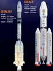
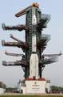
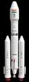
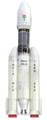
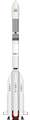

# GSLV
> 2019.06.25 [🚀](../index/index.md) [despace](index.md) → [LV](lv.md)

[TOC]

---

> <small>**GSLV** — англоязычный термин, не имеющий аналога в русском языке. **ГСЛВ** — дословный перевод с английского на русский.</small>

**Geosynchronous Satellite Launch Vehicle (GSLV)**, рус. **ракета‑носитель для запусков геосинхронных спутников** — семейство индийских одноразовых жидкостных ракет‑носителей среднего класса.

|*Version*|*Description*|*Activity*|
|:--|:--|:--|
|GSLV Mk.I|Базовый вариант.|Экспл. завершена (2001 ‑ 2010)|
|╟ GSLV Mk.II|Модификация GSLV Mk.I.|**Активен** (2010 ‑ …)|
|╙ GSLV Mk.III  (LVM3)|Модификация GSLV Mk.I.|**Активен** (2009 ‑ …)|

---

 

## GSLV Mk.II
**Geosynchronous Satellite Launch Vehicle Mark II (GSLV Mk.II)** — индийская одноразовая жидкостная ракета‑носитель среднего класса. Разработка на основе GSLV Mk.I, только 3‑я ступень (Cryogenic Upper Stage, «CUS») производства Индии, а не России.

|*Characteristic*|*[Value](si.md)*|
|:--|:--|
|Активность|**Активен** (2010.04.15 ‑ …)|
|[Аналоги](analogue.md)|[Delta‑4 Medium](delta.md) (США) ┊ [H‑IIA](h2.md) (Япония) ┊ [LongMarch‑3B](long_march.md) (Китай)|
|Длина/диаметр|49.13 м (с ГЧ) / 2.8 м|
|[Космодромы](spaceport.md)|[Sriharikota](sriharikota.md)|
|Масса старт./сух.|414 750 ㎏ / 53 450 ㎏|
|Разраб./изготов.|[ISRO](zz_isro.md) (Индия) / [ISRO](zz_isro.md) (Индия)|
|Ступени|3|
|[Топливо](fuel.md)|[АТ + НДМГ](at_plus.md) (ускорители, 2 ступ.), [HTPB](htpb.md) (1 ступ.), [Кислород + Водород](o_plus.md) (3 ступ.)|
| ||

**Выводимые массы.**

|*Космодром*|*РН*|<small>*Масса,  [НОО](nnb.md), т*</small>|<small>*Масса,  [ГСО](nnb.md), т*</small>|<small>*Масса к  [Луне](moon.md), т*</small>|<small>*Масса к  [Венере](venus.md), т*</small>|<small>*Масса к  [Марсу](mars.md), т*</small>|*Примечания*|
|:--|:--|:--|:--|:--|:--|:--|:--|
|[Sriharikota](sriharikota.md)|GSLV Mk.II|5|1.2|…|…|…|Пуск — $ 47 млн (2019 г);  ПН 1.20 % от ст.массы|

<small>Примечания:  **1)** Указана масса для наихудших условий старта.  **2)** В скобках указана масса для наилучших условий старта.</small>

 

## GSLV Mk.III
**Geosynchronous Satellite Launch Vehicle Mark III (GSLV Mk.III)** — индийская одноразовая жидкостная ракета‑носитель среднего класса.

|*Characteristic*|*[Value](si.md)*|
|:--|:--|
|Активность|**Активен** (2009.09.10 ‑ …)|
|[Аналоги](analogue.md)|[Arian 5](arian.md) (Европа) ┊ [Atlas 5](atlas.md) (США) ┊ [Delta 4 Heavy](delta.md) (США) ┊ [Falcon‑9](falcon.md) (США) ┊ [H‑IIB](h2.md) (Япония) ┊ [LongMarch‑3B (5)](long_march.md) (Китай) ┊ [Ангара‑А5](angara.md) (РФ) ┊ [Зенит‑3SL](zenit.md) (РФ) ┊ [Протон‑М](proton.md) (РФ) ┊ [Союз‑5.1](soyuz.md) (РФ)|
|Длина/диаметр|43.5 м (с ГЧ) / 4 м|
|[Космодромы](spaceport.md)|[Sriharikota](sriharikota.md)|
|Масса старт./сух.|644 750 ㎏ / 76 000 ㎏|
|Разраб./изготов.|[ISRO](zz_isro.md) (Индия) / [ISRO](zz_isro.md) (Индия)|
|Ступени|3|
|[Топливо](fuel.md)|[HTPB](htpb.md) (ускорители), [АТ + НДМГ](at_plus.md) (1 ступ.), [Кислород + Водород](o_plus.md) (2 ступ.)|
| | |

**Выводимые массы.**

|*Космодром*|*РН*|<small>*Масса,  [НОО](nnb.md), т*</small>|<small>*Масса,  [ГСО](nnb.md), т*</small>|<small>*Масса к  [Луне](moon.md), т*</small>|<small>*Масса к  [Венере](venus.md), т*</small>|<small>*Масса к  [Марсу](mars.md), т*</small>|*Примечания*|
|:--|:--|:--|:--|:--|:--|:--|:--|
|[Sriharikota](sriharikota.md)|GSLV Mk.III|8 <small>(600 ㎞)</small>|2.1|…|…|…|Пуск — $ 46‑62 млн (2017 г);  ПН 1.24 % от ст.массы|

<small>Примечания:  **1)** Указана масса для наихудших условий старта.  **2)** В скобках указана масса для наилучших условий старта.</small>

 

## Архивные

### GSLV Mk.I
**Geosynchronous Satellite Launch Vehicle Mark I (GSLV Mk.I)** — индийская одноразовая жидкостная ракета‑носитель среднего класса. Имела криогенную третью ступень российского производства: кислородно‑водородный блок «12КРБ» с жидкостным двигателем [КВД1](kvd1.md). После присоединения в 1995 году к «Соглашению о контроле за распространением ракет и ракетных технологий» поставки были прекращены. В связи с чем ISRO сделало аналогичную 3‑ю ступень и итоговую РН назвали GSLV Mk.II.

|*Characteristic*|*[Value](si.md)*|
|:--|:--|
|Активность|Экспл. завершена (2001.04.18 ‑ 2010.12.25)|
|[Аналоги](analogue.md)|[Delta‑4 Medium](delta.md) (США) ┊ [H‑IIA](h2.md) (Япония) ┊ [LongMarch‑3B](long_march.md) (Китай)|
|Длина/диаметр|49.13 м (с ГЧ) / 2.8 м|
|[Космодромы](spaceport.md)|[Sriharikota](sriharikota.md)|
|Масса старт./сух.|414 750 ㎏ / 53 450 ㎏|
|Разраб./изготов.|[ISRO](zz_isro.md) (Индия) / [ISRO](zz_isro.md) (Индия)|
|Ступени|3|
|[Топливо](fuel.md)|[АТ + НДМГ](at_plus.md) (ускорители, 2 ступ.), [HTPB](htpb.md) (1 ступ.), [Кислород + Водород](o_plus.md) (3 ступ.)|
| ||

**Выводимые массы.**

|*Космодром*|*РН*|<small>*Масса,  [НОО](nnb.md), т*</small>|<small>*Масса,  [ГСО](nnb.md), т*</small>|<small>*Масса к  [Луне](moon.md), т*</small>|<small>*Масса к  [Венере](venus.md), т*</small>|<small>*Масса к  [Марсу](mars.md), т*</small>|*Примечания*|
|:--|:--|:--|:--|:--|:--|:--|:--|
|[Sriharikota](sriharikota.md)|GSLV Mk.I|5|1.1|…|…|…|Пуск — $ 33 млн (2010 г);  ПН 1.20 % от ст.массы|

<small>Примечания:  **1)** Указана масса для наихудших условий старта.  **2)** В скобках указана масса для наилучших условий старта.</small>

 

## Docs & links (TRANSLATEME ALREADY)
|Navigation|
|:--|
|**[FAQ](faq.md)**, **[Cable](cable.md)**·БКС, **[Camera](cam.md)**·Камера, **[Comms](comms.md)**·Радио, **[Contact](contact.md)**·Контакт, **[Control](control.md)**·Упр., **[Doc](doc.md)**·Док., **[Doppler](doppler.md)**·ИСР, **[DS](ds.md)**·ЗУ, **[EB](eb.md)**·ХИТ, **[ECO](ecology.md)**·Экол., **[EF](ef.md)**·ВВФ, **[ElC](elc.md)**·ЭКБ, **[EMC](emc.md)**·ЭМС, **[Error](error.md)**·Ошибки, **[Event](event.md)**·События, **[FS](fs.md)**·ТЭО, **[Fuel](fuel.md)**·Топливо, **[GNC](gnc.md)**·БКУ, **[GS](scs.md)**·НС, **[HF&E](hfe.md)**·Эрго., **[IU](iu.md)**·Гиро., **[KT](kt.md)**·КТЕХ, **[LAG](lag.md)**·ПУC, **[LES](les.md)**·САСП, **[LS](ls.md)**·СЖО, **[LV](lv.md)**·РН, **[MCC](mcc.md)**·ЦУП, **[Model](model.md)**·Модель, **[MSC](sc.md)**·ПКА, **[N&B](nnb.md)**·БНО, **[NR](nr.md)**·ЯР, **[OBC](obc.md)**·ЦВМ, **[OE](oe.md)**·БА, **[Pat.](патент.md)**·Патент, **[Proj.](project.md)**·Проект, **[PS](ps.md)**·ДУ, **[R&D](rnd.md)**·НИОКР, **[Robot](robotics.md)**·Робот, **[Rover](rover.md)**·Ровер, **[RTG](rtg.md)**·РИТЭГ, **[SARC](sarc.md)**·ПСК, **[SE](se.md)**·СЭ, **[Sens.](sensor.md)**·Датч., **[SC](sc.md)**·КА, **[SCS](scs.md)**·КК, **[SGM](sgm.md)**·КММ, **[SI](si.md)**·СИ, **[Soft](soft.md)**·ПО, **[SP](sp.md)**·БС, **[Spaceport](spaceport.md)**·Космодр., **[SPS](sps.md)**·СЭС, **[SRRQ](srrq.md)**·БКНР, **[SSS](sss.md)**·ГЗУ, **[TCS](tcs.md)**·СОТР, **[Test](test.md)**·ЭО, **[Timeline](timeline.md)**·ЦГМ, **[TMS](tms.md)**·ТМС, **[TOR](tor.md)**·ТЗ, **[TRL](trl.md)**·УГТ|
|*Sections & pages*|
|**··• [Launch vehicle (LV)](lv.md) •··**  [ICBM](icbm.md) ┊ [Integrated payload unit](lv.md) ┊ [Non‑rocket spacelaunch](nrs.md) ┊ [Throw weight](throw_weight.md) • • •  **China:** [Long March](long_march.md) ┊ **EU:** [Arian](arian.md), [Vega](vega.md) ┊ **India:** [GSLV](gslv.md), [PSLV](pslv.md) ┊ **Israel:** [Shavit](shavit.md) ┊ **Japan:** [Epsilon](epsilon.md), [H2](h2.md), [H3](h3.md) ┊ **Korea N.:** [Unha](unha.md) ┊ **Korea S.:** *([Naro‑1](naro_1.md))* ┊ **RF,CIF:** [Angara](angara.md), [Proton](proton.md), [Soyuz](soyuz.md), [Yenisei](yenisei.md), [Zenit](zenit.md) *([Energia](energia.md), [Korona](korona.md), [N‑1](n_1.md), [R‑1](r_7.md))* ┊ **USA:** [Antares](antares.md), [Atlas](atlas.md), [BFR](bfr.md), [Delta](delta.md), [Electron](electron.md), [Falcon](falcon.md), [Firefly Alpha](firefly_alpha.md), [LauncherOne](launcherone.md), [New Armstrong](new_armstrong.md), [New Glenn](new_glenn.md), [Minotaur](minotaur.md), [Pegasus](pegasus.md), [Shuttle](shuttle.md), [SLS](sls.md), [Vulcan](vulcan.md) *([Saturn](saturn_lv.md), [Sea Dragon](sea_dragon.md))*|

   1. Docs:
      - [GSLV manual ❐](f/lv/gslv/gslv_manual_issue0_rev0_2004.djvu) (2004, issue 0 rev. 0)
   1. Notable interwikies — …
   1. <https://en.wikipedia.org/wiki/Comparison_of_orbital_launch_systems>
   1. <https://en.wikipedia.org/wiki/Geosynchronous_Satellite_Launch_Vehicle>
   1. <https://en.wikipedia.org/wiki/Geosynchronous_Satellite_Launch_Vehicle_Mark_III>
   1. <https://ru.wikipedia.org/wiki/GSLV_(ракета‑носитель)>
   1. <https://ru.wikipedia.org/wiki/GSLV_III_(ракета‑носитель)>
   1. <https://www.isro.gov.in/launchers/gslv-mk-iii>
   1. <https://www.isro.gov.in/launchers/gslv>
   1. <http://ecoruspace.me/GSLV+Mk+II.html>
   1. <http://ecoruspace.me/GSLV+Mk+III.html>
