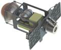
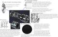
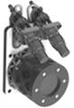

# GT-50
> 2019.01.18 **[🚀](../index/index.md) [despace](index.md)** → **[ДУ](ps.md)**

[TOC]

---

> <small>*Термины:* **GT-50** — русскоязычный термин, не имеющий аналога в английском языке. **GT-50** — дословный перевод с русского на английский.</small>

**GT-50** — электроракетный ионный [двигатель](ps.md) производства [Avantspace](zz_avantspace.md).

<small>

Характеристики указаны для вакуума и номинальных условий работы в непрерывном режиме.

|*Характеристика*|*[Значение](si.md) <small>(GT-50)</small>*|*[Значение](si.md) <small>(GT-50)</small>*|
|:--|:--|:--|
|Габариты, длина × ширина × высота, мм|100 × 200 × 300|100 × 200 × 300|
|Давление: вход в двигатель, МПа (кгс/cm²)|||
|Давление: камера сгорания, МПа (кгс/cm²)|||
|Давление: срез сопла, МПа (кгс/cm²)|||
|Длительность одного включения, с|||
|[ИПТ](ing.md), Н·с (кгс·с), не более|||
|Макс. расход, кг/с, не более|||
|Макс. частота включений, Гц|||
|Масса, кг, не более|8 **⁽²⁾**|8 **⁽²⁾**|
|Массовое соотношение КРТ|||
|Мощность потребляемая, Вт|180|240|
|Обороты ТНА|—|—|
|Продукты горения|||
|Раствор пучка, °|||
|Ресурс: количество включений, не менее|||
|Ресурс: сумм. длит. включений, c, не менее|||
|Ресурс: сумм. импульс, Н·с (кгс·с), не менее|||
|Ресурс: сумм. тяга, Н (кгс), не менее|||
|Ресурс: топливо, кг, не менее|||
|[САС](lifetime.md) в космосе, ч (лет)|20 000 (2.28)|20 000 (2.28)|
|Температура: камера сгорания, тыс. К (℃)|||
|Температура: срез сопла, тыс. К (℃)|||
|[Топливо](fuel.md)|[Ксенон](ксенон.md) **⁽¹⁾**|[Ксенон](ксенон.md) **⁽¹⁾**|
|Тяга: номинальная, Н (кгс)|0.005 (0.0005)|0.007 (0.0007)|
|Тяга: отклонение, %|||
|[TRL](trl.md)|4|4|
|[УИ тяги](isp.md), Н·с/кг (с), не менее|19 600 (2 000)|19 600 (2 000)|
|Число Маха / [Показатель адиабаты](heat_cr.md)|||
| |||

</small>

 

## Примечания
   1. **[1]** — см. сайт [Avantspace](zz_avantspace.md), 2020 год.
   1. **[2]** — масса включает двигатель, баки, конструкцию и являет собой полноценную ДУ.

## Применяемость
   1. …

 

## Docs & links (TRANSLATEME ALREADY)
|…°·•¹²³±×÷≤≥≈≠ ‑ −— ⎆✉ ❐“”’«»✔→✘☐☑├┕┆ 1 lb = 0.453592 kg; 1 g = 9.80665 m/s²|
|:--|
|<small>**[FAQ](faq.md)**, **[Cable](cable.md)**·БКС, **[Camera](cam.md)**·Камера, **[Comms](comms.md)**·Радио, **[Contact](contact.md)**·Контакт, **[Control](control.md)**·Упр., **[Doc](doc.md)**·Док., **[Doppler](doppler.md)**·ИСР, **[DS](ds.md)**·ЗУ, **[EB](eb.md)**·ХИТ, **[ECO](ecology.md)**·Экол., **[EF](ef.md)**·ВВФ, **[ElC](elc.md)**·ЭКБ, **[EMC](emc.md)**·ЭМС, **[Error](error.md)**·Ошибки, **[Event](event.md)**·События, **[FS](fs.md)**·ТЭО, **[Fuel](fuel.md)**·Топливо, **[GNC](gnc.md)**·БКУ, **[GS](scs.md)**·НС, **[HF&E](hfe.md)**·Эрго., **[IU](iu.md)**·Гиро., **[KT](kt.md)**·КТЕХ, **[LAG](lag.md)**·ПУC, **[LES](les.md)**·САСП, **[LS](ls.md)**·СЖО, **[LV](lv.md)**·РН, **[MCC](mcc.md)**·ЦУП, **[Model](model.md)**·Модель, **[MSC](sc.md)**·ПКА, **[N&B](nnb.md)**·БНО, **[NR](nr.md)**·ЯР, **[OBC](obc.md)**·ЦВМ, **[OE](oe.md)**·БА, **[Pat.](патент.md)**·Патент, **[Project](project.md)**·Проект, **[PS](ps.md)**·ДУ, **[R&D](rnd.md)**·НИОКР, **[SRRQ](srrq.md)**·БКНР, **[Robot](robotics.md)**·Робот, **[Rover](rover.md)**·Планетоход, **[RTG](rtg.md)**·РИТЭГ, **[SARC](sarc.md)**·ПСК, **[Sensor](sensor.md)**·Датчик, **[SC](sc.md)**·КА, **[SCS](scs.md)**·КК, **[SGM](sgm.md)**·КММ, **[SI](si.md)**·СИ, **[Soft](soft.md)**·ПО, **[SP](sp.md)**·БС, **[Spaceport](spaceport.md)**·Космодром, **[SPS](sps.md)**·СЭС, **[SSS](sss.md)**·ГЗУ, **[TCS](tcs.md)**·СОТР, **[Test](test.md)**·ЭО, **[Timeline](timeline.md)**·ЦГМ, **[TMS](tms.md)**·ТМС, **[TOR](tor.md)**·ТЗ, **[TRL](trl.md)**·УГТ</small>|
|*Sections & pages*|
|**`Двигательная установка (ДУ):`**  [HTAE](htae.md) ┊ [TALOS](talos.md) ┊ [Баки топливные](fuel_tank.md) ┊ [Варп‑двигатель](warp_drive.md) ┊ [Газовый двигатель](cgt.md) ┊ [Гибридный двигатель](гбрд.md) ┊ [Двигатель Бассарда](bussard_ramjet.md) ┊ [ЖРД](lpr.md) ┊ [ИПТ](ing.md) ┊ [Ионный двигатель](иод.md) ┊ [Как считать топливо?](si.md) ┊ [КЗУ](cinu.md) ┊ [КХГ](cgs.md) ┊ [Номинал](nominal.md) ┊ [Мятый газ](exhsteam.md) ┊ [РДТТ](spr.md) ┊ [Сильфон](сильфон.md) ┊ [СОЗ](соз.md) ┊ [СОИС](соис.md) ┊ [Солнечный парус](солнечный_парус.md) ┊ [ТНА](turbopump.md) ┊ [Топливные мембраны](топливные_мембраны.md) ┊ [Топливные мешки](топливные_мешки.md) ┊ [Топливо](fuel.md) ┊ [Тяговооружённость](ttwr.md) ┊ [ТЯРД](тярд.md) ┊ [УИ](isp.md) ┊ [Фотонный двигатель](фотонный_двигатель.md) ┊ [ЭРД](epsp.md) ┊ [Эффект Оберта](oberth_eff.md) ┊ [ЯРД](ntr.md)|

   1. Docs:
      - [Комплект базовых презентаций](f/ps/g/gt_50_doc01.pdf)
   1. Notable interwikies — …
   1. <http://www.avantspace.com/>
   1. <https://habr.com/ru/post/484364/>
