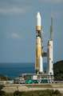
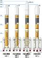
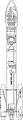
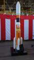
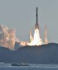
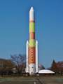
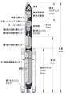

# H-II
> 2019.05.27 [🚀](../index/index.md) [despace](index.md) → [LV](lv.md)

[TOC]

---

> <small>**H-II** — англоязычный термин, не имеющий аналога в русском языке. **Эйч‑2** — дословный перевод с английского на русский.</small>

**H-II (H2)** — семейство японских одноразовых жидкостных ракет‑носителей среднего и тяжёлого классов.

|*Version*|*Description*|*Activity*|
|:--|:--|:--|
|H-II|Базовый вариант.|Экспл. завершена (1994 ‑ 1999)|
|╟ H-IIA|Модификация H-II.|**Активен** (2001 ‑ …)|
|╙ H-IIB|Модификация H-IIA.|**Активен** (2009 ‑ …)|

---

 

## H-IIA
**H-IIA** *(эйч‑два‑эй)* — японская одноразовая жидкостная ракета‑носитель среднего и тяжёлого классов семейства H-II. Создана по заказу JAXA компанией Mitsubishi Heavy Industries. H-IIA — модификация H-II, что повысило надёжность и вдвое снизить стоимость запусков. Имеются 4 варианта РН для различного спектра применений, позволяющие запускать КА на разные орбиты, включая НОО, ССО и ГПО.  
Стандартный обтекатель (4S, англ. short — «короткий») имеет диаметр 4 м, длину 12 м и массу 1 400 ㎏. Также может быть использован пятиметровый короткий обтекатель (5S) и удлинённый вариант четырёхметрового обтекателя (4/4D-LC).

|*Characteristic*|*[Value](si.md)*|
|:--|:--|
|Активность|**Активен** (2001.08.29‑…)|
|[Аналоги](analogue.md)|[Atlas 5](atlas.md) (США)・ [Long March 3](long_march.md) (Китай)・ [Long March 7](long_march.md) (Китай)|
|Длина/диаметр|202 — 53 м (с ГЧ) / 4 м;  204 — 53 м (с ГЧ) / 4 м|
|[Космодромы](spaceport.md)|[Tanegashima](spaceport.md) (LA-Y)|
|Масса старт./сух.|202 — 285 000 ㎏ / … ㎏;  204 — 445 000 ㎏ / … ㎏|
|Разраб./изготов.|Mitsubishi Heavy Industries (Япония) / Mitsubishi Heavy Industries (Япония)|
|Ступени|2 + ускорители|
|[Fuel](fuel.md)|[O + H](o_plus.md) ([HTPB](htpb.md) в ускорителях)|
| |  |

**Выводимые массы.**

|*Космодром*|*РН*|<small>*Масса,  [НОО](nnb.md), т*</small>|<small>*Масса,  [ГСО](nnb.md), т*</small>|<small>*Масса к  [Луне](moon.md), т*</small>|<small>*Масса к  [Венере](venus.md), т*</small>|<small>*Масса к  [Марсу](mars.md), т*</small>|*Примечания*|
|:--|:--|:--|:--|:--|:--|:--|:--|
|[Tanegashima](spaceport.md)|H-IIA 202|10|4|…|…|…|Пуск — $ 90 млн (2019 г);  ПН 3.50 % от ст.массы|
|[Tanegashima](spaceport.md)|H-IIA 204|15|5.9|…|…|…|Пуск — $ 150 млн (2019 г);  ПН 3.37 % от ст.массы|

<small>Примечания:  **1)** Указана масса для наихудших условий старта.  **2)** В скобках указана масса для наилучших условий старта.</small>

 

## H-IIB
**H-IIB** *(Эйч‑ту‑би)* — японская одноразовая жидкостная ракета‑носитель среднего и тяжёлого классов семейства H-II. Является продолжением развития РН H-IIA.

|*Characteristic*|*[Value](si.md)*|
|:--|:--|
|Активность|**Активен** (2009.09.10‑…)|
|[Аналоги](analogue.md)|[Arian 5](arian.md) (Европа)・ [Atlas 5](atlas.md) (США)・ [Long March 7](long_march.md) (Китай)・ [Vulcan](vulcan.md) (США)|
|Длина/диаметр|56.6 м (с ГЧ) / 5.2 м|
|[Космодромы](spaceport.md)|[Tanegashima](spaceport.md) (LA-Y2)|
|Масса старт./сух.|531 000 ㎏ / … ㎏|
|Разраб./изготов.|Mitsubishi Heavy Industries (Япония) / Mitsubishi Heavy Industries (Япония)|
|Ступени|2 + ускорители|
|[Fuel](fuel.md)|[O + H](o_plus.md) ([HTPB](htpb.md) в ускорителях)|
| |  |

**Выводимые массы.**

|*Космодром*|*РН*|<small>*Масса,  [НОО](nnb.md), т*</small>|<small>*Масса,  [ГСО](nnb.md), т*</small>|<small>*Масса к  [Луне](moon.md), т*</small>|<small>*Масса к  [Венере](venus.md), т*</small>|<small>*Масса к  [Марсу](mars.md), т*</small>|*Примечания*|
|:--|:--|:--|:--|:--|:--|:--|:--|
|[Tanegashima](spaceport.md)|H-IIB|16.5|8|…|…|…|Пуск — $ 112.5 млн (2019 г);  ПН 3.01 % от ст.массы|

<small>Примечания:  **1)** Указана масса для наихудших условий старта.  **2)** В скобках указана масса для наилучших условий старта.</small>

 

## Архивные

### H-II
**H-II** *(H2)* — японская одноразовая жидкостная ракета‑носитель среднего класса. Была разработана NASDA с целью обеспечения запуска крупных спутников с территории Японии в 1990-е годы. Это была первая японская двухступенчатая РН на жидком топливе, разработанная с применением собственных технологий. Она была заменена РН H-IIA из‑за проблем с надёжностью и ценой.

|*Characteristic*|*[Value](si.md)*|
|:--|:--|
|Активность|Экспл. завершена (1994‑1999)|
|[Аналоги](analogue.md)|[Atlas 5](atlas.md) (США)・ [Long March 3](long_march.md) (Китай)・ [Long March 7](long_march.md) (Китай)|
|Длина/диаметр|49 м (с ГЧ) / 4 м|
|[Космодромы](spaceport.md)|[Tanegashima](spaceport.md) (LC-Y)|
|Масса старт./сух.|260 000 ㎏ / … ㎏|
|Разраб./изготов.|Mitsubishi Heavy Industries (Япония) / Mitsubishi Heavy Industries (Япония)|
|Ступени|2 + ускорители|
|[Fuel](fuel.md)|[O + H](o_plus.md) ([HTPB](htpb.md) в ускорителях)|
| |  |

**Выводимые массы.**

|*Космодром*|*РН*|<small>*Масса,  [НОО](nnb.md), т*</small>|<small>*Масса,  [ГСО](nnb.md), т*</small>|<small>*Масса к  [Луне](moon.md), т*</small>|<small>*Масса к  [Венере](venus.md), т*</small>|<small>*Масса к  [Марсу](mars.md), т*</small>|*Примечания*|
|:--|:--|:--|:--|:--|:--|:--|:--|
|[Tanegashima](spaceport.md)|H-II|10|3.9|…|…|…|Пуск — $ … млн (… г);  ПН 3.84 % от ст.массы|

<small>Примечания:  **1)** Указана масса для наихудших условий старта.  **2)** В скобках указана масса для наилучших условий старта.</small>

 

## Docs & links (TRANSLATEME ALREADY)
|Navigation|
|:--|
|**[FAQ](faq.md)**【**[SCS](scs.md)**·КК, **[SC (OE+SGM)](sc.md)**·КА】**[CON](contact.md)·[Pers](person.md)**·Контакт, **[Ctrl](control.md)**·Упр., **[Doc](doc.md)**·Док., **[EF](ef.md)**·ВВФ, **[Error](error.md)**·Ошибки, **[Event](event.md)**·События, **[FS](fs.md)**·ТЭО, **[HF&E](hfe.md)**·Эрго., **[KT](kt.md)**·КТ, **[Model](model.md)**·Модель, **[N&B](nnb.md)**·БНО, **[Project](project.md)**·Проект, **[QM](qm.md)**·БКНР, **[R&D](rnd.md)**·НИОКР, **[SI](si.md)**·СИ, **[Test](test.md)**·ЭО, **[TRL](trl.md)**·УГТ, **[Way](way.md)**·Пути|
|*Sections & pages*|
|**【[Launch vehicle (LV)](lv.md)】**  [ICBM](icbm.md)・ [Integrated payload unit](lv.md)・ [Non‑rocket spacelaunch](nrs.md)・ [Throw weight](throw_weight.md) • • •  **China:** [Long March](long_march.md) ┊ **EU:** [Arian](arian.md), [Vega](vega.md) ┊ **India:** [GSLV](gslv.md), [PSLV](pslv.md) ┊ **Israel:** [Shavit](shavit.md) ┊ **Japan:** [Epsilon](epsilon.md), [H2](h2.md), [H3](h3.md) ┊ **Korea N.:** [Unha](unha.md) ┊ **Korea S.:** *([Naro‑1](naro_1.md))* ┊ **RF,CIF:** [Angara](angara.md), [Proton](proton.md), [Soyuz](soyuz.md), [Yenisei](yenisei.md), [Zenit](zenit.md) *([Energia](energia.md), [Korona](korona.md), [N‑1](n_1.md), [R‑1](r_7.md))* ┊ **USA:** [Antares](antares.md), [Atlas](atlas.md), [BFR](bfr.md), [Delta](delta.md), [Electron](electron.md), [Falcon](falcon.md), [Firefly Alpha](firefly_alpha.md), [LauncherOne](launcherone.md), [New Armstrong](new_armstrong.md), [New Glenn](new_glenn.md), [Minotaur](minotaur.md), [Pegasus](pegasus.md), [Shuttle](shuttle.md), [SLS](sls.md), [Vulcan](vulcan.md) *([Saturn](saturn_lv.md), [Sea Dragon](sea_dragon.md))*|

   1. Docs: …
   1. <https://en.wikipedia.org/wiki/Comparison_of_orbital_launch_systems>
   1. <https://en.wikipedia.org/wiki/H-IIA>
   1. <https://ru.wikipedia.org/wiki/H-IIA>
   1. <https://en.wikipedia.org/wiki/H-IIB>
   1. <https://ru.wikipedia.org/wiki/H-IIB>
   1. <https://en.wikipedia.org/wiki/H-II>
   1. <https://ru.wikipedia.org/wiki/H-II_(ракета‑носитель)>

