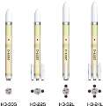
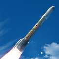
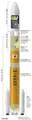

# H3
> 2019.05.28 **[🚀](../index/index.md) [despace](index.md)** → [LV](lv.md)

[TOC]

---

> <small>*Термины:* **H3** — англоязычный термин, не имеющий аналога в русском языке. **Эйч‑3** — дословный перевод с английского на русский.</small>

**H3** — семейство разрабатываемых японских ракет‑носителей, призванное впоследствии заменить основные действующие РН [H-IIA и H-IIB](h2.md).

|*Version*|*Description*|*Activity*|
|:--|:--|:--|
|H3  |Базовый вариант. | В разработке (2020 ‑ …)  |

---

 

## H3
**H3** — разрабатываемая японская ракета‑носитель, призванная впоследствии заменить основные действующие РН [H-IIA и H-IIB](h2.md). Целью создания «H3» является дальнейшее снижение стоимости запуска японских РН и увеличение частоты запусков, чтобы иметь возможность конкурировать на мировом рынке коммерческих пусков. Заявлены снижение стоимости пуска вдвое, по сравнению с H-IIA. РН будет иметь несколько конфигураций для широкого спектра орбит и размеров ПН. Имеются короткий (S, англ. short) или длинный (L, англ. long) ГО с внешним диаметром 5.2 м и внутренним диаметром 4.6 м.

Версия ракеты‑носителя будет обозначается тремя символами: 2 цифры и 1 буква.

   - Первая цифра обозначает количество двигателей на первой ступени и может быть **2** или **3**.
   - Вторая цифра обозначает количество твердотопливных ускорителей и может быть **0**, **2** или **4**.
   - Буква обозначает тип головного обтекателя, и может быть **S** или **L**.

|*Characteristic*|*[Value](si.md)*|
|:--|:--|
|Активность  | В разработке (2020‑…)  |
|[Аналоги](analogue.md)  | [Atlas 5](atlas.md) (США) ┊ [Long March 3](long_march.md) (Китай) ┊ [Long March 7](long_march.md) (Китай)  |
|Длина/диаметр  | H3-30S — 63 м (с ГЧ) / 5.2 м;  H3-24L — 63 м (с ГЧ) / 5.2 м  |
|[Космодромы](spaceport.md)  | [Tanegashima](tanegashima.md) (LA-Y2)  |
|Масса старт./сух.  | H3-30S — 294 000 кг / … кг;  H3-24L — 574 000 кг / … кг  |
|Разраб./изготов.  | Mitsubishi Heavy Industries (Япония) / Mitsubishi Heavy Industries (Япония)  |
|Ступени  | H3-30S — 2;  H3-24L — 2 + 4 ускорителя  |
|[Топливо](fuel.md)  | [Кислород + Водород](o_plus.md) ([HTPB](htpb.md) в ускорителях)  |
||    |

**Выводимые массы.**

|*Космодром*|*РН*|<small>*Масса,  [НОО](nnb.md), т*</small>|<small>*Масса,  [ГСО](nnb.md), т*</small>|<small>*Масса к  [Луне](moon.md), т*</small>|<small>*Масса к  [Венере](venus.md), т*</small>|<small>*Масса к  [Марсу](mars.md), т*</small>|*Примечания*|
|:--|:--|:--|:--|:--|:--|:--|:--|
| [Tanegashima](tanegashima.md) | H3-30S |10|4|…|…|…| Пуск — $ 45 млн (2019 г);  ПН 3.40 % от ст.массы  |
| [Tanegashima](tanegashima.md) | H3-24L |16|6.5|…|…|…| Пуск — $ 65 млн (2019 г);  ПН 2.78 % от ст.массы  |

<small>Примечания:  **1)** Указана масса для наихудших условий старта.  **2)** В скобках указана масса для наилучших условий старта.</small>

 

## Docs & links (TRANSLATEME ALREADY)
|…°·•¹²³±×÷≤≥≈≠ ‑ −— ⎆✉ ❐“”’«»✔→✘☐☑├┕┆ 1 lb = 0.453592 kg; 1 g = 9.80665 m/s²|
|:--|
|<small>**[FAQ](faq.md)**, **[Cable](cable.md)**·БКС, **[Camera](cam.md)**·Камера, **[Comms](comms.md)**·Радио, **[Contact](contact.md)**·Контакт, **[Control](control.md)**·Упр., **[Doc](doc.md)**·Док., **[Doppler](doppler.md)**·ИСР, **[DS](ds.md)**·ЗУ, **[EB](eb.md)**·ХИТ, **[ECO](ecology.md)**·Экол., **[EF](ef.md)**·ВВФ, **[ElC](elc.md)**·ЭКБ, **[EMC](emc.md)**·ЭМС, **[Error](error.md)**·Ошибки, **[Event](event.md)**·События, **[FS](fs.md)**·ТЭО, **[Fuel](fuel.md)**·Топливо, **[GNC](gnc.md)**·БКУ, **[GS](scs.md)**·НС, **[HF&E](hfe.md)**·Эрго., **[IU](iu.md)**·Гиро., **[KT](kt.md)**·КТЕХ, **[LAG](lag.md)**·ПУC, **[LES](les.md)**·САСП, **[LS](ls.md)**·СЖО, **[LV](lv.md)**·РН, **[MCC](mcc.md)**·ЦУП, **[Model](model.md)**·Модель, **[MSC](sc.md)**·ПКА, **[N&B](nnb.md)**·БНО, **[NR](nr.md)**·ЯР, **[OBC](obc.md)**·ЦВМ, **[OE](oe.md)**·БА, **[Pat.](патент.md)**·Патент, **[Project](project.md)**·Проект, **[PS](ps.md)**·ДУ, **[R&D](rnd.md)**·НИОКР, **[SRRQ](srrq.md)**·БКНР, **[Robot](robotics.md)**·Робот, **[Rover](rover.md)**·Планетоход, **[RTG](rtg.md)**·РИТЭГ, **[SARC](sarc.md)**·ПСК, **[Sensor](sensor.md)**·Датчик, **[SC](sc.md)**·КА, **[SCS](scs.md)**·КК, **[SGM](sgm.md)**·КММ, **[SI](si.md)**·СИ, **[Soft](soft.md)**·ПО, **[SP](sp.md)**·БС, **[Spaceport](spaceport.md)**·Космодром, **[SPS](sps.md)**·СЭС, **[SSS](sss.md)**·ГЗУ, **[TCS](tcs.md)**·СОТР, **[Test](test.md)**·ЭО, **[Timeline](timeline.md)**·ЦГМ, **[TMS](tms.md)**·ТМС, **[TOR](tor.md)**·ТЗ, **[TRL](trl.md)**·УГТ</small>|
|*Sections & pages*|
|**··• [Launch vehicle (LV)](lv.md) •··**  [ICBM](icbm.md) ┊ [Integrated payload unit](lv.md) ┊ [Non‑rocket spacelaunch](nrs.md) ┊ [Throw weight](throw_weight.md) • • •  **China:** [Long March](long_march.md) ┊ **EU:** [Arian](arian.md), [Vega](vega.md) ┊ **India:** [GSLV](gslv.md), [PSLV](pslv.md) ┊ **Israel:** [Shavit](shavit.md) ┊ **Japan:** [Epsilon](epsilon.md), [H2](h2.md), [H3](h3.md) ┊ **Korea N.:** [Unha](unha.md) ┊ **Korea S.:** *([Naro‑1](naro_1.md))* ┊ **RF,CIF:** [Angara](angara.md), [Proton](proton.md), [Soyuz](soyuz.md), [Yenisei](yenisei.md), [Zenit](zenit.md) *([Energia](energia.md), [Korona](korona.md), [N‑1](n_1.md), [R‑1](r_7.md))* ┊ **USA:** [Antares](antares.md), [Atlas](atlas.md), [BFR](bfr.md), [Delta](delta.md), [Electron](electron.md), [Falcon](falcon.md), [Firefly Alpha](firefly_alpha.md), [LauncherOne](launcherone.md), [New Armstrong](new_armstrong.md), [New Glenn](new_glenn.md), [Minotaur](minotaur.md), [Pegasus](pegasus.md), [Shuttle](shuttle.md), [SLS](sls.md), [Vulcan](vulcan.md) *([Saturn](saturn_lv.md), [Sea Dragon](sea_dragon.md))* |

   1. Docs: …
   1. Notable interwikies — …
   1. <https://en.wikipedia.org/wiki/Comparison_of_orbital_launch_systems>
   1. <https://ru.wikipedia.org/wiki/H3_(ракета‑носитель)>
   1. <https://en.wikipedia.org/wiki/H3_(rocket)>

