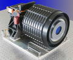

# HAST
> 2019.07.23 [🚀](../index/index.md) [despace](index.md) → **[ЗД](sensor.md)**

[TOC]

---

> <small>**High Accuracy Star Tracker (HAST)** — англоязычный термин, не имеющий аналога в русском языке. **Высокоточный звёздный датчик (HAST)** — дословный перевод с английского на русский.</small>

**HAST** — звёздный датчик для определения и выдачи в [GNC](gnc.md) информации о положении и угловых скоростях системы координат (СК) изделия относительно геоцентрической СК.  
*Разработчик:* [Ball A&T](zz_ball_at.md), US. Разработано в 1999 году. Активное применение.

<small>

|*•    Характеристика    •*|*[Значение](si.md) <small>(HAST)</small>*|
|:--|:--|
|[TRL](trl.md)|9|
|Время опознавания, с| |
|Вых. информация| |
|Допуст. угл. скор., °/с|8 (ускорение 8 °/с²)|
|Запаздывание, с, ≤| |
|Исполнение|1 Star sensor electronics unit (SSEU), 2 Star sensor heads (SSH)|
|Объектив|c заслонками от Солнца и затенением|
|Поле зрения, °|8 × 8|
|Режим готовности| |
|Точность|0.18″ для скорости ≤ 1 °/с; 0.50″ для скорости 1 ‑ 8 °/с|
|Частота обновл., Гц|60 (8 опознаваемых звёзд) или 100 (4 звезды)|
|Яркость фона, кд/m²| |
|**Etc:**|• • •|
|[ВБР](qa.md) за САС| |
|Dimensions, L×W×H, mm| |
|Интерфейсы| |
|Mass, kg|7.7|
|[Voltage](voltage.md), V|28 (22 ‑ 36)|
|Overload, g| |
|[Rad.resist](ion_rad.md), Gy (rad)|до 10 000 протон/с/㎝²|
|Resource, h (y)| |
|[Lifetime](lifetime.md), h (y)|43 800 (5)|
|[Temp. range](tcs.md), ℃|SSEU: −15 ‑ +52, SSH: −1 ‑ +32, Заслонка: −26 ‑ +27, Затенение: −60 ‑ +27|
|Consumption, W| |
| ||

</small>

 

## Примечания
   1. …

## Применяемость
   1. NASA Chandra X‑ray Observatory

 

## Docs & links (TRANSLATEME ALREADY)
|Navigation|
|:--|
|**[FAQ](faq.md)**, **[Cable](cable.md)**·БКС, **[Camera](cam.md)**·Камера, **[Comms](comms.md)**·Радио, **[CON](contact.md)·[Pers](person.md)**·Контакт, **[Control](control.md)**·Упр., **[Doc](doc.md)**·Док., **[Doppler](doppler.md)**·ИСР, **[DS](ds.md)**·ЗУ, **[EB](eb.md)**·ХИТ, **[ECO](ecology.md)**·Экол., **[EF](ef.md)**·ВВФ, **[ElC](elc.md)**·ЭКБ, **[EMC](emc.md)**·ЭМС, **[Error](error.md)**·Ошибки, **[Event](event.md)**·События, **[FS](fs.md)**·ТЭО, **[Fuel](fuel.md)**·Топливо, **[GNC](gnc.md)**·БКУ, **[GS](scs.md)**·НС, **[HF&E](hfe.md)**·Эрго., **[IU](iu.md)**·Гиро., **[KT](kt.md)**·КТЕХ, **[LAG](lag.md)**·ПУC, **[LES](les.md)**·САСП, **[LS](ls.md)**·СЖО, **[LV](lv.md)**·РН, **[MCC](mcc.md)**·ЦУП, **[Model](model.md)**·Модель, **[MSC](sc.md)**·ПКА, **[N&B](nnb.md)**·БНО, **[NR](nr.md)**·ЯР, **[OBC](obc.md)**·ЦВМ, **[OE](oe.md)**·БА, **[Pat.](патент.md)**·Патент, **[Proj.](project.md)**·Проект, **[PS](ps.md)**·ДУ, **[QA](qa.md)**·БКНР, **[R&D](rnd.md)**·НИОКР, **[Robot](robotics.md)**·Робот, **[Rover](rover.md)**·Ровер, **[RTG](rtg.md)**·РИТЭГ, **[SARC](sarc.md)**·ПСК, **[SE](se.md)**·СЭ, **[Sens.](sensor.md)**·Датч., **[SC](sc.md)**·КА, **[SCS](scs.md)**·КК, **[SGM](sgm.md)**·КММ, **[SI](si.md)**·СИ, **[Soft](soft.md)**·ПО, **[SP](sp.md)**·БС, **[Spaceport](spaceport.md)**·Космодр., **[SPS](sps.md)**·СЭС, **[SSS](sss.md)**·ГЗУ, **[TCS](tcs.md)**·СОТР, **[Test](test.md)**·ЭО, **[Timeline](timeline.md)**·ЦГМ, **[TMS](tms.md)**·ТМС, **[TOR](tor.md)**·ТЗ, **[TRL](trl.md)**·УГТ|
|*Sections & pages*|
|**`Звёздный датчик (ЗД):`**  [Видимая звёздная величина](app_mag.md)┊ [ПЗр](fov.md) • • •  **Европа:** [ASTRO 15](astro_15.md) (6.15)┊ [Hydra](hydra.md) (4.6)┊ [ASTRO 10](astro_10.md) (3.8)┊ [A-STR](a_str.md) (3.55)┊ [AA-STR](aa_str.md) (2.6)┊ [HE-5AS](he_5as.md) (2.2)┊ [ASTRO APS](astro_aps.md) (2)┊ [Horus](horus.md) (1.6)┊ [T2](t2.md) (0.8)┊ [T1](t1.md) (0.6 ‑ 1)┊ [Auriga](auriga.md) (0.21)  ▮  **РФ:** [348К](348k.md) (3.45)┊ [360К](360k.md) ()┊ [АД-1](ad_1.md) (3.8)┊ [БОКЗ-МФ](bokz_mf.md) (2.8)┊ [мБОКЗ-2](мбокз_2.md) (1.5)┊ [SX-SR-MicroBOKZ](sx_sr_microbokz.md) (0.5)  ▮  **США:** [HAST](hast.md) (7.7)┊ [CT-2020](ct_2020.md) (3)┊ [µSTAR](mustar.md) (2.1)┊ [MIST](mist.md) (0.55) |

   1. Docs:
      - [HAST fact sheet ❐](f/sensor/h/hast_d1503_0118.pdf)
   1. Notable interwikies — …
   1. <…>
