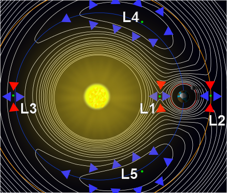

# Сфера Хилла
> 2019.09.20 [🚀](../index/index.md) [despace](index.md) → **[БНО](nnb.md)**, [Space](index.md)

[TOC]

---

> <small>**Сфера Хилла** — русскоязычный термин. **Hill sphere** — англоязычный эквивалент.</small>

**Сфера Хилла** — это пространство вокруг астрономического объекта (например, планеты) в котором он способен удерживать свой спутник, несмотря на притяжение объекта, вокруг которого обращается сам (например, звезды). В свою очередь, у спутника есть собственная сфера Хилла, и любой объект в её пределах будет стремиться стать спутником спутника, а не планеты. Таким образом, сфера Хилла описывает сферу гравитационного влияния тела на более мелкие тела с учётом пертурбаций, возникающих под воздействием более массивного тела.

Сфера Хилла располагается между [точками Лагранжа L1 и L2](l_points.md), лежащими на прямой, соединяющей центры двух тел. В этом направлении область гравитационного влияния подчинённого тела меньше всего, и это ограничивает размер сферы Хилла. За пределами этого расстояния орбита любого третьего тела, обращающегося вокруг подчинённого тела, будет частично пролегать за пределами сферы Хилла, и поэтому будет всё больше и больше подвергаться возмущению приливными силами центрального тела. В конечном итоге подчинённый объект перейдёт на орбиту центрального тела.

  
*Контурами изображены эффективные гравитационные потенциалы системы двух тел (на рисунке — Солнце и Земля) и центробежные силы во вращающейся системе координат, в которой Земля и Солнце неподвижны. Сферы Хилла — ограниченные кругами области вокруг Солнца и Земли.*

**Пример определения сферы**

Можно проиллюстрировать сферу Хилла на частном примере — Юпитер, обращающийся вокруг Солнца. Для каждой точки пространства можно высчитать сумму следующих трёх сил:

   - гравитационное притяжение Солнца,
   - гравитационное притяжение Юпитера,
   - центробежная сила, воздействующая на частицу в данной точке, обращающуюся вокруг Солнца с той же частотой, что и Юпитер.

Сферой Хилла для Юпитера будет наибольшая сфера с центром в Юпитере, в пределах которой сумма этих трёх сил всегда направлена к Юпитеру. В более общих терминах, это сфера вокруг подчинённого тела, обращающегося вокруг главного тела, в которой результирующая сила является центростремительной силой, направленной к подчинённому телу. Таким образом, в данном примере сфера Хилла описывает внешнюю границу, на которой более мелкие объекты, такие как спутники планет или искусственные спутники, могут находиться на стабильной орбите вокруг Юпитера, а не перейти на эллиптическую орбиту вокруг Солнца.

## Размер сфер

|*Планета*|*Сфера Хилла, км*|
|:--|:--|
|[Venus](venus.md)|1 000 000|
|[Земля](earth.md)|1 500 000|
|[Луна](moon.md)|66 000|
|[Марс](mars.md)|950 000|
|[Меркурий](mercury.md)|220 000|
|[Нептун](neptune.md)|116 000 000|
|[Плутон](pluto.md)|7 600 000|
|[Сатурн](saturn.md)|65 500 000|
|[Уран](uranus.md)|70 100 000|
|[Юпитер](jupiter.md)|53 200 000|

The following logarithmic plot shows the Hill radius (in km) of some bodies of the Solar System:

## Docs & links (TRANSLATEME ALREADY)
|Navigation|
|:--|
|**[FAQ](faq.md)**【**[SCS](scs.md)**·КК, **[SC (OE+SGM)](sc.md)**·КА】**[CON](contact.md)·[Pers](person.md)**·Контакт, **[Ctrl](control.md)**·Упр., **[Doc](doc.md)**·Док., **[Drawing](drawing.md)**·Чертёж, **[EF](ef.md)**·ВВФ, **[Error](error.md)**·Ошибки, **[Event](event.md)**·События, **[FS](fs.md)**·ТЭО, **[HF&E](hfe.md)**·Эрго., **[KT](kt.md)**·КТ, **[N&B](nnb.md)**·БНО, **[Project](project.md)**·Проект, **[QM](qm.md)**·БКНР, **[R&D](rnd.md)**·НИОКР, **[SI](si.md)**·СИ, **[Test](test.md)**·ЭО, **[TRL](trl.md)**·УГТ, **[Way](way.md)**·Пути|
|*Sections & pages*|
|**`Баллистико‑навигационное обеспечение (БНО):`**  [SPICE](spice.md)・ [Апоцентр и перицентр](apopericentre.md)・ [Гравманёвр](gravass.md)・ [Кеплеровы элементы](keplerian.md)・ [Космическая скорость](esc_vel.md)・ [Сфера Хилла](hill_sphere.md)・ [Терминатор](terminator.md)・ [Точки Лагранжа](l_points.md)・ [Эффект Оберта](oberth_eff.md)|
|**【[Space](index.md)】**  [Apparent magnitude](app_mag.md)・ [Astro.object](aob.md)・ [Blue Marble](earth.md)・ [Cosmic rays](cr.md)・ [Ecliptic](ecliptic.md)・ [Escape velocity](esc_vel.md)・ [Health](health.md)・ [Hill sphere](hill_sphere.md)・ [Information](info.md)・ [Lagrangian points](l_points.md)・ [Near space](near_space.md)・ [Pale Blue Dot](earth.md)・ [Parallax](parallax.md)・ [Point Nemo](earth.md)・ [Silver Snoopy award](silver_snoopy_award.md)・ [Solar constant](solar_const.md)・ [Terminator](terminator.md)・ [Time](time.md)・ [Wormhole](wormhole.md) ┊ ··•·· **Solar system:** [Ariel](ariel.md)・ [Callisto](callisto.md)・ [Ceres](ceres.md)・ [Deimos](deimos.md)・ [Earth](earth.md)・ [Enceladus](enceladus.md)・ [Eris](eris.md)・ [Europa](europa.md)・ [Ganymede](ganymede.md)・ [Haumea](haumea.md)・ [Iapetus](iapetus.md)・ [Io](io.md)・ [Jupiter](jupiter.md)・ [Makemake](makemake.md)・ [Mars](mars.md)・ [Mercury](mercury.md)・ [Moon](moon.md)・ [Neptune](neptune.md)・ [Nereid](nereid.md)・ [Nibiru](nibiru.md)・ [Oberon](oberon.md)・ [Phobos](phobos.md)・ [Pluto](pluto.md)・ [Proteus](proteus.md)・ [Rhea](rhea.md)・ [Saturn](saturn.md)・ [Sedna](sedna.md)・ [Solar day](solar_day.md)・ [Sun](sun.md)・ [Titan](titan.md)・ [Titania](titania.md)・ [Triton](triton.md)・ [Umbriel](umbriel.md)・ [Uranus](uranus.md)・ [Venus](venus.md)|

   1. Docs: …
   1. <…>
