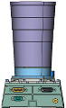

# Horus
> 2019.07.25 [🚀](../index/index.md) [despace](index.md) → **[ЗД](sensor.md)**

[TOC]

---

> <small>**Horus** — англоязычный термин, не имеющий аналога в русском языке. **Хорус** — дословный перевод с английского на русский.</small>

**Horus** — звёздный датчик для определения и выдачи в [GNC](gnc.md) информации о положении и угловых скоростях системы координат (СК) изделия относительно геоцентрической СК.  
Разработчик [Sodern](zz_sodern.md), EU. Разработано в 2019 году. Разработка.

|*Characteristics*|*[Value](si.md)  (Horus)*|
|:--|:--|
|Composition| |
|Consumption, W| |
|Dimensions, ㎜|140 × 140 × 240|
|[Interfaces](interface.md)|[MIL-STD-1553B](mil_std_1553.md)|
|[Lifetime](lifetime.md)/Resource, h(y)|НОО: 157 680 (18) / …|
|Mass, ㎏|5|
|[Overload](vibration.md), Grms| |
|[Rad.resist](ion_rad.md), ㏉ (㎭)| |
|[Reliability](qm.md) per [lifetime](lifetime.md)| |
|[Thermal range](tcs.md), ℃| |
|[TRL](trl.md)|7|
|[Voltage](voltage.md), V|20 ‑ 100|
|**【Specific】**|• • •|
|Accept. ang. speed, °/s|2|
|Accuracy|2″|
|Back. brightn., ㏅/m²| |
|Delay, s, ≤| |
|[FOV](fov.md), °| |
|Identification time, s|10|
|Lens| |
|Output data| |
|Ready mode| |
|Refresh rate, ㎐| |
| ||

**Notes:**

   1. …
   1. **Applicability:**
      - …

 

## Docs & links (TRANSLATEME ALREADY)
|Navigation|
|:--|
|**[FAQ](faq.md)**【**[SCS](scs.md)**·КК, **[SC](sc.md)**·КА, **[OE](oe.md)**·БА, **[SGM](sgm.md)**·КММ】**[CON](contact.md)·[Pers](person.md)**·Контакт, **[Ctrl](control.md)**·Упр., **[Doc](doc.md)**·Док., **[EF](ef.md)**·ВВФ, **[Error](error.md)**·Ошибки, **[Event](event.md)**·События, **[FS](fs.md)**·ТЭО, **[HF&E](hfe.md)**·Эрго., **[KT](kt.md)**·КТ, **[Model](model.md)**·Модель, **[N&B](nnb.md)**·БНО, **[Patent](патент.md)**·Патент, **[Project](project.md)**·Проект, **[QM](qm.md)**·БКНР, **[R&D](rnd.md)**·НИОКР, **[SI](si.md)**·СИ, **[Test](test.md)**·ЭО, **[Timeline](timeline.md)**·ЦГМ, **[TRL](trl.md)**·УГТ|
|*Sections & pages*|
|**`Звёздный датчик (ЗД):`**  [Видимая звёздная величина](app_mag.md)・ [ПЗр](fov.md) • • •  **Европа:** [ASTRO 15](astro_15.md) (6.15)・ [Hydra](hydra.md) (4.6)・ [ASTRO 10](astro_10.md) (3.8)・ [A-STR](a_str.md) (3.55)・ [AA-STR](aa_str.md) (2.6)・ [HE-5AS](he_5as.md) (2.2)・ [ASTRO APS](astro_aps.md) (2)・ [Horus](horus.md) (1.6)・ [T2](t2.md) (0.8)・ [T1](t1.md) (0.6 ‑ 1)・ [Auriga](auriga.md) (0.21)  ▮  **РФ:** [348К](348k.md) (3.45)・ [360К](360k.md) ()・ [АД-1](ad_1.md) (3.8)・ [БОКЗ-МФ](bokz_mf.md) (2.8)・ [мБОКЗ-2](мбокз_2.md) (1.5)・ [SX-SR-MicroBOKZ](sx_sr_microbokz.md) (0.5)  ▮  **США:** [HAST](hast.md) (7.7)・ [CT-2020](ct_2020.md) (3)・ [µSTAR](mustar.md) (2.1)・ [MIST](mist.md) (0.55) |

   1. Docs:
      - [Sodern presentation 2017 ❐](f/sensor/sodern_presentation_2017.pdf)
   1. Notable interwikies — …
   1. <…>
