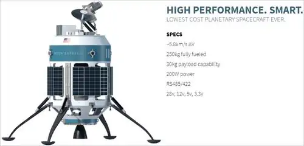
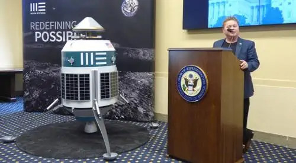
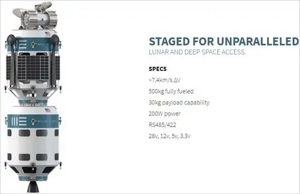
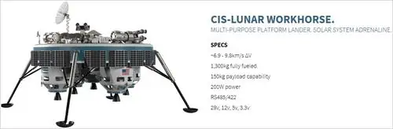

# Гипотетический: MEAEM
> 2019.05.12 [🚀](../index/index.md) [despace](index.md) → [Луна](moon.md), **[Project](project.md)**

[TOC]

---

> <small>**Moon Express Analogue with near‑Earth Maneuver (MEAEM)** — русскоязычный термин, не имеющий аналога в английском языке. **Moon Express Analogue with near‑Earth Maneuver (MEAEM)** — дословный перевод с русского на английский.</small>

**Moon Express Analogue with near‑Earth Maneuver (MEAEM)** — КА, аналог Moon Express MX‑1. Малый перелётно‑посадочный лунный аппарат.

**Задача:** создать аналог КА Moon Express MX‑1.

## Исходные данные
Для справки: <https://forum.nasaspaceflight.com/index.php?:topic=33428.140>

Характеристики Moon Express MX‑1 (по общедоступным материалам):

   1. полная масса КА — 250 кг;
   1. сухая масса КА — 12 кг;
   1. масса ПН — 30 кг;
   1. старт на РН [Electron](electron.md), выведение на ОИСЗ высотой 200 км;
   1. суммарная ΔV = 5 800 m/s;
   1. электрическая мощность 200 Вт;
   1. двухкомпонентный маршевый двигатель на топливе «керосин + перекись водорода», напечатанный на 3D‑принтере;
   1. повсеместное использование композитных материалов.

| |
|:--|
||
||
||
||

## Варианты исполнения
   1. Из композитных материалов и БА для кубсатов.

## Решение

### Вариант 1
**Таблица.** Лимитная массово‑электрическая сводка.

|*Наименование*|<small>*Масса, кг*</small>|<small>*Эл.п., Вт*</small>|<small>*Стоимость, $*</small>|*Примечания*|
|:--|:--|:--|:--|:--|
|**1. КА**|**13**|**70**| | |
|·   1.1 БКС|   0.5|   —| | |
|·   1.2 БКУ|   1.29|   1.38|—| |
|·      Гироскоп|      0.72|      0.76|24 300|<small><https://www.cubesatshop.com/product/cubecontrol/></small>, <small><https://www.cubesatshop.com/product/cubewheel-large/></small>|
|·      ЗД|      0.49|      0.4|160 000|<small><https://www.cubesatshop.com/product/nst-1-nano-star-tracker/></small>|
|·      СД|      0.01|      0.02|6 600|<small><https://www.cubesatshop.com/product/nss-cubesat-sun-sensor/></small>|
|·      СЭА|      —|      —|—|Включено в ЦВМ|
|·      ТМС|      —|      —|—|Включено в ЦВМ|
|·      ЦВМ|      0.07|      0.2|4 500|<small><https://www.cubesatshop.com/product/cube-computer/></small>|
|·   1.3 БРК|   0.175|   4.06|—| |
|·      АФС|      0.1|      0.06|5 300|<small><https://www.cubesatshop.com/product/dipole-antenna-system/></small>|
|·      ППУ|      0.075|      4|8 500|<small><https://www.cubesatshop.com/product/isis-uhf-downlink-vhf-uplink-full-duplex-transceiver/></small>|
|·   1.4 ДУ|   3.4|   48.4|—| |
|·      Баки|      1.1|      —| | |
|·      Двигатели|      1.2|      38.4| |1 × мод. [С5.146](engine_lst.md)|
|·      КММ ДУ|      0.3|      —| | |
|·      Привод двиг.|      0.5|      10| | |
|·   1.5 КММ|   6.04|   —|—| |
|·      БС|      2.94|      —|510 000|<small><https://www.cubesatshop.com/product/solar-panels/></small>, по 5 шт. на 6 гранях|
|·      КММ КА|      2|      —| | |
|·      Крепёж БКС|      0.1|      —| | |
|·      [ПУС](lag.md)|      1|      —| | |
|·   1.6 СОТР|   0.8|   10|—| |
|·      [ТТ](hp.md)|      0.3|      —| | |
|·      Радиаторы|      0.4|      —| | |
|·      Нагреватели|      0.1|      10| | |
|·   1.7 СЭС|   0.55|   —|—| |
|·      АБ|      0.55|      —|8 100|<small><https://www.clyde.space/products/40-cs-3u-power-bundle-b-eps-40whr-battery></small>|
|·      КАС|      —|      —|—|Включено в АБ|
|·   1.8 Резерв|   0.34|   6.16|—| |
|**2. ПН**|**23**|**20**|—| |
|**3. Заправка**|**214**|—|—| |
|·   3.1 Газ|   1|   —| | |
|·   3.2 Топливо|   213|   —| |(f/project/гипотетические:fuel-moon-express.py|См. расчёт заправки ❐]|
|*Итого:*|*250*|*90*|727 300| |

Пояснения:

   1. САС предполагается от 30 до 90 суток.
   1. В отличие от MX‑1, применяется всего 1 двигатель на приводе; для ориентации и стабилизации применяются двигатели‑маховики.
   1. Двигатель работает на АТ + НДМГ в связи с меньшим потребным давлением, а также в связи с тем, что АТ + НДМГ самовоспламеняющийся.
   1. Удельный импульс двигателя должен составлять 320 ‑ 322 s (в аналогичном С5.146 уд.импульс равен 315 с, и масса на 0.1 ‑ 0.5 ㎏ больше).
   1. Применяются компоненты для кубсатов, в основном, в бескорпусном исполнении.

 

## Docs & links (TRANSLATEME ALREADY)
|Navigation|
|:--|
|**[FAQ](faq.md)**【**[SCS](scs.md)**·КК, **[SC (OE+SGM)](sc.md)**·КА】**[CON](contact.md)·[Pers](person.md)**·Контакт, **[Ctrl](control.md)**·Упр., **[Doc](doc.md)**·Док., **[Drawing](drawing.md)**·Чертёж, **[EF](ef.md)**·ВВФ, **[Error](error.md)**·Ошибки, **[Event](event.md)**·События, **[FS](fs.md)**·ТЭО, **[HF&E](hfe.md)**·Эрго., **[KT](kt.md)**·КТ, **[N&B](nnb.md)**·БНО, **[Project](project.md)**·Проект, **[QM](qm.md)**·БКНР, **[R&D](rnd.md)**·НИОКР, **[SI](si.md)**·СИ, **[Test](test.md)**·ЭО, **[TRL](trl.md)**·УГТ, **[Way](way.md)**·Пути|
|*Sections & pages*|
|**【】**  <mark>NOCAT</mark>|

   1. Docs: …
   1. <…>
