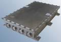

# HSXBDT
> 2019.08.06 ┊ **[🚀](../index/index.md) [despace](index.md)** → **[Радиосвязь](comms.md)**

[TOC]

---

> <small>*Термины:* **SAIT High‑speed X‑band Downlink Transmitter (HSXBDT)** — англоязычный термин, не имеющий аналога в русском языке. **Высокоскоростной радиопередатчик X-диапазона НПП Саит (HSXBDT)** — дословный перевод с английского на русский.</small>

**SAIT High‑speed X‑band Downlink Transmitter (HSXBDT)** — радиопередатчик.  
*Разработчик:* [НПП Саит](zz_sait_ltd.md). Разработано ранее 2016 года активное применение

||
|:--|
|   |

<small>

|*•    Характеристика    •*|*[Значение](si.md) <small>(HSXBDT)</small>*|
|:--|:--|
|[УГТ](trl.md)| 9  |
|Вид модуляции| QPSK, 8PSK, 16APSK и 32APSK  |
|Время непр. работы, ч|   |
|Вых. мощность, Вт| 8  |
|Дальность, км|   |
|[Диапазон частот](rf.md), Гц| X: 8 225 000 000 (настройка 8.1 ‑ 8.5 ГГц)  |
|Нестаб. частоты| ±4 ppm  |
|[Скорость](битрейт.md), bit/s| до 520 Мб/с (CCSDS), до 880 Мб/с (DVB-S2)  |
|Структура сигнала|   |
|**Etc:**|• • •|
|[ВБР](rams.md) за САС| 0.9392  |
|Габариты, Д×Ш×В, мм| 230 × 154 × 45  |
|Интерфейсы| Customizable LVDS. Two ports with 4 pairs each (clock input/output, data, optional enable). RS-422 or [MIL-STD-1553](mil_std_1553b.md)  |
|Mass, kg| 1.8  |
|[Voltage](voltage.md), V| 27 (23 ‑ 34)  |
|Overload, g|   |
|[Rad.resist](ion_rad.md), Gy (rad)| 60 (6 000) при Al 1.5 г/cm², ≥40 МэВ·cm²/мг  |
|Resource, h (y)|   |
|[Lifetime](lifetime.md), h (y)| 61 320 (7)  |
|[Тепловой режим](tcs.md), °C| –20 ‑ +50, 2 датчика температуры  |
|Consumption, W| 70  |

</small>

 

## Примечания
   1. …

## Применяемость
   1. Аист‑2Д

 

## Docs & links (TRANSLATEME ALREADY)
|…°·•¹²³±×÷≤≥≈≠ ‑ −— ⎆✉ ❐“”’«»✔→✘☐☑├┕┆ 1 lb = 0.453592 kg; 1 g = 9.80665 m/s²|
|:--|
|<small>**[FAQ](faq.md)**, **[Cable](cable.md)**·БКС, **[Camera](camera.md)**·Камера, **[Comms](comms.md)**·Радиосв., **[Contact](contact.md)**·Контакт, **[Control](control.md)**·Управ., **[Doc](doc.md)**·Док., **[Doppler](doppler.md)**·ИСР, **[DS](ds.md)**·ЗУ, **[EB](eb.md)**·ХИТ, **[ECO](ecology.md)**·Экол., **[EF](ef.md)**·ВВФ, **[ElC](elc.md)**·ЭКБ, **[EMC](emc.md)**·ЭМС, **[Errors](error.md)**·Ошибки, **[Events](event.md)**·События, **[FS](fs.md)**·ТЭО, **[Fuel](fuel.md)**·Топливо, **[GNC](gnc.md)**·БКУ, **[GS](scs.md)**·НС, **[HF&E](hfe.md)**·Эргоном., **[IMU](imu.md)**·Гироскоп, **[Incubator](incubator.md)**·Инкуб., **[KT](kt.md)**·КТЕХ, **[LAG](lag.md)**·ПУC, **[LES](les.md)**·САСП, **[LS](ls.md)**·СЖО, **[LV](lv.md)**·РН, **[MAG](mag.md)**·Магнитом., **[MCC](mcc.md)**·ЦУП, **[Model](model.md)**·Модель, **[MSC](sc.md)**·ПКА, **[N&B](nnb.md)**·БНО, **[NR](nr.md)**·ЯР, **[OBC](obc.md)**·ЦВМ, **[OE](oe.md)**·БА, **[Patent](патент.md)**·Патент, **[Project](project.md)**·Проект, **[PS](ps.md)**·ДУ, **[QA](quality.md)**·QA, **[R&D](rnd.md)**·НИОКР, **[RAMS](rams.md)**·НиБ, **[Risk](risk.md)**·Риск, **[Robot](robotics.md)**·Робот, **[Rover](rover.md)**·Планетоход, **[RTG](rtg.md)**·РИТЭГ, **[RW](rw.md)**·ДМ, **[SARC](sarc.md)**·ПСК, **[Sensor](sensor.md)**·Датчик, **[SC](sc.md)**·КА, **[SCS](scs.md)**·КК, **[SGM](sgm.md)**·КММ, **[SI](si.md)**·СИ, **[Soft](soft.md)**·ПО, **[SP](sp.md)**·БС, **[Spaceport](spaceport.md)**·Космодром, **[SPS](sps.md)**·СЭС, **[SSS](sss.md)**·ГЗУ, **[TCS](tcs.md)**·СОТР, **[Test](test.md)**·ЭО, **[Timeline](timeline.md)**·Циклограмма, **[TMS](tms.md)**·ТМС, **[TOR](tor.md)**·ТЗ, **[TRL](trl.md)**·УГТ</small>|
|*Sections & pages*|
|**`Радиосвязь:`**  [CCSDS](ccsds.md) ┊ [Антенна](antenna.md) ┊ [АФУ](afdev.md) ┊ [Битрейт](bitrate.md) ┊ [ВОЛП](ofts.md) ┊ [ДНА](дна.md) ┊ [Диапазоны частот](rf.md) ┊ [Зрение](view.md) ┊ [Интерферометр](interferometer.md) ┊ [Информация](info.md) ┊ [КНД](directivity.md) ┊ [Код Рида‑Соломона](rsco.md) ┊ [КПДА](antenna_ap.md) ┊ [КСВ](swr.md) ┊ [КУ](ку.md) ┊ [ЛКС, АОЛС, FSO](fso.md) ┊ [Несущий сигнал](carrwave.md) ┊ [ПНА, ПОНА, ПСНА](aiad.md) ┊ [Помехи](emi.md) (EMI, RFI) ┊ [Последняя миля](last_mile.md) ┊ [Регламент радиосвязи](rr.md) ┊ [СИТ](etedp.md) ┊ [Фидер](feeder.md)  • • •  **РФ:** [БА КИС](ба_кис.md) (21) ┊ [БРК](brk_lav.md) (12) ┊ [РУ ПНИ](ру_пни.md) () ┊ [HSXBDT](hsxbdt.md) (1.8) ┊ [CSXBT](csxbt.md) (0.38) ┊ [ПРИЗЫВ-3](prizyv_3.md) (0.17) *([ПРИЗЫВ-1](prizyv_1.md) (0.075))*|

   1. Docs:
      - [HSXBDT Datasheet ❐](f/comms/h/hsxbdt_datasheet.pdf)
   1. Notable interwikies — …
   1. <…>
