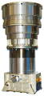
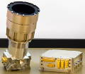
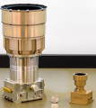

# Hydra
> 2019.07.24 **[🚀](../index/index.md) [despace](index.md)** → **[ЗД](sensor.md)**

[TOC]

---

> <small>*Термины:* **Hydra** — англоязычный термин, не имеющий аналога в русском языке. **Гидра** — дословный перевод с английского на русский.</small>

**Hydra** — звёздный датчик для определения и выдачи в [GNC](gnc.md) информации о положении и угловых скоростях системы координат (СК) изделия относительно геоцентрической СК.  
*Разработчик:* [Sodern](zz_sodern.md), EU. Разработано в 2012 году получен УГТ 9. Активное применение.

<small>

|*•    Характеристика    •*|*[Значение](si.md) <small>(Hydra / Hydra-M)</small>*|*[Значение](si.md) <small>(Hydra-TC)</small>*|
|:--|:--|:--|
|[УГТ](trl.md)|   |   |
|Время опознавания, с| 1.5  | 2.5  |
|Вых. информация|   |   |
|Допуст. угл. скор., °/с| 10  | 7  |
|Запаздывание, с, ≤|   |   |
|Исполнение| 2 ОБ (до 3), 1 БЭ  | 2 ОБ (до 3), 1 БЭ  |
|Объектив|   |   |
|Поле зрения, °| 18.5  | 18.5  |
|Режим готовности|   |   |
|Точность| 2.1″  | 3.1″  |
|Частота обновл., Гц| 16 ‑ 30  | 10 ‑ 30  |
|Яркость фона, кд/m²|   |   |
|**Etc:**|• • •|• • •|
|[ВБР](rams.md) за САС| 0.99968 (200 FIT)  | 0.99968 (200 FIT)  |
|Dimensions, L×W×H, mm| ∅147 × 283 ОБ, 170 × 146 × 103 БЭ  | ∅147 × 283 ОБ, 194 × 166 × 159 БЭ  |
|Интерфейсы| RS-422, [MIL-STD-1553B](mil_std_1553b.md)  | RS-422, [MIL-STD-1553B](mil_std_1553b.md)  |
|Mass, kg| 4.6 (2 ОБ по 1.4, 1 БЭ по 1.8)  | 6.7 (2 ОБ по 1.4, 1 БЭ по 3.9)  |
|[Voltage](voltage.md), V| … (21 ‑ 52)  | … (21 ‑ 52)  |
|Перегрузки, gRMS| 28 случайные, 2 000 ударные  | 30 случайные, 2 350 ударные  |
|[Rad.resist](ion_rad.md), Gy (rad)|   |   |
|Resource, h (y)|   |   |
|[Lifetime](lifetime.md), h (y)| НОО: 87 600 (10)  ГСО: 157 680 (18)  | НОО: 87 600 (10)  ГСО: 157 680 (18)  |
|[Тепловой режим](tcs.md), ℃| −30 ‑ +60  | −30 ‑ +60  |
|Consumption, W| 8  | 8  |
||   |   |

</small>

 

## Примечания
Hydra is available in four different versions:

   - **Hydra** baseline, suited to all missions, optimized for earth-observation and science missions.
   - **Hydra-TC**, designed for hardened radiation env. Fully redundant EU version for 2 OH, GEO shielding.
   - **Hydra-M**, cost-optimized. Light LEO version for 1 or 2 OH without Thermo-Electric Cooler.
   - **Hydra-CP** (centralized), optimized for easy S/C accommodation. Software hosted into On-Board Computer.

||
|:--|
|   и **[Видео ❐](f/sensor/h/hydra_logo_sodern.mkv)**  |

## Применяемость
   1. …

 

## Docs & links (TRANSLATEME ALREADY)
|…°·•¹²³±×÷≤≥≈≠ ‑ −— ⎆✉ ❐“”’«»✔→✘☐☑├┕┆ 1 lb = 0.453592 kg; 1 g = 9.80665 m/s²|
|:--|
|<small>**[FAQ](faq.md)**, **[Cable](cable.md)**·БКС, **[Camera](camera.md)**·Камера, **[Comms](comms.md)**·Радиосв., **[Contact](contact.md)**·Контакт, **[Control](control.md)**·Управ., **[Doc](doc.md)**·Док., **[Doppler](doppler.md)**·ИСР, **[DS](ds.md)**·ЗУ, **[EB](eb.md)**·ХИТ, **[ECO](ecology.md)**·Экол., **[EF](ef.md)**·ВВФ, **[ElC](elc.md)**·ЭКБ, **[EMC](emc.md)**·ЭМС, **[Errors](error.md)**·Ошибки, **[Events](event.md)**·События, **[FS](fs.md)**·ТЭО, **[Fuel](fuel.md)**·Топливо, **[GNC](gnc.md)**·БКУ, **[GS](scs.md)**·НС, **[HF&E](hfe.md)**·Эргоном., **[IMU](imu.md)**·Гироскоп, **[Incubator](incubator.md)**·Инкуб., **[KT](kt.md)**·КТЕХ, **[LAG](lag.md)**·ПУC, **[LES](les.md)**·САСП, **[LS](ls.md)**·СЖО, **[LV](lv.md)**·РН, **[MAG](mag.md)**·Магнитом., **[MCC](mcc.md)**·ЦУП, **[Model](model.md)**·Модель, **[MSC](sc.md)**·ПКА, **[N&B](nnb.md)**·БНО, **[NR](nr.md)**·ЯР, **[OBC](obc.md)**·ЦВМ, **[OE](oe.md)**·БА, **[Patent](патент.md)**·Патент, **[Project](project.md)**·Проект, **[PS](ps.md)**·ДУ, **[QA](quality.md)**·QA, **[R&D](rnd.md)**·НИОКР, **[RAMS](rams.md)**·НиБ, **[Risk](risk.md)**·Риск, **[Robot](robotics.md)**·Робот, **[Rover](rover.md)**·Планетоход, **[RTG](rtg.md)**·РИТЭГ, **[RW](rw.md)**·ДМ, **[SARC](sarc.md)**·ПСК, **[Sensor](sensor.md)**·Датчик, **[SC](sc.md)**·КА, **[SCS](scs.md)**·КК, **[SGM](sgm.md)**·КММ, **[SI](si.md)**·СИ, **[Soft](soft.md)**·ПО, **[SP](sp.md)**·БС, **[Spaceport](spaceport.md)**·Космодром, **[SPS](sps.md)**·СЭС, **[SSS](sss.md)**·ГЗУ, **[TCS](tcs.md)**·СОТР, **[Test](test.md)**·ЭО, **[Timeline](timeline.md)**·Циклограмма, **[TMS](tms.md)**·ТМС, **[TOR](tor.md)**·ТЗ, **[TRL](trl.md)**·УГТ</small>|
|*Sections & pages*|
|**`Звёздный датчик (ЗД):`**  [Видимая звёздная величина](app_mag.md) ┊ [ПЗр](fov.md) • • •  **Европа:** [ASTRO 15](astro_15.md) (6.15) ┊ [Hydra](hydra.md) (4.6) ┊ [ASTRO 10](astro_10.md) (3.8) ┊ [A-STR](a_str.md) (3.55) ┊ [AA-STR](aa_str.md) (2.6) ┊ [HE-5AS](he_5as.md) (2.2) ┊ [ASTRO APS](astro_aps.md) (2) ┊ [Horus](horus.md) (1.6) ┊ [T2](t2.md) (0.8) ┊ [T1](t1.md) (0.6 ‑ 1) ┊ [Auriga](auriga.md) (0.21)  ▮  **РФ:** [348К](348k.md) (3.45) ┊ [360К](360k.md) () ┊ [АД-1](ad_1.md) (3.8) ┊ [БОКЗ-МФ](bokz_mf.md) (2.8) ┊ [мБОКЗ-2](мбокз_2.md) (1.5) ┊ [SX-SR-MicroBOKZ](sx_sr_microbokz.md) (0.5)  ▮  **США:** [HAST](hast.md) (7.7) ┊ [CT-2020](ct_2020.md) (3) ┊ [µSTAR](mustar.md) (2.1) ┊ [MIST](mist.md) (0.55)  |

   1. Docs:
      - [Hydra baseline datasheet ❐](f/sensor/h/hydra_baseline_datasheet.pdf)
      - [Hydra-M datasheet ❐](f/sensor/h/hydra_m_datasheet.pdf)
      - [Hydra-TC datasheet ❐](f/sensor/h/hydra_tc_datasheet.pdf)
      - [Sodern presentation 2017 ❐](f/sensor/sodern_presentation_2017.pdf)
   1. Notable interwikies — …
   1. <http://www.sodern.com/website/en/ref/Hydra_316.html>

