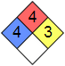

# Hydrazine
> 2021.10.25 [🚀](../index/index.md) [despace](index.md) →  <mark>NOCAT</mark>

[TOC]

---

> <small>**Hydrazine** — EN term. **Гидразин** — RU analogue.</small>

**Hydrazine** is an inorganic compound with the chemical formula N₂H₄. It is a simple pnictogen hydride, and is a colourless flammable liquid with an ammonia-like odour.

|*Characteristics*|*Description*|
|:--|:--|
|Систематическое наименование|Гидразин, диамид|
|[Токсичность](nfpa_704.md)|чрезвычайно токсичен, требуется нейтрализация  |
|Хим. формула|N₂H₄|
|**【Физические свойства】**|—|
|Кинематическая вязкость| |
|Молярная масса|32.05 г/моль|
|Плотность|1 010 ㎏/m³|
|Состояние|жидкость|
|Энергия ионизации|8.93 ± 0.01 эВ|
|**【Термические свойства】**|—|
|Давление пара|10 ± 1 мм.рт.ст.|
|Т. кип.|114 ℃|
|Т. плав.|2 ℃|
|Энтальпия образования| |
|**【Топливо】**|—|
|Fuel — combustion products|H₂, N₂|
|Temper. — comb. chamber, К (℃)|653 ‑ 1 273 (380 ‑ 1 000)|

## Docs & links
|Navigation|
|:--|
|**[FAQ](faq.md)**【**[SCS](scs.md)**·КК, **[SC (OE+SGM)](sc.md)**·КА】**[CON](contact.md)·[Pers](person.md)**·Контакт, **[Ctrl](control.md)**·Упр., **[Doc](doc.md)**·Док., **[EF](ef.md)**·ВВФ, **[Error](error.md)**·Ошибки, **[Event](event.md)**·События, **[FS](fs.md)**·ТЭО, **[HF&E](hfe.md)**·Эрго., **[KT](kt.md)**·КТ, **[Model](model.md)**·Модель, **[N&B](nnb.md)**·БНО, **[Project](project.md)**·Проект, **[QM](qm.md)**·БКНР, **[R&D](rnd.md)**·НИОКР, **[SI](si.md)**·СИ, **[Test](test.md)**·ЭО, **[TRL](trl.md)**·УГТ, **[Way](way.md)**·Пути|
|*Sections & pages*|
|**【】**  <mark>NOCAT</mark>|

   1. Docs: …
   1. <…>
